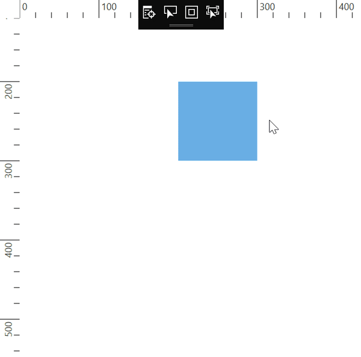
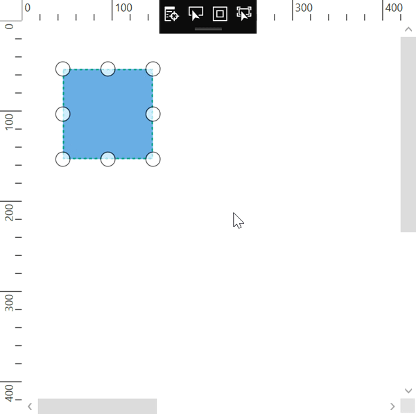
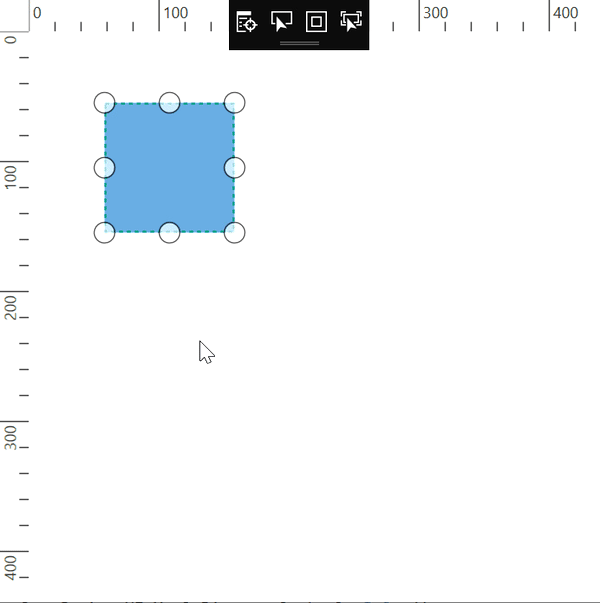

# Scroll Limit in WPF Diagram (SfDiagram)

The scroll limit allows you to define the scrollable region of the Diagram while mouse scrolling on the page. The `ScrollLimit` property of scroll settings helps to limit the scrolling area. It includes the following options:

* Infinity: Allows you to scroll in all directions without any restriction.
* Diagram: Allows you to scroll within the Diagram content.
* Limited: Allows you to scroll within the specified area.

The default operation is `Diagram`.



<!--Initialize the Sfdiagram-->
<syncfusion:SfDiagram x:Name="diagram">
    <!--Initialize the scroll setting class with scroll limit-->
    <syncfusion:SfDiagram.ScrollSettings>
        <syncfusion:ScrollSettings ScrollLimit="Diagram"/>
    </syncfusion:SfDiagram.ScrollSettings>
</syncfusion:SfDiagram>


//Initialize the SfDiagram
SfDiagram diagram = new SfDiagram();
//Initialize the scroll settings with scroll limit
diagram.ScrollSettings = new ScrollSettings()
{
    ScrollLimit = ScrollLimit.Diagram,
};



## Scrollable area

You can restrict scrolling beyond any particular rectangle area by using the `ScrollableArea` property of ScrollSettings. To restrict scrolling beyond any custom region,you have to set the `ScrollLimit` to Limited. The default value is Rect.Empty.



<!--Initialize the Sfdiagram-->
<syncfusion:SfDiagram x:Name="diagram">
    <!--Initialize the scroll setting class with scroll limit and scrollable area values-->
    <syncfusion:SfDiagram.ScrollSettings>
        <syncfusion:ScrollSettings ScrollLimit="Limited" ScrollableArea="0,0,1500,1500"/>
    </syncfusion:SfDiagram.ScrollSettings>
</syncfusion:SfDiagram>


//Initialize the SfDiagram
SfDiagram diagram = new SfDiagram();
//Initialize the scroll settings with scroll limit and scrollabl area value
diagram.ScrollSettings = new ScrollSettings()
{
    ScrollLimit = ScrollLimit.Limited,
    ScrollableArea = new Rect(0,0,1500,1500),
};



| ScrollLimit | Output |
|---|---|
| Infinity | |
| Diagram | |
| Limited   ScrollableArea = (0,0,1500,1500) |  |

## See Also
* [How to stop infinite scrolling?](https://www.syncfusion.com/kb/11477/how-to-stop-infinite-scrolling-in-wpf-diagramsfdiagram)
