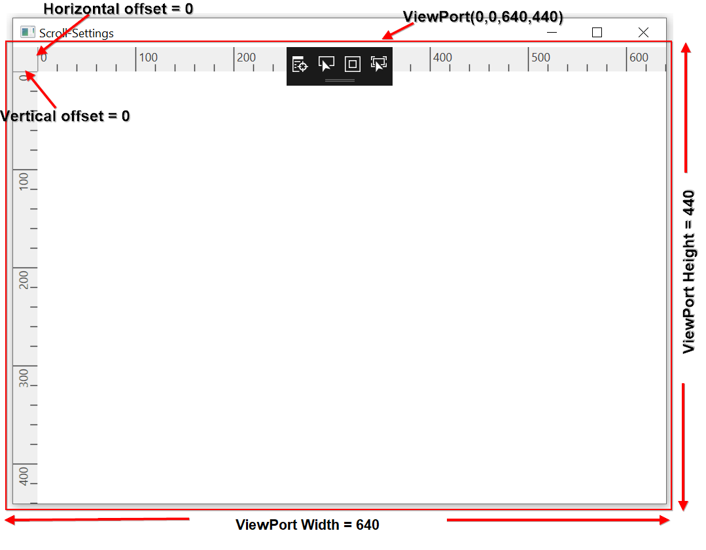
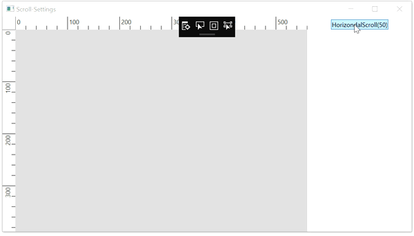
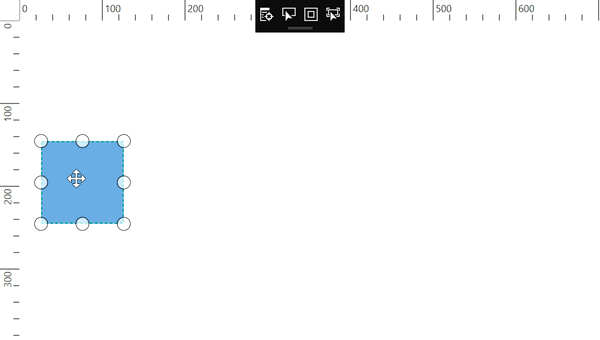

# Scroll-Settings in WPF Diagram (SfDiagram)

The diagram can be scrolled by using the vertical and horizontal scrollbars. In addition to the scrollbars, mouse wheel can be used to scroll the diagram. Diagram’s scroll settings allows you to read the current scroll status, view port size, current zoom, and zoom factor values.

## Get current scroll status

Diagram allows to get the scroll settings related values using the `ScrollInfo` property of `ScrollSettings` class.

* `CurrentZoom`: Specifies the zooming level of the diagram page.
* `Viewport`: Specifies the position and dimensions of diagram's visible area.
* `ViewportHeight`: Specifies the height of the view port area of diagram control.
* `ViewportWidth`: Specifies the width of the view port area of diagram control.
*  `HorizontalOffset`: Specifies the horizontal origin or left side origin of the view port of the diagram page.
* `VerticalOffset`: Specifies the vertical origin or top side of the view port of the diagram page.



//Initialize the SfDiagram
SfDiagram diagram = new SfDiagram();
//Get type values of ScrollInfo property in scroll settings class
double currentZoom = diagram.ScrollSettings.ScrollInfo.CurrentZoom;
double horizontalOffset = diagram.ScrollSettings.ScrollInfo.HorizontalOffset;
double verticalOffset = diagram.ScrollSettings.ScrollInfo.VerticalOffset;
Rect viewport = diagram.ScrollSettings.ScrollInfo.Viewport;
double viewportHeight = diagram.ScrollSettings.ScrollInfo.ViewportHeight;
double viewportWidth = diagram.ScrollSettings.ScrollInfo.ViewportWidth;



## How to update the scroll status

You can programmatically change scrolling amount at runtime by using the ZoomPan() method.

The `ScrollDelta` property of `ZoomPositionParameter` class allows you to specify how much the page should be scrolling. The `ZoomCommand` property is used to specify whether it is vertical scroll bar or horizontal scroll bar.



//Initialize the SfDiagram
SfDiagram diagram = new SfDiagram();
//Initialize the scroll settings with zoom to value and zoom command
diagram.ScrollSettings.ScrollInfo.ZoomPan(new ZoomPositionParameter
{
    ZoomCommand = ZoomCommand.VerticalScroll,
    ScrollDelta = 50,
});



| ScrollDelta value| ZoomCommand | Output |
|---|---|---|
| 50 | `ZoomCommand.VerticalScroll` | |
| 50 | `ZoomCommand.HorizondalScroll` | 

## AutoScroll

Autoscroll feature automatically scrolls the Diagram whenever the Node or Connector is moved beyond the boundary of the diagram. So that, it is always visible during dragging, resizing, and multiple selection operations. Autoscroll is automatically triggered when any one of the following is done towards the edges of the Diagram:

* Node dragging, resizing
* Connection editing
* Rubber band selection
* Label dragging

## Autoscroll border

The Autoscroll border is used to specify the maximum distance between the object and Diagram edge to trigger Autoscroll. The default value is set as 20 for all sides (left, right, top, and bottom) and it can be changed by using the `AutoScrollBorder` property of ScrollSettings.



<!--Initialize the Sfdiagram-->
<syncfusion:SfDiagram x:Name="diagram">
    <!--Initialize the scroll setting class with auto scroll border-->
    <syncfusion:SfDiagram.ScrollSettings>
        <syncfusion:ScrollSettings AutoScrollBorder="40"/>
    </syncfusion:SfDiagram.ScrollSettings>
</syncfusion:SfDiagram>


//Initialize the SfDiagram
SfDiagram diagram = new SfDiagram();
//Initialize the scroll settings with auto scroll border
diagram.ScrollSettings = new ScrollSettings()
{
    AutoScrollBorder = new Thickness(40),
};



Find the [Scroll Settings sample](https://github.com/SyncfusionExamples/WPF-Diagram-Examples/tree/master/Samples/ScrollSettings) to depict the Scroll Settings.
