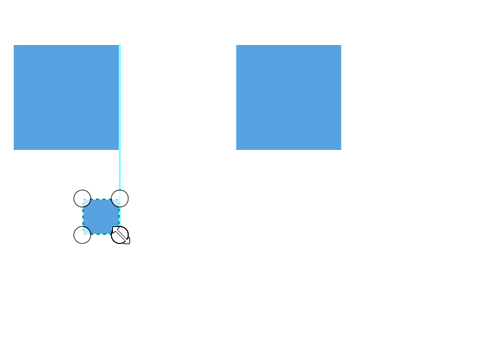
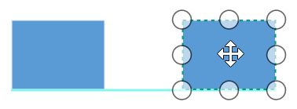
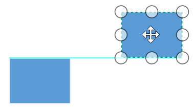
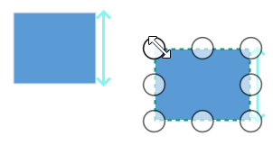
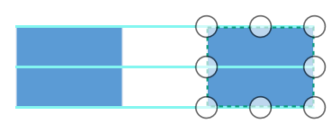
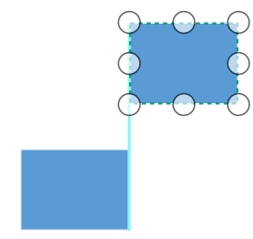
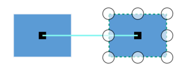
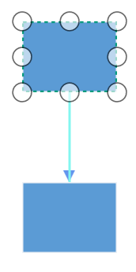
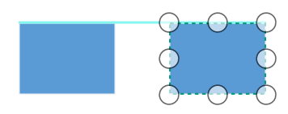
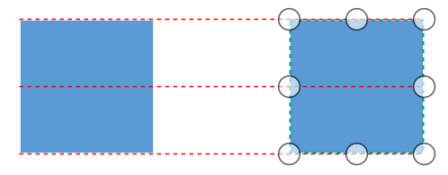

# Snapping in WPF Diagram (SfDiagram)

When you draw, resize, or move a diagramming element in the page, you can set it, so that it will align or snap to the nearest intersection in the page even when the grid is visible or not. However, you can control the alignment and snap-to capabilities of elements by using the snapping option of SfDiagram.

The `SnapSettings` class and its properties allows you to snap the shapes to the ruler subdivisions more easily.

Refer to the [SnapSettings](https://help.syncfusion.com/cr/wpf/Syncfusion.UI.Xaml.Diagram.SnapSettings.html) properties.

## Snap-to-objects

The snap-to-object provides visual cues to assist with aligning and spacing diagram. A node can be snapped with its neighboring objects based on certain alignments (same size and same position). Such alignments are visually represented as smart guide lines, which are in cyan shade color and its color code is #83F6F0.  

Refer to the members of [SnapToObject](https://help.syncfusion.com/cr/wpf/Syncfusion.UI.Xaml.Diagram.SnapToObject.html).

Snapping to objects can be enabled by assigning values to the `SnapToObject` property of `SnapSettings` class. Default value is None.



<!--Initialize SfDiagram-->
<syncfusion:SfDiagram x:Name="diagram">
  <!--Enables the SnapToObject value as All -->
  <syncfusion:SfDiagram.SnapSettings>
    <syncfusion:SnapSettings SnapToObject="All"/>
  </syncfusion:SfDiagram.SnapSettings>
</syncfusion:SfDiagram>



//Initialize SfDiagram
SfDiagram diagram = new SfDiagram();
//Enables the SnapToObject value as All
diagram.SnapSettings.SnapToObject = SnapToObject.All;




| Enum  | Value| Output |
|---|---|---|
|  SnapToObject|All | |
| | Bottom |  |
|  |BottomBottom |  |
|  |BottomTop |  |
|  |Height |  |
|  | HorizontalCenter|  |
|  | HorizontalSpacing|  |
|  | Left|   |
|  | LeftLeft|  |
|  | LeftRight|  |
|  |None |  |
|  |Port |  |
|  |Right |    |
|  | RightRight|  |
|  |RightLeft |  |
|  | Segment|   |
|  | Size|  |
|  | Top|    |
|  | TopTop|  |
|  |TopBottom |  |
|  |VerticalCenter |  |
|  | VerticalSpacing|  |
|  | Width|  |

## How to change the snap indication style

When snapping, cyan shade color indication lines will be shown. These indication lines styles can be customized by using the `SnapIndicatorStyle` property of SnapSettings class.




<!--Custom style for snap indicator-->

<!--Initialize SfDiagram-->
<syncfusion:SfDiagram x:Name="diagram">
  <!--Specify the snap indicator style -->
  <syncfusion:SfDiagram.SnapSettings>
    <syncfusion:SnapSettings SnapToObject="All" 
                             SnapIndicatorStyle="{StaticResource snapIndicatorStyle}" />
  </syncfusion:SfDiagram.SnapSettings>
</syncfusion:SfDiagram>





//Initialize SfDiagram
SfDiagram diagram = new SfDiagram();
//Custom style for Snap indicator
Style pathStyle = new Style(typeof(Shape));
pathStyle.Setters.Add(new Setter(Shape.StrokeProperty, new SolidColorBrush(Colors.Red)));
pathStyle.Setters.Add(new Setter(Shape.StrokeDashArrayProperty, new DoubleCollection() { 3, 3 }));
diagram.SnapSettings = new SnapSettings()
{
  //SnapConstraints = SnapConstraints.SnapToLines ,
  SnapToObject = SnapToObject.All,
  //Specifies custom snap indicator style
  SnapIndicatorStyle = pathStyle as Style,
};




## Snap to Lines

This feature allows the diagram objects to snap to the nearest interaction of gridlines while being dragged or resized. This feature enables easier alignment during layout or design.

Snapping to gridlines can be enabled or disabled with the [SnapConstraints](https://help.syncfusion.com/cr/wpf/Syncfusion.UI.Xaml.Diagram.SnapConstraints.html) property of SnapSettings. Default value is None.



<!--Initialize SfDiagram-->
<syncfusion:SfDiagram x:Name="diagram">
  <!--Enables the SnapConstraints value as SnapToLines -->
  <syncfusion:SfDiagram.SnapSettings>
    <syncfusion:SnapSettings SnapConstraints="SnapToLines,ShowLines"/>
  </syncfusion:SfDiagram.SnapSettings>
</syncfusion:SfDiagram>




//Initialize SfDiagram
SfDiagram diagram = new SfDiagram();
//Enables the SnapConstraints value as SnapToLines
diagram.SnapSettings.SnapConstraints = SnapConstraints.ShowLines | SnapConstraints.SnapToLines;




### Snapping on dock ports

Diagram allows snapping on dock ports while making new connection on it and dragging connection over dock ports.

Find the [Snapping sample](https://github.com/SyncfusionExamples/WPF-Diagram-Examples/tree/master/Samples/Snapping) to depict the Snapping.
