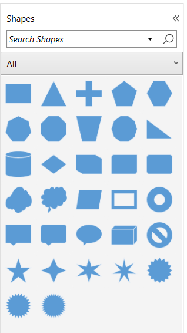

# Appearance of stencil in WPF Diagram (SfDiagram)

Stencil symbol titles, headers, names, tooltips, symbols display modes can be customized.

## Add a title to the Stencil

The [Title](https://help.syncfusion.com/cr/wpf/Syncfusion.UI.Xaml.Diagram.Stencil.Stencil.html#Syncfusion_UI_Xaml_Diagram_Stencil_Stencil_Title) property of the `Stencil` class is used to add the title to the stencil. Please find the following code example that explains how to provide the content to the stencil.




<!--Initialize the stencil-->
<Stencil:Stencil x:Name="stencil" Title="Shapes">
    <!--Initialize the stencil categories-->
    <Stencil:Stencil.Categories>
        <Stencil:StencilCategoryCollection>
            <!--Specify the basic shapes category with a title and resource key-->
            <Stencil:StencilCategory Title="Basic Shapes" Keys="{StaticResource BasicShapes}"/>
        </Stencil:StencilCategoryCollection>
    </Stencil:Stencil.Categories>
</Stencil:Stencil>


 


 

### Customize the Stencil title

The appearance of the title can be customized by using the  [TitleTemplate](https://help.syncfusion.com/cr/wpf/Syncfusion.UI.Xaml.Diagram.Stencil.Stencil.html#Syncfusion_UI_Xaml_Diagram_Stencil_Stencil_TitleTemplate) property of the `Stencil` class.

Please find the code example that explains how to add a title and its customization.



<DataTemplate x:Key="TitleTemplate">
  <StackPanel Orientation="Horizontal">
   <Image Source="/Image/Shapes.png"
      Width="15" Height="15" />
   <TextBlock Margin="5,0,0,0" HorizontalAlignment="Center" VerticalAlignment="Center" Text="Shapes" />
  </StackPanel>
</DataTemplate>

<!--Initialize the stencil-->
<Stencil:Stencil x:Name="stencil" Title="Shapes" TitleTemplate="{StaticResource TitleTemplate}>
    <!--Initialize the stencil categories-->
    <Stencil:Stencil.Categories>
        <Stencil:StencilCategoryCollection>
            <!--Specify the basic shapes category with a title and resource key-->
            <Stencil:StencilCategory Title="Basic Shapes" Keys="{StaticResource BasicShapes}"/>
        </Stencil:StencilCategoryCollection>
    </Stencil:Stencil.Categories>
</Stencil:Stencil>



 

## Customize the Symbol appearance

You can customize the appearance of a [Symbol](https://help.syncfusion.com/cr/wpf/Syncfusion.UI.Xaml.Diagram.Stencil.Symbol.html) by changing its style properties of Background, BorderThickness, BorderBrush, and Padding. The following code explains how to customize the appearance of the symbol.

The width and height properties of the symbol enable you to define the size of the symbols.





 <!--Style for Symbol-->


 


 

## Add the name and tooltip to the symbol

You can use the `Name` property of the [NodeViewModel](https://help.syncfusion.com/cr/wpf/Syncfusion.UI.Xaml.Diagram.NodeViewModel.html), [ConnectorViewModel](https://help.syncfusion.com/cr/wpf/Syncfusion.UI.Xaml.Diagram.ConnectorViewModel.html), [GroupViewModel](https://help.syncfusion.com/cr/wpf/Syncfusion.UI.Xaml.Diagram.GroupViewModel.html), and [SymbolViewModel](https://help.syncfusion.com/cr/wpf/Syncfusion.UI.Xaml.Diagram.Stencil.SymbolViewModel.html) to specify the identifying name to that element. Please find the following code example.




<Stencil:Stencil x:Name="stencil" ExpandMode="ZeroOrMore">
    <Stencil:Stencil.SymbolSource>
       <Syncfusion:SymbolCollection>
        <Syncfusion:NodeViewModel Key="Basic Shapes" UnitHeight="100" UnitWidth="100" Name="Triangle" Shape="{StaticResource Triangle}"></Syncfusion:NodeViewModel>
        <Syncfusion:SymbolViewModel Symbol="User" Key="Image" Name="User"
          SymbolTemplate="{StaticResource symboltemplate}" />
      </Syncfusion:SymbolCollection>
    </Stencil:Stencil.SymbolSource>
    <Stencil:Stencil.SymbolGroups>
      <Stencil:SymbolGroups>
      <!--Separate groups based on the key-->
         <Stencil:SymbolGroupProvider MappingName="Key" />
       </Stencil:SymbolGroups>
    </Stencil:Stencil.SymbolGroups>
</Stencil:Stencil>


 


### Custom tool tip to the symbol

When [SymbolsDisplayMode](https://help.syncfusion.com/cr/wpf/Syncfusion.UI.Xaml.Diagram.Stencil.Stencil.html#Syncfusion_UI_Xaml_Diagram_Stencil_Stencil_SymbolsDisplayMode) as `IconsOnly`, the [Name](https://help.syncfusion.com/cr/wpf/Syncfusion.UI.Xaml.Diagram.Stencil.SymbolViewModel.html#Syncfusion_UI_Xaml_Diagram_Stencil_SymbolViewModel_Name) property of the diagramming elements(NodeViewModel, ConnectorViewModel, GroupViewModel, and more) is displayed as a tooltip of that symbol while moving the mouse over that symbol but you can give your custom tooltip to that symbol also.

Please find the following code example.





 <!--Style for Symbol-->

<Stencil:Stencil x:Name="stencil" ExpandMode="ZeroOrMore">
    <Stencil:Stencil.SymbolSource>
       <Syncfusion:SymbolCollection>
        <Syncfusion:SymbolViewModel Symbol="User" Key="Image" Name="User"
          SymbolTemplate="{StaticResource symboltemplate}" />
        <Syncfusion:SymbolViewModel  Key="Template" Name="Diamond"
             SymbolTemplate="{StaticResource Diamond}" >
         <Syncfusion:SymbolViewModel.Symbol>
            <StackPanel Orientation="Vertical">
                <TextBlock   FontSize="14" FontWeight="Bold" Foreground="Black" Text="Diamond" Margin="0,0,0,10">
                </TextBlock>
                <TextBlock FontStyle="Italic" FontSize="12" Foreground="Black" Text="Drag onto the Page">
                </TextBlock>
            </StackPanel>
        </Syncfusion:SymbolViewModel.Symbol>
        </Syncfusion:SymbolViewModel>
      </Syncfusion:SymbolCollection>
    </Stencil:Stencil.SymbolSource>
    <Stencil:Stencil.SymbolGroups>
      <Stencil:SymbolGroups>
      <!--Separate groups based on the key-->
         <Stencil:SymbolGroupProvider MappingName="Key" />
       </Stencil:SymbolGroups>
    </Stencil:Stencil.SymbolGroups>
</Stencil:Stencil>

 


 

N> The `DataContext` of the `Symbol` will be any diagramming elements such as `NodeViewModel,` `ConnectorViewModel,` `GroupViewModel,` and `SymbolViewModel.`

## Stencil display mode

The Stencil view can be toggled between the expanded and compact modes by clicking the expander at the top right corner of the Stencil during run-time. You can do the same using the [DisplayMode](https://help.syncfusion.com/cr/wpf/Syncfusion.UI.Xaml.Diagram.Stencil.Stencil.html#Syncfusion_UI_Xaml_Diagram_Stencil_Stencil_DisplayMode) property of the `Stencil` class.

|DisplayMode|Description|Output|
|----------|-----------|--------|
| Compact | The stencil always shows as a narrow sliver which can be opened to full width | |
| Expanded | Specifies to update the Expanded state of the stencil ||

You can show or hide the expander icon by using the [ShowDisplayModeToggleButton](https://help.syncfusion.com/cr/wpf/Syncfusion.UI.Xaml.Diagram.Stencil.Stencil.html#Syncfusion_UI_Xaml_Diagram_Stencil_Stencil_ShowDisplayModeToggleButton) property of the `Stencil` class. 

## Symbols Display Mode

Stencil has option to control how the symbols should be displayed. By default, symbols will be displayed only by its icon. This can be changed by using [SymbolsDisplayMode](https://help.syncfusion.com/cr/wpf/Syncfusion.UI.Xaml.Diagram.Stencil.Stencil.html#Syncfusion_UI_Xaml_Diagram_Stencil_Stencil_SymbolsDisplayMode) property of `Stencil` class.



<!--Initialize the stencil-->
<Stencil:Stencil x:Name="stencil" Title="Shapes" SymbolsDisplayMode ="NamesUnderIcons">
</Stencil:Stencil>




//Defines symbols display mode as name under icons.
stencil.SymbolsDisplayMode = SymbolsDisplayMode.NamesUnderIcons;

//Defines symbols display mode as icons only.
stencil.SymbolsDisplayMode = SymbolsDisplayMode.IconsOnly;




|SymbolsDisplayMode|Description|Output|
|----------|-----------|-----------|
| IconsOnly | Symbols will be displayed only by its icon ||
| NamesUnderIcons | Symbols will be displayed by its icon under its name ||

N> `Name` property value will be displayed as tool tip of the symbols when `SymbolsDisplayMode` is IconsOnly.