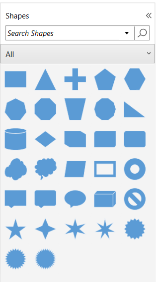
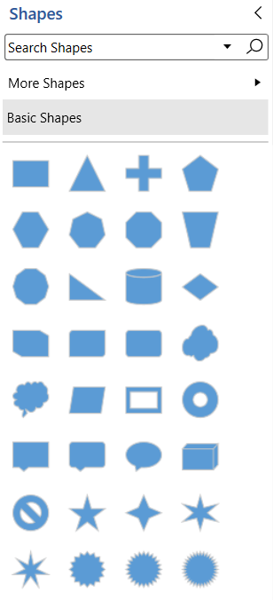

# Stencil Appearance in WPF SfDiagram

You can customize the Stencil title, headers, names, tooltips, and symbol display modes.

## Add a Title to the Stencil

Use the [`Title`](https://help.syncfusion.com/cr/wpf/Syncfusion.UI.Xaml.Diagram.Stencil.Stencil.html#Syncfusion_UI_Xaml_Diagram_Stencil_Stencil_Title) property to add a title to the Stencil. The [`TitleTemplate`](https://help.syncfusion.com/cr/wpf/Syncfusion.UI.Xaml.Diagram.Stencil.Stencil.html#Syncfusion_UI_Xaml_Diagram_Stencil_Stencil_TitleTemplate) property, when set, replaces the literal `Title` text with a custom `DataTemplate`.




<!--Initialize the stencil-->
<stencil:Stencil x:Name="stencil" Title="Shapes">
    <!--Initialize the stencil categories-->
    <stencil:Stencil.Categories>
        <stencil:StencilCategoryCollection>
            <!--Specify the basic shapes category with a title and resource key-->
            <stencil:StencilCategory Title="Basic Shapes" Keys="{StaticResource BasicShapes}"/>
        </stencil:StencilCategoryCollection>
    </stencil:Stencil.Categories>
</stencil:Stencil>


 


 

### Customize the Stencil Title

The appearance of the title can be customized by using the [`TitleTemplate`](https://help.syncfusion.com/cr/wpf/Syncfusion.UI.Xaml.Diagram.Stencil.Stencil.html#Syncfusion_UI_Xaml_Diagram_Stencil_Stencil_TitleTemplate) property of the `Stencil` class. When a `TitleTemplate` is set, it takes precedence over the `Title` string.

The following example adds a title and customizes its appearance.




<DataTemplate x:Key="TitleTemplate">
  <StackPanel Orientation="Horizontal">
   <Image Source="/Image/Shapes.png"
      Width="15" Height="15" />
   <TextBlock Margin="5,0,0,0" HorizontalAlignment="Center" VerticalAlignment="Center" Text="Shapes" />
  </StackPanel>
</DataTemplate>

<!--Initialize the stencil-->
<stencil:Stencil x:Name="stencil" Title="Shapes" TitleTemplate="{StaticResource TitleTemplate}>
    <!--Initialize the stencil categories-->
    <stencil:Stencil.Categories>
        <stencil:StencilCategoryCollection>
            <!--Specify the basic shapes category with a title and resource key-->
            <stencil:StencilCategory Title="Basic Shapes" Keys="{StaticResource BasicShapes}"/>
        </stencil:StencilCategoryCollection>
    </stencil:Stencil.Categories>
</stencil:Stencil>



 

## Customize the Symbol Appearance

Customize the appearance of a [Symbol](https://help.syncfusion.com/cr/wpf/Syncfusion.UI.Xaml.Diagram.Stencil.Symbol.html) using the `Background`, `BorderThickness`, `BorderBrush`, and `Padding` properties. Use the `Width` and `Height` properties to define the size of each symbol.





    <!-- Style for Symbol -->
    





## Add the Name and Tooltip to the Symbol

Use the `Name` property of each view model to set the identifying name of an element: [NodeViewModel](https://help.syncfusion.com/cr/wpf/Syncfusion.UI.Xaml.Diagram.NodeViewModel.html), [ConnectorViewModel](https://help.syncfusion.com/cr/wpf/Syncfusion.UI.Xaml.Diagram.ConnectorViewModel.html), [GroupViewModel](https://help.syncfusion.com/cr/wpf/Syncfusion.UI.Xaml.Diagram.GroupViewModel.html), or [SymbolViewModel](https://help.syncfusion.com/cr/wpf/Syncfusion.UI.Xaml.Diagram.Stencil.SymbolViewModel.html). The `Name` property supplies the tooltip text when `SymbolsDisplayMode` is `IconsOnly`; the underlying `Symbol` object carries the actual model.

N> The `Name` property supplies the tooltip string when `SymbolsDisplayMode` is `IconsOnly`; `Symbol` carries the actual model.




<stencil:Stencil x:Name="stencil" ExpandMode="ZeroOrMore">
    <stencil:Stencil.SymbolSource>
       <syncfusion:SymbolCollection>
        <syncfusion:NodeViewModel Key="Basic Shapes" UnitHeight="100" UnitWidth="100" Name="Triangle" Shape="{StaticResource Triangle}"></syncfusion:NodeViewModel>
        <syncfusion:SymbolViewModel Symbol="User" Key="Image" Name="User"
          SymbolTemplate="{StaticResource symboltemplate}" />
      </syncfusion:SymbolCollection>
    </stencil:Stencil.SymbolSource>
    <stencil:Stencil.SymbolGroups>
      <stencil:SymbolGroups>
      <!--Separate groups based on the key-->
         <stencil:SymbolGroupProvider MappingName="Key" />
       </stencil:SymbolGroups>
    </stencil:Stencil.SymbolGroups>
</stencil:Stencil>


 


### Custom Tool Tip

When [`SymbolsDisplayMode`](https://help.syncfusion.com/cr/wpf/Syncfusion.UI.Xaml.Diagram.Stencil.Stencil.html#Syncfusion_UI_Xaml_Diagram_Stencil_Stencil_SymbolsDisplayMode) is set to `IconsOnly`, the `Name` of each diagramming element (`NodeViewModel`, `ConnectorViewModel`, `GroupViewModel`, and others) is shown as the tooltip on hover. You can also provide a custom tooltip for each symbol.

The following example sets the tooltip per symbol via `ToolTipService` and via `SymbolViewModel.Symbol`:





 <!--Style for Symbol-->

<stencil:Stencil x:Name="stencil" ExpandMode="ZeroOrMore">
    <stencil:Stencil.SymbolSource>
       <syncfusion:SymbolCollection>
        <syncfusion:SymbolViewModel Symbol="User" Key="Image" Name="User"
          SymbolTemplate="{StaticResource symboltemplate}" />
        <syncfusion:SymbolViewModel  Key="Template" Name="Diamond"
             SymbolTemplate="{StaticResource Diamond}" >
         <syncfusion:SymbolViewModel.Symbol>
            <StackPanel Orientation="Vertical">
                <TextBlock   FontSize="14" FontWeight="Bold" Foreground="Black" Text="Diamond" Margin="0,0,0,10">
                </TextBlock>
                <TextBlock FontStyle="Italic" FontSize="12" Foreground="Black" Text="Drag onto the Page">
                </TextBlock>
            </StackPanel>
        </syncfusion:SymbolViewModel.Symbol>
        </syncfusion:SymbolViewModel>
      </syncfusion:SymbolCollection>
    </stencil:Stencil.SymbolSource>
    <stencil:Stencil.SymbolGroups>
      <stencil:SymbolGroups>
      <!--Separate groups based on the key-->
         <stencil:SymbolGroupProvider MappingName="Key" />
       </stencil:SymbolGroups>
    </stencil:Stencil.SymbolGroups>
</stencil:Stencil>

 


 

N> When applied through a style, the `DataContext` of the Symbol is one of the underlying diagramming elements: `NodeViewModel`, `ConnectorViewModel`, `GroupViewModel`, or `SymbolViewModel`.

## Stencil Display Mode

Click the expander at the top-right of the Stencil to toggle between Expanded and Compact at run time. The same toggle is controlled programmatically by the [`DisplayMode`](https://help.syncfusion.com/cr/wpf/Syncfusion.UI.Xaml.Diagram.Stencil.Stencil.html#Syncfusion_UI_Xaml_Diagram_Stencil_Stencil_DisplayMode) property of the `Stencil` class. 

|DisplayMode|Description|Output|
|----------|-----------|--------|
| Compact | The Stencil always shows as a narrow sliver that can be opened to full width. ||
| Expanded | Displays the Stencil in Expanded mode (full width). ||

You can show or hide the expander icon by using the [`ShowDisplayModeToggleButton`](https://help.syncfusion.com/cr/wpf/Syncfusion.UI.Xaml.Diagram.Stencil.Stencil.html#Syncfusion_UI_Xaml_Diagram_Stencil_Stencil_ShowDisplayModeToggleButton) property of the `Stencil` class.

## Symbols Display Mode

The Stencil lets you control how symbols are displayed. By default, symbols are displayed as icons only. Use the [`SymbolsDisplayMode`](https://help.syncfusion.com/cr/wpf/Syncfusion.UI.Xaml.Diagram.Stencil.Stencil.html#Syncfusion_UI_Xaml_Diagram_Stencil_Stencil_SymbolsDisplayMode) property of the `Stencil` class to switch between display modes.




<!-- Initialize the Stencil -->
<stencil:Stencil x:Name="stencil"
                 Title="Shapes"
                 SymbolsDisplayMode="NamesUnderIcons"/>





// Display symbols with their name beneath the icon.

stencil.SymbolsDisplayMode = SymbolsDisplayMode.NamesUnderIcons;

// Display symbols as icons only.

stencil.SymbolsDisplayMode = SymbolsDisplayMode.IconsOnly;




|SymbolsDisplayMode|Description|Default|Output|
|----------|-----------|-------|-----------|
| IconsOnly | Displays symbols as icons only. | No ||
| NamesUnderIcons | Displays each symbol's icon with its name below. | Yes (default) ||

N> When `SymbolsDisplayMode` is `IconsOnly`, the `Name` of each symbol is shown as its tooltip.

## See Also

[How to expand all symbol groups in stencil?](https://support.syncfusion.com/kb/article/5492/how-to-expand-all-symbol-groups-in-wpf-diagram-sfdiagram)