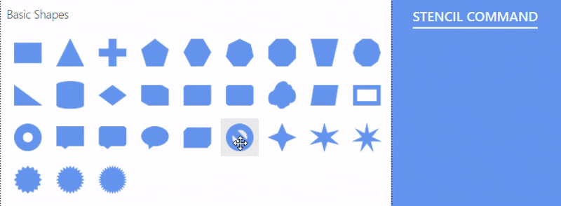
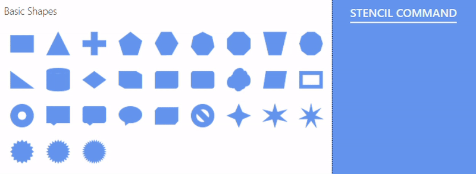
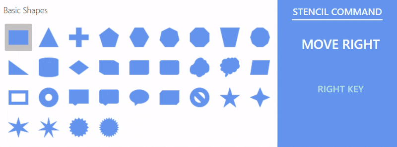

# Command Manager for Stencil in WPF Diagram

The [Stencil](https://help.syncfusion.com/cr/wpf/Syncfusion.UI.Xaml.Diagram.Stencil.html) in the [WPF Diagram](https://www.syncfusion.com/diagram-sdk/wpf-diagram) supports a variety of keyboard commands. These enable navigation, multi-selection, and clipboard operations without a mouse. The [`CommandManager`](https://help.syncfusion.com/cr/wpf/Syncfusion.UI.Xaml.Diagram.Stencil.Stencil.html#Syncfusion_UI_Xaml_Diagram_Stencil_Stencil_CommandManager) maps keyboard gestures to Stencil commands and lets you add or remove gesture commands.

## Built-in Commands and Key Gestures

| Command | Key | Modifier |
|---|---|---|
| Cut | X | Ctrl |
| Copy | C | Ctrl |
| Paste | V | Ctrl |
| SelectAll | A | Ctrl |
| UnSelect | Escape |  |
| Delete | Delete |  |
| MoveLeft | Left |  |
| MoveRight | Right |  |
| MoveUp | Up |  |
| MoveDown | Down |  |
| MoveToFirstInRow | Home |  |
| MoveToLastInRow | End |  |
| MoveToFirstInColumn | Page Up |  |
| MoveToLastInColumn | Page Down |  |

## Cut

The [`Cut`](https://help.syncfusion.com/cr/wpf/Syncfusion.UI.Xaml.Diagram.Stencil.IStencilCommand.html#Syncfusion_UI_Xaml_Diagram_Stencil_IStencilCommand_Cut) command removes the selected symbol from the Stencil and stores it on the clipboard. Press **Ctrl + X**.

## Copy

The [`Copy`](https://help.syncfusion.com/cr/wpf/Syncfusion.UI.Xaml.Diagram.Stencil.IStencilCommand.html#Syncfusion_UI_Xaml_Diagram_Stencil_IStencilCommand_Copy) command copies the selected symbol from the Stencil to the clipboard. Press **Ctrl + C**.

## Paste

The [`Paste`](https://help.syncfusion.com/cr/wpf/Syncfusion.UI.Xaml.Diagram.Stencil.IStencilCommand.html#Syncfusion_UI_Xaml_Diagram_Stencil_IStencilCommand_Paste) command inserts the clipboard contents into the current Symbol Group. Press **Ctrl + V**.

## Delete

The [`Delete`](https://help.syncfusion.com/cr/wpf/Syncfusion.UI.Xaml.Diagram.Stencil.IStencilCommand.html#Syncfusion_UI_Xaml_Diagram_Stencil_IStencilCommand_Delete) command removes the selected symbol from the Symbol Group. Press **Delete**.

## Example

The following runnable sample wraps the Stencil, an `SfDiagram`, and four command buttons in a single `Window`. The C# code shows how to wire the built-in commands through `Stencil.Commands.*`.




<Window x:Class="StencilSample.MainWindow"
        xmlns="http://schemas.microsoft.com/winfx/2006/xaml/presentation"
        xmlns:x="http://schemas.microsoft.com/winfx/2006/xaml"
        xmlns:syncfusion="http://schemas.syncfusion.com/wpf"
        xmlns:stencil="clr-namespace:Syncfusion.UI.Xaml.Diagram.Stencil;assembly=Syncfusion.SfDiagram.WPF"
        Title="Stencil commands" Height="600" Width="900">
    <Grid>
        <Grid.ColumnDefinitions>
            <ColumnDefinition Width="250"/>
            <ColumnDefinition Width="*"/>
        </Grid.ColumnDefinitions>
        <Grid.RowDefinitions>
            <RowDefinition Height="Auto"/>
            <RowDefinition Height="*"/>
        </Grid.RowDefinitions>

        <StackPanel Grid.Row="0" Grid.Column="0" Orientation="Horizontal" Margin="6">
            <Button Content="Cut"       Width="60" Margin="2" Click="CutBtn_Click"       ToolTip="Ctrl + X"/>
            <Button Content="Copy"      Width="60" Margin="2" Click="CopyBtn_Click"      ToolTip="Ctrl + C"/>
            <Button Content="Paste"     Width="60" Margin="2" Click="PasteBtn_Click"     ToolTip="Ctrl + V"/>
            <Button Content="Delete"    Width="60" Margin="2" Click="DeleteBtn_Click"    ToolTip="Delete"/>
            
        </StackPanel>

        <stencil:Stencil x:Name="stencil" Grid.Row="1" Grid.Column="0"
                         ExpandMode="All"
                         BorderBrush="#dfdfdf" BorderThickness="1"/>

        <syncfusion:SfDiagram x:Name="diagram" Grid.Row="1" Grid.Column="1"/>
    </Grid>
</Window>




using System.Windows;
using Syncfusion.UI.Xaml.Diagram.Stencil;

public partial class MainWindow : Window
{
    public Stencil StencilControl;

    public MainWindow()
    {
        InitializeComponent();
        StencilControl = stencil;
    }

    private void CutBtn_Click(object sender, RoutedEventArgs e)
    {
        if (StencilControl != null) StencilControl.Commands.Cut.Execute(null);
    }

    private void CopyBtn_Click(object sender, RoutedEventArgs e)
    {
        if (StencilControl != null) StencilControl.Commands.Copy.Execute(null);
    }

    private void PasteBtn_Click(object sender, RoutedEventArgs e)
    {
        if (StencilControl != null) StencilControl.Commands.Paste.Execute(null);
    }

    private void DeleteBtn_Click(object sender, RoutedEventArgs e)
    {
        if (StencilControl != null) StencilControl.Commands.Delete.Execute(null);
    }

}




## SelectAll

The [`SelectAll`](https://help.syncfusion.com/cr/wpf/Syncfusion.UI.Xaml.Diagram.Stencil.IStencilCommand.html#Syncfusion_UI_Xaml_Diagram_Stencil_IStencilCommand_SelectAll) command selects every symbol in the current `SymbolGroup`. It is exposed by `IStencilCommand` and is wired to the **Ctrl + A** key gesture by default.

The following example adds a `Select All` button to the host `Window` and runs the built-in command through its click handler.




<Button Content="Select All" Width="90" Margin="2" Click="SelectAllBtn_Click" ToolTip="Ctrl + A"></Button>




private void SelectAllBtn_Click(object sender, RoutedEventArgs e)
{
    if (Stencil != null)
    {
        Stencil.Commands.SelectAll.Execute(null);
    }
}




## UnSelect

The [`UnSelect`](https://help.syncfusion.com/cr/wpf/Syncfusion.UI.Xaml.Diagram.Stencil.IStencilCommand.html#Syncfusion_UI_Xaml_Diagram_Stencil_IStencilCommand_UnSelect) command clears the current selection inside the `SymbolGroup`. It is exposed by `IStencilCommand` and is wired to the **Esc** key gesture by default.

The following example adds an `UnSelect` button to the host `Window` and runs the built-in command through its click handler.




<Button Content="UnSelect" Width="90" Margin="2" Click="UnSelectBtn_Click" ToolTip="Esc"></Button>




private void UnSelectBtn_Click(object sender, RoutedEventArgs e)
{
    if (Stencil != null)
    {
        Stencil.Commands.UnSelect.Execute(null);
    }
}




## MoveLeft, MoveRight, MoveUp, MoveDown

Use [`MoveLeft`](https://help.syncfusion.com/cr/wpf/Syncfusion.UI.Xaml.Diagram.Stencil.IStencilCommand.html#Syncfusion_UI_Xaml_Diagram_Stencil_IStencilCommand_MoveLeft), [`MoveRight`](https://help.syncfusion.com/cr/wpf/Syncfusion.UI.Xaml.Diagram.Stencil.IStencilCommand.html#Syncfusion_UI_Xaml_Diagram_Stencil_IStencilCommand_MoveRight), [`MoveUp`](https://help.syncfusion.com/cr/wpf/Syncfusion.UI.Xaml.Diagram.Stencil.IStencilCommand.html#Syncfusion_UI_Xaml_Diagram_Stencil_IStencilCommand_MoveUp), and [`MoveDown`](https://help.syncfusion.com/cr/wpf/Syncfusion.UI.Xaml.Diagram.Stencil.IStencilCommand.html#Syncfusion_UI_Xaml_Diagram_Stencil_IStencilCommand_MoveDown) to move the selection between symbols with the corresponding arrow keys.

## MoveToFirstInRow, MoveToLastInRow

[`MoveToFirstInRow`](https://help.syncfusion.com/cr/wpf/Syncfusion.UI.Xaml.Diagram.Stencil.IStencilCommand.html#Syncfusion_UI_Xaml_Diagram_Stencil_IStencilCommand_MoveToFirstInRow) moves the selection to the first symbol of the current row, or the first symbol of the first row if nothing is selected. Press **Home**. [`MoveToLastInRow`](https://help.syncfusion.com/cr/wpf/Syncfusion.UI.Xaml.Diagram.Stencil.IStencilCommand.html#Syncfusion_UI_Xaml_Diagram_Stencil_IStencilCommand_MoveToLastInRow) moves the selection to the last symbol of the current row, or the last symbol of the last row if nothing is selected. Press **End**.

## MoveToFirstInColumn, MoveToLastInColumn

[`MoveToFirstInColumn`](https://help.syncfusion.com/cr/wpf/Syncfusion.UI.Xaml.Diagram.Stencil.IStencilCommand.html#Syncfusion_UI_Xaml_Diagram_Stencil_IStencilCommand_MoveToFirstInColumn) moves the selection to the first symbol of the current column. Press **Page Up**. [`MoveToLastInColumn`](https://help.syncfusion.com/cr/wpf/Syncfusion.UI.Xaml.Diagram.Stencil.IStencilCommand.html#Syncfusion_UI_Xaml_Diagram_Stencil_IStencilCommand_MoveToLastInColumn) moves the selection to the last symbol of the current column, or to the last symbol of the Symbol Group if nothing is selected. Press **Page Down**.

The directional-move commands run on the same `Window` host shown in [Example](#example). The corresponding button click handlers resolve commands through `StencilControl.Commands.*`.

## Removing a Particular Command from the CommandManager

Remove a command from the `CommandManager` by matching its `Name` and calling `Commands.Remove`. The `FirstOrDefault` call may return `null`, so guard the `Remove` call.



// Removing a particular stencil command from the CommandManager
if (StencilControl != null)
{
    const string commandName = "SelectAll";
    var commandToBeRemoved = StencilControl.CommandManager.Commands
        .FirstOrDefault(command => command.Name.Equals(commandName));

    if (commandToBeRemoved != null)
    {
        StencilControl.CommandManager.Commands.Remove(commandToBeRemoved);
    }
}



N> You can pass a different filter expression to remove every command matching a gesture, for example `command.Gesture.Key == Key.Escape`.

The [`MoveToLastInRow`](https://help.syncfusion.com/cr/wpf/Syncfusion.UI.Xaml.Diagram.Stencil.IStencilCommand.html#Syncfusion_UI_Xaml_Diagram_Stencil_IStencilCommand_MoveToLastInRow) command moves selection to the last symbol in the current row of the `SymbolGroup` or the last symbol of the last row if none is selected. MoveToLastInRow command can be executed by pressing the End key.





<Button Height="50" Content="MoveToLastInRow" Click="MoveToLastInRow_Click" ToolTip="End"></Button>





private void MoveToLastInRow_Click(object sender, RoutedEventArgs e)
{
    if (Stencil != null)
    {
        Stencil.Commands.MoveToLastInRow.Execute(null);
    }
}




## MoveToFirstInColumn Command

The [`MoveToFirstInColumn`](https://help.syncfusion.com/cr/wpf/Syncfusion.UI.Xaml.Diagram.Stencil.IStencilCommand.html#Syncfusion_UI_Xaml_Diagram_Stencil_IStencilCommand_MoveToFirstInColumn) command moves selection to the first symbol in the current column of the `SymbolGroup` or the first symbol of the first column if none is selected. MoveToFirstInColumn command can be executed by pressing the PageUp key.





<Button Height="50" Content="MoveToFirstInColumn" Click="MoveToFirstInColumn_Click" ToolTip="Page Up"></Button>





private void MoveToFirstInColumn_Click(object sender, RoutedEventArgs e)
{
    if (Stencil != null)
    {
        Stencil.Commands.MoveToFirstInColumn.Execute(null);
    }
}




## MoveToLastInColumn Command

The [`MoveToLastInColumn`](https://help.syncfusion.com/cr/wpf/Syncfusion.UI.Xaml.Diagram.Stencil.IStencilCommand.html#Syncfusion_UI_Xaml_Diagram_Stencil_IStencilCommand_MoveToLastInColumn) command moves selection to the last symbol in the current column of the `SymbolGroup` or the last symbol of the symbol group if none is selected. MoveToLastInColumn command can be executed by pressing the PageDown key.




<Button Height="50" Content="MoveToLastInColumn" Click="MoveToLastInColumn_Click" ToolTip="Page Down"></Button>




private void MoveToLastInColumn_Click(object sender, RoutedEventArgs e)
{
    if (Stencil != null)
    {
        Stencil.Commands.MoveToLastInColumn.Execute(null);
    }
}




## Removing a Particular Command from the CommandManager

Removing a command from the `CommandManager` is straightforward. To do this, you need to identify the command by its name and then remove it from the CommandManager's collection of commands.

Here is an example of how to remove a specific command from the CommandManager:




// Removing a particular stencil command from the CommandManager
if (Stencil != null)
{
    string commandName = "SelectAll";
    commandToBeRemoved = Stencil.CommandManager.Commands.FirstOrDefault(command => command.Name.Equals(commandName));
    Stencil.CommandManager.Commands.Remove(commandToBeRemoved);
}
    



## Adding a Custom Command to the CommandManager

Add a custom command by instantiating a `GestureCommand`, setting its `Gesture` and `Command`, and adding it to `Stencil.CommandManager.Commands`. Use `CommandManager.CommandTarget` to scope the command so it fires only when the Stencil UI has focus.





<!-- Add the button and feedback TextBlock to the host Window grid -->
<Button x:Name="CustomCommandBtn"
        Content="Custom Command"
        Click="CustomCommandBtn_Click"
        ToolTip="Custom Command"></Button>

<TextBlock x:Name="CustomCommandMessageDisplay" Margin="6"/>





using System.Windows.Input;
using Syncfusion.UI.Xaml.Diagram;
using Syncfusion.UI.Xaml.Diagram.Stencil;

public partial class MainWindow
{
    private ICommand customCommand;

    public MainWindow()
    {
        InitializeComponent();
        AddCustomCommand();
    }

    private void AddCustomCommand()
    {
        if (StencilControl == null) return;

        // Adding a custom command to the stencil CommandManager.
        customCommand = new Command(OnCustomCommand);

        var customCommandGesture = new GestureCommand
        {
            Command = customCommand,
            Gesture = new Gesture
            {
                Key = Key.K,
                KeyModifiers = ModifierKeys.Control,
                KeyState = KeyStates.Down
            },
            Name = "Custom"
        };

        StencilControl.CommandManager.Commands.Add(customCommandGesture);
    }

    private void CustomCommandBtn_Click(object sender, System.Windows.RoutedEventArgs e)
    {
        customCommand?.Execute(null);
    }

    private void OnCustomCommand(object parameter)
    {
        // Perform the custom command work here.
        CustomCommandMessageDisplay.Text = "Custom Command Executed Successfully!";
    }
}




Please refer the sample to [Customize the Stencil Commands](https://github.com/SyncfusionExamples/WPF-Diagram-Examples/tree/master/Samples/Stencil/StencilCustomCommands/StencilCustomCommand).