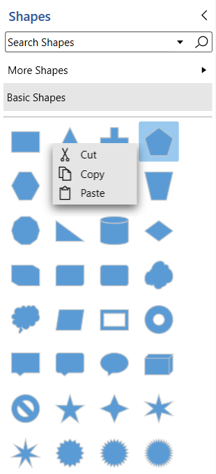
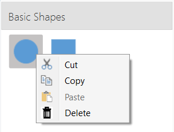
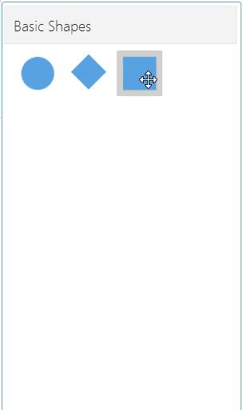

## Context menu support for Stencil in WPF Diagram (SfDiagram)

Stencil provides some default context menu items to ease the execution of some frequently used commands for stencil symbols.

## Default context menu

Context menu items can be enabled/disabled by adding or removing `ContextMenu` constraint from
[StencilConstraints](https://help.syncfusion.com/cr/wpf/Syncfusion.UI.Xaml.Diagram.StencilConstraints.html) property. By default context menu item will be displayed with Cut, Copy, Paste menu items.



//Enables the the symbols reordering.
stencil.StencilConstraints |= StencilConstraints.ContextMenu;

//Disables the symbols reordering.
stencil.StencilConstraints &= ~StencilConstraints.ContextMenu;



## Custom context menu

You can define some additional menu items to the stencil symbols by using [Menu](https://help.syncfusion.com/cr/wpf/Syncfusion.UI.Xaml.Diagram.Stencil.Stencil.html#Syncfusion_UI_Xaml_Diagram_Stencil_Stencil_Menu) property of `Stencil` class. Those additional menu items have to be defined and added to [MenuItems](https://help.syncfusion.com/cr/wpf/Syncfusion.UI.Xaml.Diagram.Controls.DiagramMenu.html#Syncfusion_UI_Xaml_Diagram_Controls_DiagramMenu_MenuItems) collection.

The following properties should be add to custom context menu items of stencil symbols.

* `Content` - allows you to set Content for the context menu item
* `Icon` - allows you to set icon for the context menu item
* `Command` - allows you to define command for context menu item.
* `CommandParameter` - allows you to define command parameter value to execute command for the context menu item.
* `IsSeparator` - allows you to define the horizontal lines that are used to separate the menu items from icon position.



SfDiagram diagram = new SfDiagram();
Stencil BasicStencil = new Stencil() { ShowDisplayModeToggleButton = false, ShowSearchTextBox = false, ExpandMode = ExpandMode.All, Constraints = StencilConstraints.Default | StencilConstraints.AllowDragDrop };

BasicStencil.SymbolGroups = new SymbolGroups()
{
    new SymbolGroupProvider()
    {
        MappingName = "Key",
    },
};

BasicStencil.Menu = new DiagramMenu()
{
    MenuItems = new ObservableCollection<DiagramMenuItem>()
    {
        new DiagramMenuItem()
        {
            Content = "Cut",
            Command = StencilCommands.Cut,
            Icon = @"pack://application:,,,/Icons/Cut.png",
        },

        new DiagramMenuItem()
        {
            Content = "Copy",
            Command = StencilCommands.Copy,
            Icon = @"pack://application:,,,/Icons/Copy.png"
        },

        new DiagramMenuItem()
        {
            Content = "Paste",
            Command = StencilCommands.Paste,
            CommandParameter = this,
            Icon = @"pack://application:,,,/Icons/Paste.png"
        },

        new DiagramMenuItem()
        {
            Content = "Delete",
            Command = StencilCommands.Delete,
            Icon = @"pack://application:,,,/Icons/Delete.png"            
        },
    },
};

BasicStencil.SymbolSource = new SymbolCollection()
{
    new NodeViewModel()
    {
        UnitWidth = 100,
        UnitHeight = 100,
        Shape = this.Resources["Ellipse"],
        Key = "Basic Shapes",
    },
                      
    new NodeViewModel()
    {
        UnitWidth = 100,
        UnitHeight = 100,
        Shape = this.Resources["Rectangle"],
        Key = "Basic Shapes",
    },
};



## Menu for symbols

You can define specific menu items to each stencil symbols by using `Menu` property of symbols.



BasicStencil.SymbolSource = new SymbolCollection()
{
    new NodeViewModel()
    {
        UnitWidth = 100,
        UnitHeight = 100,
        Shape = this.Resources["Ellipse"],
        Key = "Basic Shapes",
        Menu = DiagramMenu()
        {
            MenuItems = new ObservableCollection<DiagramMenuItem>()
            {
                new DiagramMenuItem()
                {
                    Content = "Delete",
                    Command = StencilCommands.Delete,
                    Icon = @"pack://application:,,,/Icons/Delete.png",
                },
            },
        },
    },
                      
    new NodeViewModel()
    {
        UnitWidth = 100,
        UnitHeight = 100,
        Shape = this.Resources["Rectangle"],
        Key = "Basic Shapes",
    },

    new NodeViewModel()
    {
        UnitWidth = 100,
        UnitHeight = 100,
        Shape = this.Resources["Plus"],
        Key = "Basic Shapes",
    },
};



[View Sample in GitHub](https://github.com/SyncfusionExamples/WPF-Diagram-Examples/tree/master/Samples/Stencil/StencilContextMenu)
