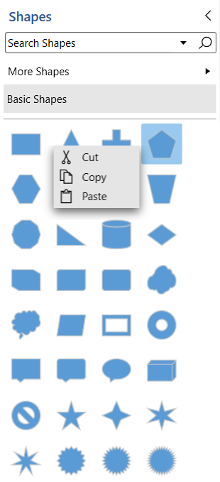
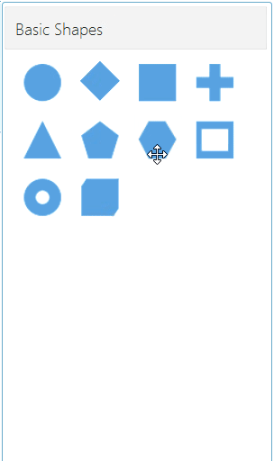
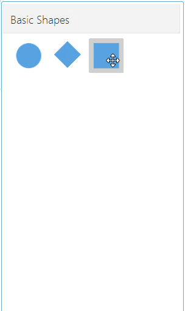
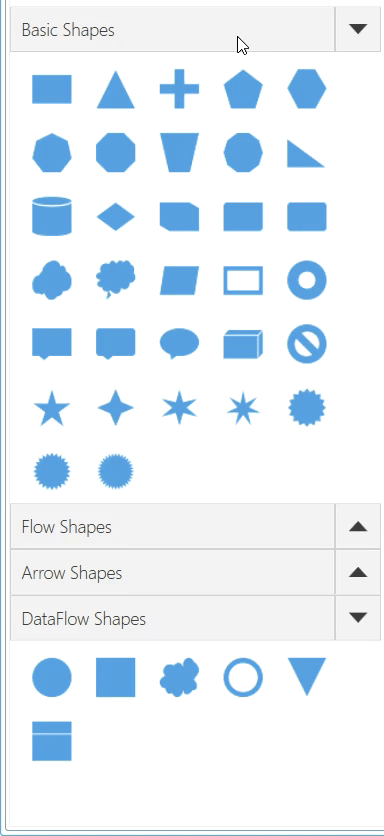

# Context Menu Support for Stencil in WPF Diagram

The Stencil ships with default context menu items that make common symbol actions easy to run.

## Default Context Menu for Stencil

Enable or disable context menu items by toggling the `ContextMenu` flag on [`StencilConstraints`](https://help.syncfusion.com/cr/wpf/Syncfusion.UI.Xaml.Diagram.StencilConstraints.html). By default, context menu items such as **Cut**, **Copy**, and **Paste** are displayed.



// Enable the context menu.
stencil.StencilConstraints |= StencilConstraints.ContextMenu;

// Disable the context menu.
stencil.StencilConstraints &= ~StencilConstraints.ContextMenu;



## Properties

| Property | Description | Type | Default |
|---|---|---|---|
| `Menu` | Context menu shown for symbols in the entire Stencil. | `DiagramMenu` | `null` |
| `SymbolGroupMenu` | Context menu applied to **every** Symbol Group in the Stencil. Overridden by `SymbolGroupViewModel.Menu` if set. | `DiagramMenu` | `null` |
| `DiagramMenuItem.Content` | Display text of the menu item. | `object` | `null` |
| `DiagramMenuItem.Icon` | Icon shown next to the menu item. | `object` | `null` |
| `DiagramMenuItem.Command` | `ICommand` invoked when the item is clicked. | `ICommand` | `null` |
| `DiagramMenuItem.CommandParameter` | Parameter passed to `Command`. | `object` | `null` |
| `DiagramMenuItem.IsSeparator` | When `true`, renders the item as a horizontal divider instead of a clickable entry. | `bool` | `false` |

### Built-in commands

Use the built-in [`StencilCommands`](https://help.syncfusion.com/cr/wpf/Syncfusion.UI.Xaml.Diagram.Stencil.StencilCommands.html) for the default symbol actions:

| Command | Description |
|---|---|
| `StencilCommands.Cut` | Cuts the selected symbols from the Symbol Group. |
| `StencilCommands.Copy` | Copies the selected symbols to the clipboard. |
| `StencilCommands.Paste` | Pastes the clipboard symbols into the Symbol Group. |
| `StencilCommands.Delete` | Deletes the selected symbols. |

## Custom Context Menu for Stencil

Add extra menu items to stencil symbols by using the [`Menu`](https://help.syncfusion.com/cr/wpf/Syncfusion.UI.Xaml.Diagram.Stencil.Stencil.html#Syncfusion_UI_Xaml_Diagram_Stencil_Stencil_Menu) property of the `Stencil` class. Define the additional menu items and add them to the [`MenuItems`](https://help.syncfusion.com/cr/wpf/Syncfusion.UI.Xaml.Diagram.Controls.DiagramMenu.html#Syncfusion_UI_Xaml_Diagram_Controls_DiagramMenu_MenuItems) collection.

The custom menu items have the following properties:

| Property | Description |
|---|---|
| `Content` | Sets the display text of the menu item. |
| `Icon` | Sets the icon shown next to the menu item. |
| `Command` | Defines the command invoked when the item is clicked. |
| `CommandParameter` | Defines the parameter passed to the command. |
| `IsSeparator` | When `true`, renders the item as a horizontal divider instead of a clickable menu entry. |

The following example defines a custom context menu for the Stencil. The `Rename` command is implemented with a simple `RelayCommand` because there is no built-in `StencilCommands.Rename`.



using System.Collections.ObjectModel;
using System.Windows.Input;
using Syncfusion.UI.Xaml.Diagram;
using Syncfusion.UI.Xaml.Diagram.Stencil;

public partial class MainWindow
{
    // Simple ICommand implementation used by the Rename menu item.
    public ICommand RenameCommand { get; } = new RelayCommand(p => RenameSymbol(p));

    private static void RenameSymbol(object parameter)
    {
        // Rename logic here.
    }

    public MainWindow()
    {
        InitializeComponent();

        var diagram = new SfDiagram();

        var BasicStencil = new Stencil
        {
            ShowDisplayModeToggleButton = false,
            ShowSearchTextBox = false,
            ExpandMode = ExpandMode.All,
            Constraints = StencilConstraints.Default | StencilConstraints.AllowDragDrop
        };

        BasicStencil.SymbolGroups = new SymbolGroups
        {
            new SymbolGroupProvider { MappingName = "Key" }
        };

        BasicStencil.Menu = new DiagramMenu
        {
            MenuItems = new ObservableCollection<DiagramMenuItem>
            {
                new DiagramMenuItem
                {
                    Content = "Cut",
                    Command = StencilCommands.Cut,
                    Icon = @"pack://application:,,,/Icons/Cut.png"
                },
                new DiagramMenuItem
                {
                    Content = "Copy",
                    Command = StencilCommands.Copy,
                    Icon = @"pack://application:,,,/Icons/Copy.png"
                },
                new DiagramMenuItem
                {
                    Content = "Paste",
                    Command = StencilCommands.Paste,
                    Icon = @"pack://application:,,,/Icons/Paste.png"
                },
                new DiagramMenuItem
                {
                    Content = "Delete",
                    Command = StencilCommands.Delete,
                    Icon = @"pack://application:,,,/Icons/Delete.png"
                },
                new DiagramMenuItem
                {
                    Content = "Rename",
                    Command = RenameCommand,
                    Icon = @"pack://application:,,,/Icons/Rename.png"
                }
            }
        };

        BasicStencil.SymbolSource = new SymbolCollection
        {
            new NodeViewModel
            {
                UnitWidth = 100,
                UnitHeight = 100,
                Shape = this.Resources["Ellipse"],
                Key = "Basic Shapes"
            },
            new SymbolViewModel
            {
                Symbol = "Diamond",
                Key = "Basic Shapes",
                SymbolTemplate = this.Resources["Diamond"] as DataTemplate
            }
        };
    }
}



## Custom Context Menu for Symbols in Stencil

Define per-symbol menu items by setting `Menu` on each symbol. Right-click a symbol in the Stencil to open its context menu. Per-symbol menu items appear **in addition to** the Stencil-level `Menu`, not as a replacement.



using System.Collections.ObjectModel;
using Syncfusion.UI.Xaml.Diagram;
using Syncfusion.UI.Xaml.Diagram.Stencil;

public partial class MainWindow
{
    public MainWindow()
    {
        InitializeComponent();

        BasicStencil.SymbolSource = new SymbolCollection
        {
            new NodeViewModel
            {
                UnitWidth = 100,
                UnitHeight = 100,
                Shape = this.Resources["Ellipse"],
                Key = "Basic Shapes",
                Menu = new DiagramMenu
                {
                    MenuItems = new ObservableCollection<DiagramMenuItem>
                    {
                        new DiagramMenuItem
                        {
                            Content = "Cut",
                            Command = StencilCommands.Cut,
                            Icon = @"pack://application:,,,/Icons/Cut.png"
                        }
                    }
                }
            },
            new SymbolViewModel
            {
                Symbol = "Diamond",
                Key = "Basic Shapes",
                SymbolTemplate = this.Resources["Diamond"] as DataTemplate,
                Menu = new DiagramMenu
                {
                    MenuItems = new ObservableCollection<DiagramMenuItem>
                    {
                        new DiagramMenuItem
                        {
                            Content = "Delete",
                            Command = StencilCommands.Delete,
                            Icon = @"pack://application:,,,/Icons/Delete.png"
                        }
                    }
                }
            },
            new NodeViewModel
            {
                UnitWidth = 100,
                UnitHeight = 100,
                Shape = this.Resources["Rectangle"],
                Key = "Basic Shapes"
            }
        };
    }
}



[View Sample in GitHub](https://github.com/SyncfusionExamples/WPF-Diagram-Examples/tree/master/Samples/Stencil/StencilContextMenu)

## Context Menu for SymbolGroup in Stencil

Use [`SymbolGroupViewModel.Menu`](https://help.syncfusion.com/cr/wpf/Syncfusion.UI.Xaml.Diagram.Stencil.SymbolGroupViewModel.html#Syncfusion_UI_Xaml_Diagram_Stencil_SymbolGroupViewModel_Menu) to define a context menu for a specific Symbol Group. Use [`Stencil.SymbolGroupMenu`](https://help.syncfusion.com/cr/wpf/Syncfusion.UI.Xaml.Diagram.Stencil.Stencil.html#Syncfusion_UI_Xaml_Diagram_Stencil_Stencil_SymbolGroupMenu) to apply the same menu to **every** Symbol Group. When both are set, `SymbolGroupViewModel.Menu` takes precedence for that group.




<Window x:Class="StencilSample.MainWindow"
        xmlns="http://schemas.microsoft.com/winfx/2006/xaml/presentation"
        xmlns:x="http://schemas.microsoft.com/winfx/2006/xaml"
        xmlns:syncfusion="http://schemas.syncfusion.com/wpf"
        xmlns:stencil="clr-namespace:Syncfusion.UI.Xaml.Diagram.Stencil;assembly=Syncfusion.SfDiagram.WPF"
        Title="Symbol Group context menu" Height="600" Width="900">
    <Grid>
        <Grid.ColumnDefinitions>
            <ColumnDefinition Width="250"/>
            <ColumnDefinition Width="*"/>
        </Grid.ColumnDefinitions>

        <stencil:Stencil x:Name="stencil"
                         Grid.Column="0"
                         ExpandMode="ZeroOrMore"
                         BorderBrush="#dfdfdf" BorderThickness="1">
            <stencil:Stencil.SymbolGroups>
                <stencil:SymbolGroups>
                    <stencil:SymbolGroupViewModel Name="Basic Shapes" CategorySource="{StaticResource BasicShapes}">
                        <stencil:SymbolGroupViewModel.Menu>
                            <syncfusion:DiagramMenu>
                                <syncfusion:DiagramMenu.MenuItems>
                                    <syncfusion:DiagramMenuItem Content="Delete"
                                                                Icon="pack://application:,,,/Images/Delete.png"/>
                                </syncfusion:DiagramMenu.MenuItems>
                            </syncfusion:DiagramMenu>
                        </stencil:SymbolGroupViewModel.Menu>
                    </stencil:SymbolGroupViewModel>
                    <stencil:SymbolGroupViewModel Name="Flow Shapes" CategorySource="{StaticResource FlowShapes}"/>
                    <stencil:SymbolGroupViewModel Name="Arrow Shapes" CategorySource="{StaticResource ArrowShapes}"/>
                    <stencil:SymbolGroupViewModel Name="DataFlow Shapes" CategorySource="{StaticResource DataFlowShapes}"/>
                </stencil:SymbolGroups>
            </stencil:Stencil.SymbolGroups>
            <stencil:Stencil.SymbolGroupMenu>
                <syncfusion:DiagramMenu>
                    <syncfusion:DiagramMenu.MenuItems>
                        <syncfusion:DiagramMenuItem Content="Move Up"
                                                    Icon="pack://application:,,,/Images/ArrowUp.png"/>
                        <syncfusion:DiagramMenuItem Content="Move Down"
                                                    Icon="pack://application:,,,/Images/ArrowDown.png"/>
                    </syncfusion:DiagramMenu.MenuItems>
                </syncfusion:DiagramMenu>
            </stencil:Stencil.SymbolGroupMenu>
        </stencil:Stencil>

        <syncfusion:SfDiagram x:Name="diagram" Grid.Column="1"/>
    </Grid>
</Window>





// Wire all groups to the same menu.
stencil.SymbolGroupMenu = new DiagramMenu
{
    MenuItems = new ObservableCollection<DiagramMenuItem>
    {
        new DiagramMenuItem { Content = "Move Up" },
        new DiagramMenuItem { Content = "Move Down" }
    }
};




[View Sample in GitHub](https://github.com/SyncfusionExamples/WPF-Diagram-Examples/tree/master/Samples/Stencil/SymbolGroupViewModel/SymbolGroupsWithContextMenu)

## Troubleshooting

| Symptom | Likely cause |
|---|---|
| Icons do not appear | The `Icon` URI cannot be resolved at runtime. Ensure the path is correct and the image file is included in the assembly (build action `Resource`, or use `pack://application:,,,/...` for embedded resources). |
| `Command` does not fire | The `CommandParameter` is wrong, or `CanExecute` returns `false`. Test by setting `CommandParameter` to a known value. |
| A custom menu item does not appear | The `ContextMenu` constraint was disabled. Re-enable `StencilConstraints.ContextMenu`. |
| `SymbolGroupViewModel.Menu` is ignored | `Stencil.SymbolGroupMenu` is also set and overrides it. Remove the Stencil-level menu or rely on the precedence rule above. |

## See Also

[How to restrict the symbol dropping from the SymbolPalette?](https://support.syncfusion.com/kb/article/9919/how-to-restrict-the-symbol-dropping-from-the-symbolpalette-in-the-wpf-diagram-sfdiagram)

[How to enable or disable Stencil symbols in WPF Diagram?](https://support.syncfusion.com/kb/article/17888/how-to-enabledisable-the-stencil-symbol-in-wpf-diagram-sfdiagram)

[How to refresh the stencil with a new collection or new symbol?](https://support.syncfusion.com/kb/article/8714/how-to-refresh-stencil-with-new-collection-or-symbol-in-wpf-diagram)