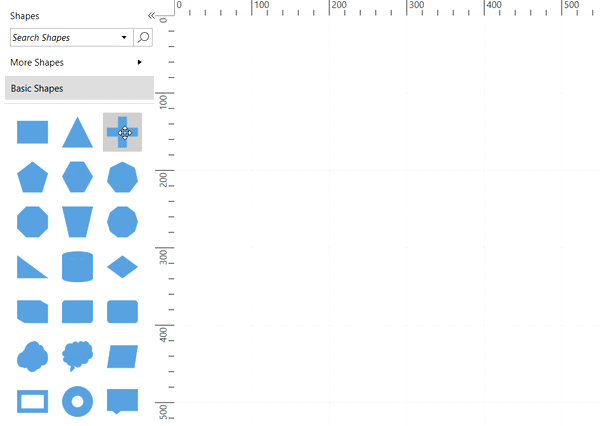
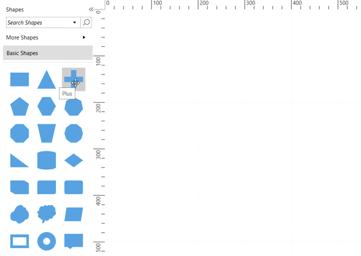
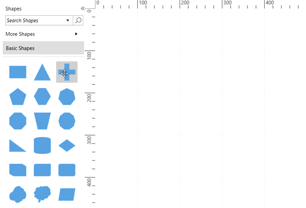
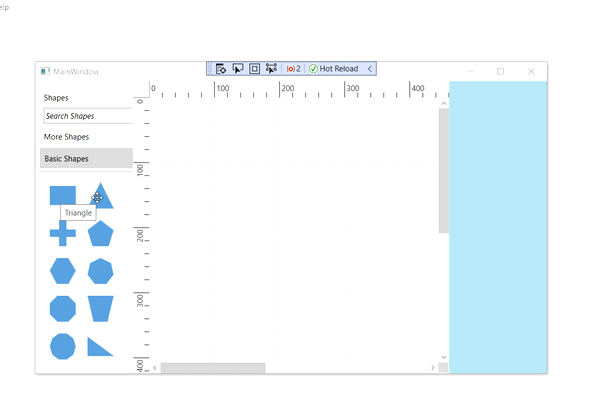
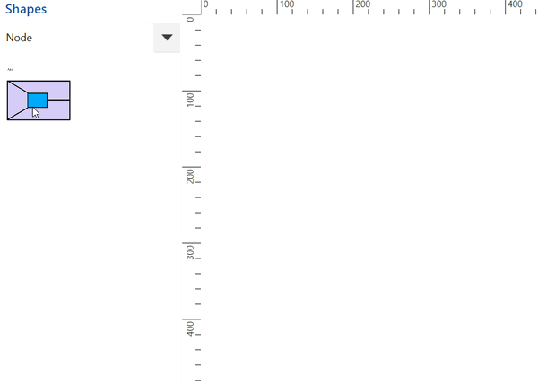

# Stencil interactions in WPF Diagram (SfDiagram)

Stencil symbols can be selected, dragged, and reordered over stencil control.

## Symbol selection

Stencil provides support to select single symbol or multiple symbols at a time that can be dragged on the diagram surface.

### Single selection

A symbol can be selected by clicking on that symbol. During single click, all previously selected items will be cleared.

### Multiple selection

Multiple elements can be selected with the following ways:

1. Ctrl+click

By holding down the Ctrl key and clicking each symbol that you want to select or deselect allows you to select or deselect multiple symbols.

2. Rubber band selection

Clicking and dragging on the stencil area allows you to create a rectangular region. The elements that are covered under the rectangular region are selected at the end.

## Symbol reordering

Stencil provides support to reorder the symbols within the specific [SymbolGroup](https://help.syncfusion.com/cr/wpf/Syncfusion.UI.Xaml.Diagram.Stencil.SymbolGroup.html). By default, symbols reordering will be enabled. Symbol reordering can be disabled by removing `AllowDragDrop` constraint from
[StencilConstraints](https://help.syncfusion.com/cr/wpf/Syncfusion.UI.Xaml.Diagram.StencilConstraints.html) property of stencil class.



//Enables the the symbols reordering.
stencil.StencilConstraints |= StencilConstraints.AllowDragDrop;

//Disables the symbols reordering.
stencil.StencilConstraints &= ~StencilConstraints.AllowDragDrop;



## Events

* The `ExpandedEvent` and `CollapsedEvent` are notified to provide interactions in the SymbolGroup. To explore about arguments, refer to this [SymbolGroupExpandCollapseEventArgs](https://help.syncfusion.com/cr/wpf/Syncfusion.UI.Xaml.Diagram.Stencil.SymbolGroupExpandCollapseEventArgs.html) class.

* The `DragEnterEvent` notifies when an element enters into the diagram from a stencil.
* The `DragLeaveEvent` notifies when an element leaves from the diagram.
* The `DragOverEvent` notifies when an element drag over another diagram element.
* The `ItemDropEventEvent` notifies when an element is dropped on the diagram. 

To explore about arguments, refer to this [ItemDropEventArgs](https://help.syncfusion.com/cr/wpf/Syncfusion.UI.Xaml.Diagram.ItemDropEventArgs.html) class.

## Preview for drag and drop

When you drag an item from the stencil to the diagram, a preview of the dragged item will be displayed. Preview of the item can be enabled or disabled by using `ShowPreview` constraint from [StencilConstraints](https://help.syncfusion.com/cr/wpf/Syncfusion.UI.Xaml.Diagram.StencilConstraints.html) property.



//Enables the drag and drop preview.
stencil.Constraints = stencil.Constraints | StencilConstraints.ShowPreview;

//Disables the drag and drop preview.
stencil.Constraints = stencil.Constraints & ~StencilConstraints.ShowPreview;



Here, the stencil is an instance of Stencil.

### Customization of preview for drag and drop

You can customize the preview content by overriding the [PrepareDragDropPreview](https://help.syncfusion.com/cr/wpf/Syncfusion.UI.Xaml.Diagram.Stencil.Stencil.html#Syncfusion_UI_Xaml_Diagram_Stencil_Stencil_PrepareDragDropPreview) method of the stencil. You can also define your customized preview to the [SymbolPreview](https://help.syncfusion.com/cr/wpf/Syncfusion.UI.Xaml.Diagram.Stencil.Stencil.html#Syncfusion_UI_Xaml_Diagram_Stencil_Stencil_SymbolPreview) property of the stencil.



public class CustomStencil : Stencil
{
    //Virtual method to customize the preview of dragging the symbol from a stencil.
    protected override void PrepareDragDropPreview()
    {
        this.SymbolPreview = new ContentPresenter()
        {
            Content = new Rectangle()
            {
                Width = 50,
                Height = 50,
                Fill = new SolidColorBrush(Colors.SteelBlue)
            }
        };
    }
}




## Restrict the node dropped on Diagram

The diagram provides support to cancel the drag and drop operation from the stencil to the diagram in two ways:

* Using the `Cancel` argument of `ItemDropEventArgs`. For example, if you need to restrict drop for a particular node or based on some condition, then this argument will allow you to achieve the same. To explore about arguments, refer to the [ItemDropEventArgs](https://help.syncfusion.com/cr/wpf/Syncfusion.UI.Xaml.Diagram.ItemDropEventArgs.html).
 
* When the ESC key is pressed.

The following code example explains how to cancel item drop of basic shapes from the stencil.



<!--Initialize the custom stencil-->
<local:CustomStencil x:Name="stencil" Title="Shapes"
ExpandMode="ZeroOrMore" BorderBrush="#dfdfdf" BorderThickness="1">
</local:CustomStencil>


//Creating the diagram instance.
SfDiagram diagram = new SfDiagram();
//Hook the item drop event of diagram.
(diagram.Info as IGraphInfo).ItemDropEvent += MainWindow_ItemDropEvent;
private void MainWindow_ItemDropEvent(object sender, ItemDropEventArgs args)
{
    //To cancel item drop if symbols are basic shapes.
    if (args.ItemSource == Cause.Stencil && args.Source is INode && (args.Source as INode).Key.ToString() == "Basic Shapes")
    {
        args.Cancel = true;
    }
}




## Symbol dragging outside diagram bounds

By default, the cursor appears as a block cursor when dragging the symbol (from stencil) outside the diagram bounds. The SfDiagram provides supports to drag the elements within the given limitations. For details, please refer to this [DragLimit](https://help.syncfusion.com/wpf/diagram/scroll-settings/draglimit) to restrict the symbol dragging outside the limited area.

## Preserving the node template when dragging and dropping

The Diagram control allows you to drag and drop elements from a stencil using the serialization and deserialization approach, but it does not serialize the framework properties like the [Content](https://help.syncfusion.com/cr/wpf/Syncfusion.UI.Xaml.Diagram.NodeViewModel.html#Syncfusion_UI_Xaml_Diagram_NodeViewModel_Content) and [ContentTemplate](https://help.syncfusion.com/cr/wpf/Syncfusion.UI.Xaml.Diagram.NodeViewModel.html#Syncfusion_UI_Xaml_Diagram_NodeViewModel_ContentTemplate) properties. So, you need to retain templates as a resource and reassign them once it loaded back in the diagram. This can be achieved by using the `ItemAddedEvent` to restore the `Content` and `ContentTemplate` property values.




private void MainWindow_ItemAdded(object sender, ItemAddedEventArgs args) 
{ 
    if(args.Item is CustomNode) 
    { 
        CustomNode node = args.Item as CustomNode;
        //content and contenttemplate returns null, so we have used the CustomContent and CustomContentTemplate properties to restore its values. 
        node.Content = node.CustomContent; 
        node.ContentTemplate = App.Current.MainWindow.Resources[node.CustomContentTemplate] as DataTemplate; 
    } 
} 




[View Sample in GitHub](https://github.com/SyncfusionExamples/WPF-Diagram-Examples/tree/master/Samples/Stencil/Stencil%20Drag%20Drop%20Template)