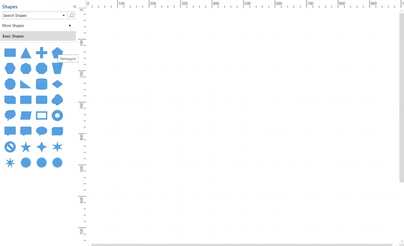
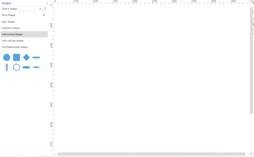
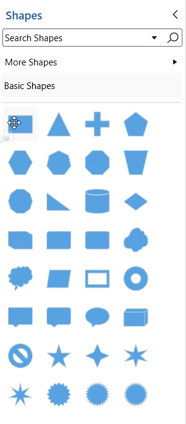
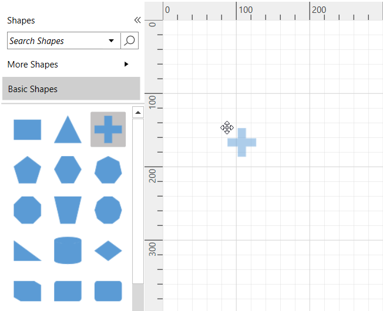
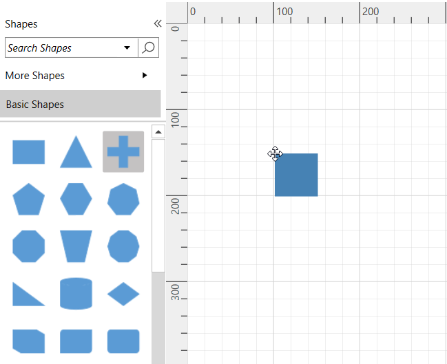
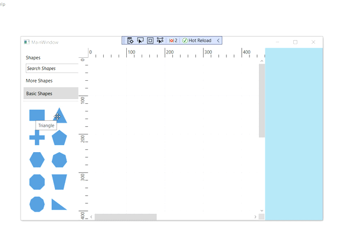
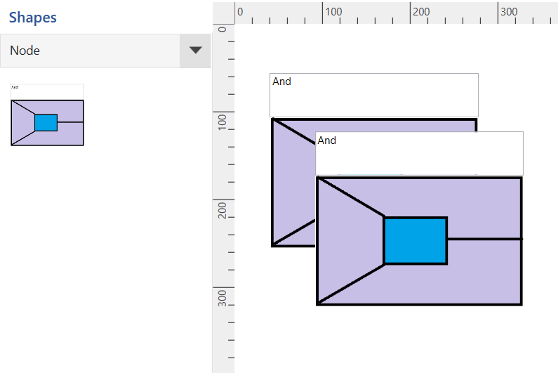

# Stencil interactions in WPF Diagram

Stencil symbols can be selected, dragged, and reordered in the Stencil.

## Symbol selection

The Stencil lets you select a single symbol or multiple symbols at the same time. Use the [`SymbolSelectionMode`](https://help.syncfusion.com/cr/wpf/Syncfusion.UI.Xaml.Diagram.Stencil.Stencil.html#Syncfusion_UI_Xaml_Diagram_Stencil_Stencil_SymbolSelectionMode) property to switch between single and multiple selection. The default is multiple selection.

|SelectionMode|Description|Default|
|----------|-----------|-------|
| Single | Only one symbol can be selected at a time. | No |
| Multiple | Multiple symbols can be selected with Ctrl+click or rubber-band selection. | Yes |

### Single selection

A symbol can be selected by clicking on that symbol. During single click, all previously selected items will be cleared.

### Multiple selection

Multiple symbols can be selected in two ways:

1. **Ctrl+click** — Hold Ctrl and click each symbol to add or remove it from the selection.
2. **Rubber band selection** — Click and drag in the Stencil to draw a rectangle; all symbols inside it are selected when you release the mouse.

### Duplicate symbols

#### Duplicate the symbols within the Symbol Group:

Stencil allows users to duplicate symbols within the [SymbolGroup](https://help.syncfusion.com/cr/wpf/Syncfusion.UI.Xaml.Diagram.Stencil.SymbolGroup.html) by holding down the Ctrl key and dragging and dropping the symbol to your desired location within the current symbol group.

#### Duplicate from one Symbol Group to another

Hold Ctrl while dragging a symbol onto another Symbol Group's header to clone it into that group.

## Symbol reordering

The Stencil supports reordering symbols within a [SymbolGroup](https://help.syncfusion.com/cr/wpf/Syncfusion.UI.Xaml.Diagram.Stencil.SymbolGroup.html). Symbol reordering is enabled by default. Remove the `AllowDragDrop` flag from [`StencilConstraints`](https://help.syncfusion.com/cr/wpf/Syncfusion.UI.Xaml.Diagram.StencilConstraints.html) to disable it.

`StencilConstraints` is a `[Flags]` enum, so individual flags are combined with the bitwise `|` operator and toggled with `& ~`.



// Enable symbol reordering.
stencil.StencilConstraints |= StencilConstraints.AllowDragDrop;

// Disable symbol reordering.
stencil.StencilConstraints &= ~StencilConstraints.AllowDragDrop;



## Events

| Event | Description | Event arguments |
|---|---|---|
| `Expanded` | Fires when a Symbol Group is expanded. | [SymbolGroupExpandCollapseEventArgs](https://help.syncfusion.com/cr/wpf/Syncfusion.UI.Xaml.Diagram.Stencil.SymbolGroupExpandCollapseEventArgs.html) |
| `Collapsed` | Fires when a Symbol Group is collapsed. | [SymbolGroupExpandCollapseEventArgs](https://help.syncfusion.com/cr/wpf/Syncfusion.UI.Xaml.Diagram.Stencil.SymbolGroupExpandCollapseEventArgs.html) |
| `DragEnter` | Fires when an element enters the diagram from the Stencil. | [DragEnterEventHandler](https://help.syncfusion.com/cr/wpf/Syncfusion.UI.Xaml.Diagram.DragEnterEventHandler.html) |
| `DragLeave` | Fires when an element leaves the diagram. | [DragLeaveEventHandler](https://help.syncfusion.com/cr/wpf/Syncfusion.UI.Xaml.Diagram.DragLeaveEventHandler.html) |
| `DragOver` | Fires when an element is dragged over another diagram element. | [DragOverEventHandler](https://help.syncfusion.com/cr/wpf/Syncfusion.UI.Xaml.Diagram.DragOverEventHandler.html) |
| `ItemDrop` | Fires when a symbol is dropped on the diagram. | [ItemDropEventArgs](https://help.syncfusion.com/cr/wpf/Syncfusion.UI.Xaml.Diagram.ItemDropEventArgs.html) |

The `SymbolGroupExpandCollapseEventArgs` exposes the underlying `SymbolGroup` via the `Group` property and the originating `Stencil` via the `Stencil` property. The `ItemDropEventArgs` exposes the following:

| Property | Description | Type |
|---|---|---|
| `ItemSource` | Origin of the dropped item (e.g. `Cause.Stencil`, `Cause.Clipboard`, `Cause.UserInput`). | `Cause` |
| `Source` | The diagram element that was dropped (or the candidate element, if cancelled). | `object` |
| `Cancel` | Set to `true` to cancel the drop. | `bool` |
| `Args` | Underlying mouse-event arguments. | `MouseEventArgs` |

### Subscribing to events




<stencil:Stencil x:Name="stencil"
                 Expanded="OnStencilGroupExpanded"
                 Collapsed="OnStencilGroupCollapsed"/>





stencil.Expanded += OnStencilGroupExpanded;
stencil.Collapsed += OnStencilGroupCollapsed;

private void OnStencilGroupExpanded(object sender, SymbolGroupExpandCollapseEventArgs e)
{
    // e.Group, e.Stencil
}




## Preview for drag and drop

When you drag an item from the Stencil to the diagram, a preview of the dragged item is shown. Toggle the preview with the `ShowPreview` flag on [`StencilConstraints`](https://help.syncfusion.com/cr/wpf/Syncfusion.UI.Xaml.Diagram.StencilConstraints.html).



// Enable the drag-and-drop preview.
stencil.StencilConstraints |= StencilConstraints.ShowPreview;

// Disable the drag-and-drop preview.
stencil.StencilConstraints &= ~StencilConstraints.ShowPreview;



### Customize the drag-and-drop preview

You can customize the preview by overriding the [PrepareDragDropPreview](https://help.syncfusion.com/cr/wpf/Syncfusion.UI.Xaml.Diagram.Stencil.Stencil.html#Syncfusion_UI_Xaml_Diagram_Stencil_Stencil_PrepareDragDropPreview) method, or by setting the [`SymbolPreview`](https://help.syncfusion.com/cr/wpf/Syncfusion.UI.Xaml.Diagram.Stencil.Stencil.html#Syncfusion_UI_Xaml_Diagram_Stencil_Stencil_SymbolPreview) property to a `ContentControl` or a `DataTemplate` that you have defined.




public class CustomStencil : Stencil
{
    // Override to customize the preview that is shown while dragging a symbol.
    protected override void PrepareDragDropPreview()
    {
        this.SymbolPreview = new ContentPresenter()
        {
            Content = new Rectangle()
            {
                Width = 50,
                Height = 50,
                Fill = new SolidColorBrush(Colors.SteelBlue)
            }
        };
    }
}





<!-- Or assign a DataTemplate to SymbolPreview in XAML -->
<DataTemplate x:Key="SymbolPreviewTemplate">
    <Rectangle Width="60" Height="60" Fill="DodgerBlue" Opacity="0.7"/>
</DataTemplate>




## Restrict the node dropped on the diagram

Cancel a drop from the Stencil by setting the `Cancel` argument of [ItemDropEventArgs](https://help.syncfusion.com/cr/wpf/Syncfusion.UI.Xaml.Diagram.ItemDropEventArgs.html) to `true`. For example, you can reject drops for symbols whose `Key` is `Basic Shapes`.

N> The user can also press **Esc** to cancel an in-progress drag-and-drop operation.

The following example cancels the drop of symbols whose `Key` is `Basic Shapes`.




<Window x:Class="StencilSample.MainWindow"
        xmlns="http://schemas.microsoft.com/winfx/2006/xaml/presentation"
        xmlns:x="http://schemas.microsoft.com/winfx/2006/xaml"
        xmlns:syncfusion="http://schemas.syncfusion.com/wpf"
        xmlns:stencil="clr-namespace:Syncfusion.UI.Xaml.Diagram.Stencil;assembly=Syncfusion.SfDiagram.WPF"
        xmlns:local="clr-namespace:StencilSample"
        Title="Restrict drop" Height="600" Width="900">
    <Grid>
        <Grid.ColumnDefinitions>
            <ColumnDefinition Width="250"/>
            <ColumnDefinition Width="*"/>
        </Grid.ColumnDefinitions>

        <local:CustomStencil x:Name="stencil"
                             Grid.Column="0"
                             Title="Shapes"
                             ExpandMode="ZeroOrMore"
                             BorderBrush="#dfdfdf" BorderThickness="1"/>

        <syncfusion:SfDiagram x:Name="diagram" Grid.Column="1"/>
    </Grid>
</Window>





using Syncfusion.UI.Xaml.Diagram;
using Syncfusion.UI.Xaml.Diagram.Stencil;

public partial class MainWindow
{
    public MainWindow()
    {
        InitializeComponent();

        // Hook the item drop event of the diagram.
        (diagram.Info as IGraphInfo).ItemDropEvent += MainWindow_ItemDropEvent;
    }

    private void MainWindow_ItemDropEvent(object sender, ItemDropEventArgs args)
    {
        // Cancel the drop if the symbol is in the Basic Shapes group.
        if (args.ItemSource == Cause.Stencil
            && args.Source is INode node
            && node.Key as string == "Basic Shapes")
        {
            args.Cancel = true;
        }
    }
}




Symbols in the `Basic Shapes` group are not added to the diagram when dropped.

## Symbol dragging outside diagram bounds

By default, the cursor appears as a block cursor when dragging a symbol from the Stencil outside the diagram bounds. The Diagram can restrict dragging to a defined area using [DragLimit](https://help.syncfusion.com/wpf/diagram/scroll-settings/draglimit).

## Preserving the node template when dragging and dropping

When you serialize and deserialize a diagram, framework properties like [`Content`](https://help.syncfusion.com/cr/wpf/Syncfusion.UI.Xaml.Diagram.NodeViewModel.html#Syncfusion_UI_Xaml_Diagram_NodeViewModel_Content) and [`ContentTemplate`](https://help.syncfusion.com/cr/wpf/Syncfusion.UI.Xaml.Diagram.NodeViewModel.html#Syncfusion_UI_Xaml_Diagram_NodeViewModel_ContentTemplate) are not persisted. Store the template as a resource and reassign it when the item is added back to the diagram. Use the `ItemAdded` event on the diagram's `IGraphInfo` to restore these properties.




using System.Windows;
using Syncfusion.UI.Xaml.Diagram;

public partial class MainWindow
{
    public MainWindow()
    {
        InitializeComponent();
        (diagram.Info as IGraphInfo).ItemAdded += MainWindow_ItemAdded;
    }

    private void MainWindow_ItemAdded(object sender, ItemAddedEventArgs args)
    {
        if (args.Item is CustomNode node)
        {
            // Content and ContentTemplate are null after deserialization, so
            // we restore them from the values the user stored in CustomContent
            // and CustomContentTemplate.
            node.Content = node.CustomContent;
            node.ContentTemplate = Application.Current.MainWindow.Resources[node.CustomContentTemplate] as DataTemplate;
        }
    }
}




[View Sample in GitHub](https://github.com/SyncfusionExamples/WPF-Diagram-Examples/tree/master/Samples/Stencil/Stencil%20Drag%20Drop%20Template)

## Keyboard Support for Stencil in WPF Diagram

The Stencil supports keyboard shortcuts for common actions.

The following table illustrates the list of commands along with their associated key gestures:

| Shortcut Key | Command               | Description                                                                   |
|--------------|-----------------------|-------------------------------------------------------------------------------|
| Ctrl + X     | Cut                   | Cut the selected symbols from the symbol group                                |
| Ctrl + C     | Copy                  | Copy the selected symbols to the clipboard                                    |
| Ctrl + V     | Paste                 | Paste the symbol from the clipboard into the symbol group                     |
| Ctrl + A     | SelectAll             | Select all the symbols in the current symbol group                            |
| Escape       | UnSelect              | Deselect any selected symbols in the symbol group                             |
| Delete       | Delete                | Delete the selected symbols                                                   |
| UpArrow      | MoveUp                | Move the selection to the symbol above in the symbol group                    |
| DownArrow    | MoveDown              | Move the selection to the symbol below in the symbol group                    |
| RightArrow   | MoveRight             | Move the selection to the symbol to the right in the symbol group             |
| LeftArrow    | MoveLeft              | Move the selection to the symbol to the left in the symbol group              |
| Home         | MoveToFirstInRow      | Move the selection to the first symbol in the current row of the symbol group |
| End          | MoveToLastInRow       | Move the selection to the last symbol in the current row of the symbol group  |
| Page Up      | MoveToFirstInColumn   | Move the selection to the first symbol in the current column of the symbol group| 
| Page Down    | MoveToLastInColumn    | Move the selection to the last symbol in the current column of the symbol group |

## See Also

[How to refresh the stencil with new collection or new symbol?](https://support.syncfusion.com/kb/article/8714/how-to-refresh-stencil-with-new-collection-or-symbol-in-wpf-diagram)

[How to restrict the symbol dropping from the SymbolPalette?](https://support.syncfusion.com/kb/article/9919/how-to-restrict-the-symbol-dropping-from-the-symbolpalette-in-the-wpf-diagram-sfdiagram)

[How to create parent and child relationship by drag and drop nodes?](https://support.syncfusion.com/kb/article/10008/how-to-create-parent-and-child-relationship-by-drag-and-drop-nodes-in-wpf-diagram-sfdiagram)

[How to expand all symbol groups in stencil?](https://support.syncfusion.com/kb/article/5492/how-to-expand-all-symbol-groups-in-wpf-diagram-sfdiagram)

[How to Change Cursor to Block Cursor When Hovering in WPF Diagram?](https://support.syncfusion.com/kb/article/18242/how-to-change-cursor-to-block-cursor-when-hovering-in-wpf-sfdiagram)

[How to Change the Background Color of a Symbol in WPF Diagram?](https://support.syncfusion.com/kb/article/18241/how-to-change-the-background-color-of-a-symbol-in-wpf-sfdiagram)