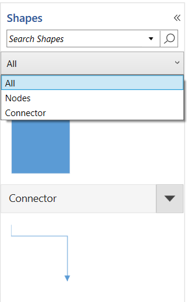

# Symbol Filtering in WPF SfDiagram

You can filter or hide grouped symbols using the [`SymbolFilters`](https://help.syncfusion.com/cr/wpf/Syncfusion.UI.Xaml.Diagram.Stencil.Stencil.html#Syncfusion_UI_Xaml_Diagram_Stencil_Stencil_SymbolFilters) property. The `SymbolFilters` collection contains [`SymbolFilterProvider`](https://help.syncfusion.com/cr/wpf/Syncfusion.UI.Xaml.Diagram.Stencil.SymbolFilterProvider.html) instances. Each provider has a [`SymbolFilter`](https://help.syncfusion.com/cr/wpf/Syncfusion.UI.Xaml.Diagram.Stencil.SymbolFilterProvider.html#Syncfusion_UI_Xaml_Diagram_Stencil_SymbolFilterProvider_SymbolFilter) delegate that decides whether a symbol belongs to the group.

The [`Content`](https://help.syncfusion.com/cr/wpf/Syncfusion.UI.Xaml.Diagram.Stencil.SymbolFilterProvider.html#Syncfusion_UI_Xaml_Diagram_Stencil_SymbolFilterProvider_Content) and [`ContentTemplate`](https://help.syncfusion.com/cr/wpf/Syncfusion.UI.Xaml.Diagram.Stencil.SymbolFilterProvider.html#Syncfusion_UI_Xaml_Diagram_Stencil_SymbolFilterProvider_ContentTemplate) properties of `SymbolFilterProvider` define the content shown for the filter.

N> `SymbolFilters` and `SymbolFilterProvider` are only honored when [`SymbolGroupDisplayMode`](https://help.syncfusion.com/cr/wpf/Syncfusion.UI.Xaml.Diagram.Stencil.Stencil.html#Syncfusion_UI_Xaml_Diagram_Stencil_Stencil_SymbolGroupDisplayMode) is set to `Accordion`.

## Properties

| Property | Description | Type | Default |
|---|---|---|---|
| `SymbolFilters` | Collection of `SymbolFilterProvider` instances shown as filter buttons above the Stencil. | `SymbolFilters` | `null` |
| `SelectedFilter` | The filter that is currently selected in the Stencil. Its `SymbolFilter` delegate decides which symbols are visible. | `SymbolFilterProvider` | `null` |
| `Content` | Header text or UI shown for a filter button. | `object` | `null` |
| `ContentTemplate` | Template used to render a filter button. | `DataTemplate` | `null` |
| `SymbolFilter` | Delegate on `SymbolFilterProvider` that runs against each symbol and returns `true` when the symbol should be visible. | `FilterPredicate` | `null` |

The following XAML and C# sample demonstrates how to filter the symbols shown in the Stencil by category. Property names in the XAML bindings (`Symbolfilters`, `Selectedfilter`) are **case-sensitive** and must match the C# view-model exactly.



<Window.DataContext>
   <viewmodel:StencilVM></viewmodel:StencilVM>
</Window.DataContext>
<Window.Resources>
<DataTemplate x:Key="TitleTemplate">
   <TextBlock x:Name="HeaderText" Text="{Binding}" FontSize="15" FontWeight="SemiBold"  Foreground="#2b579a" >
   </TextBlock>
</DataTemplate>
<!--Style for Node-->

     </Setter.Value>
    </Setter>
</Style>
<!--Style for Connector-->

    </Setter.Value>
   </Setter>
   <Setter Property="TargetDecoratorStyle">
    <Setter.Value>
      
    </Setter.Value>
   </Setter>
</Style>
<!--Style for Symbol-->

<!--Style for Symbol Group-->

</Window.Resources>
<Grid>
  <Grid.ColumnDefinitions>
    <ColumnDefinition Width="2*"/>
    <ColumnDefinition Width="8*"/>
  </Grid.ColumnDefinitions>
  <!--Define the Stencil-->
   <stencil:Stencil Grid.Column="0" BorderThickness="1" BorderBrush="#dfdfdf" Title="Shapes" TitleTemplate="{StaticResource TitleTemplate}"  x:Name="stencil" ExpandMode="All" SymbolFilters="{Binding Symbolfilters}" SelectedFilter="{Binding Selectedfilter}">
     <!--Initialize the SymbolSource-->
     <stencil:Stencil.SymbolSource>
      <!--Initialize the SymbolCollection-->
      <local:SymbolCollection>
       <!--Define the DiagramElement-Node-->
        <syncfusion:NodeViewModel x:Name="node" UnitHeight="100" UnitWidth="100" OffsetX="100" OffsetY="100" Shape="{StaticResource Rectangle}" Key="Nodes">
          </syncfusion:NodeViewModel>
       <!--Define the DiagramElement- Connector-->
         <syncfusion:ConnectorViewModel SourcePoint="100,100" TargetPoint="200,200" Key="Connector">
          </syncfusion:ConnectorViewModel>
      </local:SymbolCollection>
      </stencil:Stencil.SymbolSource>
       <!--Initialize the SymbolGroup-->
       <stencil:Stencil.SymbolGroups>
        <stencil:SymbolGroups>
         <!--Map Symbols Using MappingName-->
         <stencil:SymbolGroupProvider MappingName="Key"></stencil:SymbolGroupProvider>
        </stencil:SymbolGroups>
       </stencil:Stencil.SymbolGroups>
     </stencil:Stencil>
</Grid>



public class StencilVM : INotifyPropertyChanged
{
   public StencilVM()
   {
     Symbolfilters = new SymbolFilters();
     SymbolFilterProvider all = new SymbolFilterProvider { Content = "All",  SymbolFilter = Filter };
     SymbolFilterProvider Node = new SymbolFilterProvider { Content = "Nodes", SymbolFilter = Filter };
     SymbolFilterProvider Con = new SymbolFilterProvider { Content = "Connector", SymbolFilter = Filter };

      this.Symbolfilters.Add(all);
      this.Symbolfilters.Add(Node);
      this.Symbolfilters.Add(Con);
      this.Selectedfilter = Symbolfilters[0];
   }

   // Define the filtering of symbols.
   private bool Filter(SymbolFilterProvider sender, object symbol)
   {
      if (symbol is NodeViewModel)
       {
         if (sender.Content.ToString() == (symbol as NodeViewModel).Key.ToString())
             return true;
       }

       if (symbol is ConnectorViewModel)
       {
        if (sender.Content.ToString() == (symbol as ConnectorViewModel).Key.ToString())
               return true;
        }
        if (sender.Content.ToString() == "All")
        {
          return true;
        }
        return false;
    }
   public ObservableCollection<SymbolFilterProvider> Symbolfilters { get; set; } 

   public SymbolFilterProvider Selectedfilter { get; set; }

   public event PropertyChangedEventHandler PropertyChanged;
}



[View Sample in GitHub](https://github.com/SyncfusionExamples/WPF-Diagram-Examples/tree/master/Samples/Stencil/SymbolFilters-sample)

