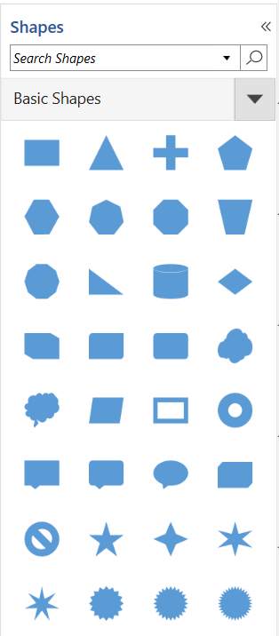

# Symbol groups of Stencil in WPF Diagram (SfDiagram)

A set of stencil symbols can be combined together to create a group and many numbers of group can be created. This helps you to look overall stencil symbols into spllitted view and it is easy to find specific or particular shape category into stencil. 

## Group symbols into a category

The symbols of the same category can be grouped using the [SymbolGroupProvider](https://help.syncfusion.com/cr/wpf/Syncfusion.UI.Xaml.Diagram.Stencil.SymbolGroupProvider.html). The `SymbolGroupProvider` groups based on the [MappingName](https://help.syncfusion.com/cr/wpf/Syncfusion.UI.Xaml.Diagram.Stencil.SymbolGroupProvider.html#Syncfusion_UI_Xaml_Diagram_Stencil_SymbolGroupProvider_MappingName) property, which has the name of the property whose value will be in the group category. In the following code example, the `MappingName` has a value of "Key" and the `SymbolGroupProvider` will create the group based on the value of the `Key` property. The symbols with the same category name could be grouped under that category.




 </Setter.Value>
 </Setter>
</Style>

   </Setter.Value>
  </Setter>
</Style>

<DataTemplate x:Key="TitleTemplate">
   <TextBlock x:Name="HeaderText" Text="{Binding}" FontSize="15" FontWeight="SemiBold"  Foreground="#2b579a" />
</DataTemplate>

<stencil:Stencil Grid.Column="0" BorderThickness="1" Title="Shapes" TitleTemplate="{StaticResource TitleTemplate}" BorderBrush="#dfdfdf" x:Name="stencil">
    <!--Initialize the SymbolSource-->
    <stencil:Stencil.SymbolSource>
    <!--Define the SymbolCollection-->
    <local:SymbolCollection>
        <syncfusion:NodeViewModel x:Name="node" UnitHeight="70" UnitWidth="100" OffsetX="100" OffsetY="100" Shape="{StaticResource Rectangle}" Key="Node">
        </syncfusion:NodeViewModel>
        <syncfusion:ConnectorViewModel SourcePoint="100,100" TargetPoint="200,200" Key="Connector"/>
        <!--Define the DiagramElement- Group-->
        <syncfusion:GroupViewModel Key="Group">
            <!--Creates the Groupable Nodes-->
            <syncfusion:GroupViewModel.Nodes>
                <syncfusion:NodeCollection>
                    <syncfusion:NodeViewModel UnitHeight="70" ID="srcnode" OffsetX="0" OffsetY="300" 
                                              UnitWidth="100"
                                              Shape="{StaticResource Rectangle}">
                    </syncfusion:NodeViewModel>
                    <syncfusion:NodeViewModel UnitHeight="70" 
                                              ID="tarnode"
                                              OffsetX="100"
                                              OffsetY="500"
                                              UnitWidth="100"
                                              Shape="{StaticResource Rectangle}">
                    </syncfusion:NodeViewModel>
                </syncfusion:NodeCollection>
            </syncfusion:GroupViewModel.Nodes>
            <!--Creates the Groupable Connectors-->
            <syncfusion:GroupViewModel.Connectors>
                <syncfusion:ConnectorCollection>
                    <syncfusion:ConnectorViewModel SourceNodeID="srcnode" TargetNodeID="tarnode"/>
                </syncfusion:ConnectorCollection>
            </syncfusion:GroupViewModel.Connectors>
        </syncfusion:GroupViewModel>
    </local:SymbolCollection>
</stencil:Stencil.SymbolSource>
    <!--Initialize the SymbolGroup-->
    <stencil:Stencil.SymbolGroups>
        <stencil:SymbolGroups>
            <!--Map Symbols Using MappingName-->
            <stencil:SymbolGroupProvider MappingName="Key">
            </stencil:SymbolGroupProvider>
        </stencil:SymbolGroups>
    </stencil:Stencil.SymbolGroups>
</stencil:Stencil>




//Define a Stencil.
Stencil stencil = new Stencil()
{
    ExpandMode =ExpandMode.All,
    BorderThickness =new Thickness(0,0,1,0),
    BorderBrush =new SolidColorBrush(Colors.Black)
};
//Define the SymbolSource with the SymbolCollection.
stencil.SymbolSource = new SymbolCollection();
NodeViewModel node = new NodeViewModel()
{
    UnitHeight = 100,
    UnitWidth = 100,
    OffsetX = 100, OffsetY = 100,
    Shape = App.Current.MainWindow.Resources["Rectangle"],
    Key = "Node"
};

ConnectorViewModel cvm = new ConnectorViewModel()
{
    SourcePoint = new Point(100, 100),
    TargetPoint = new Point(200, 200),
    Key="Connector"
};

GroupViewModel grp = new GroupViewModel()
{
    Key="Group",
    Nodes = new NodeCollection()
    {
       new NodeViewModel()
       {
        ID="srcnode",
        UnitHeight=70,
        UnitWidth=100,
        OffsetX=0,
        OffsetY=300,
        Shape=App.Current.Resources["Rectangle"]
       },
       new NodeViewModel()
       {
        ID="tarnode",
        UnitHeight=70,
        UnitWidth=100,
        OffsetX=100,
        OffsetY=500,
        Shape=App.Current.Resources["Rectangle"]
        }
    },
    Connectors = new ConnectorCollection()
    {
      new ConnectorViewModel()
      {
        SourceNodeID="srcnode", 
        TargetNodeID="tarnode"
       }
    }
};

//Add the element to the symbol collection.
(stencil.SymbolSource as SymbolCollection).Add(node);
(stencil.SymbolSource as SymbolCollection).Add(cvm);
(stencil.SymbolSource as SymbolCollection).Add(grp);

//Define the SymbolGroups.
stencil.SymbolGroups = new SymbolGroups()
{
    new SymbolGroupProvider()
    {
        MappingName = "Key"
    }
};


 

 

## Customize the appearance of the symbol group header

You can customize the appearance of each [SymbolGroup](https://help.syncfusion.com/cr/wpf/Syncfusion.UI.Xaml.Diagram.Stencil.SymbolGroup.html) header by changing the [header](https://help.syncfusion.com/cr/wpf/Syncfusion.UI.Xaml.Diagram.Stencil.Header.html) property style. The following code explains how to customize the appearance of the symbol group header.





 <!--Style for Symbol Group-->


 


## Expand and collapse the symbol group

When there is more number of symbol groups in the stencil then you can expand and collapse the symbol groups using the [ExpandMode](https://help.syncfusion.com/cr/wpf/Syncfusion.UI.Xaml.Diagram.Stencil.Stencil.html#Syncfusion_UI_Xaml_Diagram_Stencil_Stencil_ExpandMode) property of `Stencil` class. The `ExpandMode` property allows you to decide the number of symbol groups that can be expanded in a stencil.

|ExpandMode|Description|
|----------|-----------|
|All       | Enables or disables all the symbol group that can be expanded |
|One       | Enables or disables only one symbol group that can be expanded |
|OneOrMore | Enables or disables one or more symbol group that can be expanded |
|ZeroOrMore| Enables or disables none or more symbol group that can be expanded |
|ZeroOrOne | Enables or disables none or one symbol group that can be expanded |

## Symbol categories

There are plenty of shapes available in the diagram resource dictionary. It takes more time and allows repeated code samples to add all symbols to the stencil. To avoid this, the shapes are split and categorized as a list of symbols in the [StencilCategory](https://help.syncfusion.com/cr/wpf/Syncfusion.UI.Xaml.Diagram.Stencil.StencilCategory.html ) class. You can add more than one category using the [Categories](https://help.syncfusion.com/cr/wpf/Syncfusion.UI.Xaml.Diagram.Stencil.Stencil.html#Syncfusion_UI_Xaml_Diagram_Stencil_Stencil_Categories) property of the stencil class.

The `Categories` can be mentioned by using the following properties of the `StencilCategory` class,

* Keys: Specifies the static resource key name value of the category collection.
* Title: Specifies the title that should be displayed as a header of the category collection.

## Built-in symbol categories 

The built-in shape paths available in the diagram resource dictionary are grouped by categories. The following are the built-in categories being available in the diagram resource dictionary:

* BasicShapes
* FlowShapes
* ArrowShapes
* DataFlowShapes
* UMLActivity
* UMLUseCase
* UMLRelationship
* ElectricalShapes
* SwimlaneShapes
* BPMNEditorShapes



<!--Initialize the stencil-->
<Stencil:Stencil x:Name="stencil" Title="Shapes" TitleTemplate="{StaticResource TitleTemplate}"
ExpandMode="ZeroOrMore" BorderBrush="#dfdfdf" BorderThickness="1">
   <!--Initialize the stencil categories-->
    <Stencil:Stencil.Categories>
     <Stencil:StencilCategoryCollection>
       <!--Specify the basic shapes category with title and resource key-->
       <Stencil:StencilCategory Title="Basic Shapes" Keys="{StaticResource BasicShapes}"/>
        </Stencil:StencilCategoryCollection>
        </Stencil:Stencil.Categories>
        <Stencil:Stencil.SymbolGroups>
        <Stencil:SymbolGroups>
          <!--Separate groups based on the key-->
          <Stencil:SymbolGroupProvider MappingName="Key" />
        </Stencil:SymbolGroups>
    </Stencil:Stencil.SymbolGroups>
</Stencil:Stencil>



## Add the custom shapes categories

The custom symbol collections can be added to the stencil by defining the custom symbol's resource collection.




<!--custom path data-->
<sys:String x:Key="CustomPath">
    F1M1.66,0.25C0.882,0.25,0.25,0.881,0.25,1.66L0.25,24.622C0.25,25.401,0.882,26.032,1.66,26.032L4.48,26.032C5.259,26.032,5.89,25.401,5.89,24.622L5.89,1.66C5.89,0.881,5.259,0.25,4.48,0.25z
</sys:String>

<!--custom shapes collection-->
<x:Array Type="sys:String" x:Key="customShapeCollection">
    <sys:String>Rectangle</sys:String>
    <sys:String>Cube</sys:String>
    <sys:String>Triangle</sys:String>
    <sys:String>Ellipse</sys:String>
    <sys:String>CustomPath</sys:String>
</x:Array>
<DataTemplate x:Key="TitleTemplate">
   <TextBlock x:Name="HeaderText" Text="{Binding}" FontSize="15" FontWeight="SemiBold"  Foreground="#2b579a" >
   </TextBlock>
</DataTemplate>
<!--Initialize the stencil-->
<Stencil:Stencil x:Name="stencil" Title="Shapes" TitleTemplate="{StaticResource TitleTemplate}" ExpandMode="ZeroOrMore"
BorderBrush="#dfdfdf" BorderThickness="1">
    <!--Initialize the stencil categories-->
    <Stencil:Stencil.Categories>
        <Stencil:StencilCategoryCollection>
            <!--Specify the custom shapes category with title and resource key-->
            <Stencil:StencilCategory Title="Custom shapes" Keys="{StaticResource customShapeCollection}"/>
        </Stencil:StencilCategoryCollection>
    </Stencil:Stencil.Categories>
    <Stencil:Stencil.SymbolGroups>
        <Stencil:SymbolGroups>
        <!--Separate groups based on the key-->
        <Stencil:SymbolGroupProvider MappingName="Key" />
        </Stencil:SymbolGroups>
    </Stencil:Stencil.SymbolGroups>
</Stencil:Stencil>



N> The custom symbol collections should be added in the App.xaml file.

## Customize the appearance of the symbols in the built-in categories 

The built-in symbol categories symbol sizes are equivalent to the Visio symbol size. Each symbol available in the category collection can be customized by the [PrepareSymbolViewModel](https://help.syncfusion.com/cr/wpf/Syncfusion.UI.Xaml.Diagram.Stencil.Stencil.html#Syncfusion_UI_Xaml_Diagram_Stencil_Stencil_PrepareSymbolViewModel_System_Object_System_String_System_String_) virtual method of the stencil class. Symbols can be modified by using the following properties of the `PrepareSymbolViewModel` method,

* `Item`: To modify the symbol and its properties.
* `SymbolName`: To know the name of the symbol.
* `CategoryName`: To know the name of the category.

Also, you can decide whether a symbol can be added to the stencil symbol collection or not. It can be achieved by using the `Cancel` property of [CanAddSymbol](https://help.syncfusion.com/cr/wpf/Syncfusion.UI.Xaml.Diagram.Stencil.Stencil.html#Syncfusion_UI_Xaml_Diagram_Stencil_Stencil_CanAddSymbol_System_String_System_String_) the virtual method of stencil class. 



/// 

/// The custom class for the stencil view model.
/// 

public class StencilViewModel : Stencil
{
    /// 

    /// Overridden method to change the symbol.
    /// 

    /// <param name="Item">Item value of the shape</param>
    /// <param name="SymbolName">Name of the symbol</param>
    /// <param name="CategoryName">Name of the category</param>
    /// <returns>Return the item of the shape</returns>
    protected override object PrepareSymbolViewModel(object Item, string SymbolName, string CategoryName)
    {
        if (SymbolName == "Rectangle")
        {
            (Item as INode).UnitWidth = 80;
            (Item as INode).UnitHeight = 40;
            return Item;
        }
        else
            return base.PrepareSymbolViewModel(Item, SymbolName, CategoryName);
    }

    /// 

    /// Overidden method to decide whether a symbol can be added or not
    /// 

    /// <param name="symbolName">Name of the symbol</param>
    /// <param name="categoryName">Name of the category</param>
    /// <returns>Return the boolean</returns>
    protected override bool CanAddSymbol(string symbolName, string categoryName)
    {
        if (symbolName == "Triangle")
        {
            return false;            
        }

        return base.CanAddSymbol(symbolName, categoryName);
    }
}




[View Sample in GitHub](https://github.com/SyncfusionExamples/WPF-Diagram-Examples/tree/master/Samples/Stencil/StencilCategory)

## See Also

* [How to expand all SymbolGroups ?](https://www.syncfusion.com/kb/5878/how-to-expand-all-symbolgroups)