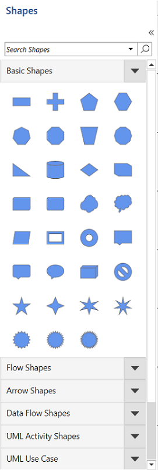
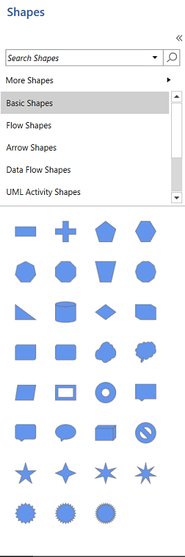
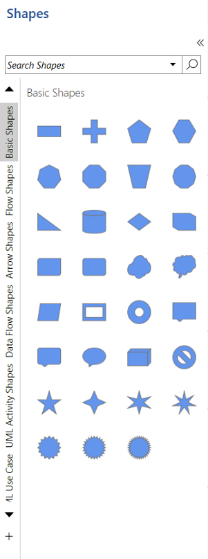

# Appearance of SymbolGroup in WPF Diagram (SfDiagram)

The appearance of the SymbolGroup in the Stencil can be changed by the SymbolGroupDisplayMode property. We can view Symbolgroups in the Accordion, List, and Tab view in the Stencil.Default value of the SymbolGroupDisplayMode is Accordion.



        <!--Initialize the stencil-->
        <stencil:Stencil x:Name="stencil" Title="Shapes" SymbolGroupDisplayMode="Accordion" BorderThickness="1" BorderBrush="Black">
        </stencil:Stencil>


            //Define a Stencil.
            Stencil stencil = new Stencil()
            {
                Title = "Shapes",
                SymbolGroupDisplayMode = SymbolGroupDisplayMode.Accordion,
                BorderThickness = new Thickness(1),
                BorderBrush = new SolidColorBrush(Colors.Black),
            };



|SymbolGroupDisplayMode|Description|Output|
|----------|-----------|-----------|
| Accordion | Symbolgroups will be displayed in the Accordion view. ||
| List | Symbolgroups will be displayed in the List view. ||
| Tab | Symbolgroups will be displayed in the Tab view. ||