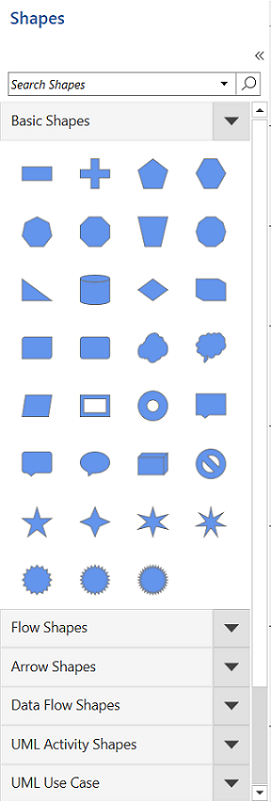
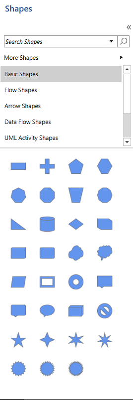
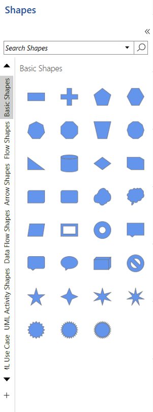

# Appearance of SymbolGroup in WPF SfDiagram

You can change the appearance of the `SymbolGroup` in the Stencil by setting the `SymbolGroupDisplayMode` property. Symbol groups can be displayed as Accordion, List, or Tab views in the Stencil.

For the `SymbolGroupViewModel` defaults (such as `IsChecked` defaulting to `true`) and the `ExpandMode` values that control which groups are expanded, see [Symbol Groups in WPF SfDiagram](https://help.syncfusion.com/wpf/diagram/stencil/symbolgroup/symbolgroup).

## Properties

| Property | Description | Type | Default |
|---|---|---|---|
| `SymbolGroupDisplayMode` | Layout used to render symbol groups inside the Stencil. | [`SymbolGroupDisplayMode`](https://help.syncfusion.com/cr/wpf/Syncfusion.UI.Xaml.Diagram.Stencil.SymbolGroupDisplayMode.html) | `Accordion` |
| `SymbolSelectionMode` | Allows single or multiple symbol selection. | [`SymbolSelectionMode`](https://help.syncfusion.com/cr/wpf/Syncfusion.UI.Xaml.Diagram.Stencil.SymbolSelectionMode.html) | `Single` |
| `DisplayMode` | Visibility state of the Stencil window (`Compact` for a narrow sliver that can be opened, or `Expanded`). | [`DisplayMode`](https://help.syncfusion.com/cr/wpf/Syncfusion.UI.Xaml.Diagram.Stencil.DisplayMode.html) | `Compact` |
| `GroupMappingName` | Property name used to bucket symbols into groups. | `string` | `null` |
| `Title` | Title text shown above the Stencil. | `object` | `null` |

## Display Modes

The `SymbolGroupDisplayMode` enum supports the following values:

| Value | Description | Output |
|---|---|---|
| `Accordion` | Displays symbol groups in a vertical, collapsible list; only one group is expanded at a time. |  |
| `List` | Displays symbol groups in a flat list; multiple groups can be expanded at once. |  |
| `Tab` | Displays symbol groups as tabs; users switch between groups by clicking a tab. |  |

Combine `SymbolGroupDisplayMode` with `SymbolSelectionMode` to control whether users can select one or multiple symbols. The initial expansion of *individual* symbol groups is controlled separately by the Stencil's `ExpandMode` property and each `SymbolGroupViewModel.IsExpanded` flag — `DisplayMode` only toggles the Stencil window itself between `Compact` and `Expanded`.

## Sample

The following sample sets `SymbolGroupDisplayMode` to `Accordion` inside a runnable `Window`. The Stencil is placed in the first column and an `SfDiagram` in the second column to receive dropped symbols.




<Window x:Class="StencilSample.MainWindow"
        xmlns="http://schemas.microsoft.com/winfx/2006/xaml/presentation"
        xmlns:x="http://schemas.microsoft.com/winfx/2006/xaml"
        xmlns:syncfusion="http://schemas.syncfusion.com/wpf"
        xmlns:stencil="clr-namespace:Syncfusion.UI.Xaml.Diagram.Stencil;assembly=Syncfusion.SfDiagram.WPF"
        Title="Appearance" Height="600" Width="900">

    <Grid>
        <Grid.ColumnDefinitions>
            <ColumnDefinition Width="250"/>
            <ColumnDefinition Width="*"/>
        </Grid.ColumnDefinitions>

        <!-- Initialize the Stencil -->
        <stencil:Stencil x:Name="stencil"
                         Grid.Column="0"
                         Title="Shapes"
                         SymbolGroupDisplayMode="Accordion"
                         BorderThickness="1"
                         BorderBrush="Black"/>

        <syncfusion:SfDiagram x:Name="diagram" Grid.Column="1"/>
    </Grid>
</Window>





// Define a Stencil.
Stencil stencil = new Stencil()
{
    Title = "Shapes",
    SymbolGroupDisplayMode = SymbolGroupDisplayMode.Accordion,
    BorderThickness = new Thickness(1),
    BorderBrush = new SolidColorBrush(Colors.Black),
};




## See Also

[How to expand all SymbolGroups?](https://support.syncfusion.com/kb/article/5492/how-to-expand-all-symbol-groups-in-wpf-diagram-sfdiagram)

[How to group all the SymbolViewModels into the same group in the WPF Diagram (SfDiagram)?](https://support.syncfusion.com/kb/article/18672/how-to-group-all-the-symbolviewmodels-into-the-same-group-in-the-wpf-diagram-sfdiagram)

[How to change the background color of a symbol in WPF SfDiagram?](https://support.syncfusion.com/kb/article/18241/how-to-change-the-background-color-of-a-symbol-in-wpf-sfdiagram)
