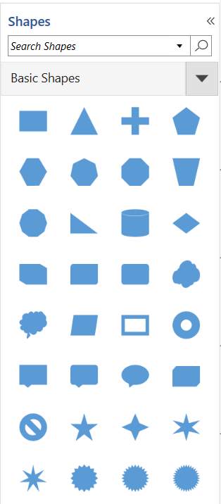
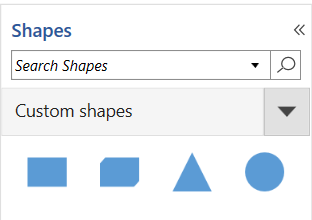
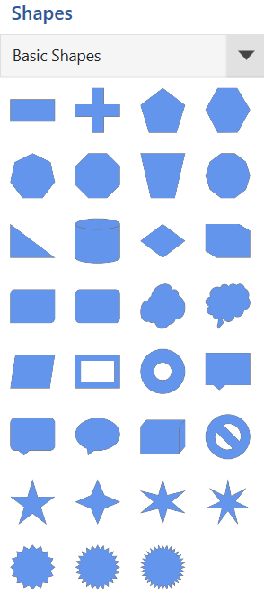

# Symbol groups of Stencil in WPF Diagram (SfDiagram)

A set of stencil symbols can be combined together to create a group and many numbers of group can be created. This helps you to look overall stencil symbols into split view and it is easy to find specific or particular shape category into stencil. 

## Group symbols into a category

The symbols of the same category can be grouped using the [GroupMappingName](https://help.syncfusion.com/cr/wpf/Syncfusion.UI.Xaml.Diagram.Stencil.Stencil.html#Syncfusion_UI_Xaml_Diagram_Stencil_Stencil_GroupMappingName) property of the [Stencil](https://help.syncfusion.com/cr/wpf/Syncfusion.UI.Xaml.Diagram.Stencil.html) class. The `Stencil` groups the symbols based on the `GroupMappingName` property, which specifies the name of the property whose value will determine the group category. In the following code example, the `GroupMappingName` is set to "Key", so the `Stencil` will create the SymbolGroups based on the value of the Key property.




<!--Style for Node-->

        </Setter.Value>
    </Setter>
</Style>

<!--Style for Connector-->

        </Setter.Value>
    </Setter>
</Style>

<!--Template for the Stencil title-->
<DataTemplate x:Key="TitleTemplate">
   <TextBlock x:Name="HeaderText" Text="{Binding}" FontSize="15" FontWeight="SemiBold"  Foreground="#2b579a" />
</DataTemplate>

<!--Initialize the stencil-->
<stencil:Stencil x:Name="stencil"
                  Grid.Column="0"
                  Grid.Row="1"
                  ExpandMode="ZeroOrMore"
                  BorderBrush="#dfdfdf"
                  BorderThickness="1"
                  GroupMappingName="Key"
                  Title="Shapes"
                  TitleTemplate="{StaticResource TitleTemplate}">
    <stencil:Stencil.SymbolSource>
        <syncfusion:SymbolCollection>
            <!--Define the Node element-->
            <syncfusion:NodeViewModel x:Name="node"
                                      Key="Node"
                                      UnitHeight="70"
                                      UnitWidth="100"
                                      OffsetX="100"
                                      OffsetY="100"
                                      Shape="{StaticResource Rectangle}">
            </syncfusion:NodeViewModel>
            <!--Define the Connector-->
            <syncfusion:ConnectorViewModel Key="Connector"
                                           SourcePoint="100,100"
                                           TargetPoint="200,200" />
            <!--Define the Group element-->
            <syncfusion:GroupViewModel Key="Group">
                <!--Creates the Group Nodes-->
                <syncfusion:GroupViewModel.Nodes>
                    <syncfusion:NodeCollection>
                        <syncfusion:NodeViewModel ID="srcnode"
                                                  UnitHeight="70"
                                                  UnitWidth="100"
                                                  OffsetX="0"
                                                  OffsetY="300"
                                                  Shape="{StaticResource Rectangle}">
                        </syncfusion:NodeViewModel>
                        <syncfusion:NodeViewModel ID="tarnode"
                                                  UnitHeight="70"
                                                  OffsetX="100"
                                                  OffsetY="500"
                                                  UnitWidth="100"
                                                  Shape="{StaticResource Rectangle}">
                        </syncfusion:NodeViewModel>
                    </syncfusion:NodeCollection>
                </syncfusion:GroupViewModel.Nodes>
                <!--Creates the Group Connectors-->
                <syncfusion:GroupViewModel.Connectors>
                    <syncfusion:ConnectorCollection>
                        <syncfusion:ConnectorViewModel SourceNodeID="srcnode"
                                                       TargetNodeID="tarnode" />
                    </syncfusion:ConnectorCollection>
                </syncfusion:GroupViewModel.Connectors>
            </syncfusion:GroupViewModel>
        </syncfusion:SymbolCollection>
    </stencil:Stencil.SymbolSource>
</stencil:Stencil>




//Define a Stencil.
Stencil stencil = new Stencil()
{
    GroupMappingName = "Key",
};

//Define the SymbolSource with the SymbolCollection.
stencil.SymbolSource = new SymbolCollection();
NodeViewModel node = new NodeViewModel()
{
    Key = "Node",
    UnitHeight = 100,
    UnitWidth = 100,
    OffsetX = 100, 
    OffsetY = 100,
    Shape = this.Resources["Rectangle"],
};

ConnectorViewModel connector = new ConnectorViewModel()
{
    Key="Connector",
    SourcePoint = new Point(100, 100),
    TargetPoint = new Point(200, 200),
};

GroupViewModel group = new GroupViewModel()
{
    Key="Group",
    Nodes = new NodeCollection()
    {
       new NodeViewModel()
       {
            ID = "srcnode",
            UnitHeight = 70,
            UnitWidth = 100,
            OffsetX = 0,
            OffsetY = 300,
            Shape = this.Resources["Rectangle"]
       },
       new NodeViewModel()
       {
            ID = "tarnode",
            UnitHeight = 70,
            UnitWidth = 100,
            OffsetX = 100,
            OffsetY = 500,
            Shape = this.Resources["Rectangle"]
        }
    },
    Connectors = new ConnectorCollection()
    {
      new ConnectorViewModel()
      {
            SourceNodeID = "srcnode", 
            TargetNodeID = "tarnode"
       }
    }
};

//Add the element to the symbol collection.
(stencil.SymbolSource as SymbolCollection).Add(node);
(stencil.SymbolSource as SymbolCollection).Add(connector);
(stencil.SymbolSource as SymbolCollection).Add(group);


 

## Customize the appearance of the symbol group header

You can customize the appearance of each [SymbolGroup](https://help.syncfusion.com/cr/wpf/Syncfusion.UI.Xaml.Diagram.Stencil.SymbolGroup.html) header by changing the [`header`](https://help.syncfusion.com/cr/wpf/Syncfusion.UI.Xaml.Diagram.Stencil.Header.html) property style. The following code explains how to customize the appearance of the symbol group header.





 <!--Style for Symbol Group-->


 


 

## Expand and collapse the symbol group

When there is more number of symbol groups in the stencil, then you can expand and collapse the symbol groups using the [`ExpandMode`](https://help.syncfusion.com/cr/wpf/Syncfusion.UI.Xaml.Diagram.Stencil.Stencil.html#Syncfusion_UI_Xaml_Diagram_Stencil_Stencil_ExpandMode) property of `Stencil` class. The `ExpandMode` property allows you to decide the number of symbol groups that can be expanded in a stencil.

|ExpandMode|Description|Output|
|----------|-----------|-----------|
|All       | Enables all the symbol group that can be expanded | |
|One       | Enables only one symbol group that can be expanded ||
|OneOrMore | Enables one or more symbol group that can be expanded ||
|ZeroOrMore| Enables none or more symbol group that can be expanded ||
|ZeroOrOne | Enables none or one symbol group that can be expanded ||

## Symbol categories

There are plenty of shapes available in the diagram resource dictionary. It takes more time and allows repeated code samples to add all symbols to the stencil. To avoid this, the shapes are split and categorized as a list of symbols in the [StencilCategory](https://help.syncfusion.com/cr/wpf/Syncfusion.UI.Xaml.Diagram.Stencil.StencilCategory.html ) class. You can add more than one category using the [`Categories`](https://help.syncfusion.com/cr/wpf/Syncfusion.UI.Xaml.Diagram.Stencil.Stencil.html#Syncfusion_UI_Xaml_Diagram_Stencil_Stencil_Categories) property of the stencil class.

The `Categories` can be mentioned by using the following properties of the `StencilCategory` class:

* Keys: Specifies the static resource key name value of the category collection.
* Title: Specifies the title that should be displayed as a header of the category collection.

## Built-in symbol categories 

The built-in shape paths available in the diagram resource dictionary are grouped by categories. The following are the built-in categories being available in the diagram resource dictionary:

* BasicShapes
* FlowShapes
* ArrowShapes
* DataFlowShapes
* UMLActivity
* UMLUseCase
* UMLRelationship
* ElectricalShapes
* SwimlaneShapes
* BPMNEditorShapes



<!--Initialize the stencil-->
<stencil:Stencil x:Name="stencil" 
                 Title="Shapes" 
                 TitleTemplate="{StaticResource TitleTemplate}"
                 ExpandMode="ZeroOrMore" 
                 BorderBrush="#dfdfdf" 
                 BorderThickness="1"
                 GroupMappingKey="Key">
   <!--Initialize the stencil categories-->
    <stencil:Stencil.Categories>
        <stencil:StencilCategoryCollection>
            <!--Specify the basic shapes category with title and resource key-->
            <stencil:StencilCategory Title="Basic Shapes" Keys="{StaticResource BasicShapes}"/>
        </stencil:StencilCategoryCollection>
    </stencil:Stencil.Categories>
</stencil:Stencil>



## Add the custom shapes categories

The custom symbol collections can be added to the stencil by defining the custom symbol's resource collection.




<!--custom path data-->
<sys:String x:Key="CustomPath">
    F1M1.66,0.25C0.882,0.25,0.25,0.881,0.25,1.66L0.25,24.622C0.25,25.401,0.882,26.032,1.66,26.032L4.48,26.032C5.259,26.032,5.89,25.401,5.89,24.622L5.89,1.66C5.89,0.881,5.259,0.25,4.48,0.25z
</sys:String>

<!--custom shapes collection-->
<x:Array Type="sys:String" x:Key="customShapeCollection">
    <sys:String>Rectangle</sys:String>
    <sys:String>Cube</sys:String>
    <sys:String>Triangle</sys:String>
    <sys:String>Ellipse</sys:String>
    <sys:String>CustomPath</sys:String>
</x:Array>

<!--Template for stencil title-->
<DataTemplate x:Key="TitleTemplate">
   <TextBlock x:Name="HeaderText" Text="{Binding}" FontSize="15" FontWeight="SemiBold"  Foreground="#2b579a" >
   </TextBlock>
</DataTemplate>

<!--Initialize the stencil-->
<stencil:Stencil x:Name="stencil" Title="Shapes" TitleTemplate="{StaticResource TitleTemplate}" ExpandMode="ZeroOrMore"
BorderBrush="#dfdfdf" BorderThickness="1">
    <!--Initialize the stencil categories-->
    <stencil:Stencil.Categories>
        <stencil:StencilCategoryCollection>
            <!--Specify the custom shapes category with title and resource key-->
            <stencil:StencilCategory Title="Custom shapes" Keys="{StaticResource customShapeCollection}"/>
        </stencil:StencilCategoryCollection>
    </stencil:Stencil.Categories>
</Stencil:Stencil>



N> The custom symbol collections should be added in the App.xaml file.

## Customize the appearance of the symbols in the built-in categories 

The symbol sizes for the built-in symbol categories are equivalent to the Visio symbol size. Each symbol available in the category collection can be customized by the [PrepareSymbolViewModel](https://help.syncfusion.com/cr/wpf/Syncfusion.UI.Xaml.Diagram.Stencil.Stencil.html#Syncfusion_UI_Xaml_Diagram_Stencil_Stencil_PrepareSymbolViewModel_System_Object_System_String_System_String_) virtual method of the stencil class. Symbols can be modified by using the following properties of the `PrepareSymbolViewModel` method:

* `Item`: To modify the symbol and its properties.
* `SymbolName`: To know the name of the symbol.
* `CategoryName`: To know the name of the category.

Also, you can decide whether a symbol can be added to the stencil symbol collection or not. It can be achieved by using the `Cancel` property of [CanAddSymbol](https://help.syncfusion.com/cr/wpf/Syncfusion.UI.Xaml.Diagram.Stencil.Stencil.html#Syncfusion_UI_Xaml_Diagram_Stencil_Stencil_CanAddSymbol_System_String_System_String_), the virtual method of stencil class. 



/// 

/// The custom class for the stencil view model.
/// 

public class StencilViewModel : Stencil
{
    /// 

    /// Overridden method to change the symbol.
    /// 

    /// <param name="Item">Item value of the shape</param>
    /// <param name="SymbolName">Name of the symbol</param>
    /// <param name="CategoryName">Name of the category</param>
    /// <returns>Return the item of the shape</returns>
    protected override object PrepareSymbolViewModel(object Item, string SymbolName, string CategoryName)
    {
        if (SymbolName == "Rectangle")
        {
            (Item as INode).UnitWidth = 80;
            (Item as INode).UnitHeight = 40;
            return Item;
        }
        else
            return base.PrepareSymbolViewModel(Item, SymbolName, CategoryName);
    }

    /// 

    /// Overidden method to decide whether a symbol can be added or not
    /// 

    /// <param name="symbolName">Name of the symbol</param>
    /// <param name="categoryName">Name of the category</param>
    /// <returns>Return the boolean</returns>
    protected override bool CanAddSymbol(string symbolName, string categoryName)
    {
        if (symbolName == "Triangle")
        {
            return false;            
        }

        return base.CanAddSymbol(symbolName, categoryName);
    }
}




[View Sample in GitHub](https://github.com/SyncfusionExamples/WPF-Diagram-Examples/tree/master/Samples/Stencil/StencilCategory)

## View Models for the SymbolGroups

The `SfDiagram` provides supports to populate view models for each SymbolGroup created for the symbols added through the `SymbolSource` property. 

The [SymbolGroupViewModel](https://help.syncfusion.com/cr/wpf/Syncfusion.UI.Xaml.Diagram.Stencil.SymbolGroupViewModel.html) class provides the support to create the view models to the symbol group and provides supports to add symbols to it as Node, Connectors, groups and list of predefined symbols.

* [Name](https://help.syncfusion.com/cr/wpf/Syncfusion.UI.Xaml.Diagram.Stencil.SymbolGroupViewModel.html#Syncfusion_UI_Xaml_Diagram_Stencil_SymbolGroupViewModel_Name): Specifies the display name of the symbol group. It also adds the symbols to the symbol groups defined through the `SymbolSource` property which symbol has same `Key` value as this `Name` property.
* [Symbols](https://help.syncfusion.com/cr/wpf/Syncfusion.UI.Xaml.Diagram.Stencil.SymbolGroupViewModel.html#Syncfusion_UI_Xaml_Diagram_Stencil_SymbolGroupViewModel_Symbols): Specifies the list of symbols need to be added to the symbol group. It can be any diagram elements of Nodes, Connectors, Groups, Containers, BPMN elements.
* [CategorySource](https://help.syncfusion.com/cr/wpf/Syncfusion.UI.Xaml.Diagram.Stencil.SymbolGroupViewModel.html#Syncfusion_UI_Xaml_Diagram_Stencil_SymbolGroupViewModel_CategorySource): Specifies the list of symbols need to be added to the `SymbolGroupViewModel` using the static resource key value from the predefined category collections.

In addition to that, new symbols can be added into the symbol groups or you can remove the existing symbols from any symbol group at run time. As same as symbols, new symbol group can be added into the stencil and remove the existing symbol group from the stencil.


<!--Initialize the stencil-->
<syncfusion:Stencil x:Name="stencil" 
                    Title="Shapes"
                    SymbolGroupDisplayMode="Accordion"
                    SymbolSelectionMode="Multiple"
                    DisplayMode="Expanded"
                    GroupMappingName="Key">
    <!--Initialize the symbol groups-->
    <syncfusion:Stencil.SymbolGroups>
        <syncfusion:SymbolGroups>
            <syncfusion:SymbolGroupViewModel Name="Basic Shapes" CategorySource="{StaticResource BasicShapes}">
                <syncfusion:SymbolGroupViewModel.Symbols>
                    <syncfusion:SymbolCollection>
                        <syncfusion:NodeViewModel Name="Object" 
                                                  UnitHeight="50"
                                                  UnitWidth="50"
                                                  Shape="{StaticResource Object}"/>
                        <syncfusion:NodeViewModel Name="User" 
                                                  UnitHeight="50"
                                                  UnitWidth="50"
                                                  Shape="{StaticResource User}"/>
                    </syncfusion:SymbolCollection>
                </syncfusion:SymbolGroupViewModel.Symbols>
            </syncfusion:SymbolGroupViewModel>
        </syncfusion:SymbolGroups>
    </syncfusion:Stencil.SymbolGroups>
</syncfusion:Stencil>


[View Sample in GitHub](https://github.com/SyncfusionExamples/WPF-Diagram-Examples/tree/master/Samples/Stencil/SymbolGroupViewModel/BasicSymbolGroupViewModel)

## See also

[How to expand all SymbolGroups?](https://support.syncfusion.com/kb/article/5492/how-to-expand-all-symbol-groups-in-wpf-diagram-sfdiagram)