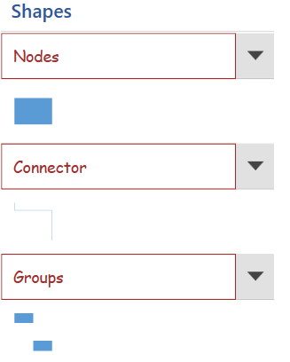
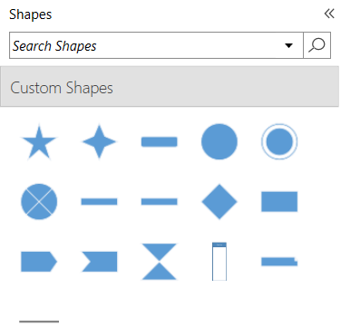
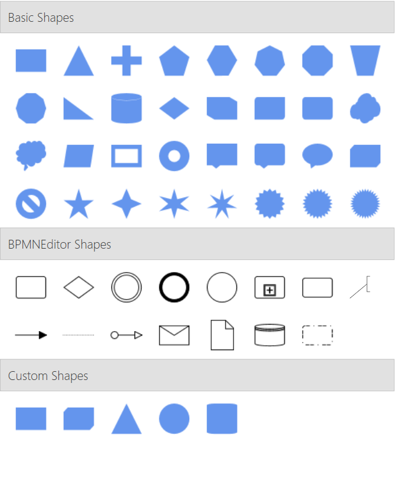

# Symbol groups of Stencil in WPF Diagram (SfDiagram)

A set of stencil symbols can be combined together to create a group and many numbers of group can be created. This helps you to look overall stencil symbols into split view and it is easy to find specific or particular shape category into stencil. 

## SymbolCollection With GroupMappingName in Stencil

The symbols of the same category can be grouped using the [GroupMappingName](https://help.syncfusion.com/cr/wpf/Syncfusion.UI.Xaml.Diagram.Stencil.Stencil.html#Syncfusion_UI_Xaml_Diagram_Stencil_Stencil_GroupMappingName) property of the [Stencil](https://help.syncfusion.com/cr/wpf/Syncfusion.UI.Xaml.Diagram.Stencil.html) class. The `Stencil` groups the symbols based on the `GroupMappingName` property, which specifies the name of the property whose value will determine the group category. In the following code example, the `GroupMappingName` is set to "Key", so the `Stencil` will create the SymbolGroups based on the value of the Key property.




<!--Style for Node-->

        </Setter.Value>
    </Setter>
</Style>

<!--Style for Connector-->

        </Setter.Value>
    </Setter>
</Style>

<!--Template for the Stencil title-->
<DataTemplate x:Key="TitleTemplate">
   <TextBlock x:Name="HeaderText" Text="{Binding}" FontSize="15" FontWeight="SemiBold"  Foreground="#2b579a" />
</DataTemplate>

<!--Initialize the stencil-->
<stencil:Stencil x:Name="stencil"
                  Grid.Column="0"
                  Grid.Row="1"
                  ExpandMode="ZeroOrMore"
                  BorderBrush="#dfdfdf"
                  BorderThickness="1"
                  GroupMappingName="Key"
                  Title="Shapes"
                  TitleTemplate="{StaticResource TitleTemplate}">
    <stencil:Stencil.SymbolSource>
        <syncfusion:SymbolCollection>
            <!--Define the Node element-->
            <syncfusion:NodeViewModel x:Name="node"
                                      Key="Node"
                                      UnitHeight="70"
                                      UnitWidth="100"
                                      OffsetX="100"
                                      OffsetY="100"
                                      Shape="{StaticResource Rectangle}">
            </syncfusion:NodeViewModel>
            <!--Define the Connector-->
            <syncfusion:ConnectorViewModel Key="Connector"
                                           SourcePoint="100,100"
                                           TargetPoint="200,200" />
            <!--Define the Group element-->
            <syncfusion:GroupViewModel Key="Group">
                <!--Creates the Group Nodes-->
                <syncfusion:GroupViewModel.Nodes>
                    <syncfusion:NodeCollection>
                        <syncfusion:NodeViewModel ID="srcnode"
                                                  UnitHeight="70"
                                                  UnitWidth="100"
                                                  OffsetX="0"
                                                  OffsetY="300"
                                                  Shape="{StaticResource Rectangle}">
                        </syncfusion:NodeViewModel>
                        <syncfusion:NodeViewModel ID="tarnode"
                                                  UnitHeight="70"
                                                  OffsetX="100"
                                                  OffsetY="500"
                                                  UnitWidth="100"
                                                  Shape="{StaticResource Rectangle}">
                        </syncfusion:NodeViewModel>
                    </syncfusion:NodeCollection>
                </syncfusion:GroupViewModel.Nodes>
                <!--Creates the Group Connectors-->
                <syncfusion:GroupViewModel.Connectors>
                    <syncfusion:ConnectorCollection>
                        <syncfusion:ConnectorViewModel SourceNodeID="srcnode"
                                                       TargetNodeID="tarnode" />
                    </syncfusion:ConnectorCollection>
                </syncfusion:GroupViewModel.Connectors>
            </syncfusion:GroupViewModel>
        </syncfusion:SymbolCollection>
    </stencil:Stencil.SymbolSource>
</stencil:Stencil>




//Define a Stencil.
Stencil stencil = new Stencil()
{
    GroupMappingName = "Key",
};

//Define the SymbolSource with the SymbolCollection.
stencil.SymbolSource = new SymbolCollection();
NodeViewModel node = new NodeViewModel()
{
    Key = "Node",
    UnitHeight = 100,
    UnitWidth = 100,
    OffsetX = 100, 
    OffsetY = 100,
    Shape = this.Resources["Rectangle"],
};

ConnectorViewModel connector = new ConnectorViewModel()
{
    Key="Connector",
    SourcePoint = new Point(100, 100),
    TargetPoint = new Point(200, 200),
};

GroupViewModel group = new GroupViewModel()
{
    Key="Group",
    Nodes = new NodeCollection()
    {
       new NodeViewModel()
       {
            ID = "srcnode",
            UnitHeight = 70,
            UnitWidth = 100,
            OffsetX = 0,
            OffsetY = 300,
            Shape = this.Resources["Rectangle"]
       },
       new NodeViewModel()
       {
            ID = "tarnode",
            UnitHeight = 70,
            UnitWidth = 100,
            OffsetX = 100,
            OffsetY = 500,
            Shape = this.Resources["Rectangle"]
        }
    },
    Connectors = new ConnectorCollection()
    {
      new ConnectorViewModel()
      {
            SourceNodeID = "srcnode", 
            TargetNodeID = "tarnode"
       }
    }
};

//Add the element to the symbol collection.
(stencil.SymbolSource as SymbolCollection).Add(node);
(stencil.SymbolSource as SymbolCollection).Add(connector);
(stencil.SymbolSource as SymbolCollection).Add(group);


 

## Customize the appearance of the symbol group header

You can customize the appearance of each [SymbolGroup](https://help.syncfusion.com/cr/wpf/Syncfusion.UI.Xaml.Diagram.Stencil.SymbolGroup.html) header by changing the [`header`](https://help.syncfusion.com/cr/wpf/Syncfusion.UI.Xaml.Diagram.Stencil.Header.html) property style. The following code explains how to customize the appearance of the symbol group header.





 <!--Style for Symbol Group-->


 


 

## Expand and collapse the symbol group

When there is more number of symbol groups in the stencil, then you can expand and collapse the symbol groups using the [`ExpandMode`](https://help.syncfusion.com/cr/wpf/Syncfusion.UI.Xaml.Diagram.Stencil.Stencil.html#Syncfusion_UI_Xaml_Diagram_Stencil_Stencil_ExpandMode) property of `Stencil` class. The `ExpandMode` property allows you to decide the number of symbol groups that can be expanded in a stencil.

|ExpandMode|Description|Output|
|----------|-----------|-----------|
|All       | Enables all the symbol group that can be expanded | |
|One       | Enables only one symbol group that can be expanded ||
|OneOrMore | Enables one or more symbol group that can be expanded ||
|ZeroOrMore| Enables none or more symbol group that can be expanded ||
|ZeroOrOne | Enables none or one symbol group that can be expanded ||

## SymbolGroupViewModel in Stencil

The [SymbolGroupViewModel](https://help.syncfusion.com/cr/wpf/Syncfusion.UI.Xaml.Diagram.Stencil.SymbolGroupViewModel.html) class provides the support to create the view models to the symbol group and provides supports to add symbols to it as Node, Connectors, groups and list of predefined symbols. It includes the following properties:

* [Name](https://help.syncfusion.com/cr/wpf/Syncfusion.UI.Xaml.Diagram.Stencil.SymbolGroupViewModel.html#Syncfusion_UI_Xaml_Diagram_Stencil_SymbolGroupViewModel_Name): Specifies the display name of the symbol group. It also adds the symbols to the symbol groups defined through the `SymbolSource` property which symbol has same `Key` value as this `Name` property.
* [Symbols](https://help.syncfusion.com/cr/wpf/Syncfusion.UI.Xaml.Diagram.Stencil.SymbolGroupViewModel.html#Syncfusion_UI_Xaml_Diagram_Stencil_SymbolGroupViewModel_Symbols): Specifies the list of symbols need to be added to the symbol group. It can be any diagram elements such as Nodes, Connectors, Groups, Containers, BPMN elements.
* [CategorySource](https://help.syncfusion.com/cr/wpf/Syncfusion.UI.Xaml.Diagram.Stencil.SymbolGroupViewModel.html#Syncfusion_UI_Xaml_Diagram_Stencil_SymbolGroupViewModel_CategorySource): Specifies the list of symbols need to be added to the `SymbolGroupViewModel` using the static resource key value from the predefined category collections.

Additionally, You can dynamically add new symbols to symbol groups or remove existing ones at runtime. Similarly, you can also add or remove entire symbol groups within the stencil as needed.

### Adding Symbols via Symbols Property in SymbolGroupViewModel

To add symbols through the `Symbols` property, you can define a collection of symbols directly within the `SymbolGroupViewModel`, allowing for more customized symbol definitions.



<!--Initialize the stencil-->
<syncfusion:Stencil x:Name="stencil" 
                    Title="Shapes"
                    SymbolGroupDisplayMode="Accordion"
                    SymbolSelectionMode="Multiple"
                    DisplayMode="Expanded"
                    GroupMappingName="Key">
        <syncfusion:Stencil.SymbolGroups>
            <syncfusion:SymbolGroups>
                <syncfusion:SymbolGroupViewModel>
                    <syncfusion:SymbolGroupViewModel.Symbols>
                        <syncfusion:SymbolCollection>
                            <syncfusion:NodeViewModel Name="Object" 
                                                      UnitHeight="50"
                                                      UnitWidth="50"
                                                      Shape="{StaticResource Object}"/>
                            <syncfusion:NodeViewModel Name="User" 
                                                      UnitHeight="50"
                                                      UnitWidth="50"
                                                      Shape="{StaticResource User}"/>
                        </syncfusion:SymbolCollection>
                    </syncfusion:SymbolGroupViewModel.Symbols>
                </syncfusion:SymbolGroupViewModel>
            </syncfusion:SymbolGroups>
        </syncfusion:Stencil.SymbolGroups>
</syncfusion:Stencil>



[View Sample in GitHub](https://github.com/SyncfusionExamples/WPF-Diagram-Examples/tree/master/Samples/Stencil/SymbolGroupViewModel/BasicSymbolGroupViewModel)

### Adding Symbols via CategorySource Property in SymbolGroupViewModel

The `sfDiagram` resource dictionary includes a wide array of shapes organized into categorized lists. These shape paths are grouped into specific categories to simplify the process of adding them to the stencil, avoiding repetitive additions. Below are the built-in categories available in the diagram resource dictionary:

* BasicShapes
* FlowShapes
* ArrowShapes
* DataFlowShapes
* UMLActivity
* UMLUseCase
* UMLRelationship
* ElectricalShapes
* SwimlaneShapes
* BPMNEditorShapes

You can also create custom symbol collections. This additional flexibility allows you to tailor the stencil to your specific needs beyond the built-in options.

To add symbols to a Stencil through `SymbolGroupViewModel`, you can utilize the `CategorySource` property, which allows you to bind a predefined collection of symbols based on a static resource key. This enables dynamic loading of symbols into the group, ensuring that any updates to the category collection are reflected in the symbol group automatically.



<ResourceDictionary>
    <ResourceDictionary.MergedDictionaries>
        <!--Dictionary which contains the inbuilt shapes-->
        <ResourceDictionary Source="/Syncfusion.SfDiagram.Wpf;component/Resources/BasicShapes.xaml" />
    </ResourceDictionary.MergedDictionaries>

    <!--custom path data-->
    <sys:String x:Key="CustomPath">
        F1M1.66,0.25C0.882,0.25,0.25,0.881,0.25,1.66L0.25,24.622C0.25,25.401,0.882,26.032,1.66,26.032L4.48,26.032C5.259,26.032,5.89,25.401,5.89,24.622L5.89,1.66C5.89,0.881,5.259,0.25,4.48,0.25z
    </sys:String>

    <!--custom shapes collection-->
    <x:Array Type="sys:String" x:Key="customShapeCollection">
        <sys:String>Rectangle</sys:String>
        <sys:String>Cube</sys:String>
        <sys:String>Triangle</sys:String>
        <sys:String>Ellipse</sys:String>
        <sys:String>CustomPath</sys:String>
    </x:Array>
</ResourceDictionary>

<!--Initialize the stencil-->
<syncfusion:Stencil x:Name="stencil" 
                    Title="Shapes"
                    SymbolGroupDisplayMode="Accordion"
                    SymbolSelectionMode="Multiple"
                    DisplayMode="Expanded"
                    GroupMappingName="Key">
    <syncfusion:Stencil.SymbolGroups>
            <syncfusion:SymbolGroups>
                <syncfusion:SymbolGroupViewModel Name="Basic Shapes" CategorySource="{StaticResource BasicShapes}"/>
                <syncfusion:SymbolGroupViewModel Name="BPMNEditor Shapes" CategorySource="{StaticResource BPMNEditorShapes}"/>
                <syncfusion:SymbolGroupViewModel Name="Custom Shapes" CategorySource="{StaticResource customShapeCollection}"/>
            </syncfusion:SymbolGroups>
    </syncfusion:Stencil.SymbolGroups>
</syncfusion:Stencil>



[View Sample in GitHub](https://github.com/SyncfusionExamples/WPF-Diagram-Examples/tree/master/Samples/Stencil/StencilCategory)

## See also

[How to expand all SymbolGroups?](https://support.syncfusion.com/kb/article/5492/how-to-expand-all-symbol-groups-in-wpf-diagram-sfdiagram)