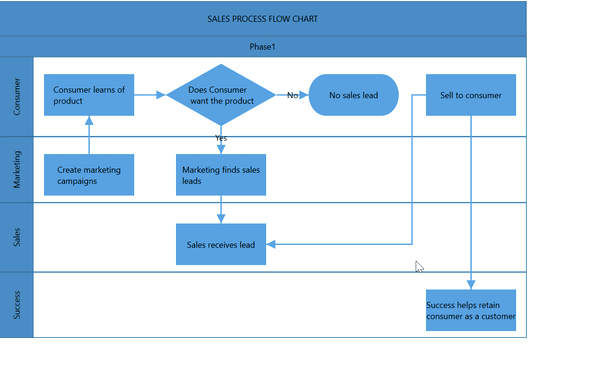
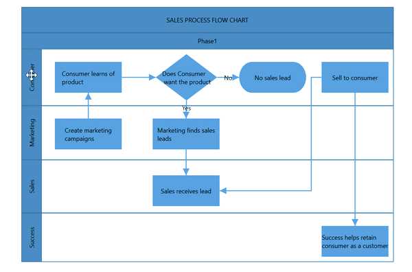
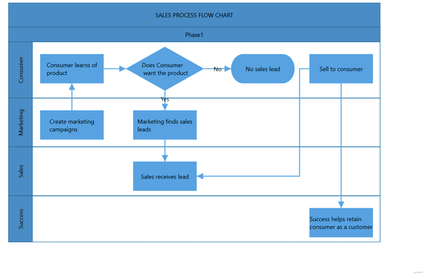

# Lane interaction in WPF Diagram(SfDiagram)

Diagram provides support to select, resize, or swap the lane interactively. 

### Select

Lane can be selected by clicking (tap) the header of the lane.

* The `IsSelected` Property is used to select or unselect the lane at runtime.

## Resizing lane

* Lane can be resized in the bottom and right direction.
* Lane can be resized by using resize selector of the lane.
* Lane can be resized by resizing the bottom and right border of the lane without make a selection.
* Once you can resize the lane,the swimlane will be resized automatically.
* The lane can be resized either resizing the selector or the tight bounds of the child object. If the child node move to edge of the lane it can be automatically resized.
* The `SwimlaneChildChangedEvent` will notify the `UnitHeight` and `UnitWidth` changes with their old and new values. Along with that, this event will give information about  interaction state. To explore about arguments, refer to the [SwimlaneChildChangedEvent](https://help.syncfusion.com/cr/cref_files/wpf/Syncfusion.SfDiagram.WPF~Syncfusion.UI.Xaml.Diagram.IGraphInfo~SwimlaneChildChangedEvent_EV.html) 
The following image illustrates how resize the lane.

## Lane swapping

* Lanes can be swapped using drag the lanes over another lane.
* Helper should intimate the insertion point while lane swapping.
The following image illustrates how swapping the lane.
* The `SwimlaneChildChangedEvent` will notify the `RowIndex` and `ColumnIndex` changes with their old and new values. Along with that, this event will give information about  interaction state. To explore about arguments, refer to the [SwimlaneChildChangedEvent](https://help.syncfusion.com/cr/cref_files/wpf/Syncfusion.SfDiagram.WPF~Syncfusion.UI.Xaml.Diagram.IGraphInfo~SwimlaneChildChangedEvent_EV.html) 

## Children interaction in lanes

* You can resize the child node within swimlanes.
* You can drag the child nodes within lane.
* Interchange the child nodes from one lane to another lane.
* Drag and drop the child nodes from lane to diagram.
* Drag and drop the child nodes from diagram to lane.
* Based on the child node interactions,the lane size should be updated.
The following image illustrates children interaction in lane.

