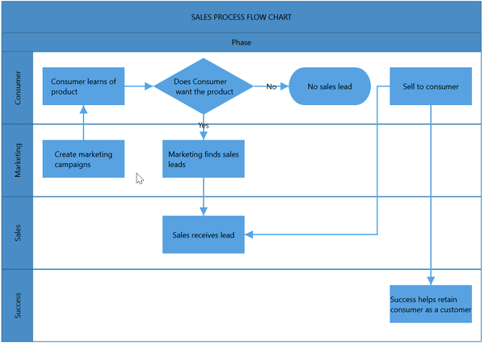

# Lanes in WPF Diagram(SfDiagram)

[Lane](https://help.syncfusion.com/cr/cref_files/wpf/Syncfusion.SfDiagram.WPF~Syncfusion.UI.Xaml.Diagram.LaneViewModel.html) is a functional unit or a responsible department of a business process that helps to map a process within the functional unit or in between other functional units.

The number of lanes can be added to swimlane and rendered in the diagram. The lanes are automatically stacked inside swimlane based on the order they are added.

## Create an empty lane

* We can create the [Lane]((https://help.syncfusion.com/cr/cref_files/wpf/Syncfusion.SfDiagram.WPF~Syncfusion.UI.Xaml.Diagram.LaneViewModel.html)) and add into [Lanes](https://help.syncfusion.com/cr/cref_files/wpf/Syncfusion.SfDiagram.WPF~Syncfusion.UI.Xaml.Diagram.SwimlaneViewModel~Lanes.html) collection of the Swimlane.

>Note: For Horizontal Swimlane, we must set the UnitHeight of the Lane. For Vertical Swimlane, we must set UnitWidth of the Lane.

The following code example illustrates how to define a swimlane with lane.




   <syncfusion:SfDiagram x:Name="diagram" >
                <syncfusion:SfDiagram.Swimlanes>
                     <!--Initialize the SwimlaneCollection--> 
                    <syncfusion:SwimlaneCollection>
                        <!--Initialize the Swimlane-->
                        <syncfusion:SwimlaneViewModel OffsetX="300" OffsetY="150"  
                UnitHeight="120" UnitWidth="450">
                            <!--Create a header for Swimlane-->
                            <syncfusion:SwimlaneViewModel.Header>
                                <syncfusion:SwimlaneHeader UnitHeight="32" >
                                    <syncfusion:SwimlaneHeader.Annotation>
                                        <syncfusion:AnnotationEditorViewModel Content="SALES PROCESS FLOW CHART"> </syncfusion:AnnotationEditorViewModel>
                                    </syncfusion:SwimlaneHeader.Annotation>
                                </syncfusion:SwimlaneHeader>
                            </syncfusion:SwimlaneViewModel.Header>
                            <syncfusion:SwimlaneViewModel.Lanes>
                                <syncfusion:LaneCollection>
                                    <!--Initialize the Lane-->
                                    <syncfusion:LaneViewModel UnitHeight="100">
                                    </syncfusion:LaneViewModel>
                                </syncfusion:LaneCollection>
                            </syncfusion:SwimlaneViewModel.Lanes>
                        </syncfusion:SwimlaneViewModel>
                    </syncfusion:SwimlaneCollection>
                </syncfusion:SfDiagram.Swimlanes>
            </syncfusion:SfDiagram>


  //Initialize the SfDiagram
  SfDiagram diagram = new SfDiagram();
 //Initialize SwimlaneCollection to SfDiagram
  diagram.Swimlanes = new SwimlaneCollection();

 //Creating the SwimlaneViewModel
 SwimlaneViewModel swimlane = new SwimlaneViewModel()
 {
   UnitWidth = 450,
   UnitHeight = 120,
   OffsetX = 300,
   OffsetY = 150,
   Orientation = Orientation.Horizontal,
 };
   //Creating Header for SwimlaneViewModel
   swimlane.Header = new SwimlaneHeader()
   {
     UnitHeight = 32,
     Annotation = new AnnotationEditorViewModel()
     {
      Content = "SALES PROCESS FLOW CHART"
     },
   };

   swimlane.Lanes = new LaneCollection()
   {
   new LaneViewModel()
   {
    UnitHeight=100,
   }
};

//Add Swimlane to Swimlanes property of the Diagram
(diagram.Swimlanes as SwimlaneCollection).Add(swimlane);




## Create Lane Header and Header customization

* The [`Header`](https://help.syncfusion.com/cr/cref_files/wpf/Syncfusion.SfDiagram.WPF~Syncfusion.UI.Xaml.Diagram.LaneViewModel~Header.html) property of lane allows you to textually describe the lane and to customize the appearance of the description.
* The size of lane header can be controlled by using [`UnitWidth`](https://help.syncfusion.com/cr/cref_files/wpf/Syncfusion.SfDiagram.WPF~Syncfusion.UI.Xaml.Diagram.SwimlaneChildViewModel~UnitWidth.html) and [`UnitHeight`](https://help.syncfusion.com/cr/cref_files/wpf/Syncfusion.SfDiagram.WPF~Syncfusion.UI.Xaml.Diagram.SwimlaneChildViewModel~UnitHeight.html) properties of header.
* The appearance of lane header can be set by using the [`ShapeStyle`](https://help.syncfusion.com/cr/cref_files/wpf/Syncfusion.SfDiagram.WPF~Syncfusion.UI.Xaml.Diagram.SwimlaneChildViewModel~ShapeStyle.html) properties.

The following code example illustrates how to define a lane header and its customization.




 <!--Template overriding for view template-->
<DataTemplate x:Key="viewTemplate">
    <TextBlock Text="{Binding Path=Content, Mode=TwoWay}" 
               FontStyle="Italic" FontSize="12" 
               FontFamily="TimesNewRomen" 
               TextDecorations="Underline" 
               FontWeight="Bold" 
               Foreground="AliceBlue"/>
</DataTemplate>

 <syncfusion:SfDiagram x:Name="diagram" >
    <syncfusion:SfDiagram.Swimlanes>
       <!--Initialize the SwimlaneCollection--> 
        <syncfusion:SwimlaneCollection>
        <!--Initialize the Swimlane-->
        <syncfusion:SwimlaneViewModel OffsetX="300" OffsetY="150"  UnitHeight="120" UnitWidth="450">
       <!--Create a header for Swimlane-->
        <syncfusion:SwimlaneViewModel.Header>
           <syncfusion:SwimlaneHeader UnitHeight="32" >
             <syncfusion:SwimlaneHeader.Annotation>
               <syncfusion:AnnotationEditorViewModel Content="SALES PROCESS FLOW CHART"> </syncfusion:AnnotationEditorViewModel>
             </syncfusion:SwimlaneHeader.Annotation>
        </syncfusion:SwimlaneHeader>
        </syncfusion:SwimlaneViewModel.Header>
        <syncfusion:SwimlaneViewModel.Lanes>
         <syncfusion:LaneCollection>
          <!--Initialize the Lane-->
           <syncfusion:LaneViewModel UnitHeight="100">
             <syncfusion:LaneViewModel.Header>
              <!--Create a header for Lane-->
             <syncfusion:SwimlaneHeader UnitWidth="30" ShapeStyle="{StaticResource LaneHeaderStyle}" >
              <syncfusion:SwimlaneHeader.Annotation>
               <syncfusion:AnnotationEditorViewModel Content="Consumer" ViewTemplate="{StaticResource viewTemplate}"></syncfusion:AnnotationEditorViewModel>
               </syncfusion:SwimlaneHeader.Annotation>
               </syncfusion:SwimlaneHeader>
             </syncfusion:LaneViewModel.Header>
           </syncfusion:LaneViewModel>
         </syncfusion:LaneCollection>
      </syncfusion:SwimlaneViewModel.Lanes>
   </syncfusion:SwimlaneViewModel>
 </syncfusion:SwimlaneCollection>
</syncfusion:SfDiagram.Swimlanes>
</syncfusion:SfDiagram>


  //Initialize the SfDiagram
  SfDiagram diagram = new SfDiagram();
 //Initialize SwimlaneCollection to SfDiagram
  diagram.Swimlanes = new SwimlaneCollection();

 //Creating the SwimlaneViewModel
 SwimlaneViewModel swimlane = new SwimlaneViewModel()
 {
   UnitWidth = 450,
   UnitHeight = 120,
   OffsetX = 300,
   OffsetY = 150,
   Orientation = Orientation.Horizontal,
 };
   //Creating Header for SwimlaneViewModel
   swimlane.Header = new SwimlaneHeader()
   {
     UnitHeight = 32,
     Annotation = new AnnotationEditorViewModel()
     {
      Content = "SALES PROCESS FLOW CHART"
     },
   };

   swimlane.Lanes = new LaneCollection()
   {
   new LaneViewModel()
   {
    UnitHeight=100,
    Header=new SwimlaneHeader()
    {
        UnitHeight=30,
        Annotation=new AnnotationEditorViewModel(){Content="Consumer", ViewTemplate = this.Resources["viewTemplate"] as DataTemplate},
        ShapeStyle=this.Resources["LaneHeaderStyle"] as Style,
    }
   }
};

//Add Swimlane to Swimlanes property of the Diagram
(diagram.Swimlanes as SwimlaneCollection).Add(swimlane);




.

## Add and Remove lane at runtime

 You can add and remove the lane at runtime by using the `Add` and `Remove` method of the [`SfDiagram.Lanes`](https://help.syncfusion.com/cr/cref_files/wpf/Syncfusion.SfDiagram.WPF~Syncfusion.UI.Xaml.Diagram.SwimlaneViewModel~Lanes.html) Collection. The following code illustrates how to dynamically add and remove lane to swimlane.



 <Button Name="AddButton" Width="100"  Height="30" IsEnabled="True" Content="Add Lane" ToolTip="Add Lane" Command="{Binding AddCommand}" Cursor="Hand"></Button>
<Button Name="RemoveButton" Width="100"  Height="30" IsEnabled="True" Content="Remove Lane" ToolTip="Remove Lane" Command="{Binding RemoveCommand}" Cursor="Hand">
</Button>
 <syncfusion:SfDiagram x:Name="diagram" Nodes="{Binding Nodes}" 
    Swimlanes="{Binding Swimlanes}" Connectors="{Binding Connectors}" SelectedItems="{Binding SelectedItems}"         SnapSettings="{Binding SnapSettings}"                        HorizontalRuler="{Binding HorizontalRuler}"                  VerticalRuler="{Binding VerticalRuler}"/>




public class DiagramVM : DiagramViewModel
{
 #region Fields
 private ICommand _AddCommand;
 private ICommand _RemoveCommand;
 #endregion
 public DiagramVM()
 {
 SnapSettings = new SnapSettings()
 {
  SnapConstraints = SnapConstraints.None,
  };

  SelectedItems = new SelectorViewModel();
  HorizontalRuler = new Ruler() { Orientation = Orientation.Horizontal };
  VerticalRuler = new Ruler() { Orientation = Orientation.Vertical };
  InitializeDiagram();
  AddCommand = new Command(OnAdd);
  RemoveCommand = new Command(OnRemove);

  }

 private void InitializeDiagram()
 {
  //Initialize SwimlaneCollection to SfDiagram
  this.Swimlanes = new SwimlaneCollection();
  //Creating the SwimlaneViewModel
  SwimlaneViewModel swimlane = new SwimlaneViewModel()
  {
    UnitWidth = 450,
    UnitHeight = 120,
    OffsetX = 300,
    OffsetY = 150,
    Orientation = Orientation.Horizontal,
   };
   //Creating Header for SwimlaneViewModel
  swimlane.Header = new SwimlaneHeader()
  {
   UnitHeight = 32,
   Annotation = new AnnotationEditorViewModel()
   {
     Content = "SALES PROCESS FLOW CHART"
    },
   };

   swimlane.Lanes = new LaneCollection()
   {
    new LaneViewModel()
     {
       UnitHeight=100,
       Header=new SwimlaneHeader()
       {
        UnitHeight=30,
        Annotation=new AnnotationEditorViewModel(){Content="Consumer"}                        
       }
     }
    };

 //Add Swimlane to Swimlanes property of the Diagram
 (this.Swimlanes as SwimlaneCollection).Add(swimlane);
 }

#region Commands

public ICommand AddCommand
{
  get { return _AddCommand; }
  set { _AddCommand = value; }
}

public ICommand RemoveCommand
{
 get { return _RemoveCommand; }
 set { _RemoveCommand = value; }
}

#endregion
#region Helper Methods
//Add Lane into Lanes collection
private void OnAdd(object obj)
{
 var swimlane = (this.Swimlanes as SwimlaneCollection).FirstOrDefault() as SwimlaneViewModel;
 if (swimlane != null)
  {
   (swimlane.Lanes as LaneCollection).Add(new LaneViewModel() { UnitHeight = 100 });
   }
}
//Remove Lane from Lanes collection
 private void OnRemove(object obj)
 {
  var swimlane = (this.Swimlanes as SwimlaneCollection).FirstOrDefault() as SwimlaneViewModel;
  if (swimlane != null && (swimlane.Lanes as LaneCollection).Count>1)
  {
    (swimlane.Lanes as LaneCollection).Remove((swimlane.Lanes as LaneCollection).LastOrDefault());
   }
 }
#endregion
}




[View sample in GitHub](https://github.com/SyncfusionExamples/WPF-Diagram-Examples/tree/master/Samples/Swimlane/Swimlane_Add_Remove_Lane)

## Add children to lane

 To add nodes to lane,you should add [Nodes](https://help.syncfusion.com/cr/cref_files/wpf/Syncfusion.SfDiagram.WPF~Syncfusion.UI.Xaml.Diagram.SfDiagram~Nodes.html) collection of diagram and reference should add [`Children`](https://help.syncfusion.com/cr/cref_files/wpf/Syncfusion.SfDiagram.WPF~Syncfusion.UI.Xaml.Diagram.LaneViewModel~Children.html) collection of the lane.

 The [LaneOffsetX](https://help.syncfusion.com/cr/cref_files/wpf/Syncfusion.SfDiagram.WPF~Syncfusion.UI.Xaml.Diagram.NodeViewModel~LaneOffsetX.html) and [LaneOffsetY](https://help.syncfusion.com/cr/cref_files/wpf/Syncfusion.SfDiagram.WPF~Syncfusion.UI.Xaml.Diagram.NodeViewModel~LaneOffsetY.html) property of the node will position the element in the lane canvas.

The following code example illustrates how to add nodes to lane.



 <!--Style for Node-->

</Setter.Value>
</Setter>
</Style>

 <syncfusion:SfDiagram x:Name="diagram" Nodes="{Binding Nodes}" 
    Swimlanes="{Binding Swimlanes}" Connectors="{Binding Connectors}"         SelectedItems="{Binding SelectedItems}"                              SnapSettings="{Binding SnapSettings}"                              HorizontalRuler="{Binding HorizontalRuler}"                              VerticalRuler="{Binding VerticalRuler}"/>



public class DiagramVM : DiagramViewModel
{
 public DiagramVM()
 {
SnapSettings = new SnapSettings()
{
 SnapConstraints = SnapConstraints.None,
};

SelectedItems = new SelectorViewModel();

HorizontalRuler = new Ruler() { Orientation = Orientation.Horizontal };
VerticalRuler = new Ruler() { Orientation = Orientation.Vertical };
InitializeDiagram();
}

private void InitializeDiagram()
{

 //Initialize SwimlaneCollection to SfDiagram
  this.Swimlanes = new SwimlaneCollection();

 //Creating the SwimlaneViewModel
 SwimlaneViewModel swimlane = new SwimlaneViewModel()
 {
   UnitWidth = 450,
   UnitHeight = 120,
   OffsetX = 300,
   OffsetY = 150,
   Orientation = Orientation.Horizontal,
 };
   //Creating Header for SwimlaneViewModel
   swimlane.Header = new SwimlaneHeader()
   {
     UnitHeight = 32,
     Annotation = new AnnotationEditorViewModel()
     {
      Content = "SALES PROCESS FLOW CHART"
     },
   };
LaneViewModel lane1 = new LaneViewModel()
{
  UnitHeight = 100,
  Header = new SwimlaneHeader()
  {
    UnitHeight = 30,
    Annotation = new AnnotationEditorViewModel() { Content = "Consumer" }
  }
 };
 swimlane.Lanes = new LaneCollection()
 {
   lane1
 };
NodeViewModel node = new NodeViewModel() { UnitHeight = 50, UnitWidth = 50, LaneOffsetX = 100, LaneOffsetY = 30 };
 NodeViewModel node1 = new NodeViewModel() { UnitHeight = 50, UnitWidth = 50, LaneOffsetX = 250, LaneOffsetY = 30 };
(this.Nodes as NodeCollection).Add(node);
(this.Nodes as NodeCollection).Add(node1);
(lane1.Children as LaneChildren).Add(node);
(lane1.Children as LaneChildren).Add(node1);

//Add Swimlane to Swimlanes property of the Diagram
(this.Swimlanes as SwimlaneCollection).Add(swimlane);
}
}



.

[View sample in GitHub](https://github.com/SyncfusionExamples/WPF-Diagram-Examples/tree/master/Samples/Swimlane/Swimlane_Lane_Children)

## Header Selection and Resize

 * We can select the individual lane header by click on Header twice. For first click, the respective lane can select. 

 * We can support to resize the individual lane  header. While resizing lane, it has maintain 20px distances from Lane children.
 * The `NodeChangedEvent` will notify the `UnitHeight` and `UnitWidth` changes with their old and new values. Along with that, this event will give information about  interaction state. To explore about arguments, refer to the [NodeChangedEventArgs](https://help.syncfusion.com/cr/cref_files/wpf/Syncfusion.SfDiagram.WPF~Syncfusion.UI.Xaml.Diagram.NodeChangedEventArgs.html) 

 The following image illustrates how to select and resize the lane header.

.
  
## Lane header editing

Diagram provides the support to edit Lane headers at runtime. We achieve the header editing by double click event. Double clicking the header label will enables the editing of that.
The following image illustrates how to edit the lane header.

