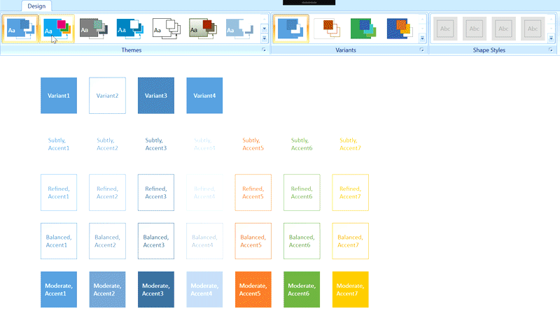

# Themes in WPF Diagram

[WPF Diagram](https://www.syncfusion.com/diagram-sdk/wpf-diagram) themes are predefined sets of diagram item styles that can be applied to diagram elements. In Diagram, nearly 20 built-in themes are available. The `DiagramTheme` class exposes `NodeStyles` and `ConnectorStyles` properties that can be used to build a custom theme.

To know more about `DiagramTheme` properties, refer to the [DiagramTheme](https://help.syncfusion.com/cr/wpf/Syncfusion.UI.Xaml.Diagram.Theming.DiagramTheme.html) API reference.

## Built-In Themes

Built-in themes are predefined themes inherited from `DiagramTheme`. Each built-in theme has variants. Based on the selected theme and variant, the styles of nodes and connectors are applied. By default, the first variant of the specified built-in theme is applied to the diagram elements.

The 19 built-in themes available in the WPF Diagram are listed below. Each entry links to the corresponding `DiagramTheme` subclass in the API reference.

| # | Theme Class | API Reference |
|---|-------------|---------------|
| 1 | `BubbleTheme` | [BubbleTheme](https://help.syncfusion.com/cr/wpf/Syncfusion.UI.Xaml.Diagram.Theming.BubbleTheme.html) |
| 2 | `CloudsTheme` | [CloudsTheme](https://help.syncfusion.com/cr/wpf/Syncfusion.UI.Xaml.Diagram.Theming.CloudsTheme.html) |
| 3 | `DaybreakTheme` | [DaybreakTheme](https://help.syncfusion.com/cr/wpf/Syncfusion.UI.Xaml.Diagram.Theming.DaybreakTheme.html) |
| 4 | `FacetTheme` | [FacetTheme](https://help.syncfusion.com/cr/wpf/Syncfusion.UI.Xaml.Diagram.Theming.FacetTheme.html) |
| 5 | `GemstoneTheme` | [GemstoneTheme](https://help.syncfusion.com/cr/wpf/Syncfusion.UI.Xaml.Diagram.Theming.GemstoneTheme.html) |
| 6 | `IntegralTheme` | [IntegralTheme](https://help.syncfusion.com/cr/wpf/Syncfusion.UI.Xaml.Diagram.Theming.IntegralTheme.html) |
| 7 | `IonTheme` | [IonTheme](https://help.syncfusion.com/cr/wpf/Syncfusion.UI.Xaml.Diagram.Theming.IonTheme.html) |
| 8 | `LinearTheme` | [LinearTheme](https://help.syncfusion.com/cr/wpf/Syncfusion.UI.Xaml.Diagram.Theming.LinearTheme.html) |
| 9 | `OfficeTheme` | [OfficeTheme](https://help.syncfusion.com/cr/wpf/Syncfusion.UI.Xaml.Diagram.Theming.OfficeTheme.html) |
| 10 | `ParallelTheme` | [ParallelTheme](https://help.syncfusion.com/cr/wpf/Syncfusion.UI.Xaml.Diagram.Theming.ParallelTheme.html) |
| 11 | `ProminenceTheme` | [ProminenceTheme](https://help.syncfusion.com/cr/wpf/Syncfusion.UI.Xaml.Diagram.Theming.ProminenceTheme.html) |
| 12 | `RadianceTheme` | [RadianceTheme](https://help.syncfusion.com/cr/wpf/Syncfusion.UI.Xaml.Diagram.Theming.RadianceTheme.html) |
| 13 | `RetrospectTheme` | [RetrospectTheme](https://help.syncfusion.com/cr/wpf/Syncfusion.UI.Xaml.Diagram.Theming.RetrospectTheme.html) |
| 14 | `SequenceTheme` | [SequenceTheme](https://help.syncfusion.com/cr/wpf/Syncfusion.UI.Xaml.Diagram.Theming.SequenceTheme.html) |
| 15 | `SimpleTheme` | [SimpleTheme](https://help.syncfusion.com/cr/wpf/Syncfusion.UI.Xaml.Diagram.Theming.SimpleTheme.html) |
| 16 | `SliceTheme` | [SliceTheme](https://help.syncfusion.com/cr/wpf/Syncfusion.UI.Xaml.Diagram.Theming.SliceTheme.html) |
| 17 | `SmokeTheme` | [SmokeTheme](https://help.syncfusion.com/cr/wpf/Syncfusion.UI.Xaml.Diagram.Theming.SmokeTheme.html) |
| 18 | `WhispTheme` | [WhispTheme](https://help.syncfusion.com/cr/wpf/Syncfusion.UI.Xaml.Diagram.Theming.WhispTheme.html) |
| 19 | `ZephyrTheme` | [ZephyrTheme](https://help.syncfusion.com/cr/wpf/Syncfusion.UI.Xaml.Diagram.Theming.ZephyrTheme.html) |

## Apply a Theme

To change the `DiagramTheme`, use the `SfDiagram.Theme` property.




<!--Resource Dictionary which contains predefined shapes for Node-->
<ResourceDictionary.MergedDictionaries>
    <ResourceDictionary Source="/Syncfusion.SfDiagram.Wpf;component/Resources/BasicShapes.xaml"/>
</ResourceDictionary.MergedDictionaries>

<!--Initialize the Sfdiagram-->
<syncfusion:SfDiagram x:Name="diagram">
    <syncfusion:SfDiagram.Theme>
        <syncfusion:OfficeTheme></syncfusion:OfficeTheme>
    </syncfusion:SfDiagram.Theme>
</syncfusion:SfDiagram>




//Instance of Diagram
SfDiagram diagram = new SfDiagram();
DiagramTheme theme = new OfficeTheme();
diagram.Theme = theme;
			



## Variant Styles and ShapeStyles

Variant styles are sets of styles applied to diagram elements. Each variant contains a fixed collection of shape styles. You can change the style of each node in the diagram by setting the `ThemeStyleId` property. Based on the selected theme and variant, the node receives the matching style.

To change the variant and style, 




<!--Initialize the Sfdiagram-->
<syncfusion:SfDiagram x:Name="diagram">
    <syncfusion:SfDiagram.Theme>
        <syncfusion:OfficeTheme></syncfusion:OfficeTheme>
    </syncfusion:SfDiagram.Theme>
    <syncfusion:SfDiagram.Nodes>
        <!--Initialize the NodeCollection-->
        <syncfusion:NodeCollection>
            <!--Initialize the Node-->
            <syncfusion:NodeViewModel OffsetX="100" OffsetY="100" UnitWidth="75" UnitHeight="75" Shape="{StaticResource Ellipse}" ThemeStyleId="Variant1">
            </syncfusion:NodeViewModel>     
        </syncfusion:NodeCollection>
    </syncfusion:SfDiagram.Nodes>
</syncfusion:SfDiagram>





diagram.Theme = new OfficeTheme();
NodeViewModel node = new NodeViewModel()
{
    OffsetX = 100,
    OffsetY = 100,
    UnitWidth = 75,
    UnitHeight = 75,
    Shape = App.Current.Resources["Rectangle"],
    // Assigns the StyleId.Variant1 theme variant to the node.
    ThemeStyleId = StyleId.Variant1,
};

node.Annotations = new ObservableCollection<IAnnotation>()
{
    new TextAnnotationViewModel()
    {
        Text = node.ThemeStyleId.ToString(),
        TextWrapping = TextWrapping.Wrap,
    }
};

(diagram.Nodes as ObservableCollection<NodeViewModel>).Add(node);
			



[View Sample in GitHub](https://github.com/SyncfusionExamples/WPF-Diagram-Examples/tree/master/Samples/Theme/ThemeStyle).

N> When you apply a theme, it affects all [SfDiagram](https://help.syncfusion.com/cr/wpf/Syncfusion.UI.Xaml.Diagram.SfDiagram.html) elements and overrides any individual `ShapeStyle` settings for those elements. Additionally, the `ShapeStyle` property on individual elements is masked by the active theme.

## See Also

- [How to apply built-in theme for node and connector](https://support.syncfusion.com/kb/article/9995/how-to-apply-built-in-theme-for-node-and-connector-in-wpf-diagram-sfdiagram)

- [How to create a custom theme using the Diagram control in the WPF Diagram](https://support.syncfusion.com/kb/article/18673/how-to-create-a-custom-theme-using-the-sfdiagram-control-in-the-wpf-diagram)
