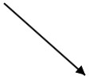
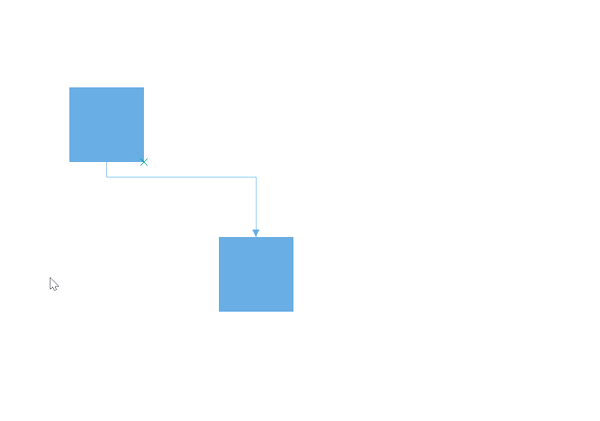
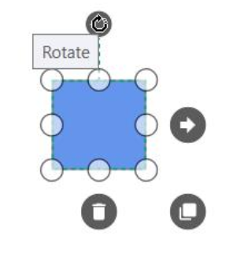
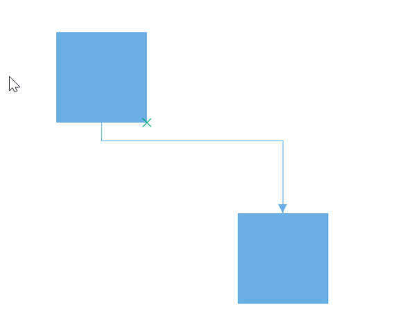

# Drawing tools and tool selection

## Tool Selection

There are some functionalities that can be achieved by clicking and dragging on the Diagram surface. They are as follows.

* Draw selection rectangle – MultipleSelect tool
* Pan the Diagram – Zoom pan
* Draw Nodes/Connectors – ContinuousDraw / DrawOnce

As all the three behaviors are completely different, You can achieve only one behavior at a time based on the tool that you choose. When more than one of those are applied, a tool is activated based on the precedence given in the following table.

| Tools | Description |
|---|---|
| ContinuesDraw | Allows you to draw the Nodes or Connectors continuously. Once it is activated, you cannot perform any other interaction in the Diagram. |
| DrawOnce | Allows you to draw single Node or Connector. Once you complete the DrawOnce action, SingleSelect and MultipleSelect tools are automatically enabled. |
| ZoomPan | Allows you to pan the Diagram. When you enable both the SingleSelect and ZoomPan tools, you can perform the basic interaction as the cursor hovers Node/Connector. Panning is enebled when cursor hovers the Diagram. |
| MultipleSelect | Allows you to select multiple Nodes and Connectors. When you enable both the MultipleSelect and ZoomPan tools, cursor hovers the Diagram. When panning is enabled, you cannot select multiple Nodes. |
| SingleSelect | Allows you to select individual or Connectors. |
| None | Disables all tools. |

You can set the desired tool to the [Tool](https://help.syncfusion.com/cr/wpf/Syncfusion.UI.Xaml.Diagram.SfDiagram.html#Syncfusion_UI_Xaml_Diagram_SfDiagram_Tool) property of the Diagram. The following code illustrates how to enable single/multiple tools.




//To Enable Single Tool
diagram.Tool = Tool.SingleSelect;

//To Enable multiple tools
diagram.Tool = Tool.SingleSelect | Tool.ZoomPan; 
 



N> [View Sample in GitHub](https://github.com/SyncfusionExamples/WPF-Diagram-Examples/tree/master/Samples/DrawingTools)

## Drawing Tools

[DrawingTool](https://help.syncfusion.com/cr/wpf/Syncfusion.UI.Xaml.Diagram.SfDiagram.html#Syncfusion_UI_Xaml_Diagram_SfDiagram_DrawingTool) allow you to draw any kind of node/connector during runtime by clicking and dragging on the Diagram page.

### Shapes

To draw a shape, You have to activate the drawing tool by using the `Tool` property and you need to set the event for GetDrawType.








//GetDrawType event is used to specify which item have to be drawn by the user.

(diagram.Info as IGraphInfo).GetDrawType += MainWindow_GetDrawType;
diagram.DrawingTool = DrawingTool.Node;
diagram.Tool = Tool.ContinuesDraw;

private void MainWindow_GetDrawType(object sender, DrawTypeEventArgs args)
{
	args.DrawItem = new TextBlock()
	{
		Text="Path",
		HorizontalAlignment = HorizontalAlignment.Center,
		VerticalAlignment = VerticalAlignment.Center
	};
}




* `GetDrawType` event will invoke when start drawing and get DrawItem (i.e which item you will draw) from the user.To explore about arguments, please refer to the [DrawTypeEventArgs](https://help.syncfusion.com/cr/wpf/Syncfusion.UI.Xaml.Diagram.DrawTypeEventArgs.html) .

### Text

Diagram allows you to create a text Node as soon as you click on the Diagram page. The following code illustrates how to draw a text.





<Syncfusion:SfDiagram x:Name="diagram" Tool="ContinuesDraw" DrawingTool="TextNode">
    <Syncfusion:SfDiagram.Nodes>
        <Syncfusion:NodeCollection />
    </Syncfusion:SfDiagram.Nodes>
    <Syncfusion:SfDiagram.Connectors>
        <Syncfusion:ConnectorCollection />
    </Syncfusion:SfDiagram.Connectors>
</Syncfusion:SfDiagram>





(diagram.Info as IGraphInfo).GetDrawType += MainWindow_GetDrawType;
diagram.DrawingTool = DrawingTool.TextNode;
diagram.Tool = Tool.ContinuesDraw;




### Connectors

To draw Connectors, you have to set the Connector to `DrawingTool` property. The `DrawingTool` can be activated by using the `Tool` property as shown. The following code example illustrates how to draw a straight line Connector.








diagram.DrawingTool = DrawingTool.Connector;
diagram.Tool = Tool.DrawOnce;




Diagram allows you to establish connection with Node/Port as soon as you click on the Node/Port.

* `ObjectDrawn` event will invoke with drawing state.To explore about arguments,  please refer to the [ObjectDrawnEventArgs](https://help.syncfusion.com/cr/wpf/Syncfusion.UI.Xaml.Diagram.ObjectDrawnEventArgs.html) .

### FreeHand drawing

Free hand connections will be drawn by using `DrawingTool` property.





<Syncfusion:SfDiagram x:Name="diagram" Tool="ContinuesDraw" DrawingTool="FreeHand">
    <Syncfusion:SfDiagram.Nodes>
        <Syncfusion:NodeCollection />
    </Syncfusion:SfDiagram.Nodes>
    <Syncfusion:SfDiagram.Connectors>
        <Syncfusion:ConnectorCollection />
    </Syncfusion:SfDiagram.Connectors>
</Syncfusion:SfDiagram>





// Enable the FreeHand drawing
diagram.DrawingTool = DrawingTool.FreeHand;




[FreeFormEvent](https://help.syncfusion.com/cr/wpf/Syncfusion.UI.Xaml.Diagram.IGraphInfo.html) will notify the current drawing Connector and drawing State in [FreeFormDrawingEventArgs](https://help.syncfusion.com/cr/wpf/Syncfusion.UI.Xaml.Diagram.FreeFormDrawingEventArgs.html). 

### Ellipse 

Diagram allows you to create a ellipse shaped node as soon as you click and drag on the Diagram page. The following code illustrates how to draw an ellipse shaped node.





<Syncfusion:SfDiagram x:Name="diagram" Tool="ContinuesDraw" DrawingTool="Ellipse">
    <Syncfusion:SfDiagram.Nodes>
        <Syncfusion:NodeCollection />
    </Syncfusion:SfDiagram.Nodes>
    <Syncfusion:SfDiagram.Connectors>
        <Syncfusion:ConnectorCollection />
    </Syncfusion:SfDiagram.Connectors>
</Syncfusion:SfDiagram>





diagram.DrawingTool = DrawingTool.Ellipse;
diagram.Tool = Tool.ContinuesDraw;




### Rectangle

Diagram allows you to create a rectangle shaped node as soon as you click and drag on the Diagram page. The following code illustrates how to draw a rectangle shaped node.





<Syncfusion:SfDiagram x:Name="diagram" Tool="ContinuesDraw" DrawingTool="Rectangle">
    <Syncfusion:SfDiagram.Nodes>
        <Syncfusion:NodeCollection />
    </Syncfusion:SfDiagram.Nodes>
    <Syncfusion:SfDiagram.Connectors>
        <Syncfusion:ConnectorCollection />
    </Syncfusion:SfDiagram.Connectors>
</Syncfusion:SfDiagram>





diagram.DrawingTool = DrawingTool.Rectangle;
diagram.Tool = Tool.ContinuesDraw;




## How to override the default tool of diagram elements

Each objects in diagram control have deafult actions while interact on them. Those default actions can be customized by overriding the virtual method [SetTool](https://help.syncfusion.com/cr/wpf/Syncfusion.UI.Xaml.Diagram.SfDiagram.html#Syncfusion_UI_Xaml_Diagram_SfDiagram_SetTool_Syncfusion_UI_Xaml_Diagram_SetToolArgs_) of the `SfDiagram` class. The `SetTool` method takes the [SetToolArgs](https://help.syncfusion.com/cr/wpf/Syncfusion.UI.Xaml.Diagram.SetToolArgs.html) as an argument that is used to know the objects under the mouse when modifying the tools of them.

* [Source](https://help.syncfusion.com/cr/wpf/Syncfusion.UI.Xaml.Diagram.SetToolArgs.html#Syncfusion_UI_Xaml_Diagram_SetToolArgs_Source) –  To know the object on which item the mouse is interacting.

* [Action](https://help.syncfusion.com/cr/wpf/Syncfusion.UI.Xaml.Diagram.SetToolArgs.html#Syncfusion_UI_Xaml_Diagram_SetToolArgs_Action) - To customize the tools of the diagram object.




<!--Create new diagram for custom diagram class-->
<local:CustomClass PortVisibility="Visible" x:Name="diagram"/>





//Create custom class of SfDiagram to override the tools.
public class CustomClass:SfDiagram
{
    //Override method to customize the default tools of diagram objects
    protected override void SetTool(SetToolArgs args)
    {
        if (args.Source is INode)
        {
            args.Action = ActiveTool.Pan;
        }
        else if (args.Source is IConnector)
        {
            args.Action = ActiveTool.Draw;
        }
        else if (args.Source is IPort)
        {
            args.Action = ActiveTool.Drag;
        }
        else
        {
            base.SetTool(args);
        }
    }
}



N> [View Sample in GitHub](https://github.com/SyncfusionExamples/WPF-Diagram-Examples/tree/master/Samples/Tools/SetToolSample)

## How to override the default cursors while interaction

While mouse hovers on the diagramming objects, different cursors will be appearing on each object for different actions. For example, when we mouse hover on the rotator thumb, then rotator cursor will be shown.

These cursors can be customized by overriding the virtual method [SetCursor()](https://help.syncfusion.com/cr/wpf/Syncfusion.UI.Xaml.Diagram.SfDiagram.html#Syncfusion_UI_Xaml_Diagram_SfDiagram_SetCursor_Syncfusion_UI_Xaml_Diagram_SetCursorArgs_) of the `SfDiagram` class. The `SetCursor()` method takes the [SetCursorArgs](https://help.syncfusion.com/cr/wpf/Syncfusion.UI.Xaml.Diagram.SetCursorArgs.html) as an argument that is used to know the objects under the mouse cursor when modifying the cursors of them.

* [Action](https://help.syncfusion.com/cr/wpf/Syncfusion.UI.Xaml.Diagram.SetCursorArgs.html#Syncfusion_UI_Xaml_Diagram_SetCursorArgs_Action) – To know the action tool of the element.

* [ControlPointType](https://help.syncfusion.com/cr/wpf/Syncfusion.UI.Xaml.Diagram.SetCursorArgs.html#Syncfusion_UI_Xaml_Diagram_SetCursorArgs_ControlPointType) – To know the control point of the object.

* [Cursor](https://help.syncfusion.com/cr/wpf/Syncfusion.UI.Xaml.Diagram.SetCursorArgs.html#Syncfusion_UI_Xaml_Diagram_SetCursorArgs_Cursor) – To customize the cursor of the object.

* [Source](https://help.syncfusion.com/cr/wpf/Syncfusion.UI.Xaml.Diagram.SetCursorArgs.html#Syncfusion_UI_Xaml_Diagram_SetCursorArgs_Source) –  To know the object on which item the mouse is interacting.

* [SourceType](https://help.syncfusion.com/cr/wpf/Syncfusion.UI.Xaml.Diagram.SetCursorArgs.html#Syncfusion_UI_Xaml_Diagram_SetCursorArgs_SourceType) – To know the parent element of the object.




<!--Create new diagram for custom diagram class-->
<local:CustomClass PortVisibility="Visible" x:Name="diagram"/>





//Create custom class of SfDiagram to override the cursor.
public class CustomClass:SfDiagram
{
    //Override method to customize the default cursors of diagram objects
    protected override void SetCursor(SetCursorArgs args)
    {
        if (args.Source is INode)
        {
            args.Cursor = Cursors.No;
        }
        else if (args.Source is IConnector)
        {
            args.Cursor = Cursors.Hand;
        }
        else if (args.Source is IPort)
        {
            args.Cursor = Cursors.SizeAll;
        }
        else
        {
           base.SetCursor(args);
        }
    }
}



N> [View Sample in GitHub](https://github.com/SyncfusionExamples/WPF-Diagram-Examples/tree/master/Samples/Tools)



[How to override the default cursors while interaction?](https://www.syncfusion.com/kb/11407/how-to-override-the-default-cursors-while-interaction-in-wpf-diagramsfdiagram)

