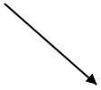
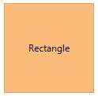
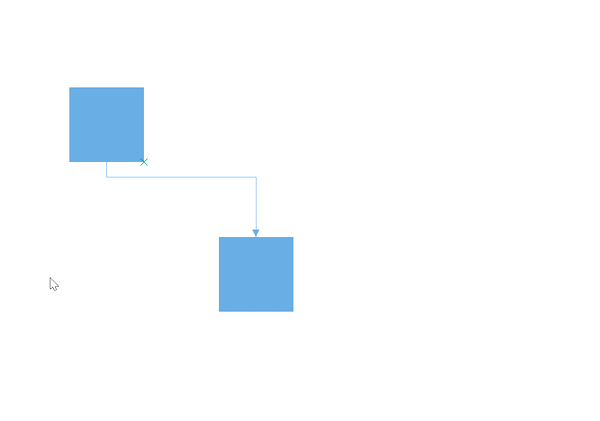
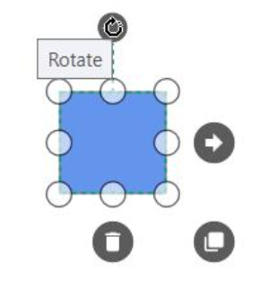
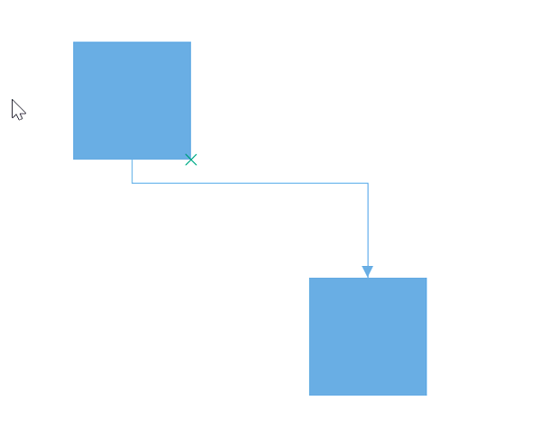

# Tools in WPF SfDiagram

## Tool Selection

You can achieve several functions by clicking and dragging on the [WPF Diagram](https://www.syncfusion.com/diagram-sdk/wpf-diagram) surface. They are as follows.

* Draw selection rectangle – MultipleSelect tool
* Pan the Diagram – ZoomPan tool
* Draw Nodes/Connectors – ContinuousDraw / DrawOnce

Because the three behaviors are mutually exclusive, you can achieve only one at a time based on the tool that you choose. When more than one of those are applied, a tool is activated based on the precedence given in the following table.

| Tools | Description |
|---|---|
| ContinuesDraw | Allows you to draw Nodes or Connectors continuously. Once it is activated, no other interaction is allowed in the Diagram. |
| DrawOnce | Allows you to draw a single Node or Connector. Once you complete the DrawOnce action, SingleSelect and MultipleSelect tools are automatically enabled. |
| ZoomPan | Allows you to pan the Diagram. When you enable both the SingleSelect and ZoomPan tools, you can perform the basic interaction as the cursor hovers a Node/Connector. Panning is enabled when the cursor hovers the Diagram. |
| MultipleSelect | Allows you to select multiple Nodes and Connectors. When you enable both the MultipleSelect and ZoomPan tools, the cursor hovers the Diagram. When panning is enabled, you cannot select multiple Nodes. |
| SingleSelect | Allows you to select individual Nodes or Connectors. |
| None | Disables every tool. |

The [`Tool`](https://help.syncfusion.com/cr/wpf/Syncfusion.UI.Xaml.Diagram.SfDiagram.html#Syncfusion_UI_Xaml_Diagram_SfDiagram_Tool) property is a flag enum. When multiple values are combined, the tool with the highest precedence in the order above (ContinuesDraw → DrawOnce → ZoomPan → MultipleSelect → SingleSelect → None) takes effect. The following code illustrates how to enable single/multiple tools.




// To enable a single tool.
diagram.Tool = Tool.SingleSelect;

// To enable multiple tools.
diagram.Tool = Tool.SingleSelect | Tool.ZoomPan;




N> [View Sample in GitHub](https://github.com/SyncfusionExamples/WPF-Diagram-Examples/tree/master/Samples/DrawingTools)

## Drawing Tools

The [`DrawingTool`](https://help.syncfusion.com/cr/wpf/Syncfusion.UI.Xaml.Diagram.SfDiagram.html#Syncfusion_UI_Xaml_Diagram_SfDiagram_DrawingTool) property lets you draw any kind of node/connector during runtime by clicking and dragging on the Diagram page. Supported values are:

| DrawingTool value | Description |
|---|---|
| `None` | Disables all behaviors of the control. |
| `Connector` | Enables drawing a connector. |
| `Node` | Enables drawing a node. |
| `FreeHand` | Enables drawing a node or connector. |
| `Rectangle` | Enables drawing a rectangle-shaped node. |
| `Ellipse` | Enables drawing an ellipse-shaped node. |
| `TextNode` | Enables drawing a text-box node. |

### Shapes

To draw a shape, activate the drawing tool by using the `Tool` property and handle the `GetDrawType` event.








// The GetDrawType event specifies which item to draw when the user starts drawing.

(diagram.Info as IGraphInfo).GetDrawType += MainWindow_GetDrawType;
diagram.DrawingTool = DrawingTool.Node;
diagram.Tool = Tool.ContinuesDraw;

private void MainWindow_GetDrawType(object sender, DrawTypeEventArgs args)
{
    args.DrawItem = new NodeViewModel()
    {
        UnitWidth = 100,
        UnitHeight = 100,
        Shape = new EllipseGeometry() { RadiusX = 50, RadiusY = 50 },
        ShapeStyle = this.Resources["shapestyle"] as Style,
    };
}




* The `GetDrawType` event fires when drawing starts and asks for the `DrawItem` from the user. To explore about arguments, please refer to the [DrawTypeEventArgs](https://help.syncfusion.com/cr/wpf/Syncfusion.UI.Xaml.Diagram.DrawTypeEventArgs.html).

### Text

Diagram allows you to create a text Node as soon as you click on the Diagram page. The following code illustrates how to draw text. `Tool.ContinuesDraw` lets you place multiple text nodes in a row; switch to `Tool.DrawOnce` if you only want a single one.





<Syncfusion:SfDiagram x:Name="diagram" Tool="ContinuesDraw" DrawingTool="TextNode">
    <Syncfusion:SfDiagram.Nodes>
        <Syncfusion:NodeCollection />
    </Syncfusion:SfDiagram.Nodes>
    <Syncfusion:SfDiagram.Connectors>
        <Syncfusion:ConnectorCollection />
    </Syncfusion:SfDiagram.Connectors>
</Syncfusion:SfDiagram>





diagram.DrawingTool = DrawingTool.TextNode;
diagram.Tool = Tool.ContinuesDraw;




### Connectors

To draw Connectors, set `DrawingTool` to `DrawingTool.Connector`. The `DrawingTool` is activated by using the `Tool` property as shown. The following code example illustrates how to draw a straight line Connector.








diagram.DrawingTool = DrawingTool.Connector;
diagram.Tool = Tool.DrawOnce;

// Subscribe to ObjectDrawn to react after the connector is created.
(diagram.Info as IGraphInfo).ObjectDrawn += MainWindow_ObjectDrawn;

private void MainWindow_ObjectDrawn(object sender, ObjectDrawnEventArgs args)
{
    // Inspect args.State and args.DrawObject here.
}




Diagram allows you to establish a connection with a Node/Port as soon as you click on the Node/Port.

* The `ObjectDrawn` event fires when drawing finishes. To explore about arguments, please refer to the [ObjectDrawnEventArgs](https://help.syncfusion.com/cr/wpf/Syncfusion.UI.Xaml.Diagram.ObjectDrawnEventArgs.html).

### Freehand Drawing

Set `DrawingTool` to `DrawingTool.FreeHand` to draw freehand connectors.





<Syncfusion:SfDiagram x:Name="diagram" Tool="ContinuesDraw" DrawingTool="FreeHand">
    <Syncfusion:SfDiagram.Nodes>
        <Syncfusion:NodeCollection />
    </Syncfusion:SfDiagram.Nodes>
    <Syncfusion:SfDiagram.Connectors>
        <Syncfusion:ConnectorCollection />
    </Syncfusion:SfDiagram.Connectors>
</Syncfusion:SfDiagram>





// Enable FreeHand drawing.
diagram.DrawingTool = DrawingTool.FreeHand;
diagram.Tool = Tool.ContinuesDraw;




The `FreeFormDrawing` event on `IGraphInfo` notifies the current drawing Connector and drawing state via [FreeFormDrawingEventArgs](https://help.syncfusion.com/cr/wpf/Syncfusion.UI.Xaml.Diagram.FreeFormDrawingEventArgs.html).

### Ellipse

Diagram allows you to create an ellipse-shaped node as soon as you click and drag on the Diagram page. The following code illustrates how to draw an ellipse-shaped node.





<Syncfusion:SfDiagram x:Name="diagram" Tool="ContinuesDraw" DrawingTool="Ellipse">
    <Syncfusion:SfDiagram.Nodes>
        <Syncfusion:NodeCollection />
    </Syncfusion:SfDiagram.Nodes>
    <Syncfusion:SfDiagram.Connectors>
        <Syncfusion:ConnectorCollection />
    </Syncfusion:SfDiagram.Connectors>
</Syncfusion:SfDiagram>





diagram.DrawingTool = DrawingTool.Ellipse;
diagram.Tool = Tool.ContinuesDraw;




### Rectangle

Diagram allows you to create a rectangle-shaped node as soon as you click and drag on the Diagram page. The following code illustrates how to draw a rectangle-shaped node.





<Syncfusion:SfDiagram x:Name="diagram" Tool="ContinuesDraw" DrawingTool="Rectangle">
    <Syncfusion:SfDiagram.Nodes>
        <Syncfusion:NodeCollection />
    </Syncfusion:SfDiagram.Nodes>
    <Syncfusion:SfDiagram.Connectors>
        <Syncfusion:ConnectorCollection />
    </Syncfusion:SfDiagram.Connectors>
</Syncfusion:SfDiagram>





diagram.DrawingTool = DrawingTool.Rectangle;
diagram.Tool = Tool.ContinuesDraw;




## Override the Default Tool of Diagram Elements

Each object in the diagram control has default actions when the user interacts with it. Those default actions can be customized by overriding the virtual method [SetTool](https://help.syncfusion.com/cr/wpf/Syncfusion.UI.Xaml.Diagram.SfDiagram.html#Syncfusion_UI_Xaml_Diagram_SfDiagram_SetTool_Syncfusion_UI_Xaml_Diagram_SetToolArgs_) of the `SfDiagram` class. The `SetTool` method takes the [SetToolArgs](https://help.syncfusion.com/cr/wpf/Syncfusion.UI.Xaml.Diagram.SetToolArgs.html) as an argument that is used to know the objects under the mouse when modifying the tools of them.

* [Source](https://help.syncfusion.com/cr/wpf/Syncfusion.UI.Xaml.Diagram.SetToolArgs.html#Syncfusion_UI_Xaml_Diagram_SetToolArgs_Source) –  To know the object on which the mouse is interacting.

* [Action](https://help.syncfusion.com/cr/wpf/Syncfusion.UI.Xaml.Diagram.SetToolArgs.html#Syncfusion_UI_Xaml_Diagram_SetToolArgs_Action) - To customize the tools of the diagram object.




<!-- Define a custom diagram with the overridden SetTool method. -->
<local:CustomClass PortVisibility="Visible" x:Name="diagram"/>





// Create a custom SfDiagram class to override the default tools.
public class CustomClass : SfDiagram
{
    // Override the method to customize the default tools of diagram objects.
    protected override void SetTool(SetToolArgs args)
    {
        if (args.Source is INode)
        {
            args.Action = ActiveTool.Pan;
        }
        else if (args.Source is IConnector)
        {
            args.Action = ActiveTool.Draw;
        }
        else if (args.Source is IPort)
        {
            args.Action = ActiveTool.Drag;
        }
        else
        {
            base.SetTool(args);
        }
    }
}



[View Sample in GitHub](https://github.com/SyncfusionExamples/WPF-Diagram-Examples/tree/master/Samples/Tools/SetToolSample)

## Override the Default Cursors During Interaction

When the mouse hovers on diagramming objects, different cursors appear over each object for different actions. For example, when the mouse hovers over the rotator thumb, the rotator cursor is shown.

These cursors can be customized by overriding the virtual method [SetCursor()](https://help.syncfusion.com/cr/wpf/Syncfusion.UI.Xaml.Diagram.SfDiagram.html#Syncfusion_UI_Xaml_Diagram_SfDiagram_SetCursor_Syncfusion_UI_Xaml_Diagram_SetCursorArgs_) of the `SfDiagram` class. The `SetCursor()` method takes the [SetCursorArgs](https://help.syncfusion.com/cr/wpf/Syncfusion.UI.Xaml.Diagram.SetCursorArgs.html) as an argument that is used to know the objects under the mouse cursor when modifying the cursors of them.

* [Action](https://help.syncfusion.com/cr/wpf/Syncfusion.UI.Xaml.Diagram.SetCursorArgs.html#Syncfusion_UI_Xaml_Diagram_SetCursorArgs_Action) – To know the action tool of the element.

* [ControlPointType](https://help.syncfusion.com/cr/wpf/Syncfusion.UI.Xaml.Diagram.SetCursorArgs.html#Syncfusion_UI_Xaml_Diagram_SetCursorArgs_ControlPointType) – To know the control point of the object.

* [Cursor](https://help.syncfusion.com/cr/wpf/Syncfusion.UI.Xaml.Diagram.SetCursorArgs.html#Syncfusion_UI_Xaml_Diagram_SetCursorArgs_Cursor) – To customize the cursor of the object.

* [Source](https://help.syncfusion.com/cr/wpf/Syncfusion.UI.Xaml.Diagram.SetCursorArgs.html#Syncfusion_UI_Xaml_Diagram_SetCursorArgs_Source) –  To know the object on which the mouse is interacting.

* [SourceType](https://help.syncfusion.com/cr/wpf/Syncfusion.UI.Xaml.Diagram.SetCursorArgs.html#Syncfusion_UI_Xaml_Diagram_SetCursorArgs_SourceType) – To know the parent element of the object.




<!-- Define a custom diagram with the overridden SetCursor method. -->
<local:CustomClass PortVisibility="Visible" x:Name="diagram"/>





// Create a custom SfDiagram class to override the default cursors.
public class CustomClass : SfDiagram
{
    // Override the method to customize the default cursors of diagram objects.
    protected override void SetCursor(SetCursorArgs args)
    {
        if (args.Source is INode)
        {
            // Cursors.No displays the "no-drop" indicator.
            args.Cursor = Cursors.No;
        }
        else if (args.Source is IConnector)
        {
            // Cursors.Hand shows the link/select cursor.
            args.Cursor = Cursors.Hand;
        }
        else if (args.Source is IPort)
        {
            // Cursors.SizeAll shows the four-way move cursor.
            args.Cursor = Cursors.SizeAll;
        }
        else
        {
            base.SetCursor(args);
        }
    }
}



N> `Cursors` is the `System.Windows.Input.Cursors` static class. Other commonly used values are `Cursors.NoMove` (no-move indicator) and `Cursors.None` (invisible cursor). For a custom cursor, pass a `new Cursor(stream)` loaded from a `.cur` file.

[View Sample in GitHub](https://github.com/SyncfusionExamples/WPF-Diagram-Examples/tree/master/Samples/Tools)

## See Also

- [How to override the default cursors during interaction in WPF Diagram](https://support.syncfusion.com/kb/article/11407/how-to-override-the-default-cursors-while-interaction-in-wpf-diagramsfdiagram)
- [How to switch between tools at runtime through the SetTool in WPF Diagram](https://support.syncfusion.com/kb/article/9943/how-to-switch-between-tools-at-runtime-through-the-settool-in-wpf-diagram-sfdiagram)
- [How to create a port at runtime through the SetTool in WPF Diagram](https://support.syncfusion.com/kb/article/9967/how-to-create-port-at-runtime-through-set-tool-in-wpf-diagram-sfdiagram)
- [How to draw nodes in WPF Diagram](https://support.syncfusion.com/kb/article/5989/how-to-draw-node-in-wpf-diagram-sfdiagram)
- [How to obtain the polyline connector completed status in WPF Diagram](https://support.syncfusion.com/kb/article/18899/how-to-obtain-the-completed-status-of-a-polyline-connector-in-the-wpf-diagram-sfdiagram)