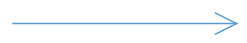
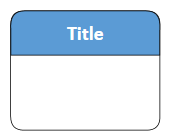
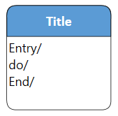
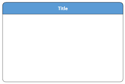

# UML Diagrams

UML (Unified Modeling Language) Diagrams serve as a standardized means to represent diverse facets of a system, facilitating communication and comprehension for software developers, analysts, and stakeholders. UML Behavioral Diagrams, specifically, play a crucial role in visualizing, specifying, constructing, and documenting the dynamic aspects of a system. They aid in visualizing and determining the model, execution flow, state, or behavior of the system at a specific time.

## UML Diagram Shapes

Creating UML Diagrams involves the selection and combination of various UML shapes to provide a visual representation of a system's architecture. Each shape carries a distinct meaning and usage, collectively contributing to the overall clarity and comprehensibility of the diagram.

The list of UML Diagram Shapes are available in the diagram resource dictionary, as follows:

| Resource Name | Shape Name | Output Shape |
|---|---|---|
| UMLActivity | Action |  |
|  | Initial |  |
|  | Final|  |
|  | FlowFinal |  |
|  | ForkNode |  |
|  | JoinNode |  |
|  | MergeNode |  |
|  | ObjectNode |  |
|  | SendSignal |  |
|  | AcceptEvent |  |
|  | WaitTime |  |
|  | Note |  |
|  | ActivityEdge |  |
| UMLUseCase | User |  |
|  | UseCase |  |
|  | SubSystem |  |
|  | AssociationLink |  |
|  | DependencyLink |  |
|  | GeneralizationLink|  |
|  | IncludeLink |  |
|  | ExtendLink |  |
| UMLStateDiagram | SimpleState |  |
|  | StateWithInternalBehaviour|  |
|  | CompositeState |  |
|  | Initial |  |
|  | Final |  |
|  | Choice|  |
|  | Note |  |
| UMLRelationship | StrongEntity |  |
|  | Attribute |  |
|  | MultivaluedAttribute |  |
|  | StrongRelationship |  |
