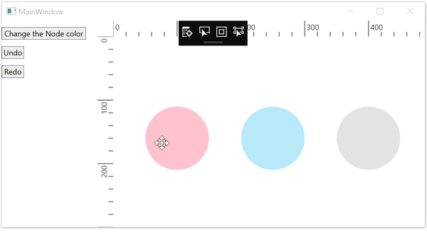
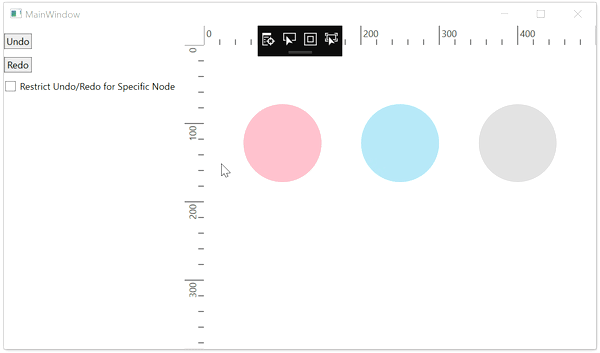

# Undo and Redo in WPF Diagram (SfDiagram)

Diagram provides built-in support to track the changes that are made through interaction and through public APIs. The changes can be reverted or restored either through shortcut keys or through commands.

## Undo and Redo actions

Diagram tracks the history of actions that are performed after initializing the diagram and provides support to reverse and restore those changes.

The redo function restores any actions that have been previously undone using an undo
Undo is a function performed to reverse the action of an earlier action.

Undo/redo actions can be executed through shortcut keys. Shortcut key for undo is Ctrl+z and shortcut key for redo is Ctrl+y. 

Undo/Redo for diagram can be enabled/disabled with the [Constraints](https://help.syncfusion.com/cr/wpf/Syncfusion.UI.Xaml.Diagram.SfDiagram.html#Syncfusion_UI_Xaml_Diagram_SfDiagram_Constraints) property of SfDiagram class.




<!--Initialize SfDiagram with undo constraint-->
<syncfusion:SfDiagram x:Name="diagram" Constraints="Default,Undoable">
</syncfusion:SfDiagram>



//Initialize SfDiagram
SfDiagram diagram = new SfDiagram();
//Enable the undo and reso actions
diagram.Constraints = GraphConstraints.Default | GraphConstraints.Undoable;




Undo/redo actions can be executed using commands of diagram control instead of using short cut keys.



<!--Initialize SfDiagram with undo constraint-->
<syncfusion:SfDiagram x:Name="diagram" Constraints="Default,Undoable">
</syncfusion:SfDiagram>


//Initialize SfDiagram
SfDiagram diagram = new SfDiagram();
//Enable the undo and reso actions
diagram.Constraints = GraphConstraints.Default | GraphConstraints.Undoable;

//To perform the Undo action in Diagram
(diagram.Info as IGraphInfo).Commands.Undo.Execute(null);

//To Perform the Redo action in Diagram
(diagram.Info as IGraphInfo).Commands.Redo.Execute(null);



## How to Customize the Undo Redo process

History list allows to revert or restore single and multiple changes through a single undo/redo command. The purpose of custom undo redo process is to store actions which are not done through default undo redo history list. Appearance level changes and its history informations did not stored in the history list.  For example, revert/restore the fill color change of multiple elements at a time. To store multiple actions at a time, actions should be logged using [CompositeTransactions](https://help.syncfusion.com/cr/wpf/Syncfusion.UI.Xaml.Diagram.CompositeTransactions.html) class.

To achieve this you need to customize the [HistoryManager](https://help.syncfusion.com/cr/wpf/Syncfusion.UI.Xaml.Diagram.HistoryManager.html) class of diagram control and need to override the Undo Redo methods.



//Initialize SfDiagram
SfDiagram diagram = new SfDiagram();
//Assigning the custom history manager class
diagram.HistoryManager = new customManager();

//To change the nodes fill color into blue and logging the action into composite transactions class.
CompositeTransactions start = new CompositeTransactions();
start.State = TransactionState.Start;
diagram.HistoryManager.BeginComposite(diagram.HistoryManager, start);
foreach (NodeVm node in ((IEnumerable<object>)(diagram.SelectedItems as SelectorViewModel).Nodes))
{
    if (node is NodeVm)
    {
        (node as NodeVm).Fill = new SolidColorBrush(Colors.CornflowerBlue);
    }
}

CompositeTransactions end = new CompositeTransactions();
end.State = TransactionState.End;
diagram.HistoryManager.EndComposite(diagram.HistoryManager, end);

//Create Custom history manager class 
public class customManager : HistoryManager
{
    public customManager()
    {
    }

    public override object Undo(object data)
    {
        return data;
    }

    public override object Redo(object data)
    {
        return data;
    }

    public override bool CanLogData(IUndoRedo source, object data)
    {
        return base.CanLogData(source, data);
    }
}

//Creating custom node view model to update the fill property to nodes
public class NodeVm : NodeViewModel, IUndoRedo
{
    public NodeState _mCollectionData;

    public NodeVm()
    {
        _mCollectionData = new NodeState( Fill);
    }

    private Brush _mFill = new SolidColorBrush(Colors.Black);

    //Creating fill property to node to get or set the fill color for node
    public Brush Fill
    {
        get
        {
            return _mFill;
        }
        set
        {
            if (_mFill != value)
            {
                _mFill = value;
                OnPropertyChanged(NodeConstants.Fill);
            }
        }
    }

    //Allows to store the fill color data 
    private bool AllowToLogData(string name)
    {
        if (name == "Fill")
        {
            return true;
        }

        return false;
    }

    //To store the actions performed
    public void LogData(object data)
    {
        var info = this.Info as INodeInfo;
        if (info != null && info.Graph != null )
        {
            info.Graph.HistoryManager.LogData(this, data);   
        }
    }

    //To apply the fill color to the node when undo/redo
    private void OnFillChanged()
    {
        Style s = new Style(typeof(Path));
        if (Fill != null)
        {
            s.Setters.Add(new Setter(Path.FillProperty, Fill));
            s.Setters.Add(new Setter(Path.StretchProperty, Stretch.Fill));
        }
        ShapeStyle = s;
    }

    //To update the fill property when it is changed
    protected override void OnPropertyChanged(string name)
    {
        var info = this.Info as INodeInfo;
        if (info != null && info.Graph != null && info.Graph.HistoryManager != null && AllowToLogData(name))
        {

            if (info.Graph.HistoryManager.CanLogData(info.Graph.HistoryManager, _mCollectionData))
            {
                LogData(_mCollectionData);
            }
        }
        base.OnPropertyChanged(name);
        switch (name)
        {
            case NodeConstants.Fill:
                OnFillChanged();
                _mCollectionData.Fill = this.Fill;
                break;
        }
    }

    public UndoRedoState State { get; set; }

    public bool CanRedo(object data)
    {
        if (State == UndoRedoState.Idle)
        {
            return true;
        }
        return false;
    }

    public bool CanUndo(object data)
    {
        if (State == UndoRedoState.Idle)
        {
            return true;
        }
        return false;
    }

    public object Undo(object data)
    {
        if (data is NodeState)
        {
            return RevertTo(data);
        }
        else
            return data;
    }

    public object Redo(object data)
    {
        if (data is NodeState)
        {
            return RevertTo(data);
        }
        else
            return data;
    }

    public object RevertTo(object data)
    {
        if (data is NodeState)
        {
            var current = GetData();
            NodeState toState = (NodeState)data;
            if (toState.Fill != this.Fill)
            {
                this.Fill = toState.Fill;
            }
            return current;
        }
        return data;
    }

    public object GetData()
    {
        return _mCollectionData;
    }
}

//Create class for node constants value
internal static class NodeConstants
{
    public const string Fill = "Fill";
}

//To specify the fill state for nodes.
public struct NodeState
{
    private Brush _mFill;
    public Brush Fill
    {
        get
        {
            return _mFill;
        }
        set
        {
            if (_mFill != value)
            {
                _mFill = value;
            }
        }
    }
    public NodeState(Brush fill)
    {
        _mFill = fill;
    }
}



## How to restrict Undo/Redo

Undo, Redo process can be avoided for particular element by using [CanLogHistoryEntry](https://help.syncfusion.com/cr/wpf/Syncfusion.UI.Xaml.Diagram.SfDiagram.html#Syncfusion_UI_Xaml_Diagram_SfDiagram_CanLogHistoryEntry_Syncfusion_UI_Xaml_Diagram_LogDataArgs_) virtual method of diagram control.



//Initialize the custom diagram class
CustomDiagram diagram = new CustomDiagram();

//Create custom node class to add can log property
public class NodeVm : NodeViewModel, IUndoRedo
{
    private bool canlog = true;

    //Specifies undo/redo process is enabled or disabled for a node
    public bool CanLogmultipleselect
    {
        get
        {
            return canlog;           
        }
        set
        {
            if (value != canlog)
            {
                canlog = value;
                OnPropertyChanged("CanLogmultipleselect");
            }
        }
    }
}
//Create the custom SfDaigram class
public class CustomDiagram: SfDiagram
{
    //Overridding the method to avoid actions stored
    protected override bool CanLogHistoryEntry(LogDataArgs item)
    {
        if (item.Item is NodeVm)
        {
            if (!(item.Item as NodeVm).CanLogmultipleselect)
            {
                return false;
            }
            return base.CanLogHistoryEntry(item);
        }
        else
            return base.CanLogHistoryEntry(item);
    }
}



## Events for Undo Redo Process

Diagram allows to notify undo/redo action for the below events,

* [NodeChangedEvent](https://help.syncfusion.com/cr/wpf/Syncfusion.UI.Xaml.Diagram.IGraphInfo.html)
* [ItemDeletedEvent](https://help.syncfusion.com/cr/wpf/Syncfusion.UI.Xaml.Diagram.IGraphInfo.html)
* [ItemAddedEvent](https://help.syncfusion.com/cr/wpf/Syncfusion.UI.Xaml.Diagram.IGraphInfo.html)
* [PortChangedEvent](https://help.syncfusion.com/cr/wpf/Syncfusion.UI.Xaml.Diagram.IGraphInfo.html)
* [AnnotationChangedEvent](https://help.syncfusion.com/cr/wpf/Syncfusion.UI.Xaml.Diagram.IGraphInfo.html)
* [ConnectorSourceChangedEvent](https://help.syncfusion.com/cr/wpf/Syncfusion.UI.Xaml.Diagram.IGraphInfo.html)
* [ConnectorTargetChangedEvent](https://help.syncfusion.com/cr/wpf/Syncfusion.UI.Xaml.Diagram.IGraphInfo.html)



//Initialize the SfDiagram
SfDiagram diagram = new SfDiagram();
//Register the node changed event
(diagram.Info as IGraphInfo).NodeChangedEvent += Diagram_NodeChangedEvent;

private void Diagram_NodeChangedEvent(object sender, ChangeEventArgs<object, NodeChangedEventArgs> args)
{
    MessageBox.Show(args.Cause.ToString());
}



[View Sample in GitHub](https://github.com/SyncfusionExamples/WPF-Diagram-Examples/tree/master/Samples/HistoryManager)

## See Also

* [How to add enable undo and redo using commands?](/wpf/sfdiagram/commands/undoredo)
