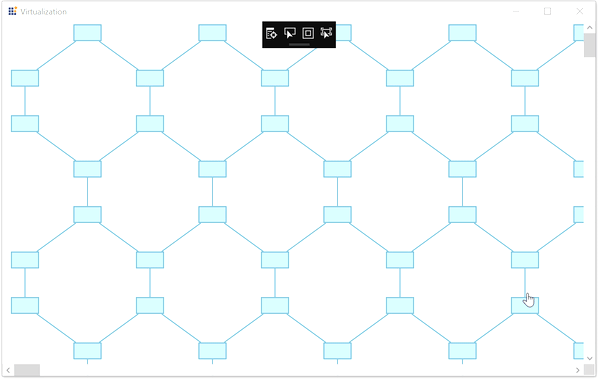
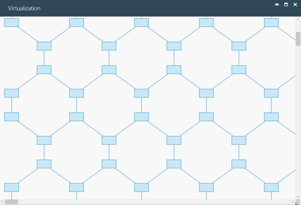
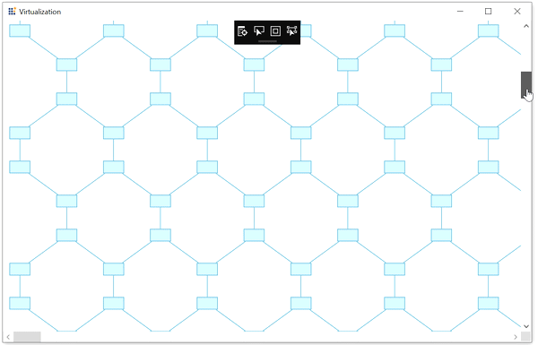

# Virtualization in WPF SfDiagram

Virtualization is the process of loading the diagramming objects available in the visible area of the [WPF SfDiagram](https://www.syncfusion.com/diagram-sdk/wpf-diagram) control, that is, only the diagramming objects that lie within the ViewPort of the ScrollViewer are loaded and the remaining objects are loaded only when they come into view. 

This feature gives optimized performance and low memory consumption while loading and dragging items to the `SfDiagram` that contains a large number of diagram objects.

N> By default, virtualization is disabled. To enable virtualization and improve performance when working with large diagrams, add the `GraphConstraints.Virtualize` constraint to the diagram.



<!--Initialize the SfDiagram and enable the virtualize constraint-->
<syncfusion:SfDiagram x:Name="diagram" Constraints="Default,Virtualize"/>



//Initialize the SfDiagram
SfDiagram diagram = new SfDiagram();
//Enable the Virtualize constraint
diagram.Constraints = diagram.Constraints | GraphConstraints.Virtualize;




## Deferred Scrolling

To improve scrolling performance, the outline of a diagram element will be displayed until the UI element is loaded, regardless of the weight of the element. 

N> Deferred scrolling (`Outline`) depends on virtualization and works only when the `GraphConstraints.Virtualize` constraint is enabled. Therefore, enable both `Virtualize` and `Outline` constraints to use deferred scrolling in the diagram.



<!--Initialize the SfDiagram and enable the virtualize and outline constraint-->
<syncfusion:SfDiagram x:Name="diagram" Constraints="Default,Virtualize,Outline"/>



//Initialize the SfDiagram
SfDiagram diagram = new SfDiagram();
//Enable the Virtualize and outline constraints
diagram.Constraints |= GraphConstraints.Virtualize | GraphConstraints.Outline;




N> In `SfDiagram`, Deferred Scrolling is referred to as `Outline`. This feature is only applicable when virtualization is enabled.

## Outline customization

Options are provided to customize the appearance, style, and render interval of the outline by using the [OutlineSettings](https://help.syncfusion.com/cr/wpf/Syncfusion.UI.Xaml.Diagram.OutlineSettings.html) class of diagram.

* [OutlineStyle](https://help.syncfusion.com/cr/wpf/Syncfusion.UI.Xaml.Diagram.OutlineSettings.html#Syncfusion_UI_Xaml_Diagram_OutlineSettings_OutlineStyle): Specifies the style for the outline of the diagram elements.
* [RenderInterval](https://help.syncfusion.com/cr/wpf/Syncfusion.UI.Xaml.Diagram.OutlineSettings.html#Syncfusion_UI_Xaml_Diagram_OutlineSettings_RenderInterval): Specifies the time interval to render the diagram elements into view. The default time interval is 200 ms.




<!--Custom style for outline of overview-->

<!--Initialize outline setting with outline style and outline interval-->
<syncfusion:SfDiagram x:Name="diagram" Constraints="Default,Virtualize,Outline" >
    <syncfusion:SfDiagram.OutlineSettings>
        <syncfusion:OutlineSettings OutlineStyle="{StaticResource outlineStyle}">
            <syncfusion:OutlineSettings.RenderInterval>
                <sys:TimeSpan>0:0:0:20</sys:TimeSpan>
            </syncfusion:OutlineSettings.RenderInterval>
        </syncfusion:OutlineSettings>
    </syncfusion:SfDiagram.OutlineSettings>
</syncfusion:SfDiagram>
	
	


//Initialize the SfDiagram
SfDiagram diagram = new SfDiagram();

//Enable the outline and virtualize constraints
diagram.Constraints |= GraphConstraints.Virtualize | GraphConstraints.Outline;

//Style for custom outline of overview
Style style = new Style(typeof(Path));
style.Setters.Add(new Setter(Shape.StrokeProperty, new SolidColorBrush(Colors.Red)));
style.Setters.Add(new Setter(Shape.StrokeThicknessProperty,2d));

//Initialize the outline setting
diagram.OutlineSettings = new OutlineSettings()
{
    //Specifies the outline style
    OutlineStyle = style,
    //Specifies the outline rendering interval
    RenderInterval = new TimeSpan(0,0,0,20),
};



Find the [Virtualization Sample](https://github.com/SyncfusionExamples/WPF-Diagram-Examples/tree/master/Samples/Virtualization) to demonstrate virtualization.

## See Also

[How to serialize the diagram control?](/wpf/diagram/serialization)

[How to localize the diagram control?](/wpf/diagram/localization)

[How to have overview for diagram control?](/wpf/diagram/overview-control)

[How to enable the virtualization?](https://support.syncfusion.com/kb/article/6081/how-to-enable-the-virtualization-in-wpf-diagram-sfdiagram)