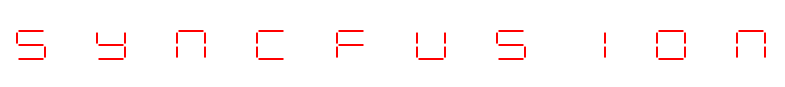
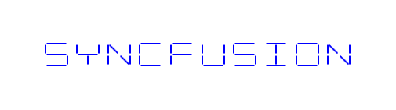
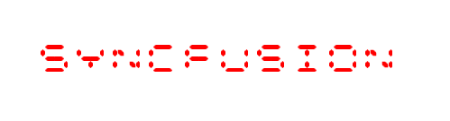
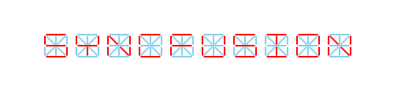
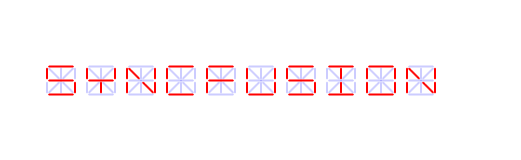

# Settings in WPF Digital Gauge

There are some other elements and behaviors in WPF Digital Gauge that can also be customized. 

They are:

* Character Spacing
* Segment Thickness
* RTL (Right to Left) support
* Character Stroke
* Dimmed Brush stroke
* Dimmed Brush opacity

## Character Spacing

The distance between the characters can be set using the [`CharactersSpacing`](https://help.syncfusion.com/cr/wpf/Syncfusion.UI.Xaml.Gauges.SfDigitalGauge.html#Syncfusion_UI_Xaml_Gauges_SfDigitalGauge_CharactersSpacing) property.




    <syncfusion:SfDigitalGauge  Value="SYNCFUSION" CharactersSpacing="50"/>





    SfDigitalGauge digitalgauge = new SfDigitalGauge();
    digitalgauge.Value = "SYNCFUSION";
    digitalgauge.CharacterSpacing = 50;
    this.Grid.Children.Add(digitalgauge);      




## Character Stroke

The stroke of the character can be changed using the [`CharacterStroke`](https://help.syncfusion.com/cr/wpf/Syncfusion.UI.Xaml.Gauges.SfDigitalGauge.html#Syncfusion_UI_Xaml_Gauges_SfDigitalGauge_CharacterStroke) property.




    <syncfusion:SfDigitalGauge  Value="SYNCFUSION"   CharacterType="SegmentFourteen" 
                                CharacterStroke="Blue" />





    SfDigitalGauge digitalgauge = new SfDigitalGauge();
    digitalgauge.Value = "SYNCFUSION";
    digitalgauge.CharacterStroke = new SolidColorBrush(Colors.Blue);
    digitalgauge.CharacterType = CharacterType.SegmentFourteen;
    this.Grid.Children.Add(digitalgauge);
    



## Segment Thickness

Using the [`SegmentThickness`](https://help.syncfusion.com/cr/wpf/Syncfusion.UI.Xaml.Gauges.SfDigitalGauge.html#Syncfusion_UI_Xaml_Gauges_SfDigitalGauge_SegmentThickness) property, you can adjust the thickness of the segment.




    <syncfusion:SfDigitalGauge  Value="SYNCFUSION"  CharacterType="SegmentFourteen"  
                                SegmentThickness="5"/>
    




    SfDigitalGauge digitalgauge = new SfDigitalGauge();
    digitalgauge.Value = "SYNCFUSION";
    digitalgauge.SegmentThickness = 5;
    digitalgauge.CharacterType = CharacterType.SegmentFourteen;
    this.Grid.Children.Add(digitalgauge);




## RTL (Right to Left) support

The characters are aligned using the [`EnableRTLFormat`](https://help.syncfusion.com/cr/wpf/Syncfusion.UI.Xaml.Gauges.SfDigitalGauge.html#Syncfusion_UI_Xaml_Gauges_SfDigitalGauge_EnableRTLFormat) property. The default value of `EnableRTLFormat` is `false`.




    <syncfusion:SfDigitalGauge  Value="SYNCFUSION"  CharacterType="SegmentFourteen"   
                                EnableRTLFormat="True" />





    SfDigitalGauge digitalgauge = new SfDigitalGauge();
    digitalgauge.Value = "SYNCFUSION";
    digitalgauge.EnableRTLFormat = true;
    digitalgauge.CharacterType = CharacterType.SegmentFourteen;
    this.Grid.Children.Add(digitalgauge);




## Dimmed Brush stroke

The [`DimmedBrush`](https://help.syncfusion.com/cr/wpf/Syncfusion.UI.Xaml.Gauges.SfDigitalGauge.html#Syncfusion_UI_Xaml_Gauges_SfDigitalGauge_DimmedBrush) property is used to apply brushes to the dimmed segment. This property is used to suit the background of the digital gauge.




    <syncfusion:SfDigitalGauge  Value="SYNCFUSION" CharacterType="SegmentFourteen"  
                                DimmedBrush="SkyBlue" />





    SfDigitalGauge digitalgauge = new SfDigitalGauge();
    digitalgauge.Value = "SYNCFUSION";
    digitalgauge.DimmedBrush = new SolidColorBrush(Colors.SkyBlue);
    digitalgauge.CharacterType = CharacterType.SegmentFourteen;
    this.Grid.Children.Add(digitalgauge);




## Dimmed Brush opacity

The [`DimmedBrushOpacity`](https://help.syncfusion.com/cr/wpf/Syncfusion.UI.Xaml.Gauges.SfDigitalGauge.html#Syncfusion_UI_Xaml_Gauges_SfDigitalGauge_DimmedBrushOpacity) property is used to set the opacity of the brushes for the dimmed segment.




    <syncfusion:SfDigitalGauge  Value="SYNCFUSION" DimmedBrush="Blue"  
                                DimmedBrushOpacity="20" CharacterType="SegmentFourteen" />





    SfDigitalGauge digitalgauge = new SfDigitalGauge();
    digitalgauge.Value = "SYNCFUSION";
    digitalgauge.DimmedBrush = new SolidColorBrush(Colors.Blue);
    digitalgauge.CharacterType = CharacterType.SegmentFourteen;
    digitalgauge.DimmedBrushOpacity = 20;
    this.Grid.Children.Add(digitalgauge);




