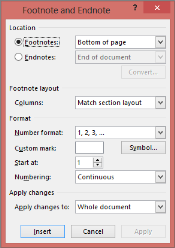

# Footnotes and Endnotes

## Footnote

A Footnote is a note of text placed at the bottom of a page in a book or document. It is normally flagged by a superscript number followed by the text where it is referenced to the document content.

## Endnote

An Endnote is a note or reference given at the end of a text or a major text section. Endnotes are similar to footnotes, but the only difference is that they are listed together at the end of a chapter or at the end of work.

Following are the steps to add a footnote or endnote to a Word document in Microsoft Word:

1.   Select the text to which you want to add the footnote or endnote.

2.   Open References menu.

3.   Point to Footnotes and then click Footnotes in the Microsoft Word menu.

DocIO has the ability to preserve Word Footnotes and Endnotes, but their creation and modification with DocIO API is limited.

Footnotes and Endnotes are the subdocuments of Word. Presentation of these subdocuments in a document consists of two parts, namely special marker, which specifies the footnote or endnote location in the document; and special data, which specifies the text and formatting of the subdocument.

WFootnote class represents the structure and properties of footnotes and endnotes. As footnotes and endnotes share the same structure in a document, a single class is used to represent them. This class has the FootnoteType property, which enables you to add a footnote or endnote. It takes two values namely:

* Footnote
* Endnote

Class Hierarchy

ParagraphItem

                  |

             WFootnote

### Public Constructors

<table>
<tr>
<th>
Constructor </th><th>
Description</th></tr>
<tr>
<td>
WFootnote.WFootnote (IWordDocument)</td><td>
Initializes a new instance of the WFootnote class  </td></tr>
</table>

### Public Properties

<table>
<tr>
<th>
Properties</th><th>
Description</th></tr>
<tr>
<td>
EntityType</td><td>
Gets the type of entity.</td></tr>
<tr>
<td>
FootnoteType</td><td>
Gets and specifies footnote type: footnote or endnote. </td></tr>
<tr>
<td>
IsAutoNumbered</td><td>
Gets the value indicating whether the footnote is auto numbered.  </td></tr>
<tr>
<td>
MarkerCharacterFormat</td><td>
Gets the marker character format.  </td></tr>
<tr>
<td>
TextBody</td><td>
Gets the text body of foot note.</td></tr>
<tr>
<td>
SymbolCode</td><td>
Gets and specifies the marker Symbol code.</td></tr>
<tr>
<td>
CustomMarker</td><td>
Specifies custom (string) marker for footnote. If footnote is autonumbered, this property will not have any influence (footnote will be autonumbered).</td></tr>
</table>

The following code example illustrates how to create a Footnote and an Endnote by using Essential DocIO.




//Creates a new document.

WordDocument document = new WordDocument();

//Creates a section.

IWSection section1 = document.AddSection();

//Adds a paragraph to a section.

IWParagraph paragraph = section1.AddParagraph();

//Creates a footnote.

WFootnote footnote = new WFootnote(document);

//Appends endnote.

footnote = paragraph.AppendFootnote(Syncfusion.DocIO.FootnoteType.Endnote);

//Sets the footnote character format.

footnote.MarkerCharacterFormat.SubSuperScript = SubSuperScript.SuperScript;

//Inserts Text into the paragraph.

paragraph.AppendText("Essential DocIO").CharacterFormat.Bold = true;

//Adds footnote text.

paragraph = footnote.TextBody.AddParagraph();

paragraph.AppendText("Essential DocIO is a .NET library that has a simple yet and powerful instance model which provides the ability to customize the document to a great extent. ");

//Saves the document to disk.

document.Save("Sample.doc", Syncfusion.DocIO.FormatType.Doc);




'Creates a new document.

Dim document As WordDocument = New WordDocument

'Creates a section.

Dim section1 As IWSection = document.AddSection

'Adds a paragraph to a section.

Dim paragraph As IWParagraph = section1.AddParagraph

'Creates a footnote.

Dim footnote As WFootnote = New WFootnote(document)

'Appends endnote.

footnote = paragraph.AppendFootnote(Syncfusion.DocIO.FootnoteType.Endnote)

'Sets the footnote character format.

footnote.MarkerCharacterFormat.SubSuperScript = SubSuperScript.SuperScript

'Inserts Text into the paragraph.

paragraph.AppendText("Essential DocIO").CharacterFormat.Bold = True

'Adds footnote text.

paragraph = footnote.TextBody.AddParagraph

paragraph.AppendText("Essential DocIO is a .NET library that has a simple yet and powerful instance model which provides the ability to customize the document to a great extent. ")

'Saves the document to disk.

document.Save("Sample.doc", Syncfusion.DocIO.FormatType.Doc)



### Footnote and Endnote Separators

A Footnote or Endnote separator is a line preserved between the body and the endnotes or footnotes in a Microsoft Word document. A footnote or endnote continuation separator is a line running across the top section indicating that the footnotes or endnotes are carried over from the preceding page if they run over to the second page. A footnote or endnote continuation notice is a special character or word preserved at the bottom of the footer area to indicate that the footnotes or endnotes continue to the next page.

### Public Constructors

<table>
<tr>
<th>
Constructors</th><th>
Description</th></tr>
<tr>
<td>
Footnote.Footnote(WordDocument)</td><td>
Initializes a new instance of the Footnote class.</td></tr>
<tr>
<td>
Endnote.Endnote(WordDocument)</td><td>
Initializes a new instance of the Endnote class.</td></tr>
</table>

### Public Properties 

<table>
<tr>
<th>
Properties</th><th>
Description</th></tr>
<tr>
<td>
Separator</td><td>
Gets and specifies the footnote/endnote separator.</td></tr>
<tr>
<td>
ContinuationSeparator</td><td>
Gets and specifies the footnote/endnote continuation separator.</td></tr>
<tr>
<td>
ContinuationNotice</td><td>
Gets and specifies the footnote/endnote continuation notice.</td></tr>
</table>

