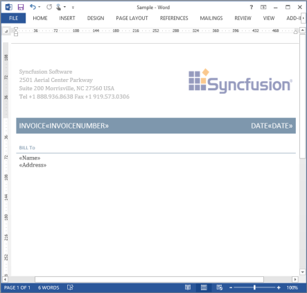
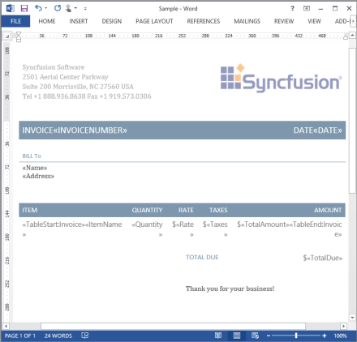
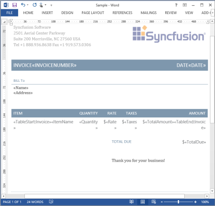

# Getting Started

This section provides you basic information on how to get started with creating or editing Microsoft Word documents with few lines of code by using the Essential DocIO APIs.

## Creating a New Word Document from Scratch

A new Word Document is easily created from scratch by using the Essential DocIO library by instantiating a new instance for the WordDocument class. This class is the root node for all other nodes in the DOM (Document Object Model) for Essential DocIO library. Using this DOM, you can add, edit, and remove content from documents by iterating elements.

You can ensure to preserve a Word Document with at least a section and a paragraph, while creating a new blank document by invoking the EnsureMinimal method of WordDocument class. The following code example illustrates how to create a Word Document with minimal content.



//Creates a new Word document instance.
WordDocument doc = new WordDocument();
//Adds one section and one paragraph to the document.doc.EnsureMinimal();


'Creates a new Word document instance.
Dim doc As New WordDocument()
'Adds one section and one paragraph to the document.doc.EnsureMinimal()



You can add new section at the end of a document by invoking the AddSection method of WordDocument class. The following code example illustrates how to add a new section to a Word document.



//Adds a new section to the document.
WSection section = doc.AddSection();


'Adds a new section to the document.
Dim section As WSection = doc.AddSection()



You can add new paragraph at the end of section by invoking the AddParagraph method of WSection class; also, you can add a new table at the end of section by invoking the AddTable method of WSection class. The following code example illustrates how to add a new Paragraph and Table to a Word document.



//Adds a new Paragraph to the section.
IWParagraph para = section.AddParagraph();
//Adds a new Table to the section.
IWTable table = section.AddTable();


'Adds a new Paragraph to the section.
Dim paragraph As IWParagraph = section.AddParagraph()
'Adds a new Paragraph to the section.
Dim table As IWTable = section.AddTable()



You can append text to a paragraph by invoking the AppendText method of WParagraph class.

The following code example illustrates how to append text to a Word document.



//Appends text to the paragraph.
paragraph.AppendText("Hello World");


'Appends text to the paragraph.
Paragraph.AppendText("Hello World")



You can save a Word document to the file system by invoking the Save method of WordDocument class.

The following code example illustrates how to save a Word document.



//Saves the generated Word document to the file system.
doc.Save("Sample.docx");


'Saves the generated Word document to the file system.
doc.Save("Sample.docx")



## Loading and Saving a Word Document

This section provides you basic information on how to load and save Word documents by using Essential DocIO APIs.

Using MaintainCompatibilityMode property of SaveOptions class, you can specify whether to preserve CompatibilityMode of the input document or to update CompatibilityMode based on the saved format type, while saving Word document in docx file format using DocIO.



document.SaveOptions.MaintainCompatibilityMode = true;


document.SaveOptions.MaintainCompatibilityMode = True



### Supported file formats in various platforms to load and save the document using DocIO

<table>
<tr>
<th rowspan = "2">
File Format Type</th><th rowspan = "2">
Open</th><th rowspan = "2">
Save</th><th colspan = "3">
Supported Platforms</th></tr>
<tr>
<td>
Windows Forms/WPF/ASP.NET Web/MVC </td><td>
Silverlight/LightSwitch/Windows Phone – Silverlight 8 and 8.1.</td><td>
Windows Store Applications/Windows Phone 8.1 (Based on WinRT)</td></tr>
<tr>
<td>
Doc</td><td>
√</td><td>
√</td><td>
√</td><td>
√</td><td>
√</td></tr>
<tr>
<td>
Docx</td><td>
√</td><td>
√</td><td>
√</td><td>
√</td><td>
√</td></tr>
<tr>
<td>
Dot</td><td>
√</td><td>
√</td><td>
√</td><td>
√</td><td>
√</td></tr>
<tr>
<td>
Dotx</td><td>
√</td><td>
√</td><td>
√</td><td>
√</td><td>
√</td></tr>
<tr>
<td>
Docm</td><td>
√</td><td>
√</td><td>
√</td><td>
√</td><td>
√</td></tr>
<tr>
<td>
Dotm</td><td>
√</td><td>
√</td><td>
√</td><td>
√</td><td>
√</td></tr>
<tr>
<td>
Rtf</td><td>
√</td><td>
√</td><td>
√</td><td>
√</td><td>
√</td></tr>
<tr>
<td>
Html</td><td>
√</td><td>
√</td><td>
√</td><td>
×</td><td>
√</td></tr>
<tr>
<td>
Txt</td><td>
√</td><td>
√</td><td>
√</td><td>
√</td><td>
√</td></tr>
<tr>
<td>
EPUB</td><td>
×</td><td>
√</td><td>
√</td><td>
×</td><td>
×</td></tr>
</table>

### Opening a Word document from File System

You can easily open an existing Word document from the local file system by invoking the Open method of WordDocument class, and you can also achieve the same with the WordDocument constructor to instantiate a new instance from an existing Word document. There are several overloads for this method.

To avoid FileNotFoundException, you can use the condition to check whether the input Word document is available in the specified file path before opening it by using DocIO.

The following code example illustrates the condition to check whether an input file exists in the specified file path.



//Checks whether the file exists in the specified path.
if(File.Exists("filePath"))


'Checks whether the file exists in the specified path.
If File.Exists("filePath ") Then



Open(string filePath): Opens an existing Word document from the specified file path.

The following code example illustrates how to open an existing Word document from the local file system by invoking the Open method.



//Creates a new WordDocument instance.
WordDocument doc = new WordDocument();
//Opens an existing Word document.doc.Open("Sample.docx");


'Creates a new WordDocument instance.
Dim doc As New WordDocument()
'Opens an existing Word document.doc.Open("Sample.docx")



You can also use the WordDocument (string fileName) constructor to open an existing document. The following code example illustrates how to open an existing document by using the WordDocument constructor.



//Opens an existing Word document.
WordDocument doc = new WordDocument("Sample.doc");


'Opens an existing Word document.
Dim doc As New WordDocument("Sample.doc")



Open(string fileName, FormatType formatType): Opens an existing document with the specified format type supported in DocIO. You can also achieve the same with the WordDocument (string filename, FormatType formatType) constructor.

The following code example illustrates how to open an existing Word document with the specified format type.



//Creates a new WordDocument instance.
WordDocument doc = new WordDocument();
//Opens an existing Word document with the specified format type.
doc.Open("Sample.rtf",FormatType.Rtf);


'Creates a new WordDocument instance.
Dim doc As New WordDocument() 
'Opens an existing Word document with the specified format type.
doc.Open("Sample.rtf", FormatType.Rtf)



### Opening a Word document from Stream

You can easily open an existing Word document from Stream by invoking the Open method of WordDocument class, and you can also achieve the same with the WordDocument constructor by instantiating a new instance from an existing Word document. By using this overload, you can open an existing document from databases, embedded resources, business objects, file system, and so on.

The following code example illustrates how to open a Word document from a Data Stream.



 //Creates a File Stream.
 FileStream fs = new FileStream("Sample.doc", FileMode.Open);
 //Moves the pointer to the first position.
 fs.Seek(0, SeekOrigin.Begin);
 //Opens the Word document from Stream.
 WordDocument doc = new WordDocument();
 doc.Open(fs, FormatType.Doc);
 //Closes the Stream.
 fs.Close();


'Creates a File Stream.
Dim fs As New FileStream("Sample.doc", FileMode.Open)
'Moves the pointer to the first position.
fs.Seek(0, SeekOrigin.Begin)
'Opens the Word document from Stream.
Dim doc As WordDocument = New WordDocument()doc.Open(fs, FormatType.Doc)
'Closes the Stream.
fs.Close()



### Opening an Encrypted Word Document

You can easily decrypt and open an existing encrypted Word document by using a password from the file system or data stream by invoking the Open method of WordDocument class, and you can also achieve the same with the WordDocument constructor.

The following code example illustrates how to open an encrypted Worddocument from the file system.



//Opens the Word document.
WordDocument sourceDoc = new WordDocument();
doc.Open("SourceDocument.doc", FormatType.Doc, "password");


'Opens the Word document.
Dim doc As WordDocument = New WordDocument()
doc.Open("SourceDocument.doc", FormatType.Doc, "password")



The following code example illustrates how to open an encrypted Word document from a Data Stream.



 //Creates a File Stream.
 FileStream fs = new FileStream("Sample.doc",FileMode.Open);
 //Moves the pointer to the first position.
 fs.Seek ( 0 , SeekOrigin.Begin );
 //Opens the Word document from Stream.
 WordDocument doc = new WordDocument();
 doc.Open(fs, FormatType.Doc, “password”);
 //Closes the Stream.
 fs.Close();


'Creates a File Stream.
Dim fs As New FileStream("Sample.doc", FileMode.Open)
'Moves the pointer to the first position.
fs.Seek ( 0 , SeekOrigin.Begin );
'Opens the Word document from Stream.
Dim doc As WordDocument = New WordDocument()
doc.Open(fs, FormatType.Doc, "password")
'Closes the Stream.
fs.Close()



### Saving a Word Document to the File System

You can save a WordDocument instance in any of the DocIO supported file formats to the file system by invoking the Save method of WordDocument class.

The following code example illustrates how to save a WordDocument to the file system in the specified file format.



//Saves the document to file system.
doc.Save("Sample.doc", FormatType.Doc);


 'Saves the document to file system.
 doc.Save("Sample.doc", FormatType.Doc)



### Saving a Word Document to a Stream

You can save the WordDocument instance in any of the DocIO supported file formats to the stream by invoking the Save method of WordDocument class. By using this overload, you can save the document to databases, embedded resources, business objects, and so on.

The following code example illustrates how to save a Word document to a stream.



 //Creates a Memory Stream.
 MemoryStream memStream = new MemoryStream();
 //Saves the document to Memory Stream.
 document.Save(memStream, FormatType.Docx);
 //Closes the Stream.
 memStream.Close();


'Creates a Memory Stream.
Dim memStream As New MemoryStream()
'Saves the document into Memory Stream.
document.Save(memStream, FormatType.Docx)
'Closes the Stream.
memStream.Close()



### Sending to a Client Browser

You can easily save and send a document to a client browser from a Web application by invoking the Save method of WordDocument class. This functionality is handled in DocIO library by using the HttpResponse instance.

The following code example illustrates how to stream the document to the browser.



 //Streams the document to the browser.
 doc.Save("Sample.doc", FormatType.Doc, Response, HttpContentDisposition.InBrowser);


'Streams the document to the browser.
doc.Save("Sample.doc", FormatType.Doc, Response, HttpContentDisposition.InBrowser)



### Asynchronous Support

You can utilize the asynchronous Open and Save methods of WordDocument class to develop UI responsive applications. These asynchronous methods return tasks that have information about the task completion status, history, any exception that is raised or canceled, and the final result.

N> Asynchronous support is applicable only to Windows Store, Windows Phone - Silverlight 8 and 8.1, and Windows Phone 8.1 (based on WinRT) apps.

### Overloads for OpenAsync method

<table>
<tr>
<th>
Method</th><th>
Overloads</th><th>
Description</th></tr>
<tr>
<td rowspan = "5">
OpenAsync</td><td>
OpenAsync(StorageFile file)</td><td>
Opens the document asynchronously from the storage file.</td></tr>
<tr>
<td>
OpenAsync (StorageFile file, FormatType formatType)</td><td>
Opens the document asynchronously from the storage file that has the specified format type.</td></tr>
<tr>
<td>
OpenAsync(Stream stream, FormatType formatType)</td><td>
Opens the document asynchronously from the stream that has the specified format type.</td></tr>
<tr>
<td>
OpenAsync(StorageFile file, FormatType formatType, string password)</td><td>
Opens the document asynchronously from the storage file that has the specified format type and the password.</td></tr>
<tr>
<td>
OpenAsync(Stream stream, FormatType formatType, string password)</td><td>
Opens the document asynchronously from the stream that has the specified format type and the password.</td></tr>
</table>

### Overloads for SaveAsync method

<table>
<tr>
<th>
Method</th><th>
Overload</th><th>
Description</th></tr>
<tr>
<td rowspan = "2">
SaveAsync</td><td>
SaveAsync(StorageFile file, FormatType formatType)</td><td>
Saves the document asynchronously to the storage file in the specified format type.</td></tr>
<tr>
<td>
SaveAsync(Stream stream, FormatType formatType)</td><td>
Saves the document asynchronously to the stream in the specified format type.</td></tr>
</table>

The following code example illustrates the usage of the Open and SaveAsync methods.



//Opens the Word document from the memory stream.
WordDocument doc = new WordDocument();
await doc.OpenAsync(memoryStream, FormatType.Doc);
//Opens the Word document from the storage file.
WordDocument doc = new WordDocument();
await doc.OpenAsync(storageFile, FormatType.Doc);
//Saves the document in the memory stream.
await doc.SaveAsync(memoryStream, FormatType.Doc);
//Saves the document in the storage file.
await doc.SaveAsync(storageFile, FormatType.Doc);


'Opens the Word document from the memory stream.
Dim doc As WordDocument = New WordDocument()
Await sourceDoc.OpenAsync(memoryStream, FormatType.Doc);
'Opens the Word document from a storage file.
Dim doc As WordDocument = New WordDocument()
Await sourceDoc.OpenAsync(storageFile, FormatType.Doc)
'Saves the document in a memory stream.
Await doc.SaveAsync(MemoryStream, FormatType.Doc)
'Saves the document in a storage file.
Await doc.SaveAsync(storageFile, FormatType.Doc) 



## Closing a Word Document

You can explicitly release all the resources used for preserving the document contents in main memory by invoking the Close method of WordDocument class. In the DocIO DOM, each element has reference properties to preserve the parent-child relation between all document elements. As long as references to a managed instance remain in the current scope, the Garbage Collector does not close the instance. As a result, the instance cannot be marked for collection and therefore the memory cannot be freed.

On the other hand, the Close method, unlinks child elements from the parent element by removing the reference, and clears all child elements from the parent’s child element collection explicitly. This operation is required specifically to remove references of all the instances used by DocIO DOM, in order to ensure no instance is referred anywhere in the current scope.

The following code example illustrates how to close a Word document instance.



//Releases the resources used by the WordDocument instance.
doc.Close();


'Releases the resources used by the WordDocument instance.
doc.Close()



## Quick Start to DocIO

This article explains the various steps required to create a basic invoice document by using fundamental elements such as text, table, images, and header. The following screenshot shows a simple invoice created by using Essential DocIO library.

### Creating an Invoice Template Document

To begin with, create a Word document with a single section and customized page settings as illustrated in the following code example.



WordDocument document = new WordDocument();
//Adds a section to the document.
WSection section = document.AddSection() as WSection;
//Sets Page Margins to the document.
section.PageSetup.Margins.Top = 134;
section.PageSetup.Margins.Bottom = 54;
section.PageSetup.Margins.Left = 54;
section.PageSetup.Margins.Right = 54;
//Sets the Page Size.
section.PageSetup.PageSize = new System.Drawing.SizeF(612, 792);
//Sets the Header Distance.section.PageSetup.HeaderDistance = 43;


Dim document As New WordDocument()
'Adds a section to the document.
Dim section As WSection = TryCast(document.AddSection(), WSection)
'Sets Page Margins to the document.
section.PageSetup.Margins.Top = 134
section.PageSetup.Margins.Bottom = 54
section.PageSetup.Margins.Left = 54
section.PageSetup.Margins.Right = 54
'Sets the Page Size.section.PageSetup.PageSize = New System.Drawing.SizeF(612, 792)
'Sets the Header Distance.section.PageSetup.HeaderDistance = 43



This creates an A4 size Word document with the four margins of the pages set to 72 points. The following screenshot shows how the document appears after customizing the page settings.

Invoice Template Document
{:.caption}

### Adding a Header to an Invoice

You can add a header to a document and position it according to your requirements. The following code example illustrates how to add logo as a header at the top of a document by using the AppendPicture property.



HeaderFooter header = section.HeadersFooters.Header;
//Adds a table to the header.
WTable table = header.AddTable() as WTable;
//Initializes the table with one row and two cells.
table.ResetCells(1, 2);
table.TableFormat.Borders.BorderType = BorderStyle.None;
//Adds paragraphs to the cell.
WParagraph paragraph = table.Rows[0].Cells[1].AddParagraph() as WParagraph;
//Sets before and after spacing to the paragraph.
paragraph.ParagraphFormat.BeforeSpacing = 2;
paragraph.ParagraphFormat.AfterSpacing = 2;
//Sets horizontal alignment to the paragraph.
paragraph.ParagraphFormat.HorizontalAlignment = Syncfusion.DocIO.DLS.HorizontalAlignment.Right;
//Appends a picture to the paragraph.
WPicture picture = paragraph.AppendPicture(System.Drawing.Image.FromFile(dataPath + "Syncfusion.png")) as WPicture;
//Sets the picture size.
picture.Width = 187;
picture.Height = 46;


Dim header As HeaderFooter = Section.HeadersFooters.Header
'Adds a table to the header.
Dim table As WTable = TryCast(header.AddTable(), WTable)
'Initializes the table with one row and two cells.
table.ResetCells(1, 2)table.TableFormat.
Borders.BorderType = BorderStyle.None
'Adds paragraphs to the cell.
Dim paragraph As WParagraph = TryCast(table.Rows(0).Cells(1).AddParagraph(), WParagraph)
'Sets before and after spacing to the paragraph.
paragraph.ParagraphFormat.BeforeSpacing = 2paragraph.ParagraphFormat.AfterSpacing = 2
'Sets horizontal alignment to the paragraph.
paragraph.ParagraphFormat.HorizontalAlignment = Syncfusion.DocIO.DLS.HorizontalAlignment.Right
'Appends a picture to the paragraph.
Dim picture As WPicture = TryCast(paragraph.AppendPicture(System.Drawing.Image.FromFile(dataPath + "Syncfusion.png")), WPicture)
'Sets the picture size.picture.Width = 187picture.Height = 46



In the preceding code, the picture is appended to the paragraph, and the width and height of the picture are set to fit inside the cell. The following screenshot shows how the document looks after adding the logo.

Header added to Invoice
{:.caption}

### Adding Address to an Invoice

You can add the address of the sender to an invoice. The following code example illustrates how to add address to the left corner of an invoice. 



HeaderFooter header = section.HeadersFooters.Header;
//Adds a Table to the Header.
WTable table = header.AddTable() as WTable;
//Initializes the table with one row and two cells.
table.ResetCells(1, 2);
table.TableFormat.Borders.BorderType = BorderStyle.None;
//Adds Paragraphs to the cell.
WTableCell cell = table.Rows[0].Cells[0];
paragraph = cell.AddParagraph() as WParagraph;
//Specifies BeforeSpacing to the paragraph.
paragraph.ParagraphFormat.BeforeSpacing = 2;
//Appends Text to the paragraph.
IWTextRange textRange = paragraph.AppendText("Syncfusion Software \n2501 Aerial Center Parkway \nSuite 200 Morrisville, NC 27560 USA");
//Sets font name and font size.
textRange.CharacterFormat.Font = new System.Drawing.Font("cambria", 11);
//Specifies text color to the textrange.
textRange.CharacterFormat.TextColor = System.Drawing.Color.FromArgb(89, 89, 89);
paragraph = cell.AddParagraph() as WParagraph;
//Sets before and after spacing to paragraph.
paragraph.ParagraphFormat.BeforeSpacing = 2;
paragraph.ParagraphFormat.AfterSpacing = 2;
textRange=paragraph.AppendText("Tel");
//Sets Bold Style.textRange.
CharacterFormat.Bold = true;
//Sets font name and font size.
textRange.CharacterFormat.Font = new System.Drawing.Font("cambria", 11);
//Sets font color.textRange.
CharacterFormat.TextColor = System.Drawing.Color.FromArgb(89, 89, 89);
textRange = paragraph.AppendText(" +1 888.936.8638");
//Sets font name and font size.
textRange.CharacterFormat.Font = new System.Drawing.Font("cambria", 11);
//Sets font color.
textRange.CharacterFormat.TextColor = System.Drawing.Color.FromArgb(89, 89, 89);
textRange = paragraph.AppendText(" Fax");
//Sets font color.
textRange.CharacterFormat.TextColor = System.Drawing.Color.FromArgb(89, 89, 89);
//Applies bold style.
textRange.CharacterFormat.Bold = true;
//Sets font name and font size.
textRange.CharacterFormat.Font = new System.Drawing.Font("cambria", 11);
textRange=paragraph.AppendText(" +1 919.573.0306");
//Sets font name and font size.
textRange.CharacterFormat.Font = new System.Drawing.Font("cambria", 11);
//Sets font color.
textRange.CharacterFormat.TextColor = System.Drawing.Color.FromArgb(89, 89, 89);
paragraph = header.AddParagraph() as WParagraph;
//Sets before and after spacing to paragraph.
paragraph.ParagraphFormat.BeforeSpacing = 2;
paragraph.ParagraphFormat.AfterSpacing = 2;


Dim header As HeaderFooter = Section.HeadersFooters.Header
'Adds a Table to the Header.
Dim table As WTable = TryCast(header.AddTable(), WTable)
'Initializes the table with one row and two cells.
table.ResetCells(1, 2)table.TableFormat.Borders.BorderType = BorderStyle.None'Adds Paragraphs to the cell.
Dim cell As WTableCell = table.Rows(0).Cells(0)paragraph = TryCast(cell.AddParagraph(), WParagraph)
'Specifies BeforeSpacing to the paragraph.
paragraph.ParagraphFormat.BeforeSpacing = 2
'Appends Text to the paragraph.
Dim textRange As IWTextRange = paragraph.AppendText("Syncfusion Software " & "\n" & "2501 Aerial Center Parkway " & "\n" & "Suite 200 Morrisville, NC 27560 USA")
'Sets font name and font size.
textRange.CharacterFormat.Font = New System.Drawing.Font("cambria", 11)
'Specifies text color to the textrange.
textRange.CharacterFormat.TextColor = System.Drawing.Color.FromArgb(89, 89, 89)paragraph = TryCast(cell.AddParagraph(), WParagraph)
'Sets before and after spacing to paragraph.
paragraph.ParagraphFormat.BeforeSpacing = 2paragraph.ParagraphFormat.AfterSpacing = 2textRange = paragraph.AppendText("Tel")
'Sets Bold Style.
textRange.CharacterFormat.Bold = True
'Sets font name and font size.
textRange.CharacterFormat.Font = New System.Drawing.Font("cambria", 11)
'Sets font color.
textRange.CharacterFormat.TextColor = System.Drawing.Color.FromArgb(89, 89, 89)textRange = Paragraph.AppendText(" +1 888.936.8638")
'Sets font name and font size.
textRange.CharacterFormat.Font = New System.Drawing.Font("cambria", 11)
'Sets font color.
textRange.CharacterFormat.TextColor = System.Drawing.Color.FromArgb(89, 89, 89)textRange = Paragraph.AppendText(" Fax")
'Sets font color.
textRange.CharacterFormat.TextColor = System.Drawing.Color.FromArgb(89, 89, 89)
'Applies bold style.
textRange.CharacterFormat.Bold = True
'Sets font name and font size.
textRange.CharacterFormat.Font = New System.Drawing.Font("cambria", 11)textRange = Paragraph.AppendText(" +1 919.573.0306")
'Sets font name and font size.
textRange.CharacterFormat.Font = New System.Drawing.Font("cambria", 11)
'Sets font color.
textRange.CharacterFormat.TextColor = System.Drawing.Color.FromArgb(89, 89, 89)paragraph = TryCast(header.AddParagraph(), WParagraph)
'Sets before and after spacing to paragraph.
paragraph.ParagraphFormat.BeforeSpacing = 2paragraph.ParagraphFormat.AfterSpacing = 2



You can append address text to the paragraph by specifying the font and size in the invoice. The following screenshot shows how the document looks after adding the sender’s address.

Address added to Invoice
{:.caption}

### Adding Invoice Content

The body of the invoice contains the invoice number, date, and buyer’s address. The invoice number and date are maintained in separate tables to provide a good appearance. The following code example shows how to insert a table and apply background color to the cells. Note that the Merge field is appended to update the invoice number and date. 



table = section.AddTable() as WTable;
//Sets border to table.
table.TableFormat.Borders.BorderType = BorderStyle.None;
//Initializes table with one row and two columns.
table.ResetCells(1, 2);
cell = table.Rows[0].Cells[0];
//Sets vertical alignment to the cell.
cell.CellFormat.VerticalAlignment = Syncfusion.DocIO.DLS.VerticalAlignment.Middle;
//Applies background color to the Cell.
table.Rows[0].Cells[0].CellFormat.BackColor = System.Drawing.Color.FromArgb(126, 151, 173);
table.Rows[0].Cells[1].CellFormat.BackColor = System.Drawing.Color.FromArgb(126, 151, 173);


table = TryCast(Section.AddTable(), WTable)
'Sets border to table.table.TableFormat.
Borders.BorderType = BorderStyle.None
'Initializes table with one row and two columns.
table.ResetCells(1, 2)cell = table.Rows(0).Cells(0)
'Sets vertical alignment to the cell.
cell.CellFormat.VerticalAlignment = Syncfusion.DocIO.DLS.VerticalAlignment.Middle
'Applies background color to the Cell.
table.Rows(0).Cells(0).CellFormat.BackColor = System.Drawing.Color.FromArgb(126, 151, 173)table.Rows(0).Cells(1).CellFormat.BackColor = System.Drawing.Color.FromArgb(126, 151, 173)



You can specify the font size, style, and color for a paragraph. You can also create a new Paragraph object and append the Merge field as the invoice number. The following code example illustrates how to add a paragraph to a table cell. 



paragraph = cell.AddParagraph() as WParagraph;
//Sets before and after spacing to paragraph.
paragraph.ParagraphFormat.BeforeSpacing = 6;
paragraph.ParagraphFormat.AfterSpacing = 6;
textRange = paragraph.AppendText("INVOICE");
//Sets font name and font size.
textRange.CharacterFormat.Font = new System.Drawing.Font("Calibri", 14);
//Sets font color.
textRange.CharacterFormat.TextColor = System.Drawing.Color.White;
textRange = paragraph.AppendField("InvoiceNumber", FieldType.FieldMergeField);
//Sets font name and font size.
textRange.CharacterFormat.Font = new System.Drawing.Font("Calibri", 14);
//Setting font colortextRange.
CharacterFormat.TextColor = System.Drawing.Color.White;cell = table.Rows[0].Cells[1];
//Assigns vertical alignment to the Cell.
cell.CellFormat.VerticalAlignment = Syncfusion.DocIO.DLS.VerticalAlignment.Middle;
paragraph = cell.AddParagraph() as WParagraph;
//Sets before and after spacing to paragraph.
paragraph.ParagraphFormat.BeforeSpacing = 6;
paragraph.ParagraphFormat.AfterSpacing = 6;
//Assigns Horizontal alignment to the Cell.
paragraph.ParagraphFormat.HorizontalAlignment = Syncfusion.DocIO.DLS.HorizontalAlignment.Right;
textRange = paragraph.AppendText("DATE");
//Sets font name and font size.
textRange.CharacterFormat.Font = new System.Drawing.Font("Calibri", 14);
//Sets font color.
textRange.CharacterFormat.TextColor = System.Drawing.Color.White;textRange = paragraph.AppendField("Date", FieldType.FieldMergeField);
//Sets font name and font size.
textRange.CharacterFormat.Font = new System.Drawing.Font("Calibri", 14);
//Sets font color.
textRange.CharacterFormat.TextColor = System.Drawing.Color.White;
paragraph = section.AddParagraph() as WParagraph;
//Sets before and after spacing to paragraph.
paragraph.ParagraphFormat.BeforeSpacing = 2;
paragraph.ParagraphFormat.AfterSpacing = 2;


paragraph = TryCast(cell.AddParagraph(), WParagraph)'Sets before and after spacing to paragraph.paragraph.ParagraphFormat.BeforeSpacing = 6paragraph.ParagraphFormat.AfterSpacing = 6textRange = paragraph.AppendText("INVOICE")'Sets font name and font size.textRange.CharacterFormat.Font = New System.Drawing.Font("Calibri", 14)'Sets font color.textRange.CharacterFormat.TextColor = System.Drawing.Color.WhitetextRange = paragraph.AppendField("InvoiceNumber", FieldType.FieldMergeField)'Sets font name and font size.textRange.CharacterFormat.Font = New System.Drawing.Font("Calibri", 14)'Setting font colortextRange.CharacterFormat.TextColor = System.Drawing.Color.Whitecell = table.Rows(0).Cells(1)'Assigns vertical alignment to the Cell.cell.CellFormat.VerticalAlignment = Syncfusion.DocIO.DLS.VerticalAlignment.Middleparagraph = TryCast(cell.AddParagraph(), WParagraph)'Sets before and after spacing to paragraph.paragraph.ParagraphFormat.BeforeSpacing = 6paragraph.ParagraphFormat.AfterSpacing = 6'Assigns Horizontal alignment to the Cell.paragraph.ParagraphFormat.HorizontalAlignment = Syncfusion.DocIO.DLS.HorizontalAlignment.RighttextRange = paragraph.AppendText("DATE")'Sets font name and font size.textRange.CharacterFormat.Font = New System.Drawing.Font("Calibri", 14)'Sets font color.textRange.CharacterFormat.TextColor = System.Drawing.Color.WhitetextRange = paragraph.AppendField("Date", FieldType.FieldMergeField)'Sets font name and font size.textRange.CharacterFormat.Font = New System.Drawing.Font("Calibri", 14)'Sets font color.textRange.CharacterFormat.TextColor = System.Drawing.Color.Whiteparagraph = TryCast(Section.AddParagraph(), WParagraph)'Sets before and after spacing to paragraph.paragraph.ParagraphFormat.BeforeSpacing = 2paragraph.ParagraphFormat.AfterSpacing = 2



Similarly, you can append the Merge field for the current date, and reuse the font that is created for the subheading. The following screenshot shows the invoice document with the invoice number and date.

Content added to Invoice
{:.caption}

### Adding the Buyer’s Address

You can create a new table and append the Merge field to add the buyer’s address. You can also use different fonts to improve the appearance. The following code example illustrates this. 



table = section.AddTable() as WTable;table.ResetCells(2, 1);
//Sets border for the table.
table.TableFormat.Borders.BorderType = BorderStyle.None;
paragraph = table.Rows[0].Cells[0].AddParagraph() as WParagraph;
//Sets before and after spacing to paragraph.
paragraph.ParagraphFormat.BeforeSpacing = 2;
paragraph.ParagraphFormat.AfterSpacing = 2;
textRange = paragraph.AppendText("BILL To");
//Sets border style to the cell.
table.Rows[0].Cells[0].CellFormat.Borders.Bottom.BorderType = BorderStyle.Inset;
//Sets color for the cell border.
table.Rows[0].Cells[0].CellFormat.Borders.Color = System.Drawing.Color.FromArgb(126, 151, 173);
//Sets font name and font size.
textRange.CharacterFormat.Font = new System.Drawing.Font("Calibri", 10);
//Sets font Color.
textRange.CharacterFormat.TextColor = System.Drawing.Color.FromArgb(126, 151, 173);cell = table.Rows[1].Cells[0];
//Sets Vertical alignment to the Cell.
cell.CellFormat.VerticalAlignment = Syncfusion.DocIO.DLS.VerticalAlignment.Middle;paragraph = cell.AddParagraph() as WParagraph;
//Sets before and after spacing to paragraph.
paragraph.ParagraphFormat.BeforeSpacing = 2;
paragraph.ParagraphFormat.AfterSpacing = 2;
textRange = paragraph.AppendField("Name", FieldType.FieldMergeField);
//Sets font name and font size.
textRange.CharacterFormat.Font = new System.Drawing.Font("cambria", 11);
//Sets font color.
textRange.CharacterFormat.TextColor = System.Drawing.Color.FromArgb(89, 89, 89);
//Appends Line Breaking.
paragraph.AppendBreak(BreakType.LineBreak);
textRange = paragraph.AppendField("Address", FieldType.FieldMergeField);
//Sets font name and font size.
textRange.CharacterFormat.Font = new System.Drawing.Font("cambria", 11);
//Sets font color.
textRange.CharacterFormat.TextColor = System.Drawing.Color.FromArgb(89, 89, 89);paragraph = cell.AddParagraph() as WParagraph;
//Sets before and after spacing to paragraph.
paragraph.ParagraphFormat.BeforeSpacing = 2;
paragraph.ParagraphFormat.AfterSpacing = 2;
paragraph = section.AddParagraph() as WParagraph;
paragraph.ParagraphFormat.BeforeSpacing = 2;
paragraph.ParagraphFormat.AfterSpacing = 2;


table = TryCast(Section.AddTable(), WTable)table.ResetCells(2, 1)
'Sets border for the table.
table.TableFormat.Borders.BorderType = BorderStyle.Noneparagraph = TryCast(table.Rows(0).Cells(0).AddParagraph(), WParagraph)
'Sets before and after spacing to paragraph.
paragraph.ParagraphFormat.BeforeSpacing = 2
paragraph.ParagraphFormat.AfterSpacing = 2
textRange = paragraph.AppendText("BILL To")
'Sets border style to the cell.
table.Rows(0).Cells(0).CellFormat.Borders.Bottom.BorderType = BorderStyle.Inset
'Sets color for the cell border.
table.Rows(0).Cells(0).CellFormat.Borders.Color = System.Drawing.Color.FromArgb(126, 151, 173)
'Sets font name and font size.
textRange.CharacterFormat.Font = New System.Drawing.Font("Calibri", 10)\
'Sets font Color.
textRange.CharacterFormat.TextColor = System.Drawing.Color.FromArgb(126, 151, 173)cell = table.Rows(1).Cells(0)
'Sets Vertical alignment to the Cell.
cell.CellFormat.VerticalAlignment = Syncfusion.DocIO.DLS.VerticalAlignment.Middleparagraph = TryCast(cell.AddParagraph(), WParagraph)
'Sets before and after spacing to paragraph.
paragraph.ParagraphFormat.BeforeSpacing = 2
paragraph.ParagraphFormat.AfterSpacing = 2
textRange = paragraph.AppendField("Name", FieldType.FieldMergeField)'
Sets font name and font size.
textRange.CharacterFormat.Font = New System.Drawing.Font("cambria", 11)
'Sets font color.
textRange.CharacterFormat.TextColor = System.Drawing.Color.FromArgb(89, 89, 89)
'Appends Line Breaking.
paragraph.AppendBreak(BreakType.LineBreak)textRange = paragraph.AppendField("Address", FieldType.FieldMergeField)
'Sets font name and font size.
textRange.CharacterFormat.Font = New System.Drawing.Font("cambria", 11)
'Sets font color.
textRange.CharacterFormat.TextColor = System.Drawing.Color.FromArgb(89, 89, 89)paragraph = TryCast(cell.AddParagraph(), WParagraph)
'Sets before and after spacing to paragraph.
paragraph.ParagraphFormat.BeforeSpacing = 2
paragraph.ParagraphFormat.AfterSpacing = 2
paragraph = TryCast(Section.AddParagraph(), WParagraph)paragraph.ParagraphFormat.BeforeSpacing = 2
paragraph.ParagraphFormat.AfterSpacing = 2



The contents are displayed as shown in the following template document. You can notice that the table has different header style than that of the other rows.

Buyer’s Address added to Invoice
{:.caption}

### Adding Invoice Items

You can modify the properties and appearance of an individual cell or row such as width, border, background color, and so on by using DocIO APIs. The following code example illustrates how to achieve this. 



table = section.AddTable() as WTable;
table.ResetCells(2, 5);
//Sets background color to the cell.
table.Rows[0].Cells[0].CellFormat.BackColor = System.Drawing.Color.FromArgb(126, 151, 173);
//Defines cell width.
table.Rows[0].Cells[0].Width = 164.15F;
//Sets background color to the cell.
table.Rows[0].Cells[1].CellFormat.BackColor = System.Drawing.Color.FromArgb(126, 151, 173);
//Defines cell width.
table.Rows[0].Cells[1].Width = 62.5F;
//Sets background color to the cell.
table.Rows[0].Cells[2].CellFormat.BackColor = System.Drawing.Color.FromArgb(126, 151, 173);
//Defines cell width.
table.Rows[0].Cells[2].Width = 48.4F;
//Sets background color to the cell.
table.Rows[0].Cells[3].CellFormat.BackColor = System.Drawing.Color.FromArgb(126, 151, 173);
//Defines cell width.
table.Rows[0].Cells[3].Width = 51.9F;
//Sets background color to the cell.
table.Rows[0].Cells[4].CellFormat.BackColor = System.Drawing.Color.FromArgb(126, 151, 173);
//Defines cell width.
table.Rows[0].Cells[4].Width = 176.4F;


table = TryCast(section.AddTable(), WTable)table.ResetCells(2, 5)
'Sets background color to the cell.
table.Rows(0).Cells(0).CellFormat.BackColor = System.Drawing.Color.FromArgb(126, 151, 173)
'Defines cell width.
table.Rows(0).Cells(0).Width = 164.15F
'Sets background color to the cell.
table.Rows(0).Cells(1).CellFormat.BackColor = System.Drawing.Color.FromArgb(126, 151, 173)
'Defines cell width.
table.Rows(0).Cells(1).Width = 62.5F
'Sets background color to the cell.table.Rows(0).Cells(2).CellFormat.BackColor = System.Drawing.Color.FromArgb(126, 151, 173)
'Defines cell width.
table.Rows(0).Cells(2).Width = 48.4F
'Sets background color to the cell.
table.Rows(0).Cells(3).CellFormat.BackColor = System.Drawing.Color.FromArgb(126, 151, 173)
'Defines cell width.
table.Rows(0).Cells(3).Width = 51.9F
'Sets background color to the cell.
table.Rows(0).Cells(4).CellFormat.BackColor = System.Drawing.Color.FromArgb(126, 151, 173)
'Defines cell width.
table.Rows(0).Cells(4).Width = 176.4F



As shown in the preceding code, you can specify the cell style with a background color for the header row by using the BackgroundColor property of the cell. Note that the text alignment of the first column of the table is always left-aligned and the other columns are right-aligned.

By using the WParagraphFormat class, you can modify the alignment (horizontal and vertical), and by using the WCharacterFormat class, you can modify the font, color, and few other properties of the text. The following code example illustrates how to iterate through the header cells and set the string format for the cells. 



paragraph = table.Rows[0].Cells[0].AddParagraph() as WParagraph;paragraph = table.Rows[0].Cells[1].AddParagraph() as WParagraph;
//Sets Horizontal Alignment to the paragraph.
paragraph.ParagraphFormat.HorizontalAlignment = Syncfusion.DocIO.DLS.HorizontalAlignment.Right;paragraph = table.Rows[0].Cells[2].AddParagraph() as WParagraph;
//Sets Horizontal Alignment to the paragraph.
paragraph.ParagraphFormat.HorizontalAlignment = Syncfusion.DocIO.DLS.HorizontalAlignment.Right;paragraph = table.Rows[0].Cells[3].AddParagraph() as WParagraph;
//Sets Horizontal Alignment to the paragraph.
paragraph.ParagraphFormat.HorizontalAlignment = Syncfusion.DocIO.DLS.HorizontalAlignment.Right;paragraph = table.Rows[0].Cells[4].AddParagraph() as WParagraph;
//Sets Horizontal Alignment to the Paragraph.
paragraph.ParagraphFormat.HorizontalAlignment = Syncfusion.DocIO.DLS.HorizontalAlignment.Right;
//Sets border to the table.
table.TableFormat.Borders.BorderType = BorderStyle.None;
paragraph = table.Rows[0].Cells[0].AddParagraph() as WParagraph;
//Sets before and after spacing to paragraph.
paragraph.ParagraphFormat.BeforeSpacing = 4;
paragraph.ParagraphFormat.AfterSpacing = 4;
textRange = paragraph.AppendText("ITEM");
//Applies font name and font size.textRange.CharacterFormat.Font = new System.Drawing.Font("Calibri", 11);
//Setting font color.
textRange.CharacterFormat.TextColor = System.Drawing.Color.White;paragraph = table.Rows[0].Cells[1].AddParagraph() as WParagraph;
//Sets before and after spacing to paragraph.
paragraph.ParagraphFormat.BeforeSpacing = 4;
paragraph.ParagraphFormat.AfterSpacing = 4;
textRange = paragraph.AppendText("QUANTITY");
//Applies font name and font size.
textRange.CharacterFormat.Font = new System.Drawing.Font("Calibri", 11);
//Sets font color.
textRange.CharacterFormat.TextColor = System.Drawing.Color.White;paragraph = table.Rows[0].Cells[2].AddParagraph() as WParagraph;
//Sets before and after spacing to paragraph.
paragraph.ParagraphFormat.BeforeSpacing = 4;
paragraph.ParagraphFormat.AfterSpacing = 4;
textRange = paragraph.AppendText("RATE");
//Applies font name and font size.
textRange.CharacterFormat.Font = new System.Drawing.Font("Calibri", 11);
//Sets font color.
textRange.CharacterFormat.TextColor = System.Drawing.Color.White;paragraph = table.Rows[0].Cells[3].AddParagraph() as WParagraph;
//Sets before and after spacing to paragraph.
paragraph.ParagraphFormat.BeforeSpacing = 4;
paragraph.ParagraphFormat.AfterSpacing = 4;
textRange = paragraph.AppendText("TAXES");
//Applies font name and font size.
textRange.CharacterFormat.Font = new System.Drawing.Font("Calibri", 11);
//Sets font color.
textRange.CharacterFormat.TextColor = System.Drawing.Color.White;
paragraph = table.Rows[0].Cells[4].AddParagraph() as WParagraph;
//Sets before and after spacing to paragraph.
paragraph.ParagraphFormat.BeforeSpacing = 4;
paragraph.ParagraphFormat.AfterSpacing = 4;
textRange = paragraph.AppendText("AMOUNT");
//Applies font name and font size.
textRange.CharacterFormat.Font = new System.Drawing.Font("Calibri", 11);
//Sets font color.
textRange.CharacterFormat.TextColor = System.Drawing.Color.White;


paragraph = TryCast(table.Rows(0).Cells(0).AddParagraph(), WParagraph)paragraph = TryCast(table.Rows(0).Cells(1).AddParagraph(), WParagraph)
'Sets Horizontal Alignment to the paragraph.
paragraph.ParagraphFormat.HorizontalAlignment = Syncfusion.DocIO.DLS.HorizontalAlignment.Rightparagraph = TryCast(table.Rows(0).Cells(2).AddParagraph(), WParagraph)
'Sets Horizontal Alignment to the paragraph.
paragraph.ParagraphFormat.HorizontalAlignment = Syncfusion.DocIO.DLS.HorizontalAlignment.Rightparagraph = TryCast(table.Rows(0).Cells(3).AddParagraph(), WParagraph)
'Sets Horizontal Alignment to the paragraph.
paragraph.ParagraphFormat.HorizontalAlignment = Syncfusion.DocIO.DLS.HorizontalAlignment.Rightparagraph = TryCast(table.Rows(0).Cells(4).AddParagraph(), WParagraph)
'Sets Horizontal Alignment to the Paragraph.
paragraph.ParagraphFormat.HorizontalAlignment = Syncfusion.DocIO.DLS.HorizontalAlignment.Right
'Sets border to the table.
table.TableFormat.Borders.BorderType = BorderStyle.Noneparagraph = TryCast(table.Rows(0).Cells(0).AddParagraph(), WParagraph)
'Sets before and after spacing to paragraph.
paragraph.ParagraphFormat.BeforeSpacing = 4
paragraph.ParagraphFormat.AfterSpacing = 4
textRange = paragraph.AppendText("ITEM")
'Applies font name and font size.
textRange.CharacterFormat.Font = New System.Drawing.Font("Calibri", 11)
'Setting font color.
textRange.CharacterFormat.TextColor = System.Drawing.Color.Whiteparagraph = TryCast(table.Rows(0).Cells(1).AddParagraph(), WParagraph)
'Sets before and after spacing to paragraph.
paragraph.ParagraphFormat.BeforeSpacing = 4paragraph.ParagraphFormat.AfterSpacing = 4textRange = paragraph.AppendText("QUANTITY")
'Applies font name and font size.
textRange.CharacterFormat.Font = New System.Drawing.Font("Calibri", 11)
'Sets font color.
textRange.CharacterFormat.TextColor = System.Drawing.Color.Whiteparagraph = TryCast(table.Rows(0).Cells(2).AddParagraph(), WParagraph)
'Sets before and after spacing to paragraph.
paragraph.ParagraphFormat.BeforeSpacing = 4
paragraph.ParagraphFormat.AfterSpacing = 4
textRange = paragraph.AppendText("RATE")
'Applies font name and font size.
textRange.CharacterFormat.Font = New System.Drawing.Font("Calibri", 11)
'Sets font color.
textRange.CharacterFormat.TextColor = System.Drawing.Color.Whiteparagraph = TryCast(table.Rows(0).Cells(3).AddParagraph(), WParagraph)
'Sets before and after spacing to paragraph.
paragraph.ParagraphFormat.BeforeSpacing = 4
paragraph.ParagraphFormat.AfterSpacing = 4
textRange = paragraph.AppendText("TAXES")
'Applies font name and font size.
textRange.CharacterFormat.Font = New System.Drawing.Font("Calibri", 11)
'Sets font color.
textRange.CharacterFormat.TextColor = System.Drawing.Color.Whiteparagraph = TryCast(table.Rows(0).Cells(4).AddParagraph(), WParagraph)
'Sets before and after spacing to paragraph.
paragraph.ParagraphFormat.BeforeSpacing = 4paragraph.ParagraphFormat.AfterSpacing = 4textRange = paragraph.AppendText("AMOUNT")
'Applies font name and font size.
textRange.CharacterFormat.Font = New System.Drawing.Font("Calibri", 11)
'Sets font color.textRange.CharacterFormat.TextColor = System.Drawing.Color.White



For the other rows, you can specify the cell format and string format just as for the header row. As shown in the screenshot, the border type for the table is set to None; so, the rows and cells are borderless. You can append merge fields such as item name, quantity, rate, taxes, and amount to the table cells with the region “TableStart: Invoice and TableEnd: Invoice”. You can also use different fonts to improve the appearance. The following code example illustrates this. 



cell = table.Rows[1].Cells[0];
//Defines cell width.
cell.Width = 164.15F;
paragraph = cell.AddParagraph() as WParagraph;
//Sets before and after spacing to paragraph. 
paragraph.ParagraphFormat.BeforeSpacing = 4;
paragraph.ParagraphFormat.AfterSpacing = 1;
textRange = paragraph.AppendField("TableStart:Invoice", FieldType.FieldMergeField);
//Applies font name and font size.
 textRange.CharacterFormat.Font = new System.Drawing.Font("Segoe UI", 11);
 //Sets font color.
 textRange.CharacterFormat.TextColor = System.Drawing.Color.FromArgb(128, 130, 133);
 textRange = paragraph.AppendField("ItemName", FieldType.FieldMergeField);
 //Applies font name and font size.
 textRange.CharacterFormat.Font = new System.Drawing.Font("Segoe UI", 11);
 //Sets font color.
 textRange.CharacterFormat.TextColor = System.Drawing.Color.FromArgb(128, 130, 133);
 cell = table.Rows[1].Cells[1];
 //Defines cell width.cell.Width = 62.5F;paragraph = cell.AddParagraph() as WParagraph;
 //Sets before and after spacing to paragraph. 
 paragraph.ParagraphFormat.BeforeSpacing = 4;
 paragraph.ParagraphFormat.AfterSpacing = 4;
 //Sets Horizontal Alignment for the Paragraph.
 paragraph.ParagraphFormat.HorizontalAlignment = Syncfusion.DocIO.DLS.HorizontalAlignment.Right;
 textRange = paragraph.AppendField("Quantity", FieldType.FieldMergeField);
 //Applies font name and font size. textRange.CharacterFormat.Font = new System.Drawing.Font("Segoe UI", 11);
 //Sets font color.
 textRange.CharacterFormat.TextColor = System.Drawing.Color.FromArgb(128, 130, 133);cell = table.Rows[1].Cells[2];
 //Defines cell width.
 cell.Width = 48.4F;
 paragraph = cell.AddParagraph() as WParagraph;
 //Sets before and after spacing to paragraph. 
 paragraph.ParagraphFormat.BeforeSpacing = 4;
 paragraph.ParagraphFormat.AfterSpacing = 4;
 //Applies HorizontalAlignment to the paragraph.
 paragraph.ParagraphFormat.HorizontalAlignment = Syncfusion.DocIO.DLS.HorizontalAlignment.Right;textRange = paragraph.AppendText("$");
 //Applies font name and font size.
 textRange.CharacterFormat.Font = new System.Drawing.Font("Segoe UI", 11);
 //Sets font color.
 textRange.CharacterFormat.TextColor = System.Drawing.Color.FromArgb(128, 130, 133);
 textRange = paragraph.AppendField("Rate", FieldType.FieldMergeField);
 //Applies font name and font size. 
 textRange.CharacterFormat.Font = new System.Drawing.Font("Segoe UI", 11);
 //Sets font color.
 textRange.CharacterFormat.TextColor = System.Drawing.Color.FromArgb(128, 130, 133);cell = table.Rows[1].Cells[3];
 //Defines cell width.
 cell.Width = 51.9F;
 paragraph = cell.AddParagraph() as WParagraph;
 //Sets before and after spacing to paragraph.
 paragraph.ParagraphFormat.BeforeSpacing = 4;
 paragraph.ParagraphFormat.AfterSpacing = 4;
 //Applies HorizontalAlignment to the paragraph.
 paragraph.ParagraphFormat.HorizontalAlignment = Syncfusion.DocIO.DLS.HorizontalAlignment.Right;
 textRange = paragraph.AppendText("$");
 //Applies font name and font size. 
 textRange.CharacterFormat.Font = new System.Drawing.Font("Segoe UI", 11);
 //Sets font color.
 textRange.CharacterFormat.TextColor = System.Drawing.Color.FromArgb(128, 130, 133);
 textRange = paragraph.AppendField("Taxes", FieldType.FieldMergeField);
 //Applies font name and font size. 
 textRange.CharacterFormat.Font = new System.Drawing.Font("Segoe UI", 11);
 //Sets font color.
 textRange.CharacterFormat.TextColor = System.Drawing.Color.FromArgb(128, 130, 133);cell = table.Rows[1].Cells[4];
 //Defines cell width.
 cell.Width = 176.4F;
 paragraph = cell.AddParagraph() as WParagraph;
 //Sets before and after spacing to paragraph.
 paragraph.ParagraphFormat.BeforeSpacing = 4;
 paragraph.ParagraphFormat.AfterSpacing = 4;
 //Applies HorizontalAlignment to the paragraph.
 paragraph.ParagraphFormat.HorizontalAlignment = Syncfusion.DocIO.DLS.HorizontalAlignment.Right;
 textRange = paragraph.AppendText("$");
 //Applies font name and font size. 
 textRange.CharacterFormat.Font = new System.Drawing.Font("Segoe UI", 11);
 //Sets font color.textRange.CharacterFormat.TextColor = System.Drawing.Color.FromArgb(128, 130, 133);
 textRange = paragraph.AppendField("TotalAmount", FieldType.FieldMergeField);
 //Applies font name and font size.
 textRange.CharacterFormat.Font = new System.Drawing.Font("Segoe UI", 11);
 //Sets font color.
 textRange.CharacterFormat.TextColor = System.Drawing.Color.FromArgb(128, 130, 133);
 textRange = paragraph.AppendField("TableEnd:Invoice", FieldType.FieldMergeField);
 //Applies font name and font size. textRange.
 CharacterFormat.Font = new System.Drawing.Font("Segoe UI", 11);
 //Sets font color.
 textRange.CharacterFormat.TextColor = System.Drawing.Color.FromArgb(128, 130, 133);
 section.AddParagraph();


cell = table.Rows(1).Cells(0)
'Defines cell width.cell.Width = 164.15Fparagraph = TryCast(cell.AddParagraph(), WParagraph)
'Sets before and after spacing to paragraph.
 paragraph.ParagraphFormat.BeforeSpacing = 4;
 paragraph.ParagraphFormat.AfterSpacing = 1
 textRange = paragraph.AppendField("TableStart:Invoice", FieldType.FieldMergeField)
 'Applies font name and font size. 
 textRange.CharacterFormat.Font = New System.Drawing.Font("Segoe UI", 11)
 'Sets font color.
 textRange.CharacterFormat.TextColor = System.Drawing.Color.FromArgb(128, 130, 133)
 textRange = paragraph.AppendField("ItemName", FieldType.FieldMergeField)
 'Applies font name and font size. 
 textRange.CharacterFormat.Font = New System.Drawing.Font("Segoe UI", 11)
 'Sets font color.
 textRange.CharacterFormat.TextColor = System.Drawing.Color.FromArgb(128, 130, 133)cell = table.Rows(1).Cells(1)
 'Defines cell width.
 cell.Width = 62.5F
 paragraph = TryCast(cell.AddParagraph(), WParagraph)
 'Sets before and after spacing to paragraph. 
 paragraph.ParagraphFormat.BeforeSpacing = 4;
 paragraph.ParagraphFormat.AfterSpacing = 4
 'Sets Horizontal Alignment for the Paragraph.
 paragraph.ParagraphFormat.HorizontalAlignment = Syncfusion.DocIO.DLS.HorizontalAlignment.RighttextRange = paragraph.AppendField("Quantity", FieldType.FieldMergeField)
 'Applies font name and font size. 
 textRange.CharacterFormat.Font = New System.Drawing.Font("Segoe UI", 11)
 'Sets font color.
 textRange.CharacterFormat.TextColor = System.Drawing.Color.FromArgb(128, 130, 133)cell = table.Rows(1).Cells(2)
 'Defines cell width.cell.Width = 48.4F
 paragraph = TryCast(cell.AddParagraph(), WParagraph)
 'Sets before and after spacing to paragraph.
 paragraph.ParagraphFormat.BeforeSpacing = 4;
 paragraph.ParagraphFormat.AfterSpacing = 4
 'Applies HorizontalAlignment to the paragraph.
 paragraph.ParagraphFormat.HorizontalAlignment = Syncfusion.DocIO.DLS.HorizontalAlignment.RighttextRange = paragraph.AppendText("$")
 'Applies font name and font size.
 textRange.CharacterFormat.Font = New System.Drawing.Font("Segoe UI", 11)
 'Sets font color.
 textRange.CharacterFormat.TextColor = System.Drawing.Color.FromArgb(128, 130, 133)
 textRange = paragraph.AppendField("Rate", FieldType.FieldMergeField)
 'Applies font name and font size. 
 textRange.CharacterFormat.Font = New System.Drawing.Font("Segoe UI", 11)
 'Sets font color.
 textRange.CharacterFormat.TextColor = System.Drawing.Color.FromArgb(128, 130, 133)cell = table.Rows(1).Cells(3)
 'Defines cell width.cell.Width = 51.9Fparagraph = TryCast(cell.AddParagraph(), WParagraph)
 'Sets before and after spacing to paragraph. 
 paragraph.ParagraphFormat.BeforeSpacing = 4;
 paragraph.ParagraphFormat.AfterSpacing = 4
 'Applies HorizontalAlignment to the paragraph.
 paragraph.ParagraphFormat.HorizontalAlignment = Syncfusion.DocIO.DLS.HorizontalAlignment.RighttextRange = paragraph.AppendText("$")
 'Applies font name and font size. 
 textRange.CharacterFormat.Font = New System.Drawing.Font("Segoe UI", 11)
 'Sets font color.textRange.CharacterFormat.TextColor = System.Drawing.Color.FromArgb(128, 130, 133)textRange = paragraph.AppendField("Taxes", FieldType.FieldMergeField)
 'Applies font name and font size.
 textRange.CharacterFormat.Font = New System.Drawing.Font("Segoe UI", 11)
 'Sets font color.
 textRange.CharacterFormat.TextColor = System.Drawing.Color.FromArgb(128, 130, 133)cell = table.Rows(1).Cells(4)
 'Defines cell width.
 cell.Width = 176.4Fparagraph = TryCast(cell.AddParagraph(), WParagraph)
 'Sets before and after spacing to paragraph. 
 paragraph.ParagraphFormat.BeforeSpacing = 4;
 paragraph.ParagraphFormat.AfterSpacing = 4
 'Applies HorizontalAlignment to the paragraph.
 paragraph.ParagraphFormat.HorizontalAlignment = Syncfusion.DocIO.DLS.HorizontalAlignment.RighttextRange = paragraph.AppendText("$")
 'Applies font name and font size. 
 textRange.CharacterFormat.Font = New System.Drawing.Font("Segoe UI", 11)
 'Sets font color.
 textRange.CharacterFormat.TextColor = System.Drawing.Color.FromArgb(128, 130, 133)textRange = paragraph.AppendField("TotalAmount", FieldType.FieldMergeField)
 'Applies font name and font size.
 textRange.CharacterFormat.Font = New System.Drawing.Font("Segoe UI", 11)
 'Sets font color.
 textRange.CharacterFormat.TextColor = System.Drawing.Color.FromArgb(128, 130, 133)textRange = paragraph.AppendField("TableEnd:Invoice", FieldType.FieldMergeField)
 'Applies font name and font size. 
 textRange.CharacterFormat.Font = New System.Drawing.Font("Segoe UI", 11)
 'Sets font color.
 textRange.CharacterFormat.TextColor = System.Drawing.Color.FromArgb(128, 130, 133)section.AddParagraph()



The contents are displayed as shown in the following template document.

!

_Items added to Invoice
{:.caption}

### Adding Total Due

To add total due, you can append the TotalDue merge field to the table cell. You can also use different fonts to improve the appearance. The following code example illustrates this. 



table = section.AddTable() as WTable;
table.ResetCells(2, 2);
//Applies HorizontalAlignment to the Table.
table.TableFormat.HorizontalAlignment = RowAlignment.Right;
//Sets the Border type for the table.
table.TableFormat.Borders.BorderType = BorderStyle.None;
cell = table.Rows[0].Cells[0];
//Defines cell width.cell.Width = 130;
paragraph = cell.AddParagraph() as WParagraph;
//Sets before and after spacing to paragraph.
paragraph.ParagraphFormat.BeforeSpacing = 4;
paragraph.ParagraphFormat.AfterSpacing = 4;
textRange = paragraph.AppendText("TOTAL DUE");
//Applies font name and font size.
 textRange.CharacterFormat.TextColor = System.Drawing.Color.FromArgb(126, 151, 173);
 //Sets font color.
 textRange.CharacterFormat.Font = new System.Drawing.Font("calibri", 11);cell = table.Rows[0].Cells[1];
 //Defines cell width.
 cell.Width = 122;paragraph = cell.AddParagraph() as WParagraph;
 //Sets before and after spacing to paragraph.
 paragraph.ParagraphFormat.BeforeSpacing = 4;
 paragraph.ParagraphFormat.AfterSpacing = 4;
 //Applying Horizontal Alignment to the paragraph.
 paragraph.ParagraphFormat.HorizontalAlignment = Syncfusion.DocIO.DLS.HorizontalAlignment.Right;textRange = paragraph.AppendText("$");
 //Appliesfont name and font size.
 textRange.CharacterFormat.Font = new System.Drawing.Font("Segoe UI", 11);
 //Seties font color.
 textRange.CharacterFormat.TextColor = System.Drawing.Color.FromArgb(128, 130, 133);
 textRange = paragraph.AppendField("TotalDue", FieldType.FieldMergeField);
 //Applies font name and font size.
 textRange.CharacterFormat.Font = new System.Drawing.Font("Segoe UI", 11);
 //Sets font colortextRange.
 CharacterFormat.TextColor = System.Drawing.Color.FromArgb(128, 130, 133);cell = table.Rows[1].Cells[0];
 //Defines cell width.cell.Width = 130;
 //Applies Vertical Alignment to the cell.
 cell.CellFormat.VerticalAlignment = Syncfusion.DocIO.DLS.VerticalAlignment.Bottom;
 paragraph = cell.AddParagraph() as WParagraph;
 //Sets before and after spacing to paragraph.
 paragraph.ParagraphFormat.BeforeSpacing = 30;
 paragraph.ParagraphFormat.AfterSpacing = 4;
 textRange = paragraph.AppendText("Thank you for your business!");
 //Sets font color.
 textRange.CharacterFormat.TextColor = System.Drawing.Color.FromArgb(89, 89, 89);
 //Applies font name and font size.
 textRange.CharacterFormat.Font = new System.Drawing.Font("cambria", 11);table.Rows[1].Cells[1].Width = 122;
 //Merges the cells horizontal direction.
 table.ApplyHorizontalMerge(1, 0, 1);


table = TryCast(Section.AddTable(), WTable)table.ResetCells(2, 2)'Applies HorizontalAlignment to the Table.table.TableFormat.HorizontalAlignment = RowAlignment.Right'Sets the Border type for the table.table.TableFormat.Borders.BorderType = BorderStyle.Nonecell = table.Rows(0).Cells(0)'Defines cell width.cell.Width = 130paragraph = TryCast(cell.AddParagraph(), WParagraph)'Sets before and after spacing to paragraph.paragraph.ParagraphFormat.BeforeSpacing = 4paragraph.ParagraphFormat.AfterSpacing = 4textRange = paragraph.AppendText("TOTAL DUE")'Applies font name and font size. textRange.CharacterFormat.TextColor = System.Drawing.Color.FromArgb(126, 151, 173)'Sets font color.textRange.CharacterFormat.Font = New System.Drawing.Font("calibri", 11)cell = table.Rows(0).Cells(1)'Defines cell width.cell.Width = 122paragraph = TryCast(cell.AddParagraph(), WParagraph)'Sets before and after spacing to paragraph. paragraph.ParagraphFormat.BeforeSpacing = 4;paragraph.ParagraphFormat.AfterSpacing = 4'Applying Horizontal Alignment to the paragraph.paragraph.ParagraphFormat.HorizontalAlignment = Syncfusion.DocIO.DLS.HorizontalAlignment.RighttextRange = paragraph.AppendText("$")'Appliesfont name and font size.textRange.CharacterFormat.Font = New System.Drawing.Font("Segoe UI", 11)'Seties font color.textRange.CharacterFormat.TextColor = System.Drawing.Color.FromArgb(128, 130, 133)textRange = paragraph.AppendField("TotalDue", FieldType.FieldMergeField)'Applies font name and font size. textRange.CharacterFormat.Font = New System.Drawing.Font("Segoe UI", 11)'Sets font colortextRange.CharacterFormat.TextColor = System.Drawing.Color.FromArgb(128, 130, 133)cell = table.Rows(1).Cells(0)'Defines cell width.cell.Width = 130'Applies Vertical Alignment to the cell.cell.CellFormat.VerticalAlignment = Syncfusion.DocIO.DLS.VerticalAlignment.Bottomparagraph = TryCast(cell.AddParagraph(), WParagraph)'Sets before and after spacing to paragraph.paragraph.ParagraphFormat.BeforeSpacing = 30paragraph.ParagraphFormat.AfterSpacing = 4textRange = paragraph.AppendText("Thank you for your business!")'Sets font color.textRange.CharacterFormat.TextColor = System.Drawing.Color.FromArgb(89, 89, 89)'Applies font name and font size. textRange.CharacterFormat.Font = New System.Drawing.Font("cambria", 11)table.Rows(1).Cells(1).Width = 122'Merges the cells horizontal direction.table.ApplyHorizontalMerge(1, 0, 1)



The invoice template appears as shown in the following screenshot.

Total Due added to Invoice
{:.caption}

### Adding Footer Content to the Invoice

You can add an empty paragraph to the footer of the current section and apply a top border to the paragraph to enhance the appearance. The following code example illustrates how to do this.



//Adds Footer.
HeaderFooter footer = section.HeadersFooters.Footer;
paragraph = footer.AddParagraph() as WParagraph;
paragraph.ParagraphFormat.BeforeSpacing = 2;
//Applies border to the paragraph.
paragraph.ParagraphFormat.Borders.Top.BorderType = BorderStyle.Inset;
//Applies color to the paragraph border.
paragraph.ParagraphFormat.Borders.Color = System.Drawing.Color.FromArgb(126, 151, 173);


'Adds Footer.
Dim footer As HeaderFooter = Section.HeadersFooters.Footerparagraph = TryCast(footer.AddParagraph(), WParagraph)paragraph.ParagraphFormat.BeforeSpacing = 2
'Applies border to the paragraph.
paragraph.ParagraphFormat.Borders.Top.BorderType = BorderStyle.Inset
'Applies color to the paragraph border.
paragraph.ParagraphFormat.Borders.Color = System.Drawing.Color.FromArgb(126, 151, 173)



The invoice document appears as follows.

Footer added to Invoice
{:.caption}

Finally, the template document is saved to the disk or stream by using the Save method of the WordDocument class.



MemoryStream inputStream = new MemoryStream();
document.Save(inputStream, FormatType.Docx);
inputStream.Position = 0;


 Dim inputStream As New MemoryStream()
 document.Save(inputStream, FormatType.Docx)
 inputStream.Position = 0



The final template document that is ready to be distributed, appears as follows.

Final Invoice
{:.caption}

### Executing Mail Merge and Generating an Invoice Document

1. Open the generated template document and set the ClearFields property to false to skip clearing the fields from the document when there are no fields during mail merge. The following code example illustrates this.

   ~~~csharp
   
		//Opens Template document.document.Open(inputStream, FormatType.Word2013);
		//Disposes input stream.inputStream.Dispose();
		//Specifies ClearFields as false.document.MailMerge.ClearFields = false
			
   ~~~

   ~~~vbnet   

		'Opens Template document.document.Open(inputStream, FormatType.Word2013)
		'Disposes input stream.inputStream.Dispose()
		'Specifies ClearFields as false.document.MailMerge.ClearFields = False

   ~~~

2. Create a MailMergeDataTable from the invoice items, and execute mail merge with the generated data table to fill the items in the template document. The following code example illustrates this.

   ~~~csharp

				//Creates Mail Merge Data Table.MailMergeDataTable mailMergeDataTable = new MailMergeDataTable("Invoice", invoiceItems);
				//Executes mail merge.document.MailMerge.ExecuteGroup(mailMergeDataTable);
   ~~~
   
   ~~~vbnet   
				'Creates Mail Merge Data Table.Dim mailMergeDataTable As New MailMergeDataTable("Invoice", invoiceItems)
				'Executes mail merge.document.MailMerge.ExecuteGroup(mailMergeDataTable)

   ~~~

3. Create an array of field names and field values to execute mail merge for filling the Billing information in the template document. The following code example illustrates this.

   ~~~csharp
   
			//Mail Merge Billing information.string[] fieldNames = { "Name", "Address", "Date", "InvoiceNumber","DueDate", "TotalDue" };string[] fieldValues = { billInfo.Name, billInfo.Address, billInfo.Date.ToString("d"), billInfo.InvoiceNumber, billInfo.DueDate.ToString("d"), totalDue.ToString() };
			//Executes Mail Merge.document.MailMerge.Execute(fieldNames, fieldValues);
   ~~~
   
   ~~~vbnet   
			'Mail Merge Billing information.Dim fieldNames As String() = {"Name", "Address", "Date", "InvoiceNumber", "DueDate", "TotalDue"}Dim fieldValues As String() = {billInfo.Name, billInfo.Address, billInfo.[Date].ToString("d"), billInfo.InvoiceNumber, billInfo.DueDate.ToString("d"), totalDue.ToString()}
			'Executes Mail Merge.document.MailMerge.Execute(fieldNames, fieldValues)

   ~~~

4. Finally, you can save the document to disk or stream by using the Save method of the WordDocument class.

   ~~~csharp
   
				//Saves a document to disk.document.Save("Invoice.docx", FormatType.Word2013);

   ~~~
   
   ~~~vbnet   
   
				'Saves a document to disk.document.Save("Invoice.docx", FormatType.Word2013)
 				
   ~~~

The final document that is ready to be distributed, appears as follows.

Invoice generated by executing Mail Merge
{:.caption}

