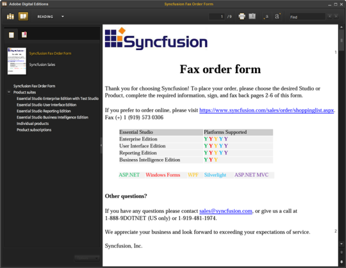
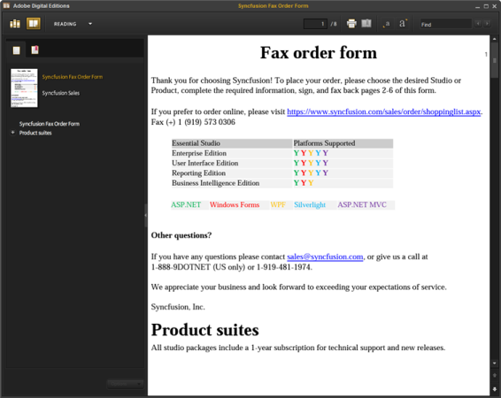

# Importing and Exporting

This section lets you to deal with the conversion process of one file format to another using Essential DocIO. The following are the possible conversions using Essential DocIO.

* Load and Save RTF document.
* Load and Save HTML document.
* Load and Save Text documents.
* Saving a Word document as PDF.
* Saving a Word document as EPub file.
* Saving a Word document as Image.

## Loading and Saving an RTF Document 

This section shows you how to load and save an RTFdocument using Essential DocIO. You can create new Word document or open an existing Word document and save to RTF format. 

The following code example illustrates how to open an RTF file.


//Opens the RTF file through WordDocument constructor.WordDocument doc = new WordDocument("Sample.rtf", FormatType.Rtf);


'Opens the RTF file through WordDocument constructor.Dim doc As New WordDocument("Sample.rtf", FormatType.Rtf)


The following code example lets you to save as RTF.


doc.Save("samplertf.rtf",FormatType.Rtf );


doc.Save("samplertf.rtf",FormatType.Rtf )


### Supported and Unsupported Elements

DocIO Supports the following document elements.

_Document Elements_

<table>
<tr>
<th>
Element</th><th>
Support in RTF Reader</th><th>
Support in RTF Writer</th><th>
Known Limitations</th></tr>
<tr>
<td>
Document Properties</td><td>
Yes</td><td>
No</td><td>
-</td></tr>
<tr>
<td>
Paragraph</td><td>
Yes</td><td>
Yes</td><td>
Revision tracking</td></tr>
<tr>
<td>
Table</td><td>
Yes</td><td>
Yes</td><td>
3D border for the tables is not supported</td></tr>
<tr>
<td>
Picture</td><td>
Yes</td><td>
Yes</td><td>
-</td></tr>
<tr>
<td>
Header / Footer</td><td>
Yes</td><td>
Yes</td><td>
-</td></tr>
<tr>
<td>
Field</td><td>
Yes</td><td>
Yes</td><td>
Fields supported in Doc and Docx format are supported</td></tr>
<tr>
<td>
TOC Field</td><td>
Yes</td><td>
Yes</td><td>
-</td></tr>
<tr>
<td>
Bookmark</td><td>
Yes</td><td>
Yes</td><td>
-</td></tr>
<tr>
<td>
Break</td><td>
Yes</td><td>
Yes</td><td>
-</td></tr>
<tr>
<td>
Section Property</td><td>
Yes</td><td>
Yes</td><td>
-</td></tr>
<tr>
<td>
Paragraph Format</td><td>
Yes</td><td>
Yes</td><td>
-</td></tr>
<tr>
<td>
Table Format</td><td>
Yes</td><td>
Yes</td><td>
-</td></tr>
<tr>
<td>
Character Format</td><td>
Yes</td><td>
Yes</td><td>
-</td></tr>
<tr>
<td>
Text Box</td><td>
No</td><td>
Yes</td><td>
-</td></tr>
<tr>
<td>
Form Fields</td><td>
Yes</td><td>
Yes</td><td>
-</td></tr>
<tr>
<td>
Document Background </td><td>
No</td><td>
Yes</td><td>
-</td></tr>
<tr>
<td>
Nested Table</td><td>
Yes</td><td>
Yes</td><td>
-</td></tr>
<tr>
<td>
Watermark</td><td>
No</td><td>
Yes</td><td>
-</td></tr>
<tr>
<td>
Footnote / Endnote</td><td>
No</td><td>
Yes</td><td>
-</td></tr>
<tr>
<td>
Lists</td><td>
Yes</td><td>
Yes</td><td>
Image bullets are not supported</td></tr>
<tr>
<td>
Hyperlink</td><td>
Yes</td><td>
Yes</td><td>
-</td></tr>
<tr>
<td>
Symbols</td><td>
No</td><td>
Yes</td><td>
-</td></tr>
<tr>
<td>
Shapes and Auto shapes</td><td>
No</td><td>
No</td><td>
-</td></tr>
<tr>
<td>
OLE Object</td><td>
No</td><td>
No</td><td>
-</td></tr>
<tr>
<td>
RTL</td><td>
No</td><td>
No</td><td>
-</td></tr>
</table>

## Loading and Saving a HTML Document

This section shows you how to Load and Save a HTML document by using Essential DocIO.

### Loading a HTML Document

This option enables to insert a whole HTML document with the following limitations:

* XHTML 1.0 Strict is preferred; XHTML 1.0 Transitional is also acceptable.
* There is an option to validate against either XHTML Strict or Transitional schema. By default the given HTML string is validated against XHTML 1.0 Transitional schema and an exception is thrown, when the HTML is found to be non-complaint. However, you can set this property on the document instance to either, validate against XHTML Transitional schema or Strict schema.
* When a block element is not supported, then its style is still parsed and applied to the supported child elements inside. 

The following references enable to validate the HTML string for XHTML compliance.

* [http://www.w3schools.com/tags/default.asp](http://www.w3schools.com/tags/default.asp)
* [http://validator.w3.org/check](http://validator.w3.org/check)

The following code example illustrates how to load a HTML file.


//Opens the HTML file through WordDocument constructor.WordDocument doc = new WordDocument("Sample.html", FormatType.Html);


'Opens the HTML file through WordDocument constructor.Dim doc As New WordDocument("Sample.html", FormatType.Html)


You can also use the Open method of WordDocument class to load a XHTML file into WordDocument class.


//Opens the HTML file through Open method.doc.Open("Sample.html", FormatType.Html, XHTMLValidationType.Strict);


'Opens the HTML file through Open method.doc.Open("Sample.html", FormatType.Html, XHTMLValidationType.Strict)


Here the Parameter XHTMLValidationType denotes the validation schema against the input XHTML document. Please refer to the XHTML Validaiton section to know more about the XHTML schema definition.

### Support for Partial Path of an Image

Currently Essential DocIO provides support for the partial path of an image only when directly loading the HTML file into the Word document using document.Open() method.

The following are the two overloaded methods:

* document.Open(string fileName, FormatType formatType, XHTMLValidationType validationType, string baseUrl)
* document.Open(Stream stream, FormatType formatType, XHTMLValidationType validationType, string baseUrl)

### Parameter Definition

* filename: Denotes the resultant file name.
* formatType: Denotes the file format type of resultant document.
* validationType: Denotes the XHTML validation type. It can be Strict, Transitional or None. You can use the type “None” when you don’t want to use any of the XHTML schema validation.
* baseURL: Denotes the location of the referred image.

The following code example illustrates loading the HTML file containing the partial path of an image. 


//Creates a new instance for a Word document.WordDocument document = new WordDocument();//Sets the base folder path.string basePath=@"C:\InputFolder\";//Opens the HTML file along with the base path of the HTML file.document.Open(Path .Combine (basePath ,"Input.html"), Syncfusion.DocIO.FormatType.Automatic, XHTMLValidationType.None, basePath);           


'Creates a new instance for a Word document.Dim document As New WordDocument()'Sets the base folder path.Dim basePath As String = "C:\InputFolder\"'Opens the HTML file along with the base path of the HTML file.document.Open(Path.Combine(basePath, "Input.html"), Syncfusion.DocIO.FormatType.Automatic, XHTMLValidationType.None, basePath)


### Inserting a HTML Formatted String

This section elaborates how to insert a valid HTML string into the body or paragraph of a WordDocument class instance.

The following code illustrates how to insert a HTML string into the body part of a section.


//Inserts XHTML String.section.Body.InsertXHTML(“<html><body>
Welcome
</body></html>”);


'Inserts XHTML String.section.Body.InsertXHTML(“<html><body>
Welcome
</body></html>”)


You can also insert the HTML string in the particular position of the document by specifying the index of the paragraph in the InsertXHTML overload of the TextBody class.


//Inserts XHTML with Paragraph index.section.Body.InsertXHTML(“<html><body>
Welcome
</body></html>”,1);


'Inserts XHTML with Paragraph index.section.Body.InsertXHTML(“<html><body>
Welcome
</body></html>”,1)


You can also insert the HTML string in the particular position of the document by specifying the index of the paragraph and paragraph item in the InsertXHTML overload of the TextBody class.


//Inserts XHTML with Paragraph and Paragraph item index.section.Body.InsertXHTML(“<html><body>
Welcome
</body></html>”,1,2);


'Inserts XHTML with Paragraph and Paragraph item index.section.Body.InsertXHTML(“<html><body>
Welcome
</body></html>”,1,2)


It is possible to insert XHTML formatted text inside a Paragraph with the following limitations:

* The content is placed inside a 
 tag, to validate against the XHTML schemas as explained before.
* This HTML example cannot contain any block elements like div, and so on, and results in an exception being thrown otherwise. The only exception to this case is a single 
 tag.
* Among the supported XHTML tags, only the inline tags are used for formatting text.

The following code example illustrates, appending a HTML formatted string into a paragraph.


//Adds a new paragraph to the section.IWParagraph paragraph = section.AddParagraph();//Appends XHTML in the Paragraph.paragraph.AppendXHTML(htmlstring);


'Adds a new paragraph to the section.Dim paragraph As IWParagraph = section.AddParagraph()'Appends XHTML in the Paragraph.paragraph.AppendXHTML(htmlstring)


N> Currently inserting XHTML formatted string in the Word document is not supported in Silverlight and Windows Phone 8 applications.

### XHTML Validation

You can validate the given XHTML string by invoking the IsValidXHTML method of TextBody class. It returns true when the given XHTML string should meet any one of the following validation types.

* Strict
* Transitional
* None

Each of these XHTML complaints target a different level of detail for XHTML. In other words, you can choose the kind of feature you want from the different features supported by DocIO.

The Strict DTD is the most efficient as it provides minimal XHTML language for creating web pages. So you might be thinking this is a very limited DTD and may not be of any use. Actually, as mentioned before, it is the most efficient DTD and enables a fastest validation of XHTML documents. The idea behind using a strict DTD is to use style sheets for display rather than presentation elements. Thus use of a strict DTD aims to separate presentation code from content.

The Transitional is the default validation type in DocIO when you do not define any XHTML Validation types. It adds more features than a Strict DTD to XHTML document. The support for more features increases the validation process when an XHTML document is displayed. Because a Transitional DTD provides support for presentation elements.

The None type provides the feature to manipulate the XHTML without using Strict and Transitional validation mechanism. You can use this type when you are not sure about XHTML contents.

The following table illustrates the basic comparison between the Transitional and Strict validation types.

_Validation Types_

<table>
<tr>
<th>
XHTML Type</th><th>
Description</th></tr>
<tr>
<td>
Strict</td><td>
The strict type validation does not support any HTML presentation elements (such as &lt;p&gt;, &lt;a&gt;, &lt;b&gt;, etc.). This is the low-featured XHTML validation type.</td></tr>
<tr>
<td>
Transitional</td><td>
The Transitional type DTD adds support for HTML presentation elements. That means you can use HTML elements (such as  &lt;p&gt;, &lt;a&gt;, &lt;b&gt;, etc.) directly inside of your XHTML document. </td></tr>
</table>

The following code illustrates how to validate a HTML string.


//Checks the valid XHTML.section.Body.IsValidXHTML(htmlString, XHTMLValidationType.Strict);


'Checks the valid XHTML.section.Body.IsValidXHTML(htmlString, XHTMLValidationType.Strict)


### Parameter Description

1. htmlString: The desired HTML string to be validated.
2. XHTMLValidationType: It defines the validation type. It could be Strict, Transitional, or None.

N> Currently XHTML Validation is not supported in Windows Store applications.

### Saving a HTML Document

The following code example shows how to save a HTML document.


 HTMLExport htmlExport = new HTMLExport();//Saves the document as HTML file in local storage.htmlExport.SaveAsXhtml(doc,  "doctohtml_res.html");


Dim htmlExport As New HTMLExport()'Saves the document as HTML file in local storage.htmlExport.SaveAsXhtml(doc, "doctohtml_res.html")


The following code shows how to save a HTML document in a stream.


MemoryStream stream = new MemoryStream();HTMLExport htmlExport = new HTMLExport();//Saves the document as HTML file in a stream.htmlExport.SaveAsXhtml(doc,stream);


Dim stream As New MemoryStream()Dim htmlExport As New HTMLExport()'Saves the document as HTML file in a stream.htmlExport.SaveAsXhtml(doc,stream)


You can also use the overload of Save method in WordDocument class to export the HTML document.


document.Save(fileName,FormatType.Html);


 document.Save(fileName,FormatType.Html)


The following code example saves the exported XHTML file into a stream.


document.Save(stream,FormatType.Html);


document.Save(stream,FormatType.Html)


### SaveOptions Class

It provides some more flexibility and some extra features when exporting the HTML documents. 

The following code example shows how to save the style sheet as internal style sheet and save the images as base 64 string using SaveOptions class. While using this there is no separate folder created to save images and all the contents are stored within the HTML file itself.


 WordDocument doc = new WordDocument(@"..\..\DocToHTML.doc");HTMLExport htmlExport = new HTMLExport();//Sets style sheet type as internal.doc.SaveOptions.HtmlExportCssStyleSheetType = CssStyleSheetType.Internal;//Specifies image folder. This will store the image as base 64 string.doc.SaveOptions.HtmlExportImagesFolder = "\\";     htmlExport.SaveAsXhtml(doc,  "doctohtml_res.html");


 Dim doc As New WordDocument("..\..\DocToHTML.doc")Dim htmlExport As New HTMLExport()'Sets style sheet type as internal.doc.SaveOptions.HtmlExportCssStyleSheetType = CssStyleSheetType.Internal'Specifies image folder. This will store image as base 64 string.doc.SaveOptions.HtmlExportImagesFolder = "\"htmlExport.SaveAsXhtml(doc, "doctohtml_res.html")


The following code example shows how to preserve the TextFormField’s text as normal text while exporting to HTML document. When you set the property HtmlExportTextInputFormFieldAsText to true then the content of the TextFormField is preserved as normal text. Otherwise it is preserved as editable TextFormField.


 document.SaveOptions.HtmlExportTextInputFormFieldAsText = true;


 document.SaveOptions.HtmlExportTextInputFormFieldAsText = True


You can turn off the Header and Footer contents in the exported HTML document by using the HtmlExportHeadersFooters property of SaveOptions class. The following code illustrates the same.


 document.SaveOptions.HtmlExportHeadersFooters = false;


 document.SaveOptions.HtmlExportHeadersFooters = False


Supported Document Elements

DocIO supports the following document elements.

_Document Elements_

<table>
<tr>
<th>
Document Element</th><th>
Attribute</th><th>
Support Status</th><th>
Notes</th></tr>
<tr>
<td>
Bookmark</td><td>
Id</td><td>
Yes</td><td>
-</td></tr>
<tr>
<td rowspan = "4">
Border</td><td>
Color</td><td>
Yes</td><td>
-</td></tr>
<tr>
<td>
Distance from text</td><td>
Yes</td><td>
-</td></tr>
<tr>
<td>
Line style</td><td>
Partial</td><td>
Some line styles are rendered as solid.</td></tr>
<tr>
<td>
Line width</td><td>
Yes</td><td>
-</td></tr>
<tr>
<td>
Document Properties</td><td>
</td><td>
Yes</td><td>
-</td></tr>
<tr>
<td>
Field</td><td>
</td><td>
Yes</td><td>
Current field result is output, but the result is not recalculated.</td></tr>
<tr>
<td>
Footnotes and Endnotes</td><td>
</td><td>
Yes</td><td>
-</td></tr>
<tr>
<td>
Form Field</td><td>
Text input</td><td>
Yes</td><td>
-</td></tr>
<tr>
<td>
Header / Footer</td><td>
Different per section</td><td>
Partial</td><td>
Only primary header is output at the beginning of a section.</td></tr>
<tr>
<td rowspan = "2">
Hyperlink</td><td>
External URL</td><td>
Yes</td><td>
-</td></tr>
<tr>
<td>
Local</td><td>
Yes</td><td>
-</td></tr>
<tr>
<td rowspan = "3">
Image</td><td>
</td><td>
</td><td>
</td></tr>
<tr>
<td>
Inline</td><td>
Yes</td><td>
-</td></tr>
<tr>
<td>
Scale</td><td>
Yes</td><td>
-</td></tr>
<tr>
<td rowspan = "5">
List</td><td>
Custom bullets</td><td>
Yes</td><td>
-</td></tr>
<tr>
<td>
Multi-level</td><td>
Yes</td><td>
-</td></tr>
<tr>
<td>
Numbered</td><td>
Yes</td><td>
-</td></tr>
<tr>
<td>
Restart numbering</td><td>
Yes</td><td>
-</td></tr>
<tr>
<td>
Standard bullets</td><td>
Yes</td><td>
-</td></tr>
<tr>
<td rowspan = "9">
Paragraph</td><td>
Alignment</td><td>
Yes</td><td>
</td></tr>
<tr>
<td>
Borders</td><td>
Yes</td><td>
See Borders, for more details.</td></tr>
<tr>
<td>
Keep together and Keep with next properities</td><td>
Yes</td><td>
-</td></tr>
<tr>
<td>
Paragraph Indents</td><td>
Yes</td><td>
-</td></tr>
<tr>
<td>
Line spacing</td><td>
Yes</td><td>
-</td></tr>
<tr>
<td>
Page break before</td><td>
Yes</td><td>
-</td></tr>
<tr>
<td>
Shading</td><td>
Yes</td><td>
See Shading, for more details.</td></tr>
<tr>
<td>
Spacing before and after</td><td>
Yes</td><td>
-</td></tr>
<tr>
<td>
Window control</td><td>
Yes</td><td>
Output as both windows and orphans.</td></tr>
<tr>
<td rowspan = "2">
Shading</td><td>
Background color</td><td>
Partial</td><td>
Solid background colors are supported.</td></tr>
<tr>
<td>
Foreground color</td><td>
Partial</td><td>
Solid foreground color is used when background color is auto.</td></tr>
<tr>
<td rowspan = "3">
Styles</td><td>
Paragraph styles</td><td>
Yes</td><td>
-</td></tr>
<tr>
<td>
Character styles</td><td>
Yes</td><td>
-</td></tr>
<tr>
<td>
List styles</td><td>
Yes</td><td>
-</td></tr>
<tr>
<td rowspan = "6">
Table</td><td>
Alignment</td><td>
Yes</td><td>
-</td></tr>
<tr>
<td>
Cell margins</td><td>
Yes</td><td>
-</td></tr>
<tr>
<td>
Column widths</td><td>
Yes</td><td>
-</td></tr>
<tr>
<td>
Indent from left</td><td>
Yes</td><td>
-</td></tr>
<tr>
<td>
Preferred width</td><td>
Yes</td><td>
-</td></tr>
<tr>
<td>
Spacing between cells</td><td>
Yes</td><td>
-</td></tr>
<tr>
<td rowspan = "6">
Table Cell</td><td>
Borders</td><td>
Partial</td><td>
See Borders, for more details.</td></tr>
<tr>
<td>
Cell margins</td><td>
Partial</td><td>
Only default table cell margins left and right are supported.</td></tr>
<tr>
<td>
Horizontal merge</td><td>
Yes</td><td>
-</td></tr>
<tr>
<td>
Shading</td><td>
Partial</td><td>
See Shading, for more details.</td></tr>
<tr>
<td>
Vertical alignment</td><td>
Yes</td><td>
-</td></tr>
<tr>
<td>
Vertical merge</td><td>
Yes</td><td>
-</td></tr>
<tr>
<td rowspan = "2">
Table Row</td><td>
Height</td><td>
Yes</td><td>
-</td></tr>
<tr>
<td>
Padding</td><td>
Yes</td><td>
-</td></tr>
<tr>
<td rowspan = "20">
Text</td><td>
All caps</td><td>
Yes</td><td>
-</td></tr>
<tr>
<td>
Bold</td><td>
Yes</td><td>
-</td></tr>
<tr>
<td>
Character spacing</td><td>
Yes</td><td>
-</td></tr>
<tr>
<td>
Color</td><td>
Yes</td><td>
-</td></tr>
<tr>
<td>
Emboss</td><td>
Partial</td><td>
Rendered as bold.</td></tr>
<tr>
<td>
Engrave</td><td>
Partial</td><td>
Rendered as bold.</td></tr>
<tr>
<td>
Font</td><td>
Yes</td><td>
-</td></tr>
<tr>
<td>
Hidden</td><td>
Yes</td><td>
-</td></tr>
<tr>
<td>
Highlighting</td><td>
Yes</td><td>
-</td></tr>
<tr>
<td>
Imprint</td><td>
Partial</td><td>
Rendered as bold.</td></tr>
<tr>
<td>
Italic</td><td>
Yes</td><td>
-</td></tr>
<tr>
<td>
Line breaks</td><td>
Yes</td><td>
-</td></tr>
<tr>
<td>
Outline</td><td>
Partial</td><td>
Rendered as bold.</td></tr>
<tr>
<td>
Page breaks</td><td>
Yes</td><td>
-</td></tr>
<tr>
<td>
Shading</td><td>
Partial</td><td>
See Shading, for more details.</td></tr>
<tr>
<td>
Small caps</td><td>
Yes</td><td>
-</td></tr>
<tr>
<td>
Special symbols</td><td>
Yes</td><td>
-</td></tr>
<tr>
<td>
Strike out</td><td>
Yes</td><td>
-</td></tr>
<tr>
<td>
Subscript / Superscript</td><td>
Yes</td><td>
-</td></tr>
<tr>
<td>
Underline</td><td>
Partial</td><td>
Underline types and colors are ignored.</td></tr>
</table>

N> Currently Doc to Html conversion and vice-versa is not supported in Silverlight and Windows Phone 8 applications.

## Loading and Saving a Text Document 

This section shows you how to Load and Save a Text document using Essential DocIO. You can create new Word document or open Word document and save to Text format. 

The following code example lets you to load a Text document.


WordDocument doc = new WordDocument(@"..\..\Document.txt");


Dim doc As New WordDocument("..\..\Document.txt")


The following code example lets you to save as Text file.


doc.Save( "sample.txt", FormatType.Txt );



doc.Save( "sample.txt", FormatType.Txt )


### Supported Document Elements

DocIO supports the following document elements.

_Document Elements_

<table>
<tr>
<th>
Element</th><th>
Support Status</th><th>
Note</th></tr>
<tr>
<td>
Paragraph</td><td>
Yes</td><td>
-</td></tr>
<tr>
<td>
Header/Footer</td><td>
Yes</td><td>
Preserved as normal paragraph</td></tr>
<tr>
<td>
Field</td><td>
Yes</td><td>
Preserved as normal Text</td></tr>
<tr>
<td>
Lists</td><td>
Yes</td><td>
</td></tr>
<tr>
<td>
Symbols</td><td>
Yes</td><td>
Limited support</td></tr>
</table>

## Saving a Word Document as PDF

Essential DocIO allows you to export the word document as PDF document. You can create a word document from scratch or load a template Word document then export the document to PDF using DocIO. 

Essential DocIO lets you to edit the Word document contents without using Microsoft Word and then export the document to PDF. The following steps are involved in the Word to PDF conversion process.

1. Create a Word document from scratch or load a Word document using WordDocument class.
2. Instantiate the DocToPDFConverter class.
3. Convert the Word document to PDF using the ConvertToPDF method of DocToPDFConverter class and assign that to the instance of PdfDocument class.
4. Use the Save method of PdfDocument class to save the PDF document.

Assembly Dependencies for this Conversion

* Syncfusion.DocToPDFConverter.Base.dll
* Syncfusion.DocIO.Base.dll
* Syncfusion.Pdf.Base.dll
* Syncfusion.Core.dll
* Syncfusion.Compression.Base.dll

> You need to have Essential PDF and Essential DocIO installed in your system. Since "Syncfusion.DocToPDFConverter.Base.dll" is conditionally shipped when both DocIO.Base and Pdf.Base is installed.

> Layouting the contents of a Word document as pages in Essential DocIO is not exactly the same as layouting of Microsoft Word. So, the total number of pages may vary slightly compared to that of the Microsoft Word.

> Currently, [Word to PDF](http://docs.syncfusion.com/windowsforms) _conversion is not supported in Silverlight, WinRT and Windows Phone applications.

The following code example lets you to convert a Word document to PDF.


WordDocument wordDoc = new WordDocument("sample.doc");DocToPDFConverter converter = new DocToPDFConverter();//Converts a Word document into a PDF document.PdfDocument pdfDoc = converter.ConvertToPDF(wordDoc);//Saves the PDF file.pdfDoc.Save("DoctoPDF.pdf");


Dim wordDoc As New WordDocument("sample.doc")Dim converter As New DocToPDFConverter()'Converts a Word document into a PDF document.Dim pdfDoc As PdfDocument = converter.ConvertToPDF(wordDoc)'Saves the PDF file.pdfDoc.Save("DoctoPDF.pdf")


### Supported and Unsupported Elements 

Word to PDF conversion feature provides support for the following elements.

_Supported and Unsupported Elements_

<table>
<tr>
<th>
Element</th><th>
Support Description</th><th>
Known limitations</th></tr>
<tr>
<td>
Paragraph and Character formatting</td><td>
* Paragraph and character fonts* Font styles (Bold, Italic, Underline, and Strike through)* Subscript and Superscript* Paragraph and text highlighting* Paragraph Indents and tabs* Line spacing* Left, right, center and justify alignments* Borders around paragraphs</td><td>
 Underline – Single underline style is only supported</td></tr>
<tr>
<td>
Multi-Column Texts </td><td>
The word documents containing multi-column text are supported</td><td>
Multi-Column text positions are not calculated dynamically. So there may be some content position differences that occur in the PDF document.</td></tr>
<tr>
<td>
Headers and Footers</td><td>
Full support</td><td>
</td></tr>
<tr>
<td>
Bulleted, Numbered and Multi-level lists</td><td>
The bulleted list, numbered and multi-level list are supported with proper indentation and alignments as represented in the word document</td><td>
In some case, the image bullets preserved in the  document may be replaced by the disc style bullet.</td></tr>
<tr>
<td>
Images </td><td>
The images present in the document are supported along with their corresponding position and size</td><td>
Currently cropped images are not supported </td></tr>
<tr>
<td>
Tables</td><td>
Both simple and nested tables are supported with proper preservation of text formatting and images present inside the table cell. Text directions are also supported</td><td>
Tables making use of patterns and 3D borders are not retained in the output document. AutoFit Contents and AutoFit Window properties of table are not supported</td></tr>
<tr>
<td>
Breaks (page, section, linebreak, etc)</td><td>
Supports all types of breaks</td><td>
Line break is rendered as ordinary break and textwrapping type is not supported.</td></tr>
<tr>
<td>
OLEObject</td><td>
Partially Supported</td><td>
When the OLEObject represents an Image,it is preserved. When instance represents another instance, then that is not converted to PDF document.</td></tr>
<tr>
<td>
Textbox</td><td>
Text box is preserved with it’s content</td><td>
</td></tr>
<tr>
<td>
Page Settings and background image</td><td>
The actual page settings are preserved in the generated PDF documents that includes page size, orientation, page borders and its background image if available.</td><td>
When the input document contains more than one watermark types, then first watermark is considered and that is applied for entire document.</td></tr>
<tr>
<td>
Document Properties</td><td>
The document properties present in the word documents are also preserved in the generated PDF Document.</td><td>
</td></tr>
<tr>
<td>
Table of Contents</td><td>
TOC field is updated with contents and with corresponding page numbers</td><td>
</td></tr>
<tr>
<td>
Bookmarks</td><td>
Bookmarks are preserved as it is in the input document</td><td>
</td></tr>
<tr>
<td>
Hyperlinks</td><td>
Hyperlinks are preserved in the generated PDF document</td><td>
</td></tr>
<tr>
<td>
Footnote and Endnote</td><td>
Footnote and Endnote are supported.</td><td>
Number formats in Roman, Text and Number are supported</td></tr>
<tr>
<td>
Auto shapes </td><td>
Supports the predefined auto shapes.</td><td>
Only Docx format documents are supported</td></tr>
<tr>
<td>
Table Style</td><td>
Table style is supported </td><td>
Only Docx format documents are supported</td></tr>
<tr>
<td>
Comments</td><td>
Not Supported</td><td>
</td></tr>
<tr>
<td>
Shapes</td><td>
Not Supported</td><td>
</td></tr>
<tr>
<td>
Dynamic Fields</td><td>
Not Supported</td><td>
</td></tr>
<tr>
<td>
Charts</td><td>
Not Supported</td><td>
</td></tr>
<tr>
<td>
Pagination</td><td>
</td><td>
Essential DocIO makes sensible decision while layouting the text, and its supported elements while generating the PDF documents. But however, there may not be guaranteed pagination with all the documents.</td></tr>
</table>

## Saving a Word Document as an EPub File

Essential DocIO supports conversion of Microsoft Word documents to EPub v2.0.1. DocIO supports conversion of elements such as Text and Paragraph formatting, Lists, Images, Hyperlinks, Tables and Footnotes to EPub format.

By default, Table of Contents (TOC) is enabled in the EPub document. It is generated based on the built-in heading styles or custom styles mentioned in the TOC field. 

N> You need to have an EPub reader installed in the machine to view the resultant EPub document.

The following platforms support the EPub conversion process:

* Windows Forms
* ASP.NET
* WPF
* ASP.NET MVC

The following code example illustrates how to convert a Word document to EPub file format.


//Loads any .doc or .docx file.WordDocument document = new WordDocument(filename);         //Saves the EPub file.document.Save("Sample.epub", FormatType.EPub);


'Loads any .doc or .docx file.Dim document As WordDocument = New WordDocument(filename)'Saves the EPub file.document.Save("Sample.epub", FormatType.EPub)


The following screenshot illustrates the resultant EPub document.

_Word document converted to EPub File Format_

### EmbeddingFont

Conversion of EPub by using default options does not embed font files. Hence, the targeted device uses its own default font for the texts in the document that may vary depending on the reader being used. To read the texts in the same font as used in the input word document, you should embed the font files into the generated EPub. This is achieved by turning on EPubExportFont property. By default, this property is set to false_,_ since this actually embeds the exact font file from the machine that may increase the size of the EPub document.

The following code example illustrates how to embed font file.


//Loads any .doc or .docx file.WordDocument document = new WordDocument(filename);          //Turns on embedding font files.document.SaveOptions.EPubExportFont = true;//Saves the EPub file.document.Save("Sample.epub", FormatType.EPub);


'Loads any .doc or .docx file.Dim document As WordDocument = New WordDocument(filename)'Turns on embedding font files.document.SaveOptions.EPubExportFont = True'Saves the EPub file.document.Save("Sample.epub", FormatType.EPub)


The following screenshot illustrates the resultant EPub document.

_Embedding fonts in an EPub File_

### Exporting Header and Footer

Header and Footer in the Word document are helpful in placing specific information that is displayed on every page. These headers and footers are exported to the EPub document in such a way that only the first section header appears at the top of the document and the first section footer appears at the end of the document. This is achieved by turning on HtmlExportHeadersFooters property. By default, this property is set to true and hence it always exports header and footer.

The following code example illustrates how to export header and footer.


//Loads any .doc or .docx file.WordDocument document = new WordDocument(filename);//Turns on exporting headers and footers.document.SaveOptions.HtmlExportHeadersFooters = true;//Saves the EPub file.document.Save("Sample.epub", FormatType.EPub);


'Loads any .doc or .docx file.Dim document As WordDocument = New WordDocument(filename)'Turns on exporting headers and footers.document.SaveOptions.HtmlExportHeadersFooters = True'Saves the EPub file.   document.Save("Sample.epub", FormatType.EPub)


The following is the screenshot of the resultant EPub document with the disabled header and footer contents.

_Exporting Header and Footer_

### Supported Elements

The following are the Supported Elements:

* Text and Paragraph Formatting
* Lists
* Tables
* Images
* Footnote
* Hyperlink
* Styles
* Table of Contents
* Document Properties

### Known Limitations

The following are the known limitations:

* Embedding font files can increase the size of the EPub document
* Embedding font files is not supported in medium trust

N> Currently Doc to EPub conversion is not supported in Silverlight application.

## Saving a Word Document as an Image

DocIO provides support to convert a Word document into an image of type Bitmap or EMF. It enables to easily convert a single specified page, group of pages or a whole document into image format. 

The following overloads of the RenderAsImages method can be used to convert a Word document into an image.

* WordDocument.RenderAsImages(imageType): This is used to convert the whole document into an image.
* WordDocument.RenderAsImages(pageIndex, imageFormat): This is used to render/convert a particular page of the document into an image; it returns the resultant image of type Stream.
* WordDocument.RenderAsImages(pageIndex, imageType): This is used to render/convert a particular page of the document into an image; it returns the resultant image of type Image.
* WordDocument.RenderAsImages(pageIndex, noOfPages, imageType): This is used to render/convert multiple number of pages in the document, starting from the specified page index. It returns the resultant image of type Image[] array.

N> * Parameter "pageIndex" is a zero based index. * Layouting the contents of a Word document as pages in the Essential DocIO is not exactly the same as the layouting in Microsoft Word. So, the total number of pages may vary slightly compared to that of the Microsoft Word. * Currently, Word to Image conversion is not supported in Silverlight, WinRT and Windows Phone applications.* You can refer to the [Word to PDF](http://docs.syncfusion.com/windowsforms) Conversion for supported and unsupported elements in Word to Image conversion.

The following code example lets you to render a Word document as image.


Image[] images = document.RenderAsImages(ImageType.Metafile);Stream stream = document.RenderAsImages(0, ImageFormat.Emf);Image image = document.RenderAsImages(5, ImageType.Metafile);//This converts pages 2, 3, 4 in the document into images.Image[] images = document.RenderAsImages(1, 3, ImageType.Metafile);


Dim images() As Image = document.RenderAsImages(ImageType.Metafile)Dim stream As Stream = document.RenderAsImages(0, ImageFormat.Emf)Dim image As Image = document.RenderAsImages(5, ImageType.Metafile)'This converts pages 2, 3, 4 in the document into images.Dim images() As Image = document.RenderAsImages(1, 3, ImageType.Metafile)


