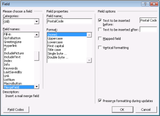

# Mail Merge

The ExecuteMailMerge method allows you to fill a template document with data from the data source. It is represented by the MailMerge class. The various types of data sources are used in Mail Merge such as String Arrays, DataTable, DataReader, or DataView class objects. You can create the template of a document by using the MergeFields of Microsoft Word.

The following steps illustrate how to perform Mail Merge:

1. On the Insert menu, point to the Fields, and then click MergeField.

   

2. Enter the merge field name, and the text to be inserted before and after the field. Note that the merge field name should match the field name of the data source.

   

   {:.prettyprint}

Mail Merge operations are performed by the Execute or ExecuteGroup method. There are several overloads of these methods for different data sources.

## Execute

* void Execute(string[ ] fieldNames, string[ ] fieldValues): Performs replacements of every merge field in the document in which field name matches one of the values from fieldNames string array with the corresponding value from fieldValues string array.
* void Execute (DataTable table): Performs replacements of merge fields in which field names match the table column names with the corresponding values of table cell. These replacements are performed for every row contained in the table.
* void Execute(DataRow row): Works similarly with DataTable parameter for the only row.
* void Execute(DataView dataView): Works similarly with DataTable parameter.
* void Execute(IDataReader dataReader): Works similarly with DataTable parameter.
* void Execute(OleDbDataReader dataReader): Works similarly with IDataRader parameter.
* void Execute(IEnumerable dataSource): Performs replacement of merge fields, in which field names match the enumerable instance names in DataSource.

Public Methods

_Public Methods_

<table>
<tr>
<th>
Method Name</th><th>
Description</th></tr>
<tr>
<td>
Execute</td><td>
Executes mail merge.</td></tr>
<tr>
<td>
ExecuteGroup</td><td>
Executes mail merge for a group (region). </td></tr>
<tr>
<td>
GetMergeFieldNames</td><td>
Gets a collection of mergefield names found in the document. </td></tr>
<tr>
<td>
ExecuteNestedGroup</td><td>
Executes nested mail merge for a group(Region or tables).</td></tr>
</table>

## Mail Merge

The following code example illustrates how to create a new Word document to perform a simple mail merge.



//Opens a Word document.

WordDocument wordDoc = new WordDocument();

//Adds one section and one paragraph to the document.

wordDoc.EnsureMinimal();

//Appends text to a paragraph.

wordDoc.LastParagraph.AppendText("Emp_Id : ");

//Appends Merge fields to a paragraph.

wordDoc.LastParagraph.AppendField("Emp_Id", FieldType.FieldMergeField);

wordDoc.LastParagraph.AppendText("\nName :");

wordDoc.LastParagraph.AppendField("Name", FieldType.FieldMergeField);

wordDoc.LastParagraph.AppendText("\nPhone :");

wordDoc.LastParagraph.AppendField("Phone", FieldType.FieldMergeField);

wordDoc.LastParagraph.AppendText("\nCity :");

wordDoc.LastParagraph.AppendField("City", FieldType.FieldMergeField);

string[] fieldNames = new string[] { "Emp_Id", "Name", "Phone", "City"};

string[] fieldValues = new string[] { "101","Alkin","+122-2000466","Houston" };

//Performs MailMerge.

wordDoc.MailMerge.Execute(fieldNames,fieldValues);

//Saves a document.

wordDoc.Save(“Sample.docx”);




'Opens a Word document.

Dim wordDoc As New WordDocument()

'Adds one section and one paragraph to the document.

wordDoc.EnsureMinimal()

'Appends text to a paragraph.

wordDoc.LastParagraph.AppendText("Emp_Id : ")

'Appends Merge fields to a paragraph.

wordDoc.LastParagraph.AppendField("Emp_Id", FieldType.FieldMergeField)

wordDoc.LastParagraph.AppendText("\nName :")

wordDoc.LastParagraph.AppendField("Name", FieldType.FieldMergeField)

wordDoc.LastParagraph.AppendText("\nPhone :")

wordDoc.LastParagraph.AppendField("Phone", FieldType.FieldMergeField)

wordDoc.LastParagraph.AppendText("\nCity :")

wordDoc.LastParagraph.AppendField("City", FieldType.FieldMergeField)

Dim fieldNames As String() = New String() From {"Emp_Id","Name","Phone","City"}

Dim fieldValues As String() = New String() From {"101","Alkin","+122-2000466","Houston"}

'Performs MailMerge.

wordDoc.MailMerge.Execute(fieldNames, fieldValues)

'Saves a document.

wordDoc.Save("Sample.docx")


## Mail Merge for a Group

Mail Merge operations have been performed between regions by invoking the ExecuteGroup method.

* void ExecuteGroup(DataTable table): Performs replacements of merge fields, in which field names match the table column names with the corresponding values of table cell.

These replacements are performed for every row contained in the table of the specified region. The region where the mail merge operations are to be performed must be marked by two MergeFields with the following names:

* TableStart:TableName: For the entry point of the region.
* TableEnd:TableName: For the end point of the region.

You have to insert three MergeFields in the document with the following field names:

* TableStart:Geography: Marks the beginning of mail merge region.
* FieldNames: Will be replaced by values from the table.
* TableEnd:Geography: Marks the end of mail merge region.
* void ExecuteGroup(DataView dataView): Works similarly with DataTable parameter.
* void ExecuteGroup(IDataReader dataReader): Works similarly with DataTable parameter.

The following code example illustrates how to perform mail merge for a group.



//Gets the DataTable.

DataTable table = new DataTable();

string connectionstring = "Data Source = " + dataPath + "..\\NorthwindIO_3.5.sdf";

SqlCeConnection conn = new SqlCeConnection(connectionstring);

conn.Open();

SqlCeDataAdapter adapter = new SqlCeDataAdapter("Select TOP(5) * from EmployeesReport", conn);

adapter.Fill(table);

adapter.Dispose();

conn.Close();

//Creates a new document.

WordDocument document = new WordDocument();

//Loads template.

document.Open(Path.Combine(dataPath, "EmployeesReportDemo.doc"), FormatType.Doc);

//Sets table name as Employees for template mergefield reference.

table.TableName = "Employees";

//Executes Mail Merge with groups. 

document.MailMerge.ExecuteGroup(table);

//Saves a document to disk.

document.Save("Sample.doc", FormatType.Doc);




'Gets the DataTable.

Dim table As New DataTable()

Dim connectionstring As String = "Data Source = " + dataPath + "..\NorthwindIO_3.5.sdf"

Dim conn As New SqlCeConnection(connectionstring)

conn.Open()

Dim adapter As New SqlCeDataAdapter("Select TOP(5) * from EmployeesReport", conn)

adapter.Fill(table)

adapter.Dispose()

conn.Close()

'Creates a new document.

Dim document As New WordDocument()

'Loads template.

document.Open(Path.Combine(dataPath, "EmployeesReportDemo.doc"), FormatType.Doc)

'Sets table name as Employees for template mergefield reference.

table.TableName = "Employees"

'Executes Mail Merge with groups. 

document.MailMerge.ExecuteGroup(table)

'Saves a document to disk.

document.Save("Sample.doc", FormatType.Doc)


## Nested Mail Merge 

By using the WordDocument.MailMerge.ExecuteNestedGroup method, you can perform nested mail merge. Each item of "command" Arraylist must contain one or more DictionaryEntry objects. Each DictionaryEntry instance must contain the Table Name (DataTable name) and String Command with command, which must be applied to the table. You can use the following expression for getting the current value of specified column in a table: %TableName.ColumnName%.

The following code example illustrates how a nested mail merge for a region or table is implemented by using DocIO. 



//Gets Data from the Database.

OleDbConnection conn = new

OleDbConnection("Provider=Microsoft.Jet.OLEDB.4.0;Data Source=" + dataBase);

conn.Open();

//Arraylist contains the list of commands.

ArrayList commands = new ArrayList();

//DictionaryEntry contains "Source table" (KEY) and "Command" (VALUE). 

DictionaryEntry entry = new DictionaryEntry("Employees", "Select TOP 10 * from Employees");

commands.Add(entry);

//Retrieves customer details.

entry = new DictionaryEntry("Customers", "SELECT DISTINCT TOP 10 * FROM  ((Orders INNER JOIN Employees ON Orders.EmployeeID = Employees.EmployeeID) INNER JOIN Customers ON Orders.CustomerID = Customers.CustomerID) WHERE Employees.EmployeeID = %Employees.EmployeeID%");

commands.Add(entry);

//Retrieves order details.

entry = new DictionaryEntry("Orders", "SELECT DISTINCT TOP 10 * FROM Orders WHERE Orders.CustomerID = '%Customers.CustomerID%’AND Orders.EmployeeID = %Employees.EmployeeID%");

commands.Add(entry);

//Executes Mail merge.

doc.MailMerge.ExecuteNestedGroup(conn, commands);





'Gets Data from the Database.

Dim conn As New OleDbConnection("Provider=Microsoft.Jet.OLEDB.4.0;Data Source=" + dataBase)

conn.Open()

'Arraylist contains the list of commands.

Dim commands As New ArrayList()

'DictionaryEntry contains "Source table" (KEY) and "Command" (VALUE).

Dim entry As New DictionaryEntry("Employees", "Select TOP 10 * from Employees")

commands.Add(entry)

'Gets customer details.

entry = New DictionaryEntry("Customers", "SELECT DISTINCT TOP 10 * FROM ((Orders INNER JOIN Employees ON Orders.EmployeeID = Employees.EmployeeID) INNER JOIN Customers ON Orders.CustomerID = Customers.CustomerID) WHERE Employees.EmployeeID = %Employees.EmployeeID%")

commands.Add(entry)

'Gets order details.

entry = New DictionaryEntry("Orders", "SELECT DISTINCT TOP 10 * FROM Orders WHERE Orders.CustomerID = '%Customers.CustomerID%’AND Orders.EmployeeID = %Employees.EmployeeID%")

commands.Add(entry)

'Executes Mail merge.

doc.MailMerge.ExecuteNestedGroup(conn, commands)



### Merge outer group fields placed within inner nested group

You can merge outer group fields placed within inner nested group using Nested Mail Merge functionality of Essential DocIO. Also it is possible to merge data from outer group implicitly based on nested hierarchy or explicitly from a specified outer group. The mail merge fields in the Word document template should be in the following format:

1. Implicit group:

<<FieldName>>

<<Image:FieldName >>

2. Explicit group:

<<TableName:FieldName>>

<< Image:TableName:FieldName >>

Nested Mail Merge with relational Objects

By using the overload WordDocument.MailMerge.ExecuteNestedGroup (MailMergeDataTable dataTable) method, you can perform nested mail merge with implicit relational data objects without any explicit relational commands. Please refer to the following example for relational business objects.

For example:

1. class EmployeeDetails

{

string employeeName;

string employeeID;

List<CustomerDetails> customers;

}

class CustomerDetails

{

string customerName;

string customerID;

}

2.  class EmployeeDetails

{

string employeeName;

string employeeID;

CustomerDetails customer;

}

class CustomerDetails

{

string customerName;

string customerID;

}

In the above example, the customers property in EmployeeDetails has customers related to the particular employee. It does not require any common property employeeID in EmployeeDetails and CustomerDetails. Also it does not require relational commands to relate the EmployeeDetails and CustomerDetails.

> Note:

> Nested mail merge for a region works when the group start and end is BeginGroup and EndGroup respectively.

> Nested mail merge for a table works when the group start and end is TableStart and TableEnd respectively.

> The commands list to retrieve the DataTable from the data source must be in the same order of Group which is preserved in the input WordDocument.

Public Methods

_Public Methods_

<table>
<tr>
<th>
Method Name</th><th>
Description</th></tr>
<tr>
<td>
ExecuteNestedGroup(DataSet dataSet, ArrayList commands)</td><td>
Runs nested mail merge within a Group for the specified data from the Data Set.</td></tr>
<tr>
<td>
ExecuteNestedGroup(DbConnection conn, ArrayList commands)</td><td>
Runs nested mail merge within a Group for the specified data from the Database.</td></tr>
<tr>
<td>
ExecuteNestedGroup(DbConnection conn, ArrayList commands, bool isSqlConnection)</td><td>
Runs nested mail merge within a Group for the specified data from the Database. If it is an SQL connection, then set to True.</td></tr>
<tr>
<td>
ExecuteNestedGroup(MailMergeDataSet dataSource, List&lt;Dictionaryentry&gt; commands)</td><td>
Runs nested mail merge within a Group for the specified data from the MailMergeDataSet.</td></tr>
<tr>
<td>
ExecuteNestedGroup(MailMergeDataTable dataTable)</td><td>
Runs nested mail merge within a Group for the specified data from the MailMergeDataTable.</td></tr>
</table>

The following code example illustrates how to implement a nested mail merge for a region or table by using a Data Set. 



public void  CreateDocument()

{

WordDocument doc = new WordDocument();

doc.Open( dataPath + "NestedMailMerge1.doc" );

//Gets Data from the Database.

DataTable table1 = GetNestedDataTable( "select * from Table1" );

table1.TableName = "Table1";

DataTable table2 = GetNestedDataTable( "select * from Table2" );

table2.TableName = "Table2";

DataTable table3 = GetNestedDataTable( "select * from Table3" );

table3.TableName = "Table3";

DataSet dataSet = new DataSet( "Test dataset" );

dataSet.Tables.Add( table1 );

dataSet.Tables.Add( table2 );

dataSet.Tables.Add( table3 );

//Arraylist contains the list of commands.

ArrayList commands = new ArrayList();

DictionaryEntry entry = new DictionaryEntry( "Table1", string.Empty );

commands.Add( entry );

entry = new DictionaryEntry("table2", "sellerid = %table1.sellerid%");

commands.Add( entry );

	entry = new DictionaryEntry("Table3", "CustomerID = 

      %Table2.CustomerID%");

commands.Add( entry );

doc.MailMerge.RemoveEmptyParagraphs = true;

//Executes NestedGroup by passing the DataSet.

doc.MailMerge.ExecuteNestedGroup(dataSet, commands );

doc.Save( "NestedMailMerge.doc" );

System.Diagnostics.Process.Start( "NestedMailMerge.doc" );

}

///

///Gets the table

///

///<param name="sqlQuery"></param>

///<returns></returns>

private DataTable GetNestedDataTable( string sqlQuery )

{

OleDbConnection conn = null;

try

{

	        string connString = "Provider=Microsoft.Jet.OLEDB.4.0;Data 

              Source=" + System.IO.Path.Combine( dataPath, 

              @"NestedMailMerge1.mdb" );

//Gets data from the database.

conn = new OleDbConnection( connString );

conn.Open();

OleDbCommand cmd = new OleDbCommand( sqlQuery, conn );

OleDbDataAdapter da = new OleDbDataAdapter( cmd );

DataTable table = new DataTable();

da.Fill( table );

return table;

}

finally

{

if( conn != null )

conn.Close();

}

}

}





Public Sub CreateDocument()

Dim doc As WordDocument = New WordDocument()

doc.Open(dataPath + "NestedMailMerge1.doc")

'Gets Data from the Database.

Dim table1 As DataTable = GetNestedDataTable("select * from Table1")

table1.TableName = "Table1"

Dim table2 As DataTable = GetNestedDataTable("select * from Table2")

table2.TableName = "Table2"

Dim table3 As DataTable = GetNestedDataTable("select * from Table3")

table3.TableName = "Table3"

Dim dataSet As DataSet = New DataSet("Test dataset")

dataSet.Tables.Add(table1)

dataSet.Tables.Add(table2)

dataSet.Tables.Add(table3)

‘Arraylist contains the list of commands.

Dim commands As ArrayList = New ArrayList()

Dim enTry As DictionaryEntry = New DictionaryEntry("Table1", String.Empty)

commands.Add(enTry)

enTry = New dictionaryenTry("table2", "sellerid = Decimal.Remainder( , table1.sellerid)%")

commands.Add(enTry)

enTry = New DictionaryEnTry("Table3", "CustomerID = Decimal.Remainder( , Table2.CustomerID)%")

commands.Add(enTry)

doc.MailMerge.RemoveEmptyParagraphs = True

'Executes NestedGroup by passing the DataSet.

doc.MailMerge.ExecuteNestedGroup(dataSet, commands)

doc.Save("NestedMailMerge.doc")

System.Diagnostics.Process.Start("NestedMailMerge.doc")

End Sub

'/ 

'/ Get the table

'/ 

'/ <param name="sqlQuery"></param>

'/ <returns></returns>

Private Function GetNestedDataTable(ByVal sqlQuery As String) As DataTable

Dim conn As OleDbConnection = Nothing

Try

Dim connString As String = "Provider=Microsoft.Jet.OLEDB.4.0;Data Source=" + System.IO.Path.Combine(dataPath, "NestedMailMerge1.mdb")

'Gets data from the database.

conn = New OleDbConnection(connString)

conn.Open()

Dim cmd As OleDbCommand = New OleDbCommand(sqlQuery, conn)

Dim da As OleDbDataAdapter = New OleDbDataAdapter(cmd)

Dim table As DataTable = New DataTable()

da.Fill(table)

Return table

Finally

If Not conn Is Nothing Then

conn.Close()

End If

End Try

End Function


## Mail Merge with Business Objects

The following code example illustrates how to perform mail merge with business objects.



XDocument customerXml;

XElement element;

List<Customer> Customers = new List<Customer>();

Customer customerDetails;

private void InitializeCustomer()

{

Customers.Clear();

Uri uri = new Uri("Resources/Templates/Customers.xml", UriKind.Relative);

Stream stream = ResourceManager.Load(uri);

customerXml = XDocument.Load(stream);

element = customerXml.Descendants("Customers").First();

var pc = from p in customerXml.Descendants("Customer")

select p;

string CustomerID = string.Empty;

string CompanyName = string.Empty;

string ContactName = string.Empty;

string ContactTitle = string.Empty;

string Address = string.Empty;

string City = string.Empty;

string PostalCode = string.Empty;

string Country = string.Empty;

string Phone = string.Empty;

string Fax = string.Empty;

string Region = string.Empty;

foreach (var dt in pc)

{

foreach (XElement el in dt.Descendants())

{

string value = dt.Element(el.Name).Value;

string elementName = el.Name.ToString();

switch (elementName)

{

case "CustomerID":

CustomerID = value;

break;

case "CompanyName":

CompanyName = value;

break;

case "ContactName":

ContactName = value;

break;

case "ContactTitle":

ContactTitle = value;

break;

case "Address":

Address = value;

break;

case "City":

City = value;

break;

case "PostalCode":

PostalCode = value;

break;

case "Country":

Country = value;

break;

case "Phone":

Phone = value;

break;

case "Fax":

Fax = value;

break;

}

}

customerDetails = new Customer(CustomerID, CompanyName, ContactName, ContactTitle, Address, City, PostalCode, Country, Phone, Fax);

Customers.Add(customerDetails);

}

comboBox1.Items.Clear();

foreach (Customer customer in Customers)

{

comboBox1.Items.Add(customer.CustomerID);

}

comboBox1.SelectedIndex = 1;

}

private void buttonSample_Click(object sender, RoutedEventArgs e)

{

WordDocument document;

if (rdButtonWord97To2003.IsChecked == true)

{

Uri uri = new Uri("Resources/Templates/Letter Formatting.doc", UriKind.Relative);

Stream stream = ResourceManager.Load(uri);

document = new WordDocument(stream, FormatType.Doc);

stream.Close();

}

else

{

Uri uri = new Uri("Resources/Templates/Letter Formatting.docx", UriKind.Relative);

Stream stream = ResourceManager.Load(uri);

document = new WordDocument(stream, FormatType.Docx);

stream.Close();

}

foreach (Customer customer in Customers)

{

if (customer.CustomerID == comboBox1.SelectedItem.ToString())

customerDetails = new Customer(customer.CustomerID, customer.CompanyName, customer.ContactName, customer.ContactTitle, customer.Address, customer.City, customer.PostalCode, customer.Country, customer.Phone, customer.Fax);//comboBox1.Items.Add(customer.CustomerID);

}

List<Customer> Customer = new List<Customer>();

Customer.Add(customerDetails);

document.MailMerge.Execute(Customer);

//Adds Text Watermark.

document.Watermark = new TextWatermark();

(document.Watermark as TextWatermark).Text = "Demo";

(document.Watermark as TextWatermark).Size = 144;

//Saves as .doc Word97-2003 format.

if (rdButtonWord97To2003.IsChecked == true)

document.SaveAsDoc();

//Saves as .docx Word2007 format.

else if (rdButtonWord2007.IsChecked == true)

document.SaveAsDocx(rdButtonWord2007.Name);

//Saves as .docx Word2010 format.

else if (rdButtonWord2010.IsChecked == true)

document.SaveAsDocx(rdButtonWord2010.Name);

//Saves as .docx Word2013 format.

else if (rdButtonWord2013.IsChecked == true)

document.SaveAsDocx(rdButtonWord2013.Name);

}

}

public class Customers : IEnumerable

{

//When the foreach loop begins, this method is invoked 

//so that the loop gets an enumerator to query.

public IEnumerator GetEnumerator()

{

return new CustomerEnumerator();

}

}

public class CustomerEnumerator : IEnumerator

{

private XmlReader reader;

private bool prevTagWasElement = false;

private string ElementName = string.Empty;

public void Reset()

{

if (this.reader != null)

this.reader.Close();

Uri uri = new Uri("Resources/Templates/Customers.xml", UriKind.Relative);

Stream stream = ResourceManager.Load(uri);

this.reader = XmlReader.Create(stream, new XmlReaderSettings());

//stream.Close();

}

public bool MoveNext()

{

//Call Reset the first time MoveNext is called 

//instead of in the constructor 

//so that we keep the stream open only as long as needed.

if (this.reader == null)

this.Reset();

if (this.FindNextTextElement())

return true;

//If there are no more text elements in the XML file then

//we have read in all of the data 

//and the foreach loop should end.

this.reader.Close();

return false;

}

public object Current

{

get

{

//No need to call FindNextTextElement here

//because it was called for us by MoveNext().

string CustomerID = string.Empty;

string CompanyName = string.Empty;

string ContactName = string.Empty;

string ContactTitle = string.Empty;

string Address = string.Empty;

string City = string.Empty;

string PostalCode = string.Empty;

string Country = string.Empty;

string Phone = string.Empty;

string Fax = string.Empty;

ElementName = "CustomerID";

do

{

switch (ElementName)

{

case "CustomerID":

CustomerID = this.reader.Value;

break;

case "CompanyName":

CompanyName = this.reader.Value;

break;

case "ContactName":

ContactName = this.reader.Value;

break;

case "ContactTitle":

ContactTitle = this.reader.Value;

break;

case "Address":

Address = this.reader.Value;

break;

case "City":

City = this.reader.Value;

break;

case "PostalCode":

PostalCode = this.reader.Value;

break;

case "Country":

Country = this.reader.Value;

break;

case "Phone":

Phone = this.reader.Value;

break;

case "Fax":

Fax = this.reader.Value;

break;

}

}

while (this.FindNextTextElement());

return new Customer(CustomerID, CompanyName, ContactName, ContactTitle, Address, City, PostalCode, Country, Phone, Fax);

}

}

private bool FindNextTextElement()

{

bool readOn = this.reader.Read();

prevTagWasElement = false;

ElementName = string.Empty;

while (readOn && this.reader.NodeType != XmlNodeType.Text)

{

//If the current element is empty, stop reading and return false.

if (prevTagWasElement && this.reader.NodeType == XmlNodeType.EndElement)

readOn = false;

prevTagWasElement = this.reader.NodeType == XmlNodeType.Element;

ElementName = (this.reader.NodeType == XmlNodeType.Element) ? this.reader.LocalName : string.Empty;

readOn = readOn && this.reader.Read();

if (this.reader.LocalName == "Customer" && this.reader.NodeType == XmlNodeType.EndElement)

return false;

}

return readOn;

}

}

public class Customer

{

#region fields

private string m_customerID;

private string m_companyName;

private string m_contactName;

private string m_contactTitle;

private string m_address;

private string m_city;

private string m_postalCode;

private string m_country;

private string m_phone;

private string m_fax;

#endregion fields

#region Properties

public string CustomerID

{

get { return m_customerID; }

set { m_customerID = value; }

}

public string CompanyName

{

get { return m_companyName; }

set { m_companyName = value; }

}

public string ContactName

{

get { return m_contactName; }

set { m_contactName = value; }

}

public string ContactTitle

{

get { return m_contactTitle; }

set { m_contactTitle = value; }

}

public string Address

{

get { return m_address; }

set { m_address = value; }

}

public string City

{

get { return m_city; }

set { m_city = value; }

}

public string PostalCode

{

get { return m_postalCode; }

set { m_postalCode = value; }

}

public string Country

{

get { return m_country; }

set { m_country = value; }

}

public string Phone

{

get { return m_phone; }

set { m_phone = value; }

}

public string Fax

{

get { return m_fax; }

set { m_fax = value; }

}

#endregion Properties

#region Constructors

public Customer(string CustomerID, string CompanyName, string ContactName,

string ContactTitle, string Address, string City,

string PostalCode, string Country, string Phone, string Fax)

{

this.CustomerID = CustomerID;

this.CompanyName = CompanyName;

this.ContactName = ContactName;

this.ContactTitle = ContactTitle;

this.Address = Address;

this.City = City;

this.PostalCode = PostalCode;

this.Country = Country;

this.Phone = Phone;

this.Fax = Fax;

}

}





Private customerXml As XDocument

Private element As XElement

Private Customers As New List(Of Customer)()

Private customerDetails As Customer

Private Sub InitializeCustomer()

Customers.Clear()

Dim uri As New Uri("Resources/Templates/Customers.xml", UriKind.Relative)

Dim stream As Stream = ResourceManager.Load(uri)

customerXml = XDocument.Load(stream)

element = customerXml.Descendants("Customers").First()

Dim pc = From p In customerXml.Descendants("Customer")

Dim CustomerID As String = String.Empty

Dim CompanyName As String = String.Empty

Dim ContactName As String = String.Empty

Dim ContactTitle As String = String.Empty

Dim Address As String = String.Empty

Dim City As String = String.Empty

Dim PostalCode As String = String.Empty

Dim Country As String = String.Empty

Dim Phone As String = String.Empty

Dim Fax As String = String.Empty

Dim Region As String = String.Empty

For Each dt As var In pc

For Each el As XElement In dt.Descendants()

Dim value As String = dt.Element(el.Name).Value

Dim elementName As String = el.Name.ToString()

Select Case elementName

Case "CustomerID"

CustomerID = value

Exit Select

Case "CompanyName"

CompanyName = value

Exit Select

Case "ContactName"

ContactName = value

Exit Select

Case "ContactTitle"

ContactTitle = value

Exit Select

Case "Address"

Address = value

Exit Select

Case "City"

City = value

Exit Select

Case "PostalCode"

PostalCode = value

Exit Select

Case "Country"

Country = value

Exit Select

Case "Phone"

Phone = value

Exit Select

Case "Fax"

Fax = value

Exit Select

End Select

Next

customerDetails = New Customer(CustomerID, CompanyName, ContactName, ContactTitle, Address, City,PostalCode, Country, Phone, Fax)

Customers.Add(customerDetails)

Next

comboBox1.Items.Clear()

For Each customer As Customer In Customers

comboBox1.Items.Add(customer.CustomerID)

Next

comboBox1.SelectedIndex = 1

End Sub

Private Sub buttonSample_Click(sender As Object, e As RoutedEventArgs)

Dim document As WordDocument

If rdButtonWord97To2003.IsChecked = True Then

Dim uri As New Uri("Resources/Templates/Letter Formatting.doc", UriKind.Relative)

Dim stream As Stream = ResourceManager.Load(uri)

document = New WordDocument(stream, FormatType.Doc)

stream.Close()

Else

Dim uri As New Uri("Resources/Templates/Letter Formatting.docx", UriKind.Relative)

Dim stream As Stream = ResourceManager.Load(uri)

document = New WordDocument(stream, FormatType.Docx)

stream.Close()

End If

For Each customer__1 As Customer In Customers

If customer__1.CustomerID = comboBox1.SelectedItem.ToString() Then

customerDetails = New Customer(customer__1.CustomerID, customer__1.CompanyName, customer__1.ContactName, customer__1.ContactTitle, customer__1.Address, customer__1.City,   customer__1.PostalCode, customer__1.Country, customer__1.Phone, customer__1.Fax)

'comboBox1.Items.Add(customer.CustomerID);

End If

Next

Dim Customer__2 As New List(Of Customer)()

Customer__2.Add(customerDetails)

document.MailMerge.Execute(Customer__2)

'Adds Text Watermark.

document.Watermark = New TextWatermark()

TryCast(document.Watermark, TextWatermark).Text = "Demo"

TryCast(document.Watermark, TextWatermark).Size = 144

'Saves as .doc Word97-2003 format.

If rdButtonWord97To2003.IsChecked = True Then

document.SaveAsDoc()

'Saves as .docx Word2007 format.

ElseIf rdButtonWord2007.IsChecked = True Then

document.SaveAsDocx(rdButtonWord2007.Name)

'Saves as .docx Word2010 format.

ElseIf rdButtonWord2010.IsChecked = True Then

document.SaveAsDocx(rdButtonWord2010.Name)

'Saves as .docx Word2013 format.

ElseIf rdButtonWord2013.IsChecked = True Then

document.SaveAsDocx(rdButtonWord2013.Name)

End If

End Sub

Public Class Customers

Implements IEnumerable

'When the foreach loop begins, this method is invoked 

'so that the loop gets an enumerator to query.

Public Function GetEnumerator() As IEnumerator

Return New CustomerEnumerator()

End Function

End Class

Public Class CustomerEnumerator

Implements IEnumerator

Private reader As XmlReader

Private prevTagWasElement As Boolean = False

Private ElementName As String = String.Empty

Public Sub Reset()

If Me.reader IsNot Nothing Then

Me.reader.Close()

End If

Dim uri As New Uri("Resources/Templates/Customers.xml", UriKind.Relative)

Dim stream As Stream = ResourceManager.Load(uri)

Me.reader = XmlReader.Create(stream, New XmlReaderSettings())

'stream.Close();

End Sub

Public Function MoveNext() As Boolean

'Call Reset the first time MoveNext is called 

'instead of in the constructor 

'so that we keep the stream open only as long as needed.

If Me.reader Is Nothing Then

Me.Reset()

End If

If Me.FindNextTextElement() Then

Return True

End If

'If there are no more text elements in the XML file then

'we have read in all of the data 

'and the foreach loop should end.

Me.reader.Close()

Return False

End Function

Public ReadOnly Property Current() As Object

Get

'No need to call FindNextTextElement here

'because it was called for us by MoveNext().

Dim CustomerID As String = String.Empty

Dim CompanyName As String = String.Empty

Dim ContactName As String = String.Empty

Dim ContactTitle As String = String.Empty

Dim Address As String = String.Empty

Dim City As String = String.Empty

Dim PostalCode As String = String.Empty

Dim Country As String = String.Empty

Dim Phone As String = String.Empty

Dim Fax As String = String.Empty

ElementName = "CustomerID"

Do

Select Case ElementName

Case "CustomerID"

CustomerID = Me.reader.Value

Exit Select

Case "CompanyName"

CompanyName = Me.reader.Value

Exit Select

Case "ContactName"

ContactName = Me.reader.Value

Exit Select

Case "ContactTitle"

ContactTitle = Me.reader.Value

Exit Select

Case "Address"

Address = Me.reader.Value

Exit Select

Case "City"

City = Me.reader.Value

Exit Select

Case "PostalCode"

PostalCode = Me.reader.Value

Exit Select

Case "Country"

Country = Me.reader.Value

Exit Select

Case "Phone"

Phone = Me.reader.Value

Exit Select

Case "Fax"

Fax = Me.reader.Value

Exit Select

End Select

Loop While Me.FindNextTextElement()

Return New Customer(CustomerID, CompanyName, ContactName, ContactTitle, Address, City, _

PostalCode, Country, Phone, Fax)

End Get

End Property

Private Function FindNextTextElement() As Boolean

Dim readOn As Boolean = Me.reader.Read()

prevTagWasElement = False

ElementName = String.Empty

While readOn AndAlso Me.reader.NodeType <> XmlNodeType.Text

'If the current element is empty, stop reading and return false.

If prevTagWasElement AndAlso Me.reader.NodeType = XmlNodeType.EndElement Then

readOn = False

End If

prevTagWasElement = Me.reader.NodeType = XmlNodeType.Element

ElementName = If((Me.reader.NodeType = XmlNodeType.Element), Me.reader.LocalName, String.Empty)

readOn = readOn AndAlso Me.reader.Read()

If Me.reader.LocalName = "Customer" AndAlso Me.reader.NodeType = XmlNodeType.EndElement Then

Return False

End If

End While

Return readOn

End Function

End Class

Public Class Customer

#Region "fields"

Private m_customerID As String

Private m_companyName As String

Private m_contactName As String

Private m_contactTitle As String

Private m_address As String

Private m_city As String

Private m_postalCode As String

Private m_country As String

Private m_phone As String

Private m_fax As String

#End Region

#Region "Properties"

Public Property CustomerID() As String

Get

Return m_customerID

End Get

Set(value As String)

m_customerID = value

End Set

End Property

Public Property CompanyName() As String

Get

Return m_companyName

End Get

Set(value As String)

m_companyName = value

End Set

End Property

Public Property ContactName() As String

Get

Return m_contactName

End Get

Set(value As String)

m_contactName = value

End Set

End Property

Public Property ContactTitle() As String

Get

Return m_contactTitle

End Get

Set(value As String)

m_contactTitle = value

End Set

End Property

Public Property Address() As String

Get

Return m_address

End Get

Set(value As String)

m_address = value

End Set

End Property

Public Property City() As String

Get

Return m_city

End Get

Set(value As String)

m_city = value

End Set

End Property

Public Property PostalCode() As String

Get

Return m_postalCode

End Get

Set(value As String)

m_postalCode = value

End Set

End Property

Public Property Country() As String

Get

Return m_country

End Get

Set(value As String)

m_country = value

End Set

End Property

Public Property Phone() As String

Get

Return m_phone

End Get

Set(value As String)

m_phone = value

End Set

End Property

Public Property Fax() As String

Get

Return m_fax

End Get

Set(value As String)

m_fax = value

End Set

End Property

#End Region

#Region "Constructors"

Public Sub New(CustomerID As String, CompanyName As String, ContactName As String, ContactTitle As String, Address As String, City As String, _

PostalCode As String, Country As String, Phone As String, Fax As String)

Me.CustomerID = CustomerID

Me.CompanyName = CompanyName

Me.ContactName = ContactName

Me.ContactTitle = ContactTitle

Me.Address = Address

Me.City = City

Me.PostalCode = PostalCode

Me.Country = Country

Me.Phone = Phone

Me.Fax = Fax

End Sub

#End Region

End Class



## Event Support for Mail Merge

The MailMerge class provides two events to expand the mail merge capabilities. The MergeField and MergeImageField events are used to implement custom control logic over the mail merge process.

The MergeField event occurs during mail merge when a simple mail merge field is encountered in the document. This allows implementation of further control over the mail merge and perform any action when the event occurs. You can use the MergeFieldEventHandler delegate to reference the method that handles the MergeField. This method accepts a MergeFieldEventArgs instance that provides data for the MergeField event.


public void MailMerge()

{

//Loads the template.

WordDocument document = new WordDocument( @"Template.doc" );

//Uses Merge events to do conditional formatting during runtime.

document.MailMerge.MergeField += new MergeFieldEventHandler(AlternateRows_MergeField);

//Executes Mail Merge with groups.

document.MailMerge.Execute (GetDataTable());

//Saves a document.

document.Save("sample.doc");

}

///

///Called for every merge field encountered in the document.

///We can either return some data to the mail merge engine or do something

///else with the document. In this case we modify cell formatting.

///
     

private void AlternateRows_MergeField(object sender, MergeFieldEventArgs args)

{

//Conditionally formats data during Merge.

if( args.RowIndex % 2 == 0 )

{

args.CharacterFormat.TextColor = Color.FromArgb( 255 , 102 ,0 );

}

}

///

///Creates DataTable and fills it with data.

///

private static DataTable GetDataTable()

{

DataTable dataTable = new DataTable("Employee");

dataTable.Columns.Add("EmpName");

dataTable.Columns.Add("EmpNumber");

for (int i = 0; i < 20; i++)

{

DataRow datarow = dataTable.NewRow();

dataTable.Rows.Add(datarow);

datarow[0] = "Emp" + i.ToString();

datarow[1] = "Emp" + i.ToString();

}

return dataTable;

}




Public Sub MailMerge()

'Loads the template.

Dim document As WordDocument = New WordDocument("Template.doc")

'Uses Merge events to do conditional formatting during runtime.

document.MailMerge.MergeField, AddressOf AlternateRows_MergeField

document.MailMerge.Execute (GetDataTable());

'Saves a document.

document.Save("sample.doc")

End Sub

'

'Called for every merge field encountered in the document.

'We can either return some data to the mail merge engine or do something

'else with the document. In this case we modify cell formatting.

'
     

Private Sub AlternateRows_MergeField(ByVal sender As Object, ByVal args As MergeFieldEventArgs)

'Conditionally format data during Merge.

If args.RowIndex Mod 2 = 0 Then

args.CharacterFormat.TextColor = Color.FromArgb(255, 102, 0)

End If

End Sub

'

'Creates DataTable and fills it with data.

'

Private Shared Function GetDataTable() As DataTable

Dim dataTable As DataTable = New DataTable("Employee")

dataTable.Columns.Add("EmpName")

dataTable.Columns.Add("EmpNumber")

For i As Integer = 0 To 19

Dim datarow As DataRow = dataTable.NewRow()

dataTable.Rows.Add(datarow)

datarow(0) = "Emp" and i.ToString()

datarow(1) = "Emp" and i.ToString()

Next i

Return dataTable

End Function


### MergeImageField Events

The MailMerge.MergeImageField occurs during mail merge when an image mail merge field is encountered in the document. Image mail merge field is a merge field, with format, Image:MyFieldName. You can respond to this event to return a file name, stream, or an Image instance to the mail merge engine so that it is inserted into the document.

You can use the MergeImageFieldEventHandler delegate representing the method to handle the MergeImageField event. The event handler receives an argument of type MergeImageFieldEventArgs.



public void MailMerge()

{

//Loads the template.

WordDocument document = new WordDocument( @"Template.doc" );

//Uses Merge events handler for image fields.

document.MailMerge.MergeImageField += new MergeImageFieldEventHandler(MergeField_ProductImage);

//Executes Mail Merge with groups.

document.MailMerge.Execute (GetDataTable());

//Saves the document.

document.Save("sample.doc");

}

///

///This is called when mail merge engine encounters Image:XXX merge field in the document.

///You have a chance to return an image object, file name, or a stream that contains an image.

///

private void MergeField_ProductImage(object sender, MergeImageFieldEventArgs args)

{	           

//Gets the image from disk during Merge.

if (args.FieldName == "ProductImage")

{

string ProductFileName = args.FieldValue.ToString();

args.Image = Image.FromFile (ProductFileName ) );

}

}

//

///Creates DataTable and fills it with data.

///

private static DataTable GetDataTable()

{

DataTable dataTable = new DataTable("Employee");

dataTable.Columns.Add("EmpName");

dataTable.Columns.Add("EmpNumber");

for (int i = 0; i < 20; i++)

{

DataRow datarow = dataTable.NewRow();

dataTable.Rows.Add(datarow);

datarow[0] = "Emp" + i.ToString();

datarow[1] = "Emp" + i.ToString();

}

return dataTable;

}




Public Sub MailMerge()

'Loads the template.

Dim document As WordDocument = New WordDocument("Template.doc")

'Executes Mail Merge with groups.

'Uses Merge events handler for image fields. document.MailMerge.MergeImageField, AddressOf MergeField_ProductImage document.MailMerge.Execute (GetDataTable());

'Saves a document.

document.Save("sample.doc")

End Sub

'''

'''This is called when mail merge engine encounters Image:XXX merge field in a document.

'''You have a chance to return an Image object, file name or a stream that contains the image.

'''

Private Sub MergeField_ProductImage(ByVal sender As Object, ByVal args As MergeImageFieldEventArgs)

'Gets the image from disk during Merge.

If args.FieldName = "ProductImage" Then

Dim ProductFileName As String = args.FieldValue.ToString()

args.Image = Image.FromFile (ProductFileName))

End If

End Sub

'''

'''Creates DataTable and fills it with data.

'''

Private Shared Function GetDataTable() As DataTable

Dim dataTable As DataTable = New DataTable("Employee")

dataTable.Columns.Add("EmpName")

dataTable.Columns.Add("EmpNumber")

For i As Integer = 0 To 19

Dim datarow As DataRow = dataTable.NewRow()

dataTable.Rows.Add(datarow)

datarow(0) = "Emp" and i.ToString()

datarow(1) = "Emp" and i.ToString()

Next i

Return dataTable

End Function


## Additional Mail Merge Features

### Mapped Fields

The MailMerge class allows automatic mapping between the names of fields in the data source and names of mail merge fields in a document. To achieve this, you can use the MappedDataFields property that returns a MappedDataFields instance. MappedDataFields is a collection of string keys into string values. The keys are the names of mail merge fields in a document, and the values are the names of fields in your data source.

The following code example illustrates how to add mapping when a merge field in a document and a data field in a data source have different names.

 

doc.MailMerge.MappedDataFields.Add("FieldName_InDocument", "FieldName_InDataSource");




 

doc.MailMerge.MappedDataFields.Add("FieldName_InDocument", "FieldName_InDataSource")


### Obtaining Merge Field Names

You can get the collection of the merge field names available in the document by using the GetFieldNames method. This returns an array of string that contains the names. 

The following code example illustrates how to get the names of all the merge fields in a document.

 

string[] fieldNames = doc.MailMerge.GetMergeFieldNames();




 

Dim fieldNames As String() = doc.MailMerge.GetMergeFieldNames()


### Obtaining Merge Field Group Names

You can get the collection of the Merge Field Group names available in a document by using the GetMergeGroupNames method. This returns an array of string that contains the names. 


 string[] groupNames =  doc.MailMerge.GetMergeGroupNames() 


Dim filednames As String() = doc.MailMerge. GetMergeGroupNames()


### Obtaining Merge Fields for a Specific Group

You can get the collection of the Merge Fields for a specific group in a document by using the GetMergeFieldNames(String groupName) method. This returns an array of string that contains the field names.

 


string[] filednames = doc.MailMerge.GetMergeFieldNames(groupName);




Dim filednames As String() = doc.MailMerge.GetMergeFieldNames(groupName)


### Removing Empty Paragraphs

To remove paragraphs that contain empty mail merge fields from the document, set the doc.MailMerge.RemoveEmptyParagraphs to _true_. The following code example illustrates how to remove paragraphs that contain empty mail merge fields.


doc.MailMerge.RemoveEmptyParagraphs = true;



doc.MailMerge.RemoveEmptyParagraphs = True



### Removing Empty Groups

To remove empty groups from a document during mail merge, set the RemoveEmptyGroup to _true_. The default value of RemoveEmptyGroup is set to _false_. The following code example illustrates how to remove empty groups from a document.



document.MailMerge.RemoveEmptyGroup = true;




 document.MailMerge.RemoveEmptyGroup = True



### Clear Fields

To remove empty mail merge fields from a document, set the MailMerge.ClearField property to _true_.



WordDocument doc = new WordDocument("Sample.doc");

string[] fieldname ={ "FirstName", "LastName" };

string[] fieldvalues ={ "John", "David" ,};

doc.MailMerge.ClearFields = false;

doc.MailMerge.Execute(fieldname, fieldvalues);




Dim doc As WordDocument = New WordDocument("Sample.doc")

Dim fieldname As String() = {"FirstName", "LastName"}

Dim fieldvalues As String() = {"John", "David"}

doc.MailMerge.ClearFields = False

doc.MailMerge.Execute(fieldname, fieldvalues)


## Mail Merge with ExpandoObjects

[ExpandoObject](https://msdn.microsoft.com/en-us/library/system.dynamic.expandoobject(v=vs.110).aspx) is used to add or remove its items dynamically. At runtime, you can add properties to these dynamic collection.

The following code example explains how to use ExpandoObject with Mail Merge.


WordDocument document = new WordDocument("Template.docx");//Creating DataSet from the DataTables' (Customer and Order)MailMergeDataSet dataSet = new MailMergeDataSet();//Create mail merge data table in order to perform mail mergingMailMergeDataTable dataTable = new MailMergeDataTable("Customers", GetCustomers());dataSet.Add(dataTable);dataTable = new MailMergeDataTable("Orders", GetOrders());dataSet.Add(dataTable);List<DictionaryEntry> commands = new List<DictionaryEntry>();// DictionaryEntry contain "Source table" (KEY) and "Command" (VALUE)DictionaryEntry entry = new DictionaryEntry("Customers", string.Empty);commands.Add(entry);// To retrive customer detailsentry = new DictionaryEntry("Orders", "CustomerID = %Customer.CustomerID%");commands.Add(entry);//Performing the mail merge operation with the dynamic collectiondocument.MailMerge.ExecuteNestedGroup(dataSet, commands);//Saving the documentdocument.Save("Sample.docx", FormatType.Docx);


Dim document As New WordDocument("Template.docx")'Creating DataSet from the DataTables' (Customer and Order)Dim dataSet As New MailMergeDataSet()'Create mail merge data table in order to perform mail mergingDim dataTable As New MailMergeDataTable("Customers", GetCustomers())dataSet.Add(dataTable)dataTable = New MailMergeDataTable("Orders", GetOrders())dataSet.Add(dataTable)Dim commands As New List(Of DictionaryEntry)()' DictionaryEntry contain "Source table" (KEY) and "Command" (VALUE)Dim entry As New DictionaryEntry("Customers", String.Empty)commands.Add(entry)' To retrive customer detailsentry = New DictionaryEntry("Orders", "CustomerID = %Customer.CustomerID%")commands.Add(entry)'Performing the mail merge operation with the dynamic collectiondocument.MailMerge.ExecuteNestedGroup(dataSet, commands)'Saving the documentdocument.Save("Sample.docx", FormatType.Docx)


The following code example illustrate how to create the ExpandoObjects for the Customers table that is used in the above code examples and similarly you can create the ExpandoObjects for Orders table.



//Gets the List of ExpandoObjects of the Customers

public List<ExpandoObject> GetCustomers()

{

    List<ExpandoObject> customers = new List<ExpandoObject>();

    Customer customer = new Customer("Robert", "SF1000", "Syncfusion");

    customers.Add(GetDynamicCustomer(customer));

    customer = new Customer("Sunil", "SF1020", "Syncfusion");

    customers.Add(GetDynamicCustomer(customer));

    customer = new Customer("David", "SF1203", "Syncfusion");

    customers.Add(GetDynamicCustomer(customer));

    return customers;

}

//Gets the dynamic ExpandoObjects of the Customer

private dynamic GetDynamicCustomer(Customer customer)

{

    dynamic dynamicCust = new ExpandoObject();

    dynamicCust.CustomerID = customer.CustomerID;

    dynamicCust.CustomerName = customer.CustomerName;

    dynamicCust.CompanyName = customer.CompanyName;

    return dynamicCust;

} 



'Gets the List of ExpandoObjects of the Customers

Public Function GetCustomers() As List(Of ExpandoObject)

    Dim customers As New List(Of ExpandoObject)()

    Dim customer As New Customer("Robert", "SF1000", "Syncfusion")

    customers.Add(GetDynamicCustomer(customer))

    customer = New Customer("Sunil", "SF1020", "Syncfusion")

    customers.Add(GetDynamicCustomer(customer))

    customer = New Customer("David", "SF1203", "Syncfusion")

    customers.Add(GetDynamicCustomer(customer))

Return customers

End Function

'Gets the dynamic ExpandoObjects of the Customer

Public Function GetDynamicCustomer(customer As Customer) As ExpandoObject

    Dim dynamicCust

    dynamicCust = New ExpandoObject()

    dynamicCust.CustomerID = customer.CustomerID

    dynamicCust.CustomerName = customer.CustomerName

    dynamicCust.CompanyName = customer.CompanyName

Return dynamicCust

End Function


