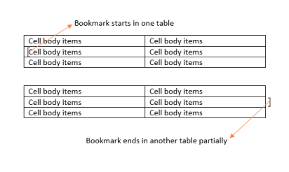

# Working with Bookmarks

You can easily identify location of text by specifying the unique name of a bookmark in for the text. For example, you might use a bookmark to identify the text that you want to revise later. Instead of scrolling through the document to locate the text, you can access it by using the Bookmark dialog box.

The following steps illustrate how to add a bookmark in Word:

1. Select the text for which you like to assign as a bookmark.
2. On the Insert menu, click Bookmark. This opens the Bookmark dialog box.

3. Type the name of the bookmark.
4. Click Add button.

N> Bookmark names must begin with a letter and can contain numbers. You cannot include spaces in a bookmark name. However, you can use the underscore character to separate words.

Essential DocIO gives you a simple mechanism of adding bookmarks to a document and managing bookmarks in a document. Every Word document contains a collection of bookmarks. This collection is accessible through the Bookmarks property of a Word document. This collection contains objects of the Bookmark type, and enables you to find and delete bookmarks.

You can find a bookmark in the Bookmarks Collection, by specifying its name by using the FindByName procedure. You can also remove a bookmark from the Bookmarks Collection by specifying its index by using the RemoveAt procedure or remove a specified bookmark by using the Remove procedure.

Every DocIO bookmark consists of a Bookmark Start and Bookmark End. A BookmarkStart class represents a part of a bookmark that identifies the start of a specific bookmark. A BookmarkEnd class represents a part of a bookmark that identifies the end of a specific bookmark. BookmarkStart and BookmarkEnd have a common property, Name. This property specifies the name of the DocIO bookmark.

Class Hierarchy

ParagraphItem

|

WBookmarkStart

ParagraphItem

|

WBookmarkEnd

BookmarkStart Public Constructors

_BookmarkStart Public Constructors_

<table>
<tr>
<th>
Constructor Name</th><th>
Description</th></tr>
<tr>
<td>
BookmarkStart (IWordDocument, string)</td><td>
Initializes a new instance of the BookmarkStart class.  </td></tr>
</table>
BookmarkEnd Public Constructors

_BookmarkEnd Public Constructors_

<table>
<tr>
<th>
Constructor Name</th><th>
Description</th></tr>
<tr>
<td>
BookmarkEnd (IWordDocument, string)</td><td>
Initializes a new instance of the BookmarkEnd class. </td></tr>
</table>
Public Properties

_Public Properties_

<table>
<tr>
<th>
Property Name</th><th>
Description</th></tr>
<tr>
<td>
EntityType</td><td>
Gets the type of the entity.  </td></tr>
<tr>
<td>
Name</td><td>
Gets or sets the bookmark name.  </td></tr>
<tr>
<td>
OwnerParagraph</td><td>
Gets the owner paragraph of bookmark.</td></tr>
</table>

DocIO provides support to navigate to bookmarks. For details, see BookmarkNavigator.

N> Modification of bookmarks in the Bookmarks Collection causes document corruption.

The following code example illustrates how to use bookmarks.


IWordDocument doc = new WordDocument();IWSection section = doc.AddSection();IWParagraph paragraph = section.AddParagraph();paragraph.AppendText("Book with one ");paragraph.AppendBookmarkStart("one_word");paragraph.AppendText("word");paragraph.AppendBookmarkEnd("one_word");paragraph.AppendText(" selected");section.AddParagraph();paragraph = section.AddParagraph();paragraph.AppendBookmarkStart("beginning_paragraph");paragraph.AppendText("Beginning of the paragraph selected");section.AddParagraph();paragraph = section.AddParagraph();paragraph.AppendBookmarkStart("bigger_bookmark");paragraph.AppendText("Smaller bookmark ");paragraph.AppendBookmarkStart("smaller_bookmark");paragraph.AppendText("is inside ");paragraph.AppendBookmarkEnd("smaller_bookmark");paragraph.AppendText("of the bigger bookmark");paragraph.AppendBookmarkEnd("bigger_bookmark");paragraph = section.AddParagraph();paragraph.AppendBookmarkStart("multi_paragraph");paragraph.AppendText("Bookmark starts here and ends in the next paragraph");paragraph = section.AddParagraph();paragraph.AppendText("This ");paragraph.AppendBookmarkStart("overlapped bookmark");paragraph.AppendText("bookmark over");paragraph.AppendBookmarkEnd("multi_paragraph");paragraph.AppendText("laps ");paragraph.AppendBookmarkEnd("overlapped bookmark");paragraph.AppendText("with previous one");doc.Save("Bookmarks.doc");


Dim doc As IWordDocument = New WordDocument()Dim section As IWSection = doc.AddSection()Dim paragraph As IWParagraph = section.AddParagraph()paragraph.AppendText("Book with one ")paragraph.AppendBookmarkStart("one_word")paragraph.AppendText("word")paragraph.AppendBookmarkEnd("one_word")paragraph.AppendText(" selected")section.AddParagraph()paragraph = section.AddParagraph()paragraph.AppendBookmarkStart("beginning_paragraph")paragraph.AppendText("Beginning of the paragraph selected")section.AddParagraph()paragraph = section.AddParagraph()paragraph.AppendBookmarkStart("bigger_bookmark")paragraph.AppendText("Smaller bookmark ")paragraph.AppendBookmarkStart("smaller_bookmark")paragraph.AppendText("is inside ")paragraph.AppendBookmarkEnd("smaller_bookmark")paragraph.AppendText("of the bigger bookmark")paragraph.AppendBookmarkEnd("bigger_bookmark")paragraph = section.AddParagraph()paragraph.AppendBookmarkStart("multi_paragraph")paragraph.AppendText("Bookmark starts here and ends in the next paragraph")paragraph = section.AddParagraph()paragraph.AppendText("This ")paragraph.AppendBookmarkStart("overlapped bookmark")paragraph.AppendText("bookmark over")paragraph.AppendBookmarkEnd("multi_paragraph")paragraph.AppendText("laps ")paragraph.AppendBookmarkEnd("overlapped bookmark")paragraph.AppendText("with previous one")doc.Save("Bookmarks.doc")


## Bookmark Navigation

BookmarkNavigator is used for navigating to bookmarks in a Word document.

1. You can navigate to a bookmark by using the MoveToBookmark method. There are two overloads for this method
* The MoveToBookmark(string bookmarkName, bool isStart, bool isAfter) moves to the bookmark with the specified name.
* The isStart parameter specifies whether to move to the bookmark start or bookmark end, and the isAfter parameter specifies whether to set a virtual "cursor" before or after the bookmark start or end.
* The MoveToBookmark(string bookmarkName) moves to the bookmark start with the specified name, and sets the "cursor" before the bookmark start.
2. You can delete the content between bookmark start and bookmark end by using the DeleteBookmarkContent method.
3. You can get the content between bookmark start and bookmark end by using the GetBookmarkContent method with collection of body items.
4. You can get the content between bookmark start and bookmark end by using the 
5. GetContent method with section collections
6. You can replace the content between bookmark start and bookmark end by using the ReplaceBookmarkContent method with TextBodyPart.
7. You can replace the content in between bookmark start and bookmark end by using ReplaceContent method with WordDocumentPart.

Public Constructors

_Public Constructors_

<table>
<tr>
<th>
Constructor Name</th><th>
Description</th></tr>
<tr>
<td>
BookmarkNavigator.BookmarkNavigator (IWordDocument)</td><td>
Initializes a new instance of the BookmarkNavigator class. </td></tr>
</table>
Public Properties

_Public Properties_

<table>
<tr>
<th>
Property Name</th><th>
Description</th></tr>
<tr>
<td>
CurrentBookmark</td><td>
Gets the current bookmark.  </td></tr>
<tr>
<td>
Document</td><td>
Gets or sets the Document where the object is attached to. </td></tr>
</table>

Public Methods

_Public Methods_

<table>
<tr>
<th>
Method Name</th><th>
Description</th></tr>
<tr>
<td>
DeleteBookmarkContent</td><td>
Deletes the bookmark content. </td></tr>
<tr>
<td>
GetBookmarkContent</td><td>
Gets the bookmark content.as TextBodyPart, that includes multiple body items  </td></tr>
<tr>
<td>
GetContent</td><td>
Gets the bookmark content as WordDocumentPart, that includes multiple sections</td></tr>
<tr>
<td>
InsertParagraphItem</td><td>
Inserts the paragraph item to current position.  </td></tr>
<tr>
<td>
InsertTable</td><td>
Inserts the table in current book mark owner text body.  </td></tr>
<tr>
<td>
InsertText</td><td>
Inserts the text current book mark owner paragraph.</td></tr>
<tr>
<td>
MoveToBookmark</td><td>
Moves to bookmark with the specified name.</td></tr>
<tr>
<td>
ReplaceBookmarkContent</td><td>
Replaces bookmark content with TextBodyPart.</td></tr>
<tr>
<td>
ReplaceContent</td><td>
Replaces the bookmark content with word document part</td></tr>
<tr>
<td>
InsertParagraph</td><td>
Inserts the paragraph.</td></tr>
<tr>
<td>
InsertTextBodyPart</td><td>
Inserts the body part of the text.</td></tr>
</table>

> * Due to MS Word’s behavior, you cannot replace the Multi Section bookmark content into table bookmark.
> * Use for loop when replacing all the bookmarks in a document instead of foreach loop to avoid “collection modified exception”, as the Bookmarks collection is modified internally by preserving bookmark position once after replacing.

The following are the restrictions on the Replace BookmarkContent methods such as,

* ReplaceBookmarkContent(TextBodyPart textbody)
* ReplaceContent(WordDocumentPart documentPart)

Due to MS Word’s behavior, you cannot replace the bookmark content, when the bookmark start and end are preserved in the following cases:

Case 1

Case 2

## Replacing Content in a Bookmark

The following code example illustrates how to get and replace bookmark content by using the BookmarkNavigator class with TextBodyPart.


 IWordDocument doc = new WordDocument( Path + "BookmarkNavigator.doc" );BookmarksNavigator bn = new BookmarksNavigator( doc );bn.MoveToBookmark( "bm_bodypart" );TextBodyPart part = bn.GetBookmarkContent();bn.MoveToBookmark( "bm_empty" );bn.ReplaceBookmarkContent( part );


 Dim doc As IWordDocument = New WordDocument(Path and "BookmarkNavigator.doc")Dim bn As BookmarksNavigator = New BookmarksNavigator(doc)bn.MoveToBookmark("bm_bodypart")Dim part As TextBodyPart = bn.GetBookmarkContent()bn.MoveToBookmark("bm_empty")bn.ReplaceBookmarkContent(part)


The following code example illustrates how to get and replace bookmark content by using the BookmarkNavigator class with WordDocumentPart. This can be used when you require to replace the content in between bookmark start and bookmark end with multiple sections.

 IWordDocument doc = new WordDocument( Path + "BookmarkNavigator.doc" );BookmarksNavigator bn = new BookmarksNavigator( doc );bn.MoveToBookmark( "bm_bodypart" );WordDocumentPart part = bn.GetContent();bn.MoveToBookmark( "bm_empty" );bn.ReplaceContent( part );


 Dim doc As IWordDocument = New WordDocument(Path and "BookmarkNavigator.doc")Dim bn As BookmarksNavigator = New BookmarksNavigator(doc)bn.MoveToBookmark("bm_bodypart")Dim part As WordDocumentPart = bn.GetContent()bn.MoveToBookmark("bm_empty")bn.ReplaceContent(part)


## Inserting and Deleting Content in a Bookmark

You can also preserve the formatting in the template (target) document while inserting or replacing the bookmark with a string, by deleting the content of the bookmark without deleting its format. The following code example illustrates this.


//Moves to the Essential_DocIO bookmark.bk.MoveToBookmark("Essential_DocIO");//Delete bookmark content without deleting the format in the target document.bk.DeleteBookmarkContent(false);//Insert Textbk.InsertText("Essential XlsIO is a Non UI component that can be used in both ASP.NET and windows forms applications. The usage is common for both environments except for the part where the created spreadsheet is saved to disk or stream in the case of a windows forms application and streamed to the client browser in the case of asp.net applications.");   


'Moves to the Essential_DocIO bookmark.bk.MoveToBookmark("Essential_DocIO")'Deletes bookmark content without deleting the format in the target document.bk.DeleteBookmarkContent(false)'Inserts text.bk.InsertText("Essential XlsIO is a Non UI component that can be used in both ASP.NET and windows forms applications. The usage is common for both environments except for the part where the created spreadsheet is saved to disk or stream in the case of a windows forms application and streamed to the client browser in the case of asp.net applications.")    


## WordDocumentPart

WordDocumentPart class contains the collection of sections. WordDocumentPart is usually used with the Bookmark Navigator.

N> WordDocumentPart contains the copy of sections from the documents. When you modify the content of the WordDocumentPart, it does not affect the objects inside the document.

Public Constructors

_Constructors Table_

<table>
<tr>
<th>
Constructor Name</th><th>
Description</th></tr>
<tr>
<td>
WordDocumentPart WordDocumentPart()</td><td>
Initializes a new instance of the WordDocumentPart class.</td></tr>
<tr>
<td>
WordDocumentPart WordDocumentPart(WordDocument document)</td><td>
Initializes a new instance of the WordDocumentPart class and loads the content of the Word document to this instance</td></tr>
</table>

Public Properties

_Properties Table_

<table>
<tr>
<th>
Property Name</th><th>
Description</th></tr>
<tr>
<td>
Sections</td><td>
Gets the sections in the WordDocumentPart</td></tr>
</table>

Public Methods

_Methods Table_

<table>
<tr>
<th>
Method Name</th><th>
Description</th></tr>
<tr>
<td>
Load</td><td>
Loads the content of WordDocument to WordDocumentPart instance</td></tr>
<tr>
<td>
GetAsWordDocument</td><td>
Get the content of WordDocumentPart as new WordDocument</td></tr>
<tr>
<td>
Close</td><td>
Closes the WordDocumentPart.instance.</td></tr>
</table>

The following code example illustrates how to use the WordDocumentPart class with the BookmarksNavigator.


//Create the new document instanceWordDocument document = new WordDocument("document.docx");//Initializes the bookmarks navigator for the document instanceBookmarksNavigator navigator = new BookmarksNavigator(document);navigator.MoveToBookmark("bookmarkName");//Gets the bookmark content as WordDocumentPart instanceWordDocumentPart documentPart = navigator.GetContent();//Extract the documentPart as new WordDocument instanceWordDocument extractDocument = documentPart.GetAsWordDocument();//Closes the WordDocumentPart instancedocumentPart.Close();//Saves the extractDocument in local machineextractDocument.Save("Sample.docx");//Closes the WordDocument instancedocument.Close();//Closes the WordDocument instanceextractDocument.Close();


 'Create the new document instance Dim document As New WordDocument("document.docx") 'Initializes the bookmarks navigator for the document instance Dim navigator As New BookmarksNavigator(document) navigator.MoveToBookmark("bookmarkName") 'Gets the bookmark content as WordDocumentPart instance Dim documentPart As WordDocumentPart = navigator.GetContent() 'Extract the documentPart as new WordDocument instance Dim extractDocument As WordDocument = documentPart.GetAsWordDocument() 'Saves the extractDocument in local machine extractDocument.Save("Sample.docx") 'Closes the WordDocumentPart instance documentPart.Close(); 'Saves the extractDocument in local machine extractDocument.Save("Sample.docx");'Closes the WordDocumentPart instance document.Close();'Closes the WordDocumentPart instance extractDocument.Close();


The following code example illustrates how to load the word document as WordDocumentPart.


//Create the new document instanceWordDocument document = new WordDocument("document.docx");//Gets the bookmark content as WordDocumentPart instanceWordDocumentPart documentPart = new WordDocumentPart();//Loads the document into documentPart instancedocumentPart.Load(document);//Closes the documentPart instance documentPart.Close();


'Create the new document instance Dim document As New WordDocument("document.docx")'Gets the bookmark content as WordDocumentPart instance Dim documentPart As New WordDocumentPart()'Loads the document into documentPart instance documentPart.Load(document) 'Closes the documentPart instance documentPart.Close()


