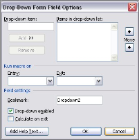

# Working with Form Fields

WFormField is the base abstract class for all form fields in DocIO (WCheckBox, WDropDownFormField and WTextFormField). There are three types of form fields:

* Text: Text form field.
* CheckBox: Check box form field.
* DropDown: Drop-down form field.

The WFormField class holds all the common properties for the form fields. The following are the common properties of the form fields:

* CalculateOnExit: Recalculates the field value when it is modified.
* Enabled: Specifies whether the status bar form field is enabled.
* FormFieldType: Specifies type of form field.
* Help: Represents form field help.
* MacroOnEnd: Specifies the name of the macro to run on entry of form field.
* MacroOnStart: Specifies the name of the macro to run on start of form field.
* Name: Represents the name of the form field.
* StatusBarHelp: Represents the help to display in the status bar.

Class Hierarchy

WTextRange

WField

              WFormField

Public Properties

_Public Properties_

<table>
<tr>
<th>
Property Name</th><th>
Description</th></tr>
<tr>
<td>
CalculateOnExit</td><td>
Gets or sets the calculate on exit property.  </td></tr>
<tr>
<td>
Enabled</td><td>
Gets or sets the Enabled property (true when form field is enabled).  </td></tr>
<tr>
<td>
EntityType</td><td>
Gets the type of the entity.  </td></tr>
<tr>
<td>
FieldPattern</td><td>
Gets or sets the field pattern.  </td></tr>
<tr>
<td>
FieldType</td><td>
Gets or sets the field type. </td></tr>
<tr>
<td>
FieldValue</td><td>
Gets the field value. </td></tr>
<tr>
<td>
FormFieldType</td><td>
Gets the type of this form field.  </td></tr>
<tr>
<td>
Help</td><td>
Gets or sets the form field help.  </td></tr>
<tr>
<td>
MacroOnEnd</td><td>
Gets or sets the the name of macros on end.  </td></tr>
<tr>
<td>
MacroOnStart</td><td>
Gets or sets the name of macros on start.  </td></tr>
<tr>
<td>
Name</td><td>
Gets or sets the form field title name (bookmark name).  </td></tr>
<tr>
<td>
StatusBarHelp</td><td>
Gets or sets the status bar help.  </td></tr>
<tr>
<td>
TextFormat</td><td>
Gets or sets the regular text format.  </td></tr>
</table>

## CheckBox 

WCheckBox class represents a check box form field in a Word document. To add a check box to a Word document, click Check BoxForm Field on the Forms toolbar.

_CheckBox Properties in Microsoft Word_

CheckBoxSize property specifies the size of the check box. You can set the size of the check box automatically, by setting the SizeType property to Auto. You can also set custom size for the check box by setting the SizeType property to Exactly.

DefaultCheckBoxValue specifies the default value of the check box. You can use the Checked property to set the value of the check box.

You can use the AppendCheckBox method of WParagraph to append a check box to the end of the paragraph.

Class Hierarchy

WTextRange

            |

WField

              |

           WFormField

                 |

               WCheckBox

Public Methods

_Public Methods_

<table>
<tr>
<th>
Method Name</th><th>
Description</th></tr>
<tr>
<td>
WCheckBox.WCheckBox (IWordDocument) </td><td>
Initializes a new instance of the WCheckBox class. </td></tr>
</table>

Public Properties

_Public Properties_

<table>
<tr>
<th>
Property Name</th><th>
Description</th></tr>
<tr>
<td>
CheckBoxSize</td><td>
Gets or sets the size of checkbox (in integer).  </td></tr>
<tr>
<td>
Checked</td><td>
Gets or sets the Checked property.  </td></tr>
<tr>
<td>
DefaultCheckBoxValue</td><td>
Gets or sets the default value of check box.  </td></tr>
<tr>
<td>
EntityType</td><td>
Gets the type of the entity.  </td></tr>
<tr>
<td>
SizeType</td><td>
Gets or sets the check box size type informations.  </td></tr>
</table>

The following code example illustrates the usage of the WCheckBox class.


IWordDocument doc = new WordDocument();doc.EnsureMinimal();IWParagraph par = doc.LastParagraph;WCheckBox checkBox = par.AppendCheckBox();checkBox.Enabled = false;checkBox.StatusBarHelp = "Help1";checkBox.Help = "Help2";checkBox.DefaultCheckBoxValue = true;checkBox.SizeType = CheckBoxSizeType.Auto;checkBox.CalculateOnExit = true;par.AppendText(" CheckBox2: ");WCheckBox checkBox1 = par.AppendCheckBox();checkBox1.CheckBoxSize = 30;checkBox1.SizeType = CheckBoxSizeType.Exactly;checkBox1.CalculateOnExit = false;checkBox1.Checked = true;doc.Save("TestDoc.doc");


Dim doc As IWordDocument = New WordDocument()doc.EnsureMinimal()Dim par As IWParagraph = doc.LastParagraphDim checkBox As WCheckBox = par.AppendCheckBox()checkBox.Enabled = FalsecheckBox.StatusBarHelp = "Help1"checkBox.Help = "Help2"checkBox.DefaultCheckBoxValue = TruecheckBox.SizeType = CheckBoxSizeType.AutocheckBox.CalculateOnExit = Truepar.AppendText(" CheckBox2: ")checkBox1 As WCheckBox = par.AppendCheckBox()checkBox1.CheckBoxSize = 30checkBox1.SizeType = CheckBoxSizeType.ExactlycheckBox1.CalculateOnExit = FalsecheckBox1.Checked = Truedoc.Save("TestDoc.doc")


## DropDown

WDropDownFormField class represents a drop-down form field in a Word document. To add a drop-down form field to a Word document, click DropDown Form Field on the Forms toolbar.

_DropDown Form Field Properties_

By using the DropDownSelectedIndex property, you can specify the index of a record to be displayed in the drop-down form field. The record is chosen among the collection of the drop-down records. This collection is accessible through the DropDownItems property.

You can use the AppendDropDownFormField method of WParagraph to append drop-down form fields to the end of a paragraph.

Class Hierarchy

WTextRange

     |

   WField

        |

      WFormField

             |

WDropDownFormField

Public Constructors

_Public Constructors_

<table>
<tr>
<th>
Constructor Name</th><th>
Description</th></tr>
<tr>
<td>
WdropDownForm.FieldWDropDownFormField (IWordDocument)</td><td>
Initializes a new instance of the WDropDownFormField class. </td></tr>
</table>
Public Properties

_Public Properties_

<table>
<tr>
<th>
Property Name</th><th>
Description</th></tr>
<tr>
<td>
DropDownItems</td><td>
Gets drop down items.</td></tr>
<tr>
<td>
DropDownSelectedIndex</td><td>
Gets or sets the selected drop-down index.</td></tr>
</table>


IWordDocument doc = new WordDocument();doc.EnsureMinimal();IWParagraph par = doc.LastParagraph;WDropDownFormField dropDown = par.AppendDropDownFormField();dropDown.DropDownItems.Add("One");dropDown.DropDownItems.Add("Two");dropDown.DropDownSelectedIndex = 1;dropDown.CalculateOnExit = true;dropDown.Enabled = false;dropDown.Help = "Help2";dropDown.StatusBarHelp = "Help1";doc.Save("TestDoc.doc");


Dim doc As IWordDocument = New WordDocument()doc.EnsureMinimal()Dim par As IWParagraph = doc.LastParagraphDim dropDown As WDropDownFormField = par.AppendDropDownFormField()dropDown.DropDownItems.Add("One")dropDown.DropDownItems.Add("Two")dropDown.DropDownSelectedIndex = 1dropDown.CalculateOnExit = TruedropDown.Enabled = FalsedropDown.Help = "Help2"dropDown.StatusBarHelp = "Help1"doc.Save("TestDoc.doc")


## Text

WTextFormField class represents a text form field in a Word document. To add a text form field to the Word document, click Text Form Field on the Forms toolbar.

_Text Form Field Properties_

To set the format of the DocIO text directly from the field, you can use the StringFormat property. To get or set the default text for the text form field, you can use the DefaultText property.

N> Text form field displays the default text only when the text of the form field has no value, that is, when the Text property has no value.

Text property is used to set the text of the text form field. Type property specifies the type of the text form field. The various text form field types are as follows:

* RegularText
* NumberText
* DateText

Class Hierarchy

WTextRange

 	 |

WField

             |

WFormField

                 |

              WTextFormField

Public Constructors

_Public Constructors_

<table>
<tr>
<th>
Constructor Name</th><th>
Description</th></tr>
<tr>
<td>
WTextFormField.WTextFormField (IWordDocument)</td><td>
Initializes a new instance of the WTextFormField class. </td></tr>
</table>
Public Properties

_Public Properties_

<table>
<tr>
<th>
Property Name</th><th>
Description</th></tr>
<tr>
<td>
DefaultText</td><td>
Gets or sets the default text for text form field. </td></tr>
<tr>
<td>
MaximumLength</td><td>
Gets or sets the maximum text length. </td></tr>
<tr>
<td>
StringFormat</td><td>
Gets or sets the string text format (text, date or time, number) directly. </td></tr>
<tr>
<td>
TextRange</td><td>
Gets or sets the form field text range.</td></tr>
<tr>
<td>
Type</td><td>
Gets or sets the text form field type. </td></tr>
<tr>
<td>
Text</td><td>
Gets or sets the text for text form field.</td></tr>
</table>

The following code examples illustrate the usage of different variants of a text form field.


Example 1IWordDocument doc = new WordDocument(true);IWParagraph par = doc.LastParagraph;//Appends text form fields to a paragraph.WTextFormField textFormField = par.AppendTextFormField("Hello");textFormField.TextFormat = TextFormat.Uppercase;textFormField.Enabled = false;textFormField.Help = "Help2";textFormField.StatusBarHelp = "Help1";textFormField.MacroOnStart = "Test1";textFormField.CalculateOnExit = true;Example 2//In this sample, we modify all text form fields in a document.foreach (WSection sec in doc.Sections){    foreach (WTextBody body in sec.ChildEntities)    {          //Every WTextBody object has a collection of form fields.        foreach (WFormField ffield in body.FormFields)        {            switch (ffield.FormFieldType)            {              case FormFieldType.TextInput:                WTextFormField textField = (WTextFormField)ffield;                textField.Type = TextFormFieldType.DateText;                //Setting of default text of form field.                textField.DefaultText = "01/01/2007";                textField.StringFormat = "MM/dd/yyyy ";                          //Setting character format of field (not text of form                 field).                //This formatting you can see, when you press Alt+F9 on                //document, which has form field.                textField.CharacterFormat.FontName = "Comic Sans MS";                textField.CharacterFormat.Shadow = true;                textField.CharacterFormat.FontSize = 20f;                           //Setting text of text form field and its character format.                //If textField.Text value is not equal to string.Empty                //form field's text will be textField.Text, in other                //case textField.DefaultText.                textField.Text = string.Empty;                textField.TextRange.CharacterFormat.FontName = "Comic Sans                 MS";                textField.TextRange.CharacterFormat.Shadow = true;                textField.TextRange.CharacterFormat.FontSize = 20f;                textField.TextRange.CharacterFormat.TextColor = Color.Blue;              break;              default:              break;            }        }    }}


Example 1Dim doc As IWordDocument = New WordDocument(True)Dim par As IWParagraph = doc.LastParagraph‘Appends text form fields to a paragraph.Dim textFormField As WTextFormField = par.AppendTextFormField("Hello")textFormField.TextFormat = TextFormat.UppercasetextFormField.Enabled = FalsetextFormField.Help = "Help2"textFormField.StatusBarHelp = "Help1"textFormField.MacroOnStart = "Test1"textFormField.CalculateOnExit = TrueExample 2'In this sample, we modify all text form fields in a document.For Each sec As WSection In doc.Sections    For Each body As WTextBody In sec.ChildEntities        'Every WTextBody object has a collection of form fields.        For Each ffield As WFormField In body.FormFields            Select Case ffield.FormFieldType                Case FormFieldType.TextInput                    Dim textField As WTextFormField = CType(ffield,                     WTextFormField)                    textField.Type = TextFormFieldType.DateText                    'Setting of default text of form field.                    textField.DefaultText = "01/01/2007"                    textField.StringFormat = "MM/dd/yyyy "                    'Setting characterformat of field(not text of formfield).                    'This formatting you can see, when you press Alt+F9 on                    'document, which has form field.                     textField.CharacterFormat.FontName = "Comic Sans MS"                    textField.CharacterFormat.Shadow = True                    textField.CharacterFormat.FontSize = 20.0F                    'Setting text of text form field and its character                     format.                    'If textField.Text value is not equal to string.Empty                    'form field's text will be textField.Text, in other                    'case textField.DefaultText.                    textField.Text = String.Empty                    textField.CharacterFormat.FontName = "Comic Sans MS"                    textField.CharacterFormat.Shadow = True                    textField.CharacterFormat.FontSize = 20.0F                    textField.CharacterFormat.TextColor = Color.Blue                Case Else            End Select        Next ffield    Next bodyNext sec


DocIO also provides option to add or remove form field shading. You can turn on the gray shading on form fields by using the following code example.


document.Properties.FormFieldShading = false;


document.Properties.FormFieldShading = False


