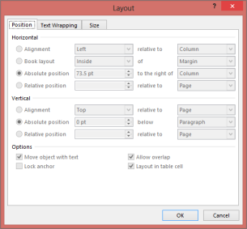
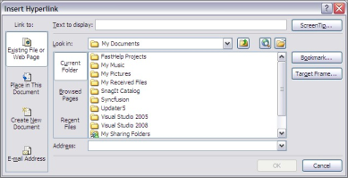
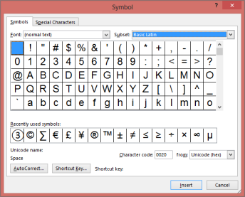
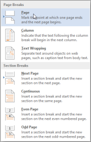
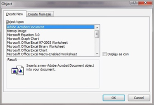

# Working with Paragraphs

WParagraph class represents a single paragraph in a document. You can add paragraph items by using the Items property of WParagraph class. This property returns the collection of paragraph items (instance of ParagraphItemCollection type).

The format of the paragraph is set by using the ParagraphFormat property. This property is used to define the paragraph border, style of texture, foreground and background color, paragraph spacing, and so on. 

* IsInCell: Specifies whether current paragraph is present within a table cell.
* IsEndOfSection: Specifies whether the current paragraph is the last paragraph in the section.
* IsEndOfDocument: Specifies whether the current paragraph is the last paragraph in the document.

## Formatting Break Symbol

BreakCharacterFormat property is used to set character formatting for the Break symbol.

## Adding Paragraph Items

You can add paragraph items to a paragraph by using the Append method. For example, the AppendText method, AppendBreak method, and so on, are used for this purpose.

Class Hierarchy

TextBodyItem

|

WParagraph

Public Constructors

_Public Constructors_

<table>
<tr>
<th>
Constructor Name</th><th>
Description</th></tr>
<tr>
<td>
WParagraph.WParagraph (IWordDocument)</td><td>
Initializes a new instance of the WParagraph class. </td></tr>
</table>
Public Properties

_Public Properties_

<table>
<tr>
<th>
Property Name</th><th>
Description</th></tr>
<tr>
<td>
BreakCharacterFormat</td><td>
Gets character format for the Break symbol as WCharacterFormat.  </td></tr>
<tr>
<td>
ChildEntities</td><td>
Gets child entities of a paragraph as EntityCollection instance.  </td></tr>
<tr>
<td>
EntityType</td><td>
Gets the type of the entity.  </td></tr>
<tr>
<td>
IsEndOfDocument</td><td>
Gets a value indicating whether this paragraph is the end of a document.</td></tr>
<tr>
<td>
IsEndOfSection</td><td>
Gets a value indicating whether this paragraph is the end of a section.</td></tr>
<tr>
<td>
IsInCell</td><td>
Gets a value indicating whether this paragraph is in a cell.  </td></tr>
<tr>
<td>
Items</td><td>
Gets paragraph items as ParagraphItemCollection instance.</td></tr>
<tr>
<td>
ListFormat</td><td>
Gets the format of the list that is applied to a paragraph.  </td></tr>
<tr>
<td>
ParagraphFormat</td><td>
Gets formatting of a paragraph as WParagraphFormat instance.  </td></tr>
<tr>
<td>
StyleName</td><td>
Gets the name style applied to a paragraph.  </td></tr>
<tr>
<td>
Text</td><td>
Gets or sets text for a paragraph.</td></tr>
</table>
Public Methods

_Public Methods_

<table>
<tr>
<th>
Method Name</th><th>
Description</th></tr>
<tr>
<td>
AppendBookmarkEnd</td><td>
Appends a bookmark at the end of a paragraph with specified name.</td></tr>
<tr>
<td>
AppendBookmarkStart</td><td>
Appends a bookmark at the start of a paragraph with specified name.</td></tr>
<tr>
<td>
AppendBreak</td><td>
Appends a break to the end of a paragraph.  </td></tr>
<tr>
<td>
AppendCheckBox</td><td>
Appends a checkbox to the end of a paragraph.</td></tr>
<tr>
<td>
AppendComment</td><td>
Appends a comment to the end of a paragraph.</td></tr>
<tr>
<td>
AppendDropDownFormField</td><td>
Appends a DropDown form field to the end of a paragraph.</td></tr>
<tr>
<td>
AppendField</td><td>
Appends a field to the end of a paragraph.  </td></tr>
<tr>
<td>
AppendFootnote</td><td>
Appends a footnote to the end of a paragraph.</td></tr>
<tr>
<td>
AppendPicture</td><td>
Appends a picture to the end of a paragraph.</td></tr>
<tr>
<td>
AppendSymbol</td><td>
Appends a special symbol to the end of a paragraph.  </td></tr>
<tr>
<td>
AppendText</td><td>
Appends text to the end of a paragraph.  </td></tr>
<tr>
<td>
AppendTextBox</td><td>
Appends a Text box to the end of a paragraph. </td></tr>
<tr>
<td>
AppendTextFormField</td><td>
Appends a text form field to the end of a paragraph. </td></tr>
<tr>
<td>
AppendTOC</td><td>
Appends Table of Contents.</td></tr>
<tr>
<td>
AppendShape</td><td>
Appends a shape to the end of a paragraph.</td></tr>
<tr>
<td>
AppendHTML</td><td>
Appends HTML text to the end of a paragraph</td></tr>
<tr>
<td>
AppendOleObject</td><td>
Appends an OLE object to the end of a paragraph</td></tr>
<tr>
<td>
ApplyStyle</td><td>
Applies style to a paragraph.</td></tr>
<tr>
<td>
Find</td><td>
Finds text inside a paragraph.</td></tr>
<tr>
<td>
GetStyle</td><td>
Gets information on related style.</td></tr>
<tr>
<td>
Replace</td><td>
Replaces text inside a paragraph.</td></tr>
<tr>
<td>
InsertSectionBreak</td><td>
Inserts a section break.</td></tr>
<tr>
<td>
AppendCrossReference</td><td>
Append a Cross-Reference field of specified reference type (currently it support only Bookmarks) at the end of a paragraph.</td></tr>
</table>

The following code example illustrates how to add various formats to paragraphs.



//Adds a paragraph and applies formatting.paragraph = section.AddParagraph();paragraph.ParagraphFormat.Borders.Bottom.BorderType = BorderStyle.ThinThickSmallGap;paragraph.ParagraphFormat.HorizontalAlignment = HorizontalAlignment.Center;paragraph.ParagraphFormat.BeforeSpacing = 18;textRange = paragraph.AppendText("Windows Forms. ");paragraph = section.AddParagraph();paragraph.ParagraphFormat.PageBreakBefore = true;paragraph.ParagraphFormat.BackColor = Color.FromArgb(102, 102, 153);paragraph.ParagraphFormat.BeforeSpacing = 18;paragraph.ParagraphFormat.AfterSpacing = 6;paragraph.ParagraphFormat.FirstLineIndent = 45;


'Adds a paragraph and applies formatting.paragraph = section.AddParagraph()paragraph.ParagraphFormat.Borders.Bottom.BorderType = BorderStyle.ThinThickSmallGapparagraph.ParagraphFormat.HorizontalAlignment = HorizontalAlignment.Centerparagraph.ParagraphFormat.BeforeSpacing = 18TextRange = paragraph.AppendText("Windows Forms. ")paragraph = section.AddParagraph()paragraph.ParagraphFormat.PageBreakBefore = Trueparagraph.ParagraphFormat.BackColor = Color.FromArgb(102, 102, 153)paragraph.ParagraphFormat.BeforeSpacing = 18paragraph.ParagraphFormat.AfterSpacing = 6paragraph.ParagraphFormat.FirstLineIndent = 45


## Working with Text

WTextRange class represents a piece of text that has separate formatting. You can format the text by using the CharacterFormat property. For more details on CharacterFormat property, refer to the CharacterFormat documentation.

You can also use the AppendText method of the WParagraph class to append text to the paragraph.

N> AppendText method appends a new text range to the paragraph with the default character formatting.

Class Hierarchy

ParagraphItem

|

WextRange

Public Constructors

_Public Constructors_

<table>
<tr>
<th>
Constructor Name</th><th>
Description</th></tr>
<tr>
<td>
WTextRange</td><td>
Initializes a new instance of the WTextRange class.</td></tr>
</table>
Public Properties

_Public Properties_

<table>
<tr>
<td>
Property Name</td><td>
Description</td></tr>
<tr>
<td>
CharacterFormat</td><td>
Gets the character format( font properties ) for the TextRange as WCharacterFormat instance. </td></tr>
<tr>
<td>
EntityType</td><td>
Gets the type of the entity.  </td></tr>
<tr>
<td>
Text</td><td>
Gets or sets the text for text range.</td></tr>
</table>

The following code example illustrates how to use the WTextRange class.



IWordDocument doc = new WordDocument();//Writes different font name or font size.string[] fontNames = new string[] { "Times New Roman", "Verdana", "Symbol", };IWSection section = doc.AddSection();IWParagraph paragraph;IWTextRange textRange;for (int j = 0, len = fontNames.Length; j < len; j++){    paragraph = section.AddParagraph();    string fontName = fontNames[j];    for (int i = 9; i < 40; i++)    {        textRange = paragraph.AppendText(fontName + " " + i.ToString() + " ");        textRange.CharacterFormat.FontSize = i;        textRange.CharacterFormat.FontName = fontName;        if (i > 15)        {            i += 5;        }    }    IWTextRange txtRange2 = paragraph.AppendText(fontName + "34,5 ");    txtRange2.CharacterFormat.FontSize = (float)34.5;    txtRange2.CharacterFormat.FontName = fontName;}//Writes bold or italic or underline or strike text.paragraph = section.AddParagraph();textRange = paragraph.AppendText("Bold Text_Bold Text   ");textRange.CharacterFormat.Bold = true;textRange = paragraph.AppendText("Italic Text_Italic Text   ");textRange.CharacterFormat.Italic = true;textRange = paragraph.AppendText("Underline Text_Underline Text   ");textRange.CharacterFormat.UnderlineStyle = UnderlineStyle.Dash;textRange = paragraph.AppendText("Strike Text_Strike Text   ");textRange.CharacterFormat.Strikeout = true;textRange = paragraph.AppendText("Shadow Text_Shadow Text   ");textRange.CharacterFormat.Shadow = true;paragraph = section.AddParagraph();paragraph = section.AddParagraph();textRange = paragraph.AppendText("Merged Font Style Text_Merged Font Style Text");textRange.CharacterFormat.Bold = true;textRange.CharacterFormat.Italic = true;textRange.CharacterFormat.Strikeout = true;textRange.CharacterFormat.UnderlineStyle = UnderlineStyle.Dash;</td></tr>


Dim doc As IWordDocument = New WordDocument()‘Writes different font name or font size.Dim font Names As String() = New String() { "Times New Roman", "Verdana", "Symbol", }Dim section As IWSection = doc.AddSection()Dim paragraph As IWParagraphDim textRange As IWTextRangeDim j As Integer = 0len = fontNames.LengthDo While j < Len()     paragraph = section.AddParagraph()     Dim fontName As String = fontNames(j)     For i As Integer = 9 To 39         textRange = paragraph.AppendText(fontName and " " and i.ToString() and " ")         textRange.CharacterFormat.FontSize = i         textRange.CharacterFormat.FontName = fontName         If i > 15 Then             i += 5         End If     Next i     Dim txtRange2 As IWTextRange = paragraph.AppendText(fontName and "34,5 ")     txtRange2.CharacterFormat.FontSize = CSng(34.5)     txtRange2.CharacterFormat.FontName = fontName     j += 1Loop 'Writes bold or italic or underline or strike text.paragraph = section.AddParagraph()textRange = paragraph.AppendText("Bold Text_Bold Text   ")textRange.CharacterFormat.Bold = TruetextRange = paragraph.AppendText("Italic Text_Italic Text   ")textRange.CharacterFormat.Italic = TruetextRange = paragraph.AppendText("Underline Text_Underline Text   ")textRange.CharacterFormat.UnderlineStyle = UnderlineStyle.DashtextRange = paragraph.AppendText("Strike Text_Strike Text   ")textRange.CharacterFormat.Strikeout = TruetextRange = paragraph.AppendText("Shadow Text_Shadow Text   ")textRange.CharacterFormat.Shadow = Trueparagraph = section.AddParagraph()paragraph = section.AddParagraph()textRange = paragraph.AppendText("Merged Font Style Text_Merged Font Style Text")textRange.CharacterFormat.Bold = TruetextRange.CharacterFormat.Italic = TruetextRange.CharacterFormat.Strikeout = TruetextRange.CharacterFormat.UnderlineStyle = UnderlineStyle.Dash</td></tr>


## Working with Images

WPicture class represents a picture in the Word document. You can specify the picture width, height, and position of the picture by using properties of the WPicture class.

A picture is positioned by using the VerticalPosition and HorizontalPosition properties. The measure unit is Point. 

You can specify the relative positioning by using the HorizontalAlignment and VerticalAlignment properties. HorizontalAlignment property returns the instance of the ShapeHorizontalAlignment type. The following are the variants for the HorizontalAlignment property.

* None
* Left
* Center
* Right
* Inside
* Outside

VerticalAlignment property returns the instance of the ShapeVerticalAlignment type. The following are the variants for the VerticalAlignment property.

* Bottom
* Center
* Inline
* Inside
* None
* Outside
* Top

HorizontalOrigin and VerticalOrigin properties define the reference origin used for relative positioning of a picture.

HorizontalOrigin property returns the value of the HorizontalOrigin type. The following are the variants for the HorizontalOrigin property.

* Margin
* Page
* Column
* Character
* LeftMargin
* RightMargin
* InsideMargin
* OutsideMargin

VerticalOrigin property returns value of VerticalOrigin type. The following are the variants for the VerticalOrigin property.

* Margin
* Page
* Paragraph
* Line
* TopMargin
* BottomMargin
* InsideMargin
* OutsideMargin

You can set the width and height of the picture by using the Width and Height properties, and the HeightScale and WidthScale properties to get or set picture scaling.

The LoadImage method is used to set an image by loading the System.Drawing.Image instance, or image bytes array. You can also use the AppendPicture method of the WParagraph class to append a picture to a paragraph.

Class Hierarchy

ParagraphItem

|

WPicture

Public Constructors

_Public Constructors_

<table>
<tr>
<th>
Constructor Name</th><th>
Description</th></tr>
<tr>
<td>
WPicture (IWordDocument)</td><td>
Gets the type of the entity. </td></tr>
</table>
Public Properties

_Public Properties_

<table>
<tr>
<th>
Property Name</th><th>
Description</th></tr>
<tr>
<td>
EntityType</td><td>
Gets the type of the entity. </td></tr>
<tr>
<td>
Height</td><td>
Gets or sets the picture height in points. </td></tr>
<tr>
<td>
HeightScale</td><td>
Gets or sets the picture height scale factor in percent. </td></tr>
<tr>
<td>
HorizontalAlignment</td><td>
Gets or sets the picture horizontal alignment. </td></tr>
<tr>
<td>
HorizontalOrigin</td><td>
Gets or sets the horizontal origin of the picture.  </td></tr>
<tr>
<td>
HorizontalPosition</td><td>
Gets or sets the absolute vertical position of the picture.  </td></tr>
<tr>
<td>
Image</td><td>
Gets the internal System.Drawing.Image instance.  </td></tr>
<tr>
<td>
ImageBytes</td><td>
Gets the System.Drawing.Image as byte array.  </td></tr>
<tr>
<td>
Size</td><td>
Gets or sets the size of the picture object.  </td></tr>
<tr>
<td>
TextWrappingStyle</td><td>
Gets or sets the text wrapping style of the picture.  </td></tr>
<tr>
<td>
TextWrappingType</td><td>
Gets or sets the text wrapping type of the picture.  </td></tr>
<tr>
<td>
VerticalAlignment</td><td>
Gets or sets the picture vertical alignment.  </td></tr>
<tr>
<td>
VerticalOrigin</td><td>
Gets or sets the absolute horizontal position of the picture.</td></tr>
<tr>
<td>
VerticalPosition</td><td>
Gets or sets the text wrapping style of the picture.  </td></tr>
<tr>
<td>
Width</td><td>
Gets or sets the picture width (in points).  .</td></tr>
<tr>
<td>
WidthScale</td><td>
Gets or sets the picture width scale factor in percent.  </td></tr>
<tr>
<td>
AlternativeText</td><td>
Gets or sets the alternative text to the picture</td></tr>
<tr>
<td>
Name</td><td>
Gets or sets the name for the picture</td></tr>
<tr>
<td>
Title</td><td>
Gets or sets the title to the picture</td></tr>
<tr>
<td>
Visible</td><td>
Gets or sets the value indicating whether the picture should be visible or hidden.</td></tr>
</table>
Public Methods

_Public Methods_

<table>
<tr>
<th>
Method Name</th><th>
Description</th></tr>
<tr>
<td>
AddCaption</td><td>
Adds Caption for current Picture.</td></tr>
<tr>
<td>
LoadImage</td><td>
Loads image.</td></tr>
</table>

The following screenshot illustrates the various layout formats available in Microsoft Word.

The following code example illustrates how to add picture to the paragraph and specifies size to the picture by using WPicture class.


IWordDocument doc = new WordDocument();IWSection section = doc.AddSection();IWParagraph paragraph = section.AddParagraph();paragraph.AppendText("First image");IWPicture picture = paragraph.AppendPicture(new Bitmap(ImagesPath + DEF_IMAGE1_NAME));picture.HeightScale = 50f;picture.WidthScale = 50f;paragraph = section.AddParagraph();paragraph.AppendText("Second image");picture = paragraph.AppendPicture(new Bitmap(ImagesPath + DEF_IMAGE2_NAME));picture.HeightScale = 50f;picture.WidthScale = 50f;section.HeadersFooters.OddHeader.Paragraphs.Add(paragraph);</td></tr>


Dim doc As IWordDocument = New WordDocument()Dim section As IWSection = doc.AddSection()Dim paragraph As IWParagraph = section.AddParagraph()paragraph.AppendText("First image")Dim picture As IWPicture = paragraph.AppendPicture(New Bitmap(ImagesPath + DEF_IMAGE1_NAME))picture.HeightScale = 50.0Fpicture.WidthScale = 50.0Fparagraph = section.AddParagraph()paragraph.AppendText("Second image")picture = paragraph.AppendPicture(New Bitmap(ImagesPath + DEF_IMAGE2_NAME))picture.HeightScale = 50.0Fpicture.WidthScale = 50.0Fsection.HeadersFooters.OddHeader.Paragraphs.Add(paragraph)</td></tr>


## Working with Lists

You can specify the list style to a paragraph by using the ListFormat property of WParagraph class. This property returns the instance of the WListFormat class. The WListFormat class specifies the formatting for the list (applied list style, list level number and so on).

* ListType property of WListFormat specifies the type of the list. 
* ListLevelNumber property specifies the level number for the list paragraph. 
* CurrentListStyle property specifies the list style, applied for the current list paragraph.
* CurrentListLevel property returns the instance of the WListLevel type that specifies the formatting for the list level (paragraph). 
* To apply default bullet or numbered style to the paragraph, you can use the ApplyDefBulletStyle or ApplyDefNumberedStyle method. 
* To apply custom style, you can use the ApplyStyle method.
* ContinueListNumbering method is used to continue previous list numbering.
* You can use the IncreaseIndentLevel or DecreaseIndentLevel methods to increase or decrease indent for the level.
* To remove lists from a paragraph, you can use the RemoveList method.

Class Hierarchy

FormatBase

|

WListFormat

Public Constructor

_Public Constructor_

<table>
<tr>
<th>
Constructor Name</th><th>
Description</th></tr>
<tr>
<td>
WListFormat.WListFormat (IWParagraph)</td><td>
Initializes new instance of WListFormat class.</td></tr>
</table>
Public Properties

_Public Properties_

<table>
<tr>
<th>
Property Name</th><th>
Description</th></tr>
<tr>
<td>
CurrentListLevel</td><td>
Gets the paragraph's current ListLevel.</td></tr>
<tr>
<td>
CurrentListStyle</td><td>
Gets the paragraph's current list style information. </td></tr>
<tr>
<td>
CustomStyleName</td><td>
Gets the name of custom style. </td></tr>
<tr>
<td>
ListLevelNumber</td><td>
Gets or sets the list nesting level. </td></tr>
<tr>
<td>
ListType</td><td>
Gets or sets the type of the list. </td></tr>
<tr>
<td>
RestartNumbering</td><td>
Gets or sets whether numbering of the list must restart from previous list. </td></tr>
</table>
Public Methods

_Public Methods_

<table>
<tr>
<th>
Method Name</th><th>
Description</th></tr>
<tr>
<td>
ApplyDefBulletStyle</td><td>
Applies default bullet style for current paragraph.  </td></tr>
<tr>
<td>
ApplyDefNumberedStyle</td><td>
Applies default numbered style for current paragraph.  </td></tr>
<tr>
<td>
ApplyStyle</td><td>
Gets or sets the name of custom style.  </td></tr>
<tr>
<td>
ContinueListNumbering</td><td>
Continues last list.  </td></tr>
<tr>
<td>
DecreaseIndentLevel</td><td>
Decreases level indent.  </td></tr>
<tr>
<td>
IncreaseIndentLevel</td><td>
Increases level indent.  </td></tr>
<tr>
<td>
RemoveList</td><td>
Removes the list from current paragraph.  </td></tr>
</table>

The following code example illustrates how to use the WListFormat and list styles in DocIO.


//Writes default numbered list.          IWParagraph paragraph = section.AddParagraph();paragraph.AppendText( "First Numbered ( level 0 )" );      paragraph.ListFormat.ApplyDefNumberedStyle();paragraph = section.AddParagraph();paragraph.AppendText( "Level 1" ); paragraph.ListFormat.ContinueListNumbering();paragraph.ListFormat.IncreaseIndentLevel();paragraph = section.AddParagraph();paragraph.AppendText( "Level 0" ); paragraph.ListFormat.ContinueListNumbering();paragraph.ListFormat.DecreaseIndentLevel();section.AddParagraph();section.AddParagraph();//Writes default bulleted list.  paragraph = section.AddParagraph();paragraph.AppendText( "First bulleted ( level 0 )" );      paragraph.ListFormat.ApplyDefBulletStyle();paragraph = section.AddParagraph();paragraph.AppendText( "Level 1" ); paragraph.ListFormat.ContinueListNumbering();paragraph.ListFormat.IncreaseIndentLevel();paragraph = section.AddParagraph();paragraph.AppendText( "Level 0" ); paragraph.ListFormat.ContinueListNumbering();paragraph.ListFormat.DecreaseIndentLevel();section.AddParagraph();section.AddParagraph();//Writes mixed bulleted and numbered list. ListStyle myStyle = doc.AddListStyle( ListType.Numbered, "UserStyle");WListLevel listLevel1 = myStyle.Levels[ 0 ];listLevel1.FollowCharacter = FollowCharacterType.Tab;listLevel1.TextPosition = 80f;listLevel1.NumberAlignment = ListNumberAlignment.Right;listLevel1.TabSpaceAfter = 40f;listLevel1.StartAt = 3;listLevel1.NumberPrefix = "(((";listLevel1.NumberSufix = "***.";paragraph = section.AddParagraph();paragraph.AppendText( "First numbered" );paragraph.ListFormat.ApplyStyle( "UserStyle" );paragraph = section.AddParagraph();ListStyle bulletStyle = doc.AddListStyle( ListType.Bulleted, "UserStyle1");WListLevel level = bulletStyle.Levels[ 0 ];level.NumberPosition = 30f;level.TabSpaceAfter = 15f;level.FollowCharacter = FollowCharacterType.Tab;paragraph.AppendText( "First bullet" );      paragraph.ListFormat.ApplyStyle( "UserStyle1" );     paragraph = section.AddParagraph();paragraph.AppendText( "Bulleted level 1" );      paragraph.ListFormat.ContinueListNumbering();paragraph = section.AddParagraph();paragraph.AppendText( "Numbered level 0 again" );             paragraph.ListFormat.ApplyStyle( "UserStyle" );section.AddParagraph();section.AddParagraph();</td></tr>


'Writes default numbered list.          Dim paragraph As IWParagraph = Section.AddParagraph()paragraph.AppendText("First Numbered ( level 0 )")paragraph.ListFormat.ApplyDefNumberedStyle()paragraph = Section.AddParagraph()paragraph.AppendText("Level 1")paragraph.ListFormat.ContinueListNumbering()paragraph.ListFormat.IncreaseIndentLevel()paragraph = Section.AddParagraph()paragraph.AppendText("Level 0")paragraph.ListFormat.ContinueListNumbering()paragraph.ListFormat.DecreaseIndentLevel()Section.AddParagraph()Section.AddParagraph()'Writes default bulleted list.  paragraph = Section.AddParagraph()paragraph.AppendText("First bulleted ( level 0 )")paragraph.ListFormat.ApplyDefBulletStyle()paragraph = Section.AddParagraph()paragraph.AppendText("Level 1")paragraph.ListFormat.ContinueListNumbering()paragraph.ListFormat.IncreaseIndentLevel()paragraph = Section.AddParagraph()paragraph.AppendText("Level 0")paragraph.ListFormat.ContinueListNumbering()paragraph.ListFormat.DecreaseIndentLevel()Section.AddParagraph()Section.AddParagraph()'Writes mixed bulleted and numbered list. Dim myStyle As ListStyle = doc.AddListStyle(ListType.Numbered, "UserStyle")Dim listLevel1 As WListLevel = myStyle.Levels(0)listLevel1.FollowCharacter = FollowCharacterType.TablistLevel1.TextPosition = 80.0FlistLevel1.NumberAlignment = ListNumberAlignment.RightlistLevel1.TabSpaceAfter = 40.0FlistLevel1.StartAt = 3listLevel1.NumberPrefix = "((("listLevel1.NumberSufix = "***."paragraph = Section.AddParagraph()paragraph.AppendText("First numbered")paragraph.ListFormat.ApplyStyle("UserStyle")paragraph = Section.AddParagraph()Dim bulletStyle As ListStyle = doc.AddListStyle(ListType.Bulleted, "UserStyle1")Dim level As WListLevel = bulletStyle.Levels(0)level.NumberPosition = 30.0Flevel.TabSpaceAfter = 15.0Flevel.FollowCharacter = FollowCharacterType.Tabparagraph.AppendText("First bullet")paragraph.ListFormat.ApplyStyle("UserStyle1")paragraph = Section.AddParagraph()paragraph.AppendText("Bulleted level 1")paragraph.ListFormat.ContinueListNumbering()paragraph = Section.AddParagraph()paragraph.AppendText("Numbered level 0 again")paragraph.ListFormat.ApplyStyle("UserStyle")Section.AddParagraph()Section.AddParagraph()</td></tr>


## Hyperlinks

A Hyperlink is a colored and underlined text or a graphic that when clicked, directs to a file, or a location in a file, or an HTML page on the World Wide Web, or an HTML page on an Intranet. It includes the path information to another instance. The instance is a target on the same document, a file on the same computer, or a uniform resource locator, giving the location of a Web page halfway around the world. The process is exactly the same in all cases. Some point on the document is turned into an active spot that includes the path information.

Essential DocIO provides support to insert, edit, and replace hyperlinks as fields by using the Hyperlink class. HyperlinkType enumerator specifies the type of the link in use.

Public Constructors

_Public Constructors_

<table>
<tr>
<th>
Constructor Name</th><th>
Description</th></tr>
<tr>
<td>
Hyperlink( WField hyperlink )</td><td>
Initializes a new instance of the Hyperlink class.</td></tr>
</table>
Public Properties

_Public Properties_

<table>
<tr>
<th>
Property Name</th><th>
Description</th></tr>
<tr>
<td>
FilePath</td><td>
Gets or sets the file path information.</td></tr>
<tr>
<td>
Uri</td><td>
Gets or sets URL link information.</td></tr>
<tr>
<td>
BookmarkName</td><td>
Gets or sets the Bookmark information.</td></tr>
<tr>
<td>
HyperlinkType</td><td>
Gets or sets a HyperlinkType object information that indicates the link type. DocIO supports the following Hyperlink types:* WebLink: Sets the URI.* EMailLink: Sets the URI.* Bookmark: Sets the name of the bookmark.* FileLink: Sets the file path.</td></tr>
<tr>
<td>
 TextToDisplay</td><td>
Gets or sets the text for the hyperlink.</td></tr>
</table>
The following code example illustrates how to find and replace the web hyperlinks.


WordDocument doc = new WordDocument();doc.Open("WebLink_1.doc");Hyperlink hlink = null;foreach (ParagraphItem item in doc.LastParagraph.Items)            {                if (item is WField && (item as WField).FieldType == FieldType.FieldHyperlink)                {                    hlink = new Hyperlink(item as WField);                    if (hlink.Type == HyperlinkType.EMailLink)                    {                        hlink.Type = HyperlinkType.WebLink;                        hlink.TextToDisplay = "Football";                        hlink.Uri = "\"http://www.football.ua/\"";                    }                }            }doc.Save("WebLink_modified.doc");


Dim doc As New WordDocument()doc.Open("WebLink_1.doc")Dim hlink As Hyperlink = NothingFor Each item As ParagraphItem In doc.LastParagraph.Items    If TypeOf item Is WField AndAlso TryCast(item, WField).FieldType = FieldType.FieldHyperlink Then         hlink = New Hyperlink(TryCast(item, WField))         If hlink.Type = HyperlinkType.EMailLink Then              hlink.Type = HyperlinkType.WebLink              hlink.TextToDisplay = "Football"              hlink.Uri = """http://www.football.ua/"""         End If    End IfNextdoc.Save("WebLink_modified.doc")


### Hyperlink for Images

The following code example illustrates how to set Hyperlinks for images.


IWParagraph para = doc.Sections[0].AddParagraph();WPicture mImage = new WPicture(doc);mImage.LoadImage(Image.FromFile(@"..\..\Nature.jpg"));//Scales image.mImage.HeightScale = 50f;mImage.WidthScale = 50f;IWField field = para.AppendField("Hyperlink", FieldType.FieldHyperlink);Hyperlink hlink = new Hyperlink(field as WField);hlink.Type = HyperlinkType.WebLink;hlink.Uri = "http://www.syncfusion.com";hlink.PictureToDisplay = mImage;


Dim para As IWParagraph = doc.Sections(0).AddParagraph()Dim mImage As New WPicture(doc)mImage.LoadImage(Image.FromFile("..\..\Nature.jpg"))'Scales image. mImage.HeightScale = 50.0FmImage.WidthScale = 50.0FDim field As IWField = para.AppendField("Hyperlink", FieldType.FieldHyperlink)Dim hlink As New Hyperlink(TryCast(field, WField))hlink.Type = HyperlinkType.WebLinkhlink.Uri = "http://www.syncfusion.com"hlink.PictureToDisplay = mImage

## Text Boxes

WTextBox class represents a text box in the Word document. You can use the AppendTextBox method of the WParagraph class to append a text box to a paragraph.

Class Hierarchy

ParagraphItem

|

WTextBox

Public Constructors

_Public Constructors_

<table>
<tr>
<th>
Constructor Name</th><th>
Description</th></tr>
<tr>
<td>
WTextBox (IWordDocument)</td><td>
Initializes a new instance of the WTextBox class.  </td></tr>
</table>

Public Properties

_Public Properties_

<table>
<tr>
<th>
Property Name</th><th>
Description</th></tr>
<tr>
<td>
ChildEntities</td><td>
Gets the child entities.  </td></tr>
<tr>
<td>
EntityType</td><td>
Gets the type of the entity.  </td></tr>
<tr>
<td>
OwnerParagraph</td><td>
Gets the owner paragraph of the text box.  </td></tr>
<tr>
<td>
TextBoxBody</td><td>
Gets TextBody of the text box.  </td></tr>
<tr>
<td>
TextBoxFormat</td><td>
Gets or sets the formatting of the text box using WTextBoxFormat instance.  </td></tr>
</table>

The following code example illustrates how to use the WTextBox and TextBoxFormat classes.


IWordDocument doc = new WordDocument();IWSection section = doc.AddSection();IWParagraph paragraph = section.AddParagraph();section.PageSetup.DifferentFirstPage = true;section.PageSetup.DifferentOddAndEvenPages = true;//Main doc text boxes.paragraph.AppendText("Testing textboxes");//1st text box.IWTextBox mainTextbox = paragraph.AppendTextBox(150, 110);mainTextbox.TextBoxBody.AddParagraph().AppendText("Textbox text 1");mainTextbox.TextBoxFormat.FillColor = System.Drawing.Color.Blue;mainTextbox.TextBoxFormat.LineDashing = LineDashing.LongDashDotDotGEL;mainTextbox.TextBoxFormat.LineWidth = 4.0f;//2nd text box.IWTextBox mainTextbox1 = paragraph.AppendTextBox(150, 100);mainTextbox1.TextBoxFormat.VerticalPosition = 500;mainTextbox1.TextBoxBody.AddParagraph().AppendText("Another textbox");mainTextbox1.TextBoxFormat.FillColor = System.Drawing.Color.Yellow;mainTextbox1.TextBoxFormat.LineDashing = LineDashing.DashGEL;mainTextbox1.TextBoxFormat.LineWidth = 3.75f;mainTextbox1.TextBoxFormat.TextWrappingStyle = TextWrappingStyle.Through;mainTextbox1.TextBoxFormat.TextWrappingType = TextWrappingType.Both;mainTextbox1.TextBoxFormat.HorizontalAlignment= ShapeHorizontalAlignment.Center;mainTextbox1.TextBoxFormat.VerticalAlignment = ShapeVerticalAlignment.Bottom;//Header or footer text boxes.paragraph = new WParagraph(doc);paragraph.AppendText("Hello textboxes");IWTextBox textbox = paragraph.AppendTextBox(20, 50);textbox.TextBoxBody.AddParagraph().AppendText("Header textbox");textbox.TextBoxFormat.FillColor = System.Drawing.Color.Blue;textbox.TextBoxFormat.LineDashing = LineDashing.LongDashDotDotGEL;textbox.TextBoxFormat.LineWidth = 4.0f;IWTextBox textbox1 = paragraph.AppendTextBox(250, 50);textbox1.TextBoxBody.AddParagraph().AppendText("Header textbox 2");textbox1.TextBoxFormat.FillColor = System.Drawing.Color.Tomato;textbox1.TextBoxFormat.VerticalPosition = 250;textbox1.TextBoxFormat.LineStyle = TextBoxLineStyle.Triple;textbox1.TextBoxFormat.LineDashing = LineDashing.LongDashGEL;textbox1.TextBoxFormat.LineWidth = 6.0f;textbox1.TextBoxFormat.NoLine = true;section.HeadersFooters.FirstPageHeader.Paragraphs.Add(paragraph);paragraph = new WParagraph(doc);paragraph.AppendText("Hello footer textbox");IWTextBox textbox2 = paragraph.AppendTextBox(120, 100);textbox2.TextBoxFormat.VerticalPosition = 5;textbox2.TextBoxBody.AddParagraph().AppendText("Footer textbox");textbox2.TextBoxFormat.FillColor = System.Drawing.Color.Yellow;textbox2.TextBoxFormat.LineDashing = LineDashing.DashGEL;textbox2.TextBoxFormat.LineWidth = 3.75f;textbox2.TextBoxFormat.TextWrappingStyle = TextWrappingStyle.Square;textbox2.TextBoxFormat.HorizontalAlignment = ShapeHorizontalAlignment.Left;textbox2.TextBoxFormat.VerticalAlignment = ShapeVerticalAlignment.Bottom;section.HeadersFooters.FirstPageFooter.Paragraphs.Add(paragraph);doc.Save("TextBoxes.doc");


Dim doc As IWordDocument = New WordDocument()Dim section As IWSection = doc.AddSection()Dim paragraph As IWParagraph = section.AddParagraph()section.PageSetup.DifferentFirstPage = Truesection.PageSetup.DifferentOddAndEvenPages = True'Main doc text boxes.paragraph.AppendText("Testing textboxes")'1st text box.Dim mainTextbox As IWTextBox = paragraph.AppendTextBox(150, 110)mainTextbox.TextBoxBody.AddParagraph().AppendText("Textbox text 1")mainTextbox.TextBoxFormat.FillColor = System.Drawing.Color.BluemainTextbox.TextBoxFormat.LineDashing = LineDashing.LongDashDotDotGELmainTextbox.TextBoxFormat.LineWidth = 4.0F'2nd text box.Dim mainTextbox1 As IWTextBox = paragraph.AppendTextBox(150, 100)mainTextbox1.TextBoxFormat.VerticalPosition = 500mainTextbox1.TextBoxBody.AddParagraph().AppendText("Another textbox")mainTextbox1.TextBoxFormat.FillColor = System.Drawing.Color.YellowmainTextbox1.TextBoxFormat.LineDashing = LineDashing.DashGELmainTextbox1.TextBoxFormat.LineWidth = 3.75FmainTextbox1.TextBoxFormat.TextWrappingStyle = TextWrappingStyle.ThroughmainTextbox1.TextBoxFormat.TextWrappingType = TextWrappingType.BothmainTextbox1.TextBoxFormat.HorizontalAlignment = ShapeHorizontalAlignment.CentermainTextbox1.TextBoxFormat.VerticalAlignment = ShapeVerticalAlignment.Bottom'Header or footer text boxes.paragraph = New WParagraph(doc)paragraph.AppendText("Hello textboxes")Dim textbox As IWTextBox = paragraph.AppendTextBox(20, 50)textbox.TextBoxBody.AddParagraph().AppendText("Header textbox")textbox.TextBoxFormat.FillColor = System.Drawing.Color.Bluetextbox.TextBoxFormat.LineDashing = LineDashing.LongDashDotDotGELtextbox.TextBoxFormat.LineWidth = 4.0FDim textbox1 As IWTextBox = paragraph.AppendTextBox(250, 50)textbox1.TextBoxBody.AddParagraph().AppendText("Header textbox 2")textbox1.TextBoxFormat.FillColor = System.Drawing.Color.Tomatotextbox1.TextBoxFormat.VerticalPosition = 250textbox1.TextBoxFormat.LineStyle = TextBoxLineStyle.Tripletextbox1.TextBoxFormat.LineDashing = LineDashing.LongDashGELtextbox1.TextBoxFormat.LineWidth = 6.0Ftextbox1.TextBoxFormat.NoLine = Truesection.HeadersFooters.FirstPageHeader.Paragraphs.Add(paragraph)paragraph = New WParagraph(doc)paragraph.AppendText("Hello footer textbox")Dim textbox2 As IWTextBox = paragraph.AppendTextBox(120, 100)textbox2.TextBoxFormat.VerticalPosition = 5textbox2.TextBoxBody.AddParagraph().AppendText("Footer textbox")textbox2.TextBoxFormat.FillColor = System.Drawing.Color.Yellowtextbox2.TextBoxFormat.LineDashing = LineDashing.DashGELtextbox2.TextBoxFormat.LineWidth = 3.75Ftextbox2.TextBoxFormat.TextWrappingStyle = TextWrappingStyle.Squaretextbox2.TextBoxFormat.HorizontalAlignment = ShapeHorizontalAlignment.Lefttextbox2.TextBoxFormat.VerticalAlignment = ShapeVerticalAlignment.Bottomsection.HeadersFooters.FirstPageFooter.Paragraphs.Add(paragraph)doc.Save("TextBoxes.doc")


## Comments

To add a comment to a document, select the text to which you want to apply the comment, click the Insert menu, and then click Comment.

Essential DocIO has the ability to preserve comments, but the creation of comments or its modification from APIs is limited.

Comment is one of the subdocuments of Word. Presentation of this subdocument in the Word document consists of two parts – special marker that specifies the comment location in the document, and special data that specifies the text and formatting of the comment.

WComment class models the structure and properties of the comments. The following are the main properties of the WComment class.

* TextBody: Represents the collection of text body items of the comment.
* Format: Specifies the format for the comment.

Class Hierarchy

ParagraphItem

              |

WComment

Public Constructors

_Public Constructors_

<table>
<tr>
<th>
Constructor Name</th><th>
Description</th></tr>
<tr>
<td>
WComment</td><td>
Initializes a new instance of the WComment class.  </td></tr>
</table>
Public Properties

_Public Properties_

<table>
<tr>
<th>
Property Name</th><th>
Description</th></tr>
<tr>
<td>
EntityType</td><td>
Gets the type of the entity.  </td></tr>
<tr>
<td>
Format</td><td>
Gets the comment format as WCommentFormat.  </td></tr>
<tr>
<td>
TextBody</td><td>
Gets the comment text body.  </td></tr>
</table>
WCommentFormat has the following public properties and methods.

Public Methods

_Public Methods_

<table>
<tr>
<th>
Method Name</th><th>
Description</th></tr>
<tr>
<td>
Clone</td><td>
Creates a new instance that is copy of the current instance.  </td></tr>
<tr>
<td>
WCommentFormat</td><td>
Initializes a new instance of the WCommentFormat class.  </td></tr>
<tr>
<td>
RemoveCommentedItems</td><td>
To remove all the items from the comments.</td></tr>
<tr>
<td>
ReplaceCommentedItems</td><td>
Replace the commented document content.</td></tr>
</table>
Public Properties

_Public Properties_

<table>
<tr>
<th>
Property Name</th><th>
Description</th></tr>
<tr>
<td>
User</td><td>
Gets or sets the user. </td></tr>
<tr>
<td>
UserInitials</td><td>
Gets or sets the user initials. </td></tr>
</table>
The following code example illustrates how to search for a comment in the last section of a document, and change the text and format of the comment.


WSection section = sourceDoc.LastSection;foreach (IWParagraph para in section.Paragraphs){    foreach (ParagraphItem item in para.Items)    {        if (item is WComment)        {            WComment comment = item as WComment;            comment.TextBody.LastParagraph.Text = "NewText";            comment.Format.User = "TestUser";        }    }}


Dim section As WSection = sourceDoc.LastSectionFor Each para As IWParagraph In section.Paragraphs    For Each item As ParagraphItem In para.Items        If TypeOf item Is WComment Then            Dim comment As WComment = CType(IIf(TypeOf item Is WComment, item, Nothing), WComment)            comment.TextBody.LastParagraph.Text = "NewText"            comment.Format.User = "TestUser"        End If    Next itemNext para


Comments Collection

You can access comments while browsing through the collection of paragraph items or through the collection of comments by using the WordDocument.GetComments method.

Public Methods

_Public Methods_

<table>
<tr>
<th>
Method Name</th><th>
Description</th></tr>
<tr>
<td>
Clear</td><td>
Remove all comments from the document.</td></tr>
<tr>
<td>
RemoveAt</td><td>
Remove comments at the specified index from the document.</td></tr>
</table>

The following code example illustrates how to get all the comments from the document and remove them.


WordDocument doc = new WordDocument("sample.doc");commentsCollection comments = doc.GetComments();//Removes second comments from a document.comments.RemoveAt(1);//Removes all comments from a document.comments.Clear();


Dim doc As New WordDocument("sample.doc")Dim comments As CommentsCollection = doc.GetComments()'Removes second comments from a document.comments.RemoveAt(1)'Removes all comments from a document.comments.Clear()


## Symbols

WSymbol class represents a symbol in the Word document. To insert a symbol, click the Insert menu, and then click Symbol in Microsoft Word.

You can use the AppendSymbol method of WParagraph to insert a symbol by using DocIO.

You can also use the CharacterCode property to set or get the symbol from the WSymbol class, and the CharacterFormat property to set or get the character formatting of the symbol.

Class Hierarchy

ParagraphItem

|

WSymbol

Public Constructors

_Public Constructors_

<table>
<tr>
<th>
Constructor Name</th><th>
Description</th></tr>
<tr>
<td>
WSymbol.WSymbol (IWordDocument)</td><td>
Initializes a new instance of the WSymbol class.  </td></tr>
</table>
Public Properties

_Public Properties_

<table>
<tr>
<th>
Property Name</th><th>
Description</th></tr>
<tr>
<td>
CharacterCode</td><td>
Gets or sets symbol's character code in byte.  </td></tr>
<tr>
<td>
CharacterFormat</td><td>
Gets the character format for the symbol as WCharaterFormat.  </td></tr>
<tr>
<td>
EntityType</td><td>
Gets the type of the entity.  </td></tr>
<tr>
<td>
FontName</td><td>
Gets or sets symbol font name.  </td></tr>
</table>

The following code example illustrates how to use the WSymbol class.


IWordDocument doc = new WordDocument();IWSection section = doc.AddSection();IWParagraph paragraph = section.AddParagraph();paragraph.AppendText("Testing symbols");WSymbol symbol = paragraph.AppendSymbol(140);symbol.FontName = "Wingdings";doc.Save("Symbol.doc");


Dim doc As IWordDocument = New WordDocument()Dim section As IWSection = doc.AddSection()Dim paragraph As IWParagraph = section.AddParagraph()paragraph.AppendText("Testing symbols")Dim symbol As WSymbol = paragraph.AppendSymbol(140)symbol.FontName = "Wingdings"doc.Save("Symbol.doc")


## Breaks

Break class represents a break in the Word document. To insert a break, open the PageLayout menu, and click Breaks in Microsoft Word.

You can use the AppendBreak method of WParagraph to insert a break by using DocIO. BreakType property specifies the type of the break. The following are the types of breaks supported by the Break class.

<table>
<tr>
<th>
*Page* *Column* *Line*</th></tr>
<tr>
<td>
  {{ 'Note: Now, direct support is provided to insert section breaks by calling the InsertSectionBreak method.' | markdownify }}</td></tr>
</table>
Class Hierarchy

ParagraphItem

|

Break

Public Constructors

_Public Constructors_

<table>
<tr>
<th>
Constructor Name</th><th>
Description</th></tr>
<tr>
<td>
Break.Break (IWordDocument)</td><td>
Initializes a new instance of the Break class.  </td></tr>
<tr>
<td>
Break.Break (IWordDocument, BreakType)</td><td>
Initializes a new instance of the Break class with Break Type.  </td></tr>
</table>
Public Constructors

_Public Constructors_

<table>
<tr>
<th>
Constructor Name</th><th>
Description</th></tr>
<tr>
<td>
BreakType</td><td>
Gets the type of the break.  </td></tr>
<tr>
<td>
EntityType</td><td>
Gets the type of the entity.</td></tr>
</table>

The following code example illustrates how to add a break to a paragraph.


IWordDocument doc = new WordDocument();IWSection section = doc.AddSection();IWParagraph para = section.AddParagraph();para.AppendText("Before line break");para.AppendBreak(BreakType.LineBreak);para.AppendText("After line break");IWParagraph pageBreakPara = section.AddParagraph();pageBreakPara.AppendText("Before page break");pageBreakPara.AppendBreak(BreakType.PageBreak);pageBreakPara.AppendText("After page break");doc.Save("Breaks.doc");


Dim doc As IWordDocument = New WordDocument()Dim section As IWSection = doc.AddSection()Dim para As IWParagraph = section.AddParagraph()para.AppendText("Before line break")para.AppendBreak(BreakType.LineBreak)para.AppendText("After line break")Dim pageBreakPara As IWParagraph = section.AddParagraph()pageBreakPara.AppendText("Before page break")pageBreakPara.AppendBreak(BreakType.PageBreak)pageBreakPara.AppendText("After page break")doc.Save("Breaks.doc")


## OLE Objects

By using the WOleObject instance, you can insert content from one program to another. To know what types of content you can insert, click Insert tab, and select Object in the Text group.

N> Only installed programs that support OLE objects appear in the Object dialog box.

Essential DocIO supports insertion and extraction of these OLE objects with small piece of code in both .doc and docx formats. WOleObject class is responsible for manipulating OLE objects.

Class Hierarchy

ParagraphItem

|

WOleObject

### Object Types

Objects can be either linked to the program or embedded in the program. Linked Objects remain as separate files and any changes made to them are reflected immediately. On the other hand, Embedded Objects are stored in the document that they are inserted and hence changes are not reflected in them.

When you copy information as an embedded instance, the destination file requires more disk space than linking the information. When the file is opened on another computer, the embedded instance can be viewed without having access to the original data. OleLinkType property of WOleObject is used to set the instance type as Embed or Link.

### Inserting Objects

Essential DocIO provides various overloads for the AppendOleObject method to enable insertion of objects as bytes or streams by using a single line of code. The following overloads of the AppendOleObject can be used to insert an OLE instance.

* AppendOleObject(byte[] oleBytes, WPicture olePicture, OleObjectType type)
* AppendOleObject(byte[] oleBytes, WPicture olePicture, string fileExtension)
* AppendOleObject(Stream oleStream, WPicture olePicture, OleObjectType type)
* AppendOleObject(Stream oleStream, WPicture olePicture, string fileExtension)

The following code examples illustrate how to insert an OleObject to a paragraph.


paragraph.AppendOleObject(buffer, pic, OleObjectType.AdobeAcrobatDocument);paragraph.AppendOleObject(buffer, pic, "pdf");paragraph.AppendOleObject(stream, pic, OleObjectType.Excel_97_2003_Worksheet);paragraph.AppendOleObject(stream, pic, "pdf");


paragraph.AppendOleObject(Buffer, pic, OleObjectType.AdobeAcrobatDocument)paragraph.AppendOleObject(Buffer, pic, "pdf")paragraph.AppendOleObject(stream, pic, OleObjectType.Excel_97_2003_Worksheet)paragraph.AppendOleObject(stream, pic, "pdf")


Essential DocIO also allows you to insert objects from disk through file path by using the following overload:

* AppendOleObject(string pathToFile, WPicture olePicture, OleObjectType oleObjectFileType)

DisplayAsIcon

Essential DocIO provides support for embedding OLE objects in a Word document to display them as icons or content by using the DisplayAsIcon property.

* When the DisplayAsIcon property is set to true, the OLE instance in the Word document is displayed as an icon.
* When the DisplayAsIcon property is set to false, the OLE instance in the Word document is displayed as content. This enables the Word document to dynamically update images based on the content present within the OLE instance.

N> Initially DocIO generated documents display the icon (given image) in place of the embedded OLE instance. By setting the DisplayAsIcon property to true, the icon is not updated after opening or editing the OLE instance by using Microsoft Word. However, setting the DisplayAsIcon property to false enables the Word document to update the icons dynamically with the content after opening or editing the OLE instance.

Following are the API details of this feature:

Public Constructors

_Public Constructors_

<table>
<tr>
<th>
Constructor Name</th><th>
Description</th></tr>
<tr>
<td>
WOleObject.WOleObject (IWordDocument)</td><td>
Gets the type of the entity. </td></tr>
</table>
Public Properties

_Public Properties_

<table>
<tr>
<th>
Property Name</th><th>
Description</th></tr>
<tr>
<td>
OlePicture</td><td>
Gets the OLE picture. </td></tr>
<tr>
<td>
EntityType</td><td>
Gets the type of the entity.</td></tr>
<tr>
<td>
Container</td><td>
Gets the OLE container.</td></tr>
<tr>
<td>
OleStorageName</td><td>
Gets or sets the name of the OLE Object storage.</td></tr>
<tr>
<td>
LinkPath</td><td>
Gets or sets the link path.</td></tr>
<tr>
<td>
LinkType</td><td>
Gets the type of the OLE object.</td></tr>
<tr>
<td>
NativeData</td><td>
Gets the native data of embedded OLE object.</td></tr>
<tr>
<td>
PackageFileName</td><td>
Gets the name of file embedded in the package (only when OleType is "Package").</td></tr>
<tr>
<td>
ObjectType</td><td>
Gets or sets the type of the OLE object.</td></tr>
<tr>
<td>
DisplayAsIcon</td><td>
Gets or sets the value indicating whether the OLE object is displayed as an icon or content.</td></tr>
</table>

The following code example illustrates how to insert an OLE instance in disk to a Word document.


WordDocument document = new WordDocument();document.EnsureMinimal();//Loads the OlePicture from the file.WPicture pic = new WPicture(document);pic.LoadImage(Image.FromFile(@"logo.jpg"));pic.Width = 100f;pic.Height = 100f;//Adds new OLE Object.document.LastParagraph.AppendOleObject(@"Startup.wav", pic, OleObjectType.Package);


Dim document As WordDocument = New WordDocument()document.EnsureMinimal()'Loads the OlePicture from the file.Dim pic As WPicture = New WPicture(document)pic.LoadImage(Image.FromFile(@"logo.jpg"))pic.Width = 100.0Fpic.Height = 100.0F'Adds new OLE Object.document.LastParagraph.AppendOleObject(@"startup.wav", pic, OleObjectType.Package)


The following code example illustrates how to extract an OLE instance from an existing document and insert it into a new document.


WordDocument oleSource = new WordDocument("OleTemplate.doc");WordDocument dest = new WordDocument();dest.EnsureMinimal();//Gets OLE object from source document.WOleObject oleObject = oleSource.LastParagraph.Items[0] as WOleObject;WPicture pic = oleObject.OlePicture.Clone() as WPicture;//Inserts OLE object into the destination document.dest.LastParagraph.AppendOleObject(oleObject.Container, pic, OleLinkType.Embed);


Dim oleSource As WordDocument = New WordDocument("OleTemplate.doc")Dim dest As WordDocument = New WordDocument()dest.EnsureMinimal()'Gets OLE object from source document.Dim oleObject As WOleObject = TryCast(oleSource.LastParagraph.Items(0), WOleObject)Dim pic As WPicture = TryCast(oleObject.OlePicture.Clone(), WPicture)'Inserts OLE object into the destination document.dest.LastParagraph.AppendOleObject(oleObject.Container, pic, OleLinkType.Embed)


