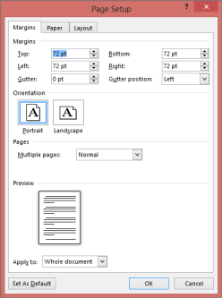
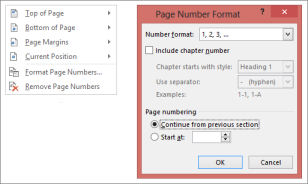

# Working with Sections

WSection class represents a single section in a document. Every section is a region with its own PageSetup Options, HeadersFooters, and ChildEntities (all text body items) Collection.

A valid section must contain at least one empty paragraph. Each section has its own page setup. Page setup of a section is accessible through the PageSetup property of Essential DocIO. This property allows you to set the page size, orientation, margins, and so on.

## DocIO section has four different collections:

* Paragraphs: Represents the collection of a paragraph in the current section.
* Tables: Represents the collection of a table in the current section.
* ChildEntities: Represents the TextBody and collection of HeadersFooters in the current section.
* Columns: Represents the collection of columns in the current section.

Each section has its own header and footer that are set by using the HeadersFooters property. 

Document sections are divided by section breaks that define where the sections start. This is specified by using the BreakCode property.

* NewColumn: Section starts from a new column.
* NewPage: Section starts from a new page.
* EvenPage: Section starts from a new even page.
* OddPage: Section starts from a new odd page.
* NoBreak: Section continues from the current page.

The following screenshot illustrates the breaks accessible through the Insert menu in the Microsoft Word Break dialog box.

Public Constructors

_Public Constructors_

<table>
<tr>
<th>
Constructor Name</th><th>
Description</th></tr>
<tr>
<td>
WSection.WSection (IWordDocument)</td><td>
Initializes a new instance of the WSection class.  </td></tr>
</table>
Public Properties

_Public Properties_

<table>
<tr>
<th>
Property Name</th><th>
Description</th></tr>
<tr>
<td>
Body</td><td>
Gets the section body information as WTextBody instance.  </td></tr>
<tr>
<td>
BreakCode</td><td>
Gets or sets the section break code information.  </td></tr>
<tr>
<td>
ChildEntities</td><td>
Gets child entities preserved in the current section as EntityCollection instance.  </td></tr>
<tr>
<td>
Columns</td><td>
Gets collection of columns that logically divide a page based on printing or publishing areas as ColumnCollection instance.</td></tr>
<tr>
<td>
EntityType</td><td>
Specifies the type of the entity.  </td></tr>
<tr>
<td>
HeadersFooters</td><td>
Gets headers or footers of current section.  </td></tr>
<tr>
<td>
PageSetup</td><td>
Gets page setup of current section such as margin and page size.  </td></tr>
<tr>
<td>
Paragraphs</td><td>
Gets collections of paragraphs in the section as IWParagraphCollection instance.</td></tr>
<tr>
<td>
Tables</td><td>
Gets collections of tables in the sections as IWTableCollection instance.</td></tr>
</table>
Public Methods

_Public Methods_

<table>
<tr>
<th>
Method Name</th><th>
Description</th></tr>
<tr>
<td>
AddColumn</td><td>
Adds a new column to the section.  </td></tr>
<tr>
<td>
AddParagraph</td><td>
Adds a new paragraph to the section.  </td></tr>
<tr>
<td>
AddTable</td><td>
Adds a new table to the section.  </td></tr>
<tr>
<td>
Clone</td><td>
Clones itself.  </td></tr>
<tr>
<td>
MakeColumnsEqual</td><td>
Makes all columns in current section to be of equal width.  </td></tr>
</table>
The following code example illustrates how to create a simple Word document, and add sections and breaks to it.


//Creates a new Word document.IWordDocument doc = new WordDocument();//Adds the section into Word document.IWSection section = doc.AddSection();//Adds a paragraph to created section.IWParagraph paragraph = section.AddParagraph();//Appends the text to the created paragraph.paragraph.AppendText("Text Body_Text");//Sets Page break.paragraph.ParagraphFormat.PageBreakAfter = true;paragraph = section.AddParagraph();paragraph.AppendText("[ After PAGE BREAK ] \rText Body_Text");section = doc.AddSection();//Sets Section break.section.BreakCode = SectionBreakCode.NewPage;paragraph = section.AddParagraph();paragraph.AppendText("[ After SECTION BREAK ( New page ) ] \rText Body_Text");section = doc.AddSection();section.BreakCode = SectionBreakCode.NoBreak;paragraph = section.AddParagraph();paragraph.AppendText("[ After SECTION BREAK ( continuous page ) ] \rText Body_Text");


'Creates a new Word document.Dim doc As IWordDocument = New WordDocument()‘Adds the section into Word document.Dim section As IWSection = doc.AddSection()‘Adds paragraph to created section.Dim paragraph As IWParagraph = section.AddParagraph()‘Appends the text to the created paragraph.paragraph.AppendText("Text Body_Text")'Sets Page break.paragraph.ParagraphFormat.PageBreakAfter = Trueparagraph = section.AddParagraph()paragraph.AppendText("[ After PAGE BREAK ] " and Constants.VB.NETCr and "Text Body_Text")section = doc.AddSection()'Sets Section break.section.BreakCode = SectionBreakCode.NewPageparagraph = section.AddParagraph()paragraph.AppendText("[ After SECTION BREAK ( New page ) ] " and Constants.VB.NETCr and "Text Body_Text")section = doc.AddSection()section.BreakCode = SectionBreakCode.NoBreakparagraph = section.AddParagraph()paragraph.AppendText("[ After SECTION BREAK ( continuous page ) ] " and Constants.VB.NETCr and "Text Body_Text")


## Working with Headers and Footers

Headers and Footers are displayed at the top and bottom of document pages respectively. Headers can have the title of a book in all the pages, and footers can have the current page number and page count in all the pages. Headers and Footers can also include text, graphics, and nearly any other information that can be contained by a document.

Each document section has its own set of headers or footers. Each section also has different headers on the first, odd or even pages.

You can set the header and footer by using the HeadersFooters property of the section. HeadersFooters property returns the instance of the WHeadersFooters type. To access a particular header or footer, you can use the following properties of the WHeadersFooters class.

* FirstPageHeader: Represents the first page header of a section.
* FirstPageFooter: Represents the first page footer of a section.
* OddHeader or Header: Represents the odd page header and it acts as a default header of a section.
* OddFooter or Footer: Represents the odd page footer and it acts as a default footer of a section.
* EvenHeader: Represents the even page header of a section.
* Even Footer: Represents the even page footer of a section.

The following properties return the instance of the HeaderFooter type.

Public Properties

_Public Properties_

<table>
<tr>
<th>
Property Name</th><th>
Description</th></tr>
<tr>
<td>
EvenFooter</td><td>
Gets the even footer information as HeaderFooter instance. </td></tr>
<tr>
<td>
EvenHeader</td><td>
Gets the even header information as HeaderFooter instance.</td></tr>
<tr>
<td>
FirstPageFooter</td><td>
Gets the first page footer information as HeaderFooter instance.  </td></tr>
<tr>
<td>
FirstPageHeader</td><td>
Gets the first page header information as HeaderFooter instance.  </td></tr>
<tr>
<td>
Footer</td><td>
Gets the default footer information as HeaderFooter instance.  </td></tr>
<tr>
<td>
Header</td><td>
Gets the default header information as HeaderFooter instance.  </td></tr>
<tr>
<td>
IsEmpty</td><td>
Detects whether all headers or footers are empty. </td></tr>
<tr>
<td>
OddFooter</td><td>
Gets the odd footer information as HeaderFooter instance (This is also the default footer).</td></tr>
<tr>
<td>
OddHeader</td><td>
Gets the odd header information as HeaderFooter instance (This is also the default header). </td></tr>
<tr>
<td>
LinkToPrevious</td><td>
Links to a previous section's header and footer.</td></tr>
</table>
Public Methods

_Public Methods_

<table>
<tr>
<th>
Method Name</th><th>
Description</th></tr>
<tr>
<td>
GetEnumerator</td><td>
Returns an enumerator that iterates through a collection.  </td></tr>
</table>

### HeaderFooter Class

The HeaderFooter class represents the page header or footer. It is inherited from the WTextBody, and hence can hold other paragraphs inside.

Public Properties

_Public Properties_

<table>
<tr>
<th>
Property Name</th><th>
Description</th></tr>
<tr>
<td>
EntityType</td><td>
Specifies the type of the entity.  </td></tr>
</table>
The following code example illustrates how to add text to different types of headers and footers.


//Creates a new document.WordDocument document = new WordDocument();//Adds the first section to the document.IWSection section = document.AddSection();//Adds a paragraph to the section.IWParagraph paragraph = section.AddParagraph();//Sets DifferentFirstPage and DifferentOddEvenPages to true for inserting Header and Footer text.section.PageSetup.DifferentFirstPage = true;section.PageSetup.DifferentOddAndEvenPages = true;//Appends some text to the first page in document.paragraph.AppendText("\r\r[ First Page ] \r\rText Body_Text Body_Text Body_Text Body_Text Body_Text Body");paragraph.ParagraphFormat.PageBreakAfter = true;//Appends some text to the second page in document.paragraph = section.AddParagraph();paragraph.AppendText("\r\r[ Second Page ] \r\rText Body_Text Body_Text Body_Text Body_Text Body_Text Body");paragraph.ParagraphFormat.PageBreakAfter = true;//Appends some text to the third page in document.paragraph = section.AddParagraph();paragraph.AppendText("\r\r[ Third Page ] \r\rText Body_Text Body_Text Body_Text Body_Text Body_Text Body");//Inserts First Page Header.paragraph = new WParagraph(document);paragraph.AppendText("[ FIRST PAGE Header ]");section.HeadersFooters.FirstPageHeader.Paragraphs.Add(paragraph);//Inserts First Page Footer.paragraph = new WParagraph(document);paragraph.AppendText("[ FIRST PAGE Footer ]");section.HeadersFooters.FirstPageFooter.Paragraphs.Add(paragraph);//Inserts Odd Pages Header.paragraph = new WParagraph(document);paragraph.AppendText("[ ODD Page Header Text goes here ]");section.HeadersFooters.OddHeader.Paragraphs.Add(paragraph);//Inserts Odd Pages Footer.paragraph = new WParagraph(document);paragraph.AppendText("[ ODD Page Footer Text goes here ]");section.HeadersFooters.OddFooter.Paragraphs.Add(paragraph);//Inserts Even Pages Header.paragraph = new WParagraph(document);paragraph.AppendText("[ EVEN Page Header Text goes here ]");section.HeadersFooters.EvenHeader.Paragraphs.Add(paragraph);//Inserts Even Pages Footer.paragraph = new WParagraph(document);paragraph.AppendText("[ EVEN Page Footer Text goes here ]");section.HeadersFooters.EvenFooter.Paragraphs.Add(paragraph);//Adds the second section to the document.section = document.AddSection();section.PageSetup.DifferentFirstPage = true;//Appends some text to the Second Sections's first page in the document.paragraph = section.AddParagraph();paragraph.AppendText("\r\r[ First Page for SECOND SECTION ]\r[ ON DIFFERENT FIRTS PAGE ]\r\rText Body_Text Body_Text Body_Text Body_Text Body_Text Body");paragraph.ParagraphFormat.PageBreakAfter = true;//Appends some text to the Second Sections's second page in the document.paragraph = section.AddParagraph();paragraph.AppendText("\r\r[ Second Page for SECOND SECTION ]\rText Body_Text Body_Text Body_Text Body_Text Body_Text Body");//Inserts Second Sections's First Header.paragraph = new WParagraph(document);paragraph.AppendText("[ SECOND SECTION FIRST PAGE Header ]");section.HeadersFooters.FirstPageHeader.Paragraphs.Add(paragraph);//Inserts Second Sections's First Footer.paragraph = new WParagraph(document);paragraph.AppendText("[ SECOND SECTION FIRST PAGE Footer ]");section.HeadersFooters.FirstPageFooter.Paragraphs.Add(paragraph);//Inserts Second Sections's Header.paragraph = new WParagraph(document);paragraph.AppendText("SECOND SECTION Header Text goes here");section.HeadersFooters.OddHeader.Paragraphs.Add(paragraph);//Inserts Second Sections's Footer.paragraph = new WParagraph(document);paragraph.AppendText("SECOND SECTION Footer Text goes here");section.HeadersFooters.OddFooter.Paragraphs.Add(paragraph);//Saves the document to disk.document.Save("Sample.doc", FormatType.Doc);


'Creates a new document.Dim document As WordDocument = New WordDocument()'Adds the first section to the document.Dim section As IWSection = document.AddSection()'Adds a paragraph to the section.Dim paragraph As IWParagraph = section.AddParagraph()'Sets DifferentFirstPage and DifferentOddEvenPages as true for inserting Header and Footer text.section.PageSetup.DifferentFirstPage = Truesection.PageSetup.DifferentOddAndEvenPages = True'Appends some text to the first page in document.paragraph.AppendText(Constants.VB.NETCr + Constants.VB.NETCr and "[ First Page ] " and Constants.VB.NETCr + Constants.VB.NETCr and "Text Body_Text Body_Text Body_Text Body_Text Body_Text Body")paragraph.ParagraphFormat.PageBreakAfter = True'Appends some text to the second page in document.paragraph = section.AddParagraph()paragraph.AppendText(Constants.VB.NETCr + Constants.VB.NETCr and "[ Second Page ] " and Constants.VB.NETCr + Constants.VB.NETCr and "Text Body_Text Body_Text Body_Text Body_Text Body_Text Body")paragraph.ParagraphFormat.PageBreakAfter = True'Appends some text to the third page in document.paragraph = section.AddParagraph()paragraph.AppendText(Constants.VB.NETCr + Constants.VB.NETCr and "[ Third Page ] " and Constants.VB.NETCr + Constants.VB.NETCr and "Text Body_Text Body_Text Body_Text Body_Text Body_Text Body")'Inserts First Page Header.paragraph = New WParagraph(document)paragraph.AppendText("[ FIRST PAGE Header ]")section.HeadersFooters.FirstPageHeader.Paragraphs.Add(paragraph)'Inserts First Page Footer.paragraph = New WParagraph(document)paragraph.AppendText("[ FIRST PAGE Footer ]")section.HeadersFooters.FirstPageFooter.Paragraphs.Add(paragraph)'Inserts Odd Pages Header.paragraph = New WParagraph(document)paragraph.AppendText("[ ODD Page Header Text goes here ]")section.HeadersFooters.OddHeader.Paragraphs.Add(paragraph)'Inserts Odd Pages Footer.paragraph = New WParagraph(document)paragraph.AppendText("[ ODD Page Footer Text goes here ]")section.HeadersFooters.OddFooter.Paragraphs.Add(paragraph)'Inserts Even Pages Header.paragraph = New WParagraph(document)paragraph.AppendText("[ EVEN Page Header Text goes here ]")section.HeadersFooters.EvenHeader.Paragraphs.Add(paragraph)'Inserts Even Pages Footer.paragraph = New WParagraph(document)paragraph.AppendText("[ EVEN Page Footer Text goes here ]")section.HeadersFooters.EvenFooter.Paragraphs.Add(paragraph)'Adds the second section to the document.section = document.AddSection()section.PageSetup.DifferentFirstPage = True'Appends some text to the Second Sections's first page in the document.paragraph = section.AddParagraph()paragraph.AppendText(Constants.VB.NETCr + Constants.VB.NETCr and "[ First Page for SECOND SECTION ]" and Constants.VB.NETCr and "[ ON DIFFERENT FIRTS PAGE ]" and Constants.VB.NETCr + Constants.VB.NETCr and "Text Body_Text Body_Text Body_Text Body_Text Body_Text Body")paragraph.ParagraphFormat.PageBreakAfter = True'Appends some text to the Second Sections's second page in the document.paragraph = section.AddParagraph()paragraph.AppendText(Constants.VB.NETCr + Constants.VB.NETCr and "[ Second Page for SECOND SECTION ]" and Constants.VB.NETCr and "Text Body_Text Body_Text Body_Text Body_Text Body_Text Body")'Inserts Second Sections's First Header.paragraph = New WParagraph(document)paragraph.AppendText("[ SECOND SECTION FIRST PAGE Header ]")section.HeadersFooters.FirstPageHeader.Paragraphs.Add(paragraph)'Inserts Second Sections's First Footer.paragraph = New WParagraph(document)paragraph.AppendText("[ SECOND SECTION FIRST PAGE Footer ]")section.HeadersFooters.FirstPageFooter.Paragraphs.Add(paragraph)'Inserts Second Sections's Header.paragraph = New WParagraph(document)paragraph.AppendText("SECOND SECTION Header Text goes here")section.HeadersFooters.OddHeader.Paragraphs.Add(paragraph)'Inserts Second Sections's Footer.paragraph = New WParagraph(document)paragraph.AppendText("SECOND SECTION Footer Text goes here")section.HeadersFooters.OddFooter.Paragraphs.Add(paragraph)'Saves the document to disk.document.Save("Sample.doc", FormatType.Doc)


DocIO provides options to link the header or footer of a section to the corresponding header or footer in the previous section by using the LinkToPrevious property. This option is available in the Header or Footer toolbar in Microsoft Word. By default, this property is set to True.

N> LinToPrevious property always returns false for the first section, since there is no previous section for the first section.

The following code example illustrates how to turn on this option by using DocIO.


doc.AddSection().HeadersFooters.LinkToPrevious = true;


doc.AddSection().HeadersFooters.LinkToPrevious = True


## Specifying Page Properties

The following screenshot illustrates the various page setup options accessible through the PageLayout menu in Microsoft Word.

Page Setup of a section is accessible through the PageSetup property of Essential DocIO. This property allows you to set page size, orientation, margins, and so on.

_PageSetup Properties_

<table>
<tr>
<th>
Property Name</th><th>
Description</th></tr>
<tr>
<td>
Bidi</td><td>
Gets or sets a value indicating whether a section contains right-to-left text.</td></tr>
<tr>
<td>
Borders</td><td>
Gets information on page borders as Borders instance.</td></tr>
<tr>
<td>
ClientWidth</td><td>
Gets the width of client area.  </td></tr>
<tr>
<td>
DifferentFirstPage</td><td>
Specifies whether the current section has a different header or footer for first page.</td></tr>
<tr>
<td>
DifferentOddAndEvenPages</td><td>
Specifies whether a document has different headers and footers for odd-numbered and even-numbered pages.</td></tr>
<tr>
<td>
FooterDistance</td><td>
Gets or sets the footer height in points.</td></tr>
<tr>
<td>
HeaderDistance</td><td>
Gets or sets the header height in points.</td></tr>
<tr>
<td>
IsFrontPageBorder</td><td>
Gets or sets a value indicating whether the current instance is the front page border.</td></tr>
<tr>
<td>
LineNumberingDistanceFromText</td><td>
Gets or sets the distance from text in lines numbering.</td></tr>
<tr>
<td>
LineNumberingMode</td><td>
Gets or sets the line numbering mode. </td></tr>
<tr>
<td>
LineNumberingStartValue</td><td>
Gets or sets the line numbering start value.</td></tr>
<tr>
<td>
LineNumberingStep</td><td>
Gets or sets the line numbering step. </td></tr>
<tr>
<td>
Margins</td><td>
Gets or sets the page margins in points.  </td></tr>
<tr>
<td>
Orientation</td><td>
Gets or sets the orientation of a page.  </td></tr>
<tr>
<td>
PageBorderOffsetFrom</td><td>
Gets or sets the page border position.</td></tr>
<tr>
<td>
PageBordersApplyType</td><td>
Gets or sets the value which specifies on which pages border has been applied to the document.</td></tr>
<tr>
<td>
PageSize</td><td>
Gets or sets the page size in points.</td></tr>
<tr>
<td>
VerticalAlignment</td><td>
Gets or sets vertical alignment.</td></tr>
</table>

The following code example illustrates how to use Page Setup options.


//Creates a new Word document.IWordDocument doc = new WordDocument();IWSection section = doc.AddSection();//Sets page setup options.section.PageSetup.Borders.BorderType = BorderStyle.DashLargeGap;section.PageSetup.Borders.Color = Color.DeepPink;section.PageSetup.PageBorderOffsetFrom = PageBorderOffsetFrom.PageEdge;section.PageSetup.Borders.LineWidth = 2;


'Creates a new Word document.Dim doc As IWordDocument = New WordDocument()Dim section As IWSection = doc.AddSection()'Sets page setup options.section.PageSetup.Borders.BorderType = BorderStyle.DashLargeGapsection.PageSetup.Borders.Color = Color.DeepPinksection.PageSetup.PageBorderOffsetFrom = PageBorderOffsetFrom.PageEdgesection.PageSetup.Borders.LineWidth = 2


## Adding Page Numbers

You can insert page numbers of different formats such as Arabic numerals, Roman numerals, and so on, to the pages in the document. It is also possible to restart the page numbers from any section, and change the starting number of the page number for each section. This is equivalent to the Insert -> Page Numbers -> Format option of Microsoft Word.


section.PageSetup.PageStartingNumber = 3;section.PageSetup.RestartPageNumbering = true;sections.PageSetup.PageNumberStyle = PageNumberStyle.Arabic;



section.PageSetup.PageStartingNumber = 3section.PageSetup.RestartPageNumbering = Truesections.PageSetup.PageNumberStyle = PageNumberStyle.Arabic


The following screenshot shows the page number option of Microsoft Word.

