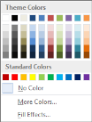
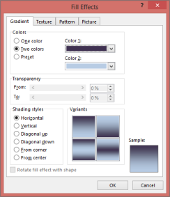

# Working with Word Documents

You can open, modify, and create Microsoft Word documents by using the WordDocument class. WordDocument class has a structure similar to the Microsoft Word document.

###  Public Properties

<table>
<tr>
<th>
Property Name</th><th>
Description</th></tr>
<tr>
<td>
Background</td><td>
Applies background color, image, texture, or gradient to the entire Word document.</td></tr>
<tr>
<td>
DefaultTabWidth</td><td>
Gets or sets the width of the default tab in the document.</td></tr>
<tr>
<td>
Bookmarks</td><td>
Gets collection of bookmarks preserved in the Word document.</td></tr>
<tr>
<td>
BuiltinDocumentProperties</td><td>
Gets information on Built-in document properties.</td></tr>
<tr>
<td>
ChildEntities</td><td>
Gets collection of sections preserved in the document.</td></tr>
<tr>
<td>
CustomDocumentProperties</td><td>
Gets information on document custom properties.</td></tr>
<tr>
<td>
EndnoteNumberFormat</td><td>
Gets or sets information on endnote numbering format such as upper case, lower case, and so on.</td></tr>
<tr>
<td>
EndnotePosition</td><td>
Gets or sets information on endnote position in the document.</td></tr>
<tr>
<td>
EntityType</td><td>
Gets the entity type information. </td></tr>
<tr>
<td>
FootnoteNumberFormat</td><td>
Gets or sets information on footnote numbering format such as upper case, lower case, and so on.</td></tr>
<tr>
<td>
FootnotePosition</td><td>
Gets or sets the footnote position in the document.</td></tr>
<tr>
<td>
InitialEndnoteNumber</td><td>
Gets or sets information on initial endnote number.</td></tr>
<tr>
<td>
InitialFootnoteNumber</td><td>
Gets or sets information on initial footnote number.</td></tr>
<tr>
<td>
LastParagraph</td><td>
Gets information on last section object in the document.</td></tr>
<tr>
<td>
LastSection</td><td>
Gets information on last section preserved in the document.</td></tr>
<tr>
<td>
ListStyles</td><td>
Gets information on document list styles.</td></tr>
<tr>
<td>
MailMerge</td><td>
Gets information on the mail merge engine.</td></tr>
<tr>
<td>
ProtectionType</td><td>
Gets or sets protection type for the document.</td></tr>
<tr>
<td>
RestartIndexForEndnote</td><td>
Gets or sets restart index for endnotes.</td></tr>
<tr>
<td>
RestartIndexForFootnotes</td><td>
Gets or sets restart index for footnotes.</td></tr>
<tr>
<td>
Sections</td><td>
Gets collections of sections in the document.  </td></tr>
<tr>
<td>
Styles</td><td>
Gets collections of styles preserved in the document.</td></tr>
<tr>
<td>
TextBoxes</td><td>
Adds, removes, and gets text boxes preserved in the document.</td></tr>
<tr>
<td>
ThrowExceptionsForUnsupportedElements</td><td>
Gets or sets a value indicating whether to throw exceptions for unsupported elements. </td></tr>
<tr>
<td>
ViewSetup</td><td>
Gets information on view setup options in Microsoft Word.</td></tr>
<tr>
<td>
Watermark</td><td>
Gets or sets watermarks preserved in the document or specify watermarks for a Word document.</td></tr>
<tr>
<td>
FontSubtitutionTable</td><td>
Adds or gets information on font substitution in the Word document that represents the font substitution table.To add the uninstalled font in the font substitution table, you must use the font name as the key and corresponding alternate font name that is already installed in the system.</td></tr>
<tr>
<td>
HasMacros</td><td>
Determines whether the document has Macros.</td></tr>
<tr>
<td>
AttachedTemplate</td><td>
Gets information on attached template document.</td></tr>
<tr>
<td>
UpdateStylesOnOpen</td><td>
Gets or sets information about automatic style updates to the document from the attached template each time when the document is opened.</td></tr>
<tr>
<td>
Footnotes</td><td>
Gets or sets footnote separators.</td></tr>
<tr>
<td>
Endnotes</td><td>
Gets or sets endnote separators.</td></tr>
<tr>
<td>
HasChanges</td><td>
Specifies whether the document has any revision changes.</td></tr>
<tr>
<td>
TrackChanges</td><td>
Turns on revision tracking for a Word document.</td></tr>
<tr>
<td>
HTMLImportSettings</td><td>
Gets or sets HTML Import settings for HTML to Doc conversion.</td></tr>
<tr>
<td>
ActualFormatType</td><td>
Gets information on actual format type of the document.</td></tr>
</table>

### Public Constructors

<table>
<tr>
<th>
Constructor Name</th><th>
Description</th></tr>
<tr>
<td>
WordDocument.WordDocument ()</td><td>
Initializes a new instance of the WordDocument class.</td></tr>
<tr>
<td>
WordDocument.WordDocument (Stream)</td><td>
Initializes a new instance of the WordDocument class from the stream.</td></tr>
<tr>
<td>
WordDocument.WordDocument (Stream, FormatType, string)</td><td>
Initializes a new instance of the WordDocument class from the stream of specified type, protected with password.</td></tr>
<tr>
<td>
WordDocument.WordDocument (Stream, string)</td><td>
Initializes a new instance of the WordDocument class from the Word document’s stream that is protected with password.</td></tr>
<tr>
<td>
WordDocument.WordDocument (string)</td><td>
Initializes a new instance of the WordDocument class from Word document.</td></tr>
<tr>
<td>
WordDocument.WordDocument (string, FormatType, string)</td><td>
Initializes a new instance of the WordDocument class from existing file of specified type protected with password.</td></tr>
<tr>
<td>
WordDocument.WordDocument (string, string)</td><td>
Initializes a new instance of the WordDocument class from existing Word document that is protected with password.</td></tr>
</table>

### Public Methods

<table>
<tr>
<th>
Method Name</th><th>
Description</th></tr>
<tr>
<td>
AddListStyle</td><td>
Adds new list style to a document.  </td></tr>
<tr>
<td>
AddParagraphStyle</td><td>
Adds new paragraph style to a document.  </td></tr>
<tr>
<td>
AddSection</td><td>
Adds new section to a document.  </td></tr>
<tr>
<td>
Clone</td><td>
Clones the document by itself.  </td></tr>
<tr>
<td>
CreateParagraph</td><td>
Creates a new paragraph.  </td></tr>
<tr>
<td>
CreateParagraphItem</td><td>
Creates a new paragraph item instance.</td></tr>
<tr>
<td>
EnsureMinimal</td><td>
Adds an empty section to the document and an empty paragraph to a created section.</td></tr>
<tr>
<td>
Find</td><td>
Finds the first entry of specified string in a document.</td></tr>
<tr>
<td>
FindAll</td><td>
Finds all entries of specified string in a document.</td></tr>
<tr>
<td>
GetText</td><td>
Gets document's text as a single string object.  </td></tr>
<tr>
<td>
ImportContent</td><td>
Imports all content of specified document into the current document.</td></tr>
<tr>
<td>
ImportSection</td><td>
Imports the specified section into the current document.</td></tr>
<tr>
<td>
Open</td><td>
Opens Word document file.</td></tr>
<tr>
<td>
OpenAsync</td><td>
Opens the Word document file in Asynchronus method. (applicable only in WinRT, WPF, and Windows Phone 8 and later versions)</td></tr>
<tr>
<td>
Replace</td><td>
Replaces all entries of given string in a document. </td></tr>
<tr>
<td>
Save</td><td>
Saves WordDocument instance to the specified file format. </td></tr>
<tr>
<td>
SaveAsync</td><td>
Saves WordDocument instance to the specified file format in Asynchronous method. (applicable only in WinRT, WPF, and Windows Phone 8 and later versions).</td></tr>
<tr>
<td>
OpenReadOnly</td><td>
Opens a document in ReadOnly mode.</td></tr>
<tr>
<td>
UpdateDocumentFields</td><td>
Updates the fields present in a document.</td></tr>
<tr>
<td>
RemoveMacros</td><td>
Removes the macros in a document</td></tr>
<tr>
<td>
UpdateTableOfContents</td><td>
Updates the TOC field present in a document (applicable only for the platforms that support Word to PDF conversion).</td></tr>
<tr>
<td>
RenderAsImages</td><td>
Converts a Word document into an image file (applicable only for the platforms that support Word to PDF conversion).</td></tr>
<tr>
<td>
AcceptChanges</td><td>
Accepts the tracking changes of a document.</td></tr>
<tr>
<td>
RejectChanges</td><td>
Rejects the tracking changes of a document</td></tr>
<tr>
<td>
Protect</td><td>
Protects a document by setting the protection type and password.</td></tr>
<tr>
<td>
EncryptDocument</td><td>
Protects a Word document, and restricts anonymous users from viewing or accessing the content of a document by setting a password.</td></tr>
<tr>
<td>
RemoveEncryption</td><td>
Removes encryption by clearing the password</td></tr>
<tr>
<td>
UpdateWordCount</td><td>
Updates Paragraph Count, Word Count, and Character Count.</td></tr>
</table>

## Cloning a Word Document

By using Essential DocIO, you can create a copy of a whole Word document or a particular entity (such as WSection, WParagraph, WTable, WTextRange, etc.) by invoking the Clone method of the Entity. This method returns the shallow copy of the Entity that invoked the Clone method. By using this functionality, you can copy the whole document or part of its content along with its formatting from one document and add it to another document.

N> When source and destination documents have styles with the same names, then Guid is added as a suffix to the name of the imported styles in the destination document.

The following code example illustrates how to merge two documents by using the Clone method.



//Creates the first document.
IWordDocument doc = new WordDocument();
//Adds a section to the document.
IWSection section = doc.AddSection();
//Appends text to the paragraph.
IWTextRange text1 = section.AddParagraph().AppendText( "First document section..." );
//Applies text color.
text1.CharacterFormat.TextColor = Color.Red;
//Appends new paragraphs.
section.AddParagraph().AppendText( "Some Text..." );
section.AddParagraph().AppendText( "New Paragraph" );
section.AddParagraph().AppendText( "Third Paragraph" );
//Creates the second document.
IWordDocument doc2 = new WordDocument();
//Adds a section.
IWSection section2 = doc2.AddSection();
//Appends text to the paragraph.
IWTextRange text2 = section2.AddParagraph().AppendText( "Second document section..." );
//Applies text color.
text2.CharacterFormat.TextColor = Color.Blue;
//Appends new paragraphs.
section2.AddParagraph().AppendText( "Some Text..." );
section2.AddParagraph().AppendText( "New Paragraph More Text" );
section2.AddParagraph().AppendText( "Third Paragraph More Text" );
//Merges the second document with the first.
doc.Sections.Add( section2.Clone() );
//Saves the document to disk.
doc.Save("Sample.docx", FormatType.Word2013);


Creates the first document.
Dim doc As IWordDocument = New WordDocument()
'Adds a section to the document.
Dim section As IWSection = doc.AddSection()
'Appends text to the paragraph.
Dim text1 As IWTextRange = section.AddParagraph().AppendText("First document section...")
'Applies text color.
text1.CharacterFormat.TextColor = Color.Redsection.AddParagraph().AppendText("Some Text...")
section.AddParagraph().AppendText("New Paragraph")
section.AddParagraph().AppendText("Third Paragraph")
'Creates the second document.
Dim doc2 As IWordDocument = New WordDocument()
'Adds a section to the document.
Dim section2 As IWSection = doc2.AddSection()
'Appends text to the paragraph.
Dim text2 As IWTextRange = section2.AddParagraph().AppendText("Second document section...")
'Applies text color.
text2.CharacterFormat.TextColor = Color.Bluesection2.AddParagraph().AppendText("Some Text...")
section2.AddParagraph().AppendText("New Paragraph More Text")
section2.AddParagraph().AppendText("Third Paragraph More Text")
'Merges the second document with the first.
doc.Sections.Add(section2.Clone())
'Saves the document to disk.doc.Save("Sample.docx", FormatType.Word2013);



## Merging a Word document

ImportContent functionality is used to copy or merge content from one document to another; a section break distinguishes between the destination and the newly imported document contents. Compatibility options of the source document is not imported to the destination document. There are several overloads for this method.

You can use the ImportContent(WordDocument doc) method to import contents and styles from the source document to the destination document.

Use the ImportContent(WordDocument doc, bool importStyles) method to import contents from the source document to the destination document by specifying whether to import styles that have the same name between the source and destination document.

* When importStyles is set to true, all the contents and styles of the source document are imported to the destination document. In cases where a style in the source document has the same name as a style in the destination document, “Guid” is added as a suffix to the name of the imported style in order to preserve unique style name.
* When importStyles is set to false, all the contents are imported; but, the styles of the source document with style names that do not match with the styles in the destination document are not imported. When the style names match the destination style names, then the same name is applied to the imported contents. This behavior is similar to the Microsoft Word paste option – UseDestinationStyles.

Use the ImportContent(WordDocument doc, ImportOptions importOptions) method to import contents from the source document to the destination document with various import options similar to Microsoft Word copy and paste options. Following are the import options supported by Essential DocIO.

* KeepSourceFormatting—Imports the contents from the source document, applies the default style (Normal), and preserves all other formatting as direct formatting in order to preserve the contents as in source document. Header and footer contents will be imported similar to the UseDestinationStyles option.
* MergeFormatting—Imports the contents of the source document to the destination document, and applies the formatting of surrounding content to the destination document. Merges formatting of the contents surrounding it by preserving some of the source formatting (such as bold, italic, underline, and so on). Header and footer contents are imported similar to the UseDestinationStyles option.
* KeepTextOnly—Imports only the text from the source document to the destination document (tables, textboxes, pictures, headers, footers, and so on, are removed), similar to content copied from a text file (.txt).
* UseDestinationStyles—Imports the contents of the source document to the destination document, and applies the styles present in the destination document, or imports the source style to the destination document when there is no style with the same name in the destination document.

The following code example illustrates how to import contents from one document to another with various import options.



//Opens the destination Word document.
WordDocument destination = new WordDocument("Destination.doc");
//Opens the source Word document.
WordDocument source = new WordDocument("Source.doc");
//Imports contents with “KeepSourceFormatting” import option.
destination.ImportContent(source, ImportOptions.KeepSourceFormatting);
//Saves the document.
destination.Save("Sample.doc", FormatType.Doc);


 'Opens the destination Word document.
 Dim destination As New WordDocument("Destination.doc")
 'Opens the source Word document.
 Dim source As New WordDocument("Source.doc")
 'Imports the contents with import option keep source formatting.
 destination.ImportContent(source, ImportOptions.KeepSourceFormatting)
 'Saves the document.
 destination.Save("Sample.doc", FormatType.Doc)



## Protecting a Word Document

This section provides information about how to restrict anonymous users from viewing and accessing the content of the document by using Essential DocIO APIs.

### Encrypting with Password

You can use the EncryptDocument method to protect a Word document with a password, and restrict anonymous users from viewing or accessing the content of the document. A password for encrypting a Word document is set in Microsoft Word through the Protect Document tab in the File menu.

Protect Document Dialog Box in Microsoft Word
{:.caption}

Decryption is the process of removing the restriction to view or access the contents of the password protected document by all the users. 

The following code example illustrates how to encrypt and decrypt a Word document.



//Encrypts the Word document with a password.
document.EncryptDocument(password);
//Opens the encrypted Word document.
WordDocument document = new WordDocument(filename, password);


'Encrypts the Word document with a password.
document.EncryptDocument(password)
'Opens the encrypted Word document.
Dim document As New WordDocument(filename, password)



N> Essential DocIO does not support encryption and decryption techniques of Microsoft Word 2013 format documents in Silverlight platform.

### Restricting Editing

Essential DocIO provides support to restrict a Word document from editing. All the users can view the contents of the document, but editing is restricted based on the contents. In Microsoft Word, a document is protected through the Restrict Editing option in the Review menu.

Restrict Editing Dialog Box in Microsoft Word
{:.caption}

DocIO supports such protection while reading and writing Word documents for both .doc and .docx formats, and this can be provided through the following APIs.

* AllowOnlyComments: Allows you to modify the comments in the document.
* AllowOnlyFormFields: Allows you to modify the form field values in the document.
* AllowOnlyRevisions: Allows you to accept or reject the revisions in the document.
* AllowOnlyReading: Allows you to view the document.
* NoProtection: Disables protection of document and allows you to access and edit the document contents.

You can restrict a Word document from editing either by providing a password or without password by using Essential DocIO. You can easily modify document protection type by using the WordDocument.ProtectionType property.

The following code example illustrates how to set the protection type for a document.



//Loads a Word document.
IWordDocument doc = new WordDocument("sample.doc");
//Sets protection with password, and allows to only add comments to the document.
doc.Protect(ProtectionType.AllowOnlyComments,"password");
//Saves the Word document.
doc.Save( "Protection.doc" );


'Loads a Word document.
Dim doc As IWordDocument = New WordDocument("sample.doc")
'Sets protection with password, and allows only add comments to the document.
doc.Protect(ProtectionType.AllowOnlyComments,"password")
'Saves the Word document.
doc.Save("Protection.doc")



## Working with Document Properties

Document Properties contain general information about the document such as author of the document, subject, character count, word count, page count, creation date, and so on.

To view or edit the document properties, go to File menu and click Properties in Microsoft Word. The Document Properties dialog box appears as follows.

Document Properties Dialog Box
{:.caption}

The Document Properties dialog box contains the following tabs.

* General (not editable): Contains general document information such as file name, type, size, location, creation, modification, and access date.
* Summary (editable): Sets or modifies the document properties such as author name, title, company, subject, keywords, and so on.
* Statistics (not editable): Displays the statistics of the document such as creation, modification, access and print dates, revision number, characters, words, pages number, and so on.
* Contents (not editable): Displays the content of the document.
* Custom (editable): Enables you to create your own properties combining their name, type, and value. For example, to mark a document as "Checked", you can create a custom property with the Name as "Checked", Type as "Text", and Value as "your name".

### Built-in document properties

BuiltinDocumentProperties class represents all document properties, excepting custom properties.

### Class Hierarchy


SummaryDocumentProperties

|

BuiltinDocumentProperties


### Public Properties

<table>
<tr>
<th>
Property Name</th><th>
Description</th></tr>
<tr>
<td>
BytesCount</td><td>
Represents the number of bytes in a document.</td></tr>
<tr>
<td>
Category</td><td>
Gets or sets the category of a document.</td></tr>
<tr>
<td>
Company</td><td>
Gets or sets information on Company property.</td></tr>
<tr>
<td>
HiddenCount</td><td>
Gets or sets information on hidden count.</td></tr>
<tr>
<td>
LinesCount</td><td>
Gets the number of lines in a document.</td></tr>
<tr>
<td>
Manager</td><td>
Gets or sets information regarding the Manager of the company.</td></tr>
<tr>
<td>
NoteCount</td><td>
Gets the information on Note count.</td></tr>
<tr>
<td>
ParagraphCount</td><td>
Gets the number of paragraphs in a document.</td></tr>
<tr>
<td>
SlideCount</td><td>
Gets the slide count.</td></tr>
</table>

### Public Methods

<table>
<tr>
<th>
Method Name</th><th>
Description</th></tr>
<tr>
<td>
Clone</td><td>
 Clones itself.</td></tr>
</table>

The following code example illustrates how to get, set, and modify Document Properties.



//Initializes Word document object.
WordDocument doc = new WordDocument();
//Opens a Word document.
doc.Open( "DocumentProperties.doc" );
//Retrieves document property values.
string author = doc.BuiltinDocumentProperties.Author;
int bytesCount = doc.BuiltinDocumentProperties.BytesCount;
//Sets document properties.
doc.BuiltinDocumentProperties.Keywords += "document properties";
doc.BuiltinDocumentProperties.Author = "Author's name";
doc.BuiltinDocumentProperties.Comments = "Document comments";


'Initializes Word document object.
Dim doc As New WordDocument()
'Opens a Word document.
doc.Open("DocumentProperties.doc")
'Retrieves document property values.
Dim author As String = doc.BuiltinDocumentProperties.AuthorDim bytesCount As Integer = doc.BuiltinDocumentProperties.BytesCount
'Sets document properties.
doc.BuiltinDocumentProperties.Keywords and= "document properties"doc.BuiltinDocumentProperties.Author = "Author's name"doc.BuiltinDocumentProperties.Comments = "Document comments"



### Custom Document Properties

CustomDocumentProperties class enables you to create and save your own custom properties. It contains a collection of DocumentProperty instances. You can access a document property by indexing, that is, by specifying the property name or index.

Custom Tab in Document Properties Dialog Box
{:.caption}

### Public Properties

<table>
<tr>
<th>
Property Name</th><th>
Description</th></tr>
<tr>
<td>
Count</td><td>
Gets number of custom document properties in a document.</td></tr>
</table>

### Public Methods

<table>
<tr>
<th>
Method Name</th><th>
Description</th></tr>
<tr>
<td>
Add</td><td>
Adds a new custom property to a document.</td></tr>
<tr>
<td>
Clone</td><td>
Clones itself.</td></tr>
<tr>
<td>
Remove</td><td>
Removes custom property in a document.  </td></tr>
</table>

### DocumentProperty

This class represents each custom document property.

### Public Methods

<table>
<tr>
<th>
Method Name</th><th>
Description</th></tr>
<tr>
<td>
Clone</td><td>
Clones itself.</td></tr>
<tr>
<td>
ToBool</td><td>
Converts value to Boolean.</td></tr>
<tr>
<td>
ToByteArray</td><td>
Converts value to byte array.</td></tr>
<tr>
<td>
ToDateTime</td><td>
Converts value to DateTime.</td></tr>
<tr>
<td>
ToFloat</td><td>
Converts value to float.</td></tr>
<tr>
<td>
ToInt</td><td>
Converts value to integer.</td></tr>
<tr>
<td>
ToString</td><td>
Converts value to string.</td></tr>
</table>

The following code example illustrates how to get or set the existing custom document properties, and also add new custom document properties.



WordDocument doc = new WordDocument();
doc.Open( "DocumentProperties.doc" );
//Gets custom property value.
int phoneNumber = doc.CustomDocumentProperties["Telephone number "].ToInt();
//Sets existent custom property value.
doc.CustomDocumentProperties["Check by"].Value = "user name";
//Adds new custom property.
DateTime completedDate = DateTime.Now;doc.CustomDocumentProperties.Add( "Date completed", completedDate );


Dim doc As New WordDocument()doc.Open("DocumentProperties.doc")
‘Gets custom property value.
Dim phoneNumber As Integer = doc.CustomDocumentProperties("Telephone number ").ToInt()
‘Sets existent custom property value.
doc.CustomDocumentProperties("Check by").Value = "user name"‘Adds new custom property.
Dim completedDate As DateTime = DateTime.Nowdoc.CustomDocumentProperties.Add("Date completed", completedDate)



## Working with Styles

Essential DocIO provides support to create a new style, and then apply the newly created style to a document by adding it to the document styles collection. 

The following code example illustrates how to create a new style and apply it to a Word document.



//Creates Paragraph styles.
WParagraphStyle style = document.AddParagraphStyle("Heading 1") as WParagraphStyle;
//Applies the base style.
style.ApplyBaseStyle("Normal");
//Applies character formats.
style.CharacterFormat.FontName = "Calibri Light";
style.CharacterFormat.FontSize = 16f;
style.CharacterFormat.TextColor = System.Drawing.Color.FromArgb(46,116,181);
//Applies paragraph formats.
style.ParagraphFormat.BeforeSpacing = 12;style.ParagraphFormat.AfterSpacing = 0;
style.ParagraphFormat.Keep = true;style.ParagraphFormat.KeepFollow = true;
style.ParagraphFormat.OutlineLevel = OutlineLevel.Level1;


'Creates Paragraph styles.
Dim style As WParagraphStyle = document.AddParagraphStyle("Heading 1") As WParagraphStyle
'Applies the base style.
style.ApplyBaseStyle("Normal")
'Applies character formats.
style.CharacterFormat.FontName = "Calibri Light"style.CharacterFormat.FontSize = 16fstyle.CharacterFormat.TextColor = System.Drawing.Color.FromArgb(46,116,181)
'Applies paragraph formats.
style.ParagraphFormat.BeforeSpacing = 12
style.ParagraphFormat.AfterSpacing = 0
style.ParagraphFormat.Keep = Truestyle.ParagraphFormat.KeepFollow = Truestyle.ParagraphFormat.OutlineLevel = OutlineLevel.Level1



## Setting the Background for a Document

Background class represents the background effects in a Word document.

To set the background effects in a Microsoft Word document, open the Design menu, and choose the PageBackground. The following are the background effects available in Microsoft Word.

* Fill Color
* Fill Effects (Gradient, Texture, Pattern, Picture)

Background colors in the Word Document
{:.caption}

#### Document Color

Background class represents the background color and fill effects in a Word document. The type of the background effect is defined by using the Type property. This property can take the following variants:

* NoBackground: No background fill effect.
* Gradient: Gradient fill effect.
* Picture: Insert a picture as the document background.  
* Texture: Insert a picture as the.
* Color: Color fill effect.

N> Pattern fill effect is currently not supported by Essential DocIO.

By using the WordDocument.Background property, you can access the document background. The Background property of WordDocument is automatically initialized with the Type property of the Background set to NoBackground.

### Public Properties

<table>
<tr>
<th>
Property Name</th><th>
Description</th></tr>
<tr>
<td>
Color</td><td>
Gets or sets the background color for a document.</td></tr>
<tr>
<td>
Gradient</td><td>
Gets or sets the background gradient for a document.</td></tr>
<tr>
<td>
Picture</td><td>
Gets or sets the background picture for a document.  </td></tr>
<tr>
<td>
Type</td><td>
Specifies the type of the background effect for a document.</td></tr>
</table>

N> For more details on BackgroundGradient class, refer to the BackgroundGradient topic.

The following code example illustrates how to use the Background class.



//Opens the Template document.
IWordDocument doc1 = new WordDocument();
doc1.Open("Background.doc");
//Creates a new document.
IWordDocument doc2 = new WordDocument();
doc2.EnsureMinimal();
//Applies Document 1 background to the Document 2.
switch (doc1.Background.Type){    case BackgroundType.Gradient:        
//Applies Gradient color to the document background.    
    doc2.Background.Gradient = doc1.Background.Gradient.Clone();     
	break;    
	case BackgroundType.Picture:    case BackgroundType.Texture:     
	//Applies Texture/Picture to the document background.     
	doc2.Background.Picture = doc1.Background.Picture;     
	break;    case BackgroundType.Color:      
	//Applies Background color to the document.      
	doc2.Background.Color = doc1.Background.Color;      
	break;    default: break;}
	doc2.Background.Type = doc1.Background.Type;
	//Applies Background color to the document.
	doc1.Background.Type = BackgroundType.Color;
	doc1.Background.Color = Color.Red;
	//Saves the document.doc1.Save("Background.doc");
	doc2.Save("BackgroundNew.doc");


'Opens the Template document.
Dim doc As IWordDocument = New WordDocument()
doc1.Open("Background.doc")
'Creates a new document.
Dim doc2 As IWordDocument = New WordDocument()
doc2.EnsureMinimal()
‘Applies Document 1 background to the Document 2.
Select Case doc1.Background.TypeCase BackgroundType.Gradient           
 ‘Applies Gradient color to the document background.
 doc2.Background.Gradient = doc1.Background.Gradient.Clone()Case BackgroundType.Picture, BackgroundType.Texture         
 ‘Applies Texture/Picture to the document background.
 doc2.Background.Picture = doc1.Background.PictureCase BackgroundType.Color    
 ‘Applies Background color to the document.
 doc2.Background.Color = doc1.Background.ColorCase ElseEnd Selectdoc2.Background.Type = doc1.Background.Type
 ‘Applies Background color to the document.
 doc1.Background.Type = BackgroundType.Colordoc1.Background.Color = Color.Red
 'Saves the document.
 doc1.Save("Background.doc")doc2.Save("BackgroundNew.doc")



### Background Gradient

Background Gradient class represents the background gradient fill effect in the Word document. To set the gradient by using Microsoft Word menu, open the Format menu, click Background, Fill Effects, and then click Gradient.

The following screenshot shows the Fill Effects dialog box that appears.

Fill Effects Dialog Box
{:.caption}

By using DocIO, you can access background gradient options through the WordDocument.Background.Gradient property.

Color1 and Color2 properties of Background Gradient define the gradient colors. GradientShadingStyle and GradientShadingVariant properties define the type of the different variants of the gradient.

### Public Properties

<table>
<tr>
<th>
Property Name</th><th>
Description</th></tr>
<tr>
<td>
Color1</td><td>
Gets or sets the first color for gradient.</td></tr>
<tr>
<td>
Color2</td><td>
Gets or sets the second color for gradient (used when TwoColors set to true).  </td></tr>
<tr>
<td>
ShadingStyle</td><td>
Gets or sets the shading style for gradient. </td></tr>
<tr>
<td>
ShadingVariant</td><td>
Gets or sets the shading variants. </td></tr>
</table>

### Public Methods

<table>
<tr>
<th>
Method Name</th><th>
Description</th></tr>
<tr>
<td>
Clone</td><td>
Clones current Gradient object.</td></tr>
</table>

The following code example illustrates how to use the Background Gradient class.



//Instantiates Word document object.
IWordDocument doc = new WordDocument();
//Sets background to the document.
doc.Background.Type = BackgroundType.Gradient;
doc.Background.Gradient.Color1 = Color.White;
doc.Background.Gradient.Color2 = Color.Black;
doc.Background.Gradient.ShadingStyle = GradientShadingStyle.FromCenter;
doc.Background.Gradient.ShadingVariant = GradientShadingVariant.ShadingDown;


'Instantiates Word document object.
Dim doc As IWordDocument = New WordDocument()
'Sets background to the document.
doc.Background.Type = BackgroundType.Gradientdoc.Background.Gradient.Color1 = Color.Whitedoc.Background.Gradient.Color2 = Color.Blackdoc.Background.Gradient.ShadingStyle = GradientShadingStyle.FromCenterdoc.Background.Gradient.ShadingVariant = GradientShadingVariant.ShadingDown



## Working with Watermarks

Watermark class represents printed watermark in the Word document.

You can set Watermarks in Microsoft Word through the Watermark tab in the File menu. There are two types of watermarks: Picture and Text. The type of watermark is specified by using the Type property. It includes the following options:

* NoWatermark: Document does not have watermark.
* PictureWatermark: Document has picture watermark.
* TextWatermark: Document has text watermark.

To create a Picture Watermark or Text Watermark, you must instantiate the PictureWatermark or TextWatermark class.

Watermark is a paragraph item. It is added to the first paragraph of the header or footer of a subdocument. Watermarks in a document can be accessed by using the WordDocument.Watermark property of Essential DocIO.

### Class Hierarchy


ParagraphItem

|

Watermark


### Public Properties

<table>
<tr>
<th>
Name</th><th>
Description</th></tr>
<tr>
<td>
EntityType</td><td>
Specifies the type of the entity.  </td></tr>
<tr>
<td>
Type</td><td>
Gets or sets the watermark type such as picture or text or none.</td></tr>
</table>

### Text Watermark

TextWatermark class represents text watermarks in a Word document. The following screenshot illustrates the Text Watermark settings.

Selecting Text Watermark in Printed Watermark Dialog Box
{:.caption}

* Text: This property specifies the text for the Text Watermark. 
* FontName: This property specifies the name of the text font. Default font name is Times New Roman.
* Size: Thisproperty specifies the font size. Default font size is 36. 
* Color: Thisproperty specifies the color of the text. Default font color is Gray.
* Semitransparent: This property specifies whether the text watermark is semi-transparent or not. Default value for this property is set to true.
* Layout: This property specifies the layout for the watermark. There are two types of watermark layouts: Diagonal and Horizontal. The default layout is Diagonal.

### Class Hierarchy


ParagraphItem

|

Watermark

|

        		TextWatermark


### Public Constructors

<table>
<tr>
<th>
Constructor Name</th><th>
Description</th></tr>
<tr>
<td>
TextWatermark()</td><td>
Initializes a new instance of the TextWatermark class.</td></tr>
<tr>
<td>
TextWatermark(string)</td><td>
Initializes a new instance of the TextWatermark class with watermark text as argument.</td></tr>
<tr>
<td>
TextWatermark(string, string, int, WatermarkLayout)</td><td>
Initializes a new instance of the TextWatermark class with watermark text, text font name, text font size and watermark layout such as horizontal or diagonal.</td></tr>
</table>

### Public Properties

<table>
<tr>
<th>
Property Name</th><th>
Description</th></tr>
<tr>
<td>
Color</td><td>
Gets or sets the watermark text color.  </td></tr>
<tr>
<td>
EntityType</td><td>
Specifies the type of the entity.</td></tr>
<tr>
<td>
FontName</td><td>
Gets or sets the font for the watermark text.</td></tr>
<tr>
<td>
Layout</td><td>
Gets or sets the layout for a Text watermark such as horizontal or diagonal.  </td></tr>
<tr>
<td>
Semitransparent</td><td>
Gets or sets the semitransparent property for a Text watermark.</td></tr>
<tr>
<td>
Size</td><td>
Gets or sets the font size for a text watermark (in points).</td></tr>
<tr>
<td>
Text</td><td>
Gets or sets the text for the watermark.</td></tr>
</table>

The following code example illustrates how to use the TextWatermark class.



//Creates a new Word document.
IWordDocument doc = new WordDocument();
//Adds one empty section and one empty paragraph to the document
doc.EnsureMinimal();
//Creates a new text watermark.
TextWatermark textWatermark = new TextWatermark();
//Sets the created watermark to document.
doc.Watermark = textWatermark;
//Sets the text watermark font size.
textWatermark.Size = 96;
//Sets the text watermark layout to Horizontal.
textWatermark.Layout = WatermarkLayout.Horizontal;
textWatermark.Semitransparent = false;
//Sets the text watermark text color.
textWatermark.Color = Color.Black;
//Sets the text watermark text.textWatermark.Text = "TextWatermark"; 


‘Creates a new Word document.
Dim doc As IWordDocument = New WordDocument()
‘Adds one empty section and one empty paragraph to the document.
doc.EnsureMinimal()
‘Creates a new text watermark.
Dim textWatermark As TextWatermark = New TextWatermark()
‘Sets the created watermark to document.
doc.Watermark = textWatermark
‘Sets the text watermark font size.
textWatermark.Size = 96
‘Sets the text watermark layout to Horizontal.
textWatermark.Layout = WatermarkLayout.HorizontaltextWatermark.Semitransparent = False
‘Sets the text watermark text color.
textWatermark.Color = Color.Black
‘Sets the text watermark text.
textWatermark.Text = "TextWatermark"



### Picture watermark

PictureWatermark class represents picture watermarks in a Word document.

Selecting Picture Watermark in Printed Watermark Dialog Box
{:.caption}

### Class Hierarchy


ParagraphItem

|

Watermark

|

        		 PictureWatermark
				 

### Public Constructors

<table>
<tr>
<th>
Constructor Name</th><th>
Description</th></tr>
<tr>
<td>
PictureWatermark()</td><td>
Initializes a new instance of the PictureWatermark class.  </td></tr>
<tr>
<td>
PictureWatermark(Image, bool)</td><td>
Initializes a new instance of the PictureWatermark class with System.Drawing.Image as argument. </td></tr>
</table>

### Public Properties

<table>
<tr>
<th>
Property Name</th><th>
Description</th></tr>
<tr>
<td>
EntityType</td><td>
Specifies the type of the entity.  </td></tr>
<tr>
<td>
Picture</td><td>
Gets or sets a picture for Picture watermark.  </td></tr>
<tr>
<td>
Scaling</td><td>
Gets or sets picture scaling (in percent).</td></tr>
<tr>
<td>
Washout</td><td>
Gets or sets a value indicating whether washout effect needs to be applied for Picture watermark. Default value is set to _true_.</td></tr>
</table>

The following code example illustrates how to use the PictureWatermark class.



//Initializes a new Word document.
IWordDocument doc = new WordDocument();
doc.EnsureMinimal();
//Creates a new picture watermark.
PictureWatermark picWatermark = new PictureWatermark();
//Sets the scaling to picture.
picWatermark.Scaling = 120f;
picWatermark.Washout = true;
//Adds the picture watermark to document.
doc.Watermark = picWatermark;
//Adds the picture to the picture watermark.
picWatermark.Picture = Image.FromFile(ImagesPath + "Water lilies.jpg");


‘Initializes a new Word document.
Dim doc As IWordDocument = New WordDocument()
doc.EnsureMinimal()‘Creates a new picture watermark.
Dim picWatermark As PictureWatermark = New PictureWatermark()
‘Sets the scaling to picturepicWatermark.
Scaling = 120.0FpicWatermark.Washout = True
‘Adds the picture watermark to document.
doc.Watermark = picWatermark
‘Adds the picture to the picture watermark.
picWatermark.Picture = Image.FromFile(ImagesPath and "Water lilies.jpg")



## Iterating Document Elements

This section shows how to iterate document elements from the WordDocument instance.

The following code example illustrates how to iterate all the paragraphs in the document and set horizontal alignment to Right.



 //Opens the Word document.
 WordDocument wordDoc = new WordDocument(“Sample.docx”);
 //Sets the Page orientation of the section.
 foreach (WSection section in wordDoc.Sections)
 {  
 foreach (TextBodyItem textBodyItem in section.Body.ChildEntities) 
 {      UpdateParagraphAlignment(textBodyItem); 
 }
 }


 'Opens the Word document.
 Dim wordDoc As New WordDocument("Sample.docx")
 'Sets the Page orientation of the section.
 For Each section As WSection In wordDoc.Sections    For Each textBodyItem As TextBodyItem In section.Body.ChildEntities          UpdateParagraphAlignment(textBodyItem)    NextNext



The following code example illustrates the usage of the UpdateParagraphAlignment method.



 ///Updates Paragraph Horizontal alignment.
 private void UpdateParagraphAlignment(TextBodyItem textBodyItem)
 {  
 if (textBodyItem is WParagraph)  
 {     
 (textBodyItem as WParagraph).ParagraphFormat.HorizontalAlignment = Syncfusion.DocIO.DLS.HorizontalAlignment.Right;     
 }    
 if (textBodyItem is WTable) 
 {        
 WTable table = textBodyItem as WTable;     
 foreach (WTableRow row in table.Rows)  
 {        
 foreach (WTableCell cell in row.Cells)     
 {             
 foreach (TextBodyItem item in cell.ChildEntities)      
 {               
 UpdateParagraphAlignment(item);      
 }         
 }        
 }    
 }}


 ''‘Updates Paragraph Horizontal alignment.
 Private Sub UpdateParagraphAlignment(textBodyItem As TextBodyItem)   
 If TypeOf textBodyItem Is WParagraph Then        TryCast(textBodyItem, WParagraph).ParagraphFormat.HorizontalAlignment = Syncfusion.DocIO.DLS.HorizontalAlignment.Right    End If   If TypeOf textBodyItem Is WTable Then        
 Dim table As WTable = TryCast(textBodyItem, WTable)     
 For Each row As WTableRow In table.Rows     
 For Each cell As WTableCell In row.Cells 
 For Each item As TextBodyItem In cell.ChildEntities                    UpdateParagraphAlignment(item)                Next            Next        Next    End IfEnd Sub



## Setting View Options

Essential DocIO provides support to set the default view options when opening a document in Microsoft Word by using ViewSetup class. ViewSetup class has the following public properties to set the view options:

* DocumentViewType
* ZoomPercent
* ZoomType

### DocumentViewType

This property is used to set the document default layout option when opening a document in Microsoft Word. The following enumeration shows the possible values for this property:

* None
* NormalLayout
* OutlineLayout
* PrintLayout
* WebLayout

The following code example illustrates how to set the DocumentViewType property.



 //Sets the Document View Type for the Word document as WebLayout.
 wordDoc.ViewSetup.DocumentViewType = DocumentViewType.WebLayout;


 ‘Sets the Document View Type for the Word document as WebLayout.
 wordDoc.ViewSetup.DocumentViewType = DocumentViewType.WebLayout



### ZoomPercent

This property is used to set the document default zoom percent when opening the generated document in Microsoft Word.

The following code example illustrates how to use the ZoomPercent property.



//Sets the zoom percent of viewsetup.
wordDoc.ViewSetup.ZoomPercent = 70;


 ‘Sets the zoom percent of viewsetup.
 wordDoc.ViewSetup.ZoomPercent = 70



### ZoomType

This property is used to set the document default Zoom type when opening a document in Microsoft Word. The following enumeration shows the possible values for this property:

* None
* FullPage
* PageWidth
* TextFit

The following code example illustrates how to set the DocumentViewType property.



 //Sets the zoomtype of viewsetup as Page width.
 wordDoc.ViewSetup.ZoomType = ZoomType.PageWidth;


 ‘Sets the zoomtype of viewsetup as Page width.
 wordDoc.ViewSetup.ZoomType = ZoomType.PageWidth



## Accepting or Rejecting Track Changes

Track Changes feature enables you to keep track of the changes made to a document in Microsoft Word. By using this feature, you can maintain a record of every insertion, deletion, or modification in a document, including details of who made the change and when it is made. The objects that carry such information are called "Tracking Changes" or "Revisions".

Revision Tracking is normally meant for use in a shared environment, so you can keep track of changes made to a document. However, it is a valuable tool even when you are the only one using a document, as you can view the changes made.

### Accessing Revisions

You can choose to accept or reject the changes made to a document by using AcceptChanges and RejectChanges methods of WordDocument class.

ParagraphItem and TextBodyItem (WParagraph and WTable are TextBodyItems) objects have the IsInsertRevision and IsDeleteRevision properties. These properties help detect instances that are inserted or deleted in Microsoft Word (revision tracking being enabled).

WordDocument.HasChanges specifies whether the document has any revision (change). When the document has at least one revision, it returns true.

By using the WordDocument.TrackChanges property, you can enable revision tracking of a document opened in Microsoft Word. Note that this setting neither affects the changes made to the document by using DocIO nor tracked as revisions.



 //Opens a Word document.
 WordDocument doc = new WordDocument(@"Essential DocIO.doc", FormatType.Doc);
 foreach (WSection section in doc.Sections)
 {    
 for (int i = 0; i <= section.Paragraphs.Count - 1; i++)   
 {       
 para = section.Paragraphs[i];     
 //Checks each paragraph item’s revision.      
 foreach (ParagraphItem item in para.Items)     
 {        
 Console.WriteLine(item.EntityType.ToString() + " Inserted: " + item.IsInsertRevision.ToString());      
 Console.WriteLine(item.EntityType.ToString() + "Deleted:" + item.IsDeleteRevision.ToString());       
 }    }}
 //Accepts tracking changes of the document.
 doc.AcceptChanges();doc.Save("sample.doc");


‘Opens a Word document.
Dim doc As WordDocument = New WordDocument("Essential DocIO.doc", FormatType.Doc)
For Each section As WSection In doc.Sections  
  For i As Integer = 0 To section.Paragraphs.Count - 1        para = section.Paragraphs(i)       
  'Checks each paragraph item’s revision.      
  For Each item As ParagraphItem In para.Items          
  Console.WriteLine((item.EntityType.ToString() and " Inserted: ") + item.IsInsertRevision.ToString())              Console.WriteLine((item.EntityType.ToString() and "Deleted:") + item.IsDeleteRevision.ToString())         Next    NextNext
  'Accepts tracking changes of the document.
  doc.AcceptChanges()
  doc.Save("sample.doc")



