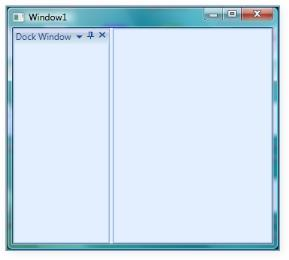
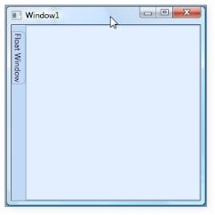
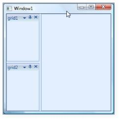
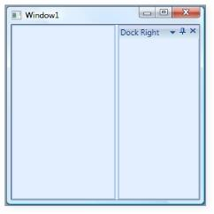

# Basic Features

## Dealing with States

States of child is nothing but a different appearance of the DockingManager children.  [State](https://help.syncfusion.com/cr/wpf/Syncfusion.Windows.Tools.Controls.DockItem.html#Syncfusion_Windows_Tools_Controls_DockItem_State) Property in DockingManager is used to set various states to the child element such as Docking, Floating, Auto Hide, and Hidden.

### Dock State:

Dock State is a state which represents the child as Dock Window as shown below:





<syncfusion:DockingManager>

<Grid Name="grid1" syncfusion:DockingManager.State="Dock"   syncfusion:DockingManager.Header="Dock Window"/>

</syncfusion:DockingManager>





DockingManager.SetHeader(grid1,"Dock Window");

DockingManager.SetState(grid1, DockState.Dock);



 

### Float State:

Float State displays the child in FloatWindow as shown below:



 

### Auto Hidden State:

Auto hidden state hides the children in one of the side panels available with the DockingManager.





<syncfusion:DockingManager>   

<Grid Name="grid1" syncfusion:DockingManager.State="Float"/>

</syncfusion:DockingManager>





DockingManager.SetState(grid1, DockState.Float);



 





<syncfusion:DockingManager>   

	<Grid Name="grid1" syncfusion:DockingManager.State="AutoHidden"/>

</syncfusion:DockingManager>





DockingManager.SetState(grid1, DockState.AutoHidden);



 

### Document State Child

The Document state is the child’s children, which can be displayed as a Tabbed document or (Multiple Document Interface) MDI.

Document State Child can be of two types.

* TDI (Tabbed Document Interface)
* MDI (Multiple Document Interface)

You can create MDI Documents by specifying [ContainerMode](https://help.syncfusion.com/cr/wpf/Syncfusion.Windows.Tools.Controls.DockingManager.html#Syncfusion_Windows_Tools_Controls_DockingManager_ContainerMode) to MDI as a child state,and as Document , as shown below.





<syncfusion:DockingManager UseDocumentContainer="True" ContainerMode="MDI"><Grid Name="grid1" syncfusion:DockingManager.State="Document" syncfusion:DockingManager.Header="MDI"/>

</syncfusion:DockingManager>





 DockingManager manager=new DockingManager();
 
 manager.UseDocumentContainer = true;
 
 manager.ContainerMode = DocumentContainerMode.MDI;
 
 Grid child=new Grid();
 
 DockingManager.SetHeader(child, "MDI");
 
 DockingManager.SetState(child,DockState.Document);
 
 manager.Children.Add(child);
 


 

Similarly you can create a TDI Document by specifying [ContainerMode](https://help.syncfusion.com/cr/wpf/Syncfusion.Windows.Tools.Controls.DockingManager.html#Syncfusion_Windows_Tools_Controls_DockingManager_ContainerMode) as TDI and child state as document.





<syncfusion:DockingManager UseDocumentContainer="True" ContainerMode="TDI">

	<Grid Name="grid1" syncfusion:DockingManager.State="Document" syncfusion:DockingManager.Header="TDI"/>

</syncfusion:DockingManager>





 DockingManager manager=new DockingManager();
 
 manager.UseDocumentContainer = true;
 
 manager.ContainerMode = DocumentContainerMode.TDI;
 
 Grid child=new Grid();
 
 DockingManager.SetHeader(child, "TDI");
 
 DockingManager.SetState(child,DockState.Document);
 
 manager.Children.Add(child);
 


 

#### Refer Also:

How to Create Docking Manager?

## Layout of the child

We can achieve the layout that we want using TargetName attached property.  Target names are generally used to specify where the child needs to be docked or floated. The following code shows the usage of [TargetNameInDockedMode](https://help.syncfusion.com/cr/wpf/Syncfusion.Windows.Tools.Controls.DockItem.html#Syncfusion_Windows_Tools_Controls_DockItem_TargetNameInDockedMode).





<syncfusion:DockingManager>

	<Grid Name="grid1" syncfusion:DockingManager.Header="grid1"/>

	<Grid Name="grid2" syncfusion:DockingManager.Header="grid2" syncfusion:DockingManager.TargetNameInDockedMode="grid1" syncfusion:DockingManager.SideInDockedMode="Bottom"/>

</syncfusion:DockingManager>





DockingManager.SetTargetNameInDockedMode(grid2, "grid1");



 

#### Refer Also:

How to Create Docking Manager?

## DockSide for Docked State child’s

[SideInDockedMode](https://help.syncfusion.com/cr/wpf/Syncfusion.Windows.Tools.Controls.DockItem.html#Syncfusion_Windows_Tools_Controls_DockItem_SideInDockedMode) and [SideInFloatMode](https://help.syncfusion.com/cr/wpf/Syncfusion.Windows.Tools.Controls.DockItem.html#Syncfusion_Windows_Tools_Controls_DockItem_SideInFloatMode) are used to decide the dock side of child with respect to their target names in dock mode and float mode.





<syncfusion:DockingManager>

	<Grid Name="grid1" syncfusion:DockingManager.SideInDockedMode="Left" syncfusion:DockingManager.Header="Dock Left"/>

</syncfusion:DockingManager>





DockingManager.SetHeader(grid1, "Dock Left");

DockingManager.SetSideInDockedMode(grid1, DockSide.Left);



 

The following code represents child in a Dock right position.



 





<syncfusion:DockingManager>            

	<Grid Name="grid1" syncfusion:DockingManager.SideInDockedMode="Right" syncfusion:DockingManager.Header="Dock Right"/>        

</syncfusion:DockingManager>





DockingManager.SetHeader(grid1, "Dock Right");

DockingManager.SetSideInDockedMode(grid1, DockSide.Right);



 


<syncfusion:DockingManager>

	<Grid Name="grid1" syncfusion:DockingManager.SideInDockedMode="Top"/>

</syncfusion:DockingManager>




DockingManager.SetHeader(grid1, "Dock Top");

DockingManager.SetSideInDockedMode(grid1, DockSide.Top);



The code below shows child position in a Dock bottom.





<syncfusion:DockingManager>

	<Grid Name="grid1" syncfusion:DockingManager.SideInDockedMode="Bottom" syncfusion:DockingManager.Header="Dock Bottom"/>

</syncfusion:DockingManager>





DockingManager.SetHeader(grid1, "Dock Bottom");

DockingManager.SetSideInDockedMode(grid1, DockSide.Bottom);



 





<syncfusion:DockingManager>

	<Grid Name="grid1" syncfusion:DockingManager.Header="grid1"/>
	
	<Grid Name="grid2" syncfusion:DockingManager.TargetNameInDockedMode="grid1" syncfusion:DockingManager.Header="grid2" syncfusion:DockingManager.SideInDockedMode="Tabbed" />

	</syncfusion:DockingManager>
	




DockingManager.SetTargetNameInDockedMode(grid2, "grid1");

DockingManager.SetSideInDockedMode(grid2, DockSide.Tabbed);



 

#### Refer Also:

How to Create Docking Manager?