# Dealing with Windows

## Activating a window

A particular child window can be activated in DockingManager using its name or reference through the property [ActiveWindow](https://help.syncfusion.com/cr/wpf/Syncfusion.Tools.Wpf~Syncfusion.Windows.Tools.Controls.DockingManager~ActiveWindow.html) and [ActivateWindow](https://help.syncfusion.com/cr/wpf/Syncfusion.Tools.Wpf~Syncfusion.Windows.Tools.Controls.DockingManager~ActivateWindow.html) method that passes the element as argument to activate.





DockingManager1.ActiveWindow = Content1;

DockingManager1.ActivateWindow("Content1");





DockingManager1.ActiveWindow = Content1

DockingManager1.ActivateWindow("Content1") 





## Adding Window Programmatically

Any UI element can be added inside the DockingManager as its child windows. The windows is added as Dock windows, since the default value of the state is `Dock`.  The UI element is added in the DockingManager using the `Add` method of the Children property of the DockingManager.

For example, ContentControl is added as a window for DockingManager





DockingManager DockingManager1 = new DockingManager();

ContentControl content1 = new ContentControl();

DockingManager.SetHeader(content1,"Window1");

ContentControl content2 = new ContentControl();

DockingManager.SetHeader(content2,"Window2");

ContentControl content3 = new ContentControl();

DockingManager.SetHeader(content3, "Window3");

ContentControl content4 = new ContentControl();

DockingManager.SetHeader(content4,"Window4");

ContentControl content5 = new ContentControl();

DockingManager.SetHeader(content5,"window5");

DockingManager1.Children.Add(content1);

DockingManager1.Children.Add(content2);

DockingManager1.Children.Add(content3);

DockingManager1.Children.Add(content4);

DockingManager1.Children.Add(content5);





Dim DockingManager1 As New DockingManager()

Dim content1 As New ContentControl()

DockingManager.SetHeader(content1, "Window1")

Dim content2 As New ContentControl()

DockingManager.SetHeader(content2, "Window2")

Dim content3 As New ContentControl()

DockingManager.SetHeader(content3, "Window3")

Dim content4 As New ContentControl()

DockingManager.SetHeader(content4, "Window4")

Dim content5 As New ContentControl()

DockingManager.SetHeader(content5, "window5")

DockingManager1.Children.Add(content1)

DockingManager1.Children.Add(content2)

DockingManager1.Children.Add(content3)

DockingManager1.Children.Add(content4)

DockingManager1.Children.Add(content5) 





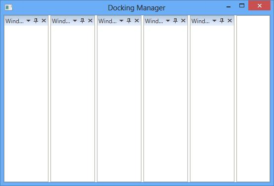

### Setting State for Window programmatically

The state for the particular child window can be set programmatically using the [SetState](https://help.syncfusion.com/cr/wpf/Syncfusion.Tools.Wpf~Syncfusion.Windows.Tools.Controls.DockingManager~SetState.html) method of DockingManager.





DockingManager.SetState(content1, DockState.Float);





DockingManager.SetState(content1, DockState.Float) 





* Setting state as Document – To create document window in the DockingManager, set [UseDocumentContainer](https://help.syncfusion.com/cr/wpf/Syncfusion.Tools.Wpf~Syncfusion.Windows.Tools.Controls.DockingManager~UseDocumentContainer.html) as True for DockingManager and set its state as Document.





DockingManager1.UseDocumentContainer = true;
DockingManager.SetState(content1, DockState.Document);





DockingManager1.UseDocumentContainer = True
DockingManager.SetState(content1, DockState.Document)





* Setting state as AutoHidden





DockingManager.SetState(content1, DockState.AutoHidden);





DockingManager.SetState(content1, DockState.AutoHidden)





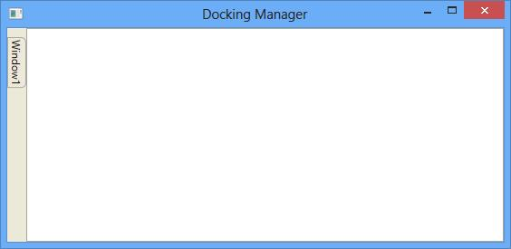

#### Making Window AutoHide programmatically

To auto hide the window programmatically call [ExecuteAutoHide](https://help.syncfusion.com/cr/wpf/Syncfusion.Tools.Wpf~Syncfusion.Windows.Tools.Controls.DockingManager~ExecuteAutoHide.html) method of DockingManager.





DockingManager1.ExecuteAutoHide(Content1);





DockingManager1.ExecuteAutoHide(Content1)





#### Making Window Float and Document programmatically

The docking window can be made to float and document using the [SetState](https://help.syncfusion.com/cr/wpf/Syncfusion.Tools.Wpf~Syncfusion.Windows.Tools.Controls.DockingManager~SetState.html) method with its DockState value as `Float` and `Document` respectively





//to make the content1 float 

DockingManager.SetState(Content1, DockState.Float);

//to make the content1 as Document window

DockingManager.SetState(Content1, DockState.Document);





'to make the content1 float 

DockingManager.SetState(Content1, DockState.Float)

'to make the content1 as Document window

DockingManager.SetState(Content1, DockState.Document)





## Hiding Window Programmatically

To hide the window, set [State](https://help.syncfusion.com/cr/wpf/Syncfusion.Tools.Wpf~Syncfusion.Windows.Tools.Controls.DockItem~State.html) property of the DockingManager as `Hidden`.





DockingManager.SetState(Content1, DockState.Hidden);





DockingManager.SetState(Content1, DockState.Hidden)





To hide the window programmatically, call the [ExecuteClose](https://help.syncfusion.com/cr/wpf/Syncfusion.Tools.Wpf~Syncfusion.Windows.Tools.Controls.DockingManager~ExecuteClose(FrameworkElement).html) method with argument which refer the window need to be close.





//Hide the element that passed as argument
DockingManager1.ExecuteClose(Content1); 
  




'Hide the element that passed as argument
DockingManager1.ExecuteClose(Content1)





## Restore Window Programmatically

To restore the closed window in the DockingManager, call [ExecuteRestore](https://help.syncfusion.com/cr/wpf/Syncfusion.Tools.Wpf~Syncfusion.Windows.Tools.Controls.DockingManager~ExecuteRestore.html) method.





//Restore the passed element with the state value as its argument

DockingManager1.ExecuteRestore(Content1, DockState.Float); 





'Restore the passed element with the state value as its argument

DockingManager1.ExecuteRestore(Content1, DockState.Float) 





## Detect the closing of a DockingManager child

[WindowClosing](https://help.syncfusion.com/cr/wpf/Syncfusion.Tools.Wpf~Syncfusion.Windows.Tools.Controls.DockingManager~WindowClosing_EV.html) and `CloseButtonClick` are the two events, which can be used to get notification when the child windows are being closed. 

### Dock Window Closing

`WindowClosing` event raised whenever a child in `Float`, `Dock` and `AutoHidden` windows are closing. 

### Document Window Closing
 
[CloseButtonClick](https://help.syncfusion.com/cr/wpf/Syncfusion.Tools.Wpf~Syncfusion.Windows.Tools.Controls.DockingManager~CloseButtonClick_EV.html) event raised only when close button of the `Document` child clicked. The following code describes how to handle the closing of all the children in `DockingManager`.





<syncfusion:DockingManager x:Name="dockingManager" CloseButtonClick="dockingManager_CloseButtonClick"
                                                   WindowClosing="dockingManager_WindowClosing">

<ContentControl syncfusion:DockingManager.Header="Left"
                syncfusion:DockingManager.SideInDockedMode="Left"
                syncfusion:DockingManager.State="AutoHidden" />            

</syncfusion:DockingManager>





// For windows in Document state
dockingManager.CloseButtonClick += Docking_CloseButtonClick;

// For windows in Float, Dock and AutoHidden state
dockingManager.WindowClosing += Docking_WindowClosing;

private void dockingManager_CloseButtonClick(object sender, CloseButtonEventArgs e)

{

}

private void dockingManager_WindowClosing(object sender, WindowClosingEventArgs e)

{

}





## Removing Window Programmatically

The windows for the DockingManager can be added using the Children collection. To remove the windows from the children collection, pass the window element that need to be remove using `Remove()` method of children property in DockingManager.





DockingManager dockingmanager  = new DockingManager();

ContentControl content1 = new ContentControl();

DockingManager.SetHeader(content1, "Dockwindow");

ContentControl content2 = new ContentControl();

DockingManager.SetHeader(content2,"Dockwindow2");

dockingmanager.Children.Add(content1);

dockingmanager.Children.Add(content2);

//The following code describes how to remove the child window programmatically using the remove method.

dockingmanager.Children.Remove(content2);

Grid1.Children.Add(dockingmanager);





Dim dockingmanager As New DockingManager()

Dim content1 As New ContentControl()

DockingManager.SetHeader(content1, "Dockwindow")

Dim content2 As New ContentControl()

DockingManager.SetHeader(content2,"Dockwindow2")

dockingmanager.Children.Add(content1)

dockingmanager.Children.Add(content2)

'The following code describes how to remove the child window programmatically using the remove method.

dockingmanager.Children.Remove(content2)

Grid1.Children.Add(dockingmanager) 





## Event to notify when a child is added or removed

If you want to know while docking child added or removed from the `DockingManager`, it can be notified by using the [ChildrenCollectionChanged](https://help.syncfusion.com/cr/wpf/Syncfusion.Tools.Wpf~Syncfusion.Windows.Tools.Controls.DockingManager~ChildrenCollectionChanged_EV.html) event. It receives an argument of type `NotifyCollectionChangedEventArgs` containing the following information about the event.

<table>
<tr>
<th>Event Data</th>
<th>Description</th></tr>
<tr>
<td>Action</td>
<td>Gets an action that determines either an item is added to the children collection or item is removed from the children collection.</td>
</tr>
<tr>
<td>NewItems</td>
<td>Gets the newly added items in the children collection.</td>
</tr>
<tr>
<td>OldItems</td>
<td>Gets the removal of the items from the children collection.</td>
</tr>
<tr>
<td>NewStartingIndex</td>
<td>Gets the index location of the newly added items from the children collection.</td>
</tr>
<tr>
<td>OldStartingIndex</td>
<td>Gets the index location of the recently removed items from the children collection.</td>
</tr>
</table>




<syncfusion:DockingManager ChildrenCollectionChanged="DockingManager_ChildrenCollectionChanged"  
                           Name="dockingManager" >
    <ContentControl syncfusion:DockingManager.Header="Solution Explorer" 
                    Name="SolutionExplorer" />
</syncfusion:DockingManager>




dockingManager.ChildrenCollectionChanged += DockingManager_ChildrenCollectionChanged;







//Add a docking child item in the children collection of DockingManager
ContentControl contentControl = new ContentControl();
dockingManager.Children.Add(contentControl)




You can handle the event as follows,




private void DockingManager_ChildrenCollectionChanged(object sender, NotifyCollectionChangedEventArgs e) {
    //Occurs when children collection changed   
    MessgeBox.Show(“Children collection was changed”);
    if(e.Action== NotifyCollectionChangedAction.Add) {
        var added_Item = e.NewItems;
        int addedIndex = e.NewStartingIndex;
    }
    else if (e.Action == NotifyCollectionChangedAction.Remove) {
        var removed_item = e.OldItems;
        int removedIndex = e.OldStartingIndex;
    }
}




## Restricting Docking in Float Window

The float window allows to dock another float window inside it by default. This behavior can be restricted by set [CanDockOnFloat](https://help.syncfusion.com/cr/wpf/Syncfusion.Tools.Wpf~Syncfusion.Windows.Tools.Controls.DockItem~CanDockonFloat.html) as False for that particular window.





<syncfusion:DockingManager x:Name="DockingManager1">

<ContentControl syncfusion:DockingManager.Header="Item1"
                syncfusion:DockingManager.State="Float"
                syncfusion:DockingManager.CanDockonFloat="False"/>  

</syncfusion:DockingManager>




            
DockingManager.SetCanDockonFloat(Item1, false);





## Customizing a window

A Docking window can be customized using the property [HeaderBackground](https://help.syncfusion.com/cr/wpf/Syncfusion.Tools.Wpf~Syncfusion.Windows.Tools.Controls.DockingManager~HeaderBackground.html), [SelectedHeaderBackground](https://help.syncfusion.com/cr/wpf/Syncfusion.Tools.Wpf~Syncfusion.Windows.Tools.Controls.DockingManager~SelectedHeaderBackground.html), [HeaderMouseHoverBackground](https://help.syncfusion.com/cr/wpf/Syncfusion.Tools.Wpf~Syncfusion.Windows.Tools.Controls.DockingManager~HeaderMouseOverBackground.html) with the desired brush values respectively.





<syncfusion:DockingManager SelectedHeaderBackground="Red" HeaderBackground="Brown" HeaderMouseOverBackground="DarkOrchid"  >

<ContentControl syncfusion:DockingManager.Header="Dock"/>

<ContentControl syncfusion:DockingManager.Header="Dock1"/>                

<ContentControl syncfusion:DockingManager.Header="Dock2"/>            

</syncfusion:DockingManager> 





SyncDockingManager.SelectedHeaderBackground = new SolidColorBrush(Colors.Red);

SyncDockingManager.HeaderBackground = new SolidColorBrush(Colors.Brown);

SyncDockingManager.HeaderMouseOverBackground = new SolidColorBrush(Colors.DarkOrchid);





## Customizing FloatWindow

The float window can be customized by setting [FloatWindowHeaderBackground](https://help.syncfusion.com/cr/wpf/Syncfusion.Tools.Wpf~Syncfusion.Windows.Tools.Controls.DockingManager~FloatWindowHeaderBackground.html), [FloatWindowHeaderForeground](https://help.syncfusion.com/cr/wpf/Syncfusion.Tools.Wpf~Syncfusion.Windows.Tools.Controls.DockingManager~FloatWindowHeaderForeground.html), [FloatWindowSelectedHeaderBackground](https://help.syncfusion.com/cr/wpf/Syncfusion.Tools.Wpf~Syncfusion.Windows.Tools.Controls.DockingManager~FloatWindowSelectedHeaderBackground.html), [FloatWindowSelectedBorderBrush](https://help.syncfusion.com/cr/wpf/Syncfusion.Tools.Wpf~Syncfusion.Windows.Tools.Controls.DockingManager~FloatWindowSelectedBorderBrush.html) and [FloatWindowMouseOverHeaderBackground](https://help.syncfusion.com/cr/wpf/Syncfusion.Tools.Wpf~Syncfusion.Windows.Tools.Controls.DockingManager~FloatWindowMouseOverHeaderBackground.html) properties with the required brush values respectively.





<syncfusion:DockingManager FloatWindowHeaderBackground="Brown" FloatWindowHeaderForeground="Blue"
                           FloatWindowMouseOverBorderBrush="Orange" FloatWindowSelectedHeaderBackground="Pink"
                           FloatWindowBorderBrush="Red" FloatWindowSelectedBorderBrush="BlueViolet" >

<ContentControl syncfusion:DockingManager.Header="Float" syncfusion:DockingManager.State="Float"/>

<ContentControl syncfusion:DockingManager.Header="Float1" syncfusion:DockingManager.State="Float"/>

<ContentControl syncfusion:DockingManager.Header="Float2" syncfusion:DockingManager.State="Float"/>

</syncfusion:DockingManager>





SyncDockingManager.FloatWindowHeaderBackground = new SolidColorBrush(Colors.Brown);

SyncDockingManager.FloatWindowHeaderForeground = new SolidColorBrush(Colors.Blue);

SyncDockingManager.FloatWindowMouseOverBorderBrush = new SolidColorBrush(Colors.Orange);

SyncDockingManager.FloatWindowSelectedHeaderBackground = new SolidColorBrush(Colors.Pink);

SyncDockingManager.FloatWindowBorderBrush = new SolidColorBrush(Colors.Red);

SyncDockingManager.FloatWindowSelectedBorderBrush = new SolidColorBrush(Colors.BlueViolet);





## Enable/Disable Dragging a Window

The attached property [CanDrag](https://help.syncfusion.com/cr/wpf/Syncfusion.Tools.Wpf~Syncfusion.Windows.Tools.Controls.DockItem~CanDrag.html) that helps to enable or disable the dragging functionality of a window by setting its value as True or False respectively. By default its value is `True`, to disable this functionality turn its value to `False`.





<syncfusion:DockingManager x:Name="DockingManager1" >      

<ContentControl syncfusion:DockingManager.Header="Item1" syncfusion:DockingManager.CanDrag="False"/>                     

</syncfusion:DockingManager>





DockingManager.SetCanDrag(Item1, false);





## Drag Shadow of a Window

To drag child window in Shadow mode, set the [DraggingType](https://help.syncfusion.com/cr/wpf/Syncfusion.Tools.Wpf~Syncfusion.Windows.Tools.Controls.DockingManager~DraggingType.html) property of DockingManager as `ShadowDragging`.





<syncfusion:DockingManager x:Name="DockingManager1" DraggingType="ShadowDragging"  >      

<ContentControl syncfusion:DockingManager.Header="Item1"/>

</syncfusion:DockingManager>





SyncDockingManager.DraggingType = DraggingType.ShadowDragging;





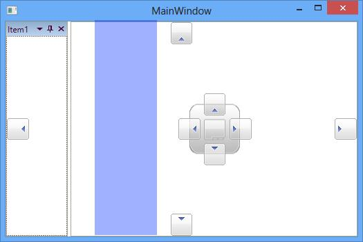

## Drag Border of a Window

To drag child window in Border mode, set the [DraggingType](https://help.syncfusion.com/cr/wpf/Syncfusion.Tools.Wpf~Syncfusion.Windows.Tools.Controls.DockingManager~DraggingType.html) property of DockingManager as `BorderDragging`.





<syncfusion:DockingManager x:Name="DockingManager1" DraggingType="BorderDragging">
	
<ContentControl syncfusion:DockingManager.Header="Item1"/>    

</syncfusion:DockingManager>





SyncDockingManager.DraggingType = DraggingType.BorderDragging;





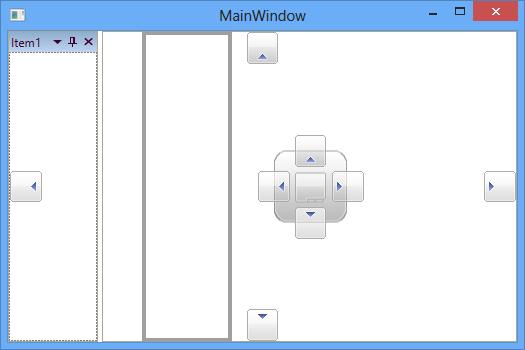

## Customizing a resizing behaviors

DockingManager allows to resize the dock and float windows by default. To restrict resizing the dock and float windows respectively, set the [CanResizeInDockedState](https://help.syncfusion.com/cr/wpf/Syncfusion.Tools.Wpf~Syncfusion.Windows.Tools.Controls.DockItem~CanResizeInDockedState.html) and [CanResizeInFloatState](https://help.syncfusion.com/cr/wpf/Syncfusion.Tools.Wpf~Syncfusion.Windows.Tools.Controls.DockItem~CanResizeInFloatState.html) properties with it value as False.





<syncfusion:DockingManager x:Name="DockingManager1">

<ContentControl syncfusion:DockingManager.Header="Dockwindow" x:Name="Content1"
	            syncfusion:DockingManager.State="Dock" syncfusion:DockingManager.CanResizeInDockedState="False"/>

<ContentControl syncfusion:DockingManager.Header="Floatwindow" x:Name="Content2"
                syncfusion:DockingManager.State="Float" syncfusion:DockingManager.CanResizeInFloatState="False"/>    

</syncfusion:DockingManager>





DockingManager.SetCanResizeInDockedState(Content1, false);

DockingManager.SetCanResizeInFloatState(Content2, false);





###  Width resizing restriction 

To restrict resizing width for the Dock windows set the property [CanResizeWidthInDockedMode](https://help.syncfusion.com/cr/wpf/Syncfusion.Tools.Wpf~Syncfusion.Windows.Tools.Controls.DockItem~CanResizeWidthInDockedState.html) and [CanResizeWidthInFloatState](https://help.syncfusion.com/cr/wpf/Syncfusion.Tools.Wpf~Syncfusion.Windows.Tools.Controls.DockItem~CanResizeWidthInFloatState.html) as False.





<ContentControl syncfusion:DockingManager.Header="Dockwindow" x:Name="Content1"
                syncfusion:DockingManager.State="Dock" syncfusion:DockingManager.CanResizeWidthInDockedState="False"/>

<ContentControl syncfusion:DockingManager.Header="Floatwindow" x:Name="Content2"
                syncfusion:DockingManager.State="Float" syncfusion:DockingManager.CanResizeWidthInFloatState="False"/>




		
DockingManager.SetCanResizeWidthInDockedState(Content1, false);

DockingManager.SetCanResizeWidthInFloatState(Content2, false);





### Height resizing restriction

To restrict resizing the height for the float and dock window respectively, set the property [CanResizeHeightInFloatState](https://help.syncfusion.com/cr/wpf/Syncfusion.Tools.Wpf~Syncfusion.Windows.Tools.Controls.DockItem~CanResizeHeightInFloatState.html) and [CanResizeHeightInDockedState](https://help.syncfusion.com/cr/wpf/Syncfusion.Tools.Wpf~Syncfusion.Windows.Tools.Controls.DockItem~CanResizeHeightInDockedState.html) as False.





<ContentControl syncfusion:DockingManager.Header="Dockwindow" x:Name="Content1"
                syncfusion:DockingManager.State="Dock" syncfusion:DockingManager.CanResizeHeightInDockedState="False"/>

<ContentControl syncfusion:DockingManager.Header="Floatwindow" x:Name="Content2"
                syncfusion:DockingManager.State="Float" syncfusion:DockingManager.CanResizeHeightInFloatState="False"/>




		
DockingManager.SetCanResizeHeightInDockedState(Content1, false);

DockingManager.SetCanResizeHeightInFloatState(Content2, false);





### Setting MaxWidth and MaxHeight for Window

To set the desired maximum width for the float and dock windows respectively, set their properties [DesiredMaxWidthInDockedMode](https://help.syncfusion.com/cr/wpf/Syncfusion.Tools.Wpf~Syncfusion.Windows.Tools.Controls.DockItem~DesiredMaxWidthInDockedMode.html) and [DesiredMaxWidthInFloatingMode](https://help.syncfusion.com/cr/wpf/Syncfusion.Tools.Wpf~Syncfusion.Windows.Tools.Controls.DockItem~DesiredMaxWidthInFloatingMode.html) with the desired values.





<ContentControl syncfusion:DockingManager.Header="Dockwindow"
                syncfusion:DockingManager.State="Dock" syncfusion:DockingManager.DesiredMaxWidthInDockedMode="1000"/>

<ContentControl syncfusion:DockingManager.Header="Floatwindow"
                syncfusion:DockingManager.State="Float" syncfusion:DockingManager.DesiredMaxWidthInFloatingMode="600"/>                     





DockingManager.SetDesiredMaxWidthInDockedMode(dockWindow1,1000);

DockingManager.SetDesiredMaxWidthInFloatingMode(floatWindow1,600);





To set the maximum height for the float and dock windows respectively, set their properties [DesiredMaxHeightInDockedMode](https://help.syncfusion.com/cr/wpf/Syncfusion.Tools.Wpf~Syncfusion.Windows.Tools.Controls.DockItem~DesiredMaxHeightInDockedMode.html) and [DesiredMaxHeightInFloatingMode](https://help.syncfusion.com/cr/wpf/Syncfusion.Tools.Wpf~Syncfusion.Windows.Tools.Controls.DockItem~DesiredMaxHeightInFloatingMode.html) with the desired values.





<ContentControl syncfusion:DockingManager.Header="Dockwindow"
                syncfusion:DockingManager.State="Dock" syncfusion:DockingManager.DesiredMaxHeightInDockedMode="300"/>

<ContentControl syncfusion:DockingManager.Header="Floatwindow"
                syncfusion:DockingManager.State="Float" syncfusion:DockingManager.DesiredMaxHeightInFloatingMode="200"/>





DockingManager.SetDesiredMaxHeightInDockedMode(dockWindow1,700);

DockingManager.SetDesiredMaxHeightInFloatingMode(floatWindow1,200);





## Configuring window sizing

DockingManager allows to set the desired width and height for the dock windows. The window `Width` and `Height` value set to "90" based on the container by default.

### Desire height and width

The desired height and width can be set for the Dock windows through the property [DesiredWidthInDockedMode](https://help.syncfusion.com/cr/wpf/Syncfusion.Tools.Wpf~Syncfusion.Windows.Tools.Controls.DockItem~DesiredWidthInDockedMode.html) and [DesiredHeightInDockedMode](https://help.syncfusion.com/cr/wpf/Syncfusion.Tools.Wpf~Syncfusion.Windows.Tools.Controls.DockItem~DesiredHeightInDockedMode.html)  with the desired values.





<syncfusion:DockingManager x:Name="DockingManager1">  

<ContentControl syncfusion:DockingManager.Header="Item1"
                syncfusion:DockingManager.DesiredHeightInDockedMode="400"
                syncfusion:DockingManager.DesiredWidthInDockedMode="300"/>             

</syncfusion:DockingManager>





DockingManager.SetDesiredHeightInDockedMode(Content1,400);

DockingManager.SetDesiredWidthInDockedMode(Content1, 300);





### Sizing Based on the Content

To size the float window based on the children window size, set the property [SizeToContentInFloat](https://help.syncfusion.com/cr/wpf/Syncfusion.Tools.Wpf~Syncfusion.Windows.Tools.Controls.DockItem~SizetoContentInFloat.html) property for the child window as True. By default, its value is False.





<ContentControl syncfusion:DockingManager.Header="Item1" x:Name="Content1"
                syncfusion:DockingManager.SizetoContentInFloat="True" Width="100" Height="24"/>             




		
DockingManager.SetSizetoContentInFloat(Content1,true);





To size the Dock window based on the children window size, set the property [SizeToContentInDock](https://help.syncfusion.com/cr/wpf/Syncfusion.Tools.Wpf~Syncfusion.Windows.Tools.Controls.DockItem~SizetoContentInDock.html) property for the child window as True. By default, its value is False.





<syncfusion:DockingManager x:Name="DockingManager1" >

<ContentControl syncfusion:DockingManager.Header="Item1" x:Name="Content1"
                syncfusion:DockingManager.SizetoContentInDock="True" Width="100" Height="24"/>

</syncfusion:DockingManager>




			
DockingManager.SetSizetoContentInDock(Content1,true);





### Absolute Sizing on Dock to fill

To load the child window initially with an absolute size, set the property [DockFillMode](https://help.syncfusion.com/cr/wpf/Syncfusion.Tools.Wpf~Syncfusion.Windows.Tools.Controls.DockItem~DockFillMode.html) as `Absolute`. By default, the child window loaded with the default size and it can be set through [DockFillMode](https://help.syncfusion.com/cr/wpf/Syncfusion.Tools.Wpf~Syncfusion.Windows.Tools.Controls.DockItem~DockFillMode.html) as `Default` also.





<ContentControl syncfusion:DockingManager.Header="Item1"  
                syncfusion:DockingManager.DockFillMode="Absolute"/>





DockingManager.SetDockFillMode(content1, DockFillModes.Absolute);





### Customizing the Splitter appearance

The Splitter of the dock window can be customized using the [SplitterSize](https://help.syncfusion.com/cr/wpf/Syncfusion.Tools.Wpf~Syncfusion.Windows.Tools.Controls.DockingManager~SplitterSize.html) and [SplitterBackground](https://help.syncfusion.com/cr/wpf/Syncfusion.Tools.Wpf~Syncfusion.Windows.Tools.Controls.DockingManager~SplitterBackground.html) properties depends upon its values respectively. 





<syncfusion:DockingManager UseDocumentContainer=" True" SplitterBackground="Brown" SplitterSize="10" > 

<ContentControl syncfusion:DockingManager.Header="Item1"></ContentControl>

</syncfusion:DockingManager>





SyncDockingManager.SplitterBackground = new SolidColorBrush(Colors.Brown);

SyncDockingManager.SplitterSize = 10;





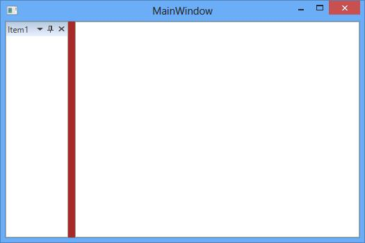

## Occupy whole window

To arrange the dock windows to a whole available space in the DockingManager, set [DockFill](https://help.syncfusion.com/cr/wpf/Syncfusion.Tools.Wpf~Syncfusion.Windows.Tools.Controls.DockingManager~DockFill.html) property of DockingManager as True. 





<syncfusion:DockingManager DockFill="True">        

<ContentControl syncfusion:DockingManager.Header="Item1"/>             

</syncfusion:DockingManager>





SyncDockingManager.DockFill = true;





And when DockFill functionality is enabled, DockingManager changes the DockWindow to AutoHidden state, if any Document state window is present .





<syncfusion:DockingManager UseDocumentContainer="True" DockFill="True">        

<ContentControl syncfusion:DockingManager.Header="Item1"/>   

<ContentControl syncfusion:DockingManager.Header="Item1" syncfusion:DockingManager.State="Document"/> 

</syncfusion:DockingManager>





SyncDockingManager.UseDocumentContainer = true;

SyncDockingManager.DockFill = true;

DockingManager.SetState(dockWindow1, DockState.Document);

DockingManager.SetState(document1, DockState.Document);





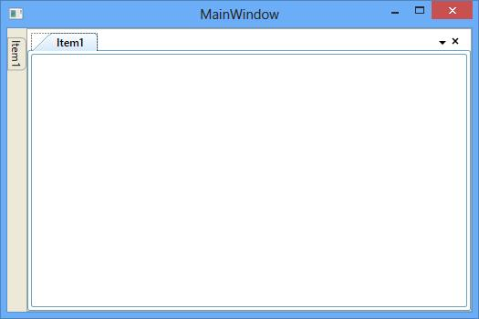

### Restrict DockWindow to AutoHide while DockFill

To restrict the behavior of changing the DockWindow to AutoHide when DockFill is True, set the property [DockFillDocumentMode](https://help.syncfusion.com/cr/wpf/Syncfusion.Tools.Wpf~Syncfusion.Windows.Tools.Controls.DockingManager~DockFillDocumentMode.html) as Normal.





<syncfusion:DockingManager x:Name="SyncDockingManager" UseDocumentContainer="True" DockFill="True" DockFillDocumentMode="Normal">        

<ContentControl x:Name="Content1" syncfusion:DockingManager.Header="Item1"/>   

<ContentControl x:Name="Content2" syncfusion:DockingManager.Header="Item2"
                                  syncfusion:DockingManager.State="Document"/> 

</syncfusion:DockingManager>





SyncDockingManager.DockFillDocumentMode = DockFillDocumentMode.Normal;





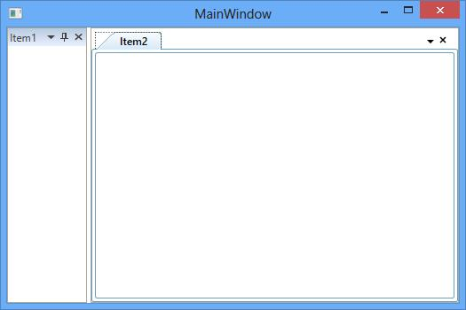

## Applying Context Menu

DockingManager allows to add  CustomContextMenuItems for Dock and Float windows through an attached property [CustomMenuItems](https://help.syncfusion.com/cr/wpf/Syncfusion.Tools.Wpf~Syncfusion.Windows.Tools.Controls.DockItem~CustomMenuItems.html). 





<syncfusion:DockingManager x:Name="DockingManager1">  
	
<syncfusion:DockingManager.CustomMenuItems>
	
<syncfusion:CustomMenuItemCollection>
	
<syncfusion:CustomMenuItem Header="CustomItem1"/>
	
<syncfusion:CustomMenuItem Header="CustomItem2"/>
	
</syncfusion:CustomMenuItemCollection>

</syncfusion:DockingManager.CustomMenuItems>    

<ContentControl syncfusion:DockingManager.Header="Item1"/> 
	               
</syncfusion:DockingManager>





CustomMenuItemCollection collection = new CustomMenuItemCollection();

CustomMenuItem item1 = new CustomMenuItem();

CustomMenuItem item2 = new CustomMenuItem();

item1.Header = "CustomItem1";

item2.Header = "CustomItem2";

collection.Add(item1);

collection.Add(item2);

DockingManager.SetCustomMenuItems(DockingManager1, collection);





### Adding CustomContextMenuItems to Document window

The custom context menu items can be added in addition to default ContextMenu items for the document window through an attached property [DocumentTabItemContextMenuItems](https://help.syncfusion.com/cr/wpf/Syncfusion.Tools.Wpf~Syncfusion.Windows.Tools.Controls.DockItem~DocumentTabItemContextMenuItems.html). 





<syncfusion:DockingManager UseDocumentContainer="True" x:Name="DockingManager1">  

<syncfusion:DockingManager.DocumentTabItemContextMenuItems>

<syncfusion:DocumentTabItemMenuItemCollection>

<syncfusion:CustomMenuItem Header="CustomItem1"/>

<syncfusion:CustomMenuItem Header="CustomItem2"/>

</syncfusion:DocumentTabItemMenuItemCollection>

</syncfusion:DockingManager.DocumentTabItemContextMenuItems>    

<ContentControl x:Name="Content1" syncfusion:DockingManager.Header="Item1" syncfusion:DockingManager.State="Document"/>                

</syncfusion:DockingManager>





DocumentTabItemMenuItemCollection collection = new DocumentTabItemMenuItemCollection();

CustomMenuItem item1 = new CustomMenuItem();

CustomMenuItem item2 = new CustomMenuItem();

item1.Header = "CustomItem1";

item2.Header = "CustomItem2";

collection.Add(item1);

collection.Add(item2);
						 
DockingManager.SetDocumentTabItemContextMenuItems(DockingManager1, collection);





### CustomMenuItem as Separator

The [IsSeparator](https://help.syncfusion.com/cr/wpf/Syncfusion.Tools.Wpf~Syncfusion.Windows.Tools.Controls.CustomMenuItem~IsSeparator.html) property of [CustomMenuItem](https://help.syncfusion.com/cr/wpf/Syncfusion.Tools.Wpf~Syncfusion.Windows.Tools.Controls.CustomMenuItem.html) is used to display separator between CustomMenuItems. If the property [IsSeparator](https://help.syncfusion.com/cr/wpf/Syncfusion.Tools.Wpf~Syncfusion.Windows.Tools.Controls.CustomMenuItem~IsSeparator.html) is set to true, the [CustomMenuItem](https://help.syncfusion.com/cr/wpf/Syncfusion.Tools.Wpf~Syncfusion.Windows.Tools.Controls.CustomMenuItem.html) will act as Separator.The default value of this property is false.



<syncfusion:DockingManager Grid.Row="1" DockFill="True"  Name="Docking">
            <syncfusion:DockingManager.CustomMenuItems>
                <syncfusion:CustomMenuItemCollection>
                    <syncfusion:CustomMenuItem Header="Custom1"/>
                    <syncfusion:CustomMenuItem Header="Custom2"/>
                    <syncfusion:CustomMenuItem BorderBrush="Red" IsSeparator="True"/>
                    <syncfusion:CustomMenuItem Header="Custom4"/>
                </syncfusion:CustomMenuItemCollection>
            </syncfusion:DockingManager.CustomMenuItems>
            <ContentControl x:Name="Dock1" syncfusion:DockingManager.Header="Dock1"/>
            <ContentControl syncfusion:DockingManager.Header="Dock2" syncfusion:DockingManager.SideInDockedMode="Tabbed" syncfusion:DockingManager.TargetNameInDockedMode="Dock1"/>
            <ContentControl syncfusion:DockingManager.Header="Dock3" syncfusion:DockingManager.State="Dock"/>
            <ContentControl syncfusion:DockingManager.Header="Dock4" syncfusion:DockingManager.State="Dock"/>
        </syncfusion:DockingManager>



### Customizing ContextMenuItems Visibility

The default context menu is visible on right-clicking the different state child windows and its visibility can be customized.  

The default context menu items as shown in the following screenshot:

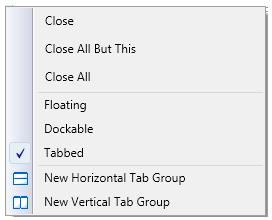

To collapse the default context menu, set the property [CollapseDefaultContextMenu](https://help.syncfusion.com/cr/wpf/Syncfusion.Tools.Wpf~Syncfusion.Windows.Tools.Controls.DockingManager~CollapseDefaultContextMenuItems.html) as True.





<syncfusion:DockingManager x:Name="DockingManager1" UseDocumentContainer="True" CollapseDefaultContextMenuItems="True"/>





DockingManager1.CollapseDefaultContextMenuItems = true;





To collapse the default context menu in Dock state window, set the property [CollapseDefaultContextMenuInDock](https://help.syncfusion.com/cr/wpf/Syncfusion.Tools.Wpf~Syncfusion.Windows.Tools.Controls.DockItem~CollapseDefaultContextMenuItemsInDock.html) as True. By default, its value is False.





<syncfusion:DockingManager x:Name="DockingManager1" UseDocumentContainer="True" >

<ContentControl syncfusion:DockingManager.Header="DockWindow" x:Name="Content1"
                syncfusion:DockingManager.State="Dock" syncfusion:DockingManager.CollapseDefaultContextMenuItemsInDock="True"/>

</syncfusion:DockingManager>





DockingManager.SetCollapseDefaultContextMenuItemsInDock(Content1, true);





To collapse the default context menu in Document state window, set the property [CollapseDefaultContextMenuInDocument](https://help.syncfusion.com/cr/wpf/Syncfusion.Tools.Wpf~Syncfusion.Windows.Tools.Controls.DockItem~CollapseDefaultContextMenuItemsInDocumentTab.html) asTrue. By default, its value is False.





<syncfusion:DockingManager x:Name="DockingManager1" UseDocumentContainer="True">
	
<ContentControl syncfusion:DockingManager.Header="DockWindow" x:Name="Content1"
	           syncfusion:DockingManager.State="Document"
               syncfusion:DockingManager.CollapseDefaultContextMenuItemsInDocumentTab="True" /> 

</syncfusion:DockingManager>





DockingManager.SetCollapseDefaultContextMenuItemsInDocumentTab(Content1, true);





To collapse the default context menu in Float state window, set the property [CollapseDefaultContextMenuInFloat](https://help.syncfusion.com/cr/wpf/Syncfusion.Tools.Wpf~Syncfusion.Windows.Tools.Controls.DockItem~CollapseDefaultContextMenuItemsInFloat.html) as True. By default, its value is False.





<ContentControl syncfusion:DockingManager.Header="DockWindow"
                syncfusion:DockingManager.State="Float"
                syncfusion:DockingManager.CollapseDefaultContextMenuItemsInFloat="True"/>





DockingManager.SetCollapseDefaultContextMenuItemsInFloat(Content1, true);





## DockBehavior

[DockBehavior](https://help.syncfusion.com/cr/wpf/Syncfusion.Tools.Wpf~Syncfusion.Windows.Tools.Controls.DockingManager~DockBehavior.html) has two options Default and VS2010, difference between the two modes is explained in the table below.

<table>
<tr>
<th>
DockBehavior
</th>
<th>
Default
</th>
<th>
VS2010
</th>
</tr>
<tr>
<td>
Context menu options
</td>
<td>

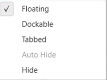

</td>
<td>

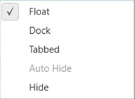

</td>
</tr>
<tr>
<td>
Different Behavior
</td>
<td>
Dockable:

A window's `Dockable` menu item represents that it may or may not be docked. 
 </td>
<td>
Dock:

You can dock a window from float or tabbed state by clicking `Dock` menu item. 
</td>
</tr>
<tr>
<td>
Same Behavior
</td>
<td>
The checked status of all other menu items is the current status of the window.
</td>
<td>
The checked status of all other menu items is the current status of the window.
</td>
</tr>
<tr>
<td>

Context menu option when window is in `Auto-Hide` state

</td>
<td>

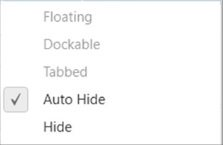

</td>
<td>

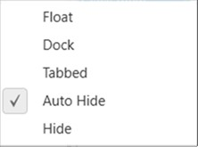 

</td>
</tr>

</table>





 <syncfusion:DockingManager  x:Name="DockingManager1" DockBehavior="VS2010" >

  <ContentControl x:Name="SolutionExplorer" syncfusion:DockingManager.DesiredWidthInDockedMode="200" syncfusion:DockingManager.Header="Solution Explorer" />

 </syncfusion:DockingManager>





DockingManager1.DockBehavior = DockBehavior.VS2010;





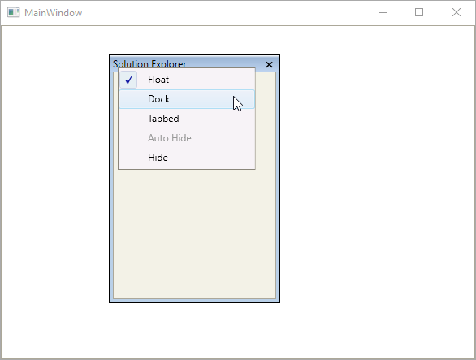

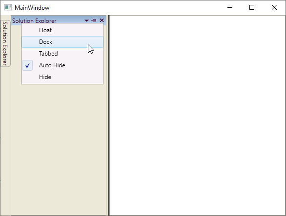

## Hosting a client control between windows

To add a client control in the DockingManager, set an attached property [ClientControl](https://help.syncfusion.com/cr/wpf/Syncfusion.Tools.Wpf~Syncfusion.Windows.Tools.Controls.DockingManager~ClientControl.html).





<syncfusion:DockingManager x:Name="DockingManager1" UseDocumentContainer="False">

// A client control TextBox has been added.

<syncfusion:DockingManager.ClientControl>

<TextBox x:Name="Text1" Width="100" Height="23" Text=" ClientControl" Background="Black" Foreground="White"/>

</syncfusion:DockingManager.ClientControl>

<ContentControl syncfusion:DockingManager.Header="Top" syncfusion:DockingManager.SideInDockedMode="Top"/>

<ContentControl syncfusion:DockingManager.Header="Left" syncfusion:DockingManager.SideInDockedMode="Left"/>

<ContentControl syncfusion:DockingManager.Header="Bottom" syncfusion:DockingManager.SideInDockedMode="Bottom"/>

</syncfusion:DockingManager>





DockingManager1.ClientControl = new TextBlock() { Text = "ClientControl", Width = 100, Height = 23, Background = Brushes.Black, Foreground = Brushes.White };





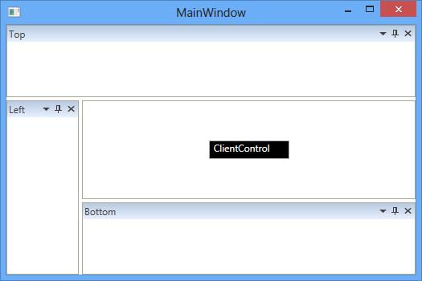

## DockingManager as FlatLayoutControl
 
The [EnableFlatLayout](https://help.syncfusion.com/cr/wpf/Syncfusion.Tools.Wpf~Syncfusion.Windows.Tools.Controls.DockingManager~EnableFlatLayout.html) property of DockingManager is used to disable all the docking functionalities such as drag-and-drop functionality in document windows, resizing the child elements, hiding the dock panel options, closing the child elements from view, and floating the dock windows. If the [EnableFlatLayout](https://help.syncfusion.com/cr/wpf/Syncfusion.Tools.Wpf~Syncfusion.Windows.Tools.Controls.DockingManager~EnableFlatLayout.html) property is true, the DockingManager control will act as LayoutControl. The default value of this property is false. 




<syncfusion:DockingManager x:Name="DockingManager1" UseDocumentContainer="True" EnableFlatLayout="True">
	 <ContentControl Name="Output"
						   syncfusion:DockingManager.Header="Output"
						   syncfusion:DockingManager.SideInDockedMode="Bottom"
						   syncfusion:DockingManager.DesiredHeightInDockedMode="200" 
						   >                
            </ContentControl>
           			
			<ContentControl Name="SolutionExplorer"  
					  syncfusion:DockingManager.Header="Solution Explorer"
					  syncfusion:DockingManager.SideInDockedMode="Right"
					  syncfusion:DockingManager.DesiredWidthInDockedMode="300"                      
					  >			
			</ContentControl>
			
			<ContentControl Name="Toolbox"
					  syncfusion:DockingManager.Header="Toolbox" 
					  syncfusion:DockingManager.State="Dock" 
                            HorizontalContentAlignment="Left" 
					  syncfusion:DockingManager.DesiredWidthInDockedMode="250"
                      >			
			</ContentControl>
					
			<ContentControl Name="Features"
					  syncfusion:DockingManager.Header="Features" 
					  syncfusion:DockingManager.State="Document" 					  
                     >
			</ContentControl>
			<!-- Docking dock window -->
			<ContentControl Name="Docking"
					  syncfusion:DockingManager.Header="Docking" 
					  syncfusion:DockingManager.State="Document" 					  
                     >
			</ContentControl>
</syncfusion:DockingManager>





 DockingManager.EnableFlatLayout = true;





