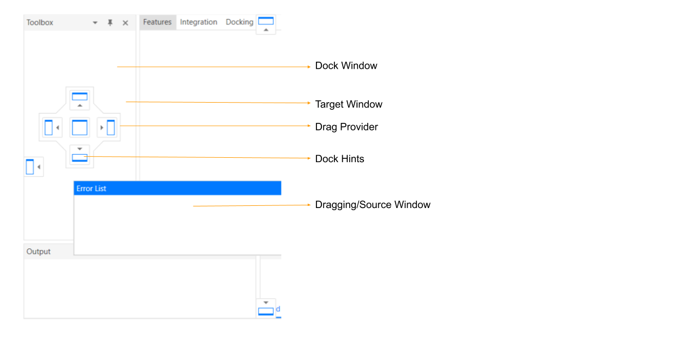
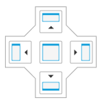
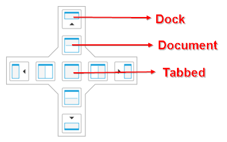
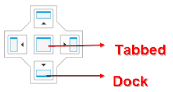
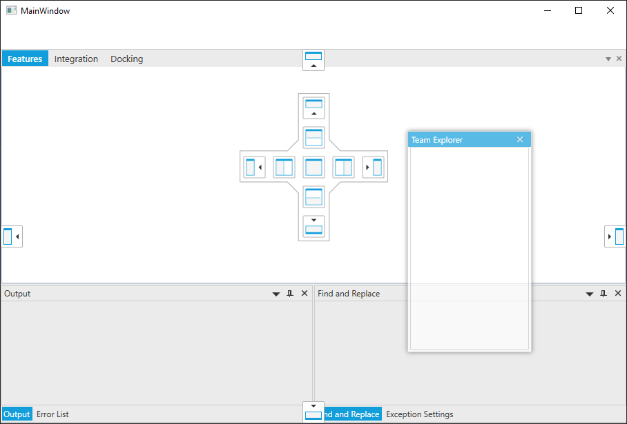
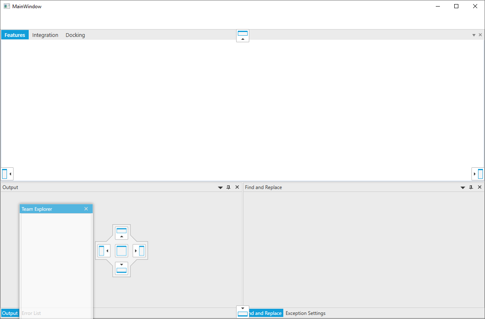
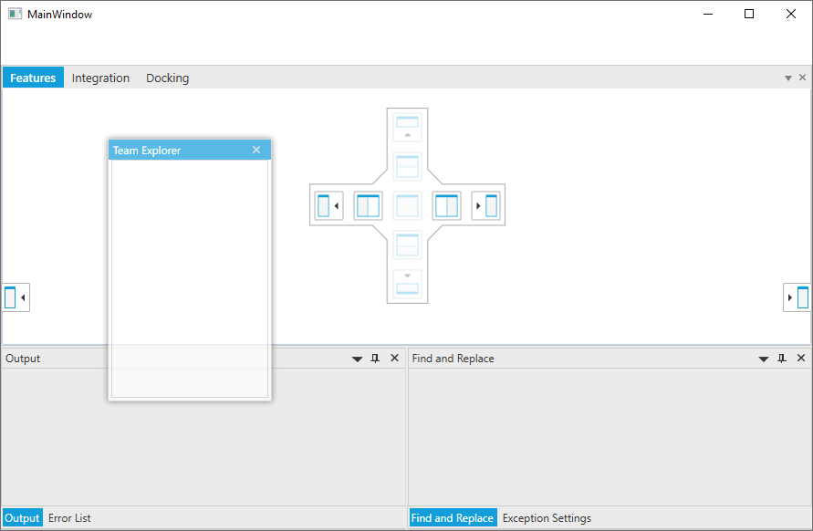
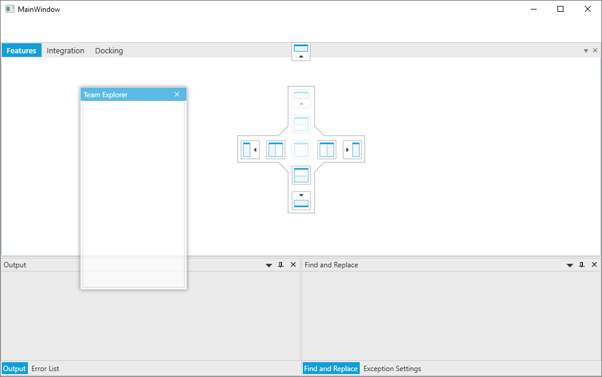

# Interaction with DragProvider in WPF Docking (DockingManager)

State of the dock children can be changed through the dock hints. This section explains how the dock item can be docked / documented with the help of Dock hints and how the dock hints can be disabled/ enabled at run time.

Terminologies:

1. Source Window - Window that is being dragged
2. Target Window - Window on which source window is going to be dropped
5. Document Window - A special window which is usually used to host document for editing
6. Dock Window - A normal window used to dock its child window in all four directions
3. Drag Provider - A prompt indicating dockable regions for docking
4. Dock Hints - Iconic indication of a region

Dock to document window

Dock to normal window

## Dock a window to desired direction

When user drag a window over another window, drag provider appears with dock hints. Based on dock hints, the window can be placed(docked or documented) to its desired place. If the window is dragged over the document area drag provider will be displayed with 9 hints, 

Otherwise the provider will be displayed with 5 hints.

### Dock to document window
1. User can document the dragged window with the existing tab group through the center dock hint. 
2. New Tab group can be created at any sides(left, top, right and bottom) through the hints which is adjacent to the center dock hint. 
3. Dragged window can be docked at any side using the hints which is outer side of the drag provider.

### Dock to normal window

1. Using center dock hint, dragged window can be added as a tab to existing dock window. 
2. Also the window can be docked to any side of the targeted window through the outer side of the drag provider.

## Restrict docking by disabling inner and outer dock hints

Dock hints of the DragProvider can be disabled / enabled through attached property [DockAbility](https://help.syncfusion.com/cr/wpf/Syncfusion.Windows.Tools.Controls.DockAbility.html) of the DockingManager.

### All

When the DockAbility of the window is set as `All`, all the dock hints of the DockingManager will be enabled in the DockingManager's DragProvider. Default value of the `DockAbility` property is `All`.

### DockLeft, DockRight, DockTop, DockBottom, DockTabbed

The dock hints which allows the window to make the dragged window to `Dock` state will be enabled here. Based on the specified side `DockHints` will be enabled. The center dock hint will be enabled, if the DockAbility is `DockTabbed`.




<syncfusion:DockingManager
            x:Name="dockingManager"
            IsVS2010DraggingEnabled="True"
            UseDocumentContainer="True">
           <ContentControl
                x:Name="outputWindow"
                syncfusion:DockingManager.DockAbility="DockTabbed"
                syncfusion:DockingManager.Header="Output"
                syncfusion:DockingManager.SideInDockedMode="Bottom" />
            <ContentControl
                x:Name="errorlistWindow"
                syncfusion:DockingManager.DockAbility="DockTop"
                syncfusion:DockingManager.Header="Error List"
                syncfusion:DockingManager.SideInDockedMode="Tabbed"
                syncfusion:DockingManager.TargetNameInDockedMode="outputWindow" />
            <ContentControl
                x:Name="findWindow"
                syncfusion:DockingManager.DockAbility="DockBottom"
                syncfusion:DockingManager.Header="Find and Replace"
                syncfusion:DockingManager.SideInDockedMode="Right"
                syncfusion:DockingManager.TargetNameInDockedMode="outputWindow" />
            <ContentControl
                x:Name="exceptionWindow"
                syncfusion:DockingManager.DockAbility="DockRight"
                syncfusion:DockingManager.Header="Exception Settings"
                syncfusion:DockingManager.SideInDockedMode="Tabbed"
                syncfusion:DockingManager.TargetNameInDockedMode="findWindow" />
            <ContentControl
                x:Name="teamExp"
                syncfusion:DockingManager.DockAbility="DockLeft"
                syncfusion:DockingManager.Header="Team Explorer"
                syncfusion:DockingManager.SideInDockedMode="Left" />
            <ContentControl
                Name="dockingwindow"
                syncfusion:DockingManager.Header="Docking"
                syncfusion:DockingManager.State="Document" />
        </syncfusion:DockingManager>







DockingManager.SetDockAbility(outputWindow, DockAbility.DockTabbed);
            DockingManager.SetDockAbility(errorlistWindow, DockAbility.DockTop);
            DockingManager.SetDockAbility(findWindow, DockAbility.DockBottom);
            DockingManager.SetDockAbility(exceptionWindow, DockAbility.DockRight);
            DockingManager.SetDockAbility(teamExp, DockAbility.DockLeft);




### DockAll

When the DockAbility is `DockAll`, all the dock hints which allows the window to be Docked is enabled. 




<syncfusion:DockingManager
            x:Name="dockingManager"
            IsVS2010DraggingEnabled="True"
            UseDocumentContainer="True">
           <ContentControl
                x:Name="outputWindow"
                syncfusion:DockingManager.Header="Output"
                syncfusion:DockingManager.SideInDockedMode="Bottom" />
            <ContentControl
                x:Name="errorlistWindow"
                syncfusion:DockingManager.Header="Error List"
                syncfusion:DockingManager.SideInDockedMode="Tabbed"
                syncfusion:DockingManager.TargetNameInDockedMode="outputWindow" />
            <ContentControl
                x:Name="findWindow"
                syncfusion:DockingManager.Header="Find and Replace"
                syncfusion:DockingManager.SideInDockedMode="Right"
                syncfusion:DockingManager.TargetNameInDockedMode="outputWindow" />
            <ContentControl
                x:Name="exceptionWindow"
                syncfusion:DockingManager.Header="Exception Settings"
                syncfusion:DockingManager.SideInDockedMode="Tabbed"
                syncfusion:DockingManager.TargetNameInDockedMode="findWindow" />
            <ContentControl
                x:Name="teamExp"
                syncfusion:DockingManager.DockAbility="DockAll"
                syncfusion:DockingManager.Header="Team Explorer"
                syncfusion:DockingManager.SideInDockedMode="Left" />
            <ContentControl
                Name="dockingwindow"
                syncfusion:DockingManager.Header="Docking"
                syncfusion:DockingManager.State="Document" />
            <ContentControl
                x:Name="integration"
                syncfusion:DockingManager.Header="Integration"
                syncfusion:DockingManager.State="Document" />
            <ContentControl
                x:Name="features"
                syncfusion:DockingManager.Header="Features"
                syncfusion:DockingManager.State="Document" />
        </syncfusion:DockingManager>







            DockingManager.SetDockAbility(teamExp, DockAbility.DockAll);




### DocumentLeft, DocumentRight, DocumentTop, DocumentBottom, DocumentTabbed

The dock hints which allows the window to make the dragged window to `Document` state will be enabled here. Based on the specified side `DockHints` will be enabled. The center dock hint will be enabled, if the DockAbility is `DocumentTabbed`.




<syncfusion:DockingManager
            x:Name="dockingManager"
            IsVS2010DraggingEnabled="True"
            UseDocumentContainer="True">
           <ContentControl
                x:Name="outputWindow"
                syncfusion:DockingManager.DockAbility="DocumentTabbed"
                syncfusion:DockingManager.Header="Output"
                syncfusion:DockingManager.SideInDockedMode="Bottom" />
            <ContentControl
                x:Name="errorlistWindow"
                syncfusion:DockingManager.DockAbility="DocumentTop"
                syncfusion:DockingManager.Header="Error List"
                syncfusion:DockingManager.SideInDockedMode="Tabbed"
                syncfusion:DockingManager.TargetNameInDockedMode="outputWindow" />
            <ContentControl
                x:Name="findWindow"
                syncfusion:DockingManager.DockAbility="DocumentBottom"
                syncfusion:DockingManager.Header="Find and Replace"
                syncfusion:DockingManager.SideInDockedMode="Right"
                syncfusion:DockingManager.TargetNameInDockedMode="outputWindow" />
            <ContentControl
                x:Name="exceptionWindow"
                syncfusion:DockingManager.DockAbility="DocumentRight"
                syncfusion:DockingManager.Header="Exception Settings"
                syncfusion:DockingManager.SideInDockedMode="Tabbed"
                syncfusion:DockingManager.TargetNameInDockedMode="findWindow" />
            <ContentControl
                x:Name="teamExp"
                syncfusion:DockingManager.DockAbility="DocumentLeft"
                syncfusion:DockingManager.Header="Team Explorer"
                syncfusion:DockingManager.SideInDockedMode="Left" />
            <ContentControl
                Name="dockingwindow"
                syncfusion:DockingManager.Header="Docking"
                syncfusion:DockingManager.State="Document" />
        </syncfusion:DockingManager>







DockingManager.SetDockAbility(outputWindow, DockAbility.DocumentTabbed);
            DockingManager.SetDockAbility(errorlistWindow, DockAbility.DocumentTop);
            DockingManager.SetDockAbility(findWindow, DockAbility.DocumentBottom);
            DockingManager.SetDockAbility(exceptionWindow, DockAbility.DocumentRight);
            DockingManager.SetDockAbility(teamExp, DockAbility.DocumentLeft);




### DocumentAll

If the DockAbility is `DocumentAll`, all the dock hints which allows the window to be documented is enabled in the DragProvider.




<syncfusion:DockingManager
            x:Name="dockingManager"
            IsVS2010DraggingEnabled="True"
            UseDocumentContainer="True">
           <ContentControl
                x:Name="outputWindow"
                syncfusion:DockingManager.Header="Output"
                syncfusion:DockingManager.SideInDockedMode="Bottom" />
            <ContentControl
                x:Name="errorlistWindow"
                syncfusion:DockingManager.Header="Error List"
                syncfusion:DockingManager.SideInDockedMode="Tabbed"
                syncfusion:DockingManager.TargetNameInDockedMode="outputWindow" />
            <ContentControl
                x:Name="findWindow"
                syncfusion:DockingManager.Header="Find and Replace"
                syncfusion:DockingManager.SideInDockedMode="Right"
                syncfusion:DockingManager.TargetNameInDockedMode="outputWindow" />
            <ContentControl
                x:Name="exceptionWindow"
                syncfusion:DockingManager.Header="Exception Settings"
                syncfusion:DockingManager.SideInDockedMode="Tabbed"
                syncfusion:DockingManager.TargetNameInDockedMode="findWindow" />
            <ContentControl
                x:Name="teamExp"
                syncfusion:DockingManager.DockAbility="DocumentAll"
                syncfusion:DockingManager.Header="Team Explorer"
                syncfusion:DockingManager.SideInDockedMode="Left" />
            <ContentControl
                Name="dockingwindow"
                syncfusion:DockingManager.Header="Docking"
                syncfusion:DockingManager.State="Document" />
            <ContentControl
                x:Name="integration"
                syncfusion:DockingManager.Header="Integration"
                syncfusion:DockingManager.State="Document" />
            <ContentControl
                x:Name="features"
                syncfusion:DockingManager.Header="Features"
                syncfusion:DockingManager.State="Document" />
        </syncfusion:DockingManager>







            DockingManager.SetDockAbility(teamExp, DockAbility.DocumentAll);




### Left, Right, Top, Bottom, Tabbed

The dock hints which allows the window to make the dragged window to `Document` or `Dock` state will be enabled here. Based on the specified side `DockHints` will be enabled. Center dock hint which allows the dragged window to be `Dock` or `Document` will be enabled, if the DockAbility is `Tabbed`.




<syncfusion:DockingManager
            x:Name="dockingManager"
            IsVS2010DraggingEnabled="True"
            UseDocumentContainer="True">
           <ContentControl
                x:Name="outputWindow"
                syncfusion:DockingManager.DockAbility="Tabbed"
                syncfusion:DockingManager.Header="Output"
                syncfusion:DockingManager.SideInDockedMode="Bottom" />
            <ContentControl
                x:Name="errorlistWindow"
                syncfusion:DockingManager.DockAbility="Top"
                syncfusion:DockingManager.Header="Error List"
                syncfusion:DockingManager.SideInDockedMode="Tabbed"
                syncfusion:DockingManager.TargetNameInDockedMode="outputWindow" />
            <ContentControl
                x:Name="findWindow"
                syncfusion:DockingManager.DockAbility="Bottom"
                syncfusion:DockingManager.Header="Find and Replace"
                syncfusion:DockingManager.SideInDockedMode="Right"
                syncfusion:DockingManager.TargetNameInDockedMode="outputWindow" />
            <ContentControl
                x:Name="exceptionWindow"
                syncfusion:DockingManager.DockAbility="Right"
                syncfusion:DockingManager.Header="Exception Settings"
                syncfusion:DockingManager.SideInDockedMode="Tabbed"
                syncfusion:DockingManager.TargetNameInDockedMode="findWindow" />
            <ContentControl
                x:Name="teamExp"
                syncfusion:DockingManager.DockAbility="Left"
                syncfusion:DockingManager.Header="Team Explorer"
                syncfusion:DockingManager.SideInDockedMode="Left" />
            <ContentControl
                Name="dockingwindow"
                syncfusion:DockingManager.Header="Docking"
                syncfusion:DockingManager.State="Document" />
        </syncfusion:DockingManager>







DockingManager.SetDockAbility(outputWindow, DockAbility.Tabbed);
            DockingManager.SetDockAbility(errorlistWindow, DockAbility.Top);
            DockingManager.SetDockAbility(findWindow, DockAbility.Bottom);
            DockingManager.SetDockAbility(exceptionWindow, DockAbility.Right);
            DockingManager.SetDockAbility(teamExp, DockAbility.Left);




### Vertical

The dock hints which are arranged vertically in the DragProvider will be enabled here if the DockAbility is `Vertical`. This will allow the dragged window's state to Dock or Document.




<syncfusion:DockingManager
            x:Name="dockingManager"
            IsVS2010DraggingEnabled="True"
            UseDocumentContainer="True">
           <ContentControl
                x:Name="outputWindow"
                syncfusion:DockingManager.Header="Output"
                syncfusion:DockingManager.SideInDockedMode="Bottom" />
            <ContentControl
                x:Name="errorlistWindow"
                syncfusion:DockingManager.Header="Error List"
                syncfusion:DockingManager.SideInDockedMode="Tabbed"
                syncfusion:DockingManager.TargetNameInDockedMode="outputWindow" />
            <ContentControl
                x:Name="findWindow"
                syncfusion:DockingManager.Header="Find and Replace"
                syncfusion:DockingManager.SideInDockedMode="Right"
                syncfusion:DockingManager.TargetNameInDockedMode="outputWindow" />
            <ContentControl
                x:Name="exceptionWindow"
                syncfusion:DockingManager.Header="Exception Settings"
                syncfusion:DockingManager.SideInDockedMode="Tabbed"
                syncfusion:DockingManager.TargetNameInDockedMode="findWindow" />
            <ContentControl
                x:Name="teamExp"
                syncfusion:DockingManager.DockAbility="Vertical"
                syncfusion:DockingManager.Header="Team Explorer"
                syncfusion:DockingManager.SideInDockedMode="Left" />
            <ContentControl
                Name="dockingwindow"
                syncfusion:DockingManager.Header="Docking"
                syncfusion:DockingManager.State="Document" />
            <ContentControl
                x:Name="integration"
                syncfusion:DockingManager.Header="Integration"
                syncfusion:DockingManager.State="Document" />
            <ContentControl
                x:Name="features"
                syncfusion:DockingManager.Header="Features"
                syncfusion:DockingManager.State="Document" />
        </syncfusion:DockingManager>







            DockingManager.SetDockAbility(teamExp, DockAbility.Vertical);




### Horizontal

The dock hints which are arranged horizontally in the DragProvider will be enabled here if the DockAbility is `Horizontal`. This will allow the dragged window's state to Dock or Document.




<syncfusion:DockingManager
            x:Name="dockingManager" 
            IsVS2010DraggingEnabled="True"
            UseDocumentContainer="True">
           <ContentControl
                x:Name="outputWindow"
                syncfusion:DockingManager.Header="Output"
                syncfusion:DockingManager.SideInDockedMode="Bottom" />
            <ContentControl
                x:Name="errorlistWindow"
                syncfusion:DockingManager.Header="Error List"
                syncfusion:DockingManager.SideInDockedMode="Tabbed"
                syncfusion:DockingManager.TargetNameInDockedMode="outputWindow" />
            <ContentControl
                x:Name="findWindow"
                syncfusion:DockingManager.Header="Find and Replace"
                syncfusion:DockingManager.SideInDockedMode="Right"
                syncfusion:DockingManager.TargetNameInDockedMode="outputWindow" />
            <ContentControl
                x:Name="exceptionWindow"
                syncfusion:DockingManager.Header="Exception Settings"
                syncfusion:DockingManager.SideInDockedMode="Tabbed"
                syncfusion:DockingManager.TargetNameInDockedMode="findWindow" />
            <ContentControl
                x:Name="teamExp"
                syncfusion:DockingManager.DockAbility="Horizontal"
                syncfusion:DockingManager.Header="Team Explorer"
                syncfusion:DockingManager.SideInDockedMode="Left" />
            <ContentControl
                Name="dockingwindow"
                syncfusion:DockingManager.Header="Docking"
                syncfusion:DockingManager.State="Document" />
            <ContentControl
                x:Name="integration"
                syncfusion:DockingManager.Header="Integration"
                syncfusion:DockingManager.State="Document" />
            <ContentControl
                x:Name="features"
                syncfusion:DockingManager.Header="Features"
                syncfusion:DockingManager.State="Document" />
        </syncfusion:DockingManager>







            DockingManager.SetDockAbility(teamExp, DockAbility.Horizontal);




### None

None of the dock hints will be enabled, if the DockAbility is `None`.

N> View [Sample](https://github.com/SyncfusionExamples/syncfusion-wpf-docking-manager-wpf-examples/tree/master/Samples/PreviewDockHints) in GitHub

## Restrict outer dockability

By setting `DockAbility` property to the dragged window, both inner and outer dockability has been handled. To disabled of the outer dockability alone, [OuterDockAbility](https://help.syncfusion.com/cr/wpf/Syncfusion.Windows.Tools.Controls.DockingManager.html#Syncfusion_Windows_Tools_Controls_DockingManager_OuterDockAbilityProperty) property is used. The values which is assinged to the `OuterDockAbility` will be effective only if the [UseOuterDockAbility](https://help.syncfusion.com/cr/wpf/Syncfusion.Windows.Tools.Controls.DockingManager.html#Syncfusion_Windows_Tools_Controls_DockingManager_UseOuterDockAbility) property is true.

## Restrict docking at run-time

You can disabled the dock hints at run-time by handling [PreviewDockHints](https://help.syncfusion.com/cr/wpf/Syncfusion.Windows.Tools.Controls.DockingManager.html) event in the `DockingManager`. It helps to handle before displaying the dock hints when drag the windows in `DockingManager` based on mouse hovered window. This event will be triggered for both inner dockability and outer dockability while drag the windows. It receives an argument of type [PreviewDockHintsEventArgs](https://help.syncfusion.com/cr/wpf/Syncfusion.Windows.Tools.Controls.PreviewDockHintsEventArgs.html) containing the following information about the event.

<table>
<tr>
<th>Member</th>
<th>Description</th></tr>
<tr>
<td>DraggingSource</td>
<td>Gets or sets the dragging element of DockingManager that raises the PreviewDockHints event.</td>
</tr>
<tr>
<td>DraggingTarget</td>
<td>Gets or sets the target element in which the dragging window of DockingManager to be docked.</td>
</tr>
<tr>
<td>DockAbility</td>
<td>Gets or sets the DockAbility, to restrict docking on target window.</td>
</tr>
<tr>
<td>OuterDockAbility</td>
<td>Gets or sets the OuterDockability, to restrict docking on edges of DockingManager.</td>
</tr>
</table>




<syncfusion:DockingManager
            x:Name="dockingManager" 
            IsVS2010DraggingEnabled="True"
			PreviewDockHints="DockingManager_PreviewDockHints"
            UseDocumentContainer="True"
            UseOuterDockAbility="True">
           <ContentControl
                x:Name="outputWindow"
                syncfusion:DockingManager.Header="Output"
                syncfusion:DockingManager.SideInDockedMode="Bottom" />
            <ContentControl
                x:Name="errorlistWindow"
                syncfusion:DockingManager.Header="Error List"
                syncfusion:DockingManager.SideInDockedMode="Tabbed"
                syncfusion:DockingManager.TargetNameInDockedMode="outputWindow" />
            <ContentControl
                x:Name="findWindow"
                syncfusion:DockingManager.Header="Find and Replace"
                syncfusion:DockingManager.SideInDockedMode="Right"
                syncfusion:DockingManager.TargetNameInDockedMode="outputWindow" />
            <ContentControl
                x:Name="exceptionWindow"
                syncfusion:DockingManager.Header="Exception Settings"
                syncfusion:DockingManager.SideInDockedMode="Tabbed"
                syncfusion:DockingManager.TargetNameInDockedMode="findWindow" />
            <ContentControl
                x:Name="teamExp"
                syncfusion:DockingManager.Header="Team Explorer"
                syncfusion:DockingManager.SideInDockedMode="Left" />
            <ContentControl
                Name="dockingwindow"
                syncfusion:DockingManager.Header="Docking"
                syncfusion:DockingManager.State="Document" />
            <ContentControl
                x:Name="integration"
                syncfusion:DockingManager.Header="Integration"
                syncfusion:DockingManager.State="Document" />
            <ContentControl
                x:Name="features"
                syncfusion:DockingManager.Header="Features"
                syncfusion:DockingManager.State="Document" />
        </syncfusion:DockingManager>




You can handle the event as follows,




private void DockingManager_PreviewDockHints(object sender, PreviewDockHintsEventArgs e) {
	 if(e.DraggingSource == teamExp)
            {
                e.DockAbility = DockAbility.Horizontal | DockAbility.Bottom;
                e.OuterDockAbility = OuterDockAbility.Top;
            }
}




N> View [Sample](https://github.com/SyncfusionExamples/syncfusion-wpf-docking-manager-wpf-examples/tree/master/Samples/PreviewDockHints) in GitHub

