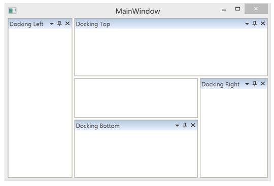
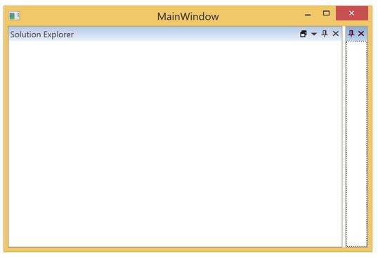
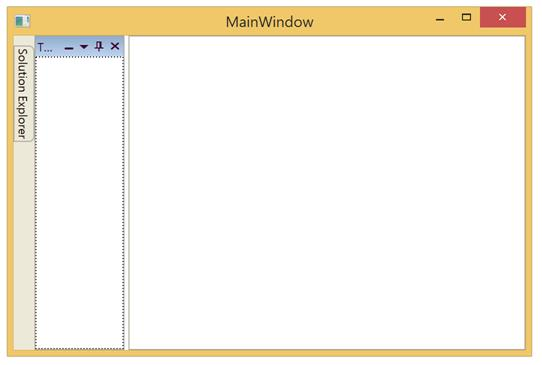
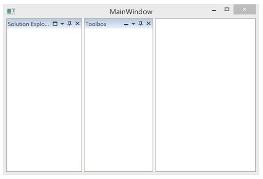

# Docking Window in WPF DockingManager

Docking windows is one of the state of DockingManager. Since `Dock` is the default value, so initially all the children stay as Docking Window

## Configuring window in Different Sides

The five sides that can be docked are 

* Left
* Right
* Top
* Bottom
* Tabbed

To dock 4 children of a DockingManager in 4 different sides, then use [SideInDockedMode](https://help.syncfusion.com/cr/wpf/Syncfusion.Tools.Wpf~Syncfusion.Windows.Tools.Controls.DockItem~SideInDockedMode.html) property with the required values.





<ContentControl syncfusion:DockingManager.Header="Docking Left" syncfusion:DockingManager.SideInDockedMode= "Left" />

<ContentControl syncfusion:DockingManager.Header="Docking Top"  syncfusion:DockingManager.SideInDockedMode= "Top"/>

<ContentControl syncfusion:DockingManager.Header="Docking Right"  syncfusion:DockingManager.SideInDockedMode= "Right"/>

<ContentControl syncfusion:DockingManager.Header="Docking Bottom"  syncfusion:DockingManager.SideInDockedMode="Bottom" />





//Dock at Left

DockingManager.SetSideInDockedMode(dockWindow1, DockSide.Left);

//Dock at Top

DockingManager.SetSideInDockedMode(dockWindow2, DockSide.Top);

//Dock at Right

DockingManager.SetSideInDockedMode(dockWindow3, DockSide.Right);

//Dock at Bottom

DockingManager.SetSideInDockedMode(dockWindow4, DockSide.Bottom);





## Docking window in various Targets 

Docking window can also be docked at any side of the Target Docking Window through an attached property named [TargetNameInDockedMode](https://help.syncfusion.com/cr/wpf/Syncfusion.Tools.Wpf~Syncfusion.Windows.Tools.Controls.DockItem~TargetNameInDockedMode.html).
 
Also to set as Tabbed Window, the window should aware of a Target window name. The following code helps to arrange children of DockingManager that targets a single Docking window docked along Left, Top, Right and Tabbed.



<ContentControl syncfusion:DockingManager.Header="Targeted Window" x:Name="DockingWindow1"/>

<!--Targeted to Docking Window1 on Top Side-->
<ContentControl syncfusion:DockingManager.Header="Top"
                syncfusion:DockingManager.SideInDockedMode="Top"
                syncfusion:DockingManager.TargetNameInDockedMode="DockingWindow1"/>

 <!--Targeted to DockingWindow1 on Right Side-->
<ContentControl syncfusion:DockingManager.Header="Right"
                syncfusion:DockingManager.SideInDockedMode="Right"
                syncfusion:DockingManager.TargetNameInDockedMode="DockingWindow1"/>

<!--Targeted to DockingWindow1 on Left Side-->
<ContentControl syncfusion:DockingManager.Header="Left"
                syncfusion:DockingManager.SideInDockedMode="Left"
                syncfusion:DockingManager.TargetNameInDockedMode="DockingWindow1"/>

<!--Targeted to DockingWindow to tab-->
<ContentControl syncfusion:DockingManager.Header="Tabbed"
                syncfusion:DockingManager.SideInDockedMode="Tabbed"
                syncfusion:DockingManager.TargetNameInDockedMode="DockingWindow1"/>      





dockWindow1.Name = "DockingWindow1";

DockingManager.SetTargetNameInDockedMode(dockWindow2, "DockingWindow1");

DockingManager.SetSideInDockedMode(dockWindow2, DockSide.Top);

DockingManager.SetTargetNameInDockedMode(dockWindow3, "DockingWindow1");

DockingManager.SetSideInDockedMode(dockWindow3, DockSide.Right);

DockingManager.SetTargetNameInDockedMode(dockWindow4, "DockingWindow1");

DockingManager.SetSideInDockedMode(dockWindow4, DockSide.Left);

DockingManager.SetTargetNameInDockedMode(dockWindow5, "DockingWindow1");

DockingManager.SetSideInDockedMode(dockWindow5, DockSide.Tabbed);





N> View [Sample](https://github.com/SyncfusionExamples/how-to-arrange-children-of-docking-containers-like-a-grid-with-3-column-two-row-and-cell-merging/tree/master/DockingManagerTest_C%23) in GitHub

## Maximize/Minimize Support

This feature helps to Maximize/Minimize Docked Windows for better usage of each window. This support is enabled only when the parent container of a specific element contains more than one host.

* It helps a particular docked window to provide a maximized view
* It can minimize a docked window and can be restored when needed

### Enabling Maximization feature

To enable maximizing feature of Docking Window, set [MaximizeButtonEnabled](https://help.syncfusion.com/cr/wpf/Syncfusion.Tools.Wpf~Syncfusion.Windows.Tools.Controls.DockingManager~MaximizeButtonEnabled.html) to `True`





<syncfusion:DockingManager MaximizeButtonEnabled="True">

<ContentControl syncfusion:DockingManager.Header="Solution Explorer"/>

<ContentControl syncfusion:DockingManager.Header="Toolbox"/>

</syncfusion:DockingManager>





SyncDockingManager.MaximizeButtonEnabled = true;





### Maximize Docking Window to full screen

[MaximizeMode](https://help.syncfusion.com/cr/wpf/Syncfusion.Tools.Wpf~Syncfusion.Windows.Tools.Controls.DockingManager~MaximizeMode.html) helps to change the maximization behavior of DockingWindow. Docking Windows occupies entire screen when [MaximizeMode](https://help.syncfusion.com/cr/wpf/Syncfusion.Tools.Wpf~Syncfusion.Windows.Tools.Controls.DockingManager~MaximizeMode.html) set as FullScreen and DockingWindow in the Maximized state.




<syncfusion:DockingManager MaximizeButtonEnabled="True" MaximizeMode="FullScreen"/>





SyncDockingManager.MaximizeButtonEnabled = true;

SyncDockingManager.MaximizeMode = MaximizeMode.FullScreen;





### Enabling Minimization feature

To enable minimizing feature of DockingWindow, set [MinimizeButtonEnabled](https://help.syncfusion.com/cr/wpf/Syncfusion.Tools.Wpf~Syncfusion.Windows.Tools.Controls.DockingManager~MinimizeButtonEnabled.html) to `True`





<syncfusion:DockingManager x:Name="SyncDockingManager" MinimizeButtonEnabled="True">

<ContentControl x:Name="SolutionExplorer" syncfusion:DockingManager.Header="Solution Explorer"/>

<ContentControl x:Name="ToolBox" syncfusion:DockingManager.Header="Toolbox"/>

</syncfusion:DockingManager>





SyncDockingManager.MinimizeButtonEnabled = true;





### Restrict Maximization or Minimization for a specific children

DockingManager provides two attached property named [CanMaximize](https://help.syncfusion.com/cr/wpf/Syncfusion.Tools.Wpf~Syncfusion.Windows.Tools.Controls.DockItem~CanMaximize.html) and [CanMinimize](https://help.syncfusion.com/cr/wpf/Syncfusion.Tools.Wpf~Syncfusion.Windows.Tools.Controls.DockItem~CanMinimize.html) to enable or disable Maximizing and Minimizing buttons respectively to the specific window.





<syncfusion:DockingManager MaximizeButtonEnabled="True" MinimizeButtonEnabled="True">

<ContentControl syncfusion:DockingManager.Header="Solution Explorer" syncfusion:DockingManager.CanMinimize="False" />

<ContentControl syncfusion:DockingManager.Header="Toolbox" syncfusion:DockingManager.CanMaximize="False"/>

</syncfusion:DockingManager>





SyncDockingManager.MinimizeButtonEnabled = true;

SyncDockingManager.MaximizeButtonEnabled = true;

//Restrict the minimize option for Solution Explorer window

DockingManager.SetCanMinimize(SolutionExplorer, false);

//Restrict the maximize option Toolbox window

DockingManager.SetCanMaximize(Toolbox, false);





## Hot Drag the window

The DockWindow Header can be highlighted when the mouse is hovered on an active Docking window by [IsEnableHotTracking](https://help.syncfusion.com/cr/wpf/Syncfusion.Tools.Wpf~Syncfusion.Windows.Tools.Controls.DockingManager~IsEnableHotTracking.html) property. Default value of IsEnableHotTracking is `False`, to enable this functionality turn its value to `True`.





<syncfusion:DockingManager x:Name="SyncDockingManager" IsEnableHotTracking="True"/>





SyncDockingManager.IsEnableHotTracking = true;





## Enabling or Disabling the Dock functionality

The [CanDock](https://help.syncfusion.com/cr/wpf/Syncfusion.Tools.Wpf~Syncfusion.Windows.Tools.Controls.DockItem~CanDock.html) property can help to enable or disable the docking functionality by setting its value as `True` or `False`. By default its value is `True`, to disable this functionality turn its value to `False`.





<ContentControl syncfusion:DockingManager.CanDock="False" />





DockingManager.SetCanDock(dockWindow1, false);





## Enabling or Disabling the Header Visibility

[NoHeader](https://help.syncfusion.com/cr/wpf/Syncfusion.Tools.Wpf~Syncfusion.Windows.Tools.Controls.DockItem~NoHeader.html) is an attached property, that is used to hide the header of DockWindow. Default value of NoHeader is `False`, to hide the Header turn its value to `True`.





<ContentControl syncfusion:DockingManager.Header="Toolbox"/>

<!--NoHeader enabled to this child-->
<ContentControl syncfusion:DockingManager.Header="Solution Explorer" syncfusion:DockingManager.NoHeader="True" /> 





DockingManager.SetNoHeader(SolutionExplorer, true);





