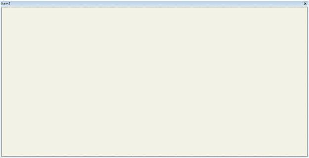
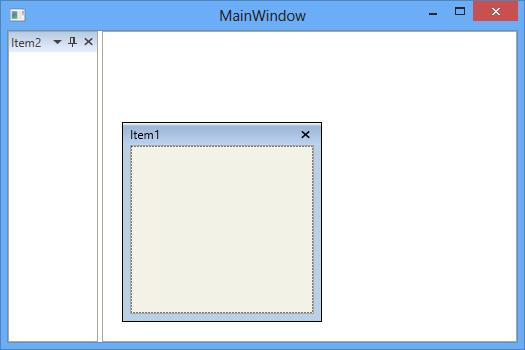

# Floating Window in WPF Docking (DockingManager)

Floating window is one of the state in the DockingManager. To make children of the DockingManager as Float, set its [State](https://help.syncfusion.com/cr/wpf/Syncfusion.Windows.Tools.Controls.DockItem.html#Syncfusion_Windows_Tools_Controls_DockItem_State) values as `Float`.

Floating window is like a Popup and it has some limitation in resizing. To avoid this limitation, set the [UseNativeFloatWindow](https://help.syncfusion.com/cr/wpf/Syncfusion.Windows.Tools.Controls.DockingManager.html#Syncfusion_Windows_Tools_Controls_DockingManager_UseNativeFloatWindow) property of the DockingManager as `True`.





<syncfusion:DockingManager x:Name="SyncDockingManager" UseNativeFloatWindow="True">

<ContentControl syncfusion:DockingManager.Header="Item1" syncfusion:DockingManager.State="Float"/>

</syncfusion:DockingManager>





SyncDockingManager.UseNativeFloatWindow = true;





## Rolling Up support

The float window is rolled up to top using the property [IsRollUpTopProperty](https://help.syncfusion.com/cr/wpf/Syncfusion.Windows.Tools.Controls.DockingManager.html#Syncfusion_Windows_Tools_Controls_DockingManager_IsRollupFloatWindow). To enable this functionality set its value as `True`, by default its value is `False`.        





<syncfusion:DockingManager IsRollupFloatWindow="True">

<ContentControl syncfusion:DockingManager.Header="Item1" syncfusion:DockingManager.State="Float"/>

</syncfusion:DockingManager>





SyncDockingManager.IsRollupFloatWindow = true;





## Displaying Float Windows in Taskbar

Taskbar displays the icon of running applications for the purpose of switching between applications. Similarly `DockingManager` allows to display [NativeFloatWindow](https://help.syncfusion.com/cr/wpf/Syncfusion.Windows.Tools.Controls.NativeFloatWindow.html) in taskbar. It can be set using [ShowFloatWindowInTaskbar](https://help.syncfusion.com/cr/wpf/Syncfusion.Windows.Tools.Controls.DockingManager.html#Syncfusion_Windows_Tools_Controls_DockingManager_ShowFloatWindowInTaskbar) property for all the [NativeFloatWindow](https://help.syncfusion.com/cr/wpf/Syncfusion.Windows.Tools.Controls.NativeFloatWindow.html) in `DockingManager` and default is false. Only [NativeFloatWindow](https://help.syncfusion.com/cr/wpf/Syncfusion.Windows.Tools.Controls.NativeFloatWindow.html) icon can be displayed in taskbar so it is necessary to set [UseNativeFloatWindow](https://help.syncfusion.com/cr/wpf/Syncfusion.Windows.Tools.Controls.DockingManager.html#Syncfusion_Windows_Tools_Controls_DockingManager_UseNativeFloatWindow) to true. 





<syncfusion:DockingManager ShowFloatWindowInTaskbar="True" UseNativeFloatWindow="True">

<ContentControl syncfusion:DockingManager.Header="Toolbox"
                syncfusion:DockingManager.State="Float"
                Content="No items to display in toolbox"/>
                
<ContentControl syncfusion:DockingManager.Header="Solution Explorer"
                syncfusion:DockingManager.State="Float"
                Content="Loading failed"/>
                
</syncfusion:DockingManager>





SyncDockingManager.UseNativeFloatWindow = true;

SyncDockingManager.ShowFloatWindowInTaskbar = true;
		




### Show or Hide the Taskbar support for Selective Windows

To enable or disable the taskbar support for particular window, use the attached property [ShowInTaskbar](https://help.syncfusion.com/cr/wpf/Syncfusion.Windows.Tools.Controls.DockItem.html#Syncfusion_Windows_Tools_Controls_DockItem_ShowInTaskbar) of `DockingManager` and the default is true. It is necessary to set [ShowFloatWindowInTaskbar](https://help.syncfusion.com/cr/wpf/Syncfusion.Windows.Tools.Controls.DockingManager.html#Syncfusion_Windows_Tools_Controls_DockingManager_ShowFloatWindowInTaskbar) property of `DockingManager` to true for displaying even a single `NativeFloatWindow` in taskbar.





<syncfusion:DockingManager ShowFloatWindowInTaskbar="True" UseNativeFloatWindow="True">

<ContentControl syncfusion:DockingManager.Header="Toolbox" syncfusion:DockingManager.State="Float"
                syncfusion:DockingManager.ShowInTaskbar="False"
                Content="No items to display in toolbox"/>

<ContentControl syncfusion:DockingManager.Header="Solution Explorer"
                syncfusion:DockingManager.State="Float"
                Content="Loading failed"/>

</syncfusion:DockingManager>





SyncDockingManager.UseNativeFloatWindow = true;

SyncDockingManager.ShowFloatWindowInTaskbar = true;

DockingManager.SetShowInTaskbar(Toolbox, false);





## Multiple Monitor functionalities

The default behavior of the float window remains as Popup in the DockingManager. 

On using MultiMonitor scenario, the FloatWindow behavior as follows:

* FloatWindow can be resized both in primary and secondary monitor.
* On showing half of the float window between primary and secondary monitor, the float window remains in half between the monitor while plugged in and plugged out of the secondary monitor.
* When float window is moved to secondary monitor from primary monitor, the float window remains at the secondary monitor itself while plugged in.

To make float window behave like a WPF window in multiple monitor, set the property [UseNativeFloatWindow](https://help.syncfusion.com/cr/wpf/Syncfusion.Windows.Tools.Controls.DockingManager.html#Syncfusion_Windows_Tools_Controls_DockingManager_UseNativeFloatWindow) as `True`. 

## Enabling or Disabling the float functionality

The [CanFloat](https://help.syncfusion.com/cr/wpf/Syncfusion.Windows.Tools.Controls.DockItem.html#Syncfusion_Windows_Tools_Controls_DockItem_CanFloat) property helps to enable or disable the floating functionality by setting its value as `True` or `False` respectively. By default its value is `True`, to disable this functionality turn its value to `False`.





<syncfusion:DockingManager x:Name="DockingManager1" >

<ContentControl syncfusion:DockingManager.Header="Item1" syncfusion:DockingManager.CanFloat="True"/>

<ContentControl syncfusion:DockingManager.Header="Item2" syncfusion:DockingManager.CanFloat="False"/>

</syncfusion:DockingManager>





//To Enable the Float Functionality 

DockingManager.SetCanFloat(Item1, true);

//To disable the Float Functionality

DockingManager.SetCanFloat(Item2, false);
			




## Enabling and Disabling the float functionality Operation on Double Click

The float window changes its state to `Dock` when double click its header by default. To disable this functionality for the specific child, set [NoDock](https://help.syncfusion.com/cr/wpf/Syncfusion.Windows.Tools.Controls.DockItem.html#Syncfusion_Windows_Tools_Controls_DockItem_NoDock) property as `True`.       





<syncfusion:DockingManager x:Name="DockingManager1">

<ContentControl syncfusion:DockingManager.Header="Item1" x:Name="Content1" 
                syncfusion:DockingManager.State="Float" syncfusion:DockingManager.NoDock="True"/>                      

</syncfusion:DockingManager>





DockingManager.SetNoDock(Content1, true);





## Maximize/Minimize float window

The float window provides Maximization support for better usability and it is only applicable for NativeFloatWindow. To enable the maximizing feature for the Float window, set [CanFloatMaximize](https://help.syncfusion.com/cr/wpf/Syncfusion.Windows.Tools.Controls.DockItem.html#Syncfusion_Windows_Tools_Controls_DockItem_CanFloatMaximize) for the specific child as `True`. By default, its value is `False`.





<syncfusion:DockingManager UseNativeFloatWindow="True">

<ContentControl syncfusion:DockingManager.Header="Item1" x:Name="Content1" 
                syncfusion:DockingManager.State="Float" syncfusion:DockingManager.CanFloatMaximize="True"/>    

</syncfusion:DockingManager>





SyncDockingManager.UseNativeFloatWindow = true;

DockingManager.SetCanFloatMaximize(Content1, true);





## Float or Maximize on double clicking the header

The [DoubleClickAction](https://help.syncfusion.com/cr/wpf/Syncfusion.Windows.Tools.Controls.DockingManager.html#Syncfusion_Windows_Tools_Controls_DockingManager_DoubleClickAction) property of DockingManager decides whether the NativeFloatWindow can be maximized or moved to dock state while double clicking on header. If the property [DoubleClickAction](https://help.syncfusion.com/cr/wpf/Syncfusion.Windows.Tools.Controls.DockingManager.html#Syncfusion_Windows_Tools_Controls_DockingManager_DoubleClickAction) is [DockOrFloat](https://help.syncfusion.com/cr/wpf/Syncfusion.Windows.Tools.Controls.DoubleClickAction.html), the NativeFloatWindow will moved to dock state while double clicking on header. Also, if the property [DoubleClickAction](https://help.syncfusion.com/cr/wpf/Syncfusion.Windows.Tools.Controls.DockingManager.html#Syncfusion_Windows_Tools_Controls_DockingManager_DoubleClickAction) is [MaximizeOrRestore](https://help.syncfusion.com/cr/wpf/Syncfusion.Windows.Tools.Controls.DoubleClickAction.html), the NativeFloatWindow will moved to maximized or restored window state while double clicking on header only when its [CanFloatMaximize](https://help.syncfusion.com/cr/wpf/Syncfusion.Windows.Tools.Controls.DockItem.html#Syncfusion_Windows_Tools_Controls_DockItem_CanFloatMaximize) attached property is true. The default value of the [DoubleClickAction](https://help.syncfusion.com/cr/wpf/Syncfusion.Windows.Tools.Controls.DockingManager.html#Syncfusion_Windows_Tools_Controls_DockingManager_DoubleClickAction) property is [DockOrFloat](https://help.syncfusion.com/cr/wpf/Syncfusion.Windows.Tools.Controls.DoubleClickAction.html).





<syncfusion:DockingManager x:Name="dockingManager" UseNativeFloatWindow="True" DoubleClickAction="DockOrFloat">
    <ContentControl x:Name="Dock1" syncfusion:DockingManager.Header="Dock1" syncfusion:DockingManager.State="Float"/>
    <ContentControl x:Name="Dock2" syncfusion:DockingManager.Header="Dock2"/>
    <ContentControl x:Name="Dock3" syncfusion:DockingManager.Header="Dock3"/>
    <ContentControl x:Name="Dock4" syncfusion:DockingManager.Header="Dock4"/>
</syncfusion:DockingManager>





dockingManager.DoubleClickAction = DoubleClickAction.DockOrFloat; 





N> The [DoubleClickAction](https://help.syncfusion.com/cr/wpf/Syncfusion.Windows.Tools.Controls.DockingManager.html#Syncfusion_Windows_Tools_Controls_DockingManager_DoubleClickAction) property works only when [UseNativeFloatWindow](https://help.syncfusion.com/cr/wpf/Syncfusion.Windows.Tools.Controls.DockingManager.html#Syncfusion_Windows_Tools_Controls_DockingManager_UseNativeFloatWindow) property is true in DockingManager.  

## Positioning on desire location

The FloatWindow can be placed at any desired location. To position the FloatWindow at the desired location with the required Rect Bounds, call [SetFloatingWindowRect](https://help.syncfusion.com/cr/wpf/Syncfusion.Windows.Tools.Controls.DockingManager.html#Syncfusion_Windows_Tools_Controls_DockingManager_SetFloatingWindowRect_System_Windows_DependencyObject_System_Windows_Rect_) method of the DockingManager.





DockingManager.SetFloatingWindowRect(Content1,new Rect(200,200,200,200));





DockingManager.SetFloatingWindowRect(Content1, New Rect(200, 200, 200, 200)) 





## Snapping Float window

Float window can be snapped with the edge of another float window and moving all together in `DockingManager`. To enable snapping window feature for the Float window, set [AllowSnap](https://help.syncfusion.com/cr/wpf/Syncfusion.Windows.Tools.Controls.DockingManager.html#Syncfusion_Windows_Tools_Controls_DockingManager_AllowSnapProperty) for the specific child as `True` and set [EnableSnappingFloatWindow](https://help.syncfusion.com/cr/wpf/Syncfusion.Windows.Tools.Controls.DockingManager.html#Syncfusion_Windows_Tools_Controls_DockingManager_EnableSnappingFloatWindowProperty) as `True` in `DockingManager`. By default, its value is `False`





<syncfusion:DockingManager  EnableSnappingFloatWindow="True">
  <ContentControl x:Name="Dock1" syncfusion:DockingManager.Header="Dock1"
                                 syncfusion:DockingManager.AllowSnap="True"/>
  <ContentControl x:Name="Dock2" syncfusion:DockingManager.Header="Dock2"
                                 syncfusion:DockingManager.AllowSnap="True"/>
  <ContentControl x:Name="Dock3" syncfusion:DockingManager.Header="Dock3"
                                 syncfusion:DockingManager.AllowSnap="True"/>
  <ContentControl x:Name="Dock4" syncfusion:DockingManager.Header="Dock4"
                                 syncfusion:DockingManager.AllowSnap="True"/>

</syncfusion:DockingManager>





SyncDockingManager.EnableSnappingFloatWindow = true;
			
DockingManager.SetAllowSnap(Dock1, true);

DockingManager.SetAllowSnap(Dock2, true);

DockingManager.SetAllowSnap(Dock3, true);

DockingManager.SetAllowSnap(Dock4, true);





We can get the snapped windows collection for specific float child using [GetSnappedWindows](https://help.syncfusion.com/cr/wpf/Syncfusion.Windows.Tools.Controls.DockingManager.html#Syncfusion_Windows_Tools_Controls_DockingManager_GetSnappedWindows_System_Windows_DependencyObject_) method.





DockingManager.GetSnappedWindows(Dock1); 





## Custom context menu items for floating window

You can add the custom context menu items for floating window by using the [FloatWindowContextMenuItems](https://help.syncfusion.com/cr/wpf/Syncfusion.Windows.Tools.Controls.DockingManager.html#Syncfusion_Windows_Tools_Controls_DockingManager_FloatWindowContextMenuItemsProperty) property. You can also add sub menu items for custom context menu item by adding that sub `CustomMenuItem` to the parent [CustomMenuItem](https://help.syncfusion.com/cr/wpf/Syncfusion.Windows.Tools.Controls.CustomMenuItem.html). You can check or uncheck the `CustomMenuItem` interactively or programmatically by using the `CustomMenuItem.IsChecked` property. 

You can collapse the default floating context menu and show only the custom floating context menu items by setting the [CollapseDefaultContextMenuItemsInFloat](https://help.syncfusion.com/cr/wpf/Syncfusion.Windows.Tools.Controls.DockingManager.html#Syncfusion_Windows_Tools_Controls_DockingManager_CollapseDefaultContextMenuItemsInFloatProperty) property to `true`. The default value of `CollapseDefaultContextMenuItemsInFloat` property is `false`.




<syncfusion:DockingManager
    DockFill="True"
    Name="dockingManager" >
    
    <!--Adding custom context menu items for float windows-->
    <syncfusion:DockingManager.FloatWindowContextMenuItems>
        <syncfusion:CustomMenuItemCollection>
            <!--Adding custom context menu items-->
            <syncfusion:CustomMenuItem Header="Menu 1"/>
            <syncfusion:CustomMenuItem Header="Menu 2">

                <!--Adding sub custom context menu items-->
                <syncfusion:CustomMenuItem Header="SubMenu 1"/>
                <syncfusion:CustomMenuItem Header="SubMenu 2"/>
                <syncfusion:CustomMenuItem Header="SubMenu 3" IsChecked="True"/>
            </syncfusion:CustomMenuItem>
        </syncfusion:CustomMenuItemCollection>
    </syncfusion:DockingManager.FloatWindowContextMenuItems>

    <ContentControl syncfusion:DockingManager.Header="Item 1"
                    syncfusion:DockingManager.State="Dock"/>
    <ContentControl syncfusion:DockingManager.Header="Item 2"
                    syncfusion:DockingManager.State="Dock"/>
    <ContentControl syncfusion:DockingManager.Header="Float Window"
                    syncfusion:DockingManager.CollapseDefaultContextMenuItemsInFloat="True"
                    syncfusion:DockingManager.State="Float"/>
</syncfusion:DockingManager>




//Creating custom context menu items
CustomMenuItem menu1 = new CustomMenuItem();
menu1.Header = "Menu 1";
CustomMenuItem menu2 = new CustomMenuItem();
menu2.Header = "Menu 2";

//Creating custom sub context menu items
CustomMenuItem customMenuItem1 = new CustomMenuItem() { Header = "SubMenu 1" };
CustomMenuItem customMenuItem2 = new CustomMenuItem() { Header = "SubMenu 2" };
CustomMenuItem customMenuItem3 = new CustomMenuItem() { Header = "SubMenu 3", IsChecked = true };

menu2.Items.Add(customMenuItem1);
menu2.Items.Add(customMenuItem2);
menu2.Items.Add(customMenuItem3);

//Adding custom context menu items with sub menu items
dockingManager.FloatWindowContextMenuItems.Add(menu1);
dockingManager.FloatWindowContextMenuItems.Add(menu2);




N> [View Sample in GitHub](https://github.com/SyncfusionExamples/syncfusion-wpf-docking-manager-wpf-examples/blob/master/Samples/Custom-ContextMenu)
