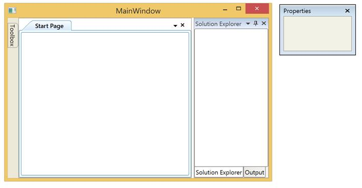
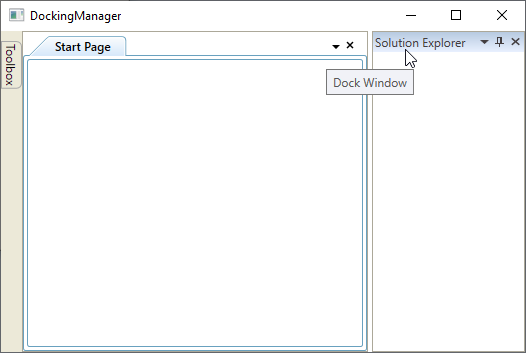

# Getting Started with WPF DockingManager

This section explains how to implement a similar UI as Visual Studio by using the DockingManager. 

## Add Docking Manager

There are several ways to add Syncfusion control in to the Visual Studio WPF project. The following steps help to add a DockingManager control through XAML Code.

* Create a WPF project in Visual Studio and refer to the following assemblies.
1. Syncfusion.Tools.Wpf
2. Syncfusion.Shared.Wpf
* Include an namespace for the above assemblies to the Main window.





<Window

xmlns="http://schemas.microsoft.com/winfx/2006/xaml/presentation"

xmlns:x="http://schemas.microsoft.com/winfx/2006/xaml" 

xmlns:syncfusion="http://schemas.syncfusion.com/wpf" />





using Syncfusion.Windows.Tools.Controls;





* Now add the DockingManager control with a required optimal name by using the included namespace.





<syncfusion:DockingManager x:Name="SyncDockingManager" />





//Creating instance of DockingManager

DockingManager SyncDockingManager = new DockingManager();





## Add Children to the Docking Manager 

DockingManager can accept any control as its children. Here five content controls are added as the children of the DockingManager.





<syncfusion:DockingManager x:Name="SyncDockingManager">

<ContentControl x:Name="SolutionExplorer"/>

<ContentControl x:Name="ToolBox"/>

<ContentControl x:Name="Properties"/>

<ContentControl x:Name="Output"/>

<ContentControl x:Name="StartPage"/>

</syncfusion:DockingManager>





ContentControl SolutionExplorer= new ContentControl();

ContentControl ToolBox = new ContentControl();

ContentControl Properties = new ContentControl();

ContentControl Output = new ContentControl();

ContentControl StartPage = new ContentControl();

//Add content controls as child of DockingManager

dock.Children.Add(SolutionExplorer);

dock.Children.Add(ToolBox);

dock.Children.Add(Properties);

dock.Children.Add(Output);

dock.Children.Add(StartPage);





## Set Header for each child window

DockingManger provides with an attached property `Header` that helps to set the header for a child window. Set the value as “Solution Explorer” for the first child and repeat the same procedure for the remaining children with values as "Toolbox", “Properties”, ”Output” and ”Start Page”.





<syncfusion:DockingManager x:Name="SyncDockingManager" >

<ContentControl x:Name="SolutionExplorer" syncfusion:DockingManager.Header="Solution Explorer" />

<ContentControl x:Name="ToolBox" syncfusion:DockingManager.Header="Toolbox" />

<ContentControl x:Name="Properties" syncfusion:DockingManager.Header="Properties" />

<ContentControl x:Name="Properties" syncfusion:DockingManager.Header="Output"/>

<ContentControl x:Name="StartPage" syncfusion:DockingManager.Header="Start Page" />

</syncfusion:DockingManager>





//Set header of each Content Control

DockingManager.SetHeader(SolutionExplorer, "Solution Explorer");

DockingManager.SetHeader(ToolBox, "Toolbox");

DockingManager.SetHeader(Properties, "Properties");

DockingManager.SetHeader(Properties, "Output");

DockingManager.SetHeader(StartPage, "StartPage");
			




## Set States for each child window

DockingManager provides an attached property `State` that helps to set the state of a child windows. Since `Dock` is the default value, initially all the children as Docking Window.

To Auto hide the “ToolBox” window, set its `State` property as `AutoHidden`. Repeat the same procedure with the `State` value as `Float` and `Document` for “Properties” and “Start Page” windows respectively to make them as Floating Window and Document Window.

Also enable the Document Container for the Document view by setting the `UseDocumentContainer` property to `True`.




<syncfusion:DockingManager x:Name="SyncDockingManager" UseDocumentContainer="True">

<ContentControl x:Name="SolutionExplorer" syncfusion:DockingManager.Header="Solution Explorer" />

<ContentControl x:Name="ToolBox" syncfusion:DockingManager.Header="Toolbox"  syncfusion:DockingManager.State="AutoHidden" />

<ContentControl x:Name="Properties" syncfusion:DockingManager.Header="Properties" syncfusion:DockingManager.State="Float" />

<ContentControl x:Name="Output" syncfusion:DockingManager.Header="Output"/>

<ContentControl x:Name="StartPage" syncfusion:DockingManager.Header="Start Page" syncfusion:DockingManager.State="Document" />

</syncfusion:DockingManager>





// Enable UseDocumentContainer to have a document state windows

SyncDockingManager.UseDocumentContainer = true;

//Set State

DockingManager.SetState(SolutionExplorer, DockState.Dock);

DockingManager.SetState(ToolBox, DockState.AutoHidden);

DockingManager.SetState(Properties, DockState.Float);

DockingManager.SetState(Output, DockState.Dock);

DockingManager.SetState(StartPage, DockState.Document);





## Set Sides for children

DockingManager provides an attached property `SideInDockMode` that helps to dock a window at the required side. Since `Left` is the default value, initially all the windows are docked at left side. 

Set the `SideInDockMode` value as `Right` for “Solution Explorer” window to dock it on the right side.

The side property's `Tabbed` option is used to tab a window on another window. The tabbing windows need to be aware of the target window’s name. Set “Output” window’s `TargetNameInDockedMode` as “SolutionExplorer” to tab it on the “SolutionExplorer” window.





<syncfusion:DockingManager x:Name="SyncDockingManager" UseDocumentContainer="True">

<ContentControl syncfusion:DockingManager.Header="Solution Explorer"
                syncfusion:DockingManager.SideInDockedMode="Right"  x:Name="SolutionExplorer"/>

<ContentControl x:Name="ToolBox" syncfusion:DockingManager.Header="Toolbox" syncfusion:DockingManager.State="AutoHidden" />

<ContentControl x:Name="Properties" syncfusion:DockingManager.Header="Properties" syncfusion:DockingManager.State="Float" />

<ContentControl syncfusion:DockingManager.Header="Output"
                syncfusion:DockingManager.SideInDockedMode="Tabbed"
                syncfusion:DockingManager.TargetNameInDockedMode="SolutionExplorer"/>

<ContentControl x:Name="StartPage" syncfusion:DockingManager.Header="Start Page" syncfusion:DockingManager.State="Document"/>

</syncfusion:DockingManager>





// Dock at right side

DockingManager.SetSideInDockedMode(SolutionExplorer, DockSide.Right);

// For Tabbed Mode

DockingManager.SetTargetNameInDockedMode(Output, "SolutionExplorer");

DockingManager.SetSideInDockedMode(Output, DockSide.Tabbed);





## Save / Load

The `PersistState` feature of the DockingManager helps to save the current layout of the DockingManager automatically, while closing the window. To enable this feature, set `PersistState` property to `True`




<syncfusion:DockingManager x:Name="SyncDockingManager" UseDocumentContainer="True" PersistState="True">

<ContentControl syncfusion:DockingManager.Header="Solution Explorer" syncfusion:DockingManager.SideInDockedMode="Right"/>

<ContentControl syncfusion:DockingManager.Header="Toolbox" syncfusion:DockingManager.State="AutoHidden" />

<ContentControl syncfusion:DockingManager.Header="Properties" syncfusion:DockingManager.State="Float" />

<ContentControl syncfusion:DockingManager.Header="Output" syncfusion:DockingManager.SideInDockedMode="Right"/>

<ContentControl syncfusion:DockingManager.Header="Start Page" syncfusion:DockingManager.State="Document" />

</syncfusion:DockingManager>




			
SyncDockingManager.PersistState = true;


 


The saved state can be reload by calling the `LoadDockState` method, whenever it is required to load the states.





this.SyncDockingManager.LoadDockState();





Me.SyncDockingManager.LoadDockState() 





## Set Visual Styles

DockingManager supports various visual styles by using the `SfSkinManager`. To apply Visual Studio style on the current layout, refer to the following steps.

* Refer the following assemblies with the project
1. Syncfusion.SfSkinManager.Wpf
2. Syncfusion.Themes.VisualStudio2013.Wpf

* Include an namespace for the `SfSkinManager` assembly to the MainWindow.




<Window

xmlns="http://schemas.microsoft.com/winfx/2006/xaml/presentation"

xmlns:x="http://schemas.microsoft.com/winfx/2006/xaml" 

xmlns:syncfusion="http://schemas.syncfusion.com/wpf"

xmlns:syncfusionskin="clr-namespace:Syncfusion.SfSkinManager;assembly=Syncfusion.SfSkinManager.WPF" 

x:Class="WpfApplication7.MainWindow"

Title="MainWindow" Height="350" Width="525" />





using Syncfusion.SfSkinManager;





* Now apply the value as `VisualStudio2013` to the Visual Style property of the SfSkinManager for the DockingManager control.





<syncfusion:DockingManager UseDocumentContainer="True" PersistState="True" syncfusionskin:SfSkinManager.VisualStyle="VisualStudio2013">

<ContentControl syncfusion:DockingManager.Header="Solution Explorer"
                syncfusion:DockingManager.SideInDockedMode="Right"  x:Name="SolutionExplorer" />

<ContentControl syncfusion:DockingManager.Header="Toolbox" x:Name="ToolBox" syncfusion:DockingManager.State="AutoHidden" />

<ContentControl syncfusion:DockingManager.Header="Properties" x:Name="Properties" syncfusion:DockingManager.State="Float" />

<ContentControl syncfusion:DockingManager.Header="Output" x:Name="Output"
                syncfusion:DockingManager.SideInDockedMode="Tabbed"
                syncfusion:DockingManager.TargetNameInDockedMode="SolutionExplorer"/>

<ContentControl syncfusion:DockingManager.Header="Start Page"
                syncfusion:DockingManager.State="Document" x:Name="StartPage" />

</syncfusion:DockingManager>





//Set VisualStyle
			
SfSkinManager.SetVisualStyle(SyncDockingManager,VisualStyles.VisualStudio2013);





## ToolTip for child window

The [CaptionToolTip](https://help.syncfusion.com/cr/wpf/Syncfusion.Windows.Tools.Controls.DockingManager.html#Syncfusion_Windows_Tools_Controls_DockingManager_CaptionToolTipProperty) attached property of DockingManager helps to set the ToolTip for child window when hovering the mouse over it header. This can also be done programmatically by using the [SetCaptionToolTip](https://help.syncfusion.com/cr/wpf/Syncfusion.Windows.Tools.Controls.DockingManager.html#Syncfusion_Windows_Tools_Controls_DockingManager_SetCaptionToolTip_System_Windows_DependencyObject_System_Object_) function of DockingManager.





<syncfusion:DockingManager x:Name="DockingManager1" UseDocumentContainer="True">

<ContentControl syncfusion:DockingManager.Header="Solution Explorer" syncfusion:DockingManager.DesiredWidthInDockedMode="175" x:Name="solutionExplorer" syncfusion:DockingManager.SideInDockedMode="Right" syncfusion:DockingManager.CaptionToolTip="Dock Window"/>

<ContentControl syncfusion:DockingManager.Header="Start Page" x:Name="startPage" syncfusion:DockingManager.State="Document" syncfusion:DockingManager.CaptionToolTip="Document Window"/>

<ContentControl syncfusion:DockingManager.Header="Toolbox" x:Name="toolBox" syncfusion:DockingManager.State="AutoHidden" syncfusion:DockingManager.CanSerialize="False" syncfusion:DockingManager.CaptionToolTip="AutoHidden Window"/>

</syncfusion:DockingManager>





DockingManager.SetCaptionToolTip(solutionExplorer, "Dock Window");
DockingManager.SetCaptionToolTip(startPage, "Document Window");
DockingManager.SetCaptionToolTip(toolBox, "AutoHidden Window");





