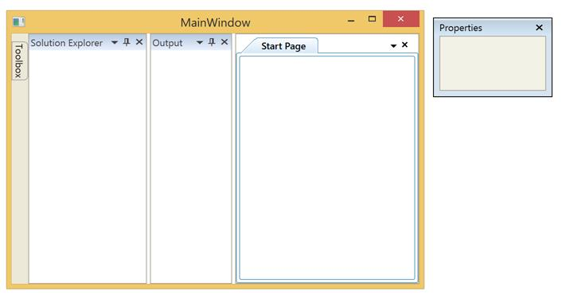

# Getting Started with WPF Docking (DockingManager)

This section explains how to implement a similar UI as Visual Studio by using the [WPF DockingManager](https://www.syncfusion.com/wpf-controls/docking) in your project. 

## Assembly deployment
Refer to the [control dependencies](https://help.syncfusion.com/wpf/control-dependencies#dockingmanager) section to get the list of assemblies or NuGet package that needs to be added as a reference to use the [DockingManager](https://help.syncfusion.com/cr/wpf/Syncfusion.Windows.Tools.Controls.DockingManager.html) control in any application.

You can find more details about installing the NuGet package in a WPF application in the following link:
<<<<<<< HEAD
[How to install nuget packages](https://help.syncfusion.com/wpf/welcome-to-syncfusion-essential-wpf)
=======
[How to install nuget packages](https://help.syncfusion.com/wpf/visual-studio-integration/nuget-packages)
>>>>>>> 75e024c6dd1a443a80d7a9cfa02fb694db1b406a

## Creating Application with DockingManager control
In this walk through, user will create a WPF application with [DockingManager](https://help.syncfusion.com/cr/wpf/Syncfusion.Windows.Tools.Controls.DockingManager.html) control.

1. [Creating project](#Creating-the-project)
2. [Adding control via designer](#Adding-control-via-designer)
3. [Adding control manually in XAML](#Adding-control-manually-in-XAML)
4. [Adding control manually in C#](#Adding-control-manually-in-C#)

## Creating project 
Below section provides detailed information to create new project in Visual Studio with [DockingManager](https://help.syncfusion.com/cr/wpf/Syncfusion.Windows.Tools.Controls.DockingManager.html) control.

## Adding control via designer
The [DockingManager](https://help.syncfusion.com/cr/wpf/Syncfusion.Windows.Tools.Controls.DockingManager.html) control can be added to the application by dragging it from Toolbox and dropping it in designer. The required assembly will be added automatically.

## Adding control manually in XAML
In order to add [DockingManager](https://help.syncfusion.com/cr/wpf/Syncfusion.Windows.Tools.Controls.DockingManager.html) control manually in XAML, do the below steps,

1. Add the below required assembly references to the project,

   * Syncfusion.Shared.Wpf
   * Syncfusion.Tools.Wpf

2. Import Syncfusion WPF schema **http://schemas.syncfusion.com/wpf** in XAML page or Syncfusion.Windows.Tools.Controls namespace.

3. Declare [DockingManager](https://help.syncfusion.com/cr/wpf/Syncfusion.Windows.Tools.Controls.DockingManager.html) in XAML page.





<Window
        xmlns="http://schemas.microsoft.com/winfx/2006/xaml/presentation"
        xmlns:x="http://schemas.microsoft.com/winfx/2006/xaml"
        xmlns:d="http://schemas.microsoft.com/expression/blend/2008"
        xmlns:mc="http://schemas.openxmlformats.org/markup-compatibility/2006"
        xmlns:local="clr-namespace:GettingStartedComboBox"
        xmlns:syncfusion="http://schemas.syncfusion.com/wpf" x:Class="GettingStartedComboBox.MainWindow"
        mc:Ignorable="d"
        Title="MainWindow" Height="450" Width="800">
    <Grid>
        <syncfusion:DockingManager x:Name="dockingManager">
            <ContentControl x:Name="SolutionExplorer"/>
            <ContentControl x:Name="ToolBox"/>
            <ContentControl x:Name="Properties"/>
            <ContentControl x:Name="Output"/>
            <ContentControl x:Name="StartPage"/>
        </syncfusion:DockingManager>
    </Grid>
</Window>





## Adding control manually in C#
In order to add [DockingManager](https://help.syncfusion.com/cr/wpf/Syncfusion.Windows.Tools.Controls.DockingManager.html) control manually in C#, do the below steps,

1. Add the below required assembly references to the project,

    * Syncfusion.Shared.Wpf
    * Syncfusion.Tools.Wpf

2. Import DockingManager namespace **Syncfusion.Windows.Tools.Controls**.

3. Create DockingManager control instance and add it to the page.





using System.Windows;
using Syncfusion.Windows.Tools.Controls;
namespace DockingManager_Sample
{
    /// 

    /// Interaction logic for MainWindow.xaml
    /// 

    public partial class MainWindow : Window
    {
        public MainWindow()
        {
            InitializeComponent();
            DockingManager dockingManager = new DockingManager();

            ContentControl SolutionExplorer = new ContentControl();
            ContentControl ToolBox = new ContentControl();
            ContentControl Properties = new ContentControl();
            ContentControl Output = new ContentControl();
            ContentControl StartPage = new ContentControl();

            //Add content controls as child of DockingManager

            dockingManager.Children.Add(SolutionExplorer);
            dockingManager.Children.Add(ToolBox);
            dockingManager.Children.Add(Properties);
            dockingManager.Children.Add(Output);
            dockingManager.Children.Add(StartPage);

            this.Content = dockingManager;
        }
    }
}




## Set Header for each child window

You can set title for each child windows in [DockingManager](https://help.syncfusion.com/cr/wpf/Syncfusion.Windows.Tools.Controls.DockingManager.html) using [Header](https://help.syncfusion.com/cr/wpf/Syncfusion.Windows.Tools.Controls.DockingManager.html#Syncfusion_Windows_Tools_Controls_DockingManager_HeaderProperty) attached property.





<syncfusion:DockingManager x:Name="dockingManager"  HorizontalAlignment="Stretch" VerticalAlignment="Stretch">
    <ContentControl x:Name="SolutionExplorer" 
        syncfusion:DockingManager.DesiredWidthInDockedMode="150"
        syncfusion:DockingManager.Header="Solution Explorer" />
    <ContentControl x:Name="ToolBox" 
        syncfusion:DockingManager.DesiredWidthInDockedMode="110"
        syncfusion:DockingManager.Header="Toolbox" />
    <ContentControl x:Name="Properties"
        syncfusion:DockingManager.DesiredWidthInDockedMode="110"
        syncfusion:DockingManager.Header="Properties" />
    <ContentControl x:Name="Output"
        syncfusion:DockingManager.DesiredWidthInDockedMode="110"
        syncfusion:DockingManager.Header="Output"/>
    <ContentControl x:Name="StartPage" 
        syncfusion:DockingManager.DesiredWidthInDockedMode="110"
        syncfusion:DockingManager.Header="Start Page" />
</syncfusion:DockingManager>





//Set header of each Content Control

DockingManager.SetHeader(SolutionExplorer, "Solution Explorer");
DockingManager.SetHeader(ToolBox, "Toolbox");
DockingManager.SetHeader(Properties, "Properties");
DockingManager.SetHeader(Output, "Output");
DockingManager.SetHeader(StartPage, "StartPage");
			




## Set States for each child window

You can set the states of each children window in [DockingManager](https://help.syncfusion.com/cr/wpf/Syncfusion.Windows.Tools.Controls.DockingManager.html) using the [State](https://help.syncfusion.com/cr/wpf/Syncfusion.Windows.Tools.Controls.DockingManager.html#Syncfusion_Windows_Tools_Controls_DockingManager_StateProperty) attached property. Since `Dock` is the default value, initially all the children are docked  Docking Window. 

The value of State property can be customized with below,

 * `AutoHidden` : Auto hides the assigned child window.
 * `Dock` : Docks the assigned child window in DockingManager.
 * `Float` : Allows child window to float the assigned child window.
 * `Document` : Docks the assigned child window as tab item in DocumentContainer.

 N> To set `Document` state for any child window [UseDocumentContainer](https://help.syncfusion.com/cr/wpf/Syncfusion.Windows.Tools.Controls.DockingManager.html#Syncfusion_Windows_Tools_Controls_DockingManager_UseDocumentContainer) property of DockingManager must be enabled.





<syncfusion:DockingManager x:Name="dockingManager" UseDocumentContainer="True">

    <ContentControl x:Name="SolutionExplorer" 
                    syncfusion:DockingManager.Header="Solution Explorer"
                    syncfusion:DockingManager.State="Dock"
                    />
    <ContentControl x:Name="ToolBox" 
                    syncfusion:DockingManager.Header="Toolbox" 
                    syncfusion:DockingManager.State="AutoHidden"
                    />
    <ContentControl x:Name="Properties"
                    syncfusion:DockingManager.Header="Properties" 
                    syncfusion:DockingManager.State="Float"
                            />
    <ContentControl x:Name="Output"
                    syncfusion:DockingManager.Header="Output"/>
    <ContentControl x:Name="StartPage" 
                    syncfusion:DockingManager.Header="Start Page"
                    syncfusion:DockingManager.State="Document"
                    />
</syncfusion:DockingManager>





// Enable UseDocumentContainer to have a document state windows

dockingManager.UseDocumentContainer = true;

//Set State

DockingManager.SetState(SolutionExplorer, DockState.Dock);
DockingManager.SetState(ToolBox, DockState.AutoHidden);
DockingManager.SetState(Properties, DockState.Float);
DockingManager.SetState(Output, DockState.Dock);
DockingManager.SetState(StartPage, DockState.Document);





## Set Sides for children

You can customize the position of child windows in [DockingManager](https://help.syncfusion.com/cr/wpf/Syncfusion.Windows.Tools.Controls.DockingManager.html) using the [SideInDockMode](https://help.syncfusion.com/cr/wpf/Syncfusion.Windows.Tools.Controls.DockingManager.html#Syncfusion_Windows_Tools_Controls_DockingManager_SetSideInDockedMode_System_Windows_DependencyObject_Syncfusion_Windows_Tools_Controls_DockSide_) attached property. Since `Left` is the default value, initially all the windows are docked at left side. 





<syncfusion:DockingManager x:Name="dockingManager" UseDocumentContainer="True">
    <ContentControl syncfusion:DockingManager.Header="Solution Explorer"
                    syncfusion:DockingManager.SideInDockedMode="Right"  x:Name="SolutionExplorer"/>

    <ContentControl x:Name="ToolBox" syncfusion:DockingManager.Header="Toolbox" syncfusion:DockingManager.State="AutoHidden" />

    <ContentControl x:Name="Properties" syncfusion:DockingManager.Header="Properties" syncfusion:DockingManager.State="Float" />

    <ContentControl syncfusion:DockingManager.Header="Output"
                    syncfusion:DockingManager.SideInDockedMode="Tabbed"
                    syncfusion:DockingManager.TargetNameInDockedMode="SolutionExplorer"/>

    <ContentControl x:Name="StartPage" syncfusion:DockingManager.Header="Start Page" syncfusion:DockingManager.State="Document"/>
</syncfusion:DockingManager>





// Dock at right side

DockingManager.SetSideInDockedMode(SolutionExplorer, DockSide.Right);
// For Tabbed Mode

DockingManager.SetTargetNameInDockedMode(Output, "SolutionExplorer");
DockingManager.SetSideInDockedMode(Output, DockSide.Tabbed);





## Save / Load the layout 

You can automatically save the current layout of [DockingManager](https://help.syncfusion.com/cr/wpf/Syncfusion.Windows.Tools.Controls.DockingManager.html) while closing the MainWindow by enabling the [PersistState](https://help.syncfusion.com/cr/wpf/Syncfusion.Windows.Tools.Controls.DockingManager.html#Syncfusion_Windows_Tools_Controls_DockingManager_PersistState) property.





<syncfusion:DockingManager x:Name="dockingManager" UseDocumentContainer="True" PersistState="True">
<ContentControl syncfusion:DockingManager.Header="Solution Explorer" syncfusion:DockingManager.SideInDockedMode="Right"/>
<ContentControl syncfusion:DockingManager.Header="Toolbox" syncfusion:DockingManager.State="AutoHidden" />
<ContentControl syncfusion:DockingManager.Header="Properties" syncfusion:DockingManager.State="Float" />
<ContentControl syncfusion:DockingManager.Header="Output" syncfusion:DockingManager.SideInDockedMode="Right"/>
<ContentControl syncfusion:DockingManager.Header="Start Page" syncfusion:DockingManager.State="Document" />
</syncfusion:DockingManager>




			
SyncDockingManager.PersistState = true;


 


The saved state can be reload by calling the [LoadDockState](https://help.syncfusion.com/cr/wpf/Syncfusion.Windows.Tools.Controls.DockingManager.html#Syncfusion_Windows_Tools_Controls_DockingManager_LoadDockState) method, whenever it is required to load the states.





this.SyncDockingManager.LoadDockState();





Me.SyncDockingManager.LoadDockState() 





## Set Visual Styles

You can customize the visual styles of [DockingManager](https://help.syncfusion.com/cr/wpf/Syncfusion.Windows.Tools.Controls.DockingManager.html) using [SfSkinManager](https://help.syncfusion.com/cr/wpf/Syncfusion.SfSkinManager.SfSkinManager.html). To apply Visual Studio style on the current layout, refer to the following steps.

* Refer the following assemblies in your project.

    1. Syncfusion.SfSkinManager.Wpf
    2. Syncfusion.Themes.VisualStudio2013.Wpf

* Include an namespace for the `SfSkinManager` assembly to the MainWindow.





<Window

xmlns="http://schemas.microsoft.com/winfx/2006/xaml/presentation"

xmlns:x="http://schemas.microsoft.com/winfx/2006/xaml" 

xmlns:syncfusion="http://schemas.syncfusion.com/wpf"

xmlns:syncfusionskin="clr-namespace:Syncfusion.SfSkinManager;assembly=Syncfusion.SfSkinManager.WPF" 

x:Class="WpfApplication7.MainWindow"

Title="MainWindow" Height="350" Width="525" />





using Syncfusion.SfSkinManager;





* Now apply the value as `VisualStudio2013` to the [VisualStyle](https://help.syncfusion.com/cr/wpf/Syncfusion.SfSkinManager.SfSkinManager.html#Syncfusion_SfSkinManager_SfSkinManager_SetVisualStyle_System_Windows_DependencyObject_Syncfusion_SfSkinManager_VisualStyles_) property of the SfSkinManager for the DockingManager control.





<syncfusion:DockingManager UseDocumentContainer="True" PersistState="True" syncfusionskin:SfSkinManager.VisualStyle="VisualStudio2013">
    <ContentControl syncfusion:DockingManager.Header="Solution Explorer"
                    syncfusion:DockingManager.SideInDockedMode="Right"  x:Name="SolutionExplorer" />
    <ContentControl syncfusion:DockingManager.Header="Toolbox" x:Name="ToolBox" syncfusion:DockingManager.State="AutoHidden" />
    <ContentControl syncfusion:DockingManager.Header="Properties" x:Name="Properties" syncfusion:DockingManager.State="Float" />
    <ContentControl syncfusion:DockingManager.Header="Output" x:Name="Output"
                    syncfusion:DockingManager.SideInDockedMode="Tabbed"
                    syncfusion:DockingManager.TargetNameInDockedMode="SolutionExplorer"/>
    <ContentControl syncfusion:DockingManager.Header="Start Page"   
                    syncfusion:DockingManager.State="Document" x:Name="StartPage" />
</syncfusion:DockingManager>





//Set VisualStyle
			
SfSkinManager.SetVisualStyle(SyncDockingManager,VisualStyles.VisualStudio2013);





## ToolTip for child window

You can show ToolTip when hover the mouse over the header of child windows in [DockingManager](https://help.syncfusion.com/cr/wpf/Syncfusion.Windows.Tools.Controls.DockingManager.html) using the [CaptionToolTip](https://help.syncfusion.com/cr/wpf/Syncfusion.Windows.Tools.Controls.DockingManager.html#Syncfusion_Windows_Tools_Controls_DockingManager_CaptionToolTipProperty) attached property in XAML and [SetCaptionToolTip](https://help.syncfusion.com/cr/wpf/Syncfusion.Windows.Tools.Controls.DockingManager.html#Syncfusion_Windows_Tools_Controls_DockingManager_SetCaptionToolTip_System_Windows_DependencyObject_System_Object_) method in code behind.





<syncfusion:DockingManager x:Name="DockingManager1" UseDocumentContainer="True">
<ContentControl syncfusion:DockingManager.Header="Solution Explorer" syncfusion:DockingManager.DesiredWidthInDockedMode="175" x:Name="solutionExplorer" syncfusion:DockingManager.SideInDockedMode="Right" syncfusion:DockingManager.CaptionToolTip="Dock Window"/>
<ContentControl syncfusion:DockingManager.Header="Start Page" x:Name="startPage" syncfusion:DockingManager.State="Document" syncfusion:DockingManager.CaptionToolTip="Document Window"/>
<ContentControl syncfusion:DockingManager.Header="Toolbox" x:Name="toolBox" syncfusion:DockingManager.State="AutoHidden" syncfusion:DockingManager.CanSerialize="False" syncfusion:DockingManager.CaptionToolTip="AutoHidden Window"/>
</syncfusion:DockingManager>





DockingManager.SetCaptionToolTip(solutionExplorer, "Dock Window");
DockingManager.SetCaptionToolTip(startPage, "Document Window");
DockingManager.SetCaptionToolTip(toolBox, "AutoHidden Window");





## Theme

DockingManager supports various built-in themes. Refer to the below links to apply themes for the DockingManager,

  * [Apply theme using SfSkinManager](https://help.syncfusion.com/wpf/themes/skin-manager)
	
  * [Create a custom theme using ThemeStudio](https://help.syncfusion.com/wpf/themes/theme-studio#creating-custom-theme)

  
