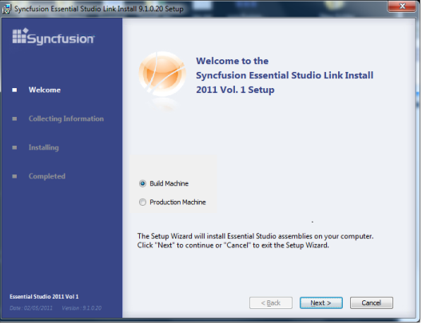
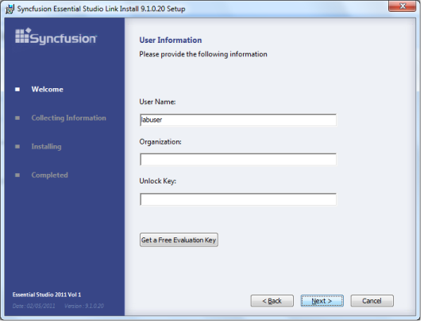
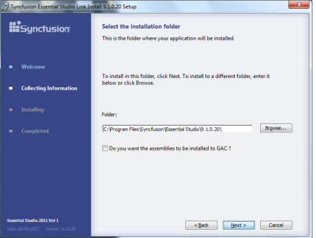

# How to configure a build machine in WPF Docking

To compile projects that use Syncfusion® controls in a build machine, Syncfusion® helps to install the Link Install Setup. The setup installs Syncfusion® assemblies into the target folder, and registers the product key to the registry. This allows you to compile a project, developed on a build machine. Please download the link install setup from the below location 

[http://files2.syncfusion.com/installs/v9.1.0.20/essentialstudiolinkinstall.exe](http://files2.syncfusion.com/installs/v9.1.0.20/essentialstudiolinkinstall.exe)

Installing on a build machine

1.  Run Link Install Setup. 

2.  Choose the Build Machine option.
  
3.  Click Next.

    

4.  A dialog box titled User Information opens
5.  In the dialog box, provide user information and unlock key. 
6.  Click Next.

    

7.  Select the installation folder

8.  Under Folder, make sure the correct folder has been chosen.
 
9.  Choose Install into GAC, if needed. 

10. Click Next.

    

11. In the next window, click Finish to complete the setup.
