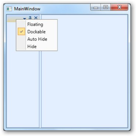

# How to remove Menu Items in Docking in WPF Data Grid

We can remove individual MenuItem in ContextMenu using the following properties.  The removal can be done by right clicking on it.

* ShowHiddenMenuItem
* ShowFloatingMenuItem
* ShowFloatingMenuItem
* ShowDockableMenuItem
* ShowTabbedMenuItem
* ShowTabbedMenuItem
* ShowAutoHiddenMenuItem
* ShowDocumentMenuItem
* ShowCloseMenuItem
* ShowHorizontalTabGroupMenuItem
* ShowVerticalTabGroupMenuItem
* ShowMovetoNextTabGroupMenuItem
* ShowMovetoPreviousTabGroupMenuItem
* ShowRestoreMenuItem
* ShowMoveMenuItem
* ShowResizeMenuItem
* ShowMinimizeMenuItem
* ShowMaximizedMenuItem

The below code shows how to disable Tabbed menu item using ShowTabbedMenuItem attached property





<syncfusion:DockingManager>    

	<Grid Name="grid1" syncfusion:DockingManager.ShowTabbedMenuItem="False"/>  

</syncfusion:DockingManager>





DockingManager.SetShowTabbedMenuItem(grid1, false);





Similarly you can use other properties to disable corresponding MenuItems.