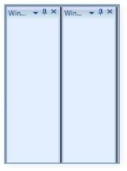

# How to set splitter background and size in Docking in WPF Data Grid

SplitterBackground is the property used to apply background to splitter between docked Children.





<syncfusion:DockingManager Name="DockingManager" SplitterBackground="Black">    

	<Grid Name="grid1" syncfusion:DockingManager.Header="Window1"/>    

	<Grid Name="grid2" syncfusion:DockingManager.Header="Window2"/>

</syncfusion:DockingManager>





DockingManager.SplitterBackground = Brushes.Black;





