# Interactive Features

A basic requirement in creating any WPF application that uses our DockingManager control, is the ability to set a window as an active window. DockingManager's [ActiveWindow](https://help.syncfusion.com/cr/wpf/Syncfusion.Windows.Tools.Controls.DockingManager.html#Syncfusion_Windows_Tools_Controls_DockingManager_ActiveWindow) property can be used for this. [ActiveWindow](https://help.syncfusion.com/cr/wpf/Syncfusion.Windows.Tools.Controls.DockingManager.html#Syncfusion_Windows_Tools_Controls_DockingManager_ActiveWindow) is an element, which returns a window object that is currently focused. To set a window as active, use the following code.





<!--Adding Docking Manager-->   
     
<syncfusion:DockingManager AutoHideAnimationMode="Fade" Name="DockingManager" Loaded="DockingManager_Loaded">            
	
	<!--Adding Children for the Docking Manager control with state as Dock and a side in dock mode as left-->
	
	<StackPanel syncfusion:DockingManager.State="Dock" Name="Element One"  syncfusion:DockingManager.SideInDockedMode="Left"/>            
	
	<StackPanel syncfusion:DockingManager.State="Dock" Name="Element Two" syncfusion:DockingManager.SideInDockedMode="Right"/>        

</syncfusion:DockingManager>





//Setting the active window, giving the name of the children element as the parameter for the Activate Window.

DockingManager.ActivateWindow("Name of the Window");



 

#### Event

<table>
<tr>
<th>
Event</th><th>
Description</th></tr>
<tr>
<td>
OnActiveWindowChanged</td><td>
Handled when an active window is changed.</td></tr>
</table>

#### Method

<table>
<tr>
<th>
Method</th><th>
Description</th></tr>
<tr>
<td>
OnActivateWindow</td><td>
This method is called when an active window is changed. </td></tr>
</table>

### Retrieving an Active Window from DockingManager

Sometimes, you need to identify an active window to perform some operations at run time. For this, create an object for the FrameWorkElement and set the DockingManager active window to it. Now the FrameWorkElement object returns the active window.

The following code snippet explains how to retrieve the Active window from the Docking Manager control.



//Checking the active window as null or not.

if (DockingManager1.ActiveWindow != null)

{

    //Setting the FrameworkElement object with the Docking Manager's active window

    FrameworkElement ffelement = DockingManager1.ActiveWindow;

    //Returning the active window

    return ffelement;

}



Where, the 'ffelement' returns the active window.

You can also iterate through all the child elements of the DockingManager control, and get the active window to perform the actions, if any. This behavior is demonstrated in the following example on a button click event.



// Handles the Click event of the DockingActiveWindow control.

        private void dockingactivewindow_Click(object sender, RoutedEventArgs e)

        {

            //Getting the sender as Docking Manager

            DockingManager1 = sender as DockingManager;

            //Iterating through the children of the Docking Manager control

            foreach (FrameworkElement felement in DockingManager1.Children)

            {

                //Checking the active window

                if (ffelement == DockingManager1.ActiveWindow)

                {

                    //Do the actions here

                }

            };

        }
		


## Using ActiveWindow Property

[ActiveWindow](https://help.syncfusion.com/cr/wpf/Syncfusion.Windows.Tools.Controls.DockingManager.html#Syncfusion_Windows_Tools_Controls_DockingManager_ActiveWindow) Property is used to Get/Set ActiveWindow for DockingManager



  DockingManager.ActiveWindow=element1;



#### Refer Also

How to Activate Particular Window

## Customizing the Appearance

### FloatWindow Customization

Under this section you will find all the possible customization options available for the Float window.

FloatWindow Customization properties table

* [FloatWindowBorderBrush](https://help.syncfusion.com/cr/wpf/Syncfusion.Windows.Tools.Controls.DockingManager.html#Syncfusion_Windows_Tools_Controls_DockingManager_FloatWindowBorderBrush)
* [FloatWindowHeaderBackground](https://help.syncfusion.com/cr/wpf/Syncfusion.Windows.Tools.Controls.DockingManager.html#Syncfusion_Windows_Tools_Controls_DockingManager_FloatWindowHeaderBackground)
* [FloatWindowHeaderForeground](https://help.syncfusion.com/cr/wpf/Syncfusion.Windows.Tools.Controls.DockingManager.html#Syncfusion_Windows_Tools_Controls_DockingManager_FloatWindowHeaderForeground)
* [FloatWindowMouseOverBorderBrush](https://help.syncfusion.com/cr/wpf/Syncfusion.Windows.Tools.Controls.DockingManager.html#Syncfusion_Windows_Tools_Controls_DockingManager_FloatWindowMouseOverBorderBrush)
* [FloatWindowMouseOverHeaderBackground](https://help.syncfusion.com/cr/wpf/Syncfusion.Windows.Tools.Controls.DockingManager.html#Syncfusion_Windows_Tools_Controls_DockingManager_FloatWindowMouseOverHeaderBackground)
* [FloatWindowMouseOverHeaderForeground](https://help.syncfusion.com/cr/wpf/Syncfusion.Windows.Tools.Controls.DockingManager.html#Syncfusion_Windows_Tools_Controls_DockingManager_FloatWindowMouseOverHeaderForeground)
* [FloatWindowSelectedBorderBrush](https://help.syncfusion.com/cr/wpf/Syncfusion.Windows.Tools.Controls.DockingManager.html#Syncfusion_Windows_Tools_Controls_DockingManager_FloatWindowSelectedBorderBrush)
* [FloatWindowSelectedHeaderBackground](https://help.syncfusion.com/cr/wpf/Syncfusion.Windows.Tools.Controls.DockingManager.html#Syncfusion_Windows_Tools_Controls_DockingManager_FloatWindowSelectedHeaderBackground)
* [FloatWindowSelectedHeaderForegroundProperty](https://help.syncfusion.com/cr/wpf/Syncfusion.Windows.Tools.Controls.DockingManager.html#Syncfusion_Windows_Tools_Controls_DockingManager_FloatWindowSelectedHeaderForeground)

N> The default value of all the above listed properties is Transparent. 

Use the below code snippet for applying all the customization related properties of the float windows.



<!--Creating the Docking Manager-->

<syncfusion:DockingManager FloatWindowBorderBrush="AliceBlue" FloatWindowHeaderBackground="Bisque" FloatWindowHeaderForeground="Red" FloatWindowMouseOverBorderBrush="Yellow" FloatWindowMouseOverHeaderBackground="Blue" FloatWindowMouseOverHeaderForeground="Aqua" FloatWindowSelectedBorderBrush="Pink" FloatWindowSelectedHeaderBackground="BlanchedAlmond" FloatWindowSelectedHeaderForeground="RoyalBlue">

	<!--Creating the float window for the Docking Manager-->

	<StackPanel syncfusion:DockingManager.State="Float" Name="elementone" syncfusion:DockingManager.Header="Float" syncfusion:DockingManager.SideInDockedMode="Left"/>

</syncfusion:DockingManager>



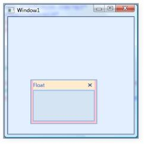

Customized Float Window

### Border Thickness of Child Elements

You can set the border thickness for the hosted children of the Docking Manager control. The following properties are used to set the thickness for the individual child elements in various dock states.

* [ElementBorderThickness](https://help.syncfusion.com/cr/wpf/Syncfusion.Windows.Tools.Controls.DockingManager.html#Syncfusion_Windows_Tools_Controls_DockingManager_ElementBorderThickness) 
* [FloatWindowBorderThickness](https://help.syncfusion.com/cr/wpf/Syncfusion.Windows.Tools.Controls.DockingManager.html#Syncfusion_Windows_Tools_Controls_DockingManager_FloatWindowBorderThickness) 
* [SidePanelBorderThickness](https://help.syncfusion.com/cr/wpf/Syncfusion.Windows.Tools.Controls.DockingManager.html#Syncfusion_Windows_Tools_Controls_DockingManager_SidePanelBorderThickness)
* [SidePanelItemsBorderThickness](https://help.syncfusion.com/cr/wpf/Syncfusion.Windows.Tools.Controls.DockingManager.html#Syncfusion_Windows_Tools_Controls_DockingManager_SidePanelItemsBorderThickness)
* [TabPanelBorderThickness](https://help.syncfusion.com/cr/wpf/Syncfusion.Windows.Tools.Controls.DockingManager.html#Syncfusion_Windows_Tools_Controls_DockingManager_TabPanelBorderThickness)
* [TabItemBorderThickness](https://help.syncfusion.com/cr/wpf/Syncfusion.Windows.Tools.Controls.DockingManager.html#Syncfusion_Windows_Tools_Controls_DockingManager_TabItemBorderThickness) 
* [TabItemsBorderThicknessSelected](https://help.syncfusion.com/cr/wpf/Syncfusion.Windows.Tools.Controls.DockingManager.html#Syncfusion_Windows_Tools_Controls_DockingManager_TabItemsBorderThicknessSelected)
* [HeaderBorderThickness](https://help.syncfusion.com/cr/wpf/Syncfusion.Windows.Tools.Controls.DockingManager.html#Syncfusion_Windows_Tools_Controls_DockingManager_HeaderBorderThickness) 

### ElementBorderThickness

[ElementBorderThickness](https://help.syncfusion.com/cr/wpf/Syncfusion.Windows.Tools.Controls.DockingManager.html#Syncfusion_Windows_Tools_Controls_DockingManager_ElementBorderThickness) property is used to store border thickness value for host. The default value of this property is 1. It is a dependency property, which defines the border thickness of the element inside the window. 

The below code snippet is used to set an element border thickness for the Docking Manager control.





<syncfusion:DockingManager ElementBorderThickness="20">            

	<StackPanel syncfusion:DockingManager.State="Dock" syncfusion:DockingManager.SideInDockedMode="Left"/>  

</syncfusion:DockingManager>





//Creating the instance of the Docking Manager.

DockingManager = new DockingManager();

//Setting the element thickness for the docking manager

DockingManager.ElementBorderThickness = new Thickness(20);



 

ElementBorderThickness = "20"
{:.caption}

### FloatWindowBorderThickness

This property specifies the border thickness value of the floating window. The default value of the [FloatWindowBorderThickness](https://help.syncfusion.com/cr/wpf/Syncfusion.Windows.Tools.Controls.DockingManager.html#Syncfusion_Windows_Tools_Controls_DockingManager_FloatWindowBorderThickness) property is 22,4,4,4 . 

Use the following XAML and C# code, for setting the float window border thickness.





<syncfusion:DockingManager FloatWindowBorderThickness="20">  
          
	<StackPanel syncfusion:DockingManager.State="Dock" syncfusion:DockingManager.SideInDockedMode="Left"/>

</syncfusion:DockingManager>





//Creating the instance of the Docking Manager.

DockingManager = new DockingManager();

//Setting the Float Window Border Thickness for the Docking Manager.

DockingManager.FloatWindowBorderThickness = new Thickness(20);



 

FloatWindowBorderThickness = "20"
{:.caption}

### SidePanelBorderThickness

This dependency property defines the border thickness of the side panel, which is usually seen once you auto hide the children of the DockingManager control. The default value is 0.





<syncfusion:DockingManager SidePanelBorderThickness="20">  
          
	<StackPanel syncfusion:DockingManager.State="Dock" syncfusion:DockingManager.SideInDockedMode="Left"/> 
       
</syncfusion:DockingManager>





//Creating the instance of the Docking Manager.

DockingManager = new DockingManager();

//Setting the Side Panel Border Thickness for the Docking Manager.

DockingManager.SidePanelBorderThickness = new Thickness(20);



 

SidePanelBorderThickness = "20"
{:.caption}

[SidePanelBorderThickness](https://help.syncfusion.com/cr/wpf/Syncfusion.Windows.Tools.Controls.DockingManager.html#Syncfusion_Windows_Tools_Controls_DockingManager_SidePanelBorderThickness) - This dependency property specifies the border thickness of the side panel items. The default value is 1. 

Here is the code snippet for setting this property.





<syncfusion:DockingManager SidePanelItemsBorderThickness="20">     
       
	<StackPanel syncfusion:DockingManager.State="Dock" syncfusion:DockingManager.SideInDockedMode="Left"/>  
	
</syncfusion:DockingManager>





//Creating the instance of the Docking Manager.

DockingManager = new DockingManager();

//Setting the element thickness for the Docking Manager.

DockingManager.SidePanelItemsBorderThickness = new Thickness(20);



 

SidePanelItemsBorderThickness = "20"
{:.caption}

[TabPanelBorderThickness](https://help.syncfusion.com/cr/wpf/Syncfusion.Windows.Tools.Controls.DockingManager.html#Syncfusion_Windows_Tools_Controls_DockingManager_TabPanelBorderThickness) - This dependency property defines the border thickness of the tab panel. The default value of the [TabPanelBorderThickness](https://help.syncfusion.com/cr/wpf/Syncfusion.Windows.Tools.Controls.DockingManager.html#Syncfusion_Windows_Tools_Controls_DockingManager_TabPanelBorderThickness) property is 0.





<syncfusion:DockingManager TabPanelBorderThickness="50"> 
           
	<StackPanel syncfusion:DockingManager.State="AutoHidden" Name="Element One" syncfusion:DockingManager.SideInDockedMode="Bottom"/>            
	
	<StackPanel syncfusion:DockingManager.State="Dock" Name="Element Two" syncfusion:DockingManager.TargetNameInDockedMode="Element One"syncfusion:DockingManager.SideInDockedMode="Tabbed"/>        

</syncfusion:DockingManager>





//Creating the instance of the Docking Manager.

DockingManager = new DockingManager();

//Setting the Tab Panel Border Thickness for the Docking Manager

DockingManager.TabPanelBorderThickness = new Thickness(20);



 

[TabItemBorderThickness](https://help.syncfusion.com/cr/wpf/Syncfusion.Windows.Tools.Controls.DockingManager.html#Syncfusion_Windows_Tools_Controls_DockingManager_TabItemBorderThickness) - This dependency property defines the border thickness of the tab item. The default value is 1. 





<syncfusion:DockingManager TabItemBorderThickness="50">            

	<StackPanel syncfusion:DockingManager.State="AutoHidden" Name="Element One" syncfusion:DockingManager.SideInDockedMode="Bottom"/>            

	<StackPanel syncfusion:DockingManager.State="Dock" Name="Element Two" syncfusion:DockingManager.TargetNameInDockedMode="Element One"syncfusion:DockingManager.SideInDockedMode="Tabbed"/>        

</syncfusion:DockingManager>





//Creating the instance of the Docking Manager.

DockingManager = new DockingManager();

//Setting the Tab Item Border Thickness for the Docking Manager.

DockingManager.TabItemBorderThickness = new Thickness(20);



 

[TabItemsBorderThicknessSelected](https://help.syncfusion.com/cr/wpf/Syncfusion.Windows.Tools.Controls.DockingManager.html#Syncfusion_Windows_Tools_Controls_DockingManager_TabItemsBorderThicknessSelected) - This dependency property defines border thickness of the selected tab items. The default value of the [TabItemsBorderThicknessSelected](https://help.syncfusion.com/cr/wpf/Syncfusion.Windows.Tools.Controls.DockingManager.html#Syncfusion_Windows_Tools_Controls_DockingManager_TabItemsBorderThicknessSelected) property is 0.





<syncfusion:DockingManager TabItemsBorderThicknessSelected="50">            

	<StackPanel syncfusion:DockingManager.State="Dock" Name="Element One" syncfusion:DockingManager.SideInDockedMode="Left"/>            

	<StackPanel syncfusion:DockingManager.State="Dock" Name="Element Two" syncfusion:DockingManager.TargetNameInDockedMode="Element One"syncfusion:DockingManager.SideInDockedMode="Tabbed"/>        

</syncfusion:DockingManager>





//Creating the instance of the Docking Manager.

DockingManager = new DockingManager();

//Setting the Tab Items Border Thickness Selected for the Docking Manager.

DockingManager.TabItemsBorderThicknessSelected = new Thickness(20);



 

### HeaderBorderThickness 

[HeaderBorderThickness](https://help.syncfusion.com/cr/wpf/Syncfusion.Windows.Tools.Controls.DockingManager.html#Syncfusion_Windows_Tools_Controls_DockingManager_HeaderBorderThickness) dependency property defines the border thickness of the window's header. The default value is 1.





<syncfusion:DockingManager HeaderBorderThickness="20">            

	<StackPanel syncfusion:DockingManager.State="Dock" Name="Element One" syncfusion:DockingManager.SideInDockedMode="Left"/>        

</syncfusion:DockingManager>





//Creating the instance of the Docking Manager

DockingManager = new DockingManager();

//Setting the Header Border Thickness for the Docking Manager

DockingManager.HeaderBorderThickness = new Thickness(20);



 

HeaderBorderThickness = "20"                           
{:.caption}

### Tab Strip Placement

The tabs of the docked windows will be placed at the top of the parent window, by default. This tab placement is changed to any of the following options by using the [DockTabAlignment](https://help.syncfusion.com/cr/wpf/Syncfusion.Windows.Tools.Controls.DockingManager.html#Syncfusion_Windows_Tools_Controls_DockingManager_DockTabAlignment) property.

* Top (default)
* Right
* Bottom
* Left

The following code illustrates changing the tab strip placement.





<!-- To set the Tab strip to the Bottom -->       

<sftools:DockingManager Name="DocManager1" DockTabAlignment="Bottom"/>        

<!-- To set the Tab strip to the Right -->        

<sftools:DockingManager Name="DocManager1" DockTabAlignment="Right"/>




//To set the Tab strip to the Bottom.

this.DockingManager.DockTabAlignment = Dock.Bottom;

//To set the Tab strip to the Right.

this.DockingManager.DockTabAlignment = Dock.Right;



 

DockTabAlignment = "Bottom"
{:.caption}

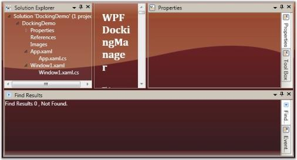

DockTabAlignment = "Right"
{:.caption}

### SidePanel TabItem Customization

### SidePanel Header Background

[SideTabItemBackground](https://help.syncfusion.com/cr/wpf/Syncfusion.Windows.Tools.Controls.DockItem.html#Syncfusion_Windows_Tools_Controls_DockItem_SideTabItemBackground) property allows you to set a background color for TabItem’s Header. It is a dependency property, which defines the background color of the element in side panel.





<syncfusion:DockingManager ElementBorderThickness="20"> 
   
	<ContentControl syncfusion.DockingManager.Header=”SideTab1”       syncfusion.DockingManager.SideTabItemBackground=”Blue”/>

</syncfusion:DockingManager> 





//Creates new instance of DockingManger 

DockingManager manager =new DockingManager();

//New instance of content is created.

ContentControl content = new ContentControl();

//Sets SetSideItemBackground attached property

DockingManager.SetSideTabItemBackground(content, Brushes.Blue);manager.Children.Add(content);



 

The following screen shot illustrates a TabHeader with background color.

TabHeader with background
{:.caption}

### SidePanel Header Foreground

[SideTabItemForeground](https://help.syncfusion.com/cr/wpf/Syncfusion.Windows.Tools.Controls.DockItem.html#Syncfusion_Windows_Tools_Controls_DockItem_SideTabItemForeground) property allows you to set foreground color for SidePanelTabItem’s Header. It is a dependency property, which defines the foreground color of the element in SidePanel.





<syncfusion:DockingManager ElementBorderThickness="20">    

<ContentControl syncfusion.DockingManager.Header=”SideTab1” syncfusion.DockingManager.SideTabItemForeground=”Red”/>

</syncfusion:DockingManager> 





//Creates new instance of DockingManger 

DockingManager manager =new DockingManager();

//New  instance of contentContentControl content = new ContentControl();

//setting SetSideItemBackground attached propertyDockingManager.

SetSideTabItemBackground(content, Brushes.Red);manager.Children.Add(content);



 

The following screen shot illustrates a TabHeader with foreground color.

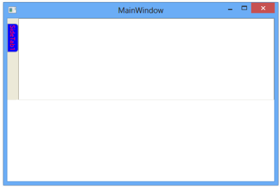

TabHeader with foreground
{:.caption}

## Customizing the Behavior

### Enable/Disable Docking, Floating, AutoHide, Closing

The following description gives you a clear knowledge about docking, float and closing a dockable window.

###	Docking a Dockable Window

DockingManager facilitates the users to allow or restrict a dockable window to move to the docked state. This is done by using the [CanDock](https://help.syncfusion.com/cr/wpf/Syncfusion.Windows.Tools.Controls.DockItem.html#Syncfusion_Windows_Tools_Controls_DockItem_CanDock) property of the DockingManager. When this property is set to False, the dockable window will be restricted to enter the docked state; it can either be in floating or in auto hidden state. Also this setting will not allow the transition of states from Auto Hide to Float or vice versa, as the window needs to change the dock state as a part of the transition.

For settings, [CanDock](https://help.syncfusion.com/cr/wpf/Syncfusion.Windows.Tools.Controls.DockItem.html#Syncfusion_Windows_Tools_Controls_DockItem_CanDock) property, use the following code.





<Grid Name="Properties" sftools:DockingManager.CanDock="True"/>





DockingManager.SetCanDock(Properties, true);



 

### Floating a Dock Window

The Floating state of a dockable window is controlled by using the CanFloat property. When the [CanFloat](https://help.syncfusion.com/cr/wpf/Syncfusion.Windows.Tools.Controls.DockItem.html#Syncfusion_Windows_Tools_Controls_DockItem_CanFloat) property is set to False, the window can take either docked or auto hidden states. It will not be allowed to float until the [CanFloat](https://help.syncfusion.com/cr/wpf/Syncfusion.Windows.Tools.Controls.DockItem.html#Syncfusion_Windows_Tools_Controls_DockItem_CanFloat) property is enabled.

To enable the [CanFloat](https://help.syncfusion.com/cr/wpf/Syncfusion.Windows.Tools.Controls.DockItem.html#Syncfusion_Windows_Tools_Controls_DockItem_CanFloat) property of DockingManager, use the following code. 





<Grid Name="Properties" sftools:DockingManager.CanFloat="True"/>





DockingManager.SetCanFloat(Properties, true);



 

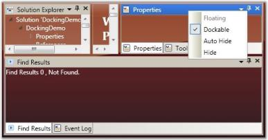

CanFloat = "False"
{:.caption}

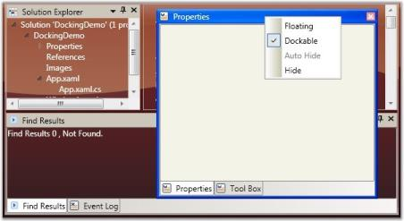

CanFloat = "True"
{:.caption}

### Closing a Dock Window

The DockingManager gives the option for users to control the closing functionality of the dockable window. A window is restricted from closing by disabling the [CanClose](https://help.syncfusion.com/cr/wpf/Syncfusion.Windows.Tools.Controls.DockItem.html#Syncfusion_Windows_Tools_Controls_DockItem_CanClose) property of the DockingManager. When this property is set to False, it will not display the close button in the header of the window.

To set this property, refer the following code.





<Grid Name="Properties" sftools:DockingManager.CanClose="True">





DockingManager.SetCanClose(Properties, true);



 

CanClose = "False"
{:.caption}

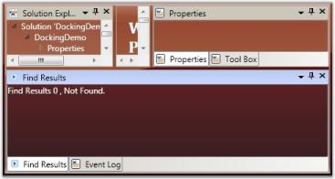

CanClose = "True"
{:.caption}

#### Refer Also

Dealing with States

Document State Child

### AutoHide Button Visibility

By default, all docked windows will have the ability to auto hide, when the user clicks the auto hide button. This feature can be disabled using the [AutoHideVisibility](https://help.syncfusion.com/cr/wpf/Syncfusion.Windows.Tools.Controls.DockingManager.html#Syncfusion_Windows_Tools_Controls_DockingManager_AutoHideVisibility) property. This property is typically used to allow or deny the changing element's state to auto hidden, through Graphical User Interface (GUI), by showing / hiding the AWL button in the host header and hence auto hiding the context menu item. 

Here is the code snippet for setting the above property.





<!--Declaring Docking Manager AutoHideVisibility to False -->        

<syncfusion:DockingManager AutoHideVisibility="False">           

 <!--Your contents here-->        
 
 </syncfusion:DockingManager>
 




//Creating an instance for Docking Manager.

DockingManager = new DockingManager();

//Setting AutoHideVisibility to true.

DockingManager.AutoHideVisibility = true;



 

AutoHideVisibility = "False"
{:.caption}

AutoHideVisibility = "True"
{:.caption}

#### Refer Also

AutoHide Visibility

### Auto Hide Mode

There are two modes of auto hiding behavior. They are:

* AutoHideGroup (default): All elements in the tabbed host will be auto hidden.
* AutoHideActive: Only the active window will be auto hidden.





<!--Declaring Docking Manager with AutoHide Active-->  
      
<syncfusion:DockingManager AutoHideTabsMode="AutoHideActive">   
         
<!--Your contents here-->       
 
</syncfusion:DockingManager>





//Creating the instance of the Docking Manager.

DockingManager = new DockingManager();

//Setting AutoHideGroup for the Docking Manager.

DockingManager.AutoHideTabsMode = AutoHideTabsMode.AutoHideGroup;



 

### Events Handled While Auto hiding

The following events are handled while Auto hiding.

* [AutoHideAnimationStartEvent](https://help.syncfusion.com/cr/wpf/Syncfusion.Windows.Tools.Controls.DockingManager.html)
* [AutoHideAnimationStopEvent](https://help.syncfusion.com/cr/wpf/Syncfusion.Windows.Tools.Controls.DockingManager.html)

### Using AutoHide Animation Modes

DockingManager supports three different built–in animations for auto-hiding the windows. They are listed below.

* Slide: Elements auto hides in a sliding style.
* Scale: Elements follows a particular scale while auto hiding.
* Fade: Element’s appearance fades while it auto hides.

The animation modes can be applied by using the [AutoHideAnimationMode](https://help.syncfusion.com/cr/wpf/Syncfusion.Windows.Tools.Controls.DockingManager.html#Syncfusion_Windows_Tools_Controls_DockingManager_AutoHideAnimationMode) property of the Docking Manager. 

To apply different animation styles to the docking windows, use the following code. This setting will get reflected when the user auto hides a window at run time.





<!--To set the Fade animation mode-->        

<sftools:DockingManager Name="DocManager1" AutoHideAnimationMode="Fade"/>





//To set the Fade animation mode.

this.DockingManager.AutoHideAnimationMode = AutoHideAnimationMode.Fade;



 

### Animation Duration

DockingManager enables you to control the duration for animation or the animation delay, while auto hiding the docking windows. Animation delay is set by using the [AnimationDelay](https://help.syncfusion.com/cr/wpf/Syncfusion.Windows.Tools.Controls.DockItem.html#Syncfusion_Windows_Tools_Controls_DockItem_AnimationDelay) property of the DockingManager. It accepts the duration in milliseconds. 

The following code sets the [AnimationDelay](https://help.syncfusion.com/cr/wpf/Syncfusion.Windows.Tools.Controls.DockItem.html#Syncfusion_Windows_Tools_Controls_DockItem_AnimationDelay) property.



//To set Very slow animation delay.

this.DockingManager.SetAnimationDelay(DocManager1, new Duration(new TimeSpan(30000000)));

//To set Very fast animation delay.

this.DockingManager.SetAnimationDelay(DocManager1, new Duration(new TimeSpan(10000)));



### Closing Options for Tabbed Windows

To set CloseTabs as CloseActive mode, use the following code:





<sftools:DockingManager Name="DocManager1" CloseTabs="CloseActive"/>





this.DockingManager.CloseTabs = CloseTabsMode.CloseActive;



 

### Enable/Disable Dragging a Window

The DockingManager enables you to restrict an element to be dragged from one side to another. The dragging functionality is disabled for a window by setting the [CanDrag](https://help.syncfusion.com/cr/wpf/Syncfusion.Windows.Tools.Controls.DockItem.html#Syncfusion_Windows_Tools_Controls_DockItem_CanDrag) property to false.

The following code is used to enable the [CanDrag](https://help.syncfusion.com/cr/wpf/Syncfusion.Windows.Tools.Controls.DockItem.html#Syncfusion_Windows_Tools_Controls_DockItem_CanDrag) property.





<Grid Name="Properties" sftools:DockingManager.CanDrag="True"/>





DockingManager.SetCanDrag(Properties, true);



 

CanDrag = "False"
{:.caption}

CanDrag = "True"
{:.caption}

## Using DockedElementTabbedHost

This topic illustrates the following features:

* Docked Element Tabbed Host Alignment and
* Docked Element Tabbed Host Style

### DockHost Alignment

The [DockTabAlignment](https://help.syncfusion.com/cr/wpf/Syncfusion.Windows.Tools.Controls.DockingManager.html#Syncfusion_Windows_Tools_Controls_DockingManager_DockTabAlignment) property is used as a tab strip placement for all TabbedHosts that are docked, inside the DockingManager instance. By default its value is set to Bottom.

You can set the [DockTabAlignment](https://help.syncfusion.com/cr/wpf/Syncfusion.Windows.Tools.Controls.DockingManager.html#Syncfusion_Windows_Tools_Controls_DockingManager_DockTabAlignment) to Left, Right, Bottom or Top.



<syncfusion:DockingManager Name="DockingManager" DockTabAlignment="Right" >

            <StackPanel syncfusion:DockingManager.State="Dock"

              syncfusion:DockingManager.SideInDockedMode="Bottom"

              Name="Element One"

              syncfusion:DockingManager.Header="one"/>

            <StackPanel syncfusion:DockingManager.State="Dock"

              syncfusion:DockingManager.SideInDockedMode="Tabbed"

              Name="Element Two"

              syncfusion:DockingManager.TargetNameInDockedMode="Element One"

              syncfusion:DockingManager.Header="Two"/>

            <StackPanel syncfusion:DockingManager.State="Dock"

              syncfusion:DockingManager.SideInDockedMode="Tabbed"

              Name="Element Three"

              syncfusion:DockingManager.TargetNameInDockedMode="Element One"

              syncfusion:DockingManager.Header="Three"/>

        </syncfusion:DockingManager>



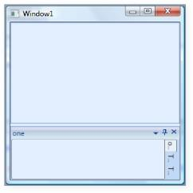

DockTabAlignment = "Right"
{:.caption}

### DockHost Style

This dependency property will get or set the style used by the TabbedHosts that are docked, when it is rendered. It provides [DockedElementTabbedHostStyle](https://help.syncfusion.com/cr/wpf/Syncfusion.Windows.Tools.Controls.DockingManager.html#Syncfusion_Windows_Tools_Controls_DockingManager_DockedElementTabbedHostStyle) value for the Docking Manager. 

The user can initialize the style of the docked element host by setting the [DockedElementTabbedHostStyle](https://help.syncfusion.com/cr/wpf/Syncfusion.Windows.Tools.Controls.DockingManager.html#Syncfusion_Windows_Tools_Controls_DockingManager_DockedElementTabbedHostStyle) property in XAML as follows.



<syncfusion:DockingManager  Name="DockingManager1" ContainerMode="TDI">

            <!--Setting the style for the Docked Element Tabbed Host-->

            <syncfusion:DockingManager.DockedElementTabbedHostStyle>

                

            </syncfusion:DockingManager.DockedElementTabbedHostStyle>

            <!--Children for the Docking Manager control-->

            <StackPanel syncfusion:DockingManager.State="Dock" syncfusion:DockingManager.SideInDockedMode="Left"/>

            <StackPanel syncfusion:DockingManager.State="Document" syncfusion:DockingManager.SideInDockedMode="Left"/>

        </syncfusion:DockingManager>



## Using Drag modes

The DockingManager enables you to set different drag modes, when a docking window is being dragged. It supports the following three drag modes.

* Normal DragMode
* Border DragMode and
* Shadow DragMode

The [DraggingType](https://help.syncfusion.com/cr/wpf/Syncfusion.Windows.Tools.Controls.DockingManager.html#Syncfusion_Windows_Tools_Controls_DockingManager_DraggingType) property of DockingManager is used to change the drag mode. The options provided by this property are as follows:

* NormalDragging (Normal DragMode)
* BorderDragging (Border DragMode) and
* ShadowDragging (Shadow DragMode)

The following code snippet is used to change the Drag mode of the DockingManager. 





<!--Setting the Normal Drag Mode-->        

<sftools:DockingManager Name="DocManager1" DraggingType="NormalDragging"/>
        
<!--Setting the Border Drag Mode-->        

<sftools:DockingManager Name="DocManager1" DraggingType="BorderDragging"/>
        
<!--Setting the Shadow Drag Mode-->        

<sftools:DockingManager Name="DocManager1" DraggingType="ShadowDragging"/>





//Setting the Normal Drag Mode.

this.DockingManager.DraggingType = DraggingType.NormalDragging;

//Setting the Border Drag Mode.

this.DockingManager.DraggingType = DraggingType.BorderDragging;

//Setting the Shadow Drag Mode.

this.DockingManager.DraggingType = DraggingType.ShadowDragging;



 

Normal Drag Mode
{:.caption}

Border Drag Mode
{:.caption}

Shadow Drag Mode
{:.caption}

## Context Menu Support

### Default Context Menu

A dockable window will be associated with a default context menu with default menu items. The DockingManager provides options to add custom context menu for the dockable window. You can set a context menu using the following code snippet. 



        <syncfusion:DockingManager  Name="DockingManager1">

            <syncfusion:DockingManager.ContextMenu>

                <ContextMenu>

                    <MenuItem Header="Cut" InputGestureText="Ctrl+X" Command="ApplicationCommands.Cut" />

                    <MenuItem Header="Copy" InputGestureText="Ctrl+C" Command="ApplicationCommands.Copy" />

                    <MenuItem Header="Paste" InputGestureText="Ctrl+V" Command="ApplicationCommands.Paste"  />

                </ContextMenu>

            </syncfusion:DockingManager.ContextMenu>

            <TextBox syncfusion:DockingManager.SideInDockedMode="Left"

              syncfusion:DockingManager.State="Dock">

                I am a Docking panel

            </TextBox>

        </syncfusion:DockingManager>



The output is as follows.

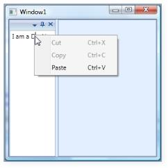

Custom Context Menu Added to the Docked Window
{:.caption}

The frame work provides some in-built events such as ContextMenuOpening and ContextMenuClosing, which are handled when the context menu opens or  closes.



//Creating instance for the Docking Manager.

DockingManager = new DockingManager();

//Triggering using the context menu events.

DockingManager.ContextMenuOpening += new ContextMenuEventHandler(DockingManager_ContextMenuOpening);

DockingManager.ContextMenuClosing += new ContextMenuEventHandler(DockingManager_ContextMenuClosing);



There are some in-built command bindings to handle the actions of the context menu, which will be much handy.

### ContextMenuItemClick Event

It is a bubbling routed event, which is handled when a context menu item click is completed.

Use the following code snippet below for triggering this event.



//Creating instance for the Docking Manager.

DockingManager = new DockingManager();

//Triggering using the context menu click events.

DockingManager.ContextMenuItemClick += new RoutedEventHandler(DockingManager_ContextMenuItemClick);

/// 

/// Handles the ContextMenuItemClick event of the Docking Manager

/// 

/// <param name="sender">The source of the event.</param>

/// <param name="e">The <see cref="System.Windows.RoutedEventArgs"/> instance containing the event data.</param>

void DockingManager_ContextMenuItemClick(object sender, RoutedEventArgs e)

{

          //Set the required actions here.

}



### Providing Custom Menu Items

### Custom Menu Items

A dockable window is well associated with a default context menu with default menu items. You can also add custom menu items to the existing context menu items of the dockable window. [CustomMenuItems](https://help.syncfusion.com/cr/wpf/Syncfusion.Windows.Tools.Controls.DockItem.html#Syncfusion_Windows_Tools_Controls_DockItem_CustomMenuItems) property is used for this purpose.

[CustomMenuItems](https://help.syncfusion.com/cr/wpf/Syncfusion.Windows.Tools.Controls.DockItem.html#Syncfusion_Windows_Tools_Controls_DockItem_CustomMenuItems) - This property is attached to a docking manager child, and gives an ability to add some additional menu items to the context menu. This can easily extend GUI functionality by using the Custom menu items.

To add the custom menu item:





<syncfusion:DockingManager Name="DockingManager1" >            

	<syncfusion:DockingManager.CustomMenuItems>                

	<syncfusion:CustomMenuItemCollection>                    

	<syncfusion:CustomMenuItem Header="CustomItem" />                

	</syncfusion:CustomMenuItemCollection>            

	</syncfusion:DockingManager.CustomMenuItems>            

	<TextBox syncfusion:DockingManager.SideInDockedMode="Left" syncfusion:DockingManager.State="Dock"/> 

</syncfusion:DockingManager>
	




//Creating instance for the Docking Manager.

DockingManager = new DockingManager();

//Creating instance for custom items collections.

CustomMenuItemCollection collection = new CustomMenuItemCollection();

//Creating custom menu items.

CustomMenuItem customitem = new CustomMenuItem();

//Setting the header for the items.customitem.Header = "Custom Item";

//Adding the items to the collection.

collection.Add(customitem);

//Setting the custom menu items.

DockingManager.SetCustomMenuItems(DockingManager, collection);



 

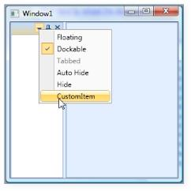

Custom Menu Item added to the Context Menu                   
{:.caption}

### Collapse Default MenuItems

We can disable the default menu item such as Dockable, Floating, AutoHide and so on. This can be done by [CollapseDefaultContextMenuItems](https://help.syncfusion.com/cr/wpf/Syncfusion.Windows.Tools.Controls.DockingManager.html#Syncfusion_Windows_Tools_Controls_DockingManager_CollapseDefaultContextMenuItems) property.. The usage is shown below.





<syncfusion:DockingManager Name="DockingManager1" CollapseDefaultContextMenuItems="True" >            

	<syncfusion:DockingManager.CustomMenuItems>                

	<syncfusion:CustomMenuItemCollection>                    

	<syncfusion:CustomMenuItem Header="CustomItem" />                

	</syncfusion:CustomMenuItemCollection>            

	</syncfusion:DockingManager.CustomMenuItems>            

	<TextBox syncfusion:DockingManager.SideInDockedMode="Left" syncfusion:DockingManager.State="Dock"/> 

</syncfusion:DockingManager>





DockingManager = new DockingManager();

//Creating instance for custom items collections.

CustomMenuItemCollection collection = new CustomMenuItemCollection();

//Creating custom menu items.

CustomMenuItem customitem = new CustomMenuItem();

//Setting the header for the items.

customitem.Header = "Custom Item";

//Adding the items to the collection.

collection.Add(customitem);

//Setting the custom menu items.

DockingManager.SetCustomMenuItems(DockingManager, collection);

DockingManager.CollapseDefaultContextMenuItems = true;



 

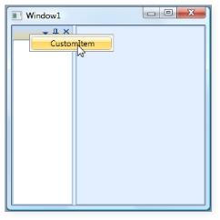

Collapse Default MenuItems
{:.caption}

## Context Menu, Context Menu Button Visibility

[IsContextMenuButtonVisible](https://help.syncfusion.com/cr/wpf/Syncfusion.Windows.Tools.Controls.DockingManager.html#Syncfusion_Windows_Tools_Controls_DockingManager_IsContextMenuButtonVisible) property is used to control the visibility of the Context Menu Button, which is available when the Header of Docked Window or Float Window is right-clicked. The display of Context Menu can be disabled by setting [IsContextMenuVisible](https://help.syncfusion.com/cr/wpf/Syncfusion.Windows.Tools.Controls.DockingManager.html#Syncfusion_Windows_Tools_Controls_DockingManager_IsContextMenuVisible) to False.

The following code illustrates the same:





<syncfusion:DockingManager Name="DockingManager" IsContextMenuVisible="False">       

</syncfusion:DockingManager>





DockingManager.IsContextMenuVisible= "false";



 

The default value is set to True.  This property can also be applied to every child inside the DockingManager as shown below:





<syncfusion:DockingManager Name= "DockingManager">            

	<Grid Name="grid1" syncfusion:DockingManager.IsContextMenuVisible="False">    
			   
	</Grid>      
 
</syncfusion:DockingManager>
 




       DockingManager.SetIsContextMenuVisible(grid1,false);
	   


 

[IsContextMenuButtonVisible](https://help.syncfusion.com/cr/wpf/Syncfusion.Windows.Tools.Controls.DockingManager.html#Syncfusion_Windows_Tools_Controls_DockingManager_IsContextMenuButtonVisible) property is used to control the visibility of the Context Menu Button (available when child Window is in dock state). The display of Context Menu can be disabled by setting [IsContextMenuButtonVisible](https://help.syncfusion.com/cr/wpf/Syncfusion.Windows.Tools.Controls.DockingManager.html#Syncfusion_Windows_Tools_Controls_DockingManager_IsContextMenuButtonVisible) to False.

The following code illustrates the same.




 <syncfusion:DockingManager Name="DockingManager" IsContextMenuButtonVisible="False">            
 
	<Grid/>        
 
 </syncfusion:DockingManager>
 




DockingManager.IsContextMenuButton="False";



 

The default value is set to True.

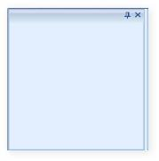

IsContextMenuButtonVisible=”False”
{:.caption}

This property can also be applied to every child inside the DockingManager as shown below.




<syncfusion:DockingManager Name="DockingManager">            

	<Grid Name="grid1" syncfusion:DockingManager.IsContextMenuButtonVisible="False">                
	
	</Grid>        

</syncfusion:DockingManager>





DockingManager.SetIsContextMenuButtonVisible(grid1,false);



 

IsContextMenuButtonVisible=”True” for Individual Child                
{:.caption}

### Layout Related Features

### DesireWidth and DesireHeight in Dock/Float Modes

Height and width of the docking window in the docked state is set by using properties like [DesiredWidthInDockedMode](https://help.syncfusion.com/cr/wpf/Syncfusion.Windows.Tools.Controls.DockItem.html#Syncfusion_Windows_Tools_Controls_DockItem_DesiredWidthInDockedMode) and [DesiredHeightInDockedMode](https://help.syncfusion.com/cr/wpf/Syncfusion.Windows.Tools.Controls.DockItem.html#Syncfusion_Windows_Tools_Controls_DockItem_DesiredHeightInDockedMode) respectively.

To set the height and width for the DockingManager elements in the docked state, use the following code snippet.





<!--To set the width and height of the element in Docked Mode-->        

<Grid Name="Properties" sftools:DockingManager.DesiredWidthInDockedMode="400" sftools:DockingManager.DesiredHeightInDockedMode="400"/ >





//To set the width of the element in Docked Mode.

this.DockingManager.SetDesiredWidthInDockedMode(Properties, 400);

//To set the Height of the element in Docked Mode.

this.DockingManager.SetDesiredHeightInDockedMode(Properties, 400);



 

The Height and Width of the DockingManager elements in the floating state is set using the [DesiredWidthInFloatingMode](https://help.syncfusion.com/cr/wpf/Syncfusion.Windows.Tools.Controls.DockItem.html#Syncfusion_Windows_Tools_Controls_DockItem_DesiredWidthInFloatingMode) and DesiredHeightInFloatingMode properties, respectively.

Use the following code to set the above properties.




        
<!--To set the width and height of the element in the Docked Mode-->        

<Grid Name="Properties" sftools:DockingManager.DesiredWidthInFloatingMode="400" sftools:DockingManager.DesiredHeightInFloatingMode="400"/>





//To set the width of the element in Floating Mode.

this.DockingManager.SetDesiredWidthInFloatingMode(Properties, 300);

//To set the Height of the element in Floating Mode.

this.DockingManager.SetDesiredHeightInFloatingMode(Properties, 200);



 

### Hot Tracking the Dock Window

The docking elements can be highlighted when the mouse is hovered over a Docking window. This feature is enabled using the [IsEnableHotTracking](https://help.syncfusion.com/cr/wpf/Syncfusion.Windows.Tools.Controls.DockingManager.html#Syncfusion_Windows_Tools_Controls_DockingManager_IsEnableHotTracking) property.

To enable / disable hot tracking feature in DockingManager, use the following code.




        
<!-- To enable HotTracking in Docking Manager -->        

<sftools:DockingManager Name="DocManager1" IsEnableHotTracking="True"/>        

<!-- To disable HotTracking in Docking Manager -->        

<sftools:DockingManager Name="DocManager1" IsEnableHotTracking="False"/>





//To Enable HotTracking in Docking Manager.

this.DockingManager.IsEnableHotTracking = true;

//To Disable HotTracking in Docking Manager.

this.DockingManager.IsEnableHotTracking = false;



 

### Using SizetoContentInFloat

The Float window can be resized to its child size by setting the [SizetoContentInFloat](https://help.syncfusion.com/cr/wpf/Syncfusion.Windows.Tools.Controls.DockItem.html#Syncfusion_Windows_Tools_Controls_DockItem_SizetoContentInFloat) property to True. The Float window will be resized to its child size when dragged from Dock to Float state. 

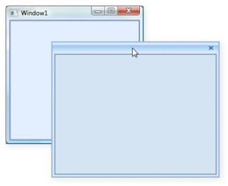

SizetoContentInFloat=”True”
{:.caption}

The following code illustrates the same.





<syncfusion:DockingManager Name="DockingManager" >            

	<usercontrol1 Name="control1" width=200 height=200 syncfusion:DockingManager. SizeToContentInFloat="true" />        

</syncfusion:DockingManager>





DockingManager.SetSizetoContentInFloat(control1,true);



 

When user control is dragged out from Dock state the Float window generated will automatically resize itself to the size of the user control. But when user resizes the Float window and changes it to the Dock state again, it converts it back to the Float state. The Float window returns to its previous size.

### Customizing Document Tab Control and MDI Document

The following three properties allow you to customize the styles of Tab control and MDI document. This feature is integrated with both DockingManager and Document Container. 

* [DocumentTabControlStyle](https://help.syncfusion.com/cr/wpf/Syncfusion.Windows.Tools.Controls.DockItem.html#Syncfusion_Windows_Tools_Controls_DockItem_DocumentTabControlStyle) 
* [DocumentTabItemStyle](https://help.syncfusion.com/cr/wpf/Syncfusion.Windows.Tools.Controls.DockItem.html#Syncfusion_Windows_Tools_Controls_DockItem_DocumentTabItemStyle) 
* [DocumentMDIHeaderStyle](https://help.syncfusion.com/cr/wpf/Syncfusion.Windows.Tools.Controls.DockItem.html#Syncfusion_Windows_Tools_Controls_DockItem_DocumentMDIHeaderStyle) 

### DocumentTabControlStyle

This property allows you to specify the your own customized style for the Tab control in both DockingManager and Document Container. The following code snippet will illustrate this.



<syncfusion:DockingManager x:Name="DockingManager" ContainerMode="TDI" Height="Auto">

	<syncfusion:DockingManager.DocumentTabControlStyle>

		

	</syncfusion:DockingManager.DocumentTabControlStyle>

</syncfusion:DockingManager>



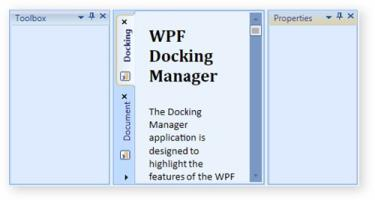

DocumentTabControlStyle in TDI mode
{:.caption}

### DocumentTabItemStyle

This property allows you to specify your customized style for tab items inside the Tab control in both DockingManager and Document Container. The following code snippet will illustrate this.



<syncfusion:DockingManager x:Name="DockingManager" ContainerMode="TDI" Height="Auto">

            <syncfusion:DockingManager.DocumentTabItemStyle>

                

            </syncfusion:DockingManager.DocumentTabItemStyle>

</syncfusion:DockingManager>



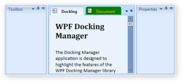

DocumentTabItemStyle in TDI mode
{:.caption}

### DocumentMDIHeaderStyle

This property is used to specify the customized style for the MDI window header, in both DockingManager and Document Container. The following code snippet will illustrate this.



<syncfusion:DockingManager x:Name="DockingManager" ContainerMode="MDI" Height="Auto">

	<syncfusion:DockingManager.DocumentMDIHeaderStyle>

		

	</syncfusion:DockingManager.DocumentMDIHeaderStyle>

</syncfusion:DockingManager>



DocumentMDIHeaderStyle in MDI mode                      
{:.caption}