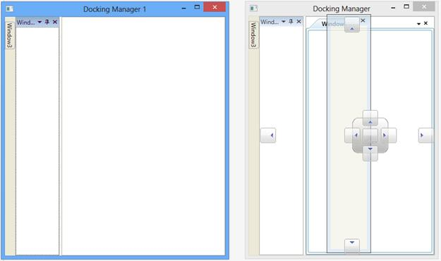
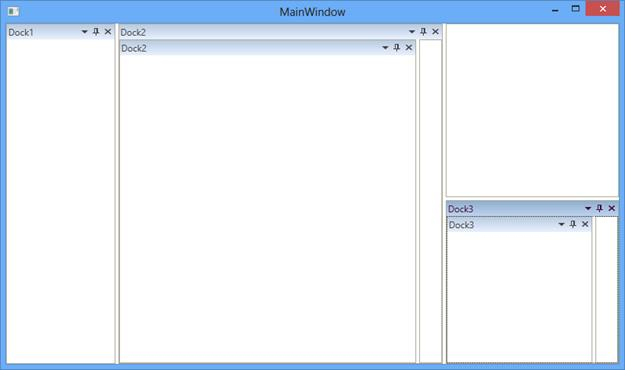

# Linked Manager and Nested Docking in WPF Docking (DockingManager)

## Linked Manager

The windows from one DockingManager cannot be dragged and dropped to another DockingManager by default. But Linked Manager support allows to drag and drop the windows from one DockingManager to another by setting `TargetDockingManager` list.

Source Docking Manager





<syncfusion:DockingManager x:Name="DockingManager1" UseDocumentContainer="True">

<ContentControl syncfusion:DockingManager.State="Document" syncfusion:DockingManager.Header="Window1" />

<ContentControl syncfusion:DockingManager.State="Dock" syncfusion:DockingManager.Header="Window2" />

<ContentControl syncfusion:DockingManager.State="AutoHidden" syncfusion:DockingManager.Header="Window3" />

</syncfusion:DockingManager>





Target Docking Manager





<syncfusion:DockingManager x:Name="DockingManager2" UseDocumentContainer="True">

<ContentControl syncfusion:DockingManager.State="Dock" syncfusion:DockingManager.Header="Window1"></ContentControl>

<ContentControl syncfusion:DockingManager.State="Dock" syncfusion:DockingManager.Header="Window2"></ContentControl>

<ContentControl syncfusion:DockingManager.State="AutoHidden" syncfusion:DockingManager.Header="Window3"></ContentControl>

</syncfusion:DockingManager>                   









public partial class MainWindow : Window
{
    public MainWindow()
	{
		InitializeComponent();

		count++;      

		MainWindow1 MainWindow = new MainWindow1();

		MainWindow.Title = "Docking Manager 1";

		MainWindow.Show();

		this.DockingManager1.AddToTargetManagersList(MainWindow.DockingManager2);

		MainWindow.DockingManager2.AddToTargetManagersList(this.DockingManager1);
	}
}





Partial Public Class MainWindow
	Inherits Window

	Public Sub New()
		InitializeComponent()

		count += 1

		Dim MainWindow As New MainWindow1()

		MainWindow.Title = "Docking Manager 1"

		MainWindow.Show()

		Me.DockingManager1.AddToTargetManagersList(MainWindow.DockingManager2)

		MainWindow.DockingManager2.AddToTargetManagersList(Me.DockingManager1)
	End Sub
End Class 





### Adding TargetManager list of DockingManager

To add TargetManager list in the DockingManager, call [AddToTargetManagersList](https://help.syncfusion.com/cr/wpf/Syncfusion.Windows.Tools.Controls.DockingManager.html#Syncfusion_Windows_Tools_Controls_DockingManager_AddToTargetManagersList_Syncfusion_Windows_Tools_Controls_DockingManager_) method of the DockingManager with the valid DockingManager instance as argument.

When only one DockingManager has TargetManagerList, the window drop to TargetManager cannot drag back to Owner DockingManger. For example DockingManager1 and DockingManager2 are the DockingManager instance and the DockingManager2 is added to TargetManagerList of DockingManager1, but the DockingManager2 is not aware of its TargetManager.

Here, the windows from DockingManager1 are only allowed to be dragged and dropped in DockingManager2, 





this.DockingManager1.AddToTargetManagersList(MainWindow.DockingManager2);





Me.DockingManager1.AddToTargetManagersList(MainWindow.DockingManager2) 





To drag and drop the window from DockingManager2 to DockingManager1, DockingManager1 must be added to TargetManagerList of DockingManager2.





this.DockingManager1.AddToTargetManagersList(MainWindow.DockingManager2);

MainWindow.DockingManager2.AddToTargetManagersList(this.DockingManager1);





Me.DockingManager1.AddToTargetManagersList(MainWindow.DockingManager2)

MainWindow.DockingManager2.AddToTargetManagersList(Me.DockingManager1) 




### Removing Target Manager list

To remove DockingManager from the TargetManagerList, call [RemoveFromTargetManagerList](https://help.syncfusion.com/cr/wpf/Syncfusion.Windows.Tools.Controls.DockingManager.html#Syncfusion_Windows_Tools_Controls_DockingManager_RemoveFromTargetManagersList_Syncfusion_Windows_Tools_Controls_DockingManager_) of DockingManager with the valid DockingManager instance argument. For example, to remove the DockingManager1 from the TargetManagersList of DockingManager2, follow the below code snippets:





MainWindow.DockingManager2.RemoveFromTargetManagersList(this.DockingManager1);




MainWindow.DockingManager2.RemoveFromTargetManagersList(Me.DockingManager1) 





## Nested Docking

DockingManager provides the NestedDockingManager support, that allows to add DockingManager as a child window to another DockingManager. 

In Nested DockingManager, the whole DockingManager can be dragged and dropped inside the Parent DockingManager and DockWindows inside the DockingManager cannot be dragged and dropped on the owner DockingManager.

### Adding DockingManager as Child in DockingManager





<syncfusion:DockingManager x:Name="DockingManager1" UseDocumentContainer="True" syncfusion:DockingManager.Header="Dock1">

<ContentControl x:Name="Content1" syncfusion:DockingManager.Header="Dock1"/>

<syncfusion:DockingManager x:Name="DockingManager2" UseDocumentContainer="True"
                           SideInDockedMode="Left" syncfusion:DockingManager.Header="Dock2"  >

<ContentControl syncfusion:DockingManager.Header="Dock2" syncfusion:DockingManager.DesiredWidthInDockedMode="600" />

</syncfusion:DockingManager>

<syncfusion:DockingManager x:Name="DockingManager3" UseDocumentContainer="True"
                           SideInDockedMode="Bottom"  syncfusion:DockingManager.Header="Dock3">

<ContentControl syncfusion:DockingManager.Header="Dock3" syncfusion:DockingManager.DesiredWidthInDockedMode="600"/>

</syncfusion:DockingManager>

</syncfusion:DockingManager>





DockingManager DockingManager1 = new DockingManager() { UseDocumentContainer = true};            

ContentControl content1 = new ContentControl() { Name = "Content1" };

DockingManager.SetHeader(content1, "Dock1");

DockingManager DockingManager2 = new DockingManager() { UseDocumentContainer = true };

DockingManager.SetHeader(DockingManager2, "Dock2");

DockingManager.SetSideInDockedMode(DockingManager2, DockSide.Left);

ContentControl content2 = new ContentControl() { Name = "Content2" };

DockingManager.SetHeader(content2, "Dock2");

DockingManager.SetDesiredWidthInDockedMode(content2, 600);

DockingManager2.Children.Add(content2);

DockingManager DockingManager3 = new DockingManager() { UseDocumentContainer = true };

DockingManager.SetHeader(DockingManager3, "Dock3");

DockingManager.SetSideInDockedMode(DockingManager3, DockSide.Bottom);

ContentControl content3 = new ContentControl() { Name = "Content3" };

DockingManager.SetHeader(content3, "Dock3");

DockingManager.SetDesiredWidthInDockedMode(content3, 600);

DockingManager3.Children.Add(content3);

DockingManager1.Children.Add(content1);

DockingManager1.Children.Add(DockingManager2);

DockingManager1.Children.Add(DockingManager3);





