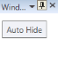
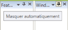
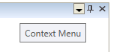
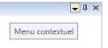
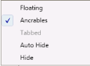
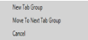
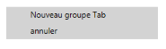

# Localization in WPF DockingManager control

Localization customizes the application towards a specific language and region. Syncfusion Tools allow you to set custom resource through the Resx file. In the following table, DockingManager’s property is localized in English and French.

<table>
<tr>
<th>
 Property</th><th>
Description</th></tr>
<tr>
<td>
FloatButtonTooltipText </td><td>
Sets the string for the ToolTip of Float button in the DockingManager.</td></tr>
<tr>
<td colspan = "2">
Float(en-US)                                           Flotteur(c)</td></tr>
<tr>
<td>
AwlButtonTooltipText</td><td>
Sets the string for the ToolTip of Auto Hide button in the DockingManager.</td></tr>
<tr>
<td colspan = "1">
{{''|markdownify}}
</td>
<td>
{{''|markdownify}}

</td></tr>
<tr>
<td>
CloseButtonTooltipText</td><td>
Sets the string for ToolTip of Close button in DockingManager.</td></tr>
<tr>
<td colspan = "1">
{{''|markdownify}}

{{ '_CloseButtonTooltipText(en-US)_' | markdownify }}
</td>
<td>
{{''|markdownify}}

{{ '_CloseButtonTooltipText(fr-FR)_' | markdownify }}</td></tr>
<tr>
<td>
ContextMenuButtonTooltipText</td><td>
Sets the string for the ToolTip of Context Menu button in DockingManager.</td></tr>
<tr>
<td colspan = "1">
{{''|markdownify}}
</td>
<td>
{{''|markdownify}}

</td></tr>
<tr>
<td>
TabbedAutoHideHide</td><td>
Sets the string for the context menu item in DockingManager.</td></tr>
<tr>
<td colspan = "1">
{{''|markdownify}}

{{ '_ContextMenu(en-US)_' | markdownify }}
</td>
<td>
{{''|markdownify}}

{{ '_ContextMenu(fr-FR)_' | markdownify }}</td></tr>
<tr>
<td>
MoveToNextTabGroup </td><td>
Sets the string for MoveToNextTabGroup context menu item in the DockingManager and Document Container.</td></tr>
<tr>
<td colspan = "1">
{{''|markdownify}}

{{ '_MoveToNextTabGroup(en-US)_' | markdownify }}
</td>
<td>
{{''|markdownify}}

{{ '_MoveToNextTabGroup(fr-FR)_' | markdownify }}</td></tr>
<tr>
<td>
MoveToPreviousTabGroup</td><td>
Sets the string for MoveToPreviousTabGroup context menu item in the DockingManager and Document Container.</td></tr>
<tr>
<td colspan = "1">
{{''|markdownify}}

{{ '_MoveToPreviousTabGroup(en-US)_' | markdownify }}
</td>
<td>
{{''|markdownify}}

{{ '_MoveToPreviousTabGroup(fr-FR)_' | markdownify }}</td></tr>
<tr>
<td>
NewTabgroupMenuItemCancel</td><td>
Sets the string for the Tab context menu item in the DockingManager and Document Container.</td></tr>
<tr>
<td colspan = "1">
{{''|markdownify}}

{{ '_NewTabGroup(en-US)_' | markdownify }}
</td>
<td>
{{''|markdownify}}

{{ '_NewTabGroup(fr-FR)_' | markdownify }}</td></tr>
<tr>
<td>
TabCloseCloseAllButThisTabCloseAllFloatingDocumentDockableNewHorizontalTabGroupNewVerticalTabGroup</td><td>
Sets the string for the menu item in the Document Container and DockingManager.</td></tr>
<tr>
<td colspan = "1">
{{''|markdownify}}

{{ '_MenuItem(en-US)_' | markdownify }}
</td>
<td>
{{''|markdownify}}

{{ '_MenuItem(fr-FR)_' | markdownify }}</td></tr>
</table>

