# Localization in WPF DockingManager control

Localization customizes the application towards a specific language and region. Syncfusion® Tools allow you to set custom resources through a `.resx` file. The table below shows how each DockingManager property is localized in English and French.

## Steps to localize

1. Add a `.resx` file (for example, `Syncfusion.Tools.Wpf.resx`) to your project, or use the default Syncfusion resources.
2. Set the `CultureInfo` of the current thread (e.g. `Thread.CurrentThread.CurrentUICulture = new CultureInfo("fr-FR");`) at application startup.
3. Provide translated strings for the resource keys listed in the table below.
4. The DockingManager (and the rest of Syncfusion Tools) will pick up the localized values automatically.

The following table summarizes the resource keys used by the DockingManager.

<table>
<tr>
<th>
 Property</th><th>
Description</th></tr>
<tr>
<td>
FloatButtonTooltipText </td><td>
Sets the string for the ToolTip of Float button in the DockingManager.</td></tr>
<tr>
<td colspan = "2">
Float(en-US)                                           Flotteur(fr-FR)</td></tr>
<tr>
<td>
AwlButtonTooltipText</td><td>
Sets the string for the ToolTip of Auto Hide button in the DockingManager.</td></tr>
<tr>
<td colspan = "1">
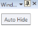
</td>
<td>
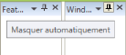

</td></tr>
<tr>
<td>
CloseButtonTooltipText</td><td>
Sets the string for ToolTip of Close button in DockingManager.</td></tr>
<tr>
<td colspan = "1">
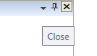

_CloseButtonTooltipText(en-US)_
</td>
<td>
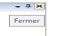

_CloseButtonTooltipText(fr-FR)_</td></tr>
<tr>
<td>
ContextMenuButtonTooltipText</td><td>
Sets the string for the ToolTip of Context Menu button in DockingManager.</td></tr>
<tr>
<td colspan = "1">
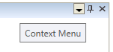
</td>
<td>
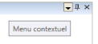

</td></tr>
<tr>
<td>
TabbedAutoHideHide</td><td>
Sets the string for the context menu item in DockingManager.</td></tr>
<tr>
<td colspan = "1">
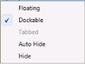

_ContextMenu(en-US)_
</td>
<td>
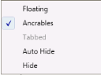

_ContextMenu(fr-FR)_</td></tr>
<tr>
<td>
MoveToNextTabGroup </td><td>
Sets the string for MoveToNextTabGroup context menu item in the DockingManager and Document Container.</td></tr>
<tr>
<td colspan = "1">
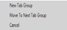

_MoveToNextTabGroup(en-US)_
</td>
<td>
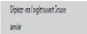

_MoveToNextTabGroup(fr-FR)_</td></tr>
<tr>
<td>
MoveToPreviousTabGroup</td><td>
Sets the string for MoveToPreviousTabGroup context menu item in the DockingManager and Document Container.</td></tr>
<tr>
<td colspan = "1">
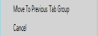

_MoveToPreviousTabGroup(en-US)_
</td>
<td>
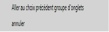

_MoveToPreviousTabGroup(fr-FR)_</td></tr>
<tr>
<td>
NewTabgroupMenuItemCancel</td><td>
Sets the string for the Tab context menu item in the DockingManager and Document Container.</td></tr>
<tr>
<td colspan = "1">
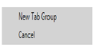

_NewTabGroup(en-US)_
</td>
<td>

_NewTabGroup(fr-FR)_</td></tr>
<tr>
<td>
TabCloseCloseAllButThisTabCloseAllFloatingDocumentDockableNewHorizontalTabGroupNewVerticalTabGroup</td><td>
Sets the string for the menu item in the Document Container and DockingManager.</td></tr>
<tr>
<td colspan = "1">
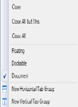

_MenuItem(en-US)_
</td>
<td>
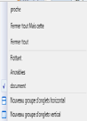

_MenuItem(fr-FR)_</td></tr>
</table>

