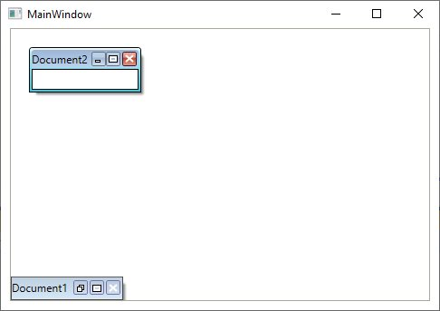
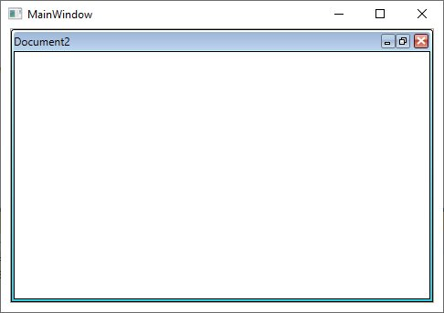
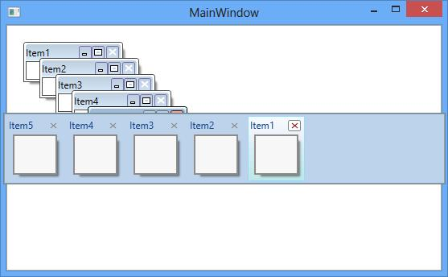
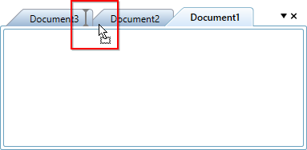
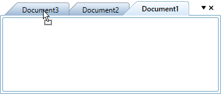
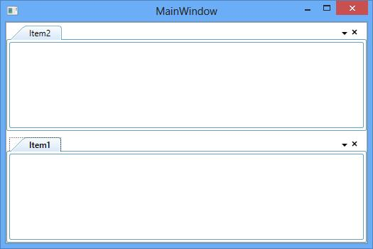
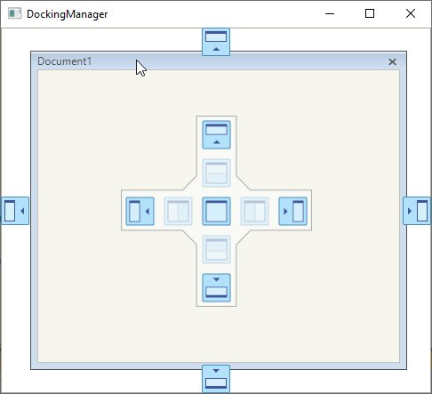
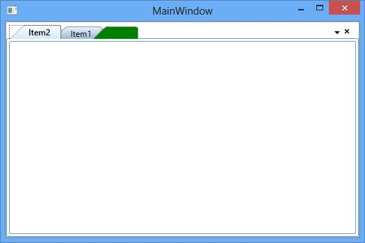

# MDI/ TDI functionalities in

The MDI and TDI functionalities are applicable for the Document window in the DockingManager. So Document window can be displayed in both Multiple Document Interface and Tabbed Document Interface.

To change mode for the Document window, set the property [ContainerMode](https://help.syncfusion.com/cr/wpf/Syncfusion.Windows.Tools.Controls.DockingManager.html#Syncfusion_Windows_Tools_Controls_DockingManager_ContainerMode) with its respective values.

By default, the document state window is in TDI mode, that display child as tabbed document.

N> When the window state is in MDI, child of docking manager will be hosted inside the DocumentContainer. So, user can customize child using DocumentContainer. Refer to this [documentation](https://help.syncfusion.com/wpf/documentcontainer/getting-started) for customizing DocumentContainer.





<syncfusion:DockingManager UseDocumentContainer="True" ContainerMode="TDI">        

<ContentControl x:Name="Content1" syncfusion:DockingManager.Header="Document1" />   

<ContentControl syncfusion:DockingManager.Header="Document2" syncfusion:DockingManager.State="Document" /> 

</syncfusion:DockingManager>





SyncDockingManager.UseDocumentContainer = true;

SyncDockingManager.ContainerMode = DocumentContainerMode.TDI;

DockingManager.SetState(Document1, DockState.Document);

DockingManager.SetState(Document2, DockState.Document);





To make the document child window as MDI document, set the [ContainerMode](https://help.syncfusion.com/cr/wpf/Syncfusion.Windows.Tools.Controls.DockingManager.html#Syncfusion_Windows_Tools_Controls_DockingManager_ContainerMode) as `MDI`





<syncfusion:DockingManager x:Name="DockingManager1" UseDocumentContainer="True" ContainerMode="MDI">        

<ContentControl x:Name="Content1" syncfusion:DockingManager.Header="Document1" syncfusion:DockingManager.State="Document"/>   

<ContentControl x:Name="Content2" syncfusion:DockingManager.Header="Document2" syncfusion:DockingManager.State="Document"/> 

</syncfusion:DockingManager>





//Tabbed Document Interface.

SyncDockingManager.ContainerMode = DocumentContainerMode.MDI;





## Setting MDI Window state

The state of the MDI Window can be set using the [SetMDIWindowState](https://help.syncfusion.com/cr/wpf/Syncfusion.Windows.Tools.Controls.DocumentContainer.html#Syncfusion_Windows_Tools_Controls_DocumentContainer_SetMDIWindowState_System_Windows_DependencyObject_Syncfusion_Windows_Tools_Controls_MDIWindowState_) method of DocumentContainer. 

### Setting MDI WindowState as Minimized





DocumentContainer.SetMDIWindowState(Content1,MDIWindowState.Minimized);





DocumentContainer.SetMDIWindowState(Content1,MDIWindowState.Minimized)





### Setting MDI WindowState as Maximized





DocumentContainer.SetMDIWindowState(Content1,MDIWindowState.Maximized);





DocumentContainer.SetMDIWindowState(Content1,MDIWindowState.Maximized) 





## Getting state of the MDI window

The state of the MDI window can be detect using the [GetMDIWindowState](https://help.syncfusion.com/cr/wpf/Syncfusion.Windows.Tools.Controls.DocumentContainer.html#Syncfusion_Windows_Tools_Controls_DocumentContainer_GetMDIWindowState_System_Windows_DependencyObject_) method of DocumentContainer.





DocumentContainer.GetMDIWindowState(Content1);





DocumentContainer.GetMDIWindowState(Content1) 





## Detecting the maximized state of the MDI window

Maximized state of the MDI Container can get by [IsInMDIMaximizedState](https://help.syncfusion.com/cr/wpf/Syncfusion.Windows.Tools.Controls.DockingManager.html#Syncfusion_Windows_Tools_Controls_DockingManager_IsInMDIMaximizedState) property of DocumentContainer. The container can be fetched from the DockingManager using the [DocContainer](https://help.syncfusion.com/cr/wpf/Syncfusion.Windows.Tools.Controls.DockingManager.html#Syncfusion_Windows_Tools_Controls_DockingManager_DocContainer) property.





(DockingManager1.DocContainer as DocumentContainer).IsInMDIMaximizedState = true;





TryCast(DockingManager1.DocContainer, DocumentContainer).IsInMDIMaximizedState = True 





## Resizing MDI

MDI document window can be able to resize using the navigation arrows. To restrict resizing the MDI document windows, disable the Property [IsAllowMDIResize](https://help.syncfusion.com/cr/wpf/Syncfusion.Windows.Tools.Controls.DocumentContainer.html#Syncfusion_Windows_Tools_Controls_DocumentContainer_IsAllowMDIResize) of the [DocumentContainer](https://help.syncfusion.com/cr/wpf/Syncfusion.Windows.Tools.Controls.DocumentContainer.html) that can be get using the [DocContainer](https://help.syncfusion.com/cr/wpf/Syncfusion.Windows.Tools.Controls.DockingManager.html#Syncfusion_Windows_Tools_Controls_DockingManager_DocContainer) property of the DockingManager. By default, its values is `True`.





(DockingManager1.DocContainer as DocumentContainer).IsAllowMDIResize = false;





TryCast(DockingManager1.DocContainer, DocumentContainer).IsAllowMDIResize = False 





## Closing TDI tab items on mouse middle click

You can close the document windows by clicking the mouse middle button on the document header. You can enable it by using the [CloseTabOnMiddleClick](https://help.syncfusion.com/cr/wpf/Syncfusion.Windows.Tools.Controls.DocumentContainer.html#Syncfusion_Windows_Tools_Controls_DocumentContainer_CloseTabOnMiddleClick) property as `true` and the [ContainerMode](https://help.syncfusion.com/cr/wpf/Syncfusion.Windows.Tools.Controls.DockingManager.html#Syncfusion_Windows_Tools_Controls_DockingManager_ContainerMode) is set to `TDI` and [CanClose](https://help.syncfusion.com/cr/wpf/Syncfusion.Windows.Tools.Controls.DockItem.html#Syncfusion_Windows_Tools_Controls_DockItem_CanClose) property as `true`. The default value of `CloseTabOnMiddleClick` property is `false`.




<syncfusion:DockingManager x:Name="DockingManager1"
                           UseDocumentContainer="True"
                           ContainerMode="TDI" 
                           CloseTabOnMiddleClick="True">
    <ContentControl x:Name="Content1"
                    syncfusion:DockingManager.Header="Document1"
                    syncfusion:DockingManager.State="Document" 
                    syncfusion:DockingManager.CanClose="True"/>
</syncfusion:DockingManager>




this.DockingManager1.CloseTabOnMiddleClick = true;




## Different Keyboard Navigation Modes

DockingManager allows to navigate between children (Both  TDI and MDI) windows easily using the keyboard keys with combination of `CTRL` `+` `TAB` in five different modes by [SwitchMode](https://help.syncfusion.com/cr/wpf/Syncfusion.Windows.Tools.Controls.DockingManager.html#Syncfusion_Windows_Tools_Controls_DockingManager_SwitchMode) property of the DockingManager.

There are five switch modes.

* Immediate
* List
* QuickTabs
* VS2005
* Vista Flip

### Immediate – Switch the MDI document windows immediately.





DockingManager1.SwitchMode =SwitchMode.Immediate;





DockingManager1.SwitchMode =SwitchMode.Immediate 





### List – Switch the MDI document windows in list format.





DockingManager1.SwitchMode = SwitchMode.List;





DockingManager1.SwitchMode =SwitchMode.List 





### QuickTabs





DockingManager1.SwitchMode = SwitchMode.QuickTabs;





DockingManager1.SwitchMode =SwitchMode.QuickTabs 





### VistaFlip





DockingManager1.SwitchMode = SwitchMode.VistaFlip;





DockingManager1.SwitchMode =SwitchMode.VistaFlip 





### VS2005





DockingManager1.SwitchMode = SwitchMode.VS2005;





DockingManager1.SwitchMode =SwitchMode.VS2005 





## Setting MDI Layout

DockingManager allows to set the different layout for the MDI windows with the different [MDILayout](https://help.syncfusion.com/cr/wpf/Syncfusion.Windows.Tools.Controls.MDILayout.html) values such as `Horizontal` , `Vertical` and `Cascade` layout through the [SetLayout](https://help.syncfusion.com/cr/wpf/Syncfusion.Windows.Tools.Controls.DocumentContainer.html#Syncfusion_Windows_Tools_Controls_DocumentContainer_SetLayout_Syncfusion_Windows_Tools_Controls_MDILayout_) method of DocumentContainer.

`Horizontal` - Arranges the MDI windows horizontally.





void DocumentContainer_Loaded(object sender, RoutedEventArgs e)
{
	(DockingManager1.DocContainer as DocumentContainer).SetLayout(MDILayout.Horizontal);
}





Private Sub DocumentContainer_Loaded(ByVal sender As Object, ByVal e As RoutedEventArgs)
	TryCast(DockingManager1.DocContainer, DocumentContainer).SetLayout(MDILayout.Horizontal)
End Sub 





 `Vertical` – Arranges the MDI windows vertically.





void DocumentContainer_Loaded(object sender, RoutedEventArgs e)
{
	(DockingManager1.DocContainer as DocumentContainer).SetLayout(MDILayout.Vertical);
}





Private Sub DocumentContainer_Loaded(ByVal sender As Object, ByVal e As RoutedEventArgs)
	TryCast(DockingManager1.DocContainer, DocumentContainer).SetLayout(MDILayout.Vertical)
End Sub 





`Cascade` - Arranges the layout in a cascade manner.





void DocumentContainer_Loaded(object sender, RoutedEventArgs e)
{
	(DockingManager1.DocContainer as DocumentContainer).SetLayout(MDILayout.Vertical);
}





Private Sub DocumentContainer_Loaded(ByVal sender As Object, ByVal e As RoutedEventArgs)
	TryCast(DockingManager1.DocContainer, DocumentContainer).SetLayout(MDILayout.Vertical)
End Sub 





## Closing a MDI Windows

To enable or disable closing functionality of the MDI windows, set [CanClose](https://help.syncfusion.com/cr/wpf/Syncfusion.Windows.Tools.Controls.DockItem.html#Syncfusion_Windows_Tools_Controls_DockItem_CanClose) an attached property of DockingManager with its respective values. By default, its value is `True`





<syncfusion:DockingManager x:Name="DockingManager1" UseDocumentContainer="True" ContainerMode="MDI"> 

<ContentControl x:Name="Content1" syncfusion:DockingManager.Header="Item1"
                syncfusion:DockingManager.State="Document" syncfusion:DockingManager.CanClose="False"/>   

</syncfusion:DockingManager>





DockingManager.SetCanClose(Content1, false);





## Indexing an Item in TDI

A document window can be placed at different index position using the [SetTDIIndex](https://help.syncfusion.com/cr/wpf/Syncfusion.Windows.Tools.Controls.TDILayoutPanel.html#Syncfusion_Windows_Tools_Controls_TDILayoutPanel_SetTDIIndex_System_Windows_DependencyObject_System_Int32_) method of the TDILayoutPanel. 





<syncfusion:DockingManager x:Name="DockingManager1" UseDocumentContainer="True">

<ContentControl x:Name="Content1" syncfusion:DockingManager.Header="Document1" syncfusion:DockingManager.State="Document"/>   

<ContentControl x:Name="Content2" syncfusion:DockingManager.Header="Document2" syncfusion:DockingManager.State="Document"/> 

</syncfusion:DockingManager>









TDILayoutPanel.SetTDIIndex(Content1,0);





TDILayoutPanel.SetTDIIndex(Content1,0) 





## Drag / Drop support in TDI

The TDI document index can be changed by dragging and dropping it like Visual Studio. This functionality can be enabled or disabled through the property [IsTDIDragDropEnabled](https://help.syncfusion.com/cr/wpf/Syncfusion.Windows.Tools.Controls.DockingManager.html#Syncfusion_Windows_Tools_Controls_DockingManager_IsTDIDragDropEnabled) of DockingManager.





<syncfusion:DockingManager UseDocumentContainer="True" IsTDIDragDropEnabled="True" >

<ContentControl syncfusion:DockingManager.Header="Document1" syncfusion:DockingManager.State="Document"/>

<ContentControl syncfusion:DockingManager.Header="Document2" syncfusion:DockingManager.State="Document"/>

<ContentControl syncfusion:DockingManager.Header="Document3" syncfusion:DockingManager.State="Document"/>

</syncfusion:DockingManager>





SyncDockingManager.IsTDIDragDropEnabled = true;





## Rearrange position of document items with auto scrolling

You can move TDI document items beyond the non-visual items by setting the `EnableAutoScroll` property value as `true`. Drag the required item over the overflow button (with three dots) or beyond the overflow button to control's end width.
The default value of `EnableAutoScroll` property is `false`.




<syncfusion:DockingManager x:Name="dockingManager" EnableAutoScroll="True" UseDocumentContainer="True" >
    <ContentControl x:Name="Content1" syncfusion:DockingManager.Header="Document1" syncfusion:DockingManager.State="Document" />
    <ContentControl x:Name="Content2" syncfusion:DockingManager.Header="Document2" syncfusion:DockingManager.State="Document" />
    <ContentControl x:Name="Content3" syncfusion:DockingManager.Header="Document3" syncfusion:DockingManager.State="Document" />
    <ContentControl x:Name="Content4" syncfusion:DockingManager.Header="Document4" syncfusion:DockingManager.State="Document" />
    <ContentControl x:Name="Content5" syncfusion:DockingManager.Header="Document5" syncfusion:DockingManager.State="Document" />
</syncfusion:DockingManager>




DockingManager dockingManager = new DockingManager();
dockingManager.UseDocumentContainer = true;
dockingManager.EnableAutoScroll = true;




## TDI window's order changed notification

You will be notified when the TDI item's order is changed by using the [DocumentTabOrderChanged](https://help.syncfusion.com/cr/wpf/Syncfusion.Windows.Tools.Controls.DockingManager.html#Syncfusion_Windows_Tools_Controls_DockingManager_DocumentTabOrderChanged) event. You can get the order changed TDI window with its old and new index values by using the [SourceTabItem](https://help.syncfusion.com/cr/wpf/Syncfusion.Windows.Tools.Controls.DocumentTabOrderChangedEventArgs.html#Syncfusion_Windows_Tools_Controls_DocumentTabOrderChangedEventArgs_SourceTabItem), [OldIndex](https://help.syncfusion.com/cr/wpf/Syncfusion.Windows.Tools.Controls.DocumentTabOrderChangedEventArgs.html#Syncfusion_Windows_Tools_Controls_DocumentTabOrderChangedEventArgs_OldIndex) and [NewIndex](https://help.syncfusion.com/cr/wpf/Syncfusion.Windows.Tools.Controls.DocumentTabOrderChangedEventArgs.html#Syncfusion_Windows_Tools_Controls_DocumentTabOrderChangedEventArgs_NewIndex) properties. You can also get old and new tab group of the order changed item by using the the [SourceTabGroup](https://help.syncfusion.com/cr/wpf/Syncfusion.Windows.Tools.Controls.DocumentTabOrderChangedEventArgs.html#Syncfusion_Windows_Tools_Controls_DocumentTabOrderChangedEventArgs_SourceTabGroup) and [TargetTabGroup](https://help.syncfusion.com/cr/wpf/Syncfusion.Windows.Tools.Controls.DocumentTabOrderChangedEventArgs.html#Syncfusion_Windows_Tools_Controls_DocumentTabOrderChangedEventArgs_TargetTabGroup) properties. 

N> You will also be notified when creating a horizontal or vertical tab groups using `ContextMenu` or move the tab document to previous  or next tab groups and when tab the float window to Document Window or create new tabgroup using DragProviders.




<syncfusion:DockingManager DocumentTabOrderChanged="DockingManager_DocumentTabOrderChanged"
                           UseDocumentContainer="UseDocumentContainer"
                           Name="dockingManager">
    <ContentControl syncfusion:DockingManager.Header="Document1" 
                    syncfusion:DockingManager.State="Document"/>
    <ContentControl syncfusion:DockingManager.Header="Document2" 
                    syncfusion:DockingManager.State="Document"/>
    <ContentControl syncfusion:DockingManager.Header="Document3" 
                    syncfusion:DockingManager.State="Document"/>
</syncfusion:DockingManager>




documentcontainer1.UseDocumentContainer = true;
dockingManager.DocumentTabOrderChanged += DockingManager_DocumentTabOrderChanged;




You can handle the event as follows,




private void DockingManager_DocumentTabOrderChanged(object sender, DocumentTabOrderChangedEventArgs e)
{
    var drag_Drop_Item = e.TargetTabGroup;

    //Get the old and new index of the SourceTabItem
    var oldIndex = e.OldIndex;
    var newIndex = e.NewIndex;

    //Get the old and new tab group of the SourceTabItem
    var sourceTabGroup = e.SourceTabGroup;
    var targetTabGroup = e.TargetTabGroup;

}




N> [View Sample in GitHub](https://github.com/SyncfusionExamples/syncfusion-wpf-docking-manager-wpf-examples/tree/master/Samples/TabbedWindowOrdering)

## Restrict TDI window reordering

If you want to restrict the user to reordering the TDI window by drag and drop operation, use the [DocumentTabOrderChanging](https://help.syncfusion.com/cr/wpf/Syncfusion.Windows.Tools.Controls.DockingManager.html#Syncfusion_Windows_Tools_Controls_DockingManager_DocumentTabOrderChanging) event and set `Cancel` property value as `true`.

N> You can handle the document window will be floated or not by `DockStateChangingEvent` instead of `DocumentTabOrderChanging`. 




<syncfusion:DockingManager DocumentTabOrderChanging="DockingManager_DocumentTabOrderChanging"
                           UseDocumentContainer="True"
                           Name="dockingManager">
    <ContentControl syncfusion:DockingManager.Header="Document1" 
                    syncfusion:DockingManager.State="Document"/>
    <ContentControl syncfusion:DockingManager.Header="Document2" 
                    syncfusion:DockingManager.State="Document"/>
    <ContentControl syncfusion:DockingManager.Header="Document3" 
                    syncfusion:DockingManager.State="Document"/>
</syncfusion:DockingManager>




dockingManager.UseDocumentContainer = true;
dockingManager.DocumentTabOrderChanging += DockingManager_DocumentTabOrderChanging;




You can handle the event as follows,




private void DockingManager_DocumentTabOrderChanging(object sender, DocumentTabOrderChangingEventArgs e)
{
    // Restrict the TDI window re-ordering
    e.Cancel = true;
}




N> [View Sample in GitHub](https://github.com/SyncfusionExamples/syncfusion-wpf-docking-manager-wpf-examples/tree/master/Samples/TabbedWindowOrdering)

## Customizing Close Menu

Menu items like `Close`, `CloseAll` and `CloseAllButThis` are available for the document window when two or more documents used in the DockingManager. To collapse the visibility of these menu item, set the property [ShowCloseMenuItem](https://help.syncfusion.com/cr/wpf/Syncfusion.Windows.Tools.Controls.DockItem.html#Syncfusion_Windows_Tools_Controls_DockItem_ShowCloseMenuItem), [ShowCloseAllMenuItem](https://help.syncfusion.com/cr/wpf/Syncfusion.Windows.Tools.Controls.DockItem.html#Syncfusion_Windows_Tools_Controls_DockItem_ShowCloseAllMenuItem) and [ShowCloseAllButThisMenuItem](https://help.syncfusion.com/cr/wpf/Syncfusion.Windows.Tools.Controls.DockItem.html#Syncfusion_Windows_Tools_Controls_DockItem_ShowCloseAllButThisMenuItem) as `False`.





<ContentControl syncfusion:DockingManager.Header="Item1"
                syncfusion:DockingManager.State="Document"
                syncfusion:DockingManager.ShowCloseMenuItem="False"
                syncfusion:DockingManager.ShowCloseAllMenuItem="False"
                syncfusion:DockingManager.ShowCloseAllButThisMenuItem="False"/>                                                 

<ContentControl syncfusion:DockingManager.Header="Item2"  
                syncfusion:DockingManager.State="Document"
                syncfusion:DockingManager.ShowCloseMenuItem="False"
                syncfusion:DockingManager.ShowCloseAllMenuItem="False"
                syncfusion:DockingManager.ShowCloseAllButThisMenuItem="False"/>             





//Closing Customization

DockingManager.SetShowCloseMenuItem(Item1, false);

DockingManager.SetShowCloseAllMenuItem(Item1, false);

DockingManager.SetShowCloseAllButThisMenuItem(Item1, false);

DockingManager.SetShowCloseMenuItem(Item2, false);

DockingManager.SetShowCloseAllMenuItem(Item2, false);

DockingManager.SetShowCloseAllButThisMenuItem(Item2, false);





## Creating Document Tab Group

TDI document can be grouped like VisualStudio. It can be grouped by drag and Drop and also using the options in context menu items.

### TabGroup creation using ContextMenu option

In DockingManager, new tab group can be created at horizontal or vertical side in the document area using `ContextMenu` option.

#### Creating Vertical Tab Group 

To create a vertical tab group in the Tabbed document, select the "New Vertical Tab Group" context menu item and also it can be created programmatically by calling the method [CreateVerticalTabGroup](https://help.syncfusion.com/cr/wpf/Syncfusion.Windows.Tools.Controls.DocumentContainer.html#Syncfusion_Windows_Tools_Controls_DocumentContainer_CreateVerticalTabGroup_System_Windows_UIElement_) of the DocumentContainer.





(DockingManager1.DocContainer as DocumentContainer).CreateVerticalTabGroup(Content1);





TryCast(DockingManager1.DocContainer, DocumentContainer).CreateVerticalTabGroup(Content1) 





#### Creating Horizontal Tab Group 

To create a horizontal tab group in the Tabbed document, select the "New Horizontal Tab Group context menu item and also it can be created programmatically by calling the method [CreateHorizontalTabGroup](https://help.syncfusion.com/cr/wpf/Syncfusion.Windows.Tools.Controls.DocumentContainer.html#Syncfusion_Windows_Tools_Controls_DocumentContainer_CreateHorizontalTabGroup_System_Windows_UIElement_) of the DocumentContainer.





(DockingManager1.DocContainer as DocumentContainer).CreateHorizontalTabGroup(Content1);





TryCast(DockingManager1.DocContainer, DocumentContainer).CreateHorizontalTabGroup(Content1)





### Adding Tab in a Group 

In TDI document, new tab group can be created by dragging the tab item into the Document area and click the "New Tab Group" menu item from context menu item.

## Disable TabGroups

Vertical and Horizontal Tab Grouping feature can be enabled or disabled using the property [TabGroupEnabled](https://help.syncfusion.com/cr/wpf/Syncfusion.Windows.Tools.Controls.DockingManager.html#Syncfusion_Windows_Tools_Controls_DockingManager_TabGroupEnabled) in DockingManager. 
 
To disabling Tab Groups, set [TabGroupEnabled](https://help.syncfusion.com/cr/wpf/Syncfusion.Windows.Tools.Controls.DockingManager.html#Syncfusion_Windows_Tools_Controls_DockingManager_TabGroupEnabled) as `False`. So it does not display "New Horizontal Tab Group" and "New Vertical Tab Group" context menu items even when [ShowHorizontalTabGroupMenuItem](https://help.syncfusion.com/cr/wpf/Syncfusion.Windows.Tools.Controls.DockItem.html#Syncfusion_Windows_Tools_Controls_DockItem_ShowHorizontalTabGroupMenuItem) is true. Drag and drop support to create new tab group is also restricted.





<syncfusion:DockingManager TabGroupEnabled="False" />





SyncDockingManager.TabGroupEnabled = false;


 


## VS2010 Behavior of TDI

TDI document of DockingManager can be changed to Float while dragging its TDI header. This functionality can be enabled or disabled using the property [IsVs2010DraggingEnabled](https://help.syncfusion.com/cr/wpf/Syncfusion.Windows.Tools.Controls.DockingManager.html#Syncfusion_Windows_Tools_Controls_DockingManager_IsVS2010DraggingEnabled). By default, its value is `False`. 





<syncfusion:DockingManager UseDocumentContainer="True" IsVS2010DraggingEnabled="True">

<ContentControl syncfusion:DockingManager.Header="Document1" syncfusion:DockingManager.State="Document" />

</syncfusion:DockingManager>





SyncDockingManager.IsVS2010DraggingEnabled = true;





## TDI Header Renaming Support

To enable the functionality of editing the TDI document header when double click on document header at runtime, set the property [EnableDocumentTabHeaderEdit](https://help.syncfusion.com/cr/wpf/Syncfusion.Windows.Tools.Controls.DockingManager.html#Syncfusion_Windows_Tools_Controls_DockingManager_EnableDocumentTabHeaderEdit) of the DockingManager as `True`. By default, its value is `False`.





<syncfusion:DockingManager UseDocumentContainer="True" EnableDocumentTabHeaderEdit="True">





SyncDockingManager.EnableDocumentTabHeaderEdit = true;





## Hiding TDI Header

To hide the TDI document header when a single document child present in a DockingManager set the property [HideTDIHeaderOnSingleChild](https://help.syncfusion.com/cr/wpf/Syncfusion.Windows.Tools.Controls.DockingManager.html#Syncfusion_Windows_Tools_Controls_DockingManager_HideTDIHeaderOnSingleChild) as `True`. By default its value is `False`.





<syncfusion:DockingManager UseDocumentContainer="True" HideTDIHeaderOnSingleChild="True">

<ContentControl syncfusion:DockingManager.Header="Document1" syncfusion:DockingManager.State="Document" />

</syncfusion:DockingManager>





SyncDockingManager.HideTDIHeaderOnSingleChild = true;





## Add New button in Header Panel

In DockingManager, the New button can be added in the Document state windows using the [IsNewButtonEnabled](https://help.syncfusion.com/cr/wpf/Syncfusion.Windows.Tools.Controls.TabControlExt.html#Syncfusion_Windows_Tools_Controls_TabControlExt_IsNewButtonEnabled) property of the DocumentTabControl. To achieve this, DocumentTabControl must be fetched from the DockingManager.





DocumentTabControl tab = VisualUtils.FindDescendant(DockingManager1,typeof (DocumentTabControl)) as DocumentTabControl;

if (tab != null)
{
   tab.IsNewButtonEnabled = true;
   tab.NewButtonBackground = Brushes.Green;
}





Dim tab As DocumentTabControl = TryCast(VisualUtils.FindDescendant(DockingManager1,GetType(DocumentTabControl)), DocumentTabControl)

If tab IsNot Nothing Then
   tab.IsNewButtonEnabled = True
   tab.NewButtonBackground = Brushes.Green
End If 





## Pin and Unpin tab items

The following section explains the Pin and Unpin tab items in DockingManager.

### Enabling/disabling pinning behavior 

The [AllowPin](https://help.syncfusion.com/cr/wpf/Syncfusion.Windows.Tools.Controls.DocumentContainer.html#Syncfusion_Windows_Tools_Controls_DocumentContainer_AllowPinProperty) attached property of DocumentContainer decides whether the document tab item could be pinnable or not. The corresponding tab item will be pinned when the property [AllowPin](https://help.syncfusion.com/cr/wpf/Syncfusion.Windows.Tools.Controls.DocumentContainer.html#Syncfusion_Windows_Tools_Controls_DocumentContainer_AllowPinProperty) is true. When this property is set to false, the pin and unpin behaviors of document tab item will be disabled. The default value of the [AllowPin](https://help.syncfusion.com/cr/wpf/Syncfusion.Windows.Tools.Controls.DocumentContainer.html#Syncfusion_Windows_Tools_Controls_DocumentContainer_AllowPinProperty) property is false.





<syncfusion:DockingManager Grid.Row="1" x:Name="DockingManager" UseDocumentContainer="True">            			
            <!-- Output dock window -->
            <ContentControl Name="Output"
						   syncfusion:DockingManager.Header="Output"
						   syncfusion:DockingManager.SideInDockedMode="Bottom"
						   syncfusion:DockingManager.DesiredHeightInDockedMode="200" 
						   >                    
            </ContentControl>
           
			<!-- SolutionExplorer dock window -->
			<ContentControl Name="SolutionExplorer"  
					  syncfusion:DockingManager.Header="Solution Explorer"
					  syncfusion:DockingManager.SideInDockedMode="Right"
					  syncfusion:DockingManager.DesiredWidthInDockedMode="300"                     
					  >			
			</ContentControl>
			<!-- ClassView dock window -->
			
			<!-- Toolbox dock window -->
			<ContentControl Name="Toolbox"
					  syncfusion:DockingManager.Header="Toolbox" 
					  syncfusion:DockingManager.State="Dock" 
                          HorizontalContentAlignment="Left" 
					  syncfusion:DockingManager.DesiredWidthInDockedMode="250"
                      >			
			</ContentControl>
			
			<!-- Features dock window -->
			<ContentControl Name="Features"
					  syncfusion:DockingManager.Header="Features" 
					  syncfusion:DockingManager.State="Document" 
					  syncfusion:DocumentContainer.AllowPin="True"                                
                     >
			</ContentControl>
			<!-- Docking dock window -->
			<ContentControl Name="Docking"
					  syncfusion:DockingManager.Header="Docking" 
					  syncfusion:DockingManager.State="Document" 
					  syncfusion:DocumentContainer.AllowPin="True"                                
                     >
			</ContentControl>
		</syncfusion:DockingManager>





### Pin and Unpin tab items using PinButton

The PinButton will be visible in the document tabs only when the property [ShowPin](https://help.syncfusion.com/cr/wpf/Syncfusion.Windows.Tools.Controls.DocumentContainer.html#Syncfusion_Windows_Tools_Controls_DocumentContainer_ShowPinProperty) is true. The default value of the property is false, so the PinButton will be collapsed from the header panel of the document tab item.





  <syncfusion:DockingManager Grid.Row="1" x:Name="DockingManager" UseDocumentContainer="True">            			
            <!-- Output dock window -->
            <ContentControl Name="Output"
						   syncfusion:DockingManager.Header="Output"
						   syncfusion:DockingManager.SideInDockedMode="Bottom"
						   syncfusion:DockingManager.DesiredHeightInDockedMode="200" 
						   >                    
            </ContentControl>
           
			<!-- SolutionExplorer dock window -->
			<ContentControl Name="SolutionExplorer"  
					  syncfusion:DockingManager.Header="Solution Explorer"
					  syncfusion:DockingManager.SideInDockedMode="Right"
					  syncfusion:DockingManager.DesiredWidthInDockedMode="300"                     
					  >			
			</ContentControl>
			<!-- ClassView dock window -->
			
			<!-- Toolbox dock window -->
			<ContentControl Name="Toolbox"
					  syncfusion:DockingManager.Header="Toolbox" 
					  syncfusion:DockingManager.State="Dock" 
                          HorizontalContentAlignment="Left" 
					  syncfusion:DockingManager.DesiredWidthInDockedMode="250"
                      >			
			</ContentControl>
			
			<!-- Features dock window -->
			<ContentControl Name="Features"
					  syncfusion:DockingManager.Header="Features" 
					  syncfusion:DockingManager.State="Document" 
					  syncfusion:DocumentContainer.AllowPin="True"                                
                      syncfusion:DocumentContainer.ShowPin="True"
                     >
			</ContentControl>
			<!-- Docking dock window -->
			<ContentControl Name="Docking"
					  syncfusion:DockingManager.Header="Docking" 
					  syncfusion:DockingManager.State="Document" 
					  syncfusion:DocumentContainer.AllowPin="False"  
                      syncfusion:DocumentContainer.ShowPin="True"                              
                     >
			</ContentControl>
		</syncfusion:DockingManager>





If the property [AllowPin](https://help.syncfusion.com/cr/wpf/Syncfusion.Windows.Tools.Controls.DocumentContainer.html#Syncfusion_Windows_Tools_Controls_DocumentContainer_AllowPinProperty) is true, the pin button will be enabled and visible. If the property [ShowPin](https://help.syncfusion.com/cr/wpf/Syncfusion.Windows.Tools.Controls.DocumentContainer.html#Syncfusion_Windows_Tools_Controls_DocumentContainer_ShowPinProperty) is true and [AllowPin](https://help.syncfusion.com/cr/wpf/Syncfusion.Windows.Tools.Controls.DocumentContainer.html#Syncfusion_Windows_Tools_Controls_DocumentContainer_AllowPinProperty) is false, pin button will be displayed as disabled button. 

#### Functionality of PinButton

When the pin button of the document tab item is visible, the corresponding document tab item can be pinned or unpinned from the DockingManager. When the corresponding document tab item is pinned, it will be inserted at first position of the document tab items collection(if the pinned tab item collection has zero count. Otherwise, the pinned tab item will be added to the existing collection). When the document tab item is unpinned, it will be removed from the pinned tab item collection and added to the first position of the unpinned tab item collection.

### Pin and Unpin the tab items programmatically

document tab items can be pinned or unpinned from the DocumentContainer using [IsPinned](https://help.syncfusion.com/cr/wpf/Syncfusion.Windows.Tools.Controls.DocumentContainer.html#Syncfusion_Windows_Tools_Controls_DocumentContainer_IsPinnedProperty) attached property of DocumentContainer. If the property [IsPinned](https://help.syncfusion.com/cr/wpf/Syncfusion.Windows.Tools.Controls.DocumentContainer.html#Syncfusion_Windows_Tools_Controls_DocumentContainer_IsPinnedProperty) is set to true, the corresponding item will be added to respective index. Also,if the property [IsPinned](https://help.syncfusion.com/cr/wpf/Syncfusion.Windows.Tools.Controls.DocumentContainer.html#Syncfusion_Windows_Tools_Controls_DocumentContainer_IsPinnedProperty) is set as false, the tab item will be removed from pinned collection and added to unpinned tab item collection. The default value of the property is False.

### Pin and Unpin tab items through ContextMenu

The pin or unpin operations can be done through document tab item's ContextMenu also. If the property [AllowPin](https://help.syncfusion.com/cr/wpf/Syncfusion.Windows.Tools.Controls.DocumentContainer.html#Syncfusion_Windows_Tools_Controls_DocumentContainer_AllowPinProperty) is true, and the document tab item is not pinned, the "Pin Tab" option will be visible. If the document tab item is pinned already, "Unpin Tab" will be visible. 



<syncfusion:DocumentContainer  
                Name="DocContainer"
	           Mode="TDI">
                <syncfusion:DocumentContainer.Icon>
                    <ImageBrush ImageSource="document.png"/>
                </syncfusion:DocumentContainer.Icon>
                                
                <!--TDI/MDI Children elements of the Document Container-->
                <FlowDocumentScrollViewer                      
                    syncfusion:DocumentContainer.AllowPin="True"  
                    syncfusion:DocumentContainer.Header="Document Container">
                    <FlowDocument FontFamily="Calibri" FontSize="13" TextAlignment="Left">
                        <Paragraph FontWeight="Bold" FontSize="15" TextAlignment="Center">
                            Syncfusion WPF Document Container</Paragraph>
                        <Paragraph>This  sample exhibits the special features 
                                of the Syncfusion Document Container Control for 
                                Windows Presentation Foundation(WPF).
                        </Paragraph>
                        <Paragraph>View this document to experience the features of the 
                                Document Container.Document Container supports both TDI and MDI.
                        </Paragraph>
                        <Paragraph>On certain occasions, users may need the data to be contained in 
                                the traditional MDI(Multiple Document Interface) and others where constant 
                                comparison needs to be made between the documents requires a 
                                TDI(Tabbed Document Interface).</Paragraph>
                    </FlowDocument>
                </FlowDocumentScrollViewer>
                <FlowDocumentScrollViewer  
                       syncfusion:DocumentContainer.AllowPin="True" 
                       syncfusion:DocumentContainer.Header="Features" >
                    <FlowDocument FontFamily="Calibri" FontSize="13" TextAlignment="Left" >
                        <Paragraph FontWeight="Bold"  FontSize="15" TextAlignment="Center">Document 
                                Container-Features</Paragraph>
                        <Paragraph>Document container comes with a set of features. They include
                        </Paragraph>
                        <List>
                            <ListItem>
                                <Paragraph>Provides options for both MDI and TDI container Mode
                                </Paragraph>
                            </ListItem>
                            <ListItem>
                                <Paragraph>Various window switching styles. Ctrl+tab could be used 
                                    to easily navigate through the windows</Paragraph>
                            </ListItem>
                            <ListItem>
                                <Paragraph>Skins Support</Paragraph>
                            </ListItem>
                            <ListItem>
                                <Paragraph>State Persistence. Document container can be used to 
                                    load, save data in IS, BIN and in XML</Paragraph>
                            </ListItem>
                            <ListItem>
                                <Paragraph>Huge set of properties, methods and events for easy 
                                    customization</Paragraph>
                            </ListItem>
                            <ListItem>
                                <Paragraph>Document container can be resized and moved using the keyboard.
                                </Paragraph>
                            </ListItem>

                        </List>
                    </FlowDocument>
                </FlowDocumentScrollViewer >
                <FlowDocumentScrollViewer  
                        syncfusion:DocumentContainer.AllowPin="True"
                        syncfusion:DocumentContainer.Header="Window 1" >
                    <FlowDocument FontFamily="Calibri" FontSize="13" TextAlignment="Left">
                        <Paragraph>For ease of navigation, users can switch between the MDI and TDI modes.
                        </Paragraph>
                        <Paragraph>Most users prefers keyboard to mouse navigation. Thus, to 
                            satisfy all users, syncfusion Document Container is boosted by 
                            Window Switcher(CTRL+TAB keys) for smooth, fine and flexible navigation 
                            between interfaced windows. syncfusion ships five different modes of window 
                            switchers.
                        </Paragraph>
                        <Paragraph>
                            Hold down the CTRL key  and use the TAB keystroke repeatedly to 
                            experience active switchers in effect.
                        </Paragraph>
                    </FlowDocument>
                </FlowDocumentScrollViewer>
            </syncfusion:DocumentContainer>



The following images illustrates the same,

## Custom context menu items for tab item

You can add the custom context menu items for tab item by using the [DocumentTabItemContextMenuItems](https://help.syncfusion.com/cr/wpf/Syncfusion.Windows.Tools.Controls.DockingManager.html#Syncfusion_Windows_Tools_Controls_DockingManager_DocumentTabItemContextMenuItemsProperty) property. You can also add any level of sub menu items for custom context menu item by adding that sub `CustomMenuItem` to the parent [CustomMenuItem](https://help.syncfusion.com/cr/wpf/Syncfusion.Windows.Tools.Controls.CustomMenuItem.html). You can check or uncheck the `CustomMenuItem` interactively or programmatically by using the `CustomMenuItem.IsChecked` property. 

You can collapse the default tab item context menu and show only the custom context menu items by setting the [CollapseDefaultContextMenuItemsInDocumentTab](https://help.syncfusion.com/cr/wpf/Syncfusion.Windows.Tools.Controls.DockingManager.html#Syncfusion_Windows_Tools_Controls_DockingManager_CollapseDefaultContextMenuItemsInDocumentTabProperty) property to `true`. The default value of `CollapseDefaultContextMenuItemsInDocumentTab` property is `false`.




<syncfusion:DockingManager
    UseDocumentContainer="True"
    ContainerMode="TDI"
    Name="dockingManager" >
    
    <!--Adding custom context menu items for tab items-->
    <syncfusion:DockingManager.DocumentTabItemContextMenuItems>

        <!--Adding custom context menu items-->
        <syncfusion:CustomMenuItem Header="Menu 1"/>
        <syncfusion:CustomMenuItem Header="Menu 2">

            <!--Adding sub custom context menu items-->
            <syncfusion:CustomMenuItem Header="SubMenu 1"/>
            <syncfusion:CustomMenuItem Header="SubMenu 2" IsChecked="True"/>
            <syncfusion:CustomMenuItem Header="SubMenu 3">

                <!--Adding sub custom context menu items for 'SubMenu 3'-->
                <syncfusion:CustomMenuItem Header="Level 2"/>
            </syncfusion:CustomMenuItem>
        </syncfusion:CustomMenuItem>
    </syncfusion:DockingManager.DocumentTabItemContextMenuItems>

    <ContentControl syncfusion:DockingManager.Header="Document.xaml"
                    syncfusion:DockingManager.State="Document"/>
    <ContentControl syncfusion:DockingManager.Header="Document.xaml.cs"
                    syncfusion:DockingManager.State="Document"
                    syncfusion:DockingManager.ShowCloseAllButThisMenuItem="False"
                    syncfusion:DockingManager.ShowCloseAllMenuItem="False"
                    syncfusion:DockingManager.ShowCloseMenuItem="False"
                    syncfusion:DockingManager.CollapseDefaultContextMenuItemsInDocumentTab="True"/>
    <ContentControl syncfusion:DockingManager.Header="Toolbox"
                    syncfusion:DockingManager.State="Dock"/>
</syncfusion:DockingManager>




//Creating custom context menu items
CustomMenuItem menu1 = new CustomMenuItem();
menu1.Header = "Menu 1";
CustomMenuItem menu2 = new CustomMenuItem();
menu2.Header = "Menu 2";

//Creating custom sub context menu items
CustomMenuItem customMenuItem1 = new CustomMenuItem() { Header = "SubMenu 1" };
CustomMenuItem customMenuItem2 = new CustomMenuItem() { Header = "SubMenu 2", IsChecked = true };
CustomMenuItem customMenuItem3 = new CustomMenuItem() { Header = "SubMenu 3" };

//Adding sub menu items for 'SubMenu 3' custom context menu item
CustomMenuItem level2_customMenuItem = new CustomMenuItem() { Header = "Level 2" };
customMenuItem3.Items.Add(level2_customMenuItem);

menu2.Items.Add(customMenuItem1);
menu2.Items.Add(customMenuItem2);
menu2.Items.Add(customMenuItem3);

//Adding custom context menu items with sub menu items
dockingManager.DocumentTabItemContextMenuItems.Add(menu1);
dockingManager.DocumentTabItemContextMenuItems.Add(menu2);




N> [View Sample in GitHub](https://github.com/SyncfusionExamples/syncfusion-wpf-docking-manager-wpf-examples/blob/master/Samples/Custom-ContextMenu)

## Custom tab list context menu item

You can add the custom tab list context menu items by using the [TabListContextMenuItems](https://help.syncfusion.com/cr/wpf/Syncfusion.Windows.Tools.Controls.DockingManager.html#Syncfusion_Windows_Tools_Controls_DockingManager_TabListContextMenuItemsProperty) property. You can also add any level of sub menu items for custom tab list context menu item by adding that sub `CustomMenuItem` to the parent `CustomMenuItem`.  You can check or uncheck the `CustomMenuItem` interactively or programmatically by using the `CustomMenuItem.IsChecked` property. 

You can collapse the default tab list context menu items and show only the custom tab list context menu items by setting the [CollapseDefaultTabListContextMenuItems](https://help.syncfusion.com/cr/wpf/Syncfusion.Windows.Tools.Controls.DockingManager.html#Syncfusion_Windows_Tools_Controls_DockingManager_CollapseDefaultTabListContextMenuItemsProperty) property to `true`. The default value of `CollapseDefaultTabListContextMenuItems` property is `false`.




<syncfusion:DockingManager
    UseDocumentContainer="True"
    ContainerMode="TDI"
    CollapseDefaultTabListContextMenuItems="True"
    Name="dockingManager" >
    
    <!--Adding custom tab list context menu items-->
    <syncfusion:DockingManager.TabListContextMenuItems>

        <!--Adding custom context menu items-->
        <syncfusion:CustomMenuItem Header="Menu 1"/>
        <syncfusion:CustomMenuItem Header="Menu 2">

            <!--Adding sub custom context menu items-->
            <syncfusion:CustomMenuItem Header="SubMenu 1"/>
            <syncfusion:CustomMenuItem Header="SubMenu 2"/>
            <syncfusion:CustomMenuItem Header="SubMenu 3">

                <!--Adding sub custom context menu items for 'SubMenu 3'-->
                <syncfusion:CustomMenuItem Header="Level 2"/>
            </syncfusion:CustomMenuItem>
        </syncfusion:CustomMenuItem>
    </syncfusion:DockingManager.TabListContextMenuItems>

    <ContentControl syncfusion:DockingManager.Header="Document.xaml"
                    syncfusion:DockingManager.State="Document"/>
    <ContentControl syncfusion:DockingManager.Header="Document.xaml.cs"
                    syncfusion:DockingManager.State="Document"/>
    <ContentControl syncfusion:DockingManager.Header="Toolbox"
                    syncfusion:DockingManager.State="Dock"/>
</syncfusion:DockingManager>




//Disaply only the custom tab list context menu
dockingManager.CollapseDefaultTabListContextMenuItems = true;

//Creating custom tab list context menu items
CustomMenuItem menu1 = new CustomMenuItem();
menu1.Header = "Menu 1";
CustomMenuItem menu2 = new CustomMenuItem();
menu2.Header = "Menu 2";

//Creating custom sub menu tab list context menu items
CustomMenuItem customMenuItem1 = new CustomMenuItem() { Header = "SubMenu 1" };
CustomMenuItem customMenuItem2 = new CustomMenuItem() { Header = "SubMenu 2" };
CustomMenuItem customMenuItem3 = new CustomMenuItem() { Header = "SubMenu 3" };

//Adding sub menu items for 'SubMenu 3' custom tablist menu item
CustomMenuItem level2_customMenuItem = new CustomMenuItem() { Header = "Level 2" };
customMenuItem3.Items.Add(level2_customMenuItem);

menu2.Items.Add(customMenuItem1);
menu2.Items.Add(customMenuItem2);
menu2.Items.Add(customMenuItem3);

//Adding custom sub menu tab list context menu items
dockingManager.TabListContextMenuItems.Add(menu1);
dockingManager.TabListContextMenuItems.Add(menu2);




N> [View Sample in GitHub](https://github.com/SyncfusionExamples/syncfusion-wpf-docking-manager-wpf-examples/blob/master/Samples/Custom-ContextMenu)

