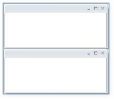
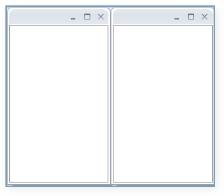
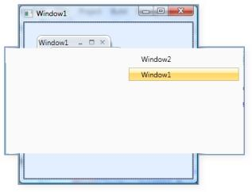

# Other Features

## Using Adorner Drag Provider and Adorner FloatWindow

There are two ways to display the Drag provider in DockingManager. One is to display it as a popup, which is default and the other is to display it in an adorner layer for this you need to enable [UseAdornerDragProvider](https://help.syncfusion.com/cr/wpf/Syncfusion.Windows.Tools.Controls.DockingManager.html#Syncfusion_Windows_Tools_Controls_DockingManager_UseAdornerDragProvider) property to display the Drag provider as Adorner layer.





<syncfusion:DockingManager Name="DockingManager"  UseAdornerDragProvider="True">

<Grid/>

</syncfusion:DockingManager>





DockingManager.UseAdornerDragProvider = true;



 

Similarly, Float child can be displayed in two ways.  One is using the popup and another is using the adorner layer. The Adorner Float window is enabled by setting UseAdornerFloatWindow=true.





<syncfusion:DockingManager Name="DockingManager" UseAdornerFloatWindow="True">  

<Grid/>

</syncfusion:DockingManager>




DockingManager.UseAdornerFloatWindow = true;



 

## ActiveWindow Changed Event

The [ActiveWindowChanged](https://help.syncfusion.com/cr/wpf/Syncfusion.Windows.Tools.Controls.DockingManager.html) event is raised whenever the [ActiveWindow](https://help.syncfusion.com/cr/wpf/Syncfusion.Windows.Tools.Controls.DockingManager.html#Syncfusion_Windows_Tools_Controls_DockingManager_ActiveWindow) property of DockingManager is changed. This event is used whenever you need to track the change in ActiveChild and do some content changes to the child. The following example demonstrates the changing of the Child header, based on the ActiveWindow.





<syncfusion:DockingManager Name="DockingManager" ActiveWindowChanged="DockingManager_ActiveWindowChanged">            

<Grid/>            

<Grid/>

</syncfusion:DockingManager>





//Changing the ActiveWindow Header based on active window change

private void DockingManager_ActiveWindowChanged(DependencyObject d, DependencyPropertyChangedEventArgs e)
{     
if (e.NewValue != null)     
{       
FrameworkElement element = e.NewValue as FrameworkElement;       
DockingManager.SetHeader(element, "Active");     
}     

if (e.OldValue != null)     
{       
FrameworkElement element = e.OldValue as FrameworkElement;       
DockingManager.SetHeader(element, "");     
}
}    



 

## AutoHide Animation Start /Stop Events

[AutoHideAnimationStart](https://help.syncfusion.com/cr/wpf/Syncfusion.Windows.Tools.Controls.DockingManager.html) event will raise whenever you click on the AWL AutoHide button. Similarly [AutoHideAnimationStop](https://help.syncfusion.com/cr/wpf/Syncfusion.Windows.Tools.Controls.DockingManager.html) is raised after [AutoHideAnimationStart](https://help.syncfusion.com/cr/wpf/Syncfusion.Windows.Tools.Controls.DockingManager.html) indicates that animation is completed. You can use these events to update the relevant information in UI or to do some UI related manipulations.

## AutoHide Visibility

[CanAutoHide](https://help.syncfusion.com/cr/wpf/Syncfusion.Windows.Tools.Controls.DockItem.html#Syncfusion_Windows_Tools_Controls_DockItem_CanAutoHide) property is used to enable and disable the AutoHidden state of children. When CanAutoHide=False, the AWL AutoHidden button will be hidden.





<syncfusion:DockingManager Name="DockingManager">  

<Grid Name="grid1" syncfusion:DockingManager.CanAutoHide="False"/>

</syncfusion:DockingManager>





DockingManager.SetCanAutoHide(grid1, false);



 

## Enabling/Disabling Animation on mouse over for auto hide

By default, whenever you move your mouse over the AutoHidden tab, the auto hide animation will start. You can disable this behavior by setting the [IsAutoHideAnimationOnMouseOver](https://help.syncfusion.com/cr/wpf/Syncfusion.Windows.Tools.Controls.DockingManager.html#Syncfusion_Windows_Tools_Controls_DockingManager_IsAnimationEnabledOnMouseOver)=true so that when you move the mouse over the auto hide tab it does not start the AutoHide animation.  But it will make you click the auto hide tab to start auto hide animation.





<syncfusion:DockingManager Name="DockingManager" IsAnimationEnabledOnMouseOver="True" >   

<Grid/>

</syncfusion:DockingManager>





DockingManager.IsAnimationEnabledOnMouseOver = true;



 

## AutoHide Animation Delay

You can control the animation speed of auto hide by using the [AnimationDelay](https://help.syncfusion.com/cr/wpf/Syncfusion.Windows.Tools.Controls.DockItem.html#Syncfusion_Windows_Tools_Controls_DockItem_AnimationDelay) property as given below :





<syncfusion:DockingManager Name="DockingManager" IsAnimationEnabledOnMouseOver="True" >  

<Grid syncfusion:DockingManager.AnimationDelay="100"/>

</syncfusion:DockingManager>





Duration dur = new Duration(new TimeSpan(100));

DockingManager.SetAnimationDelay(element, dur);



 

## Events for ContextMenu and BeforeOpen

[BeforeContextMenuOpen](https://help.syncfusion.com/cr/wpf/Syncfusion.Windows.Tools.Controls.DockingManager.html) – When the user right clicks on the header of the Docked Child, this can be used to initiate the various actions before the context menu open.





<syncfusion:DockingManager Name="DockingManager"  BeforeContextMenuOpen="DockingManager_BeforeContextMenuOpen">    

<Grid/>

</syncfusion:DockingManager>





private void DockingManager_BeforeContextMenuOpen(object sender, RoutedEventArgs e)
{    
//TODO:your code here.
}



 

## DockAbility of Child

[DockAbility](https://help.syncfusion.com/cr/wpf/Syncfusion.Windows.Tools.Controls.DockItem.html#Syncfusion_Windows_Tools_Controls_DockItem_DockAbility) is the property, which is used to decide whether which child can be allowed to dock in using the internal Drag Provider.



DockAbility ability=DockAbility.None;

ability |= DockAbility.Left;

ability |= DockAbility.Right;

DockingManager.SetDockAbility(grid1, ability);



## Get/Set DockedElementTabbed host size

Get/Set HostSize() method has direct control over the size of the [DockedElementTabbedHost](https://help.syncfusion.com/cr/wpf/Syncfusion.Windows.Tools.Controls.DockedElementTabbedHost.html),  which  acts as a container for the docking child in both Dock and Float state. The container for Dock and Float state, which belongs to the given element, can be obtained as follows.



//To get DockedElementTabbedHost Container for Dock State.

DockedElementTabbedHost dockHost = DockingManager.ResolveHost(element, DockState.Dock);

//To get DockedElementTabbedHost Container for float State.

DockedElementTabbedHost floathost = DockingManager.ResolveHost(element, DockState.Float);



Now you can set the size of the host as follows:



//To get DockedElementTabbedHost Container for Dock State.

DockedElementTabbedHost dockHost = DockingManager.ResolveHost(element, DockState.Dock);

//To set HostSize.

DockingManager.SetHostSize(dockHost, new Size(50, 100));

//To get HostSize.

Size hostsize = DockingManager.GetHostSize(dockHost);



## Disabling the Header of the Docked Window

[NoHeader](https://help.syncfusion.com/cr/wpf/Syncfusion.Windows.Tools.Controls.DockItem.html#Syncfusion_Windows_Tools_Controls_DockItem_NoHeader) is the attached property, which is used to hide the header of the Docked Child .This can be shown below.





<syncfusion:DockingManager Name="DockingManager">   

	<Grid Name="grid1"  syncfusion:DockingManager.NoHeader="True">       

		<TextBlock Text="Content with Noheader"/>   

	</Grid>

</syncfusion:DockingManager>





DockingManager.SetNoHeader(grid1, true);



 

## Detecting the maximized state of the MDI window

[IsInMDIMaximizedState](https://help.syncfusion.com/cr/wpf/Syncfusion.Windows.Tools.Controls.DockingManager.html#Syncfusion_Windows_Tools_Controls_DockingManager_IsInMDIMaximizedState) property indicates whether any of the MDI children is in a maximized state.



bool mdimax = DockingManager.IsInMDIMaximizedState;



## Setting MDI Layout

[SetMDILayout](https://help.syncfusion.com/cr/wpf/Syncfusion.Windows.Tools.Controls.DockingManager.html#Syncfusion_Windows_Tools_Controls_DockingManager_SetMDILayout_Syncfusion_Windows_Tools_Controls_MDILayout_) method is used to set the MDILayout of the child. There are three types of layouts that are available: They are:

* Cascade
* Horizontal
* Vertical

#### Cascade:

Cascade layout just cascades the window one by one as shown below:



DockingManager.SetMDILayout(MDILayout.Cascade);



#### Horizontal:

This layout arranges the MDI windows in a horizontal manner as shown below:



DockingManager.SetMDILayout(MDILayout.Horizontal);



#### Vertical Layout:

This layout arranges the MDI windows in a vertical manner as shown below:



DockingManager.SetMDILayout(MDILayout.Vertical);



## Rolling the FloatWindow up

[IsRollupFloatWindow](https://help.syncfusion.com/cr/wpf/Syncfusion.Windows.Tools.Controls.DockingManager.html#Syncfusion_Windows_Tools_Controls_DockingManager_IsRollupFloatWindow) property is used to enable the RollUp feature of Float window when it is double clicked.





<syncfusion:DockingManager Name="DockingManager">

	<Grid Name="grid1" syncfusion:DockingManager.State="Float" syncfusion:DockingManager.IsRollupFloatWindow="True"/>
	
	</syncfusion:DockingManager>





DockingManager.SetIsRollupFloatWindow(grid1, true);



 

This can also be applied to all the children of DockingManager as follows:





<syncfusion:DockingManager Name="DockingManager" IsRollupFloatWindow="True">  

	<Grid Name="grid1" syncfusion:DockingManager.State="Float"/>   

	<Grid Name="grid2" syncfusion:DockingManager.State="Float"/>

</syncfusion:DockingManager>





DockingManager.IsRollupFloatWindow = true;



  

## Different Keyboard Navigation Modes

[SwitchMode](https://help.syncfusion.com/cr/wpf/Syncfusion.Windows.Tools.Controls.DockingManager.html#Syncfusion_Windows_Tools_Controls_DockingManager_SwitchMode) is a property used to specify the different types of switches while using   ctrl + tab navigation. There are five types of switches available. They are:

* Immediate
* List
* QuickTabs
* VistaFlip and 
* VS2005

### Immediate Mode:

### List Mode:

### QuickTabs:

### Vista Flip:

### VS2005:

## VS2010 Behavior of Docking Manager

This feature enables the user to drag the TDI Windows, which will automatically generate the Float window which will then be dropped at any corner of the docked windows or dropped at any specific TDI Index.

### Use Case Scenarios

Users can drag the TDI window which will automatically generate the Float window which can be dropped at any corner of the docked windows instead of using Context Menu to choose Floating and then Dockable to achieve the above operation.

#### Properties

* [IsVS2010DraggingEnabled](https://help.syncfusion.com/cr/wpf/Syncfusion.Windows.Tools.Controls.DockingManager.html#Syncfusion_Windows_Tools_Controls_DockingManager_IsVS2010DraggingEnabled)

### Adding VS2010 Behavior to an Application 

The VS2010 behavior can be enabled by setting [IsVS2010DraggingEnabled](https://help.syncfusion.com/cr/wpf/Syncfusion.Windows.Tools.Controls.DockingManager.html#Syncfusion_Windows_Tools_Controls_DockingManager_IsVS2010DraggingEnabled) property to true which will enable the VS2010 drag and drop support of TDI Windows. The default value is set to false.

The property in Docking Manager and can be set in the following ways:

* Through XAML
* Through Code behind





<syncfusion:DockingManager UseDocumentContainer="True" Grid.RowSpan="2"  IsVS2010DraggingEnabled="True">            

   <StackPanel syncfusion:DockingManager.Header="Tabbed Window 1" syncfusion:DockingManager.State="Document"/>            
   
   <ContentControl syncfusion:DockingManager.Header="Tabbed Window 2" syncfusion:DockingManager.State="Document"/>            
   
   <ContentControl syncfusion:DockingManager.Header="Tabbed Window 3" syncfusion:DockingManager.State="Document"/>            
   
   <ContentControl syncfusion:DockingManager.Header="Tabbed Window 4" syncfusion:DockingManager.State="Document"/>            
   
   <ContentControl syncfusion:DockingManager.Header="Tabbed Window 5" syncfusion:DockingManager.State="Document"/>        

</syncfusion:DockingManager>





DockingManager dockingManager = new DockingManager();           

 dockingManager.IsVS2010DraggingEnabled = true;
 


 

## Support to Enable or Disable Resize in Docked and Float Windows

 Support has been added to enable or disable resize in docked and float windows.

### Use Case Scenarios

Using this feature, users can decide whether the docked and float windows can be resized or not.

### Tables for Properties, Methods, and Events

#### Properties

* [CanResizeInDockedState](https://help.syncfusion.com/cr/wpf/Syncfusion.Windows.Tools.Controls.DockItem.html#Syncfusion_Windows_Tools_Controls_DockItem_CanResizeInDockedState)
* [CanResizeInFloatState](https://help.syncfusion.com/cr/wpf/Syncfusion.Windows.Tools.Controls.DockItem.html#Syncfusion_Windows_Tools_Controls_DockItem_CanResizeInFloatState)
* [CanResizeHeightInDockedState](https://help.syncfusion.com/cr/wpf/Syncfusion.Windows.Tools.Controls.DockItem.html#Syncfusion_Windows_Tools_Controls_DockItem_CanResizeHeightInDockedState)
* [CanResizeWidthInDockedState](https://help.syncfusion.com/cr/wpf/Syncfusion.Windows.Tools.Controls.DockItem.html#Syncfusion_Windows_Tools_Controls_DockItem_CanResizeWidthInDockedState)
* [CanResizeHeightInFloatState](https://help.syncfusion.com/cr/wpf/Syncfusion.Windows.Tools.Controls.DockItem.html#Syncfusion_Windows_Tools_Controls_DockItem_CanResizeHeightInFloatState)
* [CanResizeWidthInFloatState](https://help.syncfusion.com/cr/wpf/Syncfusion.Windows.Tools.Controls.DockItem.html#Syncfusion_Windows_Tools_Controls_DockItem_CanResizeWidthInFloatState)

### Sample Link

SystemDrive\Users\<user_name>\AppData\Local\Syncfusion\EssentialStudio\&lt;Version_number&gt;\ WPF\Tools.WPF\Samples\3.5\WindowsSamples\Docking Manager\Docking Demo

### Adding CanResize properties to an Application 

Users can decide whether the docked and float windows can be resized or not using the CanResize properties. 

* [CanResizeInDockedState](https://help.syncfusion.com/cr/wpf/Syncfusion.Windows.Tools.Controls.DockItem.html#Syncfusion_Windows_Tools_Controls_DockItem_CanResizeInDockedState): To enable resize for docked windows, set this property to True. To disable resize for the docked windows, set this property to False. By default the value of the [CanResizeInDockedState](https://help.syncfusion.com/cr/wpf/Syncfusion.Windows.Tools.Controls.DockItem.html#Syncfusion_Windows_Tools_Controls_DockItem_CanResizeInDockedState) property is set to True.
* [CanResizeInFloatState](https://help.syncfusion.com/cr/wpf/Syncfusion.Windows.Tools.Controls.DockItem.html#Syncfusion_Windows_Tools_Controls_DockItem_CanResizeInFloatState): To enable resize for float windows, set this property to True. To disable resize for the float windows, set this property to False. By default the value of the [CanResizeInFloatState](https://help.syncfusion.com/cr/wpf/Syncfusion.Windows.Tools.Controls.DockItem.html#Syncfusion_Windows_Tools_Controls_DockItem_CanResizeInFloatState) property is set to True.
* [CanResizeHeightInDockedState](https://help.syncfusion.com/cr/wpf/Syncfusion.Windows.Tools.Controls.DockItem.html#Syncfusion_Windows_Tools_Controls_DockItem_CanResizeHeightInDockedState): To enable only height resize for docked windows, set this property to True. To disable only height resize for the docked windows, set this property to False. By default the value of the [CanResizeHeightInDockedState](https://help.syncfusion.com/cr/wpf/Syncfusion.Windows.Tools.Controls.DockItem.html#Syncfusion_Windows_Tools_Controls_DockItem_CanResizeHeightInDockedState) property is set to True.
* [CanResizeWidthInDockedState](https://help.syncfusion.com/cr/wpf/Syncfusion.Windows.Tools.Controls.DockItem.html#Syncfusion_Windows_Tools_Controls_DockItem_CanResizeWidthInDockedState): To enable only width resize for docked windows, set this property to True. To disable only width resize for the docked windows, set this property to False. By default the value of the [CanResizeWidthInDockedState](https://help.syncfusion.com/cr/wpf/Syncfusion.Windows.Tools.Controls.DockItem.html#Syncfusion_Windows_Tools_Controls_DockItem_CanResizeWidthInDockedState) property is set to True.
* [CanResizeHeightInFloatState](https://help.syncfusion.com/cr/wpf/Syncfusion.Windows.Tools.Controls.DockItem.html#Syncfusion_Windows_Tools_Controls_DockItem_CanResizeHeightInFloatState): To enable only height resize for float windows, set this property to True. To disable only height resize for the float windows, set this property to False. By default the value of the [CanResizeHeightInFloatState](https://help.syncfusion.com/cr/wpf/Syncfusion.Windows.Tools.Controls.DockItem.html#Syncfusion_Windows_Tools_Controls_DockItem_CanResizeHeightInFloatState) property is set to True.
* [CanResizeWidthInFloatState](https://help.syncfusion.com/cr/wpf/Syncfusion.Windows.Tools.Controls.DockItem.html#Syncfusion_Windows_Tools_Controls_DockItem_CanResizeWidthInFloatState): To enable only width resize for float windows, set this property to True. To disable only width resize for the float windows, set this property to False. By default the value of the [CanResizeWidthInFloatState](https://help.syncfusion.com/cr/wpf/Syncfusion.Windows.Tools.Controls.DockItem.html#Syncfusion_Windows_Tools_Controls_DockItem_CanResizeWidthInFloatState) property is set to True.

The following code snippet shows how to set values for the CanResize properties: 





<syncfusion:DockingManager x:Name="dockingManager">

<!-- Product Showcase Window -->

<ListBox BorderThickness="0" Name="Parent1" syncfusion:DockingManager.Header="Product Showcase" syncfusion:DockingManager.CanResizeInDockedState="false" syncfusion:DockingManager.CanResizeInFloatState ="false" >

</ListBox>

<!-- Docking Manager Window-->

<ListBox BorderThickness="0" syncfusion:DockingManager.TargetNameInDockedMode="Parent1"syncfusion:DockingManager.SideInDockedMode="Bottom" syncfusion:DockingManager.Header="Docking Manager"syncfusion:DockingManager.CanResizeHeightInDockedState="false" syncfusion:DockingManager.CanResizeHeightInFloatState ="false"  >

</ListBox><!-- Ribbon Window-->

<ListBox BorderThickness="0" Name="Parent2"syncfusion:DockingManager.TargetNameInDockedMode="Parent1"syncfusion:DockingManager.SideInDockedMode="Right" syncfusion:DockingManager.Header="Ribbon" >

</ListBox>

<!-- TreeView Window-->

<ListBox BorderThickness="0" syncfusion:DockingManager.TargetNameInDockedMode="Parent2"syncfusion:DockingManager.SideInDockedMode="Right" syncfusion:DockingManager.Header="TreeView" syncfusion:DockingManager.CanResizeWidthInDockedState="false" syncfusion:DockingManager.CanResizeWidthInFloatState ="false" >

</ListBox>

</syncfusion:DockingManager > 





DockingManager.SetCanResizeInDockedState(Parent1, false);

DockingManager.SetCanResizeInFloatState(Parent1, false);

DockingManager.SetCanResizeHeightInDockedState(Parent2, false);

DockingManager.SetCanResizeWidthInDockedState(Parent2, false);

DockingManager.SetCanResizeHeightInFloatState(Parent2, false);

DockingManager.SetCanResizeWidthInFloatState(Parent2, false);



 

## Support to Enable or Disable Fixed Size for Docked Windows

Support to enable or disable fixed size for docked windows.

### Use Case Scenarios

Using this feature, users can decide whether the docked windows sizes can be made fixed or not.

### Tables for Properties, Methods, and Events

#### Properties

<table>
<tr>
<th>
Property </th><th>
Description </th><th>
Type </th><th>
Data Type </th></tr>
<tr>
<td>
IsFixedSize</td><td>
Used to enable or disable fixed size for docked window.</td><td>
Dependency Attached </td><td>
Bool</td></tr>
<tr>
<td>
IsFixedHeight</td><td>
Used to enable or disable fixed height for docked window.</td><td>
Dependency Attached </td><td>
Bool</td></tr>
<tr>
<td>
IsFixedWidth</td><td>
Used to enable or disable fixed width for docked window.</td><td>
Dependency Attached </td><td>
Bool</td></tr>
</table>

### Sample Link

SystemDrive\Users\<user_name>\AppData\Local\Syncfusion\EssentialStudio\<Version_number>\ WPF\Tools.WPF\Samples\3.5\WindowsSamples\Docking Manager\Docking Demo

### Adding Fixed Size Properties to an Application 

The user can decide whether the docked windows can be given a fixed size using the FixedSize properties. 

* [IsFixedSize](https://help.syncfusion.com/cr/wpf/Syncfusion.Windows.Tools.Controls.DockItem.html#Syncfusion_Windows_Tools_Controls_DockItem_IsFixedSize):To enable fixed sizes for the docked windows, set this property to True. To disable fixed sizes for the docked windows, set this property to False. By default the value of the IsFixedSize property is set to False. When fixed size is enabled for docked windows, the corresponding [CanResizeInDockedState](https://help.syncfusion.com/cr/wpf/Syncfusion.Windows.Tools.Controls.DockItem.html#Syncfusion_Windows_Tools_Controls_DockItem_CanResizeInDockedState) property should be set to False.
* [IsFixedHeight](https://help.syncfusion.com/cr/wpf/Syncfusion.Windows.Tools.Controls.DockItem.html#Syncfusion_Windows_Tools_Controls_DockItem_IsFixedHeight): To enable fixed height for the docked windows, set this property to True. To disable fixed height for the docked windows, set this property to False. By default the value of the [IsFixedHeight](https://help.syncfusion.com/cr/wpf/Syncfusion.Windows.Tools.Controls.DockItem.html#Syncfusion_Windows_Tools_Controls_DockItem_IsFixedHeight) property is set to False. When fixed height is enabled for docked windows, the corresponding [CanResizeHeightInDockedState](https://help.syncfusion.com/cr/wpf/Syncfusion.Windows.Tools.Controls.DockItem.html#Syncfusion_Windows_Tools_Controls_DockItem_CanResizeHeightInDockedState) property should be set to False.
* [IsFixedWidth](https://help.syncfusion.com/cr/wpf/Syncfusion.Windows.Tools.Controls.DockItem.html#Syncfusion_Windows_Tools_Controls_DockItem_IsFixedWidth): To enable fixed width for docked windows, set this property to True. To disable fixed width for the docked windows, set this property to False. By default the value of the IsFixedWidth property is set to False. When fixed width is enabled for docked windows, the corresponding [CanResizeWidthInDockedState](https://help.syncfusion.com/cr/wpf/Syncfusion.Windows.Tools.Controls.DockItem.html#Syncfusion_Windows_Tools_Controls_DockItem_CanResizeWidthInDockedState) property should be set to False.

The fixed-size docked windows will not have dockable options to allow other docked windows to be docked inside them.

The following code snippet shows how to set values for the FixedSize properties: 





<syncfusion:DockingManager x:Name="dockingManager">

<!-- Product Showcase Window -->

<ListBox BorderThickness="0" Name="Parent1" syncfusion:DockingManager.Header="Product Showcase" syncfusion:DockingManager.CanResizeInDockedState="false" syncfusion:DockingManager.IsFixedSize ="true" >

</ListBox>

<!-- Docking Manager Window--><ListBox BorderThickness="0" syncfusion:DockingManager.TargetNameInDockedMode="Parent1"syncfusion:DockingManager.SideInDockedMode="Bottom" syncfusion:DockingManager.Header="Docking Manager"syncfusion:DockingManager.CanResizeHeightInDockedState="false" syncfusion:DockingManager.IsFixedHeight ="true"  >

</ListBox>

<!-- Ribbon Window-->

<ListBox BorderThickness="0" Name="Parent2"syncfusion:DockingManager.TargetNameInDockedMode="Parent1"syncfusion:DockingManager.SideInDockedMode="Right" syncfusion:DockingManager.Header="Ribbon" syncfusion:DockingManager.CanResizeWidthInDockedState="false" syncfusion:DockingManager.IsFixedWidth ="true" >

</ListBox>

</syncfusion:DockingManager > 





DockingManager dockingmanager = new DockingManager();

dockingmanager.MaximizeButtonEnabled = true;

dockingmanager.MaximizeButtonMode = VisibilityMode.Disable;

Grid grid = new Grid();

DockingManager.SetCanMaximize(grid, false);

dockingmanager.Children.Add(grid);



 

## Support to manage Maximize Button Visibility in Docking Windows

This support will be useful to decide whether the Maximize button should be disabled or collapsed when the [CanMaximize](https://help.syncfusion.com/cr/wpf/Syncfusion.Windows.Tools.Controls.DockItem.html#Syncfusion_Windows_Tools_Controls_DockItem_CanMaximize) property is set to False.

### Use Case Scenarios

This support enhances the usability of the Maximize button.

### Tables for Properties, Methods, and Events

#### Properties

* [MaximizeButtonMode](https://help.syncfusion.com/cr/wpf/Syncfusion.Windows.Tools.Controls.DockingManager.html#Syncfusion_Windows_Tools_Controls_DockingManager_MaximizeButtonMode)

### Sample Link

N/A

### Adding MaximizeButtonMode to an Application 

The user can choose whether the Maximize button should be collapsed or disabled when the CanMaximize property is set to False. 

By setting VisibilityMode as Collapsed when the [CanMaximize](https://help.syncfusion.com/cr/wpf/Syncfusion.Windows.Tools.Controls.DockItem.html#Syncfusion_Windows_Tools_Controls_DockItem_CanMaximize) property is set to False, the Maximize button will be collapsed. By setting VisibilityMode as Disable, the Maximize button is visible, but we set the IsEnabled property of the Maximize button to False.

The following code snippet shows how to set values for the [MaximizeButtonMode](https://help.syncfusion.com/cr/wpf/Syncfusion.Windows.Tools.Controls.DockingManager.html#Syncfusion_Windows_Tools_Controls_DockingManager_MaximizeButtonMode) property: 





<syncfusion:DockingManager MaximizeButtonEnabled="True" MaximizeButtonMode="Disable" >   

<Grid syncfusion:DockingManager.CanMaximize="True" />

</syncfusion:DockingManager>





DockingManager dockingmanager = new DockingManager();

dockingmanager.MaximizeButtonEnabled = true;

dockingmanager.MaximizeButtonMode = VisibilityMode.Disable;

Grid grid = new Grid();DockingManager.SetCanMaximize(grid, false);

dockingmanager.Children.Add(grid);



 

## Native Float Window

### UseNativeFloatWindow

The [UseNativeFloatWindow](https://help.syncfusion.com/cr/wpf/Syncfusion.Windows.Tools.Controls.DockingManager.html#Syncfusion_Windows_Tools_Controls_DockingManager_UseNativeFloatWindow) property is used to enable or disable the native float window which inherits the window architecture. By disabling this property, you can use the existing float window.

### Adding Native Float Window to an Application 

By enabling the [UseNativeFloatWindow](https://help.syncfusion.com/cr/wpf/Syncfusion.Windows.Tools.Controls.DockingManager.html#Syncfusion_Windows_Tools_Controls_DockingManager_UseNativeFloatWindow) property, you can use the native float window as a floating window. This property cannot be changed dynamically.





 dockingmanager.UseNativeFloatWindow = true;
 




<Syncfusion:DockingManager x:Name="dockingmanager" UseNativeFloatWindow="True" >    

<ContentControl Syncfusion:DockingManager.Header="Item1"/>

</Syncfusion:DockingManager>

</td></tr>



 

### CanFloatMaximize

The [CanFloatMaximize](https://help.syncfusion.com/cr/wpf/Syncfusion.Windows.Tools.Controls.DockItem.html#Syncfusion_Windows_Tools_Controls_DockItem_CanFloatMaximize) property allows the native float window to get maximized using the Maximize button. By using this property, you can make the Maximize button visible on the title bar of the native floating window.

### Maximizing the Native Float Window

By enabling the [CanFloatMaximize](https://help.syncfusion.com/cr/wpf/Syncfusion.Windows.Tools.Controls.DockItem.html#Syncfusion_Windows_Tools_Controls_DockItem_CanFloatMaximize) property, the native float window can be maximized.





 DockingManager.SetCanFloatMaximize(Item1, true);





<Syncfusion:DockingManager x:Name="dockingmanager" UseNativeFloatWindow="True" > 
           
<ContentControl x:Name="Item1" Syncfusion:DockingManager.Header="Item1" Syncfusion:DockingManager.CanFloatMaximize="True"/>

</Syncfusion:DockingManager></td></tr>



 

## Support to Add Document Tab Group

This feature provides a document tab group that can be added at run time. It supports both horizontal and vertical orientation, and allows elements to be added into an existing tab group. 

### Use Case Scenarios

Users can add a document tab group at run time in either a horizontal and vertical orientation, instead of using the context menu to create a new horizontal tab group or new vertical tab group.

### Tables for Properties, Methods, and Events

#### Methods

* [CreateHorizontalTabGroup](https://help.syncfusion.com/cr/wpf/Syncfusion.Windows.Tools.Controls.DockingManager.html#Syncfusion_Windows_Tools_Controls_DockingManager_CreateHorizontalTabGroup_System_Windows_UIElement_)
* [CreateVerticalTabGroup](https://help.syncfusion.com/cr/wpf/Syncfusion.Windows.Tools.Controls.DockingManager.html#Syncfusion_Windows_Tools_Controls_DockingManager_CreateVerticalTabGroup_System_Windows_UIElement_)
* [AddElementToTabGroup](https://help.syncfusion.com/cr/wpf/Syncfusion.Windows.Tools.Controls.DockingManager.html#Syncfusion_Windows_Tools_Controls_DockingManager_AddElementToTabGroup_Syncfusion_Windows_Tools_Controls_DocumentTabControl_System_Windows_UIElement_)

#### Events

* [TabGroupCreated](https://help.syncfusion.com/cr/wpf/Syncfusion.Windows.Tools.Controls.DockingManager.html)
* [MoveToOtherTabGroup](https://help.syncfusion.com/cr/wpf/Syncfusion.Windows.Tools.Controls.DockingManager.html)

### Adding a Document Tab Group to an Application 

#### CreateHorizontalTabGroup

To create a horizontal tab group as a new element, use the following code:



FrameworkElement newelement = new FrameworkElement();

DockingManager.SetState(newelement as DependencyObject, DockState.Document);

DockingManager.SetHeader(newelement as DependencyObject, "TabGroup1");

dockingManager.CreateHorizontalTabGroup(newelement);



To create a horizontal tab group as an existing element in the docking manager children collection, use the following code:



dockingManager.CreateHorizontalTabGroup(dockingManager.Children[2]);



#### CreateVerticalTabGroup

To create a vertical tab group as a new element, use the following code:



FrameworkElement newelement = new FrameworkElement();

DockingManager.SetState(newelement as DependencyObject, DockState.Document);

DockingManager.SetHeader(newelement as DependencyObject, "TabGroup1");

dockingManager.CreateVerticalTabGroup(newelement);



To create a vertical tab group as an existing element in the docking manager children collection, use the following code:



dockingManager.CreateVerticalTabGroup(dockingManager.Children[2]);



#### AddElementToTabGroup

To add an element to an existing tab group, use the following code:



FrameworkElement newelement = new FrameworkElement();

DockingManager.SetState(newelement as DependencyObject, DockState.Document);

DockingManager.SetHeader(newelement as DependencyObject, "TabGroup1");

DocumentTabControl targetTabGroup =  DockingManager.GetTabControl(dockingManager.Children[0]) as DocumentTabControl;

dockingManager.AddElementToTabGroup(targetTabGroup, newelement);

